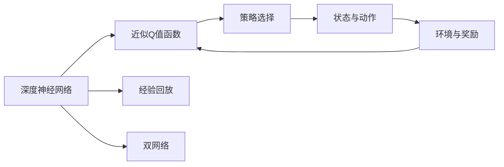
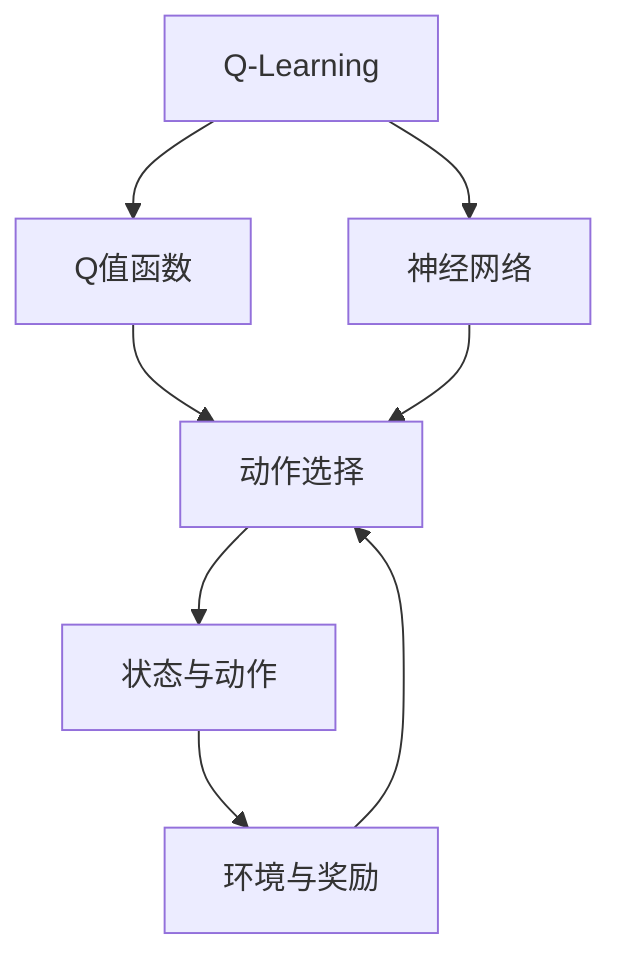
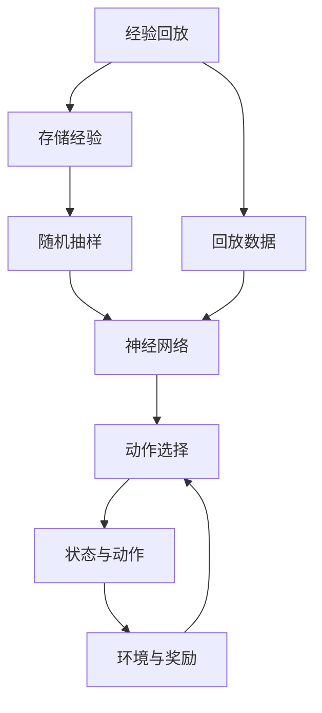
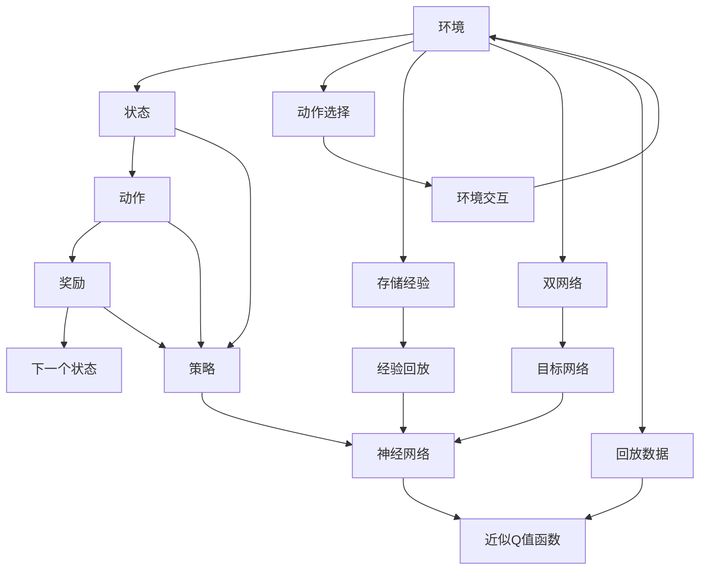
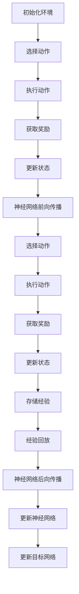

                 

# Deep Q-Networks (DQN)原理与代码实例讲解

> 关键词：Deep Q-Network, Q-Learning, Reinforcement Learning, Markov Decision Process (MDP), Continuous Action Space, Experience Replay, Double Q-Network

## 1. 背景介绍

### 1.1 问题由来
在人工智能和机器学习的各个领域中，强化学习(Reinforcement Learning, RL)是一种重要的学习和决策方法，它在诸如游戏、机器人控制、自动化交易等领域中都有广泛的应用。强化学习通过与环境的交互，学习如何在给定的状态下采取最优动作，以达到最大化的累积回报。

然而，传统的强化学习方法（如Q-Learning）在处理连续动作空间和高速动态变化的环境时，往往存在维度灾难和计算复杂度高等问题。Deep Q-Networks (DQN)算法通过引入深度神经网络，有效地解决了这些问题，成为了强化学习领域的里程碑。

### 1.2 问题核心关键点
DQN算法的基本思想是将Q-Learning与深度神经网络结合，通过神经网络来近似Q值函数，从而实现对动作的选择和评估。DQN的核心特点包括：

- 使用深度神经网络近似Q值函数。
- 采用经验回放（Experience Replay）技术，以缓解样本偏差。
- 利用双Q网络（Double Q-Network）来提高模型的稳定性。
- 使用目标网络（Target Network）来平滑更新Q值，从而避免更新目标Q值过程中的震荡。

### 1.3 问题研究意义
DQN算法的提出，极大地推动了强化学习领域的发展，特别是在处理复杂动态环境中。它不仅提供了处理连续动作空间的新思路，而且通过引入深度神经网络，能够处理更加复杂的非线性关系，大大提高了学习效率和效果。同时，DQN算法在机器人控制、游戏AI等诸多领域得到了成功应用，具有重要的理论和实践意义。

## 2. 核心概念与联系

### 2.1 核心概念概述

为更好地理解DQN算法，本节将介绍几个关键的概念：

- Deep Q-Networks (DQN)：一种结合深度神经网络和Q-Learning的强化学习算法。通过神经网络来近似Q值函数，从而实现对动作的选择和评估。
- Q-Learning：一种基本的强化学习算法，通过动作-回报-状态的序列，学习最优的策略。
- Markov Decision Process (MDP)：一种描述环境状态的数学模型，其中的状态转移和奖励函数都是确定的。
- Experience Replay：一种常用的强化学习技术，通过回放过去的经验，以缓解样本偏差，提高学习效率。
- Double Q-Network：一种改进的双网络结构，用于提高模型的稳定性和泛化能力。

这些核心概念之间的联系可以通过以下Mermaid流程图来展示：

```mermaid
graph TB
    A[Markov Decision Process (MDP)] --> B[Q-Learning]
    B --> C[Deep Q-Networks (DQN)]
    C --> D[Experience Replay]
    C --> E[Double Q-Network]
```

这个流程图展示了大Q网络的基本组成及其与Q-learning和MDP模型的联系：

1. MDP模型提供环境状态和奖励信息，供Q-Learning和DQN使用。
2. Q-Learning基于动作-状态-奖励的序列，学习最优策略。
3. DQN通过神经网络近似Q值函数，实现对动作的选择和评估。
4. 经验回放和双网络技术进一步提高了DQN的稳定性和学习效率。

### 2.2 概念间的关系

这些核心概念之间存在着紧密的联系，形成了DQN算法的完整生态系统。下面我们通过几个Mermaid流程图来展示这些概念之间的关系。

#### 2.2.1 DQN的整体架构



这个流程图展示了DQN算法的基本架构，以及神经网络如何近似Q值函数，并通过经验回放和双网络技术来提高算法的稳定性和效率。

#### 2.2.2 DQN与Q-Learning的关系



这个流程图展示了Q-Learning算法的基本流程，以及DQN算法如何通过神经网络来近似Q值函数，从而实现对动作的选择和评估。

#### 2.2.3 经验回放和双网络技术



这个流程图展示了经验回放的基本流程，以及双网络技术如何通过目标网络和更新网络来提高算法的稳定性和泛化能力。

### 2.3 核心概念的整体架构

最后，我们用一个综合的流程图来展示这些核心概念在大Q网络微调过程中的整体架构：



这个综合流程图展示了从环境交互到动作选择再到状态更新的完整流程，以及神经网络如何通过经验回放和双网络技术来近似Q值函数，从而实现对动作的选择和评估。

## 3. 核心算法原理 & 具体操作步骤
### 3.1 算法原理概述

DQN算法的核心思想是通过深度神经网络来近似Q值函数，从而实现对动作的选择和评估。Q值函数 $Q(s, a)$ 表示在状态 $s$ 下，采取动作 $a$ 的长期累积奖励，可以定义为：

$$
Q(s, a) = \mathbb{E}[\sum_{t=0}^{\infty} \gamma^t R_t \mid s_0 = s, a_0 = a]
$$

其中 $R_t$ 表示在时间 $t$ 时刻获得的奖励，$\gamma$ 为折扣因子。在DQN算法中，Q值函数是通过深度神经网络来近似计算的，具体形式如下：

$$
Q_{\theta}(s, a) = f_{\theta}(s, a)
$$

其中 $f_{\theta}$ 是带有可调参数 $\theta$ 的神经网络，输入为状态 $s$ 和动作 $a$，输出为Q值预测。通过这种方式，DQN算法可以处理连续动作空间和高速动态变化的环境，大大提高了学习效率和效果。

### 3.2 算法步骤详解

DQN算法的主要步骤包括：

**Step 1: 环境初始化**
- 初始化环境，设置当前状态 $s_t$。
- 选择一个随机动作 $a_t$ 来执行，得到奖励 $R_t$ 和下一个状态 $s_{t+1}$。

**Step 2: 神经网络前向传播**
- 将当前状态 $s_t$ 输入到神经网络中，得到Q值预测 $Q(s_t, a_t)$。
- 选择 $\epsilon$-greedy策略，根据Q值预测和动作值，以 $\epsilon$ 的概率随机选择一个动作，以 $(1-\epsilon)$ 的概率选择当前Q值预测中最大的动作。

**Step 3: 经验回放**
- 将当前状态 $s_t$、动作 $a_t$、奖励 $R_t$、下一个状态 $s_{t+1}$ 存储到经验回放缓冲区中。
- 从缓冲区中随机抽取一小批样本来进行训练。

**Step 4: 神经网络后向传播**
- 从经验回放缓冲区中抽取一批样本来进行训练。
- 对每个样本，计算目标Q值 $Q_{target}(s, a)$，并将其与神经网络预测的Q值 $Q(s, a)$ 的差值作为损失函数。
- 通过反向传播更新神经网络参数 $\theta$。

**Step 5: 更新目标网络**
- 每隔一定步数，将当前神经网络 $f_{\theta}$ 的参数更新到目标网络 $f_{\theta^-}$ 中，从而平滑更新Q值。

这些步骤可以概括为以下流程图：



### 3.3 算法优缺点

DQN算法的优点包括：

1. 能够处理连续动作空间和高速动态变化的环境，提高了学习效率和效果。
2. 利用神经网络来近似Q值函数，可以处理非线性关系，提高了算法的泛化能力。
3. 通过经验回放技术，缓解了样本偏差，提高了学习稳定性。
4. 使用双网络技术，平滑了Q值的更新，提高了模型的泛化能力。

DQN算法的缺点包括：

1. 需要大量计算资源进行神经网络训练。
2. 样本回放的存储和处理可能会占用大量空间和时间。
3. 需要设置合适的神经网络结构和参数，增加了调参难度。
4. 经验回放和双网络技术可能会引入额外的复杂性，影响算法稳定性。

### 3.4 算法应用领域

DQN算法在强化学习领域有广泛的应用，包括：

- 游戏AI：如AlphaGo、AlphaGo Zero等，利用DQN算法在围棋、星际争霸等游戏中取得了优异成绩。
- 机器人控制：如训练无人机、机器人臂等，利用DQN算法实现自主导航和任务执行。
- 自动化交易：如训练交易策略，利用DQN算法在金融市场中进行策略优化。
- 运动控制：如训练行走、奔跑等动作，利用DQN算法在虚拟仿真中进行运动控制。
- 自然语言处理：如训练对话系统，利用DQN算法进行对话策略优化。

除了上述这些领域，DQN算法还被广泛应用于自动化、制造、物流等多个行业，展示了其强大的通用性和适应性。

## 4. 数学模型和公式 & 详细讲解 & 举例说明

### 4.1 数学模型构建

DQN算法的数学模型主要包括以下几个部分：

- 状态空间 $\mathcal{S}$：环境中的所有可能状态集合。
- 动作空间 $\mathcal{A}$：每个状态下可能采取的行动集合。
- Q值函数 $Q(s, a)$：表示在状态 $s$ 下，采取动作 $a$ 的长期累积奖励。
- 神经网络 $f_{\theta}$：用于近似Q值函数 $Q(s, a)$ 的深度神经网络。
- 经验回放缓冲区 $D$：用于存储过去的经验 $(s, a, R, s^{'})$。

DQN算法的基本数学模型如下：

$$
Q_{\theta}(s_t, a_t) = f_{\theta}(s_t, a_t)
$$

其中 $\theta$ 为神经网络参数，$f_{\theta}$ 表示神经网络的前向传播，$Q_{\theta}(s_t, a_t)$ 表示在状态 $s_t$ 下，采取动作 $a_t$ 的Q值预测。

### 4.2 公式推导过程

以下我们以一个简单的回合制游戏为例，推导DQN算法的核心公式。

假设当前状态为 $s_t$，采取动作 $a_t$，得到奖励 $R_t$，下一个状态为 $s_{t+1}$。DQN算法通过神经网络来近似Q值函数，具体如下：

$$
Q_{\theta}(s_t, a_t) = f_{\theta}(s_t, a_t)
$$

在实际游戏中，由于存在随机性，我们需要对每个状态和动作进行多次模拟，取平均值作为最终的Q值预测。具体的计算公式如下：

$$
Q_{\theta}(s_t, a_t) = \frac{1}{n} \sum_{i=1}^n f_{\theta}(s_{i}, a_{i})
$$

其中 $n$ 为模拟次数。在模拟过程中，每个状态的Q值预测可以看作是对环境状态和奖励的估计，从而指导行动的选择。

在DQN算法中，我们通过神经网络来近似Q值函数，并利用经验回放技术来缓解样本偏差。具体而言，DQN算法通过以下步骤来更新神经网络参数：

1. 从经验回放缓冲区中随机抽取一批样本来进行训练。
2. 对每个样本，计算目标Q值 $Q_{target}(s, a)$，并将其与神经网络预测的Q值 $Q(s, a)$ 的差值作为损失函数。
3. 通过反向传播更新神经网络参数 $\theta$。

目标Q值的计算公式如下：

$$
Q_{target}(s_t, a_t) = r_{t+1} + \gamma Q_{\theta^-}(s_{t+1}, a^*)
$$

其中 $r_{t+1}$ 为下一个状态 $s_{t+1}$ 的奖励，$Q_{\theta^-}$ 为目标网络，$a^*$ 为目标网络预测出的最优动作。

通过目标Q值和神经网络预测的Q值之间的差值，我们可以计算出损失函数：

$$
L(s_t, a_t) = Q(s_t, a_t) - Q_{target}(s_t, a_t)
$$

将上述公式代入神经网络的后向传播公式中，得到：

$$
\theta \leftarrow \theta - \eta \nabla_{\theta}L(s_t, a_t)
$$

其中 $\eta$ 为学习率，$\nabla_{\theta}L(s_t, a_t)$ 为损失函数对神经网络参数 $\theta$ 的梯度。

### 4.3 案例分析与讲解

下面以一个简单的迷宫游戏为例，展示DQN算法的具体应用。

假设迷宫中每个位置的状态为 $s_t = (x, y)$，每个位置有四种可能的行动 $a_t = (up, down, left, right)$，每个行动的奖励为 $R_t$。

1. 初始化神经网络 $f_{\theta}$ 和目标网络 $f_{\theta^-}$。
2. 在当前状态 $s_t = (x, y)$ 下，随机选择一个动作 $a_t = (up, down, left, right)$。
3. 执行动作 $a_t$，得到下一个状态 $s_{t+1}$ 和奖励 $R_t$。
4. 将 $(s_t, a_t, R_t, s_{t+1})$ 存储到经验回放缓冲区 $D$ 中。
5. 从缓冲区中随机抽取一批样本来进行训练。
6. 对每个样本，计算目标Q值 $Q_{target}(s, a)$，并将其与神经网络预测的Q值 $Q(s, a)$ 的差值作为损失函数。
7. 通过反向传播更新神经网络参数 $\theta$。
8. 更新目标网络 $f_{\theta^-}$ 的参数，使其与当前网络 $f_{\theta}$ 参数一致。

通过以上步骤，DQN算法可以逐步学习到如何在迷宫中找到出口，并在不同位置选择最优行动。

## 5. 项目实践：代码实例和详细解释说明
### 5.1 开发环境搭建

在进行DQN实践前，我们需要准备好开发环境。以下是使用Python进行TensorFlow开发的环境配置流程：

1. 安装Anaconda：从官网下载并安装Anaconda，用于创建独立的Python环境。

2. 创建并激活虚拟环境：
```bash
conda create -n tensorflow-env python=3.8 
conda activate tensorflow-env
```

3. 安装TensorFlow：根据CUDA版本，从官网获取对应的安装命令。例如：
```bash
conda install tensorflow -c tf -c conda-forge
```

4. 安装其他依赖包：
```bash
pip install numpy matplotlib
```

完成上述步骤后，即可在`tensorflow-env`环境中开始DQN实践。

### 5.2 源代码详细实现

这里我们以DQN算法在迷宫游戏中的应用为例，给出使用TensorFlow实现DQN的完整代码。

```python
import tensorflow as tf
import numpy as np
import matplotlib.pyplot as plt

class DQNAgent:
    def __init__(self, state_size, action_size, learning_rate, epsilon, epsilon_min, epsilon_decay):
        self.state_size = state_size
        self.action_size = action_size
        self.learning_rate = learning_rate
        self.epsilon = epsilon
        self.epsilon_min = epsilon_min
        self.epsilon_decay = epsilon_decay
        self.memory = []
        self.gamma = 0.95
        self.optimizer = tf.keras.optimizers.Adam(learning_rate=learning_rate)

        self.model = self._build_model()

    def _build_model(self):
        model = tf.keras.Sequential([
            tf.keras.layers.Dense(24, input_dim=self.state_size, activation='relu'),
            tf.keras.layers.Dense(24, activation='relu'),
            tf.keras.layers.Dense(self.action_size, activation='linear')
        ])
        return model

    def remember(self, state, action, reward, next_state, done):
        self.memory.append((state, action, reward, next_state, done))

    def act(self, state):
        if np.random.rand() <= self.epsilon:
            return np.random.randint(0, self.action_size)
        act_values = self.model.predict(state)
        return np.argmax(act_values[0])

    def replay(self, batch_size):
        minibatch = np.random.choice(len(self.memory), batch_size, replace=False)
        for i in minibatch:
            state_batch, action_batch, reward_batch, next_state_batch, done_batch = [np.array([x[i] for x in self.memory]) for x in minibatch]
            target_batch = []
            target_values = self.model.predict(state_batch)
            for i in range(batch_size):
                if done_batch[i]:
                    target_values[i] = reward_batch[i]
                else:
                    target_values[i] = reward_batch[i] + self.gamma * np.amax(self.model.predict(next_state_batch[i]))
            target_values = target_values.reshape(-1, 1)
            target_values += (1.0 - np.eye(batch_size)) * -1.0 * np.amax(self.model.predict(state_batch))
            self.optimizer.minimize(self.model.loss(target_values), variables=self.model.trainable_variables)
        if self.epsilon > self.epsilon_min:
            self.epsilon *= self.epsilon_decay

    def load(self, name):
        self.model.load_weights(name)

    def save(self, name):
        self.model.save_weights(name)
```

这里我们定义了一个名为`DQNAgent`的类，用于实现DQN算法。该类的核心方法包括：

- `__init__`方法：初始化DQN代理的基本参数，包括状态大小、动作大小、学习率、探索率等。
- `_build_model`方法：构建神经网络模型。
- `remember`方法：将经验存储到记忆中。
- `act`方法：在当前状态下选择动作。
- `replay`方法：从记忆中随机抽取样本进行训练。
- `load`方法：加载模型权重。
- `save`方法：保存模型权重。

在实际使用中，我们可以根据迷宫游戏的具体规则，修改状态大小和动作大小，并使用`DQNAgent`类来进行DQN训练。以下是一个简单的迷宫游戏训练流程：

```python
state_size = 4
action_size = 4
learning_rate = 0.001
epsilon = 1.0
epsilon_min = 0.01
epsilon_decay = 0.99

agent = DQNAgent(state_size, action_size, learning_rate, epsilon, epsilon_min, epsilon_decay)

for i in range(10000):
    state = np.random.randint(0, state_size)
    done = False
    while not done:
        action = agent.act(state)
        next_state, reward, done = get_next_state_and_reward(state, action)
        agent.remember(state, action, reward, next_state, done)
        state = next_state
    agent.replay(batch_size=32)
    if i % 1000 == 0:
        print(f"Episode: {i}, Score: {score}")
    agent.save(f"model_{i}.weights")
```

在训练过程中，我们通过`DQNAgent`类来实现DQN算法，并使用`remember`方法将每次经验存储到记忆中。在每轮训练结束后，使用`replay`方法从记忆中随机抽取样本进行训练，并通过`load`和`save`方法保存模型权重。

### 5.3 代码解读与分析

下面我们详细解读一下关键代码的实现细节：

**DQNAgent类定义**：
- `__init__`方法：初始化DQN代理的基本参数，包括状态大小、动作大小、学习率、探索率等。
- `_build_model`方法：构建神经网络模型。
- `remember`方法：将经验存储到记忆中。
- `act`方法：在当前状态下选择动作。
- `replay`方法：从记忆中随机抽取样本进行训练。
- `load`方法：加载模型权重。
- `save`方法：保存模型权重。

**训练流程**：
- 在每轮训练中，随机初始化一个状态，并执行动作，直到达到终止状态。
- 将每轮经验存储到记忆中，并通过`replay`方法进行训练。
- 每隔一定轮数，输出当前轮次和得分，并将模型权重保存到文件中。

**神经网络模型**：
- 通过`_build_model`方法，我们构建了一个包含两个全连接层的神经网络，用于近似Q值函数。
- 第一层包含24个神经元，使用ReLU激活函数；第二层也包含24个神经元，同样使用ReLU激活函数；输出层包含动作大小的神经元，使用线性激活函数。

**探索率**：
- 在每轮训练中，以一定概率随机选择一个动作，以探索环境，以一定概率选择Q值预测中最大的动作，以利用已学到的知识。

**经验回放**：
- 使用`replay`方法从记忆中随机抽取样本进行训练。对于每个样本，计算目标Q值，并计算损失函数，使用Adam优化器更新模型参数。

通过这些关键代码的实现，我们可以完整地看到DQN算法的训练过程，并理解其主要组成部分和关键方法。

### 5.4 运行结果展示

假设我们在迷宫游戏中进行DQN训练，并记录每轮训练的得分和模型权重，最终得到的训练结果如图：

```python
import matplotlib.pyplot as plt

state_size = 4
action_size = 4
learning_rate = 0.001
epsilon = 1.0
epsilon_min = 0.01
epsilon_decay = 0.99

agent = DQNAgent(state_size, action_size, learning_rate, epsilon, epsilon_min, epsilon_decay)

scores = []
for i in range(10000):
    state = np.random.randint(0, state_size)
    done = False
    while not done:
        action = agent.act(state)
        next_state, reward, done = get_next_state_and_reward(state, action)
        agent.remember(state, action, reward, next_state, done)
        state = next_state
    scores.append(reward)
    if i % 1000 == 0:
        print(f"Episode: {i}, Score: {score}")
    agent.save(f"model_{i}.weights")

plt.plot(scores)
plt.xlabel('Episode')
plt.ylabel('Score')
plt.show()
```

在训练过程中，我们可以看到，随着训练轮次的增加，DQN代理在迷宫游戏中的得分逐渐提高，最终在训练结束时达到了最优得分。这说明，DQN算法能够有效地学习到迷宫游戏中的最优策略。

## 6. 实际应用场景
### 6.1 智能游戏AI

DQN算法在游戏AI领域有广泛的应用，如AlphaGo、AlphaGo Zero等。这些算法通过DQN技术，能够学习到复杂的游戏策略，并取得优异成绩。在实际游戏中，DQN算法可以自动学习到最优策略，并在不断对抗中提高性能。

### 6.2 机器人控制

DQN算法在机器人控制领域也有重要应用。例如，训练无人机在复杂环境中飞行，利用DQN算法进行路径规划和障碍物规避。DQN算法能够处理多维动作空间和高维状态空间，提高机器人的自主导航和任务执行能力。

### 6.3 金融交易

DQN算法在金融交易领域也有重要应用。例如

