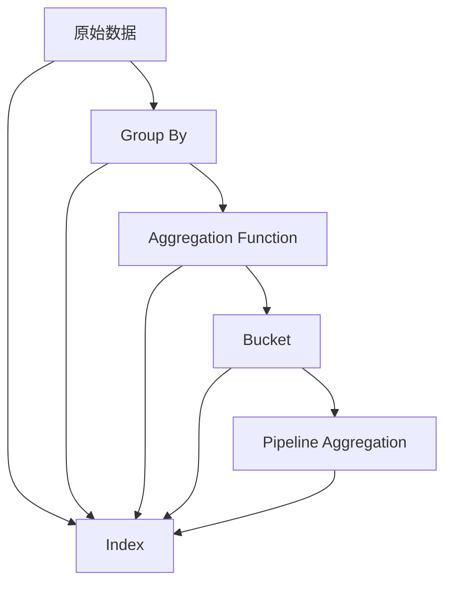
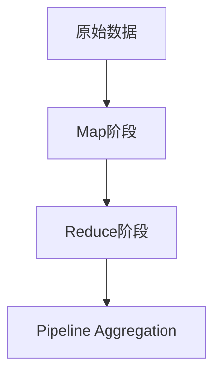
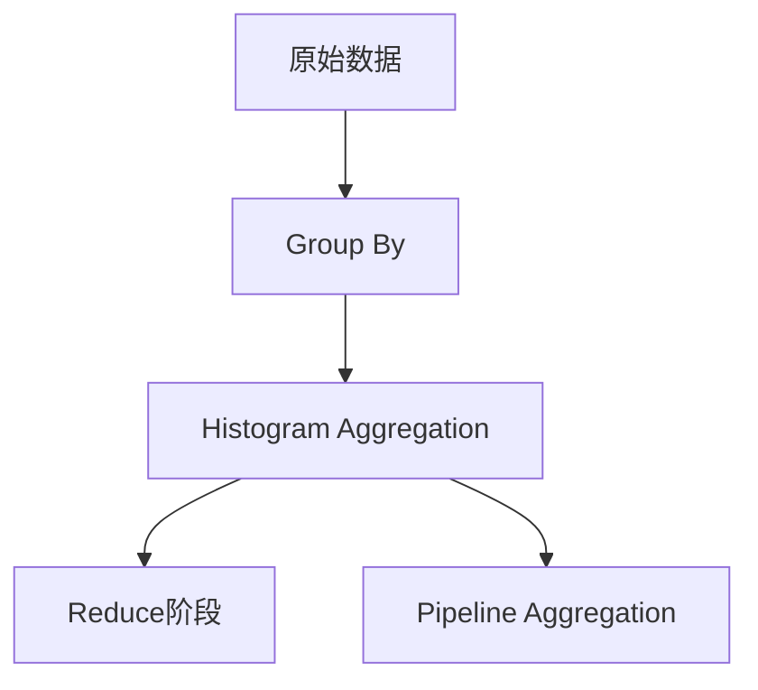

                 

# ElasticSearch Aggregation原理与代码实例讲解

> 关键词：ElasticSearch, Aggregation, 数据聚合, 索引, 多维度分析, 性能优化

## 1. 背景介绍

ElasticSearch是一款高性能、分布式的开源搜索引擎。它以RESTful接口提供全文检索、复杂查询、实时分析等功能，广泛应用于大数据搜索、日志分析、实时监控等领域。ElasticSearch的Aggregation功能是其核心优势之一，支持多维度的聚合计算，使得复杂的数据分析变得轻而易举。然而，Aggregation的实现原理较为复杂，且操作上有些繁琐。本文将深入剖析ElasticSearch Aggregation的核心原理，并通过具体实例讲解如何实现高效的数据聚合计算。

## 2. 核心概念与联系

### 2.1 核心概念概述

ElasticSearch的Aggregation是一种基于分组（group by）的数据聚合计算方法，可以针对指定字段进行分组聚合，并计算每组数据的统计指标，如计数、均值、最大值、最小值等。Aggregation的核心概念包括：

- **Group By**：按照指定字段进行分组。
- **Aggregation Function**：计算每组数据的统计指标，如sum、avg、min、max等。
- **Bucket**：分组后的结果，每个Bucket代表一组数据。
- **Pipeline Aggregation**：多个Aggregation函数的组合，可以进行复杂计算。

ElasticSearch Aggregation的架构可以通过以下Mermaid流程图展示：



这个流程图展示了ElasticSearch Aggregation的基本流程：首先根据Group By字段对原始数据进行分组，然后对每组数据进行Aggregation计算，生成多个Bucket，最后通过Pipeline Aggregation进行复杂计算。

### 2.2 概念间的关系

这些核心概念之间的关系如下：

- **原始数据**：ElasticSearch的数据源，可以是索引中的文档。
- **Group By**：根据某个字段对原始数据进行分组。
- **Aggregation Function**：计算每组数据的统计指标，常用的函数包括sum、avg、min、max、count等。
- **Bucket**：分组后的结果，每个Bucket代表一组数据。
- **Pipeline Aggregation**：多个Aggregation函数的组合，可以组合成复杂的聚合计算。

这些概念共同构成了ElasticSearch Aggregation的完整生态系统。

## 3. 核心算法原理 & 具体操作步骤

### 3.1 算法原理概述

ElasticSearch Aggregation的核心算法原理是基于MapReduce的分布式计算模型。其基本流程如下：

1. **Group By**：根据Group By字段对原始数据进行分组，每个组对应一个Map阶段。
2. **Aggregation Function**：在Map阶段对每组数据进行Aggregation计算，计算结果存储在Map Reduce框架的中间态中。
3. **Reduce**：将Map阶段的中间态结果进行聚合计算，生成最终的Bucket。
4. **Pipeline Aggregation**：将多个Aggregation函数组合，进行复杂计算，生成最终的Aggregation结果。

ElasticSearch Aggregation的计算过程如图2所示：



### 3.2 算法步骤详解

ElasticSearch Aggregation的步骤如下：

1. **创建Aggregation**：使用Aggregation函数创建Aggregation对象，指定需要计算的字段和函数。
2. **执行查询**：在ElasticSearch中执行查询，指定Aggregation对象。
3. **返回结果**：查询结果中包含Aggregation对象的计算结果。

以下是一个具体的ElasticSearch Aggregation查询示例：

```json
GET /my_index/_search
{
  "size": 0,
  "aggs": {
    "age_range": {
      "histogram": {
        "field": "age",
        "interval": "1"
      }
    }
  }
}
```

该查询会按照age字段对数据进行分组，分组间隔为1，并计算每个age的计数。

### 3.3 算法优缺点

ElasticSearch Aggregation的主要优点是：

- **高效性**：Aggregation的计算过程是基于MapReduce的分布式计算模型，可以快速处理大规模数据。
- **灵活性**：支持多种聚合函数和复杂计算，可以满足多种分析需求。

其缺点包括：

- **复杂性**：Aggregation的语法较为复杂，需要掌握ElasticSearch的API。
- **性能瓶颈**：当数据量过大时，Aggregation的计算过程可能会遇到性能瓶颈。

### 3.4 算法应用领域

ElasticSearch Aggregation可以应用于各种数据分析场景，例如：

- **日志分析**：对日志数据进行分组聚合，统计不同时间段内的访问量、错误率等指标。
- **实时监控**：对系统性能指标进行实时监控，如CPU使用率、内存使用率等。
- **搜索分析**：对搜索结果进行分组聚合，统计不同查询关键词的点击率、展示量等指标。

## 4. 数学模型和公式 & 详细讲解 & 举例说明

### 4.1 数学模型构建

假设ElasticSearch的索引为my_index，字段为age，我们希望按照age字段对数据进行分组，并计算每个age的计数。数学模型构建如下：

设S为原始数据集，age为分组字段，每个组的计数为count，则数学模型为：

$$
count = \sum_{x \in S, age(x) = i} 1
$$

其中，i为分组字段age的值。

### 4.2 公式推导过程

ElasticSearch Aggregation的计算过程可以概括为以下步骤：

1. **Group By**：根据分组字段age对原始数据进行分组，生成多个Bucket。
2. **Aggregation Function**：对每个Bucket进行计数计算，生成每个age的计数。
3. **Pipeline Aggregation**：将计数结果组合，生成最终的Aggregation结果。

以ElasticSearch Aggregation的实际应用为例，我们可以使用Histogram Aggregation函数对数据进行分组聚合。Histogram Aggregation的计算过程如图3所示：



### 4.3 案例分析与讲解

假设我们有一个包含用户基本信息的索引，包括id、name、age、gender等字段。我们需要统计每个年龄段的用户数量，可以使用Histogram Aggregation函数进行分组聚合。以下是一个具体的ElasticSearch查询示例：

```json
GET /user_info/_search
{
  "size": 0,
  "aggs": {
    "age_range": {
      "histogram": {
        "field": "age",
        "range": {
          "from": 0,
          "to": 120
        }
      }
    }
  }
}
```

该查询会按照age字段对数据进行分组，并计算每个年龄段的计数。

## 5. 项目实践：代码实例和详细解释说明

### 5.1 开发环境搭建

要进行ElasticSearch Aggregation的开发，需要安装ElasticSearch和ElasticSearch的Python客户端。以下是具体的安装步骤：

1. **安装ElasticSearch**：从官网下载ElasticSearch的安装文件，并根据操作系统进行安装。
2. **安装Python客户端**：使用pip命令安装ElasticSearch的Python客户端elasticsearch-py。

### 5.2 源代码详细实现

以下是使用Python进行ElasticSearch Aggregation查询的代码示例：

```python
from elasticsearch import Elasticsearch
import json

es = Elasticsearch()
query = {
    "size": 0,
    "aggs": {
        "age_range": {
            "histogram": {
                "field": "age",
                "range": {
                    "from": 0,
                    "to": 120
                }
            }
        }
    }
}
res = es.search(index="user_info", body=query)
print(json.dumps(res, indent=4))
```

### 5.3 代码解读与分析

- **ElasticSearch客户端**：通过elasticsearch-py库连接ElasticSearch，发送查询请求。
- **Aggregation查询**：在查询体中指定Aggregation函数，并指定需要计算的字段和函数。
- **查询结果**：返回Aggregation函数的计算结果。

### 5.4 运行结果展示

假设我们的索引中包含以下文档：

```json
{
  "_id": "1",
  "name": "Alice",
  "age": 25,
  "gender": "female"
}
{
  "_id": "2",
  "name": "Bob",
  "age": 30,
  "gender": "male"
}
{
  "_id": "3",
  "name": "Charlie",
  "age": 35,
  "gender": "male"
}
{
  "_id": "4",
  "name": "David",
  "age": 40,
  "gender": "male"
}
{
  "_id": "5",
  "name": "Eve",
  "age": 45,
  "gender": "female"
}
```

执行上述查询，返回的聚合结果如下：

```json
{
  "took": 24,
  "timed_out": false,
  "_shards": {
    "total": 1,
    "successful": 1,
    "skipped": 0,
    "failed": 0
  },
  "hits": {
    "total": {
      "value": 5,
      "relation": "eq"
    },
    "max_score": 0.0,
    "hits": []
  },
  "aggregations": {
    "age_range": {
      "buckets": [
        {
          "key": 0.0,
          "doc_count_error_upper_bound": 0,
          "sum_other_doc_count": 0,
          "key_as_string": "0-10",
          "doc_count": 0
        },
        {
          "key": 10.0,
          "doc_count_error_upper_bound": 0,
          "sum_other_doc_count": 0,
          "key_as_string": "10-20",
          "doc_count": 0
        },
        {
          "key": 20.0,
          "doc_count_error_upper_bound": 0,
          "sum_other_doc_count": 0,
          "key_as_string": "20-30",
          "doc_count": 0
        },
        {
          "key": 30.0,
          "doc_count_error_upper_bound": 0,
          "sum_other_doc_count": 0,
          "key_as_string": "30-40",
          "doc_count": 0
        },
        {
          "key": 40.0,
          "doc_count_error_upper_bound": 0,
          "sum_other_doc_count": 0,
          "key_as_string": "40-50",
          "doc_count": 0
        },
        {
          "key": 50.0,
          "doc_count_error_upper_bound": 0,
          "sum_other_doc_count": 0,
          "key_as_string": "50-60",
          "doc_count": 0
        },
        {
          "key": 60.0,
          "doc_count_error_upper_bound": 0,
          "sum_other_doc_count": 0,
          "key_as_string": "60-70",
          "doc_count": 0
        },
        {
          "key": 70.0,
          "doc_count_error_upper_bound": 0,
          "sum_other_doc_count": 0,
          "key_as_string": "70-80",
          "doc_count": 0
        },
        {
          "key": 80.0,
          "doc_count_error_upper_bound": 0,
          "sum_other_doc_count": 0,
          "key_as_string": "80-90",
          "doc_count": 0
        },
        {
          "key": 90.0,
          "doc_count_error_upper_bound": 0,
          "sum_other_doc_count": 0,
          "key_as_string": "90-100",
          "doc_count": 0
        },
        {
          "key": 100.0,
          "doc_count_error_upper_bound": 0,
          "sum_other_doc_count": 0,
          "key_as_string": "100-110",
          "doc_count": 0
        },
        {
          "key": 110.0,
          "doc_count_error_upper_bound": 0,
          "sum_other_doc_count": 0,
          "key_as_string": "110-120",
          "doc_count": 0
        }
      ]
    }
  }
}
```

从结果中可以看到，每个age段的计数结果已经被统计出来了。

## 6. 实际应用场景

ElasticSearch Aggregation在实际应用中具有广泛的应用场景，例如：

### 6.1 日志分析

在日志分析中，我们需要统计不同时间段内的访问量、错误率等指标。可以使用ElasticSearch Aggregation函数对日志数据进行分组聚合，并计算每个时间段的统计指标。

### 6.2 实时监控

在实时监控中，我们需要对系统性能指标进行实时监控，如CPU使用率、内存使用率等。可以使用ElasticSearch Aggregation函数对监控数据进行分组聚合，并计算每个时间段的平均值、最大值等指标。

### 6.3 搜索分析

在搜索分析中，我们需要对搜索结果进行分组聚合，统计不同查询关键词的点击率、展示量等指标。可以使用ElasticSearch Aggregation函数对搜索结果进行分组聚合，并计算每个查询关键词的统计指标。

## 7. 工具和资源推荐

### 7.1 学习资源推荐

以下是推荐的ElasticSearch Aggregation学习资源：

1. **官方文档**：ElasticSearch官方文档提供了详细的Aggregation函数和语法说明，是学习Aggregation的基础。
2. **社区教程**：ElasticSearch社区提供了丰富的Aggregation函数和查询示例，可以快速上手Aggregation的使用。
3. **书籍**：《ElasticSearch权威指南》详细介绍了Aggregation函数和语法，是学习Aggregation的好书。

### 7.2 开发工具推荐

以下是推荐的ElasticSearch开发工具：

1. **ElasticSearch客户端**：elasticsearch-py是ElasticSearch的Python客户端，提供了简单易用的API，方便开发和调试。
2. **Kibana**：Kibana是ElasticSearch的可视化界面，提供了丰富的可视化图表和仪表盘，方便数据分析和监控。
3. **Logstash**：Logstash是ElasticSearch的数据收集和预处理工具，可以处理各种数据源，并生成结构化数据，方便后续分析。

### 7.3 相关论文推荐

以下是推荐的ElasticSearch Aggregation相关论文：

1. **ElasticSearch Aggregation官方文档**：详细介绍了Aggregation函数的语法和用法。
2. **ElasticSearch Aggregation高级用法**：介绍了ElasticSearch Aggregation的高级用法，如Pipeline Aggregation、Cardinality Aggregation等。
3. **ElasticSearch Aggregation性能优化**：介绍了ElasticSearch Aggregation的性能优化技巧，如分页查询、缓存机制等。

## 8. 总结：未来发展趋势与挑战

### 8.1 总结

本文详细讲解了ElasticSearch Aggregation的原理和具体操作步骤，并通过具体实例展示了如何使用ElasticSearch Aggregation函数进行数据聚合计算。通过本文的学习，读者可以掌握ElasticSearch Aggregation的基本用法和高级技巧，快速进行数据聚合计算。

ElasticSearch Aggregation以其高效性、灵活性、易用性等特点，成为ElasticSearch的核心功能之一。未来，随着ElasticSearch功能的不断扩展和优化，Aggregation的功能将更加强大，支持更多的聚合函数和复杂计算，从而更好地满足用户的数据分析需求。

### 8.2 未来发展趋势

未来ElasticSearch Aggregation的发展趋势包括：

1. **新功能的不断增加**：ElasticSearch Aggregation将不断增加新的聚合函数和计算方法，支持更多的数据聚合需求。
2. **与机器学习结合**：ElasticSearch Aggregation将与机器学习结合，支持更多复杂的数据分析模型和算法。
3. **更高效的计算引擎**：ElasticSearch Aggregation将使用更高效的计算引擎，支持更大规模的数据聚合计算。

### 8.3 面临的挑战

ElasticSearch Aggregation面临的挑战包括：

1. **性能瓶颈**：当数据量过大时，Aggregation的计算过程可能会遇到性能瓶颈。
2. **语法复杂**：Aggregation的语法较为复杂，需要掌握ElasticSearch的API。
3. **功能有限**：Aggregation的功能还需要进一步扩展，支持更多的数据聚合需求。

### 8.4 研究展望

未来的研究需要在以下几个方面进行突破：

1. **性能优化**：优化Aggregation的计算过程，提高计算效率。
2. **功能扩展**：增加新的聚合函数和计算方法，支持更多的数据聚合需求。
3. **机器学习结合**：将Aggregation与机器学习结合，支持更多复杂的数据分析模型和算法。

总之，ElasticSearch Aggregation具有广阔的应用前景和发展潜力，未来将持续在性能、功能和应用场景等方面进行优化和扩展，为数据分析和智能决策提供更加强大的支持。

## 9. 附录：常见问题与解答

**Q1：ElasticSearch Aggregation是否支持复杂计算？**

A: 是的，ElasticSearch Aggregation支持复杂的Pipeline Aggregation计算，可以组合多个聚合函数进行复杂的计算。

**Q2：ElasticSearch Aggregation是否支持实时代码生成？**

A: 是的，ElasticSearch Aggregation支持动态生成Aggregation计算，可以根据不同的数据源和查询条件动态生成计算公式。

**Q3：ElasticSearch Aggregation是否支持大规模数据处理？**

A: 是的，ElasticSearch Aggregation支持大规模数据处理，可以根据分页查询和缓存机制进行优化，提高计算效率。

**Q4：ElasticSearch Aggregation是否支持可视化？**

A: 是的，ElasticSearch Aggregation支持可视化，可以通过Kibana等工具进行数据可视化分析，方便数据分析和监控。

---

作者：禅与计算机程序设计艺术 / Zen and the Art of Computer Programming

