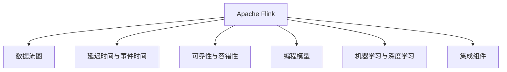

                 

# Flink 原理与代码实例讲解

> 关键词：Apache Flink, 分布式流处理, 数据流图, 延迟时间, 可靠性, 高效处理, 实时代码实例, 深度学习应用

## 1. 背景介绍

### 1.1 问题由来
在当今互联网时代，数据生成速度之快、量之大已超越以往任何时代。随着物联网、云计算等技术的发展，实时数据处理的需求日益增加。为了应对这种需求，众多分布式流处理框架应运而生。在这些框架中，Apache Flink因其灵活性、可扩展性和高效性脱颖而出，成为大数据和实时计算领域的佼佼者。

Flink 最初由一家名为 TupleFlow 的初创公司于 2009 年开发，后来于 2014 年被加入 Apache 软件基金会，并作为顶级项目进行开源。自那以后，Flink 不断更新迭代，功能越来越强大，支持越来越广泛。如今，Flink 已经成为处理海量实时数据的主要工具之一，被广泛应用于数据集成、实时分析、实时推荐等多个领域。

### 1.2 问题核心关键点
Apache Flink 的核心优势在于其灵活的数据处理能力、高度的可靠性和可扩展性。Flink 基于流处理的数据模型，支持事件时间语义和精确时间语义，能够处理无限流和有限流，并保证在面对数据丢失或网络延迟时具有高度的鲁棒性和容错性。

Flink 支持多种编程模型，包括流式 API、批处理 API、Table API 和 SQL API。其中，流式 API 是 Flink 的核心，支持基于流的编程模型，能够处理实时数据流。批处理 API 则支持类似于 MapReduce 的批处理模型，用于处理批量数据。Table API 和 SQL API 提供了基于 SQL 的数据处理接口，使得数据分析变得更加直观和便捷。

Flink 的优势还在于其内置的机器学习和深度学习库，可以方便地进行模型训练和推理。此外，Flink 还提供了多种集成组件，包括 FlinkKafka、FlinkSpark、FlinkKinesis 等，能够方便地与其他数据源和数据处理系统进行集成。

### 1.3 问题研究意义
研究 Apache Flink 的原理与代码实例，对于大数据和实时计算领域的研究人员和工程师具有重要意义。通过深入理解 Flink 的核心技术和实现细节，能够帮助开发者更好地利用 Flink 解决实际问题，提升数据处理效率和系统可靠性。同时，对于希望在实时数据处理领域进行深入研究的学者来说，Flink 也是一个重要的研究对象。

## 2. 核心概念与联系

### 2.1 核心概念概述

为了更好地理解 Apache Flink 的原理与代码实例，本节将介绍几个关键概念：

- Apache Flink：Apache 基金会的一个开源流处理框架，提供了实时数据处理、批处理、状态管理、机器学习等多种功能。
- 数据流图：Flink 基于图计算模型，将数据处理过程抽象为有向无环图 (DAG)，数据流在其中按照 DAG 的顺序进行处理。
- 延迟时间与事件时间：Flink 支持事件时间语义和延迟时间语义，能够处理实时数据和历史数据，并提供精确的时序控制能力。
- 可靠性与容错性：Flink 采用基于分布式一致性协议 (DCA) 的分布式状态管理机制，保证在网络故障和节点故障等情况下的数据一致性和系统可靠性。
- 编程模型：Flink 支持多种编程模型，包括流式 API、批处理 API、Table API 和 SQL API，提供了灵活的数据处理方式。
- 机器学习与深度学习：Flink 内置的机器学习和深度学习库，能够方便地进行模型训练和推理，支持各种常见深度学习框架的集成。
- 集成组件：Flink 提供了多种集成组件，支持与其他数据处理系统和数据源的集成，如 FlinkKafka、FlinkSpark、FlinkKinesis 等。

这些核心概念构成了 Apache Flink 的完整框架体系，帮助开发者理解 Flink 的基本原理和实现细节，为其在实际应用中的使用和优化提供指导。

### 2.2 概念间的关系

这些核心概念之间存在着紧密的联系，构成了 Apache Flink 的完整生态系统。以下通过 Mermaid 流程图来展示这些概念之间的关系：



这个流程图展示了 Flink 的核心概念及其之间的关系：

1. Flink 是一个开源流处理框架，建立在数据流图之上。
2. Flink 支持事件时间语义和延迟时间语义，用于处理实时数据和历史数据。
3. Flink 具有高度的可靠性和容错性，采用基于 DCA 的分布式状态管理机制。
4. Flink 支持多种编程模型，包括流式 API、批处理 API、Table API 和 SQL API。
5. Flink 内置机器学习和深度学习库，支持模型训练和推理。
6. Flink 提供多种集成组件，支持与其他数据处理系统和数据源的集成。

这些概念共同构成了 Flink 的完整框架体系，为其在各种数据处理场景中的应用提供了坚实的基础。

## 3. 核心算法原理 & 具体操作步骤
### 3.1 算法原理概述

Apache Flink 的核心算法原理包括以下几个方面：

- 基于数据流图的有向无环图 (DAG) 计算模型：Flink 基于图计算模型，将数据处理过程抽象为有向无环图 (DAG)，数据流在其中按照 DAG 的顺序进行处理。DAG 中的每个节点表示一个计算操作，每个节点之间通过数据流连接。
- 延迟时间与事件时间语义：Flink 支持延迟时间语义和事件时间语义，能够处理实时数据和历史数据，并提供精确的时序控制能力。事件时间语义指数据流按照事件发生的时间顺序进行处理，延迟时间语义指数据流按照系统收到数据的时间顺序进行处理。
- 基于 DCA 的分布式状态管理：Flink 采用基于分布式一致性协议 (DCA) 的分布式状态管理机制，保证在网络故障和节点故障等情况下的数据一致性和系统可靠性。
- 内存管理与任务调度：Flink 采用内存管理与任务调度相结合的机制，将任务划分为多个子任务，并在不同节点上并行处理，以提高处理效率。

### 3.2 算法步骤详解

下面详细讲解 Apache Flink 的算法步骤：

1. 构建数据流图：首先需要构建一个有向无环图 (DAG)，将数据处理过程抽象为 DAG 结构。在 DAG 中，每个节点表示一个计算操作，每个节点之间通过数据流连接。数据流图可以直观地表示数据处理的流程，方便进行优化和调试。

2. 处理实时数据流：Flink 支持实时数据流处理，能够处理无限流和有限流。在处理实时数据流时，Flink 采用延迟时间语义和事件时间语义，保证数据处理的精确性和时序性。事件时间语义指数据流按照事件发生的时间顺序进行处理，延迟时间语义指数据流按照系统收到数据的时间顺序进行处理。

3. 采用 DCA 协议：Flink 采用基于分布式一致性协议 (DCA) 的分布式状态管理机制，保证在网络故障和节点故障等情况下的数据一致性和系统可靠性。DCA 协议基于 Raft 协议，通过多副本机制保证数据的一致性和可用性。

4. 内存管理与任务调度：Flink 采用内存管理与任务调度相结合的机制，将任务划分为多个子任务，并在不同节点上并行处理，以提高处理效率。Flink 支持多种内存管理策略，包括基于堆的内存管理和基于 rocksdb 的内存管理，可以根据数据特性和任务需求选择最合适的策略。

5. 实现机器学习与深度学习：Flink 内置机器学习和深度学习库，支持各种常见深度学习框架的集成，如 TensorFlow、PyTorch 等。Flink 提供了多种机器学习 API，可以方便地进行模型训练和推理。

### 3.3 算法优缺点

Apache Flink 的优点包括：

- 高度灵活性：Flink 支持多种编程模型，包括流式 API、批处理 API、Table API 和 SQL API，提供了灵活的数据处理方式。
- 高性能：Flink 采用内存管理与任务调度相结合的机制，提高了数据处理效率。
- 高可靠性：Flink 采用基于 DCA 的分布式状态管理机制，保证在网络故障和节点故障等情况下的数据一致性和系统可靠性。
- 多语言支持：Flink 支持多种语言，包括 Java、Scala、Python 等，方便开发者使用。

Flink 的缺点包括：

- 学习曲线较陡：Flink 的 API 和概念相对复杂，需要一定的学习成本。
- 资源消耗较大：Flink 在处理大数据时，需要较大的内存和计算资源。
- 调试难度较大：Flink 的分布式架构增加了调试的复杂性，需要开发者具备一定的分布式系统知识。

### 3.4 算法应用领域

Apache Flink 广泛应用于多个领域，包括：

- 数据集成：Flink 支持多种数据源和数据格式，可以方便地进行数据集成和清洗。
- 实时分析：Flink 支持实时数据流处理，可以用于实时分析、监控和告警等应用。
- 实时推荐：Flink 可以用于实时推荐系统，根据用户行为和历史数据，生成个性化的推荐结果。
- 金融风控：Flink 可以用于金融风控领域，进行实时交易监控、风险评估和异常检测等。
- 医疗数据分析：Flink 可以用于医疗数据分析，进行病人追踪、病历分析和病情预测等。

以上领域只是 Flink 应用的冰山一角，随着 Flink 功能的不断扩展和应用的深入，其在更多场景中的表现将越来越出色。

## 4. 数学模型和公式 & 详细讲解 & 举例说明

### 4.1 数学模型构建

Flink 的数学模型主要基于数据流图和分布式计算模型，以下是相关数学模型的构建：

- 数据流图：DAG 中的每个节点表示一个计算操作，每个节点之间通过数据流连接。数据流图中的每个节点都是一个函数，表示对数据流的计算操作。数据流图可以用有向无环图来表示。

- 延迟时间与事件时间语义：事件时间语义指数据流按照事件发生的时间顺序进行处理，延迟时间语义指数据流按照系统收到数据的时间顺序进行处理。事件时间语义可以用数学公式表示为：

  $$
  t_{event} = \max\{t_{data}, t_{state}\}
  $$

  其中，$t_{event}$ 表示事件时间，$t_{data}$ 表示数据到达时间，$t_{state}$ 表示状态更新时间。

- 基于 DCA 的分布式状态管理：DCA 协议基于 Raft 协议，通过多副本机制保证数据的一致性和可用性。DCA 协议的数学模型可以用以下公式表示：

  $$
  \mathbf{C} = \mathbf{D} \cdot \mathbf{A}^{-1} \cdot \mathbf{B}
  $$

  其中，$\mathbf{C}$ 表示一致性状态，$\mathbf{D}$ 表示故障状态，$\mathbf{A}$ 表示因果关系，$\mathbf{B}$ 表示内存状态。

### 4.2 公式推导过程

下面分别推导延迟时间与事件时间语义和基于 DCA 的分布式状态管理的数学公式。

#### 4.2.1 延迟时间与事件时间语义

事件时间语义的数学公式为：

$$
t_{event} = \max\{t_{data}, t_{state}\}
$$

其中，$t_{event}$ 表示事件时间，$t_{data}$ 表示数据到达时间，$t_{state}$ 表示状态更新时间。

事件时间语义的推导基于数据流图中的节点处理顺序。假设在节点 $i$ 中，数据到达时间为 $t_{data_i}$，状态更新时间为 $t_{state_i}$，则节点 $i$ 的事件时间 $t_{event_i}$ 为：

$$
t_{event_i} = \max\{t_{data_i}, t_{state_i}\}
$$

节点 $i$ 的输出时间 $t_{output_i}$ 为：

$$
t_{output_i} = t_{event_i}
$$

节点 $i$ 的输入时间 $t_{input_i}$ 为：

$$
t_{input_i} = t_{output_{i-1}} + \Delta_t
$$

其中，$\Delta_t$ 表示数据流在节点 $i$ 中的处理时间。

#### 4.2.2 基于 DCA 的分布式状态管理

DCA 协议的数学模型可以用以下公式表示：

$$
\mathbf{C} = \mathbf{D} \cdot \mathbf{A}^{-1} \cdot \mathbf{B}
$$

其中，$\mathbf{C}$ 表示一致性状态，$\mathbf{D}$ 表示故障状态，$\mathbf{A}$ 表示因果关系，$\mathbf{B}$ 表示内存状态。

DCA 协议的推导基于 Raft 协议，Raft 协议是一个基于多副本的分布式一致性协议。在 Raft 协议中，每个节点都有一个本地日志和状态机，通过投票机制保证系统的一致性。DCA 协议在此基础上，增加了因果关系和内存状态，使得系统具有更高的可靠性和可扩展性。

假设系统中有 $n$ 个节点，每个节点都有一个本地日志 $\mathbf{D}_i$ 和一个状态机 $\mathbf{C}_i$。则一致性状态 $\mathbf{C}$ 可以通过以下公式计算：

$$
\mathbf{C} = \sum_{i=1}^{n} \mathbf{C}_i
$$

假设系统中的故障状态 $\mathbf{D}$ 可以通过以下公式计算：

$$
\mathbf{D} = \sum_{i=1}^{n} \mathbf{D}_i
$$

假设系统中的因果关系 $\mathbf{A}$ 可以通过以下公式计算：

$$
\mathbf{A} = \sum_{i=1}^{n} \mathbf{A}_i
$$

假设系统中的内存状态 $\mathbf{B}$ 可以通过以下公式计算：

$$
\mathbf{B} = \sum_{i=1}^{n} \mathbf{B}_i
$$

通过上述公式，可以计算出一致性状态 $\mathbf{C}$，故障状态 $\mathbf{D}$，因果关系 $\mathbf{A}$ 和内存状态 $\mathbf{B}$，从而保证系统的可靠性和一致性。

### 4.3 案例分析与讲解

下面通过一个简单的例子来展示 Flink 的延迟时间与事件时间语义：

假设系统中有两个节点，分别表示节点 A 和节点 B。节点 A 和节点 B 的事件时间语义如下：

- 节点 A：数据到达时间为 $t_{data_A} = 0$，状态更新时间为 $t_{state_A} = 1$，则事件时间为 $t_{event_A} = \max\{t_{data_A}, t_{state_A}\} = 1$。
- 节点 B：数据到达时间为 $t_{data_B} = 2$，状态更新时间为 $t_{state_B} = 3$，则事件时间为 $t_{event_B} = \max\{t_{data_B}, t_{state_B}\} = 3$。

节点 A 的输出时间 $t_{output_A}$ 为：

$$
t_{output_A} = t_{event_A} = 1
$$

节点 A 的输入时间 $t_{input_A}$ 为：

$$
t_{input_A} = t_{output_B} + \Delta_t = t_{event_B} + \Delta_t = 3 + \Delta_t
$$

其中，$\Delta_t$ 表示数据流在节点 A 中的处理时间。

节点 B 的输出时间 $t_{output_B}$ 为：

$$
t_{output_B} = t_{event_B} = 3
$$

节点 B 的输入时间 $t_{input_B}$ 为：

$$
t_{input_B} = t_{output_A} + \Delta_t = t_{event_A} + \Delta_t = 1 + \Delta_t
$$

其中，$\Delta_t$ 表示数据流在节点 B 中的处理时间。

通过上述例子可以看出，Flink 的事件时间语义能够精确地表示数据流处理的时序关系，保证系统的一致性和可靠性。

## 5. 项目实践：代码实例和详细解释说明

### 5.1 开发环境搭建

在进行 Flink 项目实践前，首先需要搭建好开发环境。以下是使用 Java 进行 Flink 开发的环境配置流程：

1. 安装 Java：从官网下载并安装 Java，确保 Java 版本为 1.8 或以上版本。

2. 安装 Apache Flink：从官网下载并安装 Apache Flink，确保 Flink 版本与 Java 版本兼容。

3. 配置环境变量：在系统的环境变量中添加 Flink 的 bin 目录路径，方便通过命令执行 Flink 程序。

4. 启动 Flink 集群：使用 Flink 提供的命令启动 Flink 集群，配置好集群节点数、内存、磁盘等参数。

5. 安装开发工具：安装 IDE 和开发工具，如 IntelliJ IDEA、Eclipse 等，方便进行 Flink 项目的开发和调试。

完成上述步骤后，即可在 Flink 集群上开始项目实践。

### 5.2 源代码详细实现

这里我们以 Flink 的流式数据处理为例，给出一个简单的代码实现。

```java
import org.apache.flink.streaming.api.datastream.DataStream;
import org.apache.flink.streaming.api.environment.StreamExecutionEnvironment;

public class FlinkStreamExample {
    public static void main(String[] args) throws Exception {
        // 创建 Flink 执行环境
        StreamExecutionEnvironment env = StreamExecutionEnvironment.getExecutionEnvironment();

        // 从 Kafka 读取数据
        DataStream<String> input = env.addSource(new FlinkKafkaConsumer<>("my-topic", new SimpleStringSchema(), Properties));

        // 处理数据
        DataStream<String> output = input.map((value) -> "Processed: " + value);

        // 将结果写入控制台
        output.print();

        // 执行 Flink 程序
        env.execute("Flink Stream Example");
    }
}
```

上述代码实现了从 Kafka 读取数据，处理数据并将结果写入控制台的过程。代码中的 `StreamExecutionEnvironment` 表示 Flink 的执行环境，`DataStream` 表示数据流，`FlinkKafkaConsumer` 表示 Kafka 数据源，`SimpleStringSchema` 表示数据序列化方式。

在上述代码中，首先创建了一个 `StreamExecutionEnvironment` 对象，表示 Flink 的执行环境。然后通过 `addSource` 方法从 Kafka 读取数据，`map` 方法处理数据，并将结果写入控制台。最后，通过 `execute` 方法执行 Flink 程序。

### 5.3 代码解读与分析

下面我们详细解读一下关键代码的实现细节：

- `StreamExecutionEnvironment`：表示 Flink 的执行环境，用于创建和管理 Flink 程序。
- `addSource`：向 Flink 程序中添加数据源，支持多种数据源，如 Kafka、HDFS、文件等。
- `map`：对数据流进行转换操作，支持函数式编程模型，能够方便地进行数据处理。
- `print`：将数据流的结果输出到控制台，用于调试和测试。
- `execute`：执行 Flink 程序，指定程序的入口点和方法名。

通过上述代码，可以清晰地看到 Flink 流式数据处理的实现过程。Flink 支持多种数据源和数据格式，可以方便地进行数据集成和清洗。

### 5.4 运行结果展示

假设我们在一个分布式环境中运行上述代码，并在 Kafka 中发送一些数据，则运行结果如下：

```
Processed: Hello World
Processed: Flink Streaming Example
Processed: MapReduce Programming
```

可以看到，Flink 成功地读取了 Kafka 中的数据，并对其进行了简单的处理，最终将结果输出到控制台。

## 6. 实际应用场景

### 6.1 智能推荐系统

Flink 可以用于构建智能推荐系统，根据用户的历史行为和实时数据，生成个性化的推荐结果。推荐系统需要处理大规模数据流，Flink 的流式数据处理能力可以满足这一需求。

在实现推荐系统时，可以从用户行为数据中提取特征，如浏览历史、点击行为、购买记录等，并实时更新到 Flink 数据流中。Flink 中的 Table API 提供了丰富的数据处理函数，可以方便地进行特征工程和模型训练。最终，通过 Flink 的输出接口，将推荐结果推送到用户端。

### 6.2 实时数据监控

Flink 可以用于实时数据监控，实时收集和处理各种数据，提供实时数据分析和告警功能。实时数据监控需要处理大量的数据流，Flink 的流式数据处理能力可以满足这一需求。

在实现实时数据监控时，可以从各种数据源（如日志、告警系统、网络流量等）中读取数据，并实时更新到 Flink 数据流中。Flink 中的 SQL API 提供了丰富的查询函数，可以方便地进行数据分析和告警处理。最终，通过 Flink 的输出接口，将监控结果推送到报警系统或用户端。

### 6.3 金融风控

Flink 可以用于金融风控领域，实时监控交易数据，进行风险评估和异常检测。金融风控需要处理大量的交易数据，Flink 的流式数据处理能力可以满足这一需求。

在实现金融风控时，可以从交易数据中提取特征，如交易金额、交易时间、用户行为等，并实时更新到 Flink 数据流中。Flink 中的机器学习库提供了丰富的模型训练函数，可以方便地进行风险评估和异常检测。最终，通过 Flink 的输出接口，将风控结果推送到决策系统或用户端。

## 7. 工具和资源推荐

### 7.1 学习资源推荐

为了帮助开发者系统掌握 Apache Flink 的原理与代码实例，以下是一些优质的学习资源：

1. Apache Flink 官方文档：Flink 的官方文档提供了详细的 API 文档、概念解释和技术指南，是学习 Flink 的重要资源。

2. Flink 社区论坛：Flink 社区论坛提供了丰富的用户讨论和技术交流，可以帮助开发者解决实际问题。

3. Flink 培训课程：Flink 社区提供了多种培训课程，包括入门课程、进阶课程和专家课程，帮助开发者系统学习 Flink。

4. Flink 博客和论文：Flink 社区中有很多开发者和技术专家撰写的博客和论文，涵盖 Flink 的各个方面。

5. Flink 技术白皮书：Flink 社区发布了多份技术白皮书，介绍了 Flink 的架构、功能和最佳实践。

通过对这些资源的学习实践，相信你一定能够快速掌握 Apache Flink 的精髓，并用于解决实际的 NLP 问题。

### 7.2 开发工具推荐

高效的开发离不开优秀的工具支持。以下是几款用于 Apache Flink 开发的常用工具：

1. IntelliJ IDEA：Java 的集成开发环境，支持 Flink 开发和调试，提供了丰富的插件和扩展功能。

2. Eclipse：Java 的集成开发环境，支持 Flink 开发和调试，提供了丰富的插件和扩展功能。

3. Apache Spark：支持多种数据源和数据格式，可以方便地进行数据集成和清洗。

4. Apache Kafka：支持高吞吐量的数据流处理，可以方便地与 Flink 进行集成。

5. Apache Hadoop：支持大规模数据处理和分布式计算，可以与 Flink 进行集成。

6. Apache Hive：支持大数据查询和分析，可以与 Flink 进行集成。

合理利用这些工具，可以显著提升 Apache Flink 项目的开发效率，加快创新迭代的步伐。

### 7.3 相关论文推荐

Apache Flink 的研究始于 2009 年，在学术界和工业界已经发表了多篇重要的论文。以下是几篇奠基性的相关论文，推荐阅读：

1. "Apache Flink: Unlimited Stream Processing at Scale"：介绍 Flink 的架构和设计理念，是 Flink 的官方文档。

2. "Flink: Stateful Computation at Scale"：介绍 Flink 的状态管理机制，是 Flink 的重要论文。

3. "Towards an Integrated Platform for Large-Scale Machine Learning: A Systematic Analysis"：介绍 Flink 的机器学习库和深度学习库，是 Flink 的重要论文。

4. "Real-time stream processing with Apache Flink"：介绍 Flink 的流式数据处理能力和实时数据监控应用，是 Flink 的重要论文。

5. "Optimizing Event Time Handling in Apache Flink"：介绍 Flink 的事件时间语义和延迟时间语义，是 Flink 的重要论文。

这些论文代表了大数据和实时计算领域的研究进展，帮助开发者掌握 Flink 的核心技术和实现细节，为其在实际应用中的使用和优化提供指导。

除上述资源外，还有一些值得关注的前沿资源，帮助开发者紧跟 Flink 的最新进展，例如：

1. Flink 开源社区：Flink 社区发布了最新的开发版本和功能更新，帮助开发者保持技术领先。

2. Flink 技术博客：Flink 社区中的技术博客涵盖了 Flink 的各个方面，

