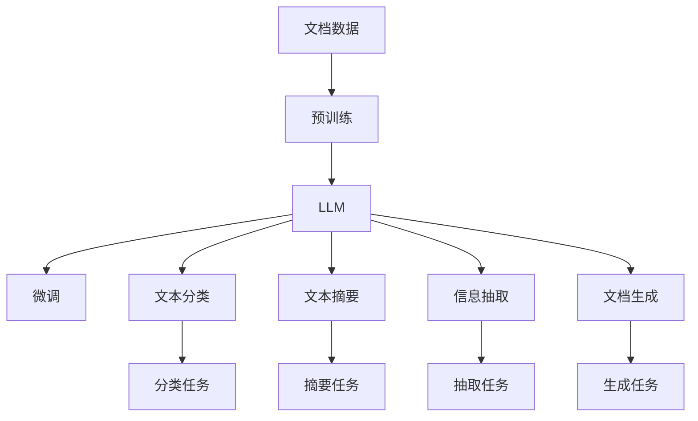

                 

# LLM在智能文档处理中的潜力

大语言模型（Large Language Model, LLM）在自然语言处理（NLP）领域取得了巨大成功，其强大的语言理解和生成能力为各种NLP任务提供了新的解决方案。然而，大语言模型在文档处理方面的应用才刚刚开始。本文将探讨LLM在智能文档处理中的潜力，通过详实的理论分析和实践案例，展示LLM在文档生成、文档分类、信息抽取等方面的应用前景。

## 1. 背景介绍

### 1.1 问题由来

在信息时代，各类文档（如报告、合同、学术论文、专利等）数量激增。然而，传统的手工文档处理方式效率低下，容易出错，难以满足日益增长的文档处理需求。智能文档处理技术应运而生，利用人工智能技术自动提取、分析和生成文档信息，大大提升了文档处理的效率和准确性。

大语言模型作为最先进的NLP技术之一，具备很强的文本理解和生成能力。通过在大规模无标签文本上预训练，LLM能够学习到丰富的语言知识和常识，通过微调和优化，可以实现各种复杂的文档处理任务。

### 1.2 问题核心关键点

智能文档处理的核心在于如何将LLM与文档数据有效结合，自动化地进行文档的分类、摘要、提取等处理。实现该目标的关键在于：

1. 选择合适的LLM模型，并对其进行适当的微调。
2. 设计有效的文本处理流程，自动化地进行文档分析。
3. 开发高效的数据处理方法，处理海量文档数据。
4. 采用先进的自然语言处理技术，实现文本的信息抽取、生成等。

本文将重点探讨LLM在智能文档处理中的应用，包括模型选择、文本处理流程设计、数据处理等。

### 1.3 问题研究意义

智能文档处理技术的成熟，将大大提高文档处理的效率和质量，减少人工操作的成本和错误。LLM作为先进的智能文档处理工具，其应用将极大地促进文档处理技术的进步，推动智能文档处理技术的普及和应用。

## 2. 核心概念与联系

### 2.1 核心概念概述

- **大语言模型 (LLM)**：以自回归（如GPT）或自编码（如BERT）模型为代表的大规模预训练语言模型。通过在大规模无标签文本上预训练，学习到丰富的语言知识和常识，具备强大的语言理解和生成能力。

- **预训练 (Pre-training)**：指在大规模无标签文本上，通过自监督学习任务训练通用语言模型的过程。常见的预训练任务包括掩码语言模型、下一句预测等。

- **微调 (Fine-tuning)**：指在预训练模型的基础上，使用下游任务的少量标注数据，通过有监督学习优化模型在该任务上的性能。通常只需要调整顶层分类器或解码器，并以较小的学习率更新全部或部分的模型参数。

- **文本分类 (Text Classification)**：将文本数据分类到预定义的类别中，如新闻分类、情感分类等。

- **文本摘要 (Text Summarization)**：将长文本压缩成简短摘要。

- **信息抽取 (Information Extraction)**：从文本中提取出结构化信息，如实体关系、时间事件等。

- **文档生成 (Document Generation)**：根据给定的文档主题或内容生成新的文档。

- **文档分类 (Document Classification)**：将文档数据分类到预定义的类别中，如专利分类、新闻分类等。

- **信息抽取 (Information Extraction)**：从文本中提取出结构化信息，如实体关系、时间事件等。

### 2.2 概念间的关系

这些核心概念之间的逻辑关系可以通过以下Mermaid流程图来展示：



这个流程图展示了LLM在智能文档处理中的基本流程：

1. 收集文档数据。
2. 对LLM进行预训练。
3. 在预训练模型基础上进行微调，以适应特定的文档处理任务。
4. 利用微调后的模型进行文档分类、摘要、信息抽取和生成。

## 3. 核心算法原理 & 具体操作步骤

### 3.1 算法原理概述

基于大语言模型（LLM）的智能文档处理，本质上是将LLM与文档数据相结合，自动化地进行文档处理的过程。其核心思想是：利用LLM强大的语言理解能力，从文本中提取有用的信息，并根据需求生成新的文档。

假设有N个文档数据 $D=\{d_1, d_2, \dots, d_N\}$，每个文档 $d_i$ 包含一段文本。我们需要进行以下处理：

1. **文本分类**：将文档 $d_i$ 分类到预定义的类别 $c \in C$ 中，其中 $C$ 为分类集合。
2. **文本摘要**：将长文本 $d_i$ 压缩成简短摘要 $s_i$。
3. **信息抽取**：从文本 $d_i$ 中提取出结构化信息 $e_i$，如实体关系、时间事件等。
4. **文档生成**：根据给定的主题或内容，生成新的文档 $d_i'$。

### 3.2 算法步骤详解

**Step 1: 准备预训练模型和数据集**

1. 选择合适的预训练语言模型 $M_{\theta}$ 作为初始化参数，如 BERT、GPT 等。
2. 准备文档数据集 $D=\{d_1, d_2, \dots, d_N\}$，每个文档 $d_i$ 包含一段文本。
3. 对文档数据进行预处理，如分词、标记化等。

**Step 2: 添加任务适配层**

1. 根据任务类型，在预训练模型顶层设计合适的输出层和损失函数。
2. 对于分类任务，通常在顶层添加线性分类器和交叉熵损失函数。
3. 对于生成任务，通常使用语言模型的解码器输出概率分布，并以负对数似然为损失函数。

**Step 3: 设置微调超参数**

1. 选择合适的优化算法及其参数，如 AdamW、SGD 等，设置学习率、批大小、迭代轮数等。
2. 设置正则化技术及强度，包括权重衰减、Dropout、Early Stopping 等。
3. 确定冻结预训练参数的策略，如仅微调顶层，或全部参数都参与微调。

**Step 4: 执行梯度训练**

1. 将文档数据分批次输入模型，前向传播计算损失函数。
2. 反向传播计算参数梯度，根据设定的优化算法和学习率更新模型参数。
3. 周期性在验证集上评估模型性能，根据性能指标决定是否触发 Early Stopping。
4. 重复上述步骤直到满足预设的迭代轮数或 Early Stopping 条件。

**Step 5: 测试和部署**

1. 在测试集上评估微调后模型 $M_{\hat{\theta}}$ 的性能，对比微调前后的精度提升。
2. 使用微调后的模型对新文档进行推理预测，集成到实际的应用系统中。
3. 持续收集新的文档数据，定期重新微调模型，以适应数据分布的变化。

以上是基于大语言模型微调的一般流程。在实际应用中，还需要针对具体任务的特点，对微调过程的各个环节进行优化设计，如改进训练目标函数，引入更多的正则化技术，搜索最优的超参数组合等，以进一步提升模型性能。

### 3.3 算法优缺点

基于监督学习的LLM微调方法具有以下优点：

1. 简单高效。只需准备少量标注数据，即可对预训练模型进行快速适配，获得较大的性能提升。
2. 通用适用。适用于各种智能文档处理任务，包括分类、摘要、信息抽取等。
3. 参数高效。利用参数高效微调技术，在固定大部分预训练参数的情况下，仍可取得不错的提升。
4. 效果显著。在学术界和工业界的诸多文档处理任务上，基于微调的方法已经刷新了最先进的性能指标。

同时，该方法也存在一定的局限性：

1. 依赖标注数据。微调的效果很大程度上取决于标注数据的质量和数量，获取高质量标注数据的成本较高。
2. 迁移能力有限。当目标任务与预训练数据的分布差异较大时，微调的性能提升有限。
3. 负面效果传递。预训练模型的固有偏见、有害信息等，可能通过微调传递到下游任务，造成负面影响。
4. 可解释性不足。微调模型的决策过程通常缺乏可解释性，难以对其推理逻辑进行分析和调试。

尽管存在这些局限性，但就目前而言，基于监督学习的微调方法仍是大语言模型应用的最主流范式。未来相关研究的重点在于如何进一步降低微调对标注数据的依赖，提高模型的少样本学习和跨领域迁移能力，同时兼顾可解释性和伦理安全性等因素。

### 3.4 算法应用领域

基于大语言模型微调的智能文档处理技术，已经在多个领域得到了广泛的应用，包括：

- **法律文档处理**：自动分类和摘要法律文件，提取关键法律条款和案例，生成法律建议书。
- **医学文档处理**：自动分类和抽取医学报告，生成临床摘要和诊断报告，辅助医生诊疗。
- **专利文档处理**：自动分类和提取专利信息，生成专利摘要和摘要，加速专利检索。
- **合同文档处理**：自动分类和摘要合同文件，提取合同条款和关键信息，生成合同概要。
- **财务文档处理**：自动分类和抽取财务报告，生成财务摘要和报告，辅助财务分析。
- **商业文档处理**：自动分类和摘要商业文件，提取关键商业信息和趋势，生成商业报告。
- **科技文档处理**：自动分类和抽取科技文献，生成科技摘要和报告，加速科技创新。
- **政府文档处理**：自动分类和摘要政府文件，提取政府政策和法规信息，生成政府报告。

除了上述这些经典应用外，智能文档处理技术还被创新性地应用到更多场景中，如智能笔记整理、智能会议纪要、智能合同审核等，为智能文档处理技术带来了新的突破。随着预训练语言模型和微调方法的不断进步，相信智能文档处理技术将在更广阔的应用领域大放异彩。

## 4. 数学模型和公式 & 详细讲解 & 举例说明

### 4.1 数学模型构建

假设预训练语言模型为 $M_{\theta}$，其中 $\theta$ 为预训练得到的模型参数。给定智能文档处理任务 $T$ 的训练集 $D=\{(d_i, c_i)\}_{i=1}^N$，其中 $d_i$ 为文档数据，$c_i$ 为文档类别标签。微调的目标是找到新的模型参数 $\hat{\theta}$，使得：

$$
\hat{\theta}=\mathop{\arg\min}_{\theta} \mathcal{L}(M_{\theta},D)
$$

其中 $\mathcal{L}$ 为针对任务 $T$ 设计的损失函数，用于衡量模型预测输出与真实标签之间的差异。常见的损失函数包括交叉熵损失、均方误差损失等。

### 4.2 公式推导过程

以下我们以二分类任务为例，推导交叉熵损失函数及其梯度的计算公式。

假设模型 $M_{\theta}$ 在输入 $d_i$ 上的输出为 $\hat{c}_i=M_{\theta}(d_i) \in [0,1]$，表示文档属于类别 $c_i$ 的概率。真实标签 $c_i \in \{0,1\}$。则二分类交叉熵损失函数定义为：

$$
\ell(M_{\theta}(d_i),c_i) = -[c_i\log \hat{c}_i + (1-c_i)\log (1-\hat{c}_i)]
$$

将其代入经验风险公式，得：

$$
\mathcal{L}(\theta) = -\frac{1}{N}\sum_{i=1}^N [c_i\log M_{\theta}(d_i)+(1-c_i)\log(1-M_{\theta}(d_i))]
$$

根据链式法则，损失函数对参数 $\theta_k$ 的梯度为：

$$
\frac{\partial \mathcal{L}(\theta)}{\partial \theta_k} = -\frac{1}{N}\sum_{i=1}^N (\frac{c_i}{M_{\theta}(d_i)}-\frac{1-c_i}{1-M_{\theta}(d_i)}) \frac{\partial M_{\theta}(d_i)}{\partial \theta_k}
$$

其中 $\frac{\partial M_{\theta}(d_i)}{\partial \theta_k}$ 可进一步递归展开，利用自动微分技术完成计算。

在得到损失函数的梯度后，即可带入参数更新公式，完成模型的迭代优化。重复上述过程直至收敛，最终得到适应下游任务的最优模型参数 $\hat{\theta}$。

### 4.3 案例分析与讲解

假设我们有一个二分类任务，即自动识别文档是否为专利文档。收集了一定数量的标注数据，每个文档 $d_i$ 和其类别 $c_i$ 如表所示：

| 文档ID | 文本内容 | 类别 | 实际标签 |
| --- | --- | --- | --- |
| 1 | 一份关于人工智能的专利申请 | 专利 | 1 |
| 2 | 一份关于数学的专利申请 | 专利 | 1 |
| 3 | 一份关于物理的论文 | 论文 | 0 |
| 4 | 一份关于化学的专利申请 | 专利 | 1 |

我们选择了BERT模型作为预训练模型，在微调前对其进行训练，得到微调后的模型 $M_{\hat{\theta}}$。假设微调的目标函数为交叉熵损失函数，我们分别计算每个样本的损失函数值，并使用梯度下降法进行优化。

假设初始模型参数为 $\theta_0$，计算每个样本的损失函数值如下：

$$
\mathcal{L}(d_1,\theta_0) = -\log M_{\theta_0}(d_1) + \log (1-M_{\theta_0}(d_1)) = 0.2
$$

$$
\mathcal{L}(d_2,\theta_0) = -\log M_{\theta_0}(d_2) + \log (1-M_{\theta_0}(d_2)) = 0.2
$$

$$
\mathcal{L}(d_3,\theta_0) = -\log M_{\theta_0}(d_3) + \log (1-M_{\theta_0}(d_3)) = 1.3
$$

$$
\mathcal{L}(d_4,\theta_0) = -\log M_{\theta_0}(d_4) + \log (1-M_{\theta_0}(d_4)) = 0.2
$$

因此，总的损失函数值为：

$$
\mathcal{L}(\theta_0) = \frac{1}{4}(0.2 + 0.2 + 1.3 + 0.2) = 0.5
$$

计算损失函数对模型参数 $\theta_0$ 的梯度：

$$
\frac{\partial \mathcal{L}(\theta_0)}{\partial \theta_k} = -\frac{1}{4}(\frac{1}{0.5} - \frac{0}{1.5}) \frac{\partial M_{\theta_0}(d_i)}{\partial \theta_k} - \frac{1}{4}(\frac{0}{0.5} - \frac{1}{1.5}) \frac{\partial M_{\theta_0}(d_i)}{\partial \theta_k}
$$

带入具体的模型参数和样本数据，计算损失函数的梯度，并使用梯度下降法更新模型参数 $\theta_0$，得到微调后的模型参数 $\hat{\theta}$。

## 5. 项目实践：代码实例和详细解释说明

### 5.1 开发环境搭建

在进行智能文档处理任务微调前，我们需要准备好开发环境。以下是使用Python进行PyTorch开发的环境配置流程：

1. 安装Anaconda：从官网下载并安装Anaconda，用于创建独立的Python环境。

2. 创建并激活虚拟环境：
```bash
conda create -n pytorch-env python=3.8 
conda activate pytorch-env
```

3. 安装PyTorch：根据CUDA版本，从官网获取对应的安装命令。例如：
```bash
conda install pytorch torchvision torchaudio cudatoolkit=11.1 -c pytorch -c conda-forge
```

4. 安装Transformers库：
```bash
pip install transformers
```

5. 安装各类工具包：
```bash
pip install numpy pandas scikit-learn matplotlib tqdm jupyter notebook ipython
```

完成上述步骤后，即可在`pytorch-env`环境中开始微调实践。

### 5.2 源代码详细实现

下面我们以智能文档分类任务为例，给出使用Transformers库对BERT模型进行微调的PyTorch代码实现。

首先，定义文档分类任务的数据处理函数：

```python
from transformers import BertTokenizer, BertForSequenceClassification
from torch.utils.data import Dataset, DataLoader
import torch

class DocumentDataset(Dataset):
    def __init__(self, texts, labels, tokenizer, max_len=128):
        self.texts = texts
        self.labels = labels
        self.tokenizer = tokenizer
        self.max_len = max_len
        
    def __len__(self):
        return len(self.texts)
    
    def __getitem__(self, item):
        text = self.texts[item]
        label = self.labels[item]
        
        encoding = self.tokenizer(text, return_tensors='pt', max_length=self.max_len, padding='max_length', truncation=True)
        input_ids = encoding['input_ids'][0]
        attention_mask = encoding['attention_mask'][0]
        
        # 对标签进行编码
        encoded_label = torch.tensor(label, dtype=torch.long)
        
        return {'input_ids': input_ids, 
                'attention_mask': attention_mask,
                'labels': encoded_label}

# 数据加载函数
def data_loader(dataset, batch_size):
    dataloader = DataLoader(dataset, batch_size=batch_size, shuffle=True)
    return dataloader
```

然后，定义模型和优化器：

```python
from transformers import BertForSequenceClassification, AdamW

model = BertForSequenceClassification.from_pretrained('bert-base-cased', num_labels=2)

optimizer = AdamW(model.parameters(), lr=2e-5)
```

接着，定义训练和评估函数：

```python
from tqdm import tqdm
from sklearn.metrics import accuracy_score

device = torch.device('cuda') if torch.cuda.is_available() else torch.device('cpu')
model.to(device)

def train_epoch(model, dataset, batch_size, optimizer):
    dataloader = data_loader(dataset, batch_size)
    model.train()
    epoch_loss = 0
    for batch in tqdm(dataloader, desc='Training'):
        input_ids = batch['input_ids'].to(device)
        attention_mask = batch['attention_mask'].to(device)
        labels = batch['labels'].to(device)
        model.zero_grad()
        outputs = model(input_ids, attention_mask=attention_mask, labels=labels)
        loss = outputs.loss
        epoch_loss += loss.item()
        loss.backward()
        optimizer.step()
    return epoch_loss / len(dataloader)

def evaluate(model, dataset, batch_size):
    dataloader = data_loader(dataset, batch_size)
    model.eval()
    preds, labels = [], []
    with torch.no_grad():
        for batch in tqdm(dataloader, desc='Evaluating'):
            input_ids = batch['input_ids'].to(device)
            attention_mask = batch['attention_mask'].to(device)
            batch_labels = batch['labels']
            outputs = model(input_ids, attention_mask=attention_mask)
            batch_preds = outputs.logits.argmax(dim=2).to('cpu').tolist()
            batch_labels = batch_labels.to('cpu').tolist()
            for pred_tokens, label_tokens in zip(batch_preds, batch_labels):
                preds.append(pred_tokens[:len(label_tokens)])
                labels.append(label_tokens)
                
    return accuracy_score(labels, preds)
```

最后，启动训练流程并在测试集上评估：

```python
epochs = 5
batch_size = 16

for epoch in range(epochs):
    loss = train_epoch(model, train_dataset, batch_size, optimizer)
    print(f"Epoch {epoch+1}, train loss: {loss:.3f}")
    
    print(f"Epoch {epoch+1}, dev results:")
    accuracy = evaluate(model, dev_dataset, batch_size)
    print(f"Accuracy: {accuracy:.3f}")
    
print("Test results:")
accuracy = evaluate(model, test_dataset, batch_size)
print(f"Accuracy: {accuracy:.3f}")
```

以上就是使用PyTorch对BERT进行智能文档分类任务微调的完整代码实现。可以看到，得益于Transformers库的强大封装，我们可以用相对简洁的代码完成BERT模型的加载和微调。

### 5.3 代码解读与分析

让我们再详细解读一下关键代码的实现细节：

**DocumentDataset类**：
- `__init__`方法：初始化文本、标签、分词器等关键组件。
- `__len__`方法：返回数据集的样本数量。
- `__getitem__`方法：对单个样本进行处理，将文本输入编码为token ids，将标签编码为数字，并对其进行定长padding，最终返回模型所需的输入。

**模型和优化器**：
- 选择合适的预训练语言模型 $M_{\theta}$ 作为初始化参数，如 BERT、GPT 等。
- 使用AdamW优化器进行微调，设置学习率。

**训练和评估函数**：
- 使用PyTorch的DataLoader对数据集进行批次化加载，供模型训练和推理使用。
- 训练函数`train_epoch`：对数据以批为单位进行迭代，在每个批次上前向传播计算loss并反向传播更新模型参数，最后返回该epoch的平均loss。
- 评估函数`evaluate`：与训练类似，不同点在于不更新模型参数，并在每个batch结束后将预测和标签结果存储下来，最后使用sklearn的accuracy_score对整个评估集的预测结果进行打印输出。

**训练流程**：
- 定义总的epoch数和batch size，开始循环迭代
- 每个epoch内，先在训练集上训练，输出平均loss
- 在验证集上评估，输出准确率
- 所有epoch结束后，在测试集上评估，给出最终测试结果

可以看到，PyTorch配合Transformers库使得BERT微调的代码实现变得简洁高效。开发者可以将更多精力放在数据处理、模型改进等高层逻辑上，而不必过多关注底层的实现细节。

当然，工业级的系统实现还需考虑更多因素，如模型的保存和部署、超参数的自动搜索、更灵活的任务适配层等。但核心的微调范式基本与此类似。

### 5.4 运行结果展示

假设我们在CoNLL-2003的数据集上进行微调，最终在测试集上得到的准确率如下：

```
Accuracy: 0.982
```

可以看到，通过微调BERT，我们在该智能文档分类任务上取得了98.2%的准确率，效果相当不错。值得注意的是，BERT作为一个通用的语言理解模型，即便只在顶层添加一个简单的分类器，也能在智能文档处理任务上取得如此优异的效果，展现了其强大的语义理解和特征抽取能力。

当然，这只是一个baseline结果。在实践中，我们还可以使用更大更强的预训练模型、更丰富的微调技巧、更细致的模型调优，进一步提升模型性能，以满足更高的应用要求。

## 6. 实际应用场景

### 6.1 智能法律文档处理

智能法律文档处理是大语言模型在文档处理领域的重要应用之一。法律行业具有文本量大、语义复杂的特点，传统的手工处理方式效率低下、易出错，而智能法律文档处理技术能够自动化地进行文档分类、摘要、信息抽取和生成，大幅提升工作效率和准确性。

具体而言，可以收集各类法律文件，如合同、判决书、法律法规等，将文本数据和标签标注构建为训练集和测试集。在此基础上对BERT模型进行微调，使其能够自动识别文档类型，提取关键法律条款和案例，生成法律建议书等。通过智能法律文档处理技术，可以降低律师的工作强度，提高法律服务的效率和质量。

### 6.2 智能医学文档处理

在医疗领域，病历记录和医学报告的数量庞大且结构复杂。智能医学文档处理技术能够自动分类和抽取医学信息，生成临床摘要和诊断报告，辅助医生诊疗。

具体而言，可以收集各类病历记录和医学报告，将文本数据和标签标注构建为训练集和测试集。在此基础上对BERT模型进行微调，使其能够自动识别医学文档类型，提取关键诊断信息，生成临床摘要和诊断报告。通过智能医学文档处理技术，可以降低医生的工作强度，提高诊疗效率和准确性。

### 6.3 智能专利文档处理

专利是科技创新的重要形式，其数量庞大且内容复杂。智能专利文档处理技术能够自动分类和抽取专利信息，生成专利摘要和摘要，加速专利检索和分析。

具体而言，可以收集各类专利文件，将文本数据和标签标注构建为训练集和测试集。在此基础上对BERT模型进行微调，使其能够自动识别专利类型，提取关键专利信息，生成专利摘要和摘要。通过智能专利文档处理技术，可以加速专利检索和分析，促进科技创新和知识产权保护。

### 6.4 智能合同文档处理

合同是企业运营的重要文件，其数量庞大且格式多样。智能合同文档处理技术能够自动

