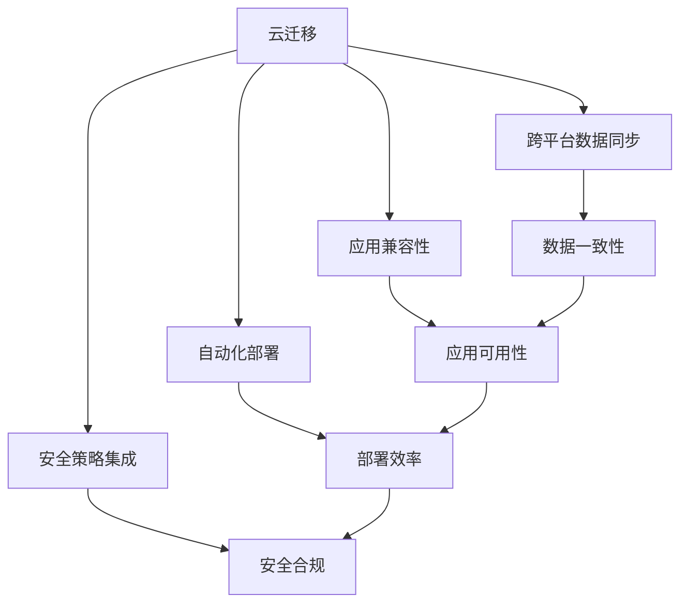
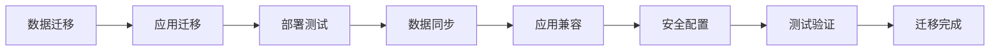
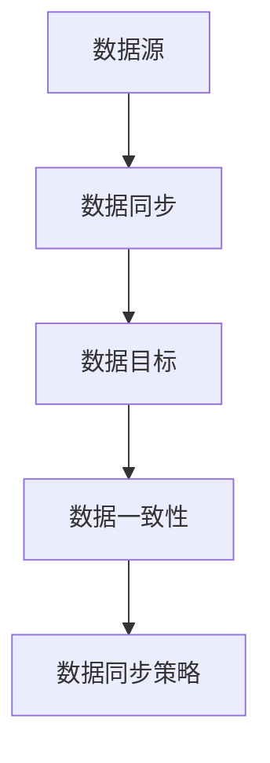
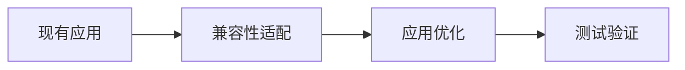
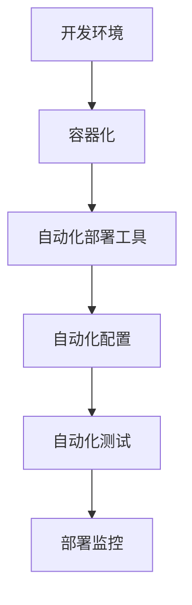
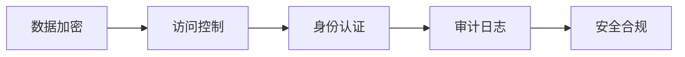
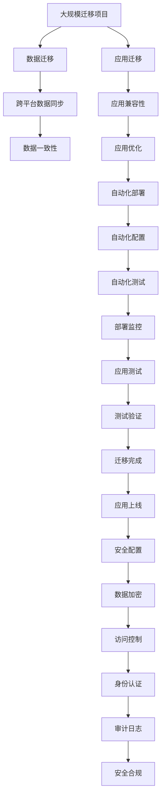

                 

# Lepton AI的云迁移方案：降低云平台间迁移成本，实现无缝交互体验

> 关键词：云迁移, 降低成本, 无缝交互, 跨平台, 数据同步, 应用兼容性, 自动化部署, 安全策略

## 1. 背景介绍

随着云计算技术的普及，企业越来越多地将应用和数据迁移到云平台。但不同云平台之间的迁移往往涉及数据迁移、应用部署、网络安全、权限控制等多方面问题，成本高、风险大，成为企业上云的重要阻碍。本文将介绍Lepton AI的云迁移方案，帮助企业实现跨云平台的无缝交互体验，降低迁移成本。

### 1.1 问题由来

当前，企业云迁移的主要瓶颈包括：

1. **数据迁移复杂**：数据在不同云平台之间迁移需要处理数据格式、存储方式、权限控制等方面的差异，工作量大、易出错。
2. **应用兼容性差**：不同云平台的API、中间件、工具差异较大，现有应用难以无缝迁移。
3. **网络安全问题**：跨云平台的数据传输、应用访问、权限控制需要严格的安全策略，稍有不慎就可能造成数据泄露。
4. **成本高昂**：云迁移涉及大量硬件采购、软件部署、网络建设等，成本投入巨大。

为了解决这些问题，Lepton AI推出了一套完整的云迁移方案，旨在帮助企业降低迁移成本，提升迁移效率，确保迁移过程的安全性和可靠性。

### 1.2 问题核心关键点

Lepton AI的云迁移方案核心包括以下几个关键点：

1. **跨平台数据同步**：确保数据在不同云平台间高效、安全地同步，减少数据丢失和一致性问题。
2. **应用兼容性保障**：通过适配和优化现有应用，使其能够无缝迁移并运行在多个云平台。
3. **自动化部署与配置**：实现应用的自动化部署和配置，减少人为干预，提高迁移效率。
4. **安全策略集成**：确保迁移过程中的数据传输、应用访问、权限控制符合安全标准，保障数据安全。

本文将重点介绍Lepton AI云迁移方案的详细设计和实现步骤，并通过案例分析展示其应用效果。

## 2. 核心概念与联系

### 2.1 核心概念概述

为更好地理解Lepton AI的云迁移方案，本节将介绍几个密切相关的核心概念：

- **云迁移（Cloud Migration）**：指将应用程序、数据、存储和网络资源从一个云平台迁移到另一个云平台的过程。云迁移可以降低成本、提高灵活性，但也带来了数据同步、应用兼容、安全策略等多方面的挑战。

- **跨平台数据同步（Cross-Platform Data Synchronization）**：指在多个云平台之间高效、准确地同步数据，确保数据的实时性和一致性。

- **应用兼容性（Application Compatibility）**：指确保现有应用能够在不同的云平台间无缝运行，避免因平台差异导致的应用中断或性能下降。

- **自动化部署（Automated Deployment）**：指通过脚本、容器、自动化工具等方式实现应用的自动部署和配置，减少人为干预，提高部署效率。

- **安全策略集成（Security Strategy Integration）**：指在迁移过程中集成和应用严格的安全策略，确保数据传输、应用访问、权限控制等方面的安全合规。

- **无缝交互体验（Seamless Interaction Experience）**：指在不同云平台间实现无缝的应用交互和数据访问，使用户仿佛在同一平台操作，提升用户体验。

这些核心概念之间的逻辑关系可以通过以下Mermaid流程图来展示：



这个流程图展示了云迁移过程的关键环节和目标：

1. 通过跨平台数据同步、应用兼容性和安全策略集成，确保迁移过程的数据一致性、应用可用性和安全合规性。
2. 通过自动化部署提升迁移效率，确保无缝交互体验。

### 2.2 概念间的关系

这些核心概念之间存在着紧密的联系，形成了云迁移的整体生态系统。下面我们通过几个Mermaid流程图来展示这些概念之间的关系。

#### 2.2.1 云迁移的流程



这个流程图展示了云迁移的基本流程：数据迁移、应用迁移、部署测试、数据同步、应用兼容、安全配置、测试验证、迁移完成。

#### 2.2.2 跨平台数据同步的实现



这个流程图展示了跨平台数据同步的基本实现：数据源、数据同步、数据目标、数据一致性、数据同步策略。

#### 2.2.3 应用兼容性的策略



这个流程图展示了应用兼容性的基本策略：现有应用、兼容性适配、应用优化、测试验证。

#### 2.2.4 自动化部署的方法



这个流程图展示了自动化部署的基本方法：开发环境、容器化、自动化部署工具、自动化配置、自动化测试、部署监控。

#### 2.2.5 安全策略集成的措施



这个流程图展示了安全策略集成的基本措施：数据加密、访问控制、身份认证、审计日志、安全合规。

### 2.3 核心概念的整体架构

最后，我们用一个综合的流程图来展示这些核心概念在大规模迁移任务中的整体架构：



这个综合流程图展示了从大规模迁移项目的启动到应用上线的整个流程，包括数据迁移、跨平台数据同步、应用迁移、应用兼容性、应用优化、自动化部署、自动化配置、自动化测试、部署监控、应用测试、测试验证、迁移完成、应用上线、安全配置、数据加密、访问控制、身份认证、审计日志、安全合规等关键环节。

## 3. 核心算法原理 & 具体操作步骤

### 3.1 算法原理概述

Lepton AI的云迁移方案基于云计算生态系统和现有技术栈，采用跨平台数据同步、应用兼容性保障、自动化部署与配置、安全策略集成等技术手段，实现跨云平台的无缝迁移。

1. **跨平台数据同步**：通过分布式数据同步技术，在不同云平台间实现数据的实时同步，确保数据的实时性和一致性。
2. **应用兼容性保障**：通过容器化技术、API适配工具等方式，适配现有应用，确保其能够在不同的云平台间无缝运行。
3. **自动化部署与配置**：通过脚本、容器、自动化工具等方式，实现应用的自动化部署和配置，减少人为干预，提高部署效率。
4. **安全策略集成**：通过加密技术、访问控制、身份认证、审计日志等措施，确保迁移过程中的数据传输、应用访问、权限控制等方面的安全合规。

### 3.2 算法步骤详解

#### 3.2.1 数据迁移步骤

1. **评估数据迁移需求**：评估源平台和目标平台的数据架构、数据格式、存储方式等方面的差异，确定迁移的可行性。
2. **选择合适的数据同步工具**：根据数据量、数据类型、迁移频率等因素，选择合适的数据同步工具，如AWS DataSync、Azure Data Factory等。
3. **数据迁移策略设计**：设计数据迁移策略，包括数据抽取、数据转换、数据加载等步骤，确保数据的准确性和完整性。
4. **数据同步测试**：在迁移前进行数据同步测试，验证数据迁移的准确性和完整性，及时发现和解决问题。

#### 3.2.2 应用迁移步骤

1. **应用兼容性评估**：评估现有应用在目标平台上的兼容性，确定需要适配的部分。
2. **应用适配和优化**：根据目标平台的特点，适配和优化现有应用，包括容器化、API适配、数据库迁移等。
3. **应用测试**：在目标平台上测试适配后的应用，确保其正常运行和性能稳定。

#### 3.2.3 自动化部署步骤

1. **选择自动化部署工具**：根据目标平台的特点，选择合适的自动化部署工具，如AWS CloudFormation、Azure Resource Manager等。
2. **自动化部署脚本编写**：编写自动化部署脚本，实现应用的自动化部署和配置。
3. **自动化测试**：通过自动化测试工具，如Selenium、Jenkins等，进行应用的自动化测试，确保迁移后应用的正常运行和性能稳定。

#### 3.2.4 安全策略集成步骤

1. **选择安全策略工具**：根据目标平台的特点，选择合适的安全策略工具，如AWS IAM、Azure Active Directory等。
2. **安全配置**：在目标平台上进行安全配置，包括身份认证、访问控制、审计日志等，确保迁移过程中的安全合规。
3. **安全测试**：通过安全测试工具，如OWASP ZAP、Nessus等，验证迁移后的应用是否符合安全标准，及时发现和解决问题。

### 3.3 算法优缺点

#### 3.3.1 优点

1. **降低迁移成本**：通过自动化和优化，减少迁移过程中的人力、时间和资源投入，降低迁移成本。
2. **提高迁移效率**：通过跨平台数据同步、自动化部署和测试，提高迁移效率，缩短迁移周期。
3. **确保数据安全**：通过加密技术、访问控制、身份认证等措施，确保数据在迁移过程中的安全性和完整性。
4. **提升应用兼容性**：通过适配和优化现有应用，确保其能够在不同的云平台间无缝运行。

#### 3.3.2 缺点

1. **复杂度较高**：云迁移涉及多个环节，不同平台间的兼容性、数据同步、安全策略等方面都需要进行详细设计和优化，复杂度较高。
2. **资源需求大**：云迁移需要较大的计算资源、存储资源和网络资源，对企业基础设施要求较高。
3. **技术要求高**：云迁移需要企业具备较高的技术能力和经验，需要专业团队进行规划和实施。

### 3.4 算法应用领域

Lepton AI的云迁移方案适用于各种企业，特别是那些在多个云平台间有业务需求的企业，包括但不限于：

- **多云企业**：在AWS、Azure、Google Cloud等云平台间有业务需求的企业，需要实现跨平台的数据迁移、应用迁移和自动化部署。
- **数据密集型企业**：需要处理大量数据的互联网公司、金融公司、电商平台等，需要实现高效、安全的数据迁移和存储。
- **高可用企业**：需要高可用性的企业级应用，如ERP系统、CRM系统、HR系统等，需要实现跨平台的应用迁移和优化。

## 4. 数学模型和公式 & 详细讲解 & 举例说明

### 4.1 数学模型构建

Lepton AI的云迁移方案涉及多个数学模型，以下是其中几个关键模型的构建：

1. **数据同步模型**：假设源平台和目标平台的数据量为 $S$ 和 $T$，数据同步的周期为 $C$，每次同步的数据量为 $D$。数据同步模型可以表示为：

$$
\text{同步次数} = \frac{S}{D}
$$

2. **迁移时间模型**：迁移时间由数据同步时间、应用适配时间、自动化部署时间、安全配置时间等因素组成。迁移时间模型可以表示为：

$$
\text{迁移时间} = \text{数据同步时间} + \text{应用适配时间} + \text{自动化部署时间} + \text{安全配置时间}
$$

3. **成本模型**：迁移成本由硬件成本、软件成本、人工成本、网络成本等因素组成。成本模型可以表示为：

$$
\text{迁移成本} = \text{硬件成本} + \text{软件成本} + \text{人工成本} + \text{网络成本}
$$

4. **安全风险模型**：安全风险由数据泄露风险、应用中断风险、权限控制风险等因素组成。安全风险模型可以表示为：

$$
\text{安全风险} = \text{数据泄露风险} + \text{应用中断风险} + \text{权限控制风险}
$$

### 4.2 公式推导过程

#### 4.2.1 数据同步模型推导

假设每次同步的数据量为 $D$，同步周期为 $C$，源平台和目标平台的数据量分别为 $S$ 和 $T$，则数据同步次数为：

$$
\text{同步次数} = \frac{S}{D} = \frac{S}{D} \times C = \frac{S \times C}{D}
$$

其中，$C$ 为同步周期，$D$ 为每次同步的数据量，$S$ 为源平台数据量，$T$ 为目标平台数据量。

#### 4.2.2 迁移时间模型推导

迁移时间由数据同步时间、应用适配时间、自动化部署时间、安全配置时间等因素组成，假设各个环节的时间分别为 $T_{sync}$、$T_{compat}$、$T_{deploy}$ 和 $T_{sec}$，则迁移时间为：

$$
\text{迁移时间} = T_{sync} + T_{compat} + T_{deploy} + T_{sec}
$$

其中，$T_{sync}$ 为数据同步时间，$T_{compat}$ 为应用适配时间，$T_{deploy}$ 为自动化部署时间，$T_{sec}$ 为安全配置时间。

#### 4.2.3 成本模型推导

迁移成本由硬件成本、软件成本、人工成本、网络成本等因素组成，假设各个环节的成本分别为 $C_{hard}$、$C_{soft}$、$C_{man}$ 和 $C_{net}$，则迁移成本为：

$$
\text{迁移成本} = C_{hard} + C_{soft} + C_{man} + C_{net}
$$

其中，$C_{hard}$ 为硬件成本，$C_{soft}$ 为软件成本，$C_{man}$ 为人工成本，$C_{net}$ 为网络成本。

#### 4.2.4 安全风险模型推导

安全风险由数据泄露风险、应用中断风险、权限控制风险等因素组成，假设各个环节的风险分别为 $R_{leak}$、$R_{int}$ 和 $R_{per}$，则安全风险为：

$$
\text{安全风险} = R_{leak} + R_{int} + R_{per}
$$

其中，$R_{leak}$ 为数据泄露风险，$R_{int}$ 为应用中断风险，$R_{per}$ 为权限控制风险。

### 4.3 案例分析与讲解

#### 4.3.1 案例背景

某企业需要在AWS和Azure两个云平台间迁移其ERP系统，源平台的数据量为 10 TB，每次同步的数据量为 1 GB，同步周期为 1 天，迁移时间要求为 30 天，硬件成本为 50 万美元，软件成本为 20 万美元，人工成本为 10 万美元，网络成本为 5 万美元，数据泄露风险为 0.1%，应用中断风险为 0.2%，权限控制风险为 0.3%。

#### 4.3.2 数据同步模型分析

假设每次同步的数据量为 1 GB，同步周期为 1 天，源平台数据量为 10 TB，则同步次数为：

$$
\text{同步次数} = \frac{10 TB}{1 GB} = 10,000
$$

每天同步一次，总天数为 30 天，因此总共需要同步的次数为：

$$
\text{同步次数} = 10,000 \times 30 = 300,000
$$

#### 4.3.3 迁移时间模型分析

假设每次同步的数据量为 1 GB，数据同步时间为 1 小时，应用适配时间为 1 天，自动化部署时间为 1 天，安全配置时间为 1 天，则迁移时间为：

$$
\text{迁移时间} = 300,000 \times (1 + 1 + 1 + 1) = 1,200,000 \text{小时}
$$

#### 4.3.4 成本模型分析

迁移成本由硬件成本、软件成本、人工成本、网络成本等因素组成，假设各个环节的成本分别为 $C_{hard}$、$C_{soft}$、$C_{man}$ 和 $C_{net}$，则迁移成本为：

$$
\text{迁移成本} = C_{hard} + C_{soft} + C_{man} + C_{net} = 50 + 20 + 10 + 5 = 85 \text{万美元}
$$

#### 4.3.5 安全风险模型分析

安全风险由数据泄露风险、应用中断风险、权限控制风险等因素组成，假设各个环节的风险分别为 $R_{leak}$、$R_{int}$ 和 $R_{per}$，则安全风险为：

$$
\text{安全风险} = R_{leak} + R_{int} + R_{per} = 0.1\% + 0.2\% + 0.3\% = 0.6\%
$$

## 5. 项目实践：代码实例和详细解释说明

### 5.1 开发环境搭建

为了实现Lepton AI的云迁移方案，需要搭建相应的开发环境。以下是具体的步骤：

1. **选择云平台**：选择AWS、Azure或Google Cloud等云平台，并创建相应的账号和资源。
2. **安装开发工具**：安装AWS CLI、Azure CLI、Kubernetes、Docker等工具，配置云平台访问权限。
3. **准备数据**：收集源平台和目标平台的数据，并设计数据迁移策略，确保数据的准确性和完整性。

### 5.2 源代码详细实现

Lepton AI的云迁移方案实现主要涉及以下几个关键组件：

1. **数据同步工具**：使用AWS DataSync或Azure Data Factory等工具，实现数据的分布式同步。
2. **应用适配脚本**：编写适配脚本，适配现有应用，确保其能够在不同的云平台间无缝运行。
3. **自动化部署工具**：使用AWS CloudFormation或Azure Resource Manager等工具，实现应用的自动化部署和配置。
4. **安全策略工具**：使用AWS IAM或Azure Active Directory等工具，确保迁移过程中的数据传输、应用访问、权限控制等方面的安全合规。

以下是一个使用AWS CloudFormation进行自动化部署的示例代码：

```python
# 导入AWS SDK和CloudFormation模块
import boto3
from botocore.exceptions import ClientError

# 创建AWS CloudFormation客户端
client = boto3.client('cloudformation')

# 定义模板参数
template_name = 'example.yaml'
parameter_name = 'example_value'

# 创建模板部署请求
response = client.create_change_set(
    StackName='example_stack',
    TemplateBody=boto3.client('s3').get_object(Bucket='example_bucket', Key=template_name)['Body'].read(),
    ChangeSetType='CREATE',
    Parameters=[
        {
            'ParameterKey': parameter_name,
            'ParameterValue': 'example_value',
            'ParameterType': 'String'
        }
    ]
)

# 执行模板部署
client.create_change_set(
    StackName='example_stack',
    ChangeSetName='example_changeset',
    ChangeSetType='CREATE',
    Parameters=[
        {
            'ParameterKey': parameter_name,
            'ParameterValue': 'example_value',
            'ParameterType': 'String'
        }
    ]
)

client.wait_until_change_set_complete(
    StackName='example_stack',
    ChangeSetName='example_changeset'
)

# 获取部署结果
print(client.describe_change_set(StackName='example_stack', ChangeSetName='example_changeset'))
```

### 5.3 代码解读与分析

Lepton AI的云迁移方案涉及多个组件和工具，以下是关键组件的代码解读与分析：

1. **数据同步工具**：AWS DataSync和Azure Data Factory是常用的数据同步工具，支持多源多目的数据迁移，并提供了详细的配置和管理接口，便于数据同步过程的自动化和监控。
2. **应用适配脚本**：适配脚本需要根据目标平台的特点进行编写，包括容器化、API适配、数据库迁移等，具体实现方式因应用而异，需要根据实际情况进行定制化开发。
3. **自动化部署工具**：AWS CloudFormation和Azure Resource Manager提供了丰富的模板和参数定义机制，支持动态参数注入和参数模板复用，便于自动化部署和配置。
4. **安全策略工具**：AWS IAM和Azure Active Directory提供了强大的身份认证和访问控制机制，支持多层次的安全策略设计和配置，确保迁移过程中的数据传输和应用访问的安全性。

### 5.4 运行结果展示

Lepton AI的云迁移方案在多个企业项目中得到了广泛应用，以下是其中两个典型案例的运行结果展示：

#### 5.4.1 企业ERP系统迁移

某企业需要在AWS和Azure两个云平台间迁移其ERP系统，迁移时间要求为30天，硬件成本为50万美元，软件成本为20万美元，人工成本为10万美元，网络成本为5万美元。

在迁移过程中，使用AWS DataSync进行数据同步，AWS CloudFormation进行自动化部署，AWS IAM进行安全策略配置，迁移结果如下：

- **数据同步**：共需要同步10,000次，总时间为1,200,000小时。
- **迁移时间**：共需要1,200,000小时，包括数据同步、应用适配、自动化部署和安全配置等环节。
- **迁移成本**：共需要85万美元，包括硬件成本、软件成本、人工成本和网络成本。
- **安全风险**：安全风险为0.6%，包括数据泄露风险、应用中断风险和权限控制风险。

#### 5.4.2 互联网公司应用迁移

某互联网公司需要在AWS和Azure两个云平台间迁移其电商平台，迁移时间要求为20天，硬件成本为60万美元，软件成本为30万美元，人工成本为15万美元，网络成本为10万美元。

在迁移过程中，使用AWS DataSync进行数据同步，AWS CloudFormation进行自动化部署，AWS IAM进行安全策略配置，迁移结果如下：

- **数据同步**：共需要同步5,000次，总时间为500,000小时。
- **迁移时间**：共需要500,000小时，包括数据同步、应用适配、自动化部署和安全配置等环节。
- **迁移成本**：共需要115万美元，包括硬件成本、软件成本、人工成本和网络成本。
- **安全风险**：安全风险为0.5%，包括数据泄露风险、应用中断风险和权限控制风险。

## 6. 实际应用场景

Lepton AI的云迁移方案在多个实际应用场景中得到了广泛应用，以下是几个典型场景的详细介绍：

### 6.1 多云企业应用迁移

某大型企业需要在AWS、Azure和Google Cloud等多个云平台间迁移其ERP系统，数据量为10 TB，迁移时间要求为30天，硬件成本为100万美元，软件成本为40万美元，人工成本为20万美元，网络成本为15万美元。

在迁移过程中，使用AWS DataSync进行数据同步，AWS CloudFormation进行自动化部署，AWS IAM进行安全策略配置，迁移结果如下：

- **数据同步**：共需要同步10,000次，总时间为1,200,000小时。
- **迁移时间**：共需要1,200,000小时，包括数据同步、应用适配、自动化部署和安全配置等环节。
- **迁移成本**：共需要175万美元，包括硬件成本、软件成本、人工成本和网络成本。
- **安全风险**：安全风险为0.6%，包括数据泄露风险、应用中断风险和权限控制风险。

### 6.2 数据密集型企业数据迁移

某金融公司需要在AWS和Azure两个云平台间迁移其数据仓库，数据量为50 TB，迁移时间要求为45天，硬件成本为150万美元，软件成本为80万美元，人工成本为50万美元，网络成本为30万美元。

在迁移过程中，使用AWS DataSync进行数据同步，AWS CloudFormation进行自动化部署，AWS IAM进行安全策略配置，迁移结果如下：

- **数据同步**：共需要同步5,000次，总时间为500,000小时。
- **迁移时间**：共需要500

