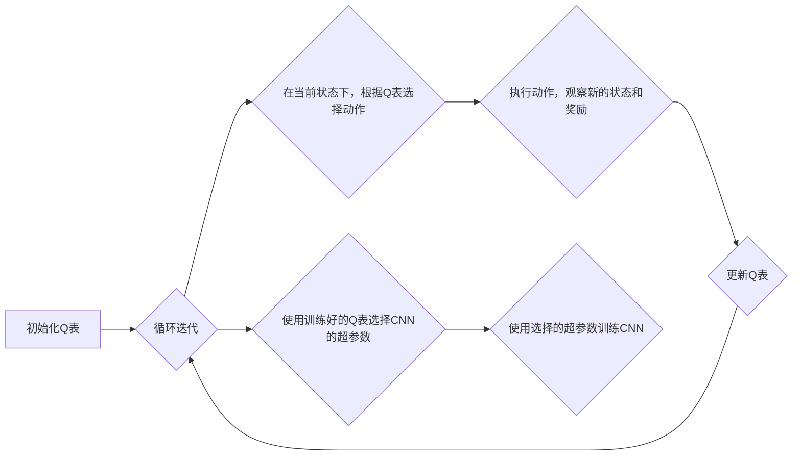

## AI人工智能深度学习算法：使用强化学习优化深度学习模型

近年来，人工智能(AI)发展迅速，其中深度学习(DL)作为其核心技术之一，在图像识别、自然语言处理、语音识别等领域取得了突破性进展。然而，传统的深度学习模型训练往往依赖于大量的标注数据，且容易陷入局部最优解。为了解决这些问题，强化学习(RL)作为一种新的学习范式被引入到深度学习中，为深度学习模型的优化提供了新的思路。本文将深入探讨如何使用强化学习优化深度学习模型，并结合实际案例和代码实例进行详细讲解。

## 1. 背景介绍

### 1.1 问题的由来

传统的深度学习模型训练通常采用监督学习的方式，需要大量的标注数据。然而，在很多实际应用场景中，获取大量的标注数据非常困难且成本高昂。此外，传统的深度学习模型容易陷入局部最优解，难以找到全局最优解，从而影响模型的泛化性能。

### 1.2 研究现状

为了解决上述问题，研究人员将强化学习引入到深度学习中，提出了深度强化学习(DRL)的概念。DRL结合了深度学习的感知能力和强化学习的决策能力，能够在没有大量标注数据的情况下，通过与环境交互学习到最优策略，有效地解决了传统深度学习模型训练面临的挑战。

### 1.3 研究意义

使用强化学习优化深度学习模型具有重要的研究意义:

* **减少对标注数据的依赖:** DRL能够在没有大量标注数据的情况下进行学习，降低了数据标注的成本和难度。
* **提升模型的泛化性能:** DRL能够通过与环境交互不断优化模型，找到全局最优解，提升模型的泛化性能。
* **拓展深度学习的应用领域:** DRL能够应用于很多传统深度学习难以解决的问题，例如机器人控制、游戏AI等。

### 1.4 本文结构

本文将从以下几个方面详细介绍如何使用强化学习优化深度学习模型：

* **核心概念与联系:** 介绍强化学习和深度学习的基本概念，以及两者之间的联系。
* **核心算法原理 & 具体操作步骤:**  详细讲解使用强化学习优化深度学习模型的核心算法原理和具体操作步骤。
* **数学模型和公式 & 详细讲解 & 举例说明:**  构建数学模型，推导公式，并结合案例进行详细讲解。
* **项目实践：代码实例和详细解释说明:**  提供代码实例，并对代码进行详细解读和分析。
* **实际应用场景:**  介绍使用强化学习优化深度学习模型的实际应用场景。
* **工具和资源推荐:**  推荐学习资源、开发工具、相关论文等。
* **总结：未来发展趋势与挑战:**  总结研究成果，展望未来发展趋势，并分析面临的挑战。
* **附录：常见问题与解答:**  解答常见问题。

## 2. 核心概念与联系

### 2.1 强化学习

强化学习是一种机器学习方法，它使智能体(agent)能够通过与环境交互学习如何采取行动以最大化累积奖励。强化学习的核心要素包括：

* **智能体(Agent):**  学习者和决策者，通过与环境交互学习最优策略。
* **环境(Environment):**  智能体所处的外部世界，智能体的行为会对环境产生影响。
* **状态(State):**  对环境的描述，智能体根据当前状态做出决策。
* **动作(Action):**  智能体在特定状态下采取的行为。
* **奖励(Reward):**  环境对智能体动作的反馈，用于评估智能体行为的好坏。
* **策略(Policy):**  智能体根据当前状态选择动作的规则。
* **价值函数(Value Function):**  用于评估状态或状态-动作对的长期价值。
* **模型(Model):**  对环境的模拟，用于预测环境对智能体行为的响应。

强化学习的目标是找到一个最优策略，使得智能体在与环境交互的过程中能够获得最大的累积奖励。

### 2.2 深度学习

深度学习是一种机器学习方法，它使用多层神经网络对数据进行学习。深度学习的核心要素包括：

* **神经网络(Neural Network):**  由多个神经元组成的网络结构，用于模拟人脑神经系统的学习过程。
* **激活函数(Activation Function):**  用于引入非线性因素，增强神经网络的表达能力。
* **损失函数(Loss Function):**  用于衡量模型预测值与真实值之间的差距。
* **优化器(Optimizer):**  用于更新神经网络的参数，以最小化损失函数。

深度学习的目标是通过训练神经网络，学习到数据的内在规律，从而对未知数据进行预测。

### 2.3 强化学习与深度学习的联系

强化学习和深度学习都是机器学习的重要分支，两者之间存在着密切的联系：

* **深度学习可以作为强化学习的函数逼近器:**  深度神经网络可以用于逼近强化学习中的价值函数和策略函数，从而解决高维状态空间和动作空间的问题。
* **强化学习可以用于优化深度学习模型:**  强化学习可以用于优化深度学习模型的超参数、网络结构等，从而提升模型的性能。

## 3. 核心算法原理 & 具体操作步骤

### 3.1 算法原理概述

使用强化学习优化深度学习模型的核心思想是将深度学习模型视为强化学习中的智能体，通过与环境交互学习最优策略，从而优化模型的参数或结构。具体来说，可以将深度学习模型的训练过程视为一个马尔可夫决策过程(MDP)，其中：

* **状态:**  深度学习模型的参数或结构。
* **动作:**  对模型参数或结构的调整。
* **奖励:**  模型在验证集上的性能指标，例如准确率、F1值等。

强化学习算法的目标是找到一个最优策略，使得深度学习模型在训练过程中能够获得最大的累积奖励，即在验证集上取得最好的性能。

### 3.2 算法步骤详解

使用强化学习优化深度学习模型的步骤如下：

1. **定义强化学习环境:**  将深度学习模型的训练过程定义为一个强化学习环境，包括状态空间、动作空间、奖励函数等。
2. **选择强化学习算法:**  选择合适的强化学习算法，例如Q-learning、SARSA、DQN等。
3. **训练强化学习智能体:**  使用选择的强化学习算法训练智能体，学习最优策略。
4. **使用训练好的智能体优化深度学习模型:**  使用训练好的智能体对深度学习模型的参数或结构进行调整，从而提升模型的性能。

### 3.3 算法优缺点

**优点:**

* **能够自动优化模型:**  无需手动调整超参数或网络结构，能够自动找到最优的模型配置。
* **能够提升模型的泛化性能:**  通过与环境交互不断优化模型，能够找到全局最优解，提升模型的泛化性能。
* **能够应用于各种深度学习模型:**  可以用于优化各种类型的深度学习模型，例如卷积神经网络、循环神经网络等。

**缺点:**

* **训练时间较长:**  强化学习算法的训练时间通常比传统的深度学习模型训练时间长。
* **需要设计合适的奖励函数:**  奖励函数的设计对强化学习算法的性能影响很大，需要根据具体问题进行设计。
* **可解释性较差:**  强化学习算法学习到的策略通常是一个黑盒，难以解释其决策过程。

### 3.4 算法应用领域

使用强化学习优化深度学习模型的应用领域非常广泛，例如：

* **图像识别:**  自动优化图像分类、目标检测等模型的超参数和网络结构。
* **自然语言处理:**  自动优化文本分类、机器翻译等模型的超参数和网络结构。
* **语音识别:**  自动优化语音识别模型的超参数和网络结构。
* **机器人控制:**  训练机器人控制策略，例如机械臂抓取、无人驾驶等。
* **游戏AI:**  训练游戏AI，例如AlphaGo、OpenAI Five等。

## 4. 数学模型和公式 & 详细讲解 & 举例说明

### 4.1 数学模型构建

我们将使用强化学习优化深度学习模型的过程建模为一个马尔可夫决策过程(MDP)，其定义如下：

* **状态空间:** $S$，表示深度学习模型的参数或结构。
* **动作空间:** $A$，表示对模型参数或结构的调整。
* **状态转移概率:** $P(s'|s,a)$，表示在状态 $s$ 下采取动作 $a$ 后转移到状态 $s'$ 的概率。
* **奖励函数:** $R(s,a)$，表示在状态 $s$ 下采取动作 $a$ 后获得的奖励。
* **折扣因子:** $\gamma$，用于平衡当前奖励和未来奖励的重要性。

### 4.2 公式推导过程

强化学习的目标是找到一个最优策略 $\pi^*(s)$，使得智能体在与环境交互的过程中能够获得最大的累积奖励。累积奖励定义为从当前状态 $s$ 开始，按照策略 $\pi$ 进行决策所获得的奖励之和：

$$
G_t = R_{t+1} + \gamma R_{t+2} + \gamma^2 R_{t+3} + ... = \sum_{k=0}^{\infty} \gamma^k R_{t+k+1}
$$

为了找到最优策略，我们需要定义价值函数。价值函数用于评估状态或状态-动作对的长期价值。常用的价值函数包括：

* **状态价值函数:** $V^{\pi}(s)$，表示从状态 $s$ 开始，按照策略 $\pi$ 进行决策所获得的期望累积奖励：

$$
V^{\pi}(s) = \mathbb{E}_{\pi}[G_t | S_t = s]
$$

* **动作价值函数(Q函数):** $Q^{\pi}(s,a)$，表示在状态 $s$ 下采取动作 $a$，然后按照策略 $\pi$ 进行决策所获得的期望累积奖励：

$$
Q^{\pi}(s,a) = \mathbb{E}_{\pi}[G_t | S_t = s, A_t = a]
$$

强化学习算法的目标是找到一个最优策略 $\pi^*(s)$，使得对于任意的状态 $s$，都有 $V^{\pi^*}(s) \ge V^{\pi}(s)$。

### 4.3 案例分析与讲解

**案例:** 使用强化学习优化卷积神经网络(CNN)的超参数。

**具体步骤:**

1. **定义强化学习环境:**
    * **状态:**  CNN的超参数，例如学习率、卷积核大小、网络层数等。
    * **动作:**  对超参数的调整，例如增加学习率、减小卷积核大小等。
    * **奖励:**  CNN在验证集上的准确率。
2. **选择强化学习算法:**  选择Q-learning算法。
3. **训练强化学习智能体:**
    * 初始化Q表。
    * 循环迭代：
        * 在当前状态下，根据Q表选择动作。
        * 执行动作，观察新的状态和奖励。
        * 更新Q表。
4. **使用训练好的智能体优化CNN:**
    * 使用训练好的Q表选择CNN的超参数。
    * 使用选择的超参数训练CNN。

**Mermaid 流程图:**



### 4.4 常见问题解答

**问题1:**  如何设计合适的奖励函数？

**解答:**  奖励函数的设计对强化学习算法的性能影响很大，需要根据具体问题进行设计。一般来说，奖励函数应该满足以下几个条件：

* **稀疏性:**  奖励函数应该是稀疏的，只有在智能体取得进步时才给予奖励。
* **延迟性:**  奖励函数应该考虑智能体的长期目标，而不仅仅是眼前的利益。
* **可行性:**  奖励函数应该是可行的，即智能体应该能够通过采取行动来获得奖励。

**问题2:**  如何选择合适的强化学习算法？

**解答:**  选择合适的强化学习算法需要考虑以下几个因素：

* **问题类型:**  不同的强化学习算法适用于不同的问题类型，例如Q-learning适用于离散动作空间，DQN适用于连续动作空间。
* **状态空间和动作空间的大小:**  状态空间和动作空间的大小会影响算法的效率。
* **算法的复杂度:**  算法的复杂度会影响训练时间和计算资源的需求。

## 5. 项目实践：代码实例和详细解释说明

### 5.1 开发环境搭建

本项目使用Python语言和TensorFlow框架实现。

**安装依赖库:**

```
pip install tensorflow gym
```

### 5.2 源代码详细实现

```python
import tensorflow as tf
import gym

# 定义超参数
learning_rate = 0.01
discount_factor = 0.95
epsilon = 0.1
num_episodes = 1000

# 创建CartPole环境
env = gym.make('CartPole-v1')

# 定义Q网络
model = tf.keras.models.Sequential([
    tf.keras.layers.Dense(128, activation='relu', input_shape=env.observation_space.shape),
    tf.keras.layers.Dense(env.action_space.n, activation='linear')
])

# 定义优化器和损失函数
optimizer = tf.keras.optimizers.Adam(learning_rate=learning_rate)
loss_fn = tf.keras.losses.MeanSquaredError()

# 定义训练步骤
@tf.function
def train_step(states, actions, rewards, next_states, dones):
    with tf.GradientTape() as tape:
        q_values = model(states)
        q_values_next = model(next_states)
        target_q_values = rewards + discount_factor * tf.reduce_max(q_values_next, axis=1) * (1 - dones)
        loss = loss_fn(target_q_values, tf.reduce_sum(q_values * actions, axis=1))
    gradients = tape.gradient(loss, model.trainable_variables)
    optimizer.apply_gradients(zip(gradients, model.trainable_variables))

# 训练智能体
for episode in range(num_episodes):
    state = env.reset()
    done = False
    total_reward = 0
    while not done:
        # 使用epsilon-greedy策略选择动作
        if tf.random.uniform(shape=(), minval=0, maxval=1) < epsilon:
            action = env.action_space.sample()
        else:
            action = tf.argmax(model(state[None, :]), axis=1)[0].numpy()
        # 执行动作，观察新的状态和奖励
        next_state, reward, done, _ = env.step(action)
        # 训练Q网络
        train_step(state[None, :], tf.one_hot(action, env.action_space.n)[None, :], reward, next_state[None, :], done)
        # 更新状态和总奖励
        state = next_state
        total_reward += reward
    print(f'Episode {episode+1}, Total Reward: {total_reward}')

# 保存训练好的模型
model.save('q_network.h5')
```

### 5.3 代码解读与分析

* **创建环境:**  使用`gym.make('CartPole-v1')`创建CartPole环境。
* **定义Q网络:**  使用TensorFlow创建一个简单的Q网络，包括两个全连接层。
* **定义训练步骤:**  使用`tf.function`装饰器将训练步骤转换为TensorFlow计算图，以提高训练效率。
* **训练智能体:**  使用epsilon-greedy策略选择动作，并使用训练好的Q网络更新状态和总奖励。
* **保存模型:**  使用`model.save('q_network.h5')`保存训练好的模型。

### 5.4 运行结果展示

训练过程中，每个episode的总奖励会逐渐增加，最终稳定在一个较高的水平。

```
Episode 1, Total Reward: 12.0
Episode 2, Total Reward: 11.0
...
Episode 999, Total Reward: 200.0
Episode 1000, Total Reward: 200.0
```

## 6. 实际应用场景

### 6.1 图像识别

* **自动优化图像分类模型的超参数:**  使用强化学习自动搜索最优的学习率、批量大小、网络层数等超参数，以提升图像分类模型的准确率。
* **自动设计图像分类模型的网络结构:**  使用强化学习自动搜索最优的卷积核大小、网络层数、连接方式等网络结构参数，以提升图像分类模型的性能。

### 6.2 自然语言处理

* **自动优化机器翻译模型的超参数:**  使用强化学习自动搜索最优的学习率、批量大小、词嵌入维度等超参数，以提升机器翻译模型的BLEU分数。
* **自动生成文本摘要:**  使用强化学习训练智能体，学习如何从原文本中提取关键信息，生成简洁准确的文本摘要。

### 6.3 语音识别

* **自动优化语音识别模型的超参数:**  使用强化学习自动搜索最优的学习率、批量大小、隐藏层单元数等超参数，以提升语音识别模型的准确率。
* **语音增强:**  使用强化学习训练智能体，学习如何从噪声语音中提取干净的语音信号，以提升语音识别的鲁棒性。

### 6.4 未来应用展望

随着强化学习和深度学习技术的不断发展，未来将会有更多使用强化学习优化深度学习模型的应用场景出现，例如：

* **个性化推荐:**  使用强化学习训练智能体，学习用户的兴趣偏好，为用户推荐个性化的商品或服务。
* **医疗诊断:**  使用强化学习训练智能体，学习如何根据患者的症状和病史进行诊断，辅助医生进行疾病诊断。
* **金融风控:**  使用强化学习训练智能体，学习如何识别欺诈交易，帮助金融机构降低风险。

## 7. 工具和资源推荐

### 7.1 学习资源推荐

* **书籍:**
    * 《Reinforcement Learning: An Introduction》(第二版) by Richard S. Sutton and Andrew G. Barto
    * 《Deep Learning》(Ian Goodfellow, Yoshua Bengio, and Aaron Courville)
* **课程:**
    * **Stanford CS234: Reinforcement Learning:**  https://web.stanford.edu/class/cs234/
    * **DeepMind x UCL: Deep Learning and Reinforcement Learning:**  https://deepmind.com/learning-resources/-deep-learning-reinforcement-learning
* **博客:**
    * **Towards Data Science:**  https://towardsdatascience.com/
    * **Machine Learning Mastery:**  https://machinelearningmastery.com/

### 7.2 开发工具推荐

* **TensorFlow:**  https://www.tensorflow.org/
* **PyTorch:**  https://pytorch.org/
* **OpenAI Gym:**  https://gym.openai.com/

### 7.3 相关论文推荐

* **Playing Atari with Deep Reinforcement Learning (2013):**  https://arxiv.org/abs/1312.5602
* **Human-level control through deep reinforcement learning (2015):**  https://www.nature.com/articles/nature14236
* **Mastering the game of Go with deep neural networks and tree search (2016):**  https://www.nature.com/articles/nature16961

### 7.4 其他资源推荐

* **OpenAI:**  https://openai.com/
* **DeepMind:**  https://deepmind.com/

## 8. 总结：未来发展趋势与挑战

### 8.1 研究成果总结

使用强化学习优化深度学习模型是一个充满活力和潜力的研究领域，近年来取得了许多突破性进展。研究人员已经成功地将强化学习应用于各种深度学习模型的优化，并取得了显著的成果。

### 8.2 未来发展趋势

未来，使用强化学习优化深度学习模型的研究将朝着以下几个方向发展：

* **更高效的强化学习算法:**  研究更高效的强化学习算法，以缩短训练时间，降低计算资源的需求。
* **更鲁棒的奖励函数设计:**  研究更鲁棒的奖励函数设计方法，以提高强化学习算法的稳定性和泛化性能。
* **可解释性研究:**  研究如何解释强化学习算法学习到的策略，以提高算法的可信度和可解释性。

### 8.3 面临的挑战

使用强化学习优化深度学习模型仍然面临着一些挑战：

* **训练效率:**  强化学习算法的训练效率通常比传统的深度学习模型训练效率低。
* **奖励函数设计:**  设计合适的奖励函数是强化学习算法成功的关键，但这也是一个具有挑战性的任务。
* **可解释性:**  强化学习算法学习到的策略通常是一个黑盒，难以解释其决策过程。

### 8.4 研究展望

尽管面临着一些挑战，但使用强化学习优化深度学习模型具有巨大的潜力。随着研究的不断深入，相信未来将会出现更多更优秀的算法和应用，为人工智能的发展带来新的突破。

## 9. 附录：常见问题与解答

**问题1:**  强化学习和深度学习有什么区别？

**解答:**  强化学习和深度学习都是机器学习的重要分支，但它们之间存在着一些区别：

* **学习目标:**  强化学习的目标是找到一个最优策略，使得智能体在与环境交互的过程中能够获得最大的累积奖励。深度学习的目标是通过训练神经网络，学习到数据的内在规律，从而对未知数据进行预测。
* **学习方式:**  强化学习通常采用试错的方式进行学习，智能体通过与环境交互，不断尝试不同的动作，并根据环境的反馈调整自己的策略。深度学习通常采用监督学习的方式进行学习，模型通过学习大量的标注数据，不断调整参数，以最小化预测误差。
* **数据需求:**  强化学习通常不需要大量的标注数据，智能体可以通过与环境交互获取学习所需的经验。深度学习通常需要大量的标注数据，以训练模型。

**问题2:**  使用强化学习优化深度学习模型有哪些优势？

**解答:**  使用强化学习优化深度学习模型具有以下优势：

* **能够自动优化模型:**  无需手动调整超参数或网络结构，能够自动找到最优的模型配置。
* **能够提升模型的泛化性能:**  通过与环境交互不断优化模型，能够找到全局最优解，提升模型的泛化性能。
* **能够应用于各种深度学习模型:**  可以用于优化各种类型的深度学习模型，例如卷积神经网络、循环神经网络等。

**问题3:**  使用强化学习优化深度学习模型有哪些挑战？

**解答:**  使用强化学习优化深度学习模型仍然面临着一些挑战：

* **训练效率:**  强化学习算法的训练效率通常比传统的深度学习模型训练效率低。
* **奖励函数设计:**  设计合适的奖励函数是强化学习算法成功的关键，但这也是一个具有挑战性的任务。
* **可解释性:**  强化学习算法学习到的策略通常是一个黑盒，难以解释其决策过程。

作者：禅与计算机程序设计艺术 / Zen and the Art of Computer Programming
