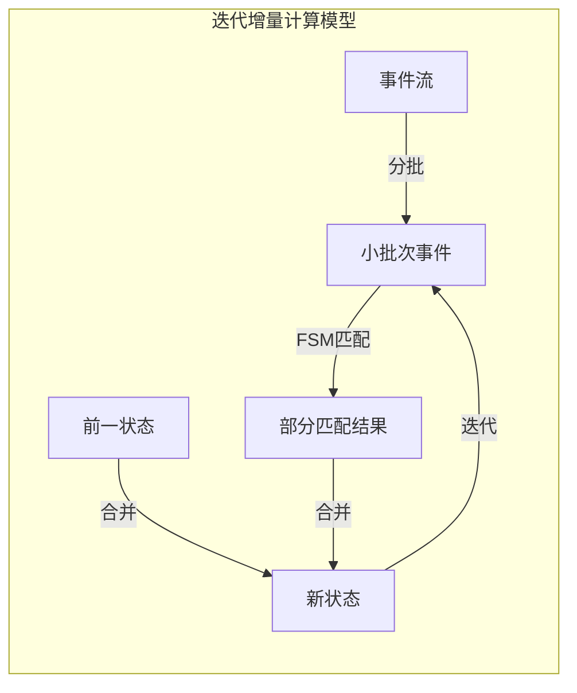

# Flink PatternAPI原理与代码实例讲解

## 1. 背景介绍

### 1.1 问题的由来

在当今大数据时代,越来越多的应用程序需要实时处理大量的事件数据流。传统的批处理系统无法满足这种低延迟和高吞吐量的需求。因此,针对数据流的实时处理成为一个迫切的需求。Apache Flink作为一种新兴的分布式流处理框架,为解决这一问题提供了强大的工具。

Flink提供了称为PatternAPI的复杂事件处理(CEP)库,用于在无边界的事件流中发现有趣的事件模式。PatternAPI允许用户使用类似正则表达式的模式语言来定义要搜索的模式,并提供了多种模式策略和模式匹配条件,使得复杂事件处理变得更加灵活和高效。

### 1.2 研究现状

目前,已经有许多学者和工程师对Flink的PatternAPI进行了深入研究和实践应用。他们探索了PatternAPI在不同领域的应用场景,如网络安全、物联网、电子商务等,并提出了一些改进和优化方法。然而,由于PatternAPI相对较新,仍然存在一些需要解决的问题和挑战,例如模式表达式的可读性、性能优化、内存管理等。

### 1.3 研究意义

深入理解Flink PatternAPI的原理和实现细节,对于充分利用其强大功能、提高复杂事件处理的效率至关重要。本文将从理论和实践两个角度,系统地介绍PatternAPI的核心概念、算法原理、数学模型、代码实现等,旨在为读者提供一个全面的指南,帮助他们掌握PatternAPI,并能够灵活地将其应用于实际场景中。

### 1.4 本文结构

本文共分为9个部分:

1. 背景介绍
2. 核心概念与联系
3. 核心算法原理与具体操作步骤
4. 数学模型和公式及详细讲解和举例说明
5. 项目实践:代码实例和详细解释说明
6. 实际应用场景
7. 工具和资源推荐
8. 总结:未来发展趋势与挑战
9. 附录:常见问题与解答

## 2. 核心概念与联系

在深入探讨PatternAPI的算法原理和实现细节之前,我们需要先了解一些核心概念。

### 2.1 事件流(Event Stream)

事件流是PatternAPI处理的基本数据单元。事件流是一个无边界的、持续不断产生的事件序列。每个事件都包含一个时间戳,用于表示该事件发生的时间。事件流可以来自各种来源,如传感器、网络日志、用户交互等。

### 2.2 模式(Pattern)

模式是用户定义的一种事件序列,用于描述需要在事件流中搜索和匹配的有趣事件组合。模式由多个模式原语组成,模式原语可以是单个事件、事件序列或其他模式。PatternAPI提供了丰富的模式原语和组合运算符,使得模式定义变得非常灵活和强大。

### 2.3 模式策略(Pattern Strategy)

模式策略决定了如何在事件流中搜索和匹配模式。PatternAPI支持多种模式策略,包括:

- 严格近邻(Strict Contiguity):要求匹配的事件严格连续,不允许中间插入其他事件。
- 松散近邻(Relaxed Contiguity):允许匹配的事件之间插入其他事件,但插入事件不属于模式的一部分。
- 松散顺序(Relaxed Monotonicity):允许匹配的事件无序,只要它们的时间戳保持递增即可。

不同的模式策略适用于不同的场景,用户可以根据具体需求进行选择。

### 2.4 模式匹配条件(Pattern Matching Condition)

模式匹配条件用于过滤和处理匹配到的模式序列。PatternAPI支持多种匹配条件,包括:

- 简单条件:基于事件属性或时间属性的条件,如大于、小于、等于等。
- 组合条件:使用逻辑运算符(与、或、非)组合多个简单条件。
- 迭代条件:对事件序列中的每个事件应用条件。

用户可以根据具体需求,灵活组合不同的匹配条件。

### 2.5 PatternStream

PatternStream是PatternAPI的核心数据结构,它表示根据给定模式从事件流中提取出的匹配序列。PatternStream支持各种转换操作,如过滤、映射、联接等,最终可以将处理结果输出到外部系统或进行进一步分析。

上述核心概念相互关联,共同构建了PatternAPI的整体框架。深入理解这些概念,对于掌握PatternAPI的使用和优化至关重要。

## 3. 核心算法原理与具体操作步骤

### 3.1 算法原理概述

PatternAPI的核心算法原理基于有限状态机(Finite State Machine,FSM)和迭代增量计算模型(Incremental Iterative Computing Model)。

#### 3.1.1 有限状态机(FSM)

FSM是一种数学计算模型,广泛应用于模式匹配、编译器设计等领域。在PatternAPI中,每个模式都被转换为一个FSM,用于在事件流中搜索和匹配该模式。

FSM由一组有限的状态、一个初始状态、一组转移函数和一组最终状态组成。当一个事件到达时,FSM根据当前状态和事件类型,通过转移函数转移到下一个状态。如果到达最终状态,则表示匹配到一个完整的模式序列。

#### 3.1.2 迭代增量计算模型

由于事件流是无边界的,PatternAPI采用了迭代增量计算模型,以高效地处理持续到达的新事件。该模型的核心思想是:

1. 将事件流分成一个个的小批次(小窗口)。
2. 对每个小批次,使用FSM进行模式匹配,生成部分匹配结果。
3. 将部分匹配结果与之前的状态合并,形成新的状态。
4. 基于新的状态,继续处理下一个小批次的事件。

通过这种增量式的计算方式,PatternAPI能够高效地处理大规模的事件流,同时保证了结果的准确性和完整性。

上图展示了PatternAPI的迭代增量计算模型。事件流被分成小批次,每个小批次使用FSM进行模式匹配,生成部分匹配结果。这些结果与前一状态合并,形成新的状态,用于处理下一个小批次。

### 3.2 算法步骤详解

PatternAPI的算法实现可以分为以下几个主要步骤:

#### 3.2.1 模式编译

在这一步骤中,用户定义的模式会被编译转换为一个FSM。PatternAPI提供了一个模式解析器,能够解析复杂的模式表达式,并生成对应的FSM结构。

该步骤包括以下子步骤:

1. 词法分析:将模式表达式分解为一个个的词法单元(token)。
2. 语法分析:根据模式语言的语法规则,构建抽象语法树(AST)。
3. 代码生成:遍历AST,生成FSM的状态转移表和其他辅助数据结构。

#### 3.2.2 状态分区

为了提高模式匹配的效率,PatternAPI会根据FSM的结构对状态进行分区。每个分区包含一组相关的状态,分区之间相互独立,可以并行执行。

状态分区算法的核心思想是:将那些可能会由于同一个事件而发生状态转移的状态划分到同一个分区中。这样可以避免重复计算,从而提高效率。

#### 3.2.3 迭代增量计算

这是PatternAPI算法的核心步骤,如前所述,它采用了迭代增量计算模型。具体步骤如下:

1. 将事件流分成小批次。
2. 对每个小批次中的事件,根据当前状态和事件类型,使用FSM进行状态转移,生成新的状态集合。
3. 对新的状态集合进行规约(Pruning),移除无效状态和重复状态。
4. 将规约后的状态集合与前一状态合并,形成新的总状态。
5. 基于新的总状态,继续处理下一个小批次。

在这个过程中,PatternAPI会智能地重用之前计算的中间结果,避免重复计算,从而提高效率。

#### 3.2.4 模式序列构建

当FSM达到最终状态时,表示匹配到一个完整的模式序列。在这一步骤中,PatternAPI会根据FSM的状态转移路径,从原始事件流中提取出匹配的事件序列,构建PatternStream。

#### 3.2.5 PatternStream处理

最后一步是对PatternStream执行各种转换操作,如过滤、映射、联接等,并将最终结果输出或进行进一步分析。这一步骤与Flink的普通DataStream API类似,用户可以灵活地组合各种转换操作,以满足不同的需求。

### 3.3 算法优缺点

PatternAPI算法具有以下优点:

1. **高效**:通过状态分区、增量计算等优化策略,PatternAPI能够高效地处理大规模的事件流。
2. **准确**:基于FSM的模式匹配算法能够保证结果的准确性和完整性。
3. **灵活**:支持丰富的模式原语、模式策略和匹配条件,可以满足各种复杂的模式匹配需求。
4. **可扩展**:作为Flink的一部分,PatternAPI可以无缝集成Flink的其他功能,如窗口操作、状态管理等。

但同时,PatternAPI算法也存在一些缺点和局限性:

1. **内存开销**:由于需要维护大量的状态信息,PatternAPI的内存开销可能较高,特别是在处理大规模事件流时。
2. **延迟**:虽然PatternAPI设计为低延迟,但在某些情况下,如模式较为复杂或事件流波动较大时,可能会引入一定的延迟。
3. **可读性**:复杂的模式表达式可能难以阅读和维护,需要一定的学习成本。

总的来说,PatternAPI算法在效率、准确性和灵活性方面表现出色,但也需要权衡内存开销、延迟和可读性等因素。

### 3.4 算法应用领域

PatternAPI算法可以应用于各种需要实时处理复杂事件模式的场景,包括但不限于:

1. **网络安全**:检测网络入侵行为、垃圾邮件、病毒传播等。
2. **物联网(IoT)**:监测传感器数据,发现异常模式,如设备故障、环境变化等。
3. **电子商务**:分析用户行为模式,如购买路径、浏览习惯等,用于个性化推荐和营销策略优化。
4. **金融服务**:实时监控交易活动,发现可疑模式,如欺诈行为、洗钱等。
5. **运维监控**:监测系统日志,发现异常事件模式,如硬件故障、性能bottleneck等。
6. **智能交通**:分析车辆行驶模式,优化交通路线和信号控制。

总之,任何需要从大规模事件流中发现有趣模式的场景,都可以考虑使用PatternAPI作为解决方案。

## 4. 数学模型和公式及详细讲解和举例说明

在上一节中,我们介绍了PatternAPI算法的核心原理和步骤。在这一节,我们将深入探讨PatternAPI背后的数学模型和公式,以及相关的案例分析和常见问题解答。

### 4.1 数学模型构建

PatternAPI算法的数学模型基于有限状态机(FSM)理论。FSM可以形式化地定义如下:

$$
M = (Q, \Sigma, \delta, q_0, F)
$$

其中:

- $Q$ 是一个有限的状态集合
- $\Sigma$ 是一个有限的输入符号集合(事件类型)
- $\delta: Q \times \Sigma \rightarrow Q$ 是状态转