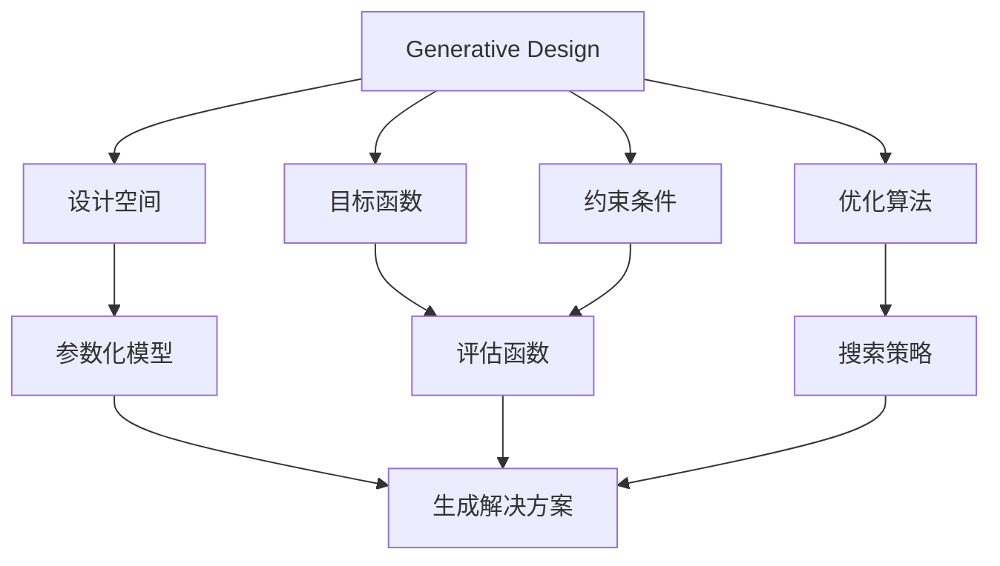

# Generative Design原理与代码实例讲解

## 1. 背景介绍

### 1.1 问题的由来

在传统的设计过程中,设计师需要手动创建和修改每一个设计方案,这种方式存在许多局限性。首先,手动设计过程耗时耗力,难以快速生成大量设计方案进行探索。其次,人工设计容易受到设计师个人经验和偏好的影响,难以保证设计结果的多样性和新颖性。此外,对于一些复杂的设计问题,人工设计也可能难以考虑所有的约束条件和目标函数。因此,我们需要一种新的设计范式来克服传统设计方法的不足。

### 1.2 研究现状

近年来,随着计算能力的不断提高和人工智能技术的快速发展,Generative Design(生成式设计)作为一种新兴的设计范式逐渐引起了研究者的关注。Generative Design利用计算机算法自动生成大量不同的设计方案,并根据设定的目标函数和约束条件进行优化和筛选,从而获得满足要求的最优设计方案。

Generative Design已经在多个领域得到了广泛的应用,例如产品设计、建筑设计、艺术创作等。一些知名公司如Autodesk、Airbus、Nike等都已经开始探索和应用Generative Design技术。

### 1.3 研究意义

Generative Design作为一种全新的设计范式,具有以下重要意义:

1. **提高设计效率**:通过算法自动生成大量设计方案,可以极大地提高设计过程的效率,节省时间和人力成本。

2. **增强设计创新性**:算法可以探索人工难以触及的设计空间,生成具有创新性和新颖性的设计方案。

3. **优化设计质量**:通过设置合理的目标函数和约束条件,可以获得性能更优、更符合要求的设计结果。

4. **促进跨学科融合**:Generative Design需要计算机科学、优化理论、设计学等多个学科的知识,有助于推动不同领域的交叉融合。

### 1.4 本文结构

本文将全面介绍Generative Design的原理、算法、实现方法和应用场景。文章主要包括以下几个部分:

1. 核心概念与联系
2. 核心算法原理与具体操作步骤
3. 数学模型和公式详细讲解与案例分析
4. 项目实践:代码实例和详细解释说明
5. 实际应用场景
6. 工具和资源推荐
7. 总结:未来发展趋势与挑战
8. 附录:常见问题与解答

## 2. 核心概念与联系

Generative Design的核心概念包括:

1. **设计空间(Design Space)**: 所有可能的设计解决方案的集合,通常是一个高维空间。设计空间由参数化模型定义。

2. **参数化模型(Parametric Model)**: 使用参数来描述设计对象的数学或计算机模型,不同的参数组合对应不同的设计解决方案。

3. **目标函数(Objective Function)**: 定义设计目标,用于评估设计解决方案的优劣,通常需要最大化或最小化。

4. **约束条件(Constraints)**: 对设计解决方案的限制条件,确保生成的解决方案满足特定要求。

5. **评估函数(Evaluation Function)**: 根据目标函数和约束条件,对设计解决方案进行评估和打分。

6. **优化算法(Optimization Algorithm)**: 用于在设计空间中搜索最优解决方案的算法,如遗传算法、模拟退火等。

7. **搜索策略(Search Strategy)**: 优化算法在设计空间中探索的方式,如随机搜索、启发式搜索等。

上述概念相互关联,共同构成了Generative Design的理论框架。设计空间由参数化模型定义,目标函数和约束条件组成评估函数,优化算法根据评估函数在设计空间中搜索最优解决方案。

## 3. 核心算法原理与具体操作步骤

### 3.1 算法原理概述

Generative Design的核心算法通常采用基于种群的优化算法,如遗传算法(Genetic Algorithm)、粒子群优化算法(Particle Swarm Optimization)等。这些算法模拟自然界中的进化过程或群体行为,通过迭代优化来逐步改善种群中个体的适应度,最终获得满足要求的最优解决方案。

算法的基本流程如下:

1. 初始化种群,随机生成一组初始解决方案。
2. 评估种群中每个个体的适应度,根据目标函数和约束条件进行打分。
3. 根据适应度值,选择优秀的个体作为父代。
4. 通过交叉、变异等遗传操作,生成新的子代个体。
5. 将子代个体加入种群,替换掉适应度较差的个体。
6. 重复步骤2-5,直到满足终止条件(如达到最大迭代次数或找到满意解)。

在这个过程中,算法不断探索设计空间,逐步优化解决方案,最终收敛到满足要求的最优解。

### 3.2 算法步骤详解

以遗传算法为例,具体步骤如下:

1. **编码(Encoding)**

   将设计问题的解决方案编码为染色体(通常使用二进制串或实数向量)。编码方式直接影响到算法的搜索能力和效率。

2. **初始化种群(Population Initialization)**

   随机生成一组初始解决方案,作为第一代种群。种群规模通常在几十到几百之间。

3. **适应度评估(Fitness Evaluation)**

   根据目标函数和约束条件,计算每个个体的适应度值。适应度值越高,表示该个体越优秀。

4. **选择操作(Selection)**

   根据适应度值,从当前种群中选择优秀的个体作为父代,用于产生下一代。常用的选择方法有轮盘赌选择、锦标赛选择等。

5. **交叉操作(Crossover)**

   随机选择两个父代个体,在它们的染色体上随机选取一个或多个交叉点,交换部分基因,生成新的子代个体。交叉操作有助于保持种群的多样性。

6. **变异操作(Mutation)**

   在子代个体的染色体上随机改变一个或多个基因,以引入新的遗传特征,增加种群的多样性,防止陷入局部最优解。

7. **新一代种群(New Generation)**

   将生成的子代个体加入种群,替换掉适应度较差的个体,形成新一代种群。

8. **终止条件检测(Termination Condition)**

   检查是否满足终止条件,如达到最大迭代次数、满足期望适应度值或在一定代数内没有进一步改进等。如果条件满足,则算法终止,输出当前最优解决方案;否则,返回步骤3,继续进行下一轮迭代。

### 3.3 算法优缺点

**优点**:

- 全局搜索能力强,可以有效避免陷入局部最优解。
- 可以处理高维、非线性、非凸等复杂优化问题。
- 无需提供初始解或梯度信息,对初始条件的要求较低。
- 易于并行计算,可以提高计算效率。

**缺点**:

- 收敛速度较慢,需要大量的迭代次数。
- 算法参数的设置(如种群规模、交叉概率、变异概率等)对结果有较大影响,需要一定经验进行调优。
- 存在"预成熟收敛"的风险,可能过早收敛到次优解。
- 对于某些特殊问题,可能难以获得理论上的最优解。

### 3.4 算法应用领域

基于种群的优化算法在Generative Design领域有着广泛的应用,包括但不限于:

- **产品设计**: 利用算法优化产品的形状、结构、材料等,以获得更好的性能和功能。
- **建筑设计**: 根据建筑物的功能需求、环境约束等,生成满足条件的建筑方案。
- **航空航天设计**: 优化飞机机翼、发动机等关键部件的设计,提高空气动力学性能。
- **艺术创作**: 通过算法生成具有独特风格和创意的艺术作品,如雕塑、插画等。
- **结构优化**: 优化各种结构(如桥梁、建筑等)的强度、重量、成本等指标。
- **路径规划**: 在满足各种约束条件下,规划出最优的路径方案。

除了上述领域,Generative Design还可以应用于其他需要优化和自动化设计的领域,如机器人设计、智能制造等。

## 4. 数学模型和公式详细讲解与举例说明

### 4.1 数学模型构建

在Generative Design中,我们需要将设计问题转化为数学模型,以便使用优化算法求解。数学模型通常包括以下几个部分:

1. **决策变量(Decision Variables)**

   描述设计对象的参数,通常表示为向量 $\vec{x} = (x_1, x_2, \ldots, x_n)$,其中 $n$ 为参数个数。

2. **目标函数(Objective Function)**

   定义设计目标,需要最大化或最小化的函数,通常表示为 $f(\vec{x})$。

3. **约束条件(Constraints)**

   对决策变量的限制条件,可分为等式约束和不等式约束:

   $$
   \begin{aligned}
   g_i(\vec{x}) &= 0, \quad i = 1, 2, \ldots, m \
   h_j(\vec{x}) &\leq 0, \quad j = 1, 2, \ldots, p
   \end{aligned}
   $$

   其中 $m$ 为等式约束个数, $p$ 为不等式约束个数。

4. **边界条件(Bounds)**

   决策变量的取值范围,通常表示为:

   $$
   l_k \leq x_k \leq u_k, \quad k = 1, 2, \ldots, n
   $$

   其中 $l_k$ 和 $u_k$ 分别为第 $k$ 个决策变量的下界和上界。

将上述部分组合起来,我们可以构建出如下的数学模型:

$$
\begin{aligned}
\min\limits_{\vec{x}} \quad & f(\vec{x}) \
\text{s.t.} \quad & g_i(\vec{x}) = 0, \quad i = 1, 2, \ldots, m \
& h_j(\vec{x}) \leq 0, \quad j = 1, 2, \ldots, p \
& l_k \leq x_k \leq u_k, \quad k = 1, 2, \ldots, n
\end{aligned}
$$

该模型的目标是在满足所有约束条件的前提下,找到能够最小化目标函数 $f(\vec{x})$ 的决策变量 $\vec{x}$ 的值。

### 4.2 公式推导过程

在许多情况下,我们需要根据具体的设计问题,推导出适当的目标函数和约束条件。以下是一个简单的例子,说明如何将设计需求转化为数学公式。

**示例**: 设计一个长方体包装盒,要求:

1. 包装盒的体积为 $V_0$。
2. 包装盒的长、宽、高之和不超过 $L_0$。
3. 包装盒的长、宽、高比例在 $[r_1, r_2]$ 范围内。

我们定义决策变量为 $\vec{x} = (x_1, x_2, x_3)$,分别表示包装盒的长、宽、高。则数学模型可以表示为:

$$
\begin{aligned}
\min\limits_{\vec{x}} \quad & f(\vec{x}) = x_1 x_2 x_3 - V_0 \
\text{s.t.} \quad & x_1 + x_2 + x_3 \leq L_0 \
& r_1 \leq \frac{x_1}{x_2} \leq r_2 \
& r_1 \leq \frac{x_1}{x_3} \leq r_2 \
& r_1 \leq \frac{x_2}{x_3} \leq r