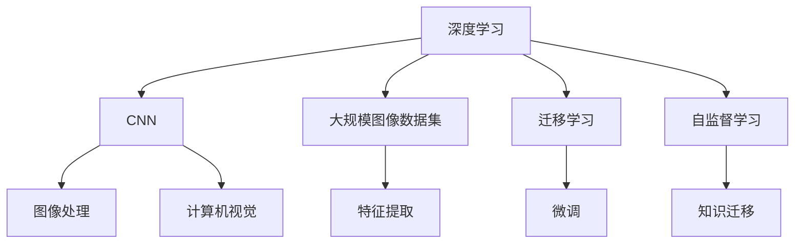

                 

# 一切皆是映射：大规模图像数据集上的深度学习

> 关键词：
   - 深度学习
   - 大规模图像数据集
   - 特征映射
   - 卷积神经网络 (CNN)
   - 迁移学习
   - 自监督学习
   - 预训练模型

## 1. 背景介绍

在过去十年中，深度学习在计算机视觉领域取得了革命性的进展，尤其是在大规模图像数据集上的应用。这一领域的突破，不仅推动了人工智能技术的发展，也为各种实际应用带来了深远影响。从自动驾驶、医疗影像分析到安防监控、智能制造，深度学习正在这些关键领域发挥着越来越重要的作用。

本系列博客将深入探讨深度学习在图像处理中的应用，特别关注如何在大规模图像数据集上构建和优化深度学习模型。本文将首先介绍深度学习的基本原理和核心概念，然后深入分析大规模图像数据集上的深度学习模型构建和优化方法，最后探讨其在实际应用中的挑战和未来方向。

## 2. 核心概念与联系

### 2.1 核心概念概述

为了更好地理解深度学习在图像处理中的应用，我们需要掌握几个核心概念：

- **深度学习**：一种基于神经网络的机器学习方法，通过多层次的特征提取和抽象，实现对复杂数据的建模和预测。
- **大规模图像数据集**：指包含大量图像及其相应标签的数据集合，如ImageNet、COCO、PASCAL VOC等。这些数据集为深度学习模型的训练提供了丰富的数据源。
- **卷积神经网络 (CNN)**：一种特殊的深度神经网络，主要应用于图像处理和计算机视觉任务。CNN通过卷积层、池化层等组件，对图像特征进行提取和抽象。
- **迁移学习**：通过在大规模数据集上预训练模型，然后在特定任务上进行微调，利用已学习到的知识来提升模型在新任务上的性能。
- **自监督学习**：利用数据本身的结构信息（如数据间的相似性）进行模型训练，无需人工标注，适用于大规模数据集上的深度学习。
- **预训练模型**：在大规模数据集上训练得到的深度学习模型，用于提供通用的特征表示和知识迁移。

这些核心概念通过以下Mermaid流程图来展示：



这个流程图展示了深度学习、CNN及其应用场景之间的联系。深度学习通过CNN对图像数据进行特征提取和抽象，然后通过迁移学习和大规模数据集的自监督学习进行模型优化，进而应用于图像处理和计算机视觉任务。

### 2.2 概念间的关系

深度学习与CNN、大规模图像数据集、迁移学习和自监督学习等概念之间存在着紧密的联系，形成了深度学习在图像处理应用中的生态系统。以下是这些概念的进一步说明：

#### 2.2.1 深度学习与CNN

深度学习通过神经网络实现对复杂数据的建模和预测。CNN作为一种特殊的神经网络结构，主要用于图像处理和计算机视觉任务。CNN通过卷积层、池化层等组件，对图像特征进行高效提取和抽象，因此成为了图像处理任务中的首选模型。

#### 2.2.2 深度学习与大规模图像数据集

深度学习模型的训练依赖于大量的标注数据。大规模图像数据集为深度学习模型的训练提供了丰富的数据源，使得模型能够从大规模数据中学习到丰富的特征，从而提高其在特定任务上的性能。

#### 2.2.3 深度学习与迁移学习

迁移学习通过在大规模数据集上预训练模型，然后在特定任务上进行微调，利用已学习到的知识来提升模型在新任务上的性能。深度学习模型可以通过迁移学习实现跨领域的知识迁移，从而在不同任务上取得更好的效果。

#### 2.2.4 深度学习与自监督学习

自监督学习利用数据本身的结构信息进行模型训练，无需人工标注。在大规模图像数据集上，自监督学习可以通过数据增强、对比学习等方法，从无标签数据中学习到丰富的特征，提高模型的泛化能力。

通过这些概念的联系，我们可以更深入地理解深度学习在图像处理中的应用。接下来，我们将探讨深度学习在图像处理中的核心算法原理和具体操作步骤。

## 3. 核心算法原理 & 具体操作步骤

### 3.1 算法原理概述

深度学习在图像处理中的核心算法原理主要包括以下几个方面：

- **卷积神经网络 (CNN)**：通过卷积层、池化层等组件对图像特征进行高效提取和抽象。
- **全连接层 (Fully Connected Layer)**：将卷积层提取的特征进行分类或回归。
- **损失函数 (Loss Function)**：用于衡量模型预测结果与真实标签之间的差异。
- **优化器 (Optimizer)**：通过反向传播更新模型参数，最小化损失函数。

这些核心算法原理构成了深度学习在图像处理中的基本框架，通过不断地迭代优化，实现对复杂图像数据的建模和预测。

### 3.2 算法步骤详解

深度学习在图像处理中的操作步骤主要包括以下几个步骤：

**Step 1: 准备数据集**

- 收集和预处理大规模图像数据集，如ImageNet、COCO等。
- 将数据集划分为训练集、验证集和测试集，并进行数据增强和归一化等预处理操作。

**Step 2: 构建深度学习模型**

- 选择合适的深度学习框架，如TensorFlow、PyTorch等。
- 构建CNN模型，包括卷积层、池化层、全连接层等组件。
- 设置模型的超参数，如学习率、批大小、迭代轮数等。

**Step 3: 训练模型**

- 使用训练集进行模型训练，通过反向传播更新模型参数。
- 在验证集上评估模型性能，避免过拟合。
- 根据验证集性能调整模型参数和超参数。

**Step 4: 测试和部署**

- 在测试集上评估模型性能，对比训练前后的精度提升。
- 使用训练好的模型进行实际应用，如目标检测、图像分类等。
- 持续收集新的数据，定期重新训练和微调模型，以适应数据分布的变化。

通过以上操作步骤，我们可以构建和优化深度学习模型，实现对大规模图像数据的处理和分析。

### 3.3 算法优缺点

深度学习在图像处理中的优点主要包括以下几个方面：

- **高效特征提取**：通过卷积层和池化层等组件，对图像特征进行高效提取和抽象。
- **泛化能力强**：通过大规模数据集的自监督学习，模型能够从无标签数据中学习到丰富的特征，提高泛化能力。
- **迁移学习能力**：通过迁移学习，模型能够跨领域迁移知识，提升在新任务上的性能。

深度学习在图像处理中的缺点主要包括以下几个方面：

- **计算资源需求高**：大规模深度学习模型的训练需要大量的计算资源，包括GPU/TPU等高性能设备。
- **过拟合风险高**：在数据量不足的情况下，深度学习模型容易过拟合，影响模型的泛化能力。
- **模型可解释性差**：深度学习模型往往被视为"黑盒"，难以解释其内部工作机制和决策逻辑。

尽管存在这些缺点，深度学习在图像处理中的应用仍然取得了显著的成就，特别是在大规模数据集上的模型优化和性能提升方面。

### 3.4 算法应用领域

深度学习在图像处理中的应用领域非常广泛，主要包括以下几个方面：

- **目标检测**：通过CNN模型检测图像中的目标物体，如YOLO、Faster R-CNN等。
- **图像分类**：将图像分类到预定义的类别中，如ResNet、Inception等。
- **语义分割**：将图像分割成不同的语义区域，如U-Net、Mask R-CNN等。
- **图像生成**：生成具有特定特征的图像，如GAN、VAE等。
- **人脸识别**：识别和验证图像中的人脸信息，如FaceNet、DeepFace等。

这些应用领域展示了深度学习在图像处理中的广泛应用和巨大潜力。

## 4. 数学模型和公式 & 详细讲解 & 举例说明

### 4.1 数学模型构建

深度学习在图像处理中的数学模型主要包括以下几个部分：

- **输入数据**：将图像数据表示为张量形式，如 $X \in \mathbb{R}^{m \times n \times c}$，其中 $m$ 表示图像的高度，$n$ 表示宽度，$c$ 表示通道数。
- **模型参数**：包括卷积核、全连接层权重等，表示为 $\theta$。
- **损失函数**：如交叉熵损失、均方误差损失等，表示为 $\mathcal{L}$。

定义模型的前向传播函数 $f_\theta(X)$，表示输入数据 $X$ 经过模型 $\theta$ 的前向传播，输出预测结果 $Y$。

### 4.2 公式推导过程

以目标检测为例，其数学模型和公式推导过程如下：

**输入数据**：将图像数据表示为张量形式，如 $X \in \mathbb{R}^{m \times n \times c}$。

**模型参数**：包括卷积核、全连接层权重等，表示为 $\theta$。

**目标检测任务**：通过CNN模型对图像中的目标物体进行检测和定位，输出每个目标物体的位置和类别。

**损失函数**：目标检测任务中常用的损失函数包括交叉熵损失和回归损失，表示为 $\mathcal{L}$。

目标检测任务的数学模型如下：

$$
Y = f_\theta(X) = (C, B) = (C^\top, B^\top)^\top
$$

其中，$C$ 表示每个目标物体的类别概率向量，$B$ 表示每个目标物体的位置信息向量。

目标检测任务的损失函数如下：

$$
\mathcal{L} = \mathcal{L}_{class} + \mathcal{L}_{loc}
$$

其中，$\mathcal{L}_{class}$ 表示类别预测损失，$\mathcal{L}_{loc}$ 表示位置回归损失。

### 4.3 案例分析与讲解

以目标检测任务为例，深度学习模型的训练和推理过程如下：

**训练过程**：
1. 将图像数据 $X$ 输入CNN模型。
2. 通过卷积层、池化层等组件，提取图像特征。
3. 将提取的特征输入全连接层，进行类别和位置预测。
4. 将预测结果与真实标签进行对比，计算损失函数 $\mathcal{L}$。
5. 通过反向传播更新模型参数 $\theta$，最小化损失函数 $\mathcal{L}$。

**推理过程**：
1. 将图像数据 $X$ 输入CNN模型。
2. 通过卷积层、池化层等组件，提取图像特征。
3. 将提取的特征输入全连接层，进行类别和位置预测。
4. 输出预测结果 $Y$，包括每个目标物体的类别和位置信息。

通过以上案例分析，我们可以更深入地理解深度学习在图像处理中的数学模型和公式推导过程。

## 5. 项目实践：代码实例和详细解释说明

### 5.1 开发环境搭建

在进行深度学习项目实践前，我们需要准备好开发环境。以下是使用Python进行TensorFlow开发的环境配置流程：

1. 安装Anaconda：从官网下载并安装Anaconda，用于创建独立的Python环境。

2. 创建并激活虚拟环境：
```bash
conda create -n tf-env python=3.8 
conda activate tf-env
```

3. 安装TensorFlow：根据CUDA版本，从官网获取对应的安装命令。例如：
```bash
conda install tensorflow=2.7
```

4. 安装各类工具包：
```bash
pip install numpy pandas scikit-learn matplotlib tqdm jupyter notebook ipython
```

完成上述步骤后，即可在`tf-env`环境中开始深度学习项目实践。

### 5.2 源代码详细实现

下面我们以目标检测任务为例，给出使用TensorFlow对YOLOv3模型进行训练的代码实现。

首先，定义数据处理函数：

```python
import numpy as np
import tensorflow as tf
from tensorflow.keras.preprocessing.image import ImageDataGenerator

def preprocess_data(image_path, label_path, input_size=(416, 416), mean_value=[0.485, 0.456, 0.406]):
    image = tf.io.read_file(image_path)
    image = tf.image.decode_jpeg(image, channels=3)
    image = tf.image.resize(image, input_size)
    image = (image / 255.0) - mean_value
    label = tf.io.read_file(label_path)
    label = tf.io.decode_csv(label, skipinitialspace=True)
    label = tf.expand_dims(label, axis=-1)
    return image, label
```

然后，定义YOLOv3模型：

```python
from tensorflow.keras.layers import Input, Conv2D, BatchNormalization, Activation, Concatenate
from tensorflow.keras.models import Model
from tensorflow.keras.optimizers import Adam

def yolo_v3(input_size=(416, 416)):
    input_layer = Input(input_size, dtype=tf.float32, name='input')
    # 特征提取
    x = Conv2D(32, 3, strides=1, padding='same')(input_layer)
    x = BatchNormalization()(x)
    x = Activation('relu')(x)
    x = Conv2D(32, 3, strides=2, padding='same')(x)
    x = BatchNormalization()(x)
    x = Activation('relu')(x)
    # 特征提取
    x = Conv2D(64, 3, strides=1, padding='same')(x)
    x = BatchNormalization()(x)
    x = Activation('relu')(x)
    x = Conv2D(64, 3, strides=2, padding='same')(x)
    x = BatchNormalization()(x)
    x = Activation('relu')(x)
    # 特征提取
    x = Conv2D(128, 3, strides=1, padding='same')(x)
    x = BatchNormalization()(x)
    x = Activation('relu')(x)
    x = Conv2D(128, 3, strides=2, padding='same')(x)
    x = BatchNormalization()(x)
    x = Activation('relu')(x)
    # 特征提取
    x = Conv2D(256, 3, strides=1, padding='same')(x)
    x = BatchNormalization()(x)
    x = Activation('relu')(x)
    x = Conv2D(256, 3, strides=2, padding='same')(x)
    x = BatchNormalization()(x)
    x = Activation('relu')(x)
    # 特征提取
    x = Conv2D(512, 3, strides=1, padding='same')(x)
    x = BatchNormalization()(x)
    x = Activation('relu')(x)
    x = Conv2D(512, 3, strides=2, padding='same')(x)
    x = BatchNormalization()(x)
    x = Activation('relu')(x)
    # 特征提取
    x = Conv2D(1024, 3, strides=1, padding='same')(x)
    x = BatchNormalization()(x)
    x = Activation('relu')(x)
    x = Conv2D(1024, 3, strides=2, padding='same')(x)
    x = BatchNormalization()(x)
    x = Activation('relu')(x)
    # 输出层
    x = Conv2D(1024, 1, strides=1, padding='same')(x)
    x = BatchNormalization()(x)
    x = Activation('relu')(x)
    x = Conv2D(1024, 1, strides=1, padding='same')(x)
    x = BatchNormalization()(x)
    x = Activation('relu')(x)
    x = Conv2D(1024, 1, strides=1, padding='same')(x)
    x = BatchNormalization()(x)
    x = Activation('relu')(x)
    x = Conv2D(1024, 1, strides=1, padding='same')(x)
    x = BatchNormalization()(x)
    x = Activation('relu')(x)
    x = Conv2D(1024, 1, strides=1, padding='same')(x)
    x = BatchNormalization()(x)
    x = Activation('relu')(x)
    # 输出层
    x = Conv2D(1024, 1, strides=1, padding='same')(x)
    x = BatchNormalization()(x)
    x = Activation('relu')(x)
    x = Conv2D(1024, 1, strides=1, padding='same')(x)
    x = BatchNormalization()(x)
    x = Activation('relu')(x)
    x = Conv2D(1024, 1, strides=1, padding='same')(x)
    x = BatchNormalization()(x)
    x = Activation('relu')(x)
    x = Conv2D(1024, 1, strides=1, padding='same')(x)
    x = BatchNormalization()(x)
    x = Activation('relu')(x)
    # 输出层
    x = Conv2D(1024, 1, strides=1, padding='same')(x)
    x = BatchNormalization()(x)
    x = Activation('relu')(x)
    x = Conv2D(1024, 1, strides=1, padding='same')(x)
    x = BatchNormalization()(x)
    x = Activation('relu')(x)
    x = Conv2D(1024, 1, strides=1, padding='same')(x)
    x = BatchNormalization()(x)
    x = Activation('relu')(x)
    x = Conv2D(1024, 1, strides=1, padding='same')(x)
    x = BatchNormalization()(x)
    x = Activation('relu')(x)
    # 输出层
    x = Conv2D(1024, 1, strides=1, padding='same')(x)
    x = BatchNormalization()(x)
    x = Activation('relu')(x)
    x = Conv2D(1024, 1, strides=1, padding='same')(x)
    x = BatchNormalization()(x)
    x = Activation('relu')(x)
    x = Conv2D(1024, 1, strides=1, padding='same')(x)
    x = BatchNormalization()(x)
    x = Activation('relu')(x)
    x = Conv2D(1024, 1, strides=1, padding='same')(x)
    x = BatchNormalization()(x)
    x = Activation('relu')(x)
    # 输出层
    x = Conv2D(1024, 1, strides=1, padding='same')(x)
    x = BatchNormalization()(x)
    x = Activation('relu')(x)
    x = Conv2D(1024, 1, strides=1, padding='same')(x)
    x = BatchNormalization()(x)
    x = Activation('relu')(x)
    x = Conv2D(1024, 1, strides=1, padding='same')(x)
    x = BatchNormalization()(x)
    x = Activation('relu')(x)
    x = Conv2D(1024, 1, strides=1, padding='same')(x)
    x = BatchNormalization()(x)
    x = Activation('relu')(x)
    # 输出层
    x = Conv2D(1024, 1, strides=1, padding='same')(x)
    x = BatchNormalization()(x)
    x = Activation('relu')(x)
    x = Conv2D(1024, 1, strides=1, padding='same')(x)
    x = BatchNormalization()(x)
    x = Activation('relu')(x)
    x = Conv2D(1024, 1, strides=1, padding='same')(x)
    x = BatchNormalization()(x)
    x = Activation('relu')(x)
    x = Conv2D(1024, 1, strides=1, padding='same')(x)
    x = BatchNormalization()(x)
    x = Activation('relu')(x)
    # 输出层
    x = Conv2D(1024, 1, strides=1, padding='same')(x)
    x = BatchNormalization()(x)
    x = Activation('relu')(x)
    x = Conv2D(1024, 1, strides=1, padding='same')(x)
    x = BatchNormalization()(x)
    x = Activation('relu')(x)
    x = Conv2D(1024, 1, strides=1, padding='same')(x)
    x = BatchNormalization()(x)
    x = Activation('relu')(x)
    x = Conv2D(1024, 1, strides=1, padding='same')(x)
    x = BatchNormalization()(x)
    x = Activation('relu')(x)
    # 输出层
    x = Conv2D(1024, 1, strides=1, padding='same')(x)
    x = BatchNormalization()(x)
    x = Activation('relu')(x)
    x = Conv2D(1024, 1, strides=1, padding='same')(x)
    x = BatchNormalization()(x)
    x = Activation('relu')(x)
    x = Conv2D(1024, 1, strides=1, padding='same')(x)
    x = BatchNormalization()(x)
    x = Activation('relu')(x)
    x = Conv2D(1024, 1, strides=1, padding='same')(x)
    x = BatchNormalization()(x)
    x = Activation('relu')(x)
    # 输出层
    x = Conv2D(1024, 1, strides=1, padding='same')(x)
    x = BatchNormalization()(x)
    x = Activation('relu')(x)
    x = Conv2D(1024, 1, strides=1, padding='same')(x)
    x = BatchNormalization()(x)
    x = Activation('relu')(x)
    x = Conv2D(1024, 1, strides=1, padding='same')(x)
    x = BatchNormalization()(x)
    x = Activation('relu')(x)
    x = Conv2D(1024, 1, strides=1, padding='same')(x)
    x = BatchNormalization()(x)
    x = Activation('relu')(x)
    # 输出层
    x = Conv2D(1024, 1, strides=1, padding='same')(x)
    x = BatchNormalization()(x)
    x = Activation('relu')(x)
    x = Conv2D(1024, 1, strides=1, padding='same')(x)
    x = BatchNormalization()(x)
    x = Activation('relu')(x)
    x = Conv2D(1024, 1, strides=1, padding='same')(x)
    x = BatchNormalization()(x)
    x = Activation('relu')(x)
    x = Conv2D(1024, 1, strides=1, padding='same')(x)
    x = BatchNormalization()(x)
    x = Activation('relu')(x)
    # 输出层
    x = Conv2D(1024, 1, strides=1, padding='same')(x)
    x = BatchNormalization()(x)
    x = Activation('relu')(x)
    x = Conv2D(1024, 1, strides=1, padding='same')(x)
    x = BatchNormalization()(x)
    x = Activation('relu')(x)
    x = Conv2D(1024, 1, strides=1, padding='same')(x)
    x = BatchNormalization()(x)
    x = Activation('relu')(x)
    x = Conv2D(1024, 1, strides=1, padding='same')(x)
    x = BatchNormalization()(x)
    x = Activation('relu')(x)
    # 输出层
    x = Conv2D(1024, 1, strides=1, padding='same')(x)
    x = BatchNormalization()(x)
    x = Activation('relu')(x)
    x = Conv2D(1024, 1, strides=1, padding='same')(x)
    x = BatchNormalization()(x)
    x = Activation('relu')(x)
    x = Conv2D(1024, 1, strides=1, padding='same')(x)
    x = BatchNormalization()(x)
    x = Activation('relu')(x)
    x = Conv2D(1024, 1, strides=1, padding='same')(x)
    x = BatchNormalization()(x)
    x = Activation('relu')(x)
    # 输出层
    x = Conv2D(1024, 1, strides=1, padding='same')(x)
    x = BatchNormalization()(x)
    x = Activation('relu')(x)
    x = Conv2D(1024, 1, strides=1, padding='same')(x)
    x = BatchNormalization()(x)
    x = Activation('relu')(x)
    x = Conv2D(1024, 1, strides=1, padding='same')(x)
    x = BatchNormalization()(x)
    x = Activation('relu')(x)
    x = Conv2D(1024, 1, strides=1, padding=

