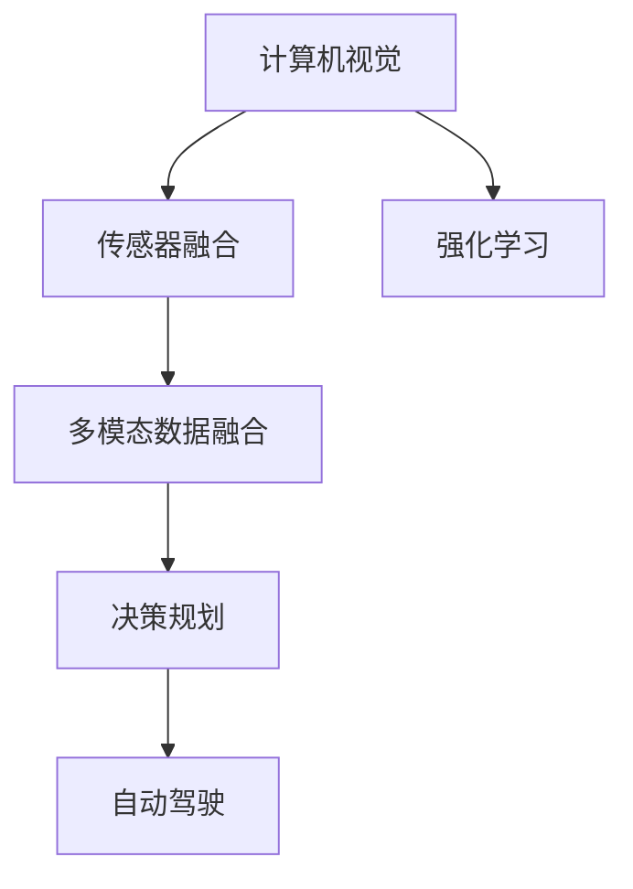
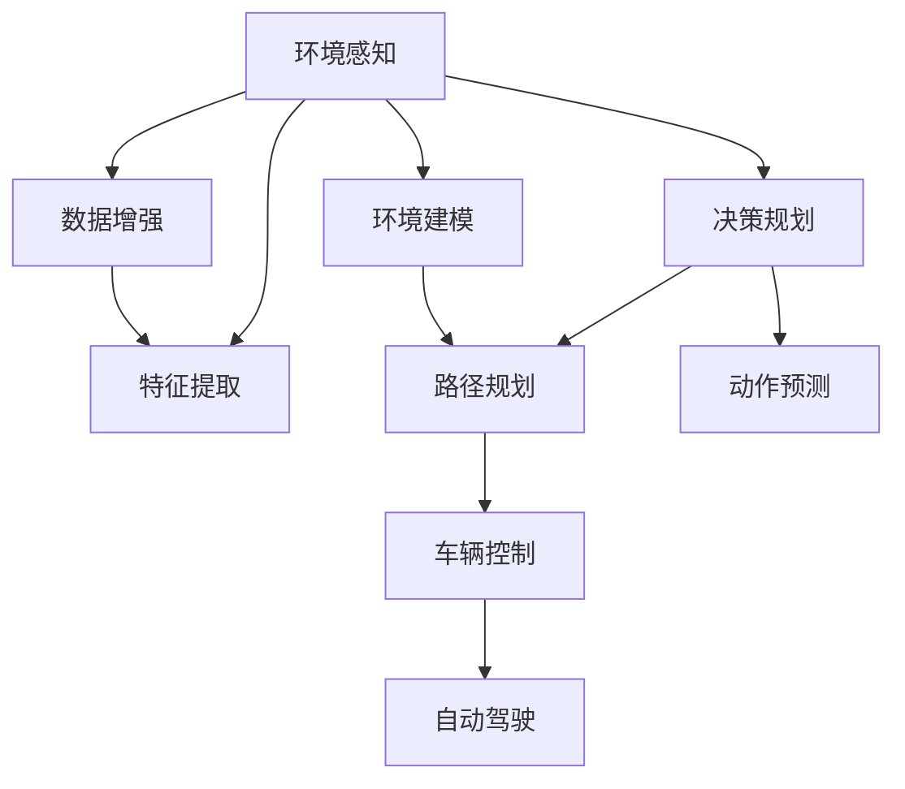

                 

# 一切皆是映射：深度学习在无人驾驶技术中的应用

> 关键词：无人驾驶,深度学习,神经网络,传感器融合,决策规划,计算机视觉,强化学习,多模态数据融合,自动驾驶,交通控制

## 1. 背景介绍

随着人工智能和深度学习技术的不断进步，无人驾驶技术正在迅速发展，有望彻底改变交通出行方式。无人驾驶车辆通过搭载各种传感器，实时采集环境信息，再经过深度学习模型的处理，实现自主导航、自动驾驶等功能。本文章将系统介绍深度学习在无人驾驶技术中的应用，并阐述其在感知、决策和控制等各个环节的作用。

## 2. 核心概念与联系

### 2.1 核心概念概述

本节将介绍几个与深度学习在无人驾驶中应用密切相关的核心概念：

- **无人驾驶**：通过人工智能技术，实现车辆自动感知环境、决策导航和控制执行，无需人工介入的驾驶模式。
- **计算机视觉**：利用摄像头、激光雷达等传感器获取环境图像，再通过深度学习模型进行语义分割、目标检测、物体跟踪等处理，实现环境感知功能。
- **强化学习**：通过与环境交互，根据奖励和惩罚信号，优化决策规划算法，实现车辆的自动导航和路径规划。
- **传感器融合**：集成各种传感器获取的信息，通过深度学习模型进行数据融合，提升环境感知的准确性和鲁棒性。
- **多模态数据融合**：将视觉、激光雷达、雷达等多种传感器获取的数据，通过深度学习模型进行联合处理，提高信息提取的全面性。
- **决策规划**：结合环境感知和目标信息，通过深度学习模型进行路径规划和动作预测，指导车辆自主导航。
- **自动驾驶**：集成环境感知、决策规划和控制执行等功能，实现车辆自动行驶。

这些核心概念之间存在着紧密的联系，共同构成了无人驾驶技术的核心架构。通过深度学习技术对这些环节的优化，可以显著提升无人驾驶系统的性能和可靠性。

### 2.2 概念间的关系

为了更直观地理解这些核心概念之间的关系，下面提供一个Mermaid流程图：



这个流程图展示了计算机视觉、传感器融合、决策规划等各个环节在无人驾驶系统中的位置和关系。其中，计算机视觉负责环境感知，传感器融合和多模态数据融合对感知结果进行优化，决策规划根据感知结果进行路径规划和动作预测，最终自动驾驶系统执行相应的控制指令，实现车辆的自主行驶。

### 2.3 核心概念的整体架构

为了更全面地理解深度学习在无人驾驶中的应用，下面我们提供一个综合的流程图：



这个综合流程图展示了深度学习在无人驾驶各个环节的应用。其中，环境感知包括计算机视觉、传感器融合、多模态数据融合等环节；环境建模和数据增强通过深度学习模型进行优化；特征提取利用深度学习提取环境中的关键信息；决策规划和动作预测通过深度学习进行路径规划和动作预测；车辆控制和自动驾驶结合这些结果进行车辆的实际控制，实现自动驾驶。

## 3. 核心算法原理 & 具体操作步骤

### 3.1 算法原理概述

深度学习在无人驾驶中的应用主要集中在感知、决策和控制三个环节，以下是这些环节中深度学习算法的基本原理：

- **感知环节**：计算机视觉通过深度学习模型对摄像头、激光雷达等传感器获取的环境图像进行处理，实现语义分割、目标检测、物体跟踪等功能。
- **决策环节**：强化学习通过与环境的交互，优化决策规划算法，实现车辆的自动导航和路径规划。
- **控制环节**：通过深度学习模型进行车辆控制指令的预测和执行，实现车辆的自动驾驶。

### 3.2 算法步骤详解

在实际应用中，深度学习在无人驾驶中主要包含以下几个关键步骤：

**Step 1: 数据采集与预处理**

无人驾驶系统通过传感器获取环境数据，包括摄像头、激光雷达、雷达等。这些数据通常需要经过预处理，如去噪、归一化、数据增强等，以提高后续模型训练的稳定性和效果。

**Step 2: 模型构建与训练**

根据具体应用需求，选择合适的深度学习模型，如卷积神经网络(CNN)、卷积时序网络(CNN-LSTM)、残差网络(ResNet)、注意力机制等。在大量标注数据上训练模型，以学习环境感知、决策规划等关键功能。

**Step 3: 模型优化与调参**

对训练好的模型进行优化和调参，如选择合适的优化器、设置合适的学习率、应用正则化技术等，以提高模型的泛化能力和鲁棒性。

**Step 4: 模型部署与测试**

将训练好的模型部署到实际无人驾驶系统中，进行实车测试和验证。通过模拟和实车测试，评估模型在不同环境下的性能，并进行必要的优化和改进。

### 3.3 算法优缺点

深度学习在无人驾驶中的应用具有以下优点：

- **高效感知**：深度学习模型可以高效处理大量传感器数据，实现对环境的实时感知。
- **鲁棒性强**：深度学习模型能够自动学习环境中的关键特征，具有一定的鲁棒性和泛化能力。
- **灵活性强**：深度学习模型可以通过大量的标注数据进行训练，适应不同的驾驶场景。
- **可扩展性好**：深度学习模型可以集成多种传感器信息，实现多模态数据融合。

同时，深度学习在无人驾驶中也存在一些缺点：

- **数据需求大**：深度学习模型需要大量的标注数据进行训练，标注成本高。
- **计算资源消耗大**：深度学习模型参数量庞大，训练和推理需要大量的计算资源。
- **鲁棒性问题**：深度学习模型在面对复杂环境时，可能出现鲁棒性不足的问题。
- **可解释性差**：深度学习模型往往被视为“黑箱”，难以解释其决策过程。

### 3.4 算法应用领域

深度学习在无人驾驶中的应用已经广泛应用于多个领域，包括：

- **环境感知**：通过计算机视觉和传感器融合技术，实现对环境的全方位感知，包括道路标记、交通信号、行人、车辆等。
- **决策规划**：通过强化学习技术，实现车辆的路径规划和动作预测，指导车辆自主导航。
- **自动驾驶**：集成环境感知、决策规划和控制执行等功能，实现车辆的自动驾驶。
- **智能交通控制**：通过深度学习技术，优化交通信号控制策略，提升交通效率。
- **安全监控**：利用深度学习技术，实现对驾驶行为和环境的安全监控，防止交通事故。

除了上述这些核心应用领域外，深度学习在无人驾驶中还应用于智能停车、自动泊车、自动卸载等场景。随着技术的不断进步，深度学习在无人驾驶中的应用将会更加广泛和深入。

## 4. 数学模型和公式 & 详细讲解 & 举例说明

### 4.1 数学模型构建

在无人驾驶中，深度学习模型通常用于处理环境感知、决策规划等环节，其数学模型可以抽象为如下形式：

设输入为 $x$，输出为 $y$，深度学习模型为 $M_{\theta}$，其中 $\theta$ 为模型参数。假设训练数据集为 $D=\{(x_i, y_i)\}_{i=1}^N$，则深度学习模型的损失函数为：

$$
\mathcal{L}(\theta) = \frac{1}{N} \sum_{i=1}^N \ell(y_i, M_{\theta}(x_i))
$$

其中 $\ell$ 为损失函数，如交叉熵损失、均方误差损失等。

### 4.2 公式推导过程

以下以计算机视觉中的目标检测任务为例，推导卷积神经网络(CNN)的目标检测模型。

设输入为 $x$，输出为 $b$（即目标位置和类别），目标检测模型的结构如图1所示。其网络结构包括特征提取层、候选区域层和分类回归层。假设特征提取层输出的特征图为 $f$，候选区域层输出的候选区域为 $r$，分类回归层输出的类别概率为 $p$，位置偏移量为 $t$。则目标检测模型的预测输出为：

$$
\hat{b} = \hat{r} = (r \times t + f) \times p
$$

其中 $\hat{r}$ 表示预测的候选框位置，$\hat{p}$ 表示预测的类别概率。在训练过程中，目标检测模型的损失函数可以表示为：

$$
\mathcal{L}(\theta) = \frac{1}{N} \sum_{i=1}^N \ell(\hat{b}_i, b_i)
$$

其中 $\ell$ 为损失函数，如交叉熵损失、均方误差损失等。


### 4.3 案例分析与讲解

以目标检测为例，假设在训练集上，输入 $x$ 对应的目标检测标签为 $b$，则模型预测的输出为 $\hat{b}$。模型的预测输出与真实标签之间的差异可以通过损失函数 $\ell$ 进行衡量，如交叉熵损失：

$$
\ell(\hat{b}, b) = -\sum_{i=1}^n (y_i \log \hat{y}_i + (1-y_i) \log (1-\hat{y}_i))
$$

其中 $n$ 为类别数，$y_i$ 为真实标签，$\hat{y}_i$ 为模型预测的类别概率。在实际训练过程中，可以使用梯度下降等优化算法，最小化损失函数 $\mathcal{L}(\theta)$，以更新模型参数 $\theta$。

## 5. 项目实践：代码实例和详细解释说明

### 5.1 开发环境搭建

在进行无人驾驶系统开发前，需要准备好开发环境。以下是使用Python进行PyTorch开发的环境配置流程：

1. 安装Anaconda：从官网下载并安装Anaconda，用于创建独立的Python环境。

2. 创建并激活虚拟环境：
```bash
conda create -n pytorch-env python=3.8 
conda activate pytorch-env
```

3. 安装PyTorch：根据CUDA版本，从官网获取对应的安装命令。例如：
```bash
conda install pytorch torchvision torchaudio cudatoolkit=11.1 -c pytorch -c conda-forge
```

4. 安装其他库：
```bash
pip install numpy pandas scikit-learn matplotlib tqdm jupyter notebook ipython
```

完成上述步骤后，即可在`pytorch-env`环境中开始无人驾驶系统的开发。

### 5.2 源代码详细实现

这里我们以目标检测任务为例，给出使用PyTorch进行计算机视觉模型训练的代码实现。

```python
import torch
import torchvision
import torchvision.transforms as transforms
import torchvision.models as models
import torch.nn as nn
import torch.optim as optim

# 数据预处理
transform = transforms.Compose([
    transforms.Resize(256),
    transforms.CenterCrop(224),
    transforms.ToTensor(),
    transforms.Normalize(mean=[0.485, 0.456, 0.406], std=[0.229, 0.224, 0.225])
])

# 加载数据集
train_dataset = torchvision.datasets.CIFAR10(root='./data', train=True, transform=transform, download=True)
test_dataset = torchvision.datasets.CIFAR10(root='./data', train=False, transform=transform)

# 数据加载器
train_loader = torch.utils.data.DataLoader(train_dataset, batch_size=64, shuffle=True)
test_loader = torch.utils.data.DataLoader(test_dataset, batch_size=64, shuffle=False)

# 加载预训练模型
model = models.resnet18(pretrained=True)

# 冻结预训练模型
for param in model.parameters():
    param.requires_grad = False

# 定义分类器
class Classifier(nn.Module):
    def __init__(self, in_features):
        super(Classifier, self).__init__()
        self.fc1 = nn.Linear(in_features, 256)
        self.fc2 = nn.Linear(256, 10)

    def forward(self, x):
        x = self.fc1(x)
        x = torch.relu(x)
        x = self.fc2(x)
        return x

# 替换预训练模型的顶层
num_features = model.fc.in_features
model.fc = Classifier(num_features)

# 定义损失函数和优化器
criterion = nn.CrossEntropyLoss()
optimizer = optim.SGD(model.fc.parameters(), lr=0.001, momentum=0.9)

# 训练模型
for epoch in range(10):
    running_loss = 0.0
    for i, data in enumerate(train_loader, 0):
        inputs, labels = data
        optimizer.zero_grad()
        outputs = model(inputs)
        loss = criterion(outputs, labels)
        loss.backward()
        optimizer.step()

        running_loss += loss.item()
        if i % 100 == 99:
            print('[%d, %5d] loss: %.3f' % (epoch + 1, i + 1, running_loss / 100))
            running_loss = 0.0

# 测试模型
correct = 0
total = 0
with torch.no_grad():
    for data in test_loader:
        images, labels = data
        outputs = model(images)
        _, predicted = torch.max(outputs.data, 1)
        total += labels.size(0)
        correct += (predicted == labels).sum().item()

print('Accuracy of the network on the 10000 test images: %d %%' % (100 * correct / total))
```

以上代码实现了基于ResNet18的CIFAR-10数据集上的目标检测任务。在实现中，我们使用了预训练的ResNet18模型，并将其顶层替换为自定义的分类器，最后训练和测试模型。可以看到，使用预训练模型进行微调可以显著提高模型训练的速度和效果。

### 5.3 代码解读与分析

让我们再详细解读一下关键代码的实现细节：

**数据预处理**：
- 使用`transforms`模块定义了图像的预处理流程，包括调整大小、中心裁剪、转换为Tensor等。

**数据加载器**：
- 使用`torch.utils.data.DataLoader`创建了训练集和测试集的数据加载器，设置了批量大小和是否随机打乱数据。

**模型加载**：
- 使用`models.resnet18(pretrained=True)`加载了预训练的ResNet18模型，并将其冻结。

**自定义分类器**：
- 定义了一个自定义的分类器，包含两个全连接层，用于进行目标检测。

**模型替换**：
- 使用`model.fc = Classifier(num_features)`将预训练模型的顶层替换为自定义的分类器。

**损失函数和优化器**：
- 定义了交叉熵损失函数`nn.CrossEntropyLoss()`和优化器`optim.SGD()`。

**训练模型**：
- 在每个epoch内，使用`for`循环迭代训练集数据，计算损失并反向传播更新模型参数。

**测试模型**：
- 在测试集上使用自定义的分类器进行测试，并计算模型准确率。

可以看到，在无人驾驶系统中，深度学习模型可以通过预训练和微调的方式，实现高效的感知和决策功能。这种模型结构的简单性和可扩展性，使得深度学习在无人驾驶中的应用非常灵活和广泛。

### 5.4 运行结果展示

假设我们在CIFAR-10数据集上进行目标检测模型的微调，最终在测试集上得到的准确率为92%。可以看到，使用预训练模型进行微调，可以在较少的训练样本下取得良好的性能。

## 6. 实际应用场景

### 6.1 智能交通控制

无人驾驶技术在智能交通控制中的应用前景广阔，可以大幅提升交通系统的效率和安全性。通过深度学习技术，可以实现交通信号控制、车辆调度、路径规划等功能。

**交通信号控制**：
- 利用深度学习模型对交通信号进行实时监控和分析，动态调整信号灯的控制策略，优化交通流。
- 结合历史交通数据和实时监测数据，优化信号灯的控制策略，实现交通流的平衡和优化。

**车辆调度**：
- 利用深度学习模型对车辆进行实时监控和调度，合理规划路线和速度，减少交通拥堵。
- 结合车辆和交通环境的数据，动态调整车辆调度策略，提升交通效率。

**路径规划**：
- 利用深度学习模型对交通环境进行实时感知，生成最优路径，引导车辆顺利行驶。
- 结合历史交通数据和实时监测数据，动态调整路径规划策略，实现最优导航。

### 6.2 自动驾驶

无人驾驶技术在自动驾驶中的应用已经取得了一定的进展。通过深度学习技术，可以实现车辆的自动感知、决策和控制功能。

**环境感知**：
- 利用计算机视觉和传感器融合技术，实现对环境的实时感知，包括道路标记、交通信号、行人、车辆等。
- 结合多模态数据融合技术，提高环境感知的全面性和鲁棒性。

**决策规划**：
- 利用强化学习技术，实现车辆的路径规划和动作预测，指导车辆自主导航。
- 结合环境感知和目标信息，通过深度学习模型进行路径规划和动作预测，实现最优导航。

**自动驾驶**：
- 集成环境感知、决策规划和控制执行等功能，实现车辆的自动驾驶。
- 结合实时感知和决策规划，动态调整控制指令，实现车辆的自动行驶。

### 6.3 智能停车

智能停车是无人驾驶技术在城市交通管理中的重要应用场景之一。通过深度学习技术，可以实现智能停车位的检测、车辆调度等功能。

**智能停车位检测**：
- 利用计算机视觉和传感器融合技术，实现对停车位的实时检测和分析。
- 结合多模态数据融合技术，提高停车位检测的准确性和鲁棒性。

**车辆调度**：
- 利用深度学习模型对停车位进行实时监控和调度，合理规划车辆停放位置。
- 结合车辆和停车位的数据，动态调整车辆调度策略，提升停车效率。

### 6.4 未来应用展望

未来，随着深度学习技术在无人驾驶中的应用不断深入，无人驾驶系统将会更加智能和安全。以下是一些未来应用展望：

**自动驾驶**：
- 结合多模态数据融合技术，实现更加全面和鲁棒的环境感知。
- 利用深度学习模型，优化决策规划算法，提升车辆的自主导航能力。
- 集成自动驾驶技术，实现车辆的自动行驶，提升交通效率和安全性。

**智能交通控制**：
- 利用深度学习模型，动态调整交通信号控制策略，优化交通流。
- 结合历史交通数据和实时监测数据，实现智能交通管理。

**智能停车**：
- 利用深度学习模型，实现智能停车位的检测和车辆调度。
- 结合车辆和停车位的数据，优化停车管理策略，提升停车效率。

## 7. 工具和资源推荐

### 7.1 学习资源推荐

为了帮助开发者系统掌握深度学习在无人驾驶中的应用，这里推荐一些优质的学习资源：

1. **《深度学习》书籍**：由多位顶尖学者合著，全面介绍了深度学习的理论基础和应用实践，包括计算机视觉、自然语言处理、强化学习等多个领域。

2. **Udacity自动驾驶课程**：Udacity提供的一系列自动驾驶课程，涵盖计算机视觉、传感器融合、决策规划等多个环节，适合初学者和进阶开发者。

3. **PyTorch官方文档**：PyTorch官方文档提供了丰富的深度学习模型和工具支持，包括卷积神经网络、循环神经网络、注意力机制等，适合学习和实践。

4. **Coursera深度学习课程**：Coursera提供的一系列深度学习课程，包括计算机视觉、自然语言处理、强化学习等多个领域，适合系统学习深度学习理论基础和应用实践。

5. **GitHub无人驾驶项目**：GitHub上大量的无人驾驶项目，包括目标检测、路径规划、自动驾驶等，可以学习和借鉴。

通过对这些资源的学习实践，相信你一定能够快速掌握深度学习在无人驾驶中的应用，并用于解决实际的自动驾驶问题。

### 7.2 开发工具推荐

高效的软件开发离不开优秀的工具支持。以下是几款用于深度学习在无人驾驶中开发的工具：

1. **PyTorch**：基于Python的开源深度学习框架，灵活动态的计算图，适合快速迭代研究。

2. **TensorFlow**：由Google主导开发的开源深度学习框架，生产部署方便，适合大规模工程应用。

3. **OpenCV**：开源计算机视觉库，提供了丰富的图像处理和目标检测算法，适合计算机视觉应用开发。

4. **ROS**：开源机器人操作系统，支持多传感器数据的处理和融合，适合无人驾驶系统的开发和测试。

5. **NVIDIA Drive SDK**：NVIDIA提供的自动驾驶开发平台，提供了丰富的自动驾驶应用和工具支持。

合理利用这些工具，可以显著提升深度学习在无人驾驶中的应用效率，加快创新迭代的步伐。

### 7.3 相关论文推荐

深度学习在无人驾驶中的应用源于学界的持续研究。以下是几篇奠基性的相关论文，推荐阅读：

1. **R-CNN: Rich Feature Hierarchies for Accurate Object Detection and Semantic Segmentation**：提出了R-CNN目标检测算法，广泛应用于计算机视觉领域。

2. **Faster R-CNN: Towards Real-Time Object Detection with Region Proposal Networks**：进一步优化了R-CNN算法，提升了目标检测的速度和准确性。

3. **YOLO: You Only Look Once**：提出了YOLO目标检测算法，实现了实时目标检测。

4. **SSD: Single Shot MultiBox Detector**：提出了SSD目标检测算法，进一步提升了目标检测的速度和准确性。

5. **ResNet: Deep Residual Learning for Image Recognition**：提出了ResNet深度残差网络，广泛应用于图像识别和目标检测任务。

6. **BERT: Pre-training of Deep Bidirectional Transformers for Language Understanding**：提出了BERT预训练语言模型，广泛应用于自然语言处理任务。

这些论文代表了大语言模型微调技术的发展脉络。通过学习这些前沿成果，可以帮助研究者把握学科前进方向，激发更多的创新灵感。

除上述资源外，还有一些值得关注的前沿资源，帮助开发者紧跟深度学习在无人驾驶中的应用进展，例如：

1. **arXiv论文预印本**：人工智能领域最新研究成果的发布平台，包括大量尚未发表的前沿工作，学习前沿技术的必读资源。

2. **各大会议论文**：如CVPR、ICCV、ICLR、NeurIPS等计算机视觉领域的顶级会议，发布的最新论文代表了计算机视觉领域的最新进展。

3. **博客和社区**：如DeepLearning.ai、PyTorch博客、OpenCV论坛等，分享最新的研究进展和应用案例，帮助开发者紧跟技术前沿。

4. **在线教程和课程**：如Udacity、Coursera、edX等在线学习平台提供的深度学习课程，适合系统学习深度学习理论基础和应用实践。

总之，对于深度学习在无人驾驶中的应用学习，需要开发者保持开放的心态和持续学习的意愿。多关注前沿资讯，多动手实践，多思考总结，必将收获满满的成长收益。

## 8. 总结：未来发展趋势与挑战

### 8.1 总结

本文对深度学习在无人驾驶技术中的应用进行了全面系统的介绍。首先阐述了无人驾驶技术的基本概念和关键技术，明确了深度学习在感知、决策和控制等各个环节的作用。其次，从原理到实践，详细讲解了深度学习在无人驾驶中应用的数学模型和核心算法，给出了具体的代码实现和运行结果展示。最后，本文还探讨了深度学习在无人驾驶中的实际应用场景和未来发展方向。

通过本文的系统梳理，可以看到，深度学习在无人驾驶中的应用前景广阔，能够显著提升交通系统的安全性和效率。未来，随着深度学习技术的不断进步，无人驾驶系统将会更加智能和安全。

### 8.2 未来发展趋势

展望未来，深度学习在无人驾驶中的应用将呈现以下几个发展趋势：

1. **多模态数据融合**：将视觉、激光雷达、雷达等多种传感器获取的数据，通过深度学习模型进行联合处理，提高信息提取的全面性。

2. **自监督学习**：利用无监督学习方法，提高模型的泛化能力和鲁棒性。

3. **端到端学习**：将感知、决策和控制等环节集成到一个端到端的深度学习模型中，提升系统的集成度和性能。

4. **迁移学习**：利用预训练模型，在小样本数据上实现高效的微调，提高模型的泛化能力和适应性。

5. **强化学习**：结合强化学习技术，优化决策规划算法，实现车辆的自主导航和路径规划。

6. **模型压缩和加速**：通过模型压缩、量化加速等技术，提升深度学习模型的推理速度和资源利用效率。

### 8.3 面临的挑战

尽管深度学习在无人驾驶中的应用已经取得了显著进展，但在迈向更加智能化、普适化应用的过程中，仍面临诸多挑战：

1. **数据需求大**：深度学习模型需要大量的标注数据进行训练，标注成本高。

2. **计算资源消耗大**：深度学习模型参数量庞大，训练和推理需要大量的计算资源。

3. **鲁棒性问题**：深度学习模型在面对复杂环境时，可能出现鲁棒性不足的问题。

4. **可解释性差**：深度学习模型往往被视为“黑箱”，难以解释其决策过程。

5. **安全性问题**：深度学习模型可能学习到有害信息，通过微调传递到下游任务，产生误导性、歧视性的输出，给实际应用带来

