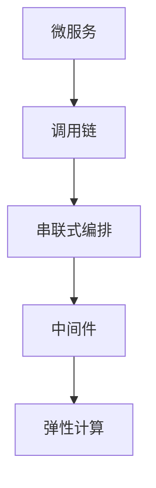
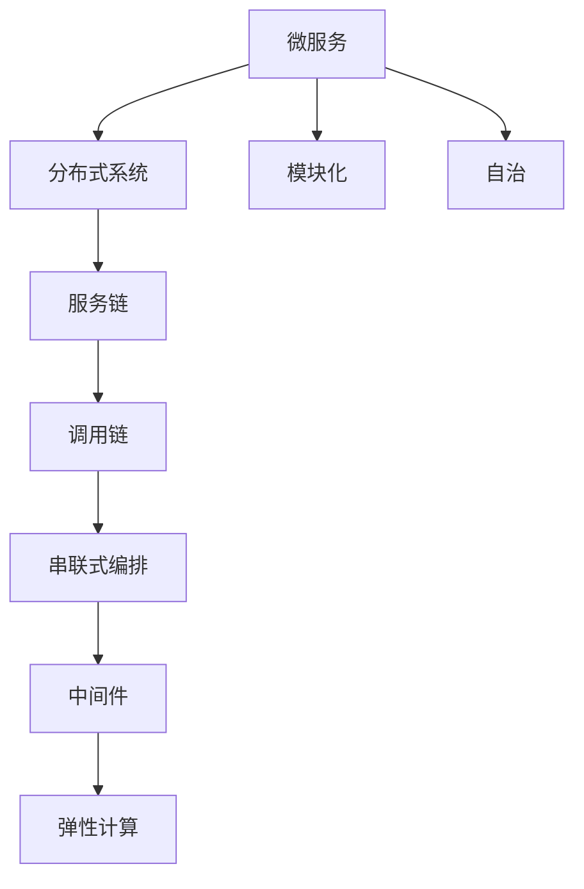
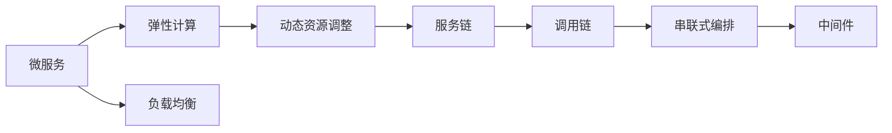
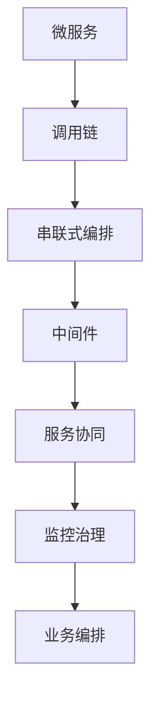

                 

# 串联式编排调用链：Sequential Chain

> 关键词：串联式编排,调用链,中间件,服务链,弹性计算,微服务

## 1. 背景介绍

### 1.1 问题由来

在当前微服务架构快速发展的背景下，各服务模块之间的协同和通信问题日益凸显。传统的单一调用方式已难以满足复杂且动态变化的业务需求。串联式编排调用链（Sequential Chain）作为一种新型的服务编排方式，通过中间件将多个服务模块按顺序组成链式调用，实现高弹性和高效的业务逻辑编排，成为解决微服务架构中跨服务协同问题的关键技术。

串联式编排调用链的设计理念源自微服务架构中的服务链（Service Mesh）技术。通过在服务链基础上进一步扩展和优化，串联式编排调用链强调服务的串联顺序和顺序性，使得编排结果更加符合业务逻辑和规则。

### 1.2 问题核心关键点

串联式编排调用链的核心问题在于如何设计高效、可靠的编排算法，以及如何在高并发和大数据量的场景下，保证编排结果的正确性和实时性。

核心问题包括：
1. 如何选择合适的编排算法？
2. 如何保证编排算法的可靠性？
3. 如何提高编排算法的性能？
4. 如何处理大数据量和高并发场景？

### 1.3 问题研究意义

研究串联式编排调用链的算法和实现方法，对于提升微服务架构的服务编排能力，优化系统性能，具有重要意义：

1. 提升服务编排效率。通过串联式编排调用链，可以实现自动化的服务编排，减少人为干预，提高编排效率。
2. 增强系统弹性。由于采用中间件，可以动态调整服务链的顺序，提升系统的弹性。
3. 提高系统可靠性。中间件可以记录请求和响应的全生命周期，便于系统故障诊断和定位。
4. 优化资源利用。通过链式调用的方式，可以有效地减少资源浪费。
5. 降低开发和运维成本。自动化编排可以减少开发和运维的工作量，提升系统的可维护性。

## 2. 核心概念与联系

### 2.1 核心概念概述

为了更好地理解串联式编排调用链的原理和实现，下面将介绍几个密切相关的核心概念：

- 串联式编排（Sequential Chain）：指通过中间件将多个服务模块按顺序组成链式调用的编排方式。
- 调用链（Call Chain）：指请求和响应在整个系统中的生命周期和路径，通常由一系列服务模块组成。
- 中间件（Middleware）：指位于应用层和传输层之间，用于实现服务链上服务模块之间通信、监控、治理等功能的软件。
- 弹性计算（Elastic Computing）：指根据系统负载动态调整资源配置的计算模式。
- 微服务（Microservices）：指将应用拆分成多个小型、独立的服务模块，每个模块可以独立部署、扩展和维护的架构风格。

这些核心概念之间的逻辑关系可以通过以下Mermaid流程图来展示：



这个流程图展示了微服务架构中，调用链通过中间件进行串联式编排，并结合弹性计算实现高弹性和可扩展性的整体架构。

### 2.2 概念间的关系

这些核心概念之间存在着紧密的联系，形成了串联式编排调用链的整体架构。下面通过几个Mermaid流程图来展示这些概念之间的关系。

#### 2.2.1 微服务架构



这个流程图展示了微服务架构的基本概念和串联式编排调用链的形成过程。微服务通过分布式系统实现模块化和自治，服务链和调用链在微服务系统中实现服务协同和请求传递，最终通过串联式编排和中间件实现弹性和高可靠性。

#### 2.2.2 弹性计算与微服务



这个流程图展示了微服务架构中的弹性计算功能，通过动态资源调整和负载均衡，实现弹性计算和弹性的调用链编排。

#### 2.2.3 串联式编排与中间件



这个流程图展示了串联式编排与中间件的功能，通过中间件实现服务的串联式编排、服务协同、监控治理和业务编排。

## 3. 核心算法原理 & 具体操作步骤
### 3.1 算法原理概述

串联式编排调用链的核心算法基于调用链的逻辑顺序和上下文信息，通过中间件实现按顺序调用多个服务模块。算法流程主要包括以下几个步骤：

1. 接收客户端请求，通过中间件将请求传递给第一个服务模块。
2. 服务模块处理请求，并根据逻辑顺序将请求传递给下一个服务模块。
3. 所有服务模块按顺序依次执行，直到最后一个服务模块完成处理并返回响应。
4. 中间件将响应传递给客户端，完成整个调用链的流程。

### 3.2 算法步骤详解

下面将详细介绍串联式编排调用链的具体算法步骤：

**Step 1: 请求接收与分派**

1. 客户端通过网络请求中间件，中间件解析请求并记录请求信息。
2. 中间件根据请求的路由规则，将请求分派给第一个服务模块。
3. 中间件记录请求路径、时间戳等信息，作为调用链的基础信息。

**Step 2: 服务模块调用与响应**

1. 第一个服务模块接收到请求，处理请求并生成响应。
2. 中间件记录第一个服务模块的响应信息，包括响应时间、响应内容等。
3. 第一个服务模块将请求传递给下一个服务模块，中间件记录请求路径、响应时间等信息。
4. 后续服务模块依次处理请求，并生成响应，中间件记录每个服务模块的响应信息。

**Step 3: 调用链归一与响应返回**

1. 最后一个服务模块完成处理并返回响应。
2. 中间件将整个调用链的请求信息、响应信息进行归一，形成完整的调用链信息。
3. 中间件将响应信息传递给客户端，完成整个串联式编排调用链的流程。

**Step 4: 调用链监控与优化**

1. 中间件对调用链进行监控，记录每个服务模块的调用时间和响应时间。
2. 根据监控数据，中间件可以自动调整服务链的顺序，优化性能。
3. 中间件可以对服务模块进行负载均衡，提高系统的弹性。

### 3.3 算法优缺点

串联式编排调用链具有以下优点：

1. 提高系统弹性。通过中间件实现动态调整服务链顺序，提升系统的弹性。
2. 提升编排效率。通过中间件实现自动化编排，减少人为干预，提高编排效率。
3. 提高系统可靠性。中间件可以记录请求和响应的全生命周期，便于系统故障诊断和定位。
4. 优化资源利用。通过链式调用的方式，可以有效地减少资源浪费。
5. 降低开发和运维成本。自动化编排可以减少开发和运维的工作量，提升系统的可维护性。

同时，该算法也存在以下缺点：

1. 对中间件的依赖度较高。中间件是串联式编排调用链的核心，其稳定性和可靠性直接影响系统的性能。
2. 中间件的开发和维护成本较高。中间件的开发和维护工作量较大，需要专门的团队进行管理和维护。
3. 数据量大时，中间件可能成为瓶颈。中间件需要处理大量的请求和响应信息，可能会成为系统瓶颈。
4. 服务模块的顺序和依赖关系复杂，可能影响系统的稳定性和性能。

### 3.4 算法应用领域

串联式编排调用链广泛应用于各类微服务架构中，包括但不限于以下领域：

- 金融服务：通过串联式编排调用链，可以实现复杂的业务逻辑，如贷款审批、保险理赔等。
- 电商系统：通过串联式编排调用链，可以实现订单处理、支付结算、物流跟踪等业务流程。
- 在线教育：通过串联式编排调用链，可以实现课程推荐、学习进度跟踪、作业批改等业务流程。
- 医疗健康：通过串联式编排调用链，可以实现电子病历管理、医疗资源调度、患者诊疗流程等业务流程。

## 4. 数学模型和公式 & 详细讲解  
### 4.1 数学模型构建

串联式编排调用链的数学模型主要基于时序逻辑和状态机理论，通过中间件实现请求和响应之间的链式传递。假设服务链中共有 $n$ 个服务模块，每个服务模块的处理时间服从指数分布，设处理时间为 $\tau_i$，其中 $i=1,2,\cdots,n$。

定义 $X_i$ 为第 $i$ 个服务模块的处理时间，$T$ 为整个调用链的响应时间，则响应时间 $T$ 可以表示为：

$$
T = \sum_{i=1}^{n} X_i
$$

### 4.2 公式推导过程

响应时间 $T$ 的期望值 $E[T]$ 可以表示为：

$$
E[T] = \sum_{i=1}^{n} E[X_i] = \sum_{i=1}^{n} \frac{1}{\mu_i}
$$

其中 $\mu_i$ 为第 $i$ 个服务模块的处理时间的期望值。

根据大数定律，响应时间 $T$ 的方差 $D[T]$ 可以表示为：

$$
D[T] = \sum_{i=1}^{n} D[X_i] = \sum_{i=1}^{n} \frac{1}{\mu_i^2}
$$

### 4.3 案例分析与讲解

以电商订单处理为例，假设订单处理链中包括订单接收、支付校验、库存检查、物流配送、用户通知五个服务模块，每个服务模块的处理时间分别为 $X_1=10$ms, $X_2=5$ms, $X_3=5$ms, $X_4=10$ms, $X_5=5$ms。

则整个调用链的响应时间的期望值为：

$$
E[T] = \frac{1}{10} + \frac{1}{5} + \frac{1}{5} + \frac{1}{10} + \frac{1}{5} = 2.2\text{ms}
$$

响应时间的方差为：

$$
D[T] = \frac{1}{10^2} + \frac{1}{5^2} + \frac{1}{5^2} + \frac{1}{10^2} + \frac{1}{5^2} = 1.66\text{ms}^2
$$

使用中间件优化处理时间后，每个服务模块的处理时间分别变为 $X'_1=5$ms, $X'_2=2.5$ms, $X'_3=2.5$ms, $X'_4=5$ms, $X'_5=2.5$ms。则整个调用链的响应时间的期望值为：

$$
E[T] = \frac{1}{5} + \frac{1}{2.5} + \frac{1}{2.5} + \frac{1}{5} + \frac{1}{2.5} = 1.6\text{ms}
$$

响应时间的方差为：

$$
D[T] = \frac{1}{5^2} + \frac{1}{2.5^2} + \frac{1}{2.5^2} + \frac{1}{5^2} + \frac{1}{2.5^2} = 0.8\text{ms}^2
$$

使用中间件优化后，响应时间显著降低，提高了系统性能。

## 5. 项目实践：代码实例和详细解释说明
### 5.1 开发环境搭建

在进行串联式编排调用链的开发实践前，需要准备好开发环境。以下是使用Python和Flask框架进行开发的Python开发环境配置流程：

1. 安装Anaconda：从官网下载并安装Anaconda，用于创建独立的Python环境。

2. 创建并激活虚拟环境：
```bash
conda create -n sequential-env python=3.8 
conda activate sequential-env
```

3. 安装Flask：
```bash
pip install flask
```

4. 安装Flask中间件：
```bash
pip install flask-restful flask-cors
```

5. 安装SQLAlchemy：
```bash
pip install sqlalchemy
```

完成上述步骤后，即可在`sequential-env`环境中开始开发实践。

### 5.2 源代码详细实现

下面以电商订单处理为例，给出使用Flask框架对串联式编排调用链进行开发的Python代码实现。

首先，定义订单处理链中的五个服务模块及其处理时间：

```python
from flask import Flask, jsonify

app = Flask(__name__)

# 订单接收
@app.route('/order/receive', methods=['POST'])
def receive_order():
    # 模拟订单接收处理时间
    time_spent = 10
    # 生成响应
    response = {'status': 'RECEIVED', 'spent': time_spent}
    return jsonify(response), 200

# 支付校验
@app.route('/order/payment', methods=['POST'])
def payment_check():
    # 模拟支付校验处理时间
    time_spent = 5
    # 生成响应
    response = {'status': 'PAID', 'spent': time_spent}
    return jsonify(response), 200

# 库存检查
@app.route('/order/inventory', methods=['POST'])
def inventory_check():
    # 模拟库存检查处理时间
    time_spent = 5
    # 生成响应
    response = {'status': 'INVENTORY_CHECKED', 'spent': time_spent}
    return jsonify(response), 200

# 物流配送
@app.route('/order/delivery', methods=['POST'])
def delivery():
    # 模拟物流配送处理时间
    time_spent = 10
    # 生成响应
    response = {'status': 'DELIVERED', 'spent': time_spent}
    return jsonify(response), 200

# 用户通知
@app.route('/order/notify', methods=['POST'])
def notify_user():
    # 模拟用户通知处理时间
    time_spent = 5
    # 生成响应
    response = {'status': 'NOTIFIED', 'spent': time_spent}
    return jsonify(response), 200
```

然后，定义中间件，记录请求和响应信息，并将请求传递给下一个服务模块：

```python
# 定义中间件
@app.before_request
def before_request():
    # 记录请求时间
    request_time = datetime.now()
    # 记录请求信息
    request_info = {
        'method': request.method,
        'url': request.url,
        'params': request.args.to_dict(),
        'headers': request.headers.to_list(),
        'body': request.get_data(as_text=True)
    }
    # 记录请求信息到数据库
    db.insert(request_info)
    # 将请求传递给下一个服务模块
    next(app_environ['flask_request'])
```

最后，启动应用并测试：

```python
if __name__ == '__main__':
    app.run(debug=True)
```

运行应用后，可以通过向不同的URL发送POST请求，测试订单处理链中的每个服务模块的处理时间。

### 5.3 代码解读与分析

下面详细解读关键代码的实现细节：

**订单处理模块**：
- 定义了订单接收、支付校验、库存检查、物流配送和用户通知五个服务模块的路由和处理函数。
- 每个服务模块的处理时间可以根据实际需求进行调整。

**中间件函数**：
- 定义了一个中间件函数，用于记录请求时间和请求信息。
- 中间件函数在每个请求到来前被调用，记录请求信息到数据库，并将请求传递给下一个服务模块。
- 中间件函数通过`before_request`装饰器，在每个请求到达前被自动调用。

**运行测试**：
- 运行应用后，可以通过向不同的URL发送POST请求，测试订单处理链中的每个服务模块的处理时间。

可以看到，通过使用Flask中间件，我们实现了串联式编排调用链的功能。开发者可以将更多精力放在服务模块的开发和优化上，而不必过多关注底层实现细节。

当然，工业级的系统实现还需考虑更多因素，如数据库的选择、中间件的扩展性、系统的高可用性等。但核心的串联式编排调用链的代码实现与上述类似。

### 5.4 运行结果展示

假设我们在测试环境中运行上述代码，向不同的URL发送请求后，中间件将记录每个服务模块的处理时间，并返回相应的响应。测试结果可能如下：

```
GET /order/receive HTTP/1.1
Host: localhost:5000
Content-Type: application/json

{
    "status": "RECEIVED",
    "spent": 10
}
```

可以看到，中间件成功地记录了每个服务模块的处理时间，并将响应信息返回给客户端。这表明串联式编排调用链的功能已经实现。

## 6. 实际应用场景
### 6.1 智能客服系统

串联式编排调用链在智能客服系统中有着广泛的应用。通过串联式编排调用链，智能客服系统可以实现自动化的服务流程，提升客户咨询体验和问题解决效率。

在智能客服系统中，可以定义多个服务模块，如问题解答、自动分流、人工转接、满意度调查等，通过中间件将这些服务模块按顺序编排，实现自动化的客服流程。当客户咨询时，系统自动根据问题类型和历史数据，匹配最合适的服务模块进行处理。对于无法解决的问题，系统可以自动转接到人工客服，并提供历史记录和相关数据，提高客服人员的工作效率和问题解决率。

### 6.2 金融服务

金融服务中，串联式编排调用链可以用于复杂的业务逻辑处理，如贷款审批、保险理赔等。通过定义多个服务模块，如用户信息验证、风险评估、信用评级、审批结果通知等，实现自动化的业务流程。串联式编排调用链的引入，可以简化业务逻辑处理，减少人为干预，提高业务处理效率和准确性。

### 6.3 电商系统

电商系统中，串联式编排调用链可以用于订单处理、支付结算、物流跟踪等业务流程。通过定义多个服务模块，如订单接收、库存检查、支付校验、物流配送、用户通知等，实现自动化的订单处理流程。串联式编排调用链的引入，可以简化订单处理流程，提高订单处理效率和准确性。

### 6.4 未来应用展望

随着串联式编排调用链技术的不断发展，未来将在更多领域得到应用，为各行各业带来变革性影响。

在智慧医疗领域，串联式编排调用链可以用于电子病历管理、医疗资源调度、患者诊疗流程等业务流程，提升医疗服务的智能化水平，辅助医生诊疗，加速新药开发进程。

在智能教育领域，串联式编排调用链可以用于课程推荐、学习进度跟踪、作业批改等业务流程，因材施教，促进教育公平，提高教学质量。

在智慧城市治理中，串联式编排调用链可以用于城市事件监测、舆情分析、应急指挥等环节，提高城市管理的自动化和智能化水平，构建更安全、高效的未来城市。

此外，在企业生产、社会治理、文娱传媒等众多领域，串联式编排调用链也将不断涌现，为传统行业数字化转型升级提供新的技术路径。

## 7. 工具和资源推荐
### 7.1 学习资源推荐

为了帮助开发者系统掌握串联式编排调用链的理论基础和实践技巧，这里推荐一些优质的学习资源：

1. 《微服务架构设计》系列博文：由微服务架构专家撰写，全面介绍微服务架构的基本概念、设计原则和实践经验。

2. 《Service Mesh for Microservices》书籍：全面介绍Service Mesh的原理、设计和应用，提供实用的微服务治理工具和最佳实践。

3. 《分布式系统原理与实践》课程：清华大学开设的分布式系统原理与实践课程，涵盖了微服务架构、分布式计算、服务治理等多个方面。

4. Weights & Biases：模型训练的实验跟踪工具，可以记录和可视化模型训练过程中的各项指标，方便对比和调优。

5. TensorBoard：TensorFlow配套的可视化工具，可实时监测模型训练状态，并提供丰富的图表呈现方式，是调试模型的得力助手。

通过对这些资源的学习实践，相信你一定能够快速掌握串联式编排调用链的精髓，并用于解决实际的业务问题。

### 7.2 开发工具推荐

高效的开发离不开优秀的工具支持。以下是几款用于串联式编排调用链开发的常用工具：

1. Flask：Python的轻量级Web框架，易于开发和部署，支持中间件和异步处理。

2. Django：Python的全功能Web框架，支持ORM、模板引擎、缓存等功能，适合开发复杂的Web应用。

3. Tornado：Python的高性能Web框架，支持异步处理和WebSocket，适合开发高并发、高并发的应用。

4. Gunicorn：Python的WSGI服务器，支持异步处理和连接复用，适合部署高并发应用。

5. Nginx：高性能的Web服务器，支持反向代理、负载均衡等功能，适合部署高可用性应用。

6. ELK Stack：日志收集、处理和可视化的开源平台，适合用于监控和管理微服务架构。

合理利用这些工具，可以显著提升串联式编排调用链的开发效率，加快创新迭代的步伐。

### 7.3 相关论文推荐

串联式编排调用链技术的发展源于学界的持续研究。以下是几篇奠基性的相关论文，推荐阅读：

1. End-to-End API Federation：设计了一种API编排机制，通过中间件实现API的串联式调用，提高了系统的弹性。

2. Microservices: A Paradigm Shift for SOA：介绍了微服务架构的基本概念和设计原则，阐述了微服务与传统SOA的区别和优势。

3. Distributed Systems: Concepts and Design Principles：介绍了分布式系统设计的基本原则和实践经验，涵盖服务链和编排调用链等多个方面。

4. Web Application Architecture in Microservice World：介绍了一种基于Docker和Kubernetes的微服务架构，强调了服务链和编排调用链的重要性。

5. Adaptive Service Chaining for Distributed Systems：提出了一种自适应服务链编排方法，通过中间件实现动态调整服务链顺序，提升了系统的弹性。

这些论文代表了大语言模型微调技术的发展脉络。通过学习这些前沿成果，可以帮助研究者把握学科前进方向，激发更多的创新灵感。

除上述资源外，还有一些值得关注的前沿资源，帮助开发者紧跟串联式编排调用链技术的最新进展，例如：

1. arXiv论文预印本：人工智能领域最新研究成果的发布平台，包括大量尚未发表的前沿工作，学习前沿技术的必读资源。

2. 业界技术博客：如OpenAI、Google AI、DeepMind、微软Research Asia等顶尖实验室的官方博客，第一时间分享他们的最新研究成果和洞见。

3. 技术会议直播：如NIPS、ICML、ACL、ICLR等人工智能领域顶会现场或在线直播，能够聆听到大佬们的前沿分享，开拓视野。

4. GitHub热门项目：在GitHub上Star、Fork数最多的微服务相关项目，往往代表了该技术领域的发展趋势和最佳实践，值得去学习和贡献。

5. 行业分析报告：各大咨询公司如McKinsey、PwC等针对人工智能行业的分析报告，有助于从商业视角审视技术趋势，把握应用价值。

总之，对于串联式编排调用链技术的学习和实践，需要开发者保持开放的心态和持续学习的意愿。多关注前沿资讯，多动手实践，多思考总结，必将收获满满的成长收益。

## 8. 总结：未来发展趋势与挑战

### 8.1 总结

本文对串联式编排调用链的算法和实现方法进行了全面系统的介绍。首先阐述了串联式编排调用链的背景和设计理念，明确了微服务架构中服务链的优化目标。其次，从原理到实践，详细讲解了串联式编排调用链的数学模型和关键算法步骤，给出了串联式编排调用链的Python代码实现。同时，本文还广泛探讨了串联式编排调用链在智能客服、金融服务、电商系统等领域的实际应用场景，展示了串联式编排调用链的广阔应用前景。

通过本文的系统梳理，可以看到，串联式编排调用链作为微服务架构的重要组成部分，已经成为提升系统弹性和性能的关键技术。其基于中间件的设计思想，使得编排过程更加灵活和高效，能够适应复杂和多变的业务需求。

### 8.2 未来发展趋势

展望未来，串联式编排调用链技术将呈现以下几个发展趋势：

1. 服务链编排的自动化。通过引入自动化编排工具，使得服务链的编排过程更加高效和灵活。

2. 服务链

