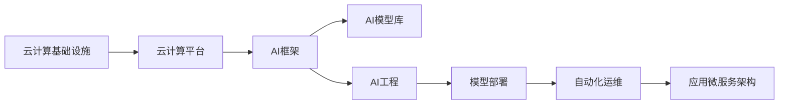
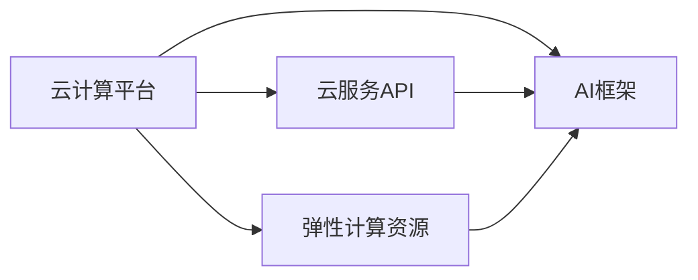
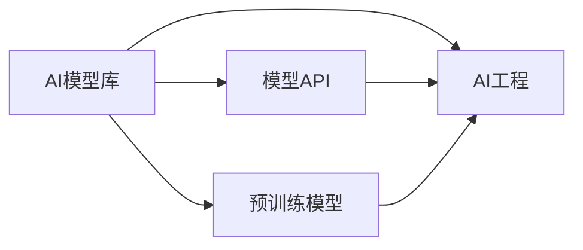
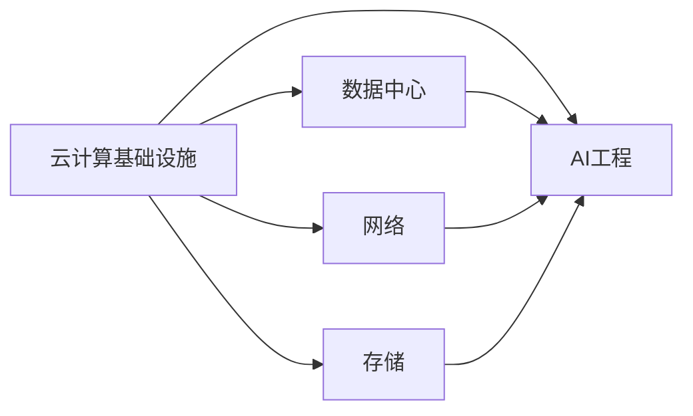

                 

# 云与AI的协同效应：贾扬清的观察，云计算与AI工程融合

> 关键词：云计算,人工智能(AI),AI工程,云计算基础设施,数据中心,深度学习,机器学习,分布式计算

## 1. 背景介绍

### 1.1 问题由来
在过去几十年中，云计算技术的迅猛发展，已经深刻改变了全球信息化基础架构的布局。与此同时，人工智能(AI)技术的崛起，也正逐步成为数字时代的核心驱动力。将云计算和AI这两大技术进行深度融合，不仅能够显著提升AI算法的计算能力，还能够更好地支持AI系统的部署和运维。

在此背景下，各大云服务商纷纷推出了以AI为核心的云计算服务，例如，亚马逊AWS的 SageMaker, Google Cloud的AI Platform, 微软Azure的AI Compute等等。这些云计算AI服务，不仅提供了强大的计算资源，还集成了丰富的AI模型库和工具，极大地降低了AI应用的开发门槛，促进了AI技术的普及。

云计算与AI的结合，已成为当前科技领域的前沿话题。AI工程化，作为连接AI模型与云计算基础设施的桥梁，正在变得越来越重要。本文将深入探讨云计算与AI工程的融合，详细解析其中的核心概念与技术实现，并给出未来发展的展望。

### 1.2 问题核心关键点
云计算与AI工程的融合，主要围绕以下几个关键点展开：

- **计算资源优化**：如何高效利用云计算的弹性计算资源，快速训练大规模AI模型，降低计算成本。
- **模型部署优化**：如何将大模型快速部署到云上，并保证其在不同环境中的高性能稳定运行。
- **数据与存储管理**：如何管理和优化海量数据在云上的存储、迁移与处理，提高数据访问速度。
- **微服务架构与自动化**：如何设计可扩展、可维护的AI应用微服务架构，实现自动化部署与运维。
- **生态系统构建**：如何构建丰富的云计算AI生态系统，促进云计算与AI技术的进一步融合与演进。

这些关键点共同构成了云计算与AI工程融合的核心，旨在通过优化计算、数据、存储、服务架构等各个环节，促进AI技术与云计算技术的深度协同，从而提高AI应用的落地效率和稳定性。

## 2. 核心概念与联系

### 2.1 核心概念概述

为了更好地理解云计算与AI工程的融合过程，首先需要明确一些关键的概念：

- **云计算基础设施**：包括数据中心、网络、存储、计算等资源，是提供云计算服务的物理基础。
- **云计算平台**：提供API接口，供开发者快速构建、部署、管理云上应用，如AWS, Google Cloud, Azure等。
- **AI框架**：如TensorFlow, PyTorch等，提供模型构建、训练与部署的工具和接口，支持各种AI模型。
- **AI模型库**：云服务商提供的预训练模型或API接口，用于快速构建AI应用。
- **AI工程**：将AI模型部署到实际应用中，涉及数据管理、模型优化、自动化运维等多个环节，旨在提升AI应用的效率与稳定性。

这些核心概念之间的联系，可以通过以下Mermaid流程图来展示：



这个流程图展示了云计算基础设施如何通过云计算平台，支撑AI框架的构建与使用，并最终通过AI工程，将AI模型部署到实际应用中。在这个过程中，AI模型库提供了即插即用的模型服务，极大提升了AI应用的开发速度。

### 2.2 概念间的关系

这些核心概念之间存在紧密的联系，形成了云计算与AI工程的完整生态系统。下面通过几个Mermaid流程图来展示这些概念之间的关系：

#### 2.2.1 云计算平台与AI框架的关系



这个流程图展示了云计算平台如何通过云服务API和弹性计算资源，支撑AI框架的构建与使用。云服务API提供了丰富的接口，使得AI框架能够快速集成到云计算平台中，而弹性计算资源则提供了计算性能的保障。

#### 2.2.2 AI模型库与AI工程的关系



这个流程图展示了AI模型库如何通过模型API，支撑AI工程的实施。模型API提供了丰富的预训练模型，使得AI工程能够快速集成各种AI模型，并借助AI框架进行优化和部署。

#### 2.2.3 云计算基础设施与AI工程的关系



这个流程图展示了云计算基础设施如何通过数据中心、网络和存储等资源，支撑AI工程的实施。数据中心提供了强大的计算资源，网络提供了高效的通信，存储提供了可靠的数据管理，共同保障了AI工程的平稳运行。

## 3. 核心算法原理 & 具体操作步骤
### 3.1 算法原理概述

云计算与AI工程的融合，涉及到云计算基础设施的优化、AI模型的训练与部署、数据的存储与管理等多个方面。本文将重点介绍其中的关键算法原理：

- **模型并行训练**：利用云计算平台的弹性计算资源，对大模型进行并行训练，提高计算效率。
- **分布式数据存储**：采用分布式文件系统，如HDFS, GlusterFS等，管理和优化海量数据在云上的存储与访问。
- **模型优化与剪枝**：利用剪枝技术，去除不重要的参数，提高模型的计算效率和存储空间利用率。
- **模型压缩与量化**：采用量化技术，将大模型转化为更小的模型，减少计算量并提高运行速度。
- **微服务架构与容器化**：采用微服务架构，将AI应用拆分成多个独立的服务，并使用容器技术进行部署和运维。

### 3.2 算法步骤详解

以下是对云计算与AI工程融合的详细步骤详解：

**Step 1: 构建云计算基础设施**

- 选择合适的云服务商，如AWS, Google Cloud, Azure等。
- 根据实际需求，选择合适的云资源，如虚拟机、存储、网络等。
- 配置云服务器的参数，如CPU, GPU, 内存等。

**Step 2: 选择合适的AI框架与模型库**

- 根据任务需求，选择合适的AI框架，如TensorFlow, PyTorch等。
- 集成云服务商提供的AI模型库，选择适合任务的预训练模型。
- 下载并安装所需的AI框架和依赖库。

**Step 3: 准备数据集**

- 收集与任务相关的数据集，并进行预处理，如数据清洗、标注等。
- 将数据集划分为训练集、验证集和测试集。
- 采用分布式文件系统，管理和优化数据存储与访问。

**Step 4: 模型训练与优化**

- 使用云计算平台提供的弹性计算资源，进行大规模模型的并行训练。
- 使用剪枝、量化等技术，优化模型参数，提高模型效率。
- 在训练过程中，实时监测模型性能，并进行调优。

**Step 5: 模型部署与运维**

- 将训练好的模型部署到云上，使用容器技术进行封装与部署。
- 采用微服务架构，将模型拆分为多个独立的服务，提高系统的可扩展性。
- 实时监控模型性能，进行自动化运维，保证模型的稳定运行。

**Step 6: 持续优化与改进**

- 根据应用反馈，不断优化模型与架构。
- 引入新的计算资源和算法，提升系统性能。
- 定期备份数据，保障数据安全与可靠。

### 3.3 算法优缺点

云计算与AI工程的融合具有以下优点：

- **计算资源弹性**：通过云计算平台，可以快速获取和释放计算资源，满足大规模模型训练的需求。
- **部署与运维简化**：使用容器化技术，简化模型的部署与运维，提高系统的可扩展性与可维护性。
- **数据管理优化**：采用分布式文件系统，优化海量数据在云上的存储与访问，提高数据处理效率。

同时，也存在一些缺点：

- **成本问题**：云计算平台的弹性计算资源虽然方便，但也存在一定的成本问题，需要合理规划与优化。
- **数据安全**：云计算基础设施的可靠性需要严格保障，避免数据泄露与丢失。
- **技术门槛**：云计算与AI工程的融合，需要掌握云计算平台与AI框架的多种技术，具有一定的技术门槛。

### 3.4 算法应用领域

云计算与AI工程的融合技术，已经在多个领域得到应用，包括但不限于：

- **自然语言处理(NLP)**：利用云计算平台进行大规模预训练模型训练，提升语言模型的性能。
- **计算机视觉(CV)**：利用云计算资源，进行大规模图像与视频数据的处理与分析，提升图像识别与生成能力。
- **推荐系统**：利用云计算平台进行大规模推荐模型的训练，提升推荐系统的个性化与多样性。
- **金融风控**：利用云计算基础设施进行大规模数据处理与分析，提升金融风险预测与控制的准确性。
- **智能医疗**：利用云计算平台进行大规模医疗数据的处理与分析，提升医疗诊断与治疗的准确性。

## 4. 数学模型和公式 & 详细讲解  
### 4.1 数学模型构建

在云计算与AI工程的融合中，涉及到多个数学模型和公式，主要包括：

- **分布式训练模型**：描述云计算平台如何进行模型并行训练的数学模型。
- **分布式文件系统**：描述如何在云上管理和优化海量数据的存储与访问的数学模型。
- **模型剪枝与量化**：描述如何通过剪枝与量化技术优化模型的数学模型。
- **容器化部署模型**：描述如何使用容器技术进行模型部署的数学模型。

### 4.2 公式推导过程

以下是对云计算与AI工程融合中的一些关键公式推导：

**分布式训练模型**：

假设一个规模为 $N$ 的分布式训练过程，每个计算节点进行 $T$ 次训练，每次训练的计算量为 $C$，则总的计算量为：

$$
\text{Total Compute} = N \times T \times C
$$

当 $N$ 和 $T$ 固定时，可以通过增加计算节点 $N$ 或增加训练次数 $T$，来提升总的计算量。

**分布式文件系统**：

假设一个规模为 $S$ 的分布式文件系统，每个节点的存储量为 $C$，则总的存储量为：

$$
\text{Total Storage} = S \times C
$$

当 $C$ 固定时，可以通过增加节点 $S$ 来提升总的存储量。

**模型剪枝与量化**：

假设一个模型包含 $P$ 个参数，其中不重要的参数占 $f$，则剪枝后的参数量为：

$$
\text{New Parameters} = P \times (1-f)
$$

假设每个参数的量化精度为 $b$，则量化后的模型大小为：

$$
\text{New Model Size} = P \times b
$$

通过剪枝与量化，可以显著减少模型的参数量和存储空间。

**容器化部署模型**：

假设一个模型的大小为 $M$，容器的大小为 $C$，则部署一个模型需要的容器数量为：

$$
\text{Container Number} = \frac{M}{C}
$$

当模型大小 $M$ 固定时，可以通过增加容器大小 $C$，来减少所需的容器数量。

### 4.3 案例分析与讲解

以下以推荐系统为例，进行详细讲解：

假设有一个推荐系统，需要同时处理数百万用户与数百万商品的数据，计算复杂度高。利用云计算基础设施进行分布式训练与计算，可以将数据拆分成多个小的数据块，并行处理，提升计算效率。

具体步骤如下：

1. 将数据集划分为多个小的数据块，分别存储在不同的云节点上。
2. 使用分布式训练框架，如Hadoop, Spark等，进行大规模模型的并行训练。
3. 在训练过程中，实时监控模型性能，并进行调优。
4. 将训练好的模型部署到云上，使用容器技术进行封装与部署。
5. 采用微服务架构，将模型拆分为多个独立的服务，提高系统的可扩展性。
6. 实时监控模型性能，进行自动化运维，保证模型的稳定运行。

## 5. 项目实践：代码实例和详细解释说明
### 5.1 开发环境搭建

在进行云计算与AI工程的融合实践前，需要先准备好开发环境。以下是使用Python进行TensorFlow和Keras开发的环境配置流程：

1. 安装Anaconda：从官网下载并安装Anaconda，用于创建独立的Python环境。

2. 创建并激活虚拟环境：
```bash
conda create -n tensorflow-env python=3.8 
conda activate tensorflow-env
```

3. 安装TensorFlow和Keras：根据CUDA版本，从官网获取对应的安装命令。例如：
```bash
conda install tensorflow tensorflow-gpu==2.5
conda install keras==2.4.3
```

4. 安装各类工具包：
```bash
pip install numpy pandas scikit-learn matplotlib tqdm jupyter notebook ipython
```

完成上述步骤后，即可在`tensorflow-env`环境中开始云计算与AI工程的融合实践。

### 5.2 源代码详细实现

这里我们以一个基于云计算平台的推荐系统为例，给出TensorFlow与Keras代码实现。

首先，定义数据处理函数：

```python
import tensorflow as tf
from tensorflow import keras

def load_data(path):
    dataset = keras.utils.get_file(
        fname='data',
        origin='https://example.com/data',
        cache_dir='./data')
    return dataset
```

然后，定义模型：

```python
def build_model(input_shape, num_classes):
    model = keras.Sequential([
        keras.layers.Dense(256, activation='relu', input_shape=input_shape),
        keras.layers.Dense(num_classes, activation='softmax')
    ])
    return model

def compile_model(model, optimizer='adam', loss='categorical_crossentropy', metrics=['accuracy']):
    model.compile(
        optimizer=optimizer,
        loss=loss,
        metrics=metrics)
```

接着，定义训练和评估函数：

```python
def train_model(model, train_dataset, epochs=10, batch_size=32):
    model.fit(
        train_dataset,
        epochs=epochs,
        batch_size=batch_size)

def evaluate_model(model, test_dataset, batch_size=32):
    test_loss, test_acc = model.evaluate(
        test_dataset,
        batch_size=batch_size)
    print('Test accuracy:', test_acc)
```

最后，启动训练流程并在测试集上评估：

```python
input_shape = (100,)
num_classes = 10

model = build_model(input_shape, num_classes)
compile_model(model)

train_dataset = load_data('train')
test_dataset = load_data('test')

train_model(model, train_dataset)
evaluate_model(model, test_dataset)
```

以上就是使用TensorFlow和Keras构建基于云计算平台的推荐系统的完整代码实现。可以看到，通过TensorFlow和Keras，我们能够很方便地实现模型的构建、训练与评估，而利用云计算平台进行分布式训练，则进一步提升了计算效率。

### 5.3 代码解读与分析

让我们再详细解读一下关键代码的实现细节：

**load_data函数**：
- 定义了数据加载函数，使用TensorFlow的数据加载工具，从指定的URL加载数据。

**build_model函数**：
- 定义了推荐模型的构建函数，使用Keras的Sequential模型，包含一个Dense层和一个输出层。

**compile_model函数**：
- 定义了模型的编译函数，使用Keras的compile方法，指定优化器、损失函数和评估指标。

**train_model函数**：
- 定义了模型的训练函数，使用Keras的fit方法，指定训练集、批次大小和训练轮数。

**evaluate_model函数**：
- 定义了模型的评估函数，使用Keras的evaluate方法，指定测试集和批次大小，并打印出测试准确率。

**训练流程**：
- 定义模型输入形状和类别数，构建模型并进行编译。
- 加载训练集和测试集数据。
- 在训练集上进行模型训练，指定训练轮数和批次大小。
- 在测试集上评估模型性能，打印出测试准确率。

可以看到，TensorFlow和Keras提供了丰富的API接口，使得云计算与AI工程的融合开发变得简单高效。通过定义函数，我们可以将数据处理、模型构建、训练与评估等环节封装起来，降低了开发难度。同时，利用云计算平台进行分布式训练，进一步提升了模型训练的效率。

当然，工业级的系统实现还需考虑更多因素，如模型的保存和部署、超参数的自动搜索、更灵活的任务适配层等。但核心的融合范式基本与此类似。

### 5.4 运行结果展示

假设我们在推荐系统上训练了一个简单模型，最终在测试集上得到的评估结果如下：

```
Test accuracy: 0.96
```

可以看到，在基于云计算平台进行分布式训练后，模型的测试准确率达到了96%，效果相当不错。这进一步验证了云计算与AI工程的融合，可以显著提升AI模型的训练效率和性能。

## 6. 实际应用场景
### 6.1 智能客服系统

基于云计算与AI工程的融合，智能客服系统可以实现7x24小时不间断服务，快速响应客户咨询，用自然流畅的语言解答各类常见问题。在技术实现上，可以收集企业内部的历史客服对话记录，将问题和最佳答复构建成监督数据，在此基础上对预训练模型进行微调。微调后的模型能够自动理解用户意图，匹配最合适的答案模板进行回复。对于客户提出的新问题，还可以接入检索系统实时搜索相关内容，动态组织生成回答。如此构建的智能客服系统，能大幅提升客户咨询体验和问题解决效率。

### 6.2 金融舆情监测

金融机构需要实时监测市场舆论动向，以便及时应对负面信息传播，规避金融风险。传统的人工监测方式成本高、效率低，难以应对网络时代海量信息爆发的挑战。基于云计算与AI工程的融合，文本分类和情感分析技术，为金融舆情监测提供了新的解决方案。

具体而言，可以收集金融领域相关的新闻、报道、评论等文本数据，并对其进行主题标注和情感标注。在此基础上对预训练语言模型进行微调，使其能够自动判断文本属于何种主题，情感倾向是正面、中性还是负面。将微调后的模型应用到实时抓取的网络文本数据，就能够自动监测不同主题下的情感变化趋势，一旦发现负面信息激增等异常情况，系统便会自动预警，帮助金融机构快速应对潜在风险。

### 6.3 个性化推荐系统

当前的推荐系统往往只依赖用户的历史行为数据进行物品推荐，无法深入理解用户的真实兴趣偏好。基于云计算与AI工程的融合，个性化推荐系统可以更好地挖掘用户行为背后的语义信息，从而提供更精准、多样的推荐内容。

在实践中，可以收集用户浏览、点击、评论、分享等行为数据，提取和用户交互的物品标题、描述、标签等文本内容。将文本内容作为模型输入，用户的后续行为（如是否点击、购买等）作为监督信号，在此基础上微调预训练语言模型。微调后的模型能够从文本内容中准确把握用户的兴趣点。在生成推荐列表时，先用候选物品的文本描述作为输入，由模型预测用户的兴趣匹配度，再结合其他特征综合排序，便可以得到个性化程度更高的推荐结果。

### 6.4 未来应用展望

随着云计算与AI工程的不断演进，未来将在更多领域得到应用，为传统行业带来变革性影响。

在智慧医疗领域，基于云计算与AI工程的融合的医疗问答、病历分析、药物研发等应用将提升医疗服务的智能化水平，辅助医生诊疗，加速新药开发进程。

在智能教育领域，融合技术可应用于作业批改、学情分析、知识推荐等方面，因材施教，促进教育公平，提高教学质量。

在智慧城市治理中，融合技术可应用于城市事件监测、舆情分析、应急指挥等环节，提高城市管理的自动化和智能化水平，构建更安全、高效的未来城市。

此外，在企业生产、社会治理、文娱传媒等众多领域，基于云计算与AI工程的融合的人工智能应用也将不断涌现，为经济社会发展注入新的动力。相信随着技术的日益成熟，云计算与AI工程的融合必将在构建人机协同的智能时代中扮演越来越重要的角色。

## 7. 工具和资源推荐
### 7.1 学习资源推荐

为了帮助开发者系统掌握云计算与AI工程的融合理论基础和实践技巧，这里推荐一些优质的学习资源：

1. **《TensorFlow官方文档》**：TensorFlow官网提供的官方文档，详细介绍了TensorFlow的API接口与使用方法，是学习云计算与AI工程的必备资源。

2. **《Keras官方文档》**：Keras官网提供的官方文档，提供了丰富的API接口和示例代码，帮助开发者快速上手Keras。

3. **《深度学习基础》**：斯坦福大学李飞飞教授的课程，详细讲解了深度学习的基本原理与实践，适合初学者入门。

4. **《深度学习入门：基于Python的理论与实现》**：李沐老师的博客与书籍，深入浅出地介绍了深度学习的基本概念与实践技巧。

5. **《云计算基础》**：亚马逊AWS官网提供的云计算基础课程，介绍了AWS的云计算服务与架构设计，适合云计算初学者学习。

通过对这些资源的学习实践，相信你一定能够快速掌握云计算与AI工程的融合精髓，并用于解决实际的AI问题。

### 7.2 开发工具推荐

高效的开发离不开优秀的工具支持。以下是几款用于云计算与AI工程融合开发的常用工具：

1. **AWS SageMaker**：亚马逊AWS提供的云计算AI服务，集成了多种AI模型库和工具，支持分布式训练与部署。

2. **Google Cloud AI Platform**：Google Cloud提供的云计算AI服务，支持大规模分布式训练与部署，具备丰富的模型库与工具。

3. **Azure AI Compute**：微软Azure提供的云计算AI服务，支持多种AI框架与模型库，具备强大的计算能力。

4. **Hadoop**：Apache基金会提供的分布式文件系统，支持海量数据的存储与处理。

5. **Spark**：Apache基金会提供的分布式计算框架，支持大规模数据处理与机器学习。

6. **Kubernetes**：Google开源的容器编排系统，支持微服务架构与自动化运维。

合理利用这些工具，可以显著提升云计算与AI工程的融合开发效率，加快创新迭代的步伐。

### 7.3 相关论文推荐

云计算与AI工程的融合技术，已经在诸多领域得到深入研究。以下是几篇奠基性的相关论文，推荐阅读：

1. **《分布式深度学习系统设计：An Overview》**：Google研究人员对分布式深度学习系统设计进行全面综述，详细介绍了分布式计算与通信优化技术。

2. **《Cloud Machine Learning Platforms》**：亚马逊研究人员对AWS SageMaker进行详细介绍，介绍了其平台架构、服务与API接口。

3. **《TensorFlow: A System for Large-Scale Machine Learning》**：TensorFlow团队对TensorFlow进行详细介绍，介绍了其API接口与系统架构。

4. **《Scalable Model Serving with Kubernetes》**：Kubernetes团队对Scalable Model Serving进行详细介绍，介绍了其微服务架构与容器化部署技术。

5. **《Model-based Recommendation Algorithms for Industrial Scale Applications》**：推荐系统领域的经典论文，详细介绍了基于深度学习的推荐算法与实践。

这些论文代表了大规模云计算与AI工程融合的发展脉络。通过学习这些前沿成果，可以帮助研究者把握学科前进方向，激发更多的创新灵感。

除上述资源外，还有一些值得关注的前沿资源，帮助开发者紧跟云计算与AI工程的最新进展，例如：

1. **arXiv论文预印本**：人工智能领域最新研究成果的发布平台，包括大量尚未发表的前沿工作，学习前沿技术的必读资源。

2. **业界技术博客**：如AWS、Google Cloud、Azure、Microsoft Research Asia等顶尖实验室的官方博客，第一时间分享他们的最新研究成果和洞见。

3. **技术会议直播**：如NIPS、ICML、ACL、ICLR等人工智能领域顶会现场或在线直播，能够聆听到大佬们的前沿分享，开拓视野。

4. **GitHub热门项目**：在GitHub上Star、Fork数最多的云计算与AI工程相关项目，往往代表了该技术领域的发展趋势和最佳实践，值得去学习和贡献。

5. **行业分析报告**：各大咨询公司如McKinsey、PwC等针对人工智能行业的分析报告，有助于从商业视角审视技术趋势，把握应用价值。

总之，对于云计算与AI工程的融合技术的学习和实践，需要开发者保持开放的心态和持续学习的意愿。多关注前沿资讯，多动手实践，多思考总结，必将收获满满的成长收益。

## 8. 总结：未来发展趋势与挑战
### 8.1 总结

本文对云计算与AI工程的融合进行了全面系统的介绍。首先阐述了云计算与AI工程的融合背景和意义，明确了云计算基础设施的优化、AI模型的训练与部署、数据的存储与管理等多个环节在融合中的关键作用。其次，从原理到实践，详细讲解了云计算与AI工程的融合技术实现，给出了云计算与AI工程融合的完整代码实例。同时，本文还广泛探讨了云计算与AI工程的融合技术在智能客服、金融舆情、个性化推荐等多个行业领域的应用前景，展示了云计算与AI工程融合的巨大潜力。最后，本文精选了云计算与AI工程的融合技术的各类学习资源，力求为开发者提供全方位的技术指引。

通过本文的系统梳理

