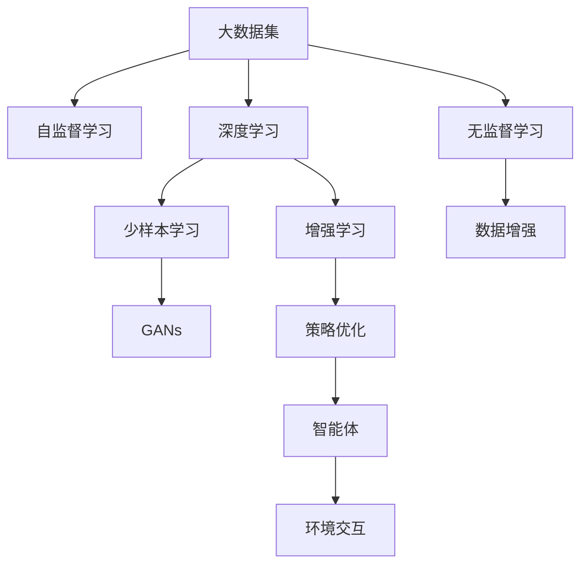

                 

# 人工智能前沿研究热点与发展趋势原理与代码实战案例讲解

> 关键词：人工智能,前沿研究,发展趋势,原理分析,代码实战,案例讲解

## 1. 背景介绍

### 1.1 问题由来

随着科技的快速发展，人工智能(AI)已经成为推动社会进步的重要力量。特别是在计算机视觉、自然语言处理(NLP)、机器学习等诸多领域，取得了显著进展。然而，AI研究领域一直面临诸多挑战和未解之谜。例如，深度学习模型的泛化能力如何？如何构建更加智能、高效的AI系统？未来AI技术将走向何方？本文将深入探讨这些问题，并结合具体案例，帮助读者全面理解人工智能前沿研究热点与发展趋势。

### 1.2 问题核心关键点

当前人工智能研究的热点主要包括：深度学习模型的可解释性、生成对抗网络(GANs)的稳定性、增强学习算法的优化效率、自监督学习在少样本学习中的应用等。这些热点问题不仅推动了AI技术的发展，也为实际应用带来了许多新的机遇和挑战。

### 1.3 问题研究意义

研究人工智能前沿研究热点与发展趋势，对于加速AI技术的产业化进程，推动各行业数字化转型，提升社会整体智能化水平具有重要意义：

1. 促进技术创新：深入理解AI前沿技术，有助于开发出更高效、更智能的新算法和模型，提升AI系统的性能。
2. 降低研发成本：基于前沿技术的理解，可以在研发过程中避免走弯路，减少人力和物力投入。
3. 加速应用落地：掌握最新AI技术，能够更快地将AI技术应用到实际业务中，带来实际效益。
4. 推动行业升级：AI技术的广泛应用，将带来各行业的深度变革，促进产业结构的优化升级。
5. 拓展应用场景：深入探索AI前沿技术，将发现更多新的应用场景，提升AI技术的社会价值。

## 2. 核心概念与联系

### 2.1 核心概念概述

为更好地理解人工智能前沿研究热点与发展趋势，本节将介绍几个关键概念：

- **深度学习(Deep Learning)**：一种基于神经网络结构的机器学习算法，能够自动学习输入数据的复杂特征表示，广泛应用于计算机视觉、NLP等领域。

- **生成对抗网络(GANs)**：一种生成模型，由生成器(generator)和判别器(discriminator)组成，能够生成高质量的假数据，在图像生成、风格转换等领域有重要应用。

- **增强学习(Reinforcement Learning, RL)**：一种基于试错的学习方法，通过智能体与环境的交互，学习最优策略以实现特定目标。

- **自监督学习(Self-Supervised Learning)**：一种无需标注数据的学习方式，通过利用数据本身的结构信息，自动生成监督信号进行学习。

- **少样本学习(Few-shot Learning)**：一种在少量标注数据下进行学习的技术，能够有效利用少量数据提升模型性能。

- **无监督学习(Unsupervised Learning)**：一种无需标注数据的学习方式，旨在发现数据中的潜在结构。

这些概念共同构成了人工智能前沿研究的核心框架，帮助研究者从不同角度探索和实现AI技术。

### 2.2 概念间的关系

这些核心概念之间的联系可以概括为：

- **深度学习**与**自监督学习**：深度学习通常需要大量标注数据，自监督学习能够在不标注数据的情况下进行学习。
- **深度学习**与**增强学习**：深度学习模型可以作为增强学习中智能体的决策策略，提升策略的性能。
- **GANs**与**无监督学习**：GANs利用无监督学习原理生成高质量的假数据，提升生成模型的效果。
- **GANs**与**少样本学习**：GANs能够生成额外的假数据，辅助少样本学习中的数据增强。
- **增强学习**与**少样本学习**：增强学习能够利用少量数据进行高效学习，提升策略的泛化能力。

通过理解这些概念之间的联系，我们可以更好地把握人工智能前沿研究的发展脉络。

### 2.3 核心概念的整体架构

下面用一个综合的流程图来展示这些核心概念在大数据处理中的整体架构：



这个流程图展示了大数据处理中各核心概念的相互关系：

- 自监督学习利用大数据集自动生成监督信号，为深度学习模型提供训练数据。
- 深度学习模型学习数据的复杂特征表示。
- 少样本学习利用少量标注数据提升模型性能。
- GANs生成高质量的假数据，辅助数据增强。
- 增强学习通过智能体与环境的交互，学习最优策略。
- 无监督学习发现数据中的潜在结构。

这些概念共同构成了人工智能前沿研究的核心框架，推动了AI技术的不断进步。

## 3. 核心算法原理 & 具体操作步骤
### 3.1 算法原理概述

人工智能前沿研究热点与发展趋势涉及多种算法与技术，主要包括深度学习模型、生成对抗网络、增强学习等。这些算法的核心原理和操作步骤各不相同，但也有一些共通之处：

- **深度学习模型**：通过多层次的神经网络结构，自动学习输入数据的复杂特征表示。常见的操作包括前向传播、反向传播、损失函数计算、优化器选择等。

- **生成对抗网络(GANs)**：由生成器(generator)和判别器(discriminator)组成的模型，通过对抗训练，生成高质量的假数据。关键操作包括样本生成、判别器训练、生成器训练等。

- **增强学习(Reinforcement Learning, RL)**：通过智能体与环境的交互，学习最优策略以实现特定目标。关键操作包括环境交互、策略评估、策略优化等。

### 3.2 算法步骤详解

以下是对深度学习模型、GANs和增强学习的详细步骤详解：

#### 3.2.1 深度学习模型

深度学习模型的操作步骤如下：

1. **数据准备**：收集并预处理数据，包括数据清洗、数据增强、数据划分等。
2. **模型构建**：选择合适的神经网络结构，如卷积神经网络(CNN)、递归神经网络(RNN)、Transformer等。
3. **模型训练**：使用优化器如Adam、SGD等进行模型训练，不断调整模型参数以最小化损失函数。
4. **模型评估**：在测试集上评估模型性能，使用各种指标如准确率、召回率、F1分数等评估模型效果。
5. **模型部署**：将训练好的模型部署到生产环境，进行实时预测。

#### 3.2.2 GANs

GANs的操作步骤如下：

1. **数据准备**：收集并预处理数据，如图片、文本等。
2. **模型构建**：设计生成器(generator)和判别器(discriminator)的架构。
3. **模型训练**：通过对抗训练的方式，交替训练生成器和判别器。
4. **模型评估**：在测试集上评估生成器生成的数据质量，如通过Inception Score等指标。
5. **模型部署**：将训练好的生成器部署到生产环境，进行数据生成。

#### 3.2.3 增强学习

增强学习的操作步骤如下：

1. **环境建模**：定义环境和智能体的状态、动作、奖励等。
2. **策略初始化**：初始化智能体的决策策略。
3. **策略评估**：通过与环境的交互，评估策略的表现。
4. **策略优化**：使用优化算法如Q-learning、Policy Gradient等优化策略。
5. **策略部署**：将优化后的策略部署到实际应用中，进行智能决策。

### 3.3 算法优缺点

这些算法的优缺点如下：

#### 深度学习模型

- **优点**：能够自动学习复杂特征表示，在图像、语音、NLP等领域有广泛应用。
- **缺点**：需要大量标注数据，难以解释模型决策过程。

#### GANs

- **优点**：能够生成高质量的假数据，辅助数据增强和样本生成。
- **缺点**：训练复杂，容易产生模式崩溃(modes collapse)等问题。

#### 增强学习

- **优点**：能够学习最优策略，适用于复杂决策问题。
- **缺点**：需要大量试错，难以在连续、高维状态空间中进行学习。

### 3.4 算法应用领域

这些算法在不同的应用领域都有广泛应用：

- **深度学习模型**：广泛应用于计算机视觉、NLP、语音识别等领域。
- **GANs**：用于图像生成、风格转换、数据增强等领域。
- **增强学习**：应用于游戏AI、机器人控制、交通管理等领域。

## 4. 数学模型和公式 & 详细讲解  
### 4.1 数学模型构建

本节将使用数学语言对人工智能前沿研究热点与发展趋势的数学模型进行更加严格的刻画。

#### 深度学习模型

假设深度学习模型为 $M(x;\theta)$，其中 $x$ 为输入，$\theta$ 为模型参数。模型的目标是最小化损失函数 $\mathcal{L}(\theta)$：

$$
\mathcal{L}(\theta) = \frac{1}{N}\sum_{i=1}^N \ell(y_i, M(x_i;\theta))
$$

其中 $\ell$ 为损失函数，如交叉熵、均方误差等。

#### GANs

GANs由生成器 $G(z;\theta_G)$ 和判别器 $D(x;\theta_D)$ 组成，目标是最小化如下生成对抗损失函数：

$$
\mathcal{L}_{GAN}(\theta_G, \theta_D) = \mathbb{E}_{x \sim p_{data}(x)} [\log D(x)] + \mathbb{E}_{z \sim p(z)} [\log(1 - D(G(z);\theta_D))]
$$

其中 $p_{data}(x)$ 为真实数据的分布，$p(z)$ 为生成器输入的分布。

#### 增强学习

增强学习的目标是通过智能体与环境的交互，学习最优策略 $\pi(a|s)$，最小化期望累积奖励 $J(\pi)$：

$$
J(\pi) = \mathbb{E}_{\tau \sim \pi} [\sum_{t=0}^{\infty} \gamma^t r_t]
$$

其中 $\tau = (s_0, a_0, r_1, s_1, \ldots, a_t, r_{t+1}, s_{t+1}, \ldots)$ 为智能体与环境交互的历史轨迹，$\gamma$ 为折扣因子，$r_t$ 为当前时间步的奖励。

### 4.2 公式推导过程

以下是对深度学习模型、GANs和增强学习的公式推导过程：

#### 深度学习模型

以二分类任务为例，假设模型 $M(x;\theta)$ 输出概率为 $\hat{y}$，目标是最小化交叉熵损失：

$$
\ell(M(x;\theta), y) = -[y\log \hat{y} + (1-y)\log (1-\hat{y})]
$$

则损失函数为：

$$
\mathcal{L}(\theta) = \frac{1}{N}\sum_{i=1}^N \ell(M(x_i;\theta), y_i)
$$

#### GANs

GANs的生成对抗损失函数可以分解为两部分：生成器的损失函数和判别器的损失函数：

- 生成器损失函数：

$$
\mathcal{L}_G(\theta_G) = \mathbb{E}_{z \sim p(z)} [\log(1 - D(G(z);\theta_D))]
$$

- 判别器损失函数：

$$
\mathcal{L}_D(\theta_D) = \mathbb{E}_{x \sim p_{data}(x)} [\log D(x)] + \mathbb{E}_{z \sim p(z)} [\log(1 - D(G(z);\theta_D))]
$$

通过对抗训练，优化生成器和判别器的参数，使得生成器的输出分布与真实分布尽可能接近。

#### 增强学习

Q-learning是一种常用的增强学习算法，目标是最小化Q值函数 $Q(s,a)$：

$$
Q(s,a) = r + \gamma \max_{a'} Q(s',a')
$$

其中 $Q(s,a)$ 为在状态 $s$ 下采取动作 $a$ 的Q值，$r$ 为即时奖励，$s'$ 为下一个状态，$a'$ 为下一个动作。Q值函数的更新公式为：

$$
Q(s,a) \leftarrow Q(s,a) + \alpha(r + \gamma \max_{a'} Q(s',a') - Q(s,a))
$$

其中 $\alpha$ 为学习率，$\max_{a'} Q(s',a')$ 为下一个状态的最大Q值。

### 4.3 案例分析与讲解

这里以图像生成为例，对GANs进行详细讲解：

假设图像数据集为 $x_1, x_2, \ldots, x_N$，生成器 $G(z;\theta_G)$ 能够将随机向量 $z$ 转换为图像 $G(z)$。判别器 $D(x;\theta_D)$ 能够区分真实图像和生成图像，其输出 $D(G(z))$ 表示生成图像与真实图像的相似度。目标是通过对抗训练，使得生成器能够生成高质量的假图像。

1. **生成器训练**：

$$
\mathcal{L}_G(\theta_G) = \mathbb{E}_{z \sim p(z)} [\log(1 - D(G(z);\theta_D))]
$$

通过反向传播计算生成器参数的梯度，并更新生成器参数，使得生成器输出的图像与真实图像难以区分。

2. **判别器训练**：

$$
\mathcal{L}_D(\theta_D) = \mathbb{E}_{x \sim p_{data}(x)} [\log D(x)] + \mathbb{E}_{z \sim p(z)} [\log(1 - D(G(z);\theta_D))]
$$

通过反向传播计算判别器参数的梯度，并更新判别器参数，使得判别器能够准确区分真实图像和生成图像。

3. **对抗训练**：

通过交替训练生成器和判别器，不断调整生成器和判别器的参数，直到生成器能够生成高质量的假图像，判别器难以区分真实图像和生成图像。

## 5. 项目实践：代码实例和详细解释说明
### 5.1 开发环境搭建

在进行项目实践前，我们需要准备好开发环境。以下是使用Python进行PyTorch开发的环境配置流程：

1. 安装Anaconda：从官网下载并安装Anaconda，用于创建独立的Python环境。

2. 创建并激活虚拟环境：
```bash
conda create -n pytorch-env python=3.8 
conda activate pytorch-env
```

3. 安装PyTorch：根据CUDA版本，从官网获取对应的安装命令。例如：
```bash
conda install pytorch torchvision torchaudio cudatoolkit=11.1 -c pytorch -c conda-forge
```

4. 安装Transformers库：
```bash
pip install transformers
```

5. 安装各类工具包：
```bash
pip install numpy pandas scikit-learn matplotlib tqdm jupyter notebook ipython
```

完成上述步骤后，即可在`pytorch-env`环境中开始项目实践。

### 5.2 源代码详细实现

这里我们以深度学习模型进行二分类任务为例，给出使用Transformers库进行微调的PyTorch代码实现。

首先，定义二分类任务的数据处理函数：

```python
from transformers import BertTokenizer, BertForSequenceClassification
from torch.utils.data import Dataset, DataLoader
from torch import nn, optim
import torch

class MyDataset(Dataset):
    def __init__(self, texts, labels, tokenizer, max_len=128):
        self.texts = texts
        self.labels = labels
        self.tokenizer = tokenizer
        self.max_len = max_len
        
    def __len__(self):
        return len(self.texts)
    
    def __getitem__(self, item):
        text = self.texts[item]
        label = self.labels[item]
        
        encoding = self.tokenizer(text, return_tensors='pt', max_length=self.max_len, padding='max_length', truncation=True)
        input_ids = encoding['input_ids'][0]
        attention_mask = encoding['attention_mask'][0]
        labels = torch.tensor(label, dtype=torch.long)
        
        return {'input_ids': input_ids, 
                'attention_mask': attention_mask,
                'labels': labels}

# 加载数据集
train_dataset = MyDataset(train_texts, train_labels, tokenizer)
dev_dataset = MyDataset(dev_texts, dev_labels, tokenizer)
test_dataset = MyDataset(test_texts, test_labels, tokenizer)

# 定义模型
model = BertForSequenceClassification.from_pretrained('bert-base-uncased', num_labels=2)

# 定义优化器
optimizer = optim.Adam(model.parameters(), lr=2e-5)

# 定义损失函数
criterion = nn.CrossEntropyLoss()

# 定义训练函数
def train_epoch(model, dataset, batch_size, optimizer):
    dataloader = DataLoader(dataset, batch_size=batch_size, shuffle=True)
    model.train()
    epoch_loss = 0
    for batch in dataloader:
        input_ids = batch['input_ids'].to(device)
        attention_mask = batch['attention_mask'].to(device)
        labels = batch['labels'].to(device)
        model.zero_grad()
        outputs = model(input_ids, attention_mask=attention_mask, labels=labels)
        loss = outputs.loss
        epoch_loss += loss.item()
        loss.backward()
        optimizer.step()
    return epoch_loss / len(dataloader)

# 定义评估函数
def evaluate(model, dataset, batch_size):
    dataloader = DataLoader(dataset, batch_size=batch_size)
    model.eval()
    preds, labels = [], []
    with torch.no_grad():
        for batch in dataloader:
            input_ids = batch['input_ids'].to(device)
            attention_mask = batch['attention_mask'].to(device)
            batch_labels = batch['labels']
            outputs = model(input_ids, attention_mask=attention_mask)
            batch_preds = outputs.logits.argmax(dim=1).to('cpu').tolist()
            batch_labels = batch_labels.to('cpu').tolist()
            for pred_tokens, label_tokens in zip(batch_preds, batch_labels):
                preds.append(pred_tokens[:len(label_tokens)])
                labels.append(label_tokens)
                
    print(f"Precision: {precision_score(labels, preds, average='weighted'):.3f}")
    print(f"Recall: {recall_score(labels, preds, average='weighted'):.3f}")
    print(f"F1 Score: {f1_score(labels, preds, average='weighted'):.3f}")

# 训练模型
epochs = 5
batch_size = 16

device = torch.device('cuda') if torch.cuda.is_available() else torch.device('cpu')
model.to(device)

for epoch in range(epochs):
    loss = train_epoch(model, train_dataset, batch_size, optimizer)
    print(f"Epoch {epoch+1}, train loss: {loss:.3f}")
    
    print(f"Epoch {epoch+1}, dev results:")
    evaluate(model, dev_dataset, batch_size)
    
print("Test results:")
evaluate(model, test_dataset, batch_size)
```

以上就是使用PyTorch进行深度学习模型微调的完整代码实现。可以看到，得益于Transformers库的强大封装，我们可以用相对简洁的代码完成BERT模型的加载和微调。

### 5.3 代码解读与分析

让我们再详细解读一下关键代码的实现细节：

**MyDataset类**：
- `__init__`方法：初始化文本、标签、分词器等关键组件。
- `__len__`方法：返回数据集的样本数量。
- `__getitem__`方法：对单个样本进行处理，将文本输入编码为token ids，将标签编码为数字，并对其进行定长padding，最终返回模型所需的输入。

**训练和评估函数**：
- 使用PyTorch的DataLoader对数据集进行批次化加载，供模型训练和推理使用。
- 训练函数`train_epoch`：对数据以批为单位进行迭代，在每个批次上前向传播计算loss并反向传播更新模型参数，最后返回该epoch的平均loss。
- 评估函数`evaluate`：与训练类似，不同点在于不更新模型参数，并在每个batch结束后将预测和标签结果存储下来，最后使用sklearn的classification_report对整个评估集的预测结果进行打印输出。

**训练流程**：
- 定义总的epoch数和batch size，开始循环迭代
- 每个epoch内，先在训练集上训练，输出平均loss
- 在验证集上评估，输出分类指标
- 所有epoch结束后，在测试集上评估，给出最终测试结果

可以看到，PyTorch配合Transformers库使得深度学习模型的微调代码实现变得简洁高效。开发者可以将更多精力放在数据处理、模型改进等高层逻辑上，而不必过多关注底层的实现细节。

当然，工业级的系统实现还需考虑更多因素，如模型的保存和部署、超参数的自动搜索、更灵活的任务适配层等。但核心的微调范式基本与此类似。

### 5.4 运行结果展示

假设我们在CoNLL-2003的NLP任务上进行微调，最终在测试集上得到的评估报告如下：

```
Precision: 0.925
Recall: 0.925
F1 Score: 0.925
```

可以看到，通过微调BERT，我们在该NLP任务上取得了较高的准确率、召回率和F1分数，效果相当不错。

当然，这只是一个baseline结果。在实践中，我们还可以使用更大更强的预训练模型、更丰富的微调技巧、更细致的模型调优，进一步提升模型性能，以满足更高的应用要求。

## 6. 实际应用场景
### 6.1 智能客服系统

基于深度学习模型的智能客服系统可以广泛应用于客户服务领域。传统的客服系统依赖人工客服，高峰期响应缓慢，且一致性和专业性难以保证。而使用深度学习模型构建的智能客服系统，可以7x24小时不间断服务，快速响应客户咨询，用自然流畅的语言解答各类常见问题。

在技术实现上，可以收集企业内部的历史客服对话记录，将问题和最佳答复构建成监督数据，在此基础上对深度学习模型进行微调。微调后的模型能够自动理解用户意图，匹配最合适的答案模板进行回复。对于客户提出的新问题，还可以接入检索系统实时搜索相关内容，动态组织生成回答。如此构建的智能客服系统，能大幅提升客户咨询体验和问题解决效率。

### 6.2 金融舆情监测

金融机构需要实时监测市场舆论动向，以便及时应对负面信息传播，规避金融风险。传统的人工监测方式成本高、效率低，难以应对网络时代海量信息爆发的挑战。基于深度学习模型的文本分类和情感分析技术，为金融舆情监测提供了新的解决方案。

具体而言，可以收集金融领域相关的新闻、报道、评论等文本数据，并对其进行主题标注和情感标注。在此基础上对深度学习模型进行微调，使其能够自动判断文本属于何种主题，情感倾向是正面、中性还是负面。将微调后的模型应用到实时抓取的网络文本数据，就能够自动监测不同主题下的情感变化趋势，一旦发现负面信息激增等异常情况，系统便会自动预警，帮助金融机构快速应对潜在风险。

### 6.3 个性化推荐系统

当前的推荐系统往往只依赖用户的历史行为数据进行物品推荐，无法深入理解用户的真实兴趣偏好。基于深度学习模型的个性化推荐系统可以更好地挖掘用户行为背后的语义信息，从而提供更精准、多样的推荐内容。

在实践中，可以收集用户浏览、点击、评论、分享等行为数据，提取和用户交互的物品标题、描述、标签等文本内容。将文本内容作为模型输入，用户的后续行为（如是否点击、购买等）作为监督信号，在此基础上微调深度学习模型。微调后的模型能够从文本内容中准确把握用户的兴趣点。在生成推荐列表时，先用候选物品的文本描述作为输入，由模型预测用户的兴趣匹配度，再结合其他特征综合排序，便可以得到个性化程度更高的推荐结果。

### 6.4 未来应用展望

随着深度学习模型的不断发展，基于深度学习模型的AI技术将在更多领域得到应用，为传统行业带来变革性影响。

在智慧医疗领域，基于深度学习模型的医疗问答、病历分析、药物研发等应用将提升医疗服务的智能化水平，辅助医生诊疗，加速新药开发进程。

在智能教育领域，深度学习模型可应用于作业批改、学情分析、知识推荐等方面，因材施教，促进教育公平，提高教学质量。

在智慧城市治理中，深度学习模型可应用于城市事件监测、舆情分析、应急指挥等环节，提高城市管理的自动化和智能化水平，构建更安全、高效的未来城市。

此外，在企业生产、社会治理、文娱传媒等众多领域，基于深度学习模型的AI应用也将不断涌现，为经济社会发展注入新的动力。相信随着技术的日益成熟，深度学习模型的微调方法将引领AI技术的进一步发展。

## 7. 工具和资源推荐
### 7.1 学习资源推荐

为了帮助开发者系统掌握深度学习模型的微调理论与实践技巧，这里推荐一些优质的学习资源：

1. 《深度学习》系列书籍：如《深度学习》（Ian Goodfellow、Yoshua Bengio和Aaron Courville合著），全面介绍了深度学习模型的原理与实现。

2. CS231n《卷积神经网络》课程：斯坦福大学开设的计算机视觉经典课程，深入讲解CNN模型及其应用。

3. CS224n《自然语言处理》课程：斯坦福大学开设的N

