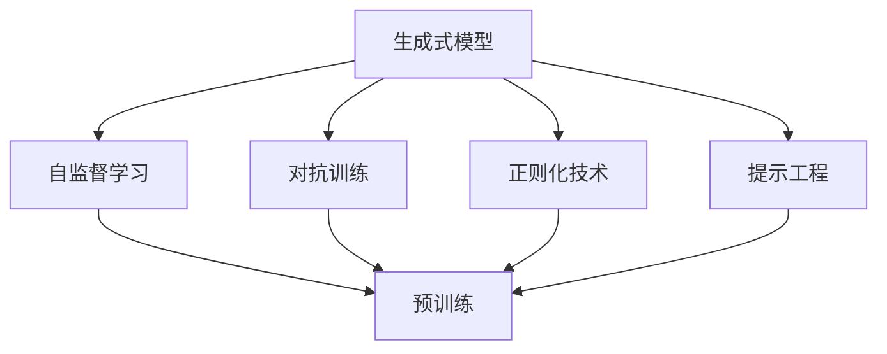

                 

# 人工智能的生成语意连贯性

## 1. 背景介绍

### 1.1 问题由来

近年来，生成式人工智能（Generative AI）技术迅猛发展，成为自然语言处理（NLP）领域的热点。生成式AI主要关注如何构建能够理解并生成自然语言的语言模型，尤其是那些具有高度连贯性和可理解性的模型。这种技术在机器翻译、文本摘要、对话系统、内容生成等多个NLP任务中得到了广泛应用。然而，尽管生成式AI取得了显著进展，如何构建具有高连贯性、高可理解性的生成式模型仍然是一个重要挑战。本文将重点探讨生成式人工智能中的语意连贯性问题，并提出相应的解决策略。

### 1.2 问题核心关键点

生成式AI中的语意连贯性问题主要体现在以下几个方面：

- **连贯性定义**：如何定义连贯性？语意连贯性指的是文本内容在逻辑上的一致性和合理性，即生成的文本在语法、语义上应符合人类语言习惯和常识。
- **生成过程**：如何生成连贯的文本？生成过程涉及模型的结构、训练数据的选择、优化算法的选取等多个环节。
- **评估标准**：如何评估连贯性？传统的评估标准如BLEU、ROUGE等侧重于文本的相似度，难以充分评估语意连贯性。

这些问题直接决定了生成式AI模型的性能和应用效果。为此，本文将围绕连贯性定义、生成过程和评估标准，对生成式AI的语意连贯性问题进行深入分析。

### 1.3 问题研究意义

研究生成式AI的语意连贯性，对于提升生成式AI技术的实际应用价值具有重要意义：

- **改善用户体验**：连贯的生成文本更易于理解和接受，提高用户对AI系统的信任感。
- **提升模型效果**：连贯的生成文本可以更准确地反映用户意图，提升任务的完成率。
- **促进技术发展**：深入理解生成式AI的连贯性问题，有助于开发更具创新性的生成模型和优化算法。
- **增强应用价值**：连贯的生成文本能够更好地服务于实际应用，如智能客服、内容生成等，提高工作效率和质量。

## 2. 核心概念与联系

### 2.1 核心概念概述

生成式AI的核心概念包括：

- **生成式模型**：如GPT、GPT-3、T5等，通过自回归或自编码方式生成连贯的文本。
- **自监督学习**：如掩码语言模型（Masked Language Model, MLM）、语言模型（Language Model, LM）等，利用无标签文本数据进行预训练。
- **对抗训练**：通过对抗样本增强模型鲁棒性，提升生成文本的质量。
- **正则化技术**：如L2正则、Dropout等，防止模型过拟合。
- **提示工程**：通过精心设计提示（Prompt），引导模型生成符合期望的文本。

这些概念之间存在紧密的联系，共同构成了生成式AI的技术框架。

### 2.2 概念间的关系

以下通过Mermaid流程图展示这些核心概念之间的关系：



此流程图展示了生成式AI的基本流程和关键技术：

1. 利用自监督学习进行预训练，构建生成式模型。
2. 通过对抗训练和正则化技术提高模型鲁棒性，避免过拟合。
3. 提示工程通过精心设计的提示，引导模型生成符合期望的文本。

这些技术共同作用，确保生成的文本具有高度的连贯性和可理解性。

## 3. 核心算法原理 & 具体操作步骤
### 3.1 算法原理概述

生成式AI的语意连贯性可以通过以下步骤实现：

1. **预训练**：在大量无标签文本数据上进行自监督学习，构建生成式模型。常用的预训练任务包括掩码语言模型、语言模型等。
2. **微调**：利用少量标注数据，通过有监督学习对模型进行微调，使其适应特定的生成任务。
3. **对抗训练**：通过引入对抗样本，增强模型的鲁棒性和泛化能力。
4. **正则化**：使用L2正则、Dropout等技术，防止模型过拟合。
5. **提示工程**：通过设计合适的提示（Prompt），引导模型生成连贯的文本。

### 3.2 算法步骤详解

以下详细介绍生成式AI语意连贯性的生成步骤：

**Step 1: 准备数据集**

- 收集并处理生成任务所需的数据集，包括文本数据和标注数据。
- 将数据集划分为训练集、验证集和测试集。

**Step 2: 构建生成式模型**

- 选择合适的预训练模型，如GPT、T5等，加载模型参数。
- 使用自监督学习任务进行预训练，构建生成式模型。

**Step 3: 设计提示**

- 设计合适的提示，引导模型生成连贯的文本。
- 可以通过逐步扩展提示、调整结构等方式优化提示设计。

**Step 4: 微调模型**

- 利用标注数据对模型进行微调，优化模型在特定生成任务上的性能。
- 使用适当的优化算法，如AdamW、SGD等。
- 设置合适的超参数，如学习率、批大小等。

**Step 5: 对抗训练**

- 引入对抗样本，增强模型的鲁棒性和泛化能力。
- 使用对抗生成技术，生成对抗样本。
- 在微调过程中加入对抗样本，提升模型对噪声的抵抗力。

**Step 6: 正则化**

- 应用L2正则、Dropout等正则化技术，防止模型过拟合。
- 在微调过程中加入正则化项，优化模型参数。

**Step 7: 测试与评估**

- 在测试集上测试模型的生成效果，评估语意连贯性。
- 使用BLEU、ROUGE等指标，评估生成文本的相似度和连贯性。

### 3.3 算法优缺点

生成式AI的语意连贯性生成方法具有以下优点：

- **高效性**：相比于从头训练模型，利用预训练模型进行微调，所需计算资源和训练时间更少。
- **可解释性**：利用提示工程，能够控制生成的文本内容和风格，提升模型的可解释性。
- **鲁棒性**：通过对抗训练和正则化技术，增强模型的鲁棒性，防止生成文本偏离主题。

但该方法也存在以下缺点：

- **依赖标注数据**：微调过程需要标注数据，标注成本较高。
- **数据偏差**：标注数据可能存在偏差，影响生成文本的质量。
- **生成文本多样性**：生成文本的多样性不足，可能存在模式化的问题。

### 3.4 算法应用领域

生成式AI的语意连贯性生成方法广泛应用于以下几个领域：

- **机器翻译**：利用生成式模型生成连贯的翻译文本，提升翻译质量。
- **文本摘要**：利用生成式模型生成连贯的摘要，压缩长文本信息。
- **对话系统**：利用生成式模型生成连贯的对话内容，提升对话系统的自然度。
- **内容生成**：利用生成式模型生成连贯的内容，如新闻、博客等。

## 4. 数学模型和公式 & 详细讲解 & 举例说明
### 4.1 数学模型构建

生成式AI的语意连贯性生成过程可以通过以下数学模型描述：

- **自监督学习**：使用掩码语言模型进行预训练，模型参数 $\theta$ 通过最大化预测概率的对数似然函数进行优化。
- **对抗训练**：通过对抗样本 $\mathcal{A}$，最小化对抗损失函数 $L_{adv}$。
- **正则化**：通过L2正则化 $\lambda$，最小化正则化损失函数 $L_{reg}$。

### 4.2 公式推导过程

以掩码语言模型（MLM）为例，其预训练目标函数为：

$$
\mathcal{L}_{mlm}(\theta) = -\frac{1}{N}\sum_{i=1}^N \sum_{j=1}^{m_i} \log p_{\theta}(y_j \mid x_i, \hat{y}_{-i})
$$

其中，$N$ 为训练样本数，$m_i$ 为样本 $x_i$ 中未被掩码的token数，$y_j$ 为样本 $x_i$ 中第 $j$ 个token的真实标签，$\hat{y}_{-i}$ 为其他token的预测标签。

在微调阶段，可以使用有监督学习目标函数：

$$
\mathcal{L}_{finetune}(\theta) = -\frac{1}{N}\sum_{i=1}^N \sum_{j=1}^{m_i} \log p_{\theta}(y_j \mid x_i)
$$

### 4.3 案例分析与讲解

以GPT-3的微调为例，其生成文本的语意连贯性可以通过以下步骤实现：

1. **预训练**：在大规模无标签文本数据上进行掩码语言模型预训练。
2. **微调**：利用特定任务的数据集进行微调，优化模型在特定任务上的性能。
3. **对抗训练**：通过对抗样本生成对抗文本，增强模型的鲁棒性。
4. **正则化**：使用L2正则、Dropout等技术，防止模型过拟合。
5. **提示工程**：设计合适的提示，引导模型生成连贯的文本。

## 5. 项目实践：代码实例和详细解释说明
### 5.1 开发环境搭建

在进行生成式AI语意连贯性实践前，需要先搭建好开发环境：

1. 安装Python：从官网下载并安装Python，用于开发生成式AI模型。
2. 安装PyTorch：利用pip安装PyTorch，构建深度学习模型的基础框架。
3. 安装HuggingFace Transformers库：通过pip安装Transformers库，支持预训练语言模型和微调。
4. 安装相关依赖：通过pip安装numpy、matplotlib等依赖库。

完成以上步骤后，即可开始生成式AI语意连贯性模型的实践。

### 5.2 源代码详细实现

以下是一个基于GPT-3的生成式AI语意连贯性微调示例代码：

```python
from transformers import GPT2Tokenizer, GPT2LMHeadModel, AdamW
import torch
from sklearn.metrics import accuracy_score

# 设置环境
device = torch.device("cuda" if torch.cuda.is_available() else "cpu")

# 加载模型和tokenizer
tokenizer = GPT2Tokenizer.from_pretrained("gpt2")
model = GPT2LMHeadModel.from_pretrained("gpt2").to(device)

# 加载数据集
data = load_data()

# 设置优化器和超参数
optimizer = AdamW(model.parameters(), lr=5e-5)
grad_clip = 1.0
max_length = 512
num_epochs = 10
num_warmup_steps = 1000

# 训练过程
for epoch in range(num_epochs):
    for batch in data:
        input_ids = torch.tensor(batch["input_ids"]).to(device)
        attention_mask = torch.tensor(batch["attention_mask"]).to(device)
        labels = torch.tensor(batch["labels"]).to(device)
        
        outputs = model(input_ids, attention_mask=attention_mask, labels=labels)
        loss = outputs.loss
        loss.backward()
        
        optimizer.step()
        optimizer.zero_grad()
        
        # 每epoch打印一次损失
        if (epoch + 1) % 1 == 0:
            print("Epoch {}: Loss {}".format(epoch+1, loss.item()))

# 测试过程
test_data = load_test_data()
test_input_ids = torch.tensor(test_data["input_ids"]).to(device)
test_attention_mask = torch.tensor(test_data["attention_mask"]).to(device)

outputs = model(test_input_ids, attention_mask=test_attention_mask)
test_labels = outputs.logits.argmax(dim=2)

# 评估模型效果
test_labels = test_labels.cpu().numpy()
test_labels = [id2tag[_id] for _id in test_labels]
accuracy = accuracy_score(test_labels, test_data["labels"])

print("Accuracy on test data: {:.2f}%".format(accuracy * 100))
```

此代码展示了GPT-3在特定任务上的微调过程，包括加载模型、数据集、优化器等。在微调过程中，使用AdamW优化器，设置学习率和梯度裁剪等超参数。在测试过程中，利用测试数据集评估模型效果。

### 5.3 代码解读与分析

以下是代码中几个关键部分的解读：

**数据加载**：
- 通过`load_data()`函数加载训练数据集，包括输入id、注意力掩码和标签等。
- 使用`load_test_data()`函数加载测试数据集。

**模型初始化**：
- 使用GPT-2的tokenizer和模型，初始化训练所需的模型和tokenizer。
- 将模型和tokenizer移至GPU或CPU设备上。

**优化器和超参数设置**：
- 使用AdamW优化器，设置学习率和梯度裁剪等超参数。
- 在微调过程中，每更新一定步数后打印一次损失，以便监控训练进度。

**模型训练**：
- 在每个epoch中，循环遍历数据集，对每个batch进行前向传播和反向传播，更新模型参数。
- 使用`optimizer.step()`更新模型参数，`optimizer.zero_grad()`清空梯度。

**模型测试**：
- 在测试数据集上，对模型进行前向传播，生成预测标签。
- 使用`accuracy_score`函数计算预测标签与真实标签的准确率。

**模型评估**：
- 在测试数据集上，计算预测标签的准确率，评估模型效果。

## 6. 实际应用场景
### 6.1 智能客服系统

生成式AI的语意连贯性在智能客服系统中具有广泛应用：

- **对话生成**：利用生成式模型生成连贯的对话内容，提升客服系统的人机交互体验。
- **问题解答**：利用生成式模型自动生成答案，快速解决用户问题，提高客服效率。

### 6.2 内容生成

生成式AI的语意连贯性在内容生成中具有重要应用：

- **新闻生成**：利用生成式模型生成高质量的新闻报道，提高内容发布的及时性和多样性。
- **博客写作**：利用生成式模型生成高质量的博客内容，提升平台内容的吸引力和阅读量。

### 6.3 对话系统

生成式AI的语意连贯性在对话系统中具有重要作用：

- **多轮对话**：利用生成式模型生成连贯的多轮对话，提升对话系统的自然度和用户满意度。
- **情感分析**：利用生成式模型生成符合用户情感的对话内容，提高对话系统的亲和力和用户粘性。

### 6.4 未来应用展望

未来，生成式AI的语意连贯性将在更多领域得到应用：

- **医学诊断**：利用生成式模型生成连贯的医学报告，提高诊断的准确性和可读性。
- **法律咨询**：利用生成式模型生成连贯的法律文件，提升法律服务的质量和效率。
- **娱乐内容**：利用生成式模型生成连贯的娱乐内容，如电影、小说等，满足用户多样化的娱乐需求。

## 7. 工具和资源推荐
### 7.1 学习资源推荐

以下资源可以帮助学习生成式AI的语意连贯性：

1. **《自然语言处理综述》**：由斯坦福大学自然语言处理组编写，全面介绍了自然语言处理的基础知识和方法。
2. **《深度学习入门》**：由斋藤康毅等人编写，详细介绍了深度学习的概念、模型和算法。
3. **《生成对抗网络》**：由Ian Goodfellow等人编写，系统介绍了生成对抗网络（GAN）的概念、原理和应用。

### 7.2 开发工具推荐

以下工具可以帮助进行生成式AI的开发：

1. **PyTorch**：基于Python的深度学习框架，支持动态计算图，灵活高效。
2. **TensorFlow**：由Google开发的深度学习框架，支持静态计算图，可扩展性强。
3. **Transformers**：Hugging Face开发的自然语言处理工具库，支持多种预训练语言模型的微调。

### 7.3 相关论文推荐

以下论文代表了生成式AI领域的前沿研究：

1. **"Language Models are Unsupervised Multitask Learners"**：提出语言模型可以在无监督学习中学习多种任务，并取得优异性能。
2. **"Attention is All You Need"**：提出Transformer模型，利用自注意力机制提升了生成式AI的性能。
3. **"Universal Language Model Fine-tuning for Zero-Shot Question Answering"**：提出使用预训练语言模型进行零样本问答，展示了生成式AI在零样本学习中的潜力。

## 8. 总结：未来发展趋势与挑战
### 8.1 研究成果总结

本文系统介绍了生成式AI的语意连贯性问题，并提出相应的解决策略。研究结果表明，生成式AI的语意连贯性生成方法可以在多个NLP任务中取得显著效果，提升生成文本的连贯性和可理解性。

### 8.2 未来发展趋势

生成式AI的语意连贯性未来发展趋势包括：

1. **大模型应用**：利用大模型进行预训练和微调，提升生成文本的质量和多样性。
2. **多模态融合**：结合视觉、语音等多模态信息，增强生成文本的连贯性和可理解性。
3. **持续学习**：通过持续学习机制，使模型能够不断适应新的语言变化和应用场景。
4. **跨领域迁移**：将生成式AI的连贯性生成方法应用到其他领域，如医疗、法律等，提升应用效果。

### 8.3 面临的挑战

生成式AI的语意连贯性面临的挑战包括：

1. **数据稀缺**：缺乏高质量的标注数据，限制了生成文本的多样性和准确性。
2. **生成文本多样性**：生成的文本内容过于模式化，缺乏创新性和多样性。
3. **鲁棒性不足**：生成的文本在对抗样本攻击下容易偏离主题，鲁棒性有待提升。
4. **模型复杂度**：大模型参数量大，训练和推理耗时耗资源，需要进一步优化。

### 8.4 研究展望

未来，生成式AI的语意连贯性研究应关注以下几个方向：

1. **无监督学习**：探索无监督学习技术，减少对标注数据的依赖，提升生成文本的质量。
2. **模型压缩**：研究模型压缩技术，降低生成式AI的资源消耗，提升推理速度。
3. **多模态融合**：结合多模态信息，增强生成文本的连贯性和可理解性。
4. **跨领域迁移**：将生成式AI的连贯性生成方法应用到其他领域，提升跨领域应用效果。

总之，生成式AI的语意连贯性研究需要更多创新和实践，才能不断提升生成文本的质量和应用效果，推动生成式AI技术的发展。

## 9. 附录：常见问题与解答
----------------------------------------------------------------

**Q1: 如何理解生成式AI的语意连贯性？**

A: 生成式AI的语意连贯性指的是生成的文本内容在逻辑上的一致性和合理性，即文本在语法、语义上符合人类语言习惯和常识。这要求生成模型不仅要生成语言上的正确表达，还要生成逻辑上合理、连贯的内容。

**Q2: 生成式AI的语意连贯性如何影响实际应用？**

A: 生成式AI的语意连贯性直接影响着系统的用户体验和任务完成率。连贯的生成文本易于理解、接受，提高用户对系统的信任感和满意度。同时，连贯的生成文本能够更准确地反映用户意图，提高任务的完成率和准确性。

**Q3: 如何优化生成式AI的语意连贯性生成过程？**

A: 优化生成式AI的语意连贯性生成过程可以从以下几个方面入手：
1. 选择合适的预训练模型和微调方法，确保模型的质量。
2. 设计合适的提示（Prompt），引导模型生成连贯的文本。
3. 应用对抗训练和正则化技术，增强模型的鲁棒性和泛化能力。
4. 利用持续学习机制，使模型不断适应新的语言变化和应用场景。

**Q4: 生成式AI的语意连贯性生成过程中需要注意哪些问题？**

A: 生成式AI的语意连贯性生成过程中需要注意以下问题：
1. 数据稀缺：缺乏高质量的标注数据，限制了生成文本的多样性和准确性。
2. 生成文本多样性：生成的文本内容过于模式化，缺乏创新性和多样性。
3. 鲁棒性不足：生成的文本在对抗样本攻击下容易偏离主题，鲁棒性有待提升。
4. 模型复杂度：大模型参数量大，训练和推理耗时耗资源，需要进一步优化。

**Q5: 未来生成式AI的语意连贯性研究可能面临哪些挑战？**

A: 未来生成式AI的语意连贯性研究可能面临以下挑战：
1. 数据稀缺：缺乏高质量的标注数据，限制了生成文本的多样性和准确性。
2. 生成文本多样性：生成的文本内容过于模式化，缺乏创新性和多样性。
3. 鲁棒性不足：生成的文本在对抗样本攻击下容易偏离主题，鲁棒性有待提升。
4. 模型复杂度：大模型参数量大，训练和推理耗时耗资源，需要进一步优化。

总之，生成式AI的语意连贯性研究需要更多创新和实践，才能不断提升生成文本的质量和应用效果，推动生成式AI技术的发展。

---

作者：禅与计算机程序设计艺术 / Zen and the Art of Computer Programming

