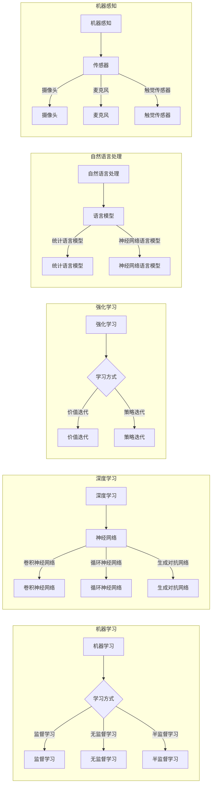

> 人工智能2.0, 自动化, 机器学习, 智能化, 机器感知, 自然语言处理, 深度学习, 强化学习, 软件定义网络, 量子计算

# AI2.0时代：自动化的崭新开始

在人类历史的长河中，自动化一直是推动社会进步的关键力量。从农业社会的手工业到工业革命，再到信息时代的计算机自动化，每一次自动化浪潮都极大地改变了我们的生活方式和生产力。如今，我们正站在AI2.0时代的门槛上，自动化正迎来前所未有的崭新开始。本文将深入探讨AI2.0时代的核心概念、技术原理、应用场景，并展望其未来发展趋势与挑战。

## 1. 背景介绍

### 1.1 问题的由来

随着互联网的普及和大数据时代的到来，数据量呈爆炸式增长，人类面临着如何高效处理和分析这些数据的问题。传统的计算方法和工具已经无法满足需求，因此，人工智能(AI)技术应运而生。AI技术的发展经历了多个阶段，从早期的专家系统到基于统计的机器学习，再到如今的深度学习，每一次突破都推动了自动化水平的提升。

### 1.2 研究现状

近年来，人工智能技术取得了显著的进展，尤其是在深度学习、强化学习等领域。然而，现有的AI技术仍然存在一些局限性，如数据依赖性高、可解释性差、泛化能力不足等。为了解决这些问题，AI2.0时代应运而生，其核心目标是通过更加智能化的算法和技术，实现更加高效、可靠、可解释的自动化。

### 1.3 研究意义

AI2.0时代的到来，对于推动社会进步具有重要意义：

- 提高生产效率：通过自动化技术，可以极大地提高生产效率，降低人力成本。
- 改善生活质量：AI技术可以帮助人们更好地解决生活中的问题，提高生活质量。
- 促进创新：AI技术可以激发新的研究领域和应用场景，推动科技创新。
- 推动产业升级：AI技术可以推动传统产业转型升级，创造新的经济增长点。

### 1.4 本文结构

本文将分为以下几个部分：

- 第2部分：介绍AI2.0时代的核心概念和联系。
- 第3部分：阐述AI2.0时代的关键技术和算法原理。
- 第4部分：分析AI2.0技术的应用场景和案例。
- 第5部分：探讨AI2.0技术的未来发展趋势和挑战。
- 第6部分：总结全文，展望AI2.0时代的未来。

## 2. 核心概念与联系

### 2.1 核心概念原理

AI2.0时代的主要核心概念包括：

- 机器学习：机器学习是一种使计算机系统能够从数据中学习并做出决策的技术。
- 深度学习：深度学习是机器学习中一种利用深层神经网络进行特征学习和模式识别的技术。
- 强化学习：强化学习是一种通过试错和奖励来学习最优策略的机器学习方法。
- 自然语言处理（NLP）：自然语言处理是使计算机能够理解、解释和生成人类语言的技术。
- 机器感知：机器感知是使计算机能够通过传感器感知外部世界的技术。

### 2.2 核心概念架构

以下是AI2.0时代核心概念架构的Mermaid流程图：



### 2.3 核心概念联系

AI2.0时代的核心概念之间存在着紧密的联系：

- 机器学习是AI2.0时代的基础，深度学习、强化学习、NLP、机器感知等都是机器学习在不同领域的应用。
- 深度学习是AI2.0时代的主流技术，通过神经网络模型实现复杂的学习任务。
- 强化学习是AI2.0时代的重要研究方向，通过与环境交互学习最优策略。
- NLP是AI2.0时代的关键技术之一，使计算机能够理解、解释和生成人类语言。
- 机器感知是AI2.0时代的核心技术之一，使计算机能够感知外部世界。

## 3. 核心算法原理 & 具体操作步骤

### 3.1 算法原理概述

AI2.0时代的关键技术包括：

- 深度学习：通过多层神经网络模型实现特征学习和模式识别。
- 强化学习：通过试错和奖励来学习最优策略。
- 自然语言处理：通过机器学习技术实现人类语言的理解和生成。
- 机器感知：通过传感器技术实现计算机对外部世界的感知。

### 3.2 算法步骤详解

#### 3.2.1 深度学习

深度学习的基本步骤如下：

1. 数据预处理：对原始数据进行清洗、归一化等处理。
2. 模型设计：设计合适的神经网络模型，包括层数、神经元数量、激活函数等。
3. 训练模型：使用训练数据对模型进行训练，调整模型参数。
4. 模型评估：使用测试数据评估模型的性能，并进行优化。

#### 3.2.2 强化学习

强化学习的基本步骤如下：

1. 环境建模：建立环境模型，定义状态空间和动作空间。
2. 策略设计：设计合适的策略函数，用于选择动作。
3. 策略评估：评估策略函数的性能，并进行优化。
4. 策略优化：通过试错和奖励调整策略函数，学习最优策略。

#### 3.2.3 自然语言处理

自然语言处理的基本步骤如下：

1. 文本预处理：对文本进行分词、词性标注、命名实体识别等处理。
2. 特征提取：从文本中提取特征，如词袋模型、TF-IDF、词嵌入等。
3. 模型训练：使用训练数据对模型进行训练，调整模型参数。
4. 模型评估：使用测试数据评估模型的性能，并进行优化。

#### 3.2.4 机器感知

机器感知的基本步骤如下：

1. 传感器数据采集：从传感器采集数据。
2. 数据预处理：对传感器数据进行预处理，如滤波、归一化等。
3. 特征提取：从传感器数据中提取特征。
4. 模型训练：使用训练数据对模型进行训练，调整模型参数。
5. 模型评估：使用测试数据评估模型的性能，并进行优化。

### 3.3 算法优缺点

#### 3.3.1 深度学习

优点：

- 能够处理大规模数据，提取复杂特征。
- 能够自动学习特征表示，不需要人工设计特征。
- 在图像识别、语音识别等领域取得了显著的成果。

缺点：

- 模型训练需要大量计算资源和时间。
- 模型可解释性较差，难以理解模型的决策过程。

#### 3.3.2 强化学习

优点：

- 能够学习到复杂的决策策略。
- 能够适应不断变化的环境。

缺点：

- 学习速度较慢，需要大量数据进行训练。
- 实际应用中可能遇到收敛困难的问题。

#### 3.3.3 自然语言处理

优点：

- 能够理解、解释和生成人类语言。
- 在文本分类、机器翻译等领域取得了显著的成果。

缺点：

- 需要大量的标注数据。
- 模型可解释性较差。

#### 3.3.4 机器感知

优点：

- 能够使计算机感知外部世界。
- 在自动驾驶、机器人等领域取得了显著的成果。

缺点：

- 传感器成本较高。
- 传感器数据质量对模型性能有较大影响。

### 3.4 算法应用领域

深度学习、强化学习、自然语言处理和机器感知等AI2.0技术已经广泛应用于以下领域：

- 图像识别：人脸识别、物体识别、图像分类等。
- 语音识别：语音识别、语音合成、语音翻译等。
- 自然语言处理：文本分类、机器翻译、情感分析等。
- 机器感知：自动驾驶、机器人、智能家居等。

## 4. 数学模型和公式 & 详细讲解 & 举例说明

### 4.1 数学模型构建

以下是一些AI2.0时代的常用数学模型：

- **神经网络**：神经网络是一种模拟人脑神经元连接结构的计算模型，用于特征学习和模式识别。

  $$ f(x) = \sigma(\theta^T x + b) $$

  其中 $x$ 是输入向量，$\theta$ 是权重，$b$ 是偏置，$\sigma$ 是激活函数。

- **强化学习**：强化学习是一种通过试错和奖励来学习最优策略的机器学习方法。

  $$ Q(s, a) = \sum_{s' \in S} \gamma \max_{a'} Q(s', a') P(s'|s, a) $$

  其中 $Q(s, a)$ 是在状态 $s$ 下采取动作 $a$ 的预期回报，$\gamma$ 是折扣因子，$P(s'|s, a)$ 是在状态 $s$ 下采取动作 $a$ 后转移到状态 $s'$ 的概率。

- **自然语言处理**：自然语言处理是一种使计算机能够理解、解释和生成人类语言的技术。

  $$ P(w_i|w_{i-1}, ..., w_{i-n+1}) = \frac{P(w_{i-1}, ..., w_i)}{P(w_{i-1}, ..., w_{i-n+1})} $$

  其中 $w_i$ 是第 $i$ 个词，$P(w_i|w_{i-1}, ..., w_{i-n+1})$ 是在词 $w_{i-1}, ..., w_{i-n+1}$ 后出现词 $w_i$ 的概率。

### 4.2 公式推导过程

以下是一些常用公式的推导过程：

#### 4.2.1 神经网络

神经网络的损失函数通常采用均方误差（MSE）：

$$ L(\theta) = \frac{1}{2}\sum_{i=1}^n (y_i - f(x_i))^2 $$

其中 $y_i$ 是真实标签，$f(x_i)$ 是模型预测的值。

对损失函数求导，得到：

$$ \frac{\partial L(\theta)}{\partial \theta} = -\frac{1}{2}\sum_{i=1}^n 2(y_i - f(x_i))\frac{\partial f(x_i)}{\partial \theta} $$

根据链式法则，可以得到：

$$ \frac{\partial f(x_i)}{\partial \theta} = \frac{\partial f(x_i)}{\partial z_i} \frac{\partial z_i}{\partial \theta} $$

其中 $z_i$ 是第 $i$ 个神经元的输入。

#### 4.2.2 强化学习

强化学习的目标是最小化长期回报：

$$ J(\pi) = \sum_{t=0}^\infty \gamma^t R_t $$

其中 $\pi$ 是策略，$R_t$ 是在时间步 $t$ 收到的回报。

对 $J(\pi)$ 求导，得到：

$$ \frac{\partial J(\pi)}{\partial \pi} = \sum_{t=0}^\infty \gamma^t \frac{\partial R_t}{\partial \pi} $$

根据策略梯度定理，可以得到：

$$ \frac{\partial R_t}{\partial \pi} = \sum_{a'} \pi(a'|s_t) \frac{\partial Q(s_t, a)}{\partial \theta} $$

其中 $s_t$ 是状态，$a$ 是动作。

#### 4.2.3 自然语言处理

自然语言处理中的词向量表示通常采用Word2Vec模型：

$$ w_i = \theta_i + \sum_{j=1}^V \alpha_j \text{sgn}(w_{ij}) $$

其中 $w_i$ 是词 $i$ 的向量表示，$\theta_i$ 是偏置，$\alpha_j$ 是学习率，$w_{ij}$ 是词 $i$ 和词 $j$ 之间的相似度。

### 4.3 案例分析与讲解

以下是一些AI2.0技术的应用案例分析：

#### 4.3.1 图像识别

图像识别是一种通过计算机视觉技术对图像进行分析和理解的技术。如图像分类、目标检测等。

**案例**：基于卷积神经网络（CNN）的目标检测

- 数据集：COCO数据集
- 模型：Faster R-CNN
- 训练：使用COCO数据集进行训练，训练过程中调整模型参数。

#### 4.3.2 语音识别

语音识别是一种将语音信号转换为文本的技术。

**案例**：基于深度神经网络的语音识别

- 数据集：LibriSpeech数据集
- 模型：DeepSpeech 2
- 训练：使用LibriSpeech数据集进行训练，训练过程中调整模型参数。

#### 4.3.3 自然语言处理

自然语言处理是一种使计算机能够理解、解释和生成人类语言的技术。

**案例**：基于循环神经网络（RNN）的文本生成

- 数据集：Wikipedia数据集
- 模型：LSTM
- 训练：使用Wikipedia数据集进行训练，训练过程中调整模型参数。

#### 4.3.4 机器感知

机器感知是一种使计算机能够感知外部世界的技术。

**案例**：基于机器学习的自动驾驶

- 数据集：Kitti数据集
- 模型：基于深度学习的物体检测和追踪算法
- 训练：使用Kitti数据集进行训练，训练过程中调整模型参数。

## 5. 项目实践：代码实例和详细解释说明

### 5.1 开发环境搭建

以下是使用Python进行AI2.0项目开发的环境配置流程：

1. 安装Anaconda：从官网下载并安装Anaconda，用于创建独立的Python环境。
2. 创建并激活虚拟环境：
```bash
conda create -n ai2.0-env python=3.8
conda activate ai2.0-env
```
3. 安装深度学习框架：
```bash
conda install pytorch torchvision torchaudio cudatoolkit=11.1 -c pytorch -c conda-forge
```
4. 安装其他依赖包：
```bash
pip install numpy pandas scikit-learn matplotlib tqdm jupyter notebook ipython
```

### 5.2 源代码详细实现

以下是一个使用PyTorch实现的基于卷积神经网络的图像识别项目示例：

```python
import torch
import torch.nn as nn
import torch.optim as optim
from torchvision import datasets, transforms
from torch.utils.data import DataLoader

# 定义卷积神经网络模型
class ConvNet(nn.Module):
    def __init__(self):
        super(ConvNet, self).__init__()
        self.conv1 = nn.Conv2d(3, 32, kernel_size=3, stride=1, padding=1)
        self.relu = nn.ReLU()
        self.pool = nn.MaxPool2d(kernel_size=2, stride=2)
        self.fc1 = nn.Linear(32 * 64 * 64, 128)
        self.fc2 = nn.Linear(128, 10)
    
    def forward(self, x):
        x = self.pool(self.relu(self.conv1(x)))
        x = x.view(-1, 32 * 64 * 64)
        x = self.relu(self.fc1(x))
        x = self.fc2(x)
        return x

# 加载数据集
transform = transforms.Compose([
    transforms.Resize((64, 64)),
    transforms.ToTensor()
])

train_dataset = datasets.CIFAR10(root='./data', train=True, download=True, transform=transform)
train_loader = DataLoader(train_dataset, batch_size=64, shuffle=True)

# 创建模型和优化器
model = ConvNet()
optimizer = optim.Adam(model.parameters(), lr=0.001)
criterion = nn.CrossEntropyLoss()

# 训练模型
model.train()
for epoch in range(10):
    for batch_idx, (data, target) in enumerate(train_loader):
        optimizer.zero_grad()
        output = model(data)
        loss = criterion(output, target)
        loss.backward()
        optimizer.step()
        if batch_idx % 100 == 0:
            print(f"Train Epoch: {epoch} [{batch_idx * len(data)}/{len(train_loader.dataset)} ({100. * batch_idx / len(train_loader):.0f}%)]\tLoss: {loss.item():.6f}")

# 保存模型
torch.save(model.state_dict(), './convnet.pth')
```

### 5.3 代码解读与分析

以上代码实现了使用卷积神经网络（CNN）对CIFAR-10图像数据集进行分类的项目。以下是代码的关键部分解读：

- **ConvNet类**：定义了一个简单的卷积神经网络模型，包含卷积层、ReLU激活函数、最大池化层和全连接层。
- **数据加载**：使用PyTorch的`datasets`和`DataLoader`模块加载数据集，并进行数据预处理。
- **模型训练**：使用Adam优化器和交叉熵损失函数对模型进行训练，并在每个epoch后打印训练损失。

### 5.4 运行结果展示

运行上述代码后，可以在控制台看到训练过程中的损失信息。训练完成后，模型会被保存到当前目录下的`convnet.pth`文件中。

## 6. 实际应用场景

AI2.0技术在各个领域都有广泛的应用，以下是一些典型的应用场景：

### 6.1 工业自动化

AI2.0技术可以应用于工业自动化领域，如智能工厂、智能生产等。通过自动化生产线，可以提高生产效率、降低人力成本，并提高产品质量。

### 6.2 医疗健康

AI2.0技术可以应用于医疗健康领域，如疾病诊断、药物研发等。通过分析大量的医疗数据，可以辅助医生进行诊断和治疗，提高医疗服务的质量和效率。

### 6.3 金融科技

AI2.0技术可以应用于金融科技领域，如智能投顾、欺诈检测等。通过分析用户的交易数据和行为数据，可以提供个性化的投资建议，并识别潜在的欺诈行为。

### 6.4 交通出行

AI2.0技术可以应用于交通出行领域，如自动驾驶、智能交通管理等。通过优化交通流，可以提高交通效率，降低事故发生率。

### 6.5 智能家居

AI2.0技术可以应用于智能家居领域，如智能家电、智能安防等。通过连接各种家电和传感器，可以提供更加便捷、舒适的生活体验。

## 7. 工具和资源推荐

### 7.1 学习资源推荐

以下是一些AI2.0技术学习的资源推荐：

- 《深度学习》：Goodfellow等著作的深度学习经典教材。
- 《Python深度学习》：François Chollet等著作的Python深度学习实战指南。
- 《强化学习》：Sutton和Barto的强化学习经典教材。

### 7.2 开发工具推荐

以下是一些AI2.0技术开发工具推荐：

- PyTorch：开源的深度学习框架，易于使用，功能强大。
- TensorFlow：Google开源的深度学习框架，支持多种平台和设备。
- Keras：Python深度学习库，提供丰富的API和模型选择。

### 7.3 相关论文推荐

以下是一些AI2.0技术相关的论文推荐：

- "Deep Learning for Computer Vision: A Review"：对深度学习在计算机视觉领域的应用进行综述。
- "Playing Atari with Deep Reinforcement Learning"：介绍了深度强化学习在Atari游戏中的应用。
- "BERT: Pre-training of Deep Bidirectional Transformers for Language Understanding"：介绍了BERT模型，一种基于Transformer的预训练语言模型。

## 8. 总结：未来发展趋势与挑战

### 8.1 研究成果总结

AI2.0时代为自动化带来了前所未有的机遇，深度学习、强化学习、自然语言处理和机器感知等技术的快速发展，推动了自动化水平的提升。然而，AI2.0技术仍面临着一些挑战，如数据依赖性高、可解释性差、泛化能力不足等。

### 8.2 未来发展趋势

未来AI2.0技术将呈现以下发展趋势：

- 模型轻量化：为了更好地应用在移动设备和嵌入式设备上，模型的轻量化将成为重要研究方向。
- 可解释性研究：为了提高模型的可靠性和可信度，可解释性研究将成为重要研究方向。
- 跨模态学习：为了更好地理解复杂场景，跨模态学习将成为重要研究方向。
- 量子计算：随着量子计算的快速发展，量子计算与AI技术的结合将成为重要研究方向。

### 8.3 面临的挑战

AI2.0技术面临的挑战包括：

- 数据质量：高质量的数据是AI2.0技术发展的基础，如何获取高质量的数据是一个重要挑战。
- 模型可解释性：为了提高模型的可靠性和可信度，如何提高模型的可解释性是一个重要挑战。
- 泛化能力：如何提高模型的泛化能力，使其在不同场景下都能保持良好的性能是一个重要挑战。
- 伦理和安全：如何确保AI2.0技术的伦理和安全是一个重要挑战。

### 8.4 研究展望

未来，AI2.0技术将朝着以下方向发展：

- 开发更加智能化的算法和技术，实现更加高效、可靠、可解释的自动化。
- 推动AI2.0技术在各个领域的应用，为人类社会创造更多价值。
- 加强AI2.0技术的伦理和安全研究，确保技术的健康发展。

## 9. 附录：常见问题与解答

**Q1：什么是AI2.0时代？**

A：AI2.0时代是指以深度学习、强化学习、自然语言处理和机器感知等为代表的新一代人工智能时代。

**Q2：AI2.0技术有哪些应用场景？**

A：AI2.0技术可以应用于工业自动化、医疗健康、金融科技、交通出行、智能家居等领域。

**Q3：AI2.0技术面临的挑战有哪些？**

A：AI2.0技术面临的挑战包括数据质量、模型可解释性、泛化能力、伦理和安全等。

**Q4：如何学习AI2.0技术？**

A：学习AI2.0技术可以通过阅读相关书籍、参加在线课程、实践项目等方式。

**Q5：AI2.0技术的未来发展趋势是什么？**

A：AI2.0技术的未来发展趋势包括模型轻量化、可解释性研究、跨模态学习、量子计算等。

---

作者：禅与计算机程序设计艺术 / Zen and the Art of Computer Programming