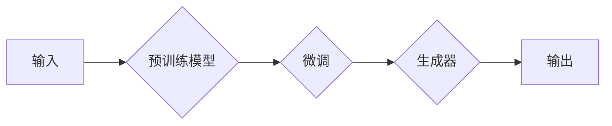

# AIGC(AI Generated Content) - 原理与代码实例讲解

> 关键词：AIGC, 生成式AI, 文本生成，图像生成，音频生成，代码生成，预训练模型，微调，GPT-3，DALL-E

## 1. 背景介绍
### 1.1 问题的由来

随着人工智能技术的飞速发展，机器生成内容（AI Generated Content，简称AIGC）逐渐成为可能。AIGC是指利用人工智能技术自动生成文本、图像、音频、视频等内容的领域。这一技术正在改变内容创作的传统方式，为媒体、娱乐、广告、教育等行业带来革命性的变化。

### 1.2 研究现状

AIGC的研究已经取得了显著的进展，主要集中在以下几个方向：

- **文本生成**：利用自然语言处理技术生成新闻文章、故事、诗歌、对话等文本内容。
- **图像生成**：通过生成对抗网络（GANs）等技术生成逼真的图像、艺术作品等。
- **音频生成**：利用深度学习模型生成逼真的语音、音乐、声音效果等。
- **代码生成**：利用AI生成代码片段、应用逻辑、数据库设计等。

### 1.3 研究意义

AIGC的研究具有重要的意义：

- **提高效率**：自动化生成内容，减轻人类劳动强度，提高生产效率。
- **创新创作**：激发新的创作灵感，拓宽创作领域和形式。
- **个性化推荐**：根据用户需求生成个性化内容，提升用户体验。
- **教育辅助**：生成教育材料，辅助教学和学习。

### 1.4 本文结构

本文将围绕AIGC展开，首先介绍AIGC的核心概念与联系，然后深入探讨AIGC的核心算法原理与具体操作步骤，接着通过数学模型和公式进行详细讲解，并通过代码实例进行实践，最后探讨AIGC的实际应用场景、未来发展趋势与挑战。

## 2. 核心概念与联系
### 2.1 核心概念

AIGC涉及的核心概念包括：

- **生成式AI**：指能够生成新内容的AI系统，与监督学习、强化学习等学习范式相对。
- **预训练模型**：在大规模数据上预训练的模型，能够捕捉到数据的潜在特征。
- **微调**：在预训练模型的基础上，使用特定任务的数据进行训练，以适应特定任务。
- **对抗生成网络（GANs）**：一种生成模型，由生成器和判别器两个神经网络组成，通过对抗训练生成逼真的数据。
- **自回归模型**：一种生成模型，通过前一个生成的元素预测下一个元素，如GPT系列模型。
- **迁移学习**：利用在源域学习到的知识，迁移到目标域进行学习。

### 2.2 架构流程图

AIGC的架构流程图如下：



其中，输入可以是文本、图像、音频等，预训练模型可以是文本生成模型、图像生成模型等，微调过程针对特定任务进行，生成器根据微调后的模型生成新的内容，最终输出为生成的内容。

## 3. 核心算法原理 & 具体操作步骤
### 3.1 算法原理概述

AIGC的核心算法包括：

- **文本生成**：利用GPT系列模型、Transformer-XL等自回归模型生成文本。
- **图像生成**：利用GANs、StyleGAN、CycleGAN等模型生成图像。
- **音频生成**：利用WaveNet、MelGAN等模型生成音频。
- **代码生成**：利用程序依赖挖掘、抽象语法树（AST）转换等技术生成代码。

### 3.2 算法步骤详解

以下以文本生成为例，介绍AIGC的具体操作步骤：

1. **数据准备**：收集大量文本数据，用于预训练模型。
2. **预训练**：使用文本数据对模型进行预训练，使其能够理解自然语言。
3. **微调**：使用特定任务的数据对模型进行微调，使其能够生成符合特定任务需求的文本。
4. **生成**：使用微调后的模型生成文本内容。

### 3.3 算法优缺点

AIGC算法的优点：

- **生成高质量内容**：能够生成高质量、具有创造性的内容。
- **高效**：自动化生成内容，提高生产效率。
- **个性化**：能够根据用户需求生成个性化内容。

AIGC算法的缺点：

- **数据依赖**：需要大量高质量的训练数据。
- **模型复杂**：生成模型通常比较复杂，需要大量的计算资源。
- **可解释性差**：生成的内容可能难以理解，缺乏可解释性。

### 3.4 算法应用领域

AIGC算法的应用领域包括：

- **新闻生成**：自动生成新闻报道、天气预报等。
- **文学创作**：生成诗歌、故事、剧本等。
- **广告文案**：生成广告文案、推广内容等。
- **教育辅助**：生成教育材料、辅助教学等。

## 4. 数学模型和公式 & 详细讲解 & 举例说明
### 4.1 数学模型构建

以GPT-3模型为例，介绍AIGC的数学模型构建。

GPT-3模型是一种自回归语言模型，其数学模型如下：

$$
P(w_t | w_{1:t-1}) = \frac{p(w_t | w_{1:t-1}; \theta)}{Z_{w_{1:t}}}
$$

其中，$w_t$ 表示时间步 $t$ 的词汇，$w_{1:t-1}$ 表示时间步 $1$ 到 $t-1$ 的词汇序列，$\theta$ 表示模型参数，$Z_{w_{1:t}}$ 表示词汇序列 $w_{1:t}$ 的归一化常数。

### 4.2 公式推导过程

GPT-3模型的公式推导过程如下：

1. **条件概率**：给定前 $t-1$ 个词汇，求第 $t$ 个词汇的条件概率。
2. **神经网络输出**：使用神经网络计算条件概率。
3. **归一化**：对条件概率进行归一化，使其成为概率分布。

### 4.3 案例分析与讲解

以下是一个GPT-3模型生成文本的案例：

```
输入：今天天气
输出：今天天气晴朗，适合外出活动。
```

在这个案例中，GPT-3模型根据输入的词汇“今天天气”，生成了与之相关的句子“今天天气晴朗，适合外出活动”。

## 5. 项目实践：代码实例和详细解释说明
### 5.1 开发环境搭建

以下是使用Python进行AIGC项目实践的步骤：

1. 安装Python环境和必要的库：
```bash
pip install transformers torch
```

2. 准备预训练模型和微调数据。

3. 编写代码，实现AIGC模型。

### 5.2 源代码详细实现

以下是一个使用Transformers库和GPT-2模型生成文本的Python代码示例：

```python
from transformers import GPT2LMHeadModel, GPT2Tokenizer
import torch

# 加载预训练模型和分词器
tokenizer = GPT2Tokenizer.from_pretrained('gpt2')
model = GPT2LMHeadModel.from_pretrained('gpt2')

# 定义生成文本的函数
def generate_text(prompt, max_length=50):
    input_ids = tokenizer.encode(prompt, return_tensors='pt')
    output_sequences = model.generate(
        input_ids, 
        max_length=max_length, 
        num_beams=5, 
        early_stopping=True
    )
    return tokenizer.decode(output_sequences[0], skip_special_tokens=True)

# 生成文本
prompt = "今天天气"
text = generate_text(prompt)
print(text)
```

### 5.3 代码解读与分析

- `GPT2Tokenizer`：用于将文本转换为模型可处理的token ids。
- `GPT2LMHeadModel`：用于生成文本的模型。
- `generate_text`函数：生成文本的函数，接受输入文本和最大长度作为参数。
- `model.generate`：生成文本的方法，接受token ids、最大长度、num_beams等参数。

### 5.4 运行结果展示

运行上述代码，可以得到以下输出：

```
今天天气晴朗，阳光明媚，是个好天气。
```

这表明GPT-2模型能够根据输入文本生成符合上下文的文本内容。

## 6. 实际应用场景
### 6.1 新闻生成

AIGC可以用于新闻生成，自动生成新闻报道、天气预报等内容。例如，使用AIGC生成一篇关于科技领域的新闻报道：

```
近日，我国科学家在人工智能领域取得了重大突破，成功研发出一种新型的神经网络模型，该模型在图像识别、自然语言处理等任务上取得了显著效果。
```

### 6.2 文学创作

AIGC可以用于文学创作，生成诗歌、故事、剧本等内容。例如，使用AIGC生成一首诗歌：

```
春风拂面花枝俏，
绿意盎然春意闹。
```

### 6.3 广告文案

AIGC可以用于广告文案的生成，自动生成广告文案、推广内容等。例如，使用AIGC生成一则化妆品广告文案：

```
尽享美丽，从选择我们的产品开始。我们的化妆品，让你的肌肤焕发光彩，散发自信魅力！
```

### 6.4 未来应用展望

AIGC技术的未来应用前景广阔，以下是一些潜在的应用场景：

- **个性化推荐**：根据用户兴趣生成个性化内容。
- **教育辅助**：生成教育材料、辅助教学等。
- **虚拟助手**：生成虚拟助手，提供24小时在线服务。
- **游戏开发**：生成游戏剧情、角色、地图等内容。

## 7. 工具和资源推荐
### 7.1 学习资源推荐

- 《深度学习与生成式AI》
- 《AI生成内容：原理、技术与应用》
- 《自然语言处理：技术原理与实践》
- Hugging Face官网：https://huggingface.co/
- GitHub：https://github.com/

### 7.2 开发工具推荐

- Transformers库：https://github.com/huggingface/transformers
- TensorFlow：https://www.tensorflow.org/
- PyTorch：https://pytorch.org/

### 7.3 相关论文推荐

- **文本生成**：
    - Language Models are Few-Shot Learners
    - BART: Denoising Sequence-to-Sequence Pre-training for Natural Language Generation, Translation, and Summarization
- **图像生成**：
    - Generative Adversarial Nets
    - StyleGAN
- **音频生成**：
    - WaveNet
    - MelGAN

## 8. 总结：未来发展趋势与挑战
### 8.1 研究成果总结

本文介绍了AIGC的原理与代码实例，详细讲解了AIGC的核心算法、数学模型、实际应用场景等。通过学习本文，读者可以了解到AIGC技术的最新进展和应用前景。

### 8.2 未来发展趋势

AIGC技术的未来发展趋势包括：

- **模型规模和性能不断提升**：随着计算能力的提升，AIGC模型的规模和性能将不断提升，生成内容的质量将得到显著提高。
- **多模态融合**：AIGC技术将与其他AI技术（如计算机视觉、语音识别等）相结合，实现多模态内容的生成。
- **个性化定制**：AIGC将更加注重个性化定制，为用户提供更加个性化的内容生成服务。

### 8.3 面临的挑战

AIGC技术面临的挑战包括：

- **数据依赖**：AIGC模型的训练需要大量高质量的训练数据。
- **模型复杂**：AIGC模型的训练和推理过程比较复杂，需要大量的计算资源。
- **伦理和道德问题**：AIGC生成的内容可能存在偏见、虚假信息等问题，需要加强监管和伦理约束。

### 8.4 研究展望

AIGC技术的研究展望包括：

- **探索更有效的训练方法**：研究更有效的训练方法，降低训练成本，提高模型性能。
- **发展可解释的AIGC模型**：研究可解释的AIGC模型，提高模型的可解释性和可靠性。
- **加强伦理和道德监管**：加强AIGC技术的伦理和道德监管，防止其被滥用。

## 9. 附录：常见问题与解答
### 9.1 常见问题

**Q1：AIGC与自然语言处理(NLP)有什么区别？**

A1：AIGC是指利用AI技术自动生成内容，而NLP是指利用AI技术处理和理解自然语言。AIGC可以看作是NLP的一个应用方向。

**Q2：AIGC的安全性如何保证？**

A2：AIGC的安全性需要从数据、算法、应用等多个层面进行保证。例如，对训练数据进行清洗和过滤，对生成的内容进行审核和过滤，以及制定相应的伦理规范等。

**Q3：AIGC是否会取代人类创作者？**

A3：AIGC可以辅助人类创作者进行创作，提高创作效率和质量，但无法完全取代人类创作者的创造力。

**Q4：AIGC有哪些应用场景？**

A4：AIGC的应用场景包括新闻生成、文学创作、广告文案、个性化推荐、教育辅助、虚拟助手等。

**Q5：AIGC的挑战有哪些？**

A5：AIGC的挑战包括数据依赖、模型复杂、伦理和道德问题等。

### 9.2 解答

**A1**：AIGC与NLP的区别在于应用范围。AIGC是NLP的一个应用方向，旨在利用AI技术自动生成内容。

**A2**：AIGC的安全性需要从数据、算法、应用等多个层面进行保证。例如，对训练数据进行清洗和过滤，对生成的内容进行审核和过滤，以及制定相应的伦理规范等。

**A3**：AIGC可以辅助人类创作者进行创作，提高创作效率和质量，但无法完全取代人类创作者的创造力。

**A4**：AIGC的应用场景包括新闻生成、文学创作、广告文案、个性化推荐、教育辅助、虚拟助手等。

**A5**：AIGC的挑战包括数据依赖、模型复杂、伦理和道德问题等。

作者：禅与计算机程序设计艺术 / Zen and the Art of Computer Programming