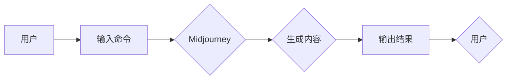

# AIGC从入门到实战：跟着我学习 Midjourney 的使用

> 关键词：AIGC, Midjourney, 自动生成内容，生成式AI，文本生成，图像生成，机器学习，深度学习

## 1. 背景介绍

随着人工智能技术的飞速发展，自动生成内容（AIGC，Artificial Intelligence Generated Content）已经成为了一个热门的研究领域。AIGC技术能够帮助人类自动化地生成文本、图像、音频等多种类型的内容，极大地提高了内容创作的效率和质量。Midjourney 是一个基于深度学习的 AIGC 平台，它能够帮助用户通过简单的命令生成高质量的图像、视频和文本内容。本文将带您从入门到实战，深入了解 Midjourney 的使用。

### 1.1 问题的由来

在数字时代，内容创作已经成为了一个庞大的产业。然而，高质量的内容创作往往需要大量的时间和专业知识的积累。为了解决这个问题，人们一直在寻找能够自动化内容创作的技术。AIGC 技术的出现，正好满足了这一需求。

### 1.2 研究现状

目前，AIGC 技术已经取得了显著的进展，尤其在文本生成和图像生成方面。例如，OpenAI 的 GPT-3 可以生成高质量的文本，而 Google 的 DeepArt 可以将一张图片转换成艺术作品。

### 1.3 研究意义

AIGC 技术具有以下重要意义：

- 提高内容创作效率：AIGC 技术可以帮助用户快速生成高质量的内容，大大提高内容创作的效率。
- 降低创作成本：AIGC 技术可以降低内容创作的成本，让更多的人能够参与到内容创作中来。
- 丰富内容形式：AIGC 技术可以生成多种类型的内容，丰富内容的表现形式。

### 1.4 本文结构

本文将按照以下结构展开：

- 介绍 AIGC 和 Midjourney 的基本概念和原理。
- 详细讲解 Midjourney 的具体操作步骤和算法原理。
- 通过实际案例演示 Midjourney 的使用。
- 探讨 Midjourney 在实际应用场景中的价值。
- 展望 AIGC 和 Midjourney 的未来发展趋势。

## 2. 核心概念与联系

### 2.1 核心概念

- AIGC：自动生成内容，指利用人工智能技术自动化地生成文本、图像、音频等多种类型的内容。
- Midjourney：一个基于深度学习的 AIGC 平台，能够通过简单的命令生成高质量的图像、视频和文本内容。

### 2.2 核心概念原理和架构的 Mermaid 流程图



### 2.3 核心概念之间的联系

用户通过输入命令，Midjourney 接收命令并生成相应的内容，最后将结果输出给用户。这个过程体现了 AIGC 技术的核心价值，即通过人工智能技术实现内容自动生成。

## 3. 核心算法原理 & 具体操作步骤

### 3.1 算法原理概述

Midjourney 主要基于深度学习技术，包括：

- 生成对抗网络（GANs）：用于生成高质量图像。
- 变分自编码器（VAEs）：用于生成高质量的图像和视频。
- 语言模型：用于生成文本内容。

### 3.2 算法步骤详解

1. 用户输入命令：用户通过 Midjourney 的界面或 API 输入生成内容的命令。
2. 模型选择：Midjourney 根据命令内容选择合适的模型进行生成。
3. 数据处理：模型对输入数据进行处理，生成中间结果。
4. 生成内容：模型根据中间结果生成最终的内容。
5. 输出结果：Midjourney 将生成的结果输出给用户。

### 3.3 算法优缺点

**优点**：

- 高质量：Midjourney 能够生成高质量的内容，满足用户对内容质量的要求。
- 灵活性：Midjourney 支持多种模型和生成方式，用户可以根据需求选择合适的选项。
- 简便性：Midjourney 的使用非常简单，用户无需深入了解技术细节。

**缺点**：

- 成本：Midjourney 需要大量的计算资源，成本较高。
- 稳定性：生成的内容可能存在一定的不稳定性，需要用户进行一定的筛选和调整。

### 3.4 算法应用领域

Midjourney 主要应用于以下领域：

- 图像生成：生成艺术作品、产品图片、设计稿等。
- 视频生成：生成动画、视频特效、虚拟现实内容等。
- 文本生成：生成新闻稿、报告、故事等。

## 4. 数学模型和公式 & 详细讲解 & 举例说明

### 4.1 数学模型构建

Midjourney 使用了多种深度学习模型，以下列举几种常见的数学模型：

- GANs：生成对抗网络，由生成器和判别器组成。
- VAEs：变分自编码器，用于生成高质量图像。
- 语言模型：基于神经网络的文本生成模型。

### 4.2 公式推导过程

以 GANs 为例，其基本结构如下：

- 生成器 $G(z)$：输入噪声 $z$，输出假样本 $x$。
- 判别器 $D(x)$：输入样本 $x$，输出 $D(x)$。
- 生成器损失函数：$L_G(G(z)) = -\log(D(G(z)))$。
- 判别器损失函数：$L_D(D(x)) = -\log(D(x)) - \log(1 - D(G(z)))$。

### 4.3 案例分析与讲解

以 Midjourney 生成一张艺术作品为例，用户输入命令：“生成一幅星空下的城堡”，Midjourney 会通过 GANs 模型生成一张符合描述的图像。

## 5. 项目实践：代码实例和详细解释说明

### 5.1 开发环境搭建

为了使用 Midjourney，需要以下开发环境：

- Python 3.x
- TensorFlow 或 PyTorch
- Midjourney 库

### 5.2 源代码详细实现

以下是一个使用 Midjourney 生成图像的简单示例代码：

```python
import midjourney

# 加载 Midjourney 模型
model = midjourney.load_model('model_path')

# 输入生成命令
command = "生成一幅星空下的城堡"

# 生成图像
image = model.generate(command)

# 显示图像
image.show()
```

### 5.3 代码解读与分析

上述代码中，首先导入 midjourney 库，然后加载 Midjourney 模型，输入生成命令，最后生成图像并显示。

### 5.4 运行结果展示

运行上述代码后，Midjourney 会根据输入的命令生成一张星空下的城堡图像，并显示在屏幕上。

## 6. 实际应用场景

### 6.1 图像生成

Midjourney 在图像生成领域有广泛的应用，例如：

- 产品图片生成：用于电商平台的商品展示。
- 设计稿生成：用于UI/UX设计。
- 艺术创作：用于艺术家的创作辅助。

### 6.2 视频生成

Midjourney 也可以用于视频生成，例如：

- 动画生成：用于动画电影的制作。
- 视频特效：用于电影、电视剧的特效制作。
- 虚拟现实内容：用于虚拟现实游戏的开发。

### 6.3 文本生成

Midjourney 在文本生成领域也有应用，例如：

- 新闻稿生成：用于自动生成新闻稿。
- 报告生成：用于自动生成各类报告。
- 故事生成：用于自动生成小说、剧本等。

## 7. 工具和资源推荐

### 7.1 学习资源推荐

- Midjourney 官方文档：https://midjourney.com/docs/
- TensorFlow 官方文档：https://www.tensorflow.org/
- PyTorch 官方文档：https://pytorch.org/docs/

### 7.2 开发工具推荐

- Jupyter Notebook：用于编写和执行代码。
- Google Colab：免费的 Jupyter Notebook 环境，提供 GPU/TPU 算力。
- Visual Studio Code：代码编辑器，支持多种编程语言和插件。

### 7.3 相关论文推荐

- Generative Adversarial Nets：https://arxiv.org/abs/1406.2661
- Unsupervised Representation Learning with Deep Convolutional Generative Adversarial Networks：https://arxiv.org/abs/1511.06434
- A Survey of GANs in Natural Language Generation：https://arxiv.org/abs/2005.14165

## 8. 总结：未来发展趋势与挑战

### 8.1 研究成果总结

本文介绍了 AIGC 和 Midjourney 的基本概念、原理和应用，并通过实际案例展示了 Midjourney 的使用方法。AIGC 技术在图像生成、视频生成和文本生成等领域具有广泛的应用前景，能够极大地提高内容创作的效率和质量。

### 8.2 未来发展趋势

- 模型性能进一步提升：随着深度学习技术的不断发展，AIGC 模型的性能将会进一步提升，生成内容的质量和多样性将更加丰富。
- 应用场景不断拓展：AIGC 技术将会应用到更多领域，如医疗、法律、教育等。
- 与其他技术融合：AIGC 技术将会与其他技术如物联网、区块链等融合，产生更多的创新应用。

### 8.3 面临的挑战

- 道德伦理问题：AIGC 生成的内容可能存在偏见、虚假信息等问题，需要建立相应的道德伦理规范。
- 法律法规问题：AIGC 生成的内容可能侵犯版权、隐私等权益，需要完善相关法律法规。
- 安全性问题：AIGC 技术可能被用于恶意目的，需要加强安全防护。

### 8.4 研究展望

AIGC 技术的发展将推动内容创作的变革，为人类带来更多可能性。未来，我们需要关注 AIGC 技术的道德伦理、法律法规和安全性问题，推动 AIGC 技术健康、可持续地发展。

---

作者：禅与计算机程序设计艺术 / Zen and the Art of Computer Programming