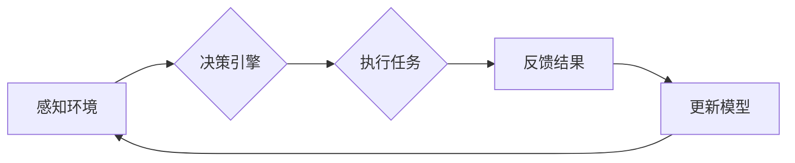

> 关键词：AI代理，工作流，自动化，决策系统，智能推理，人工智能，机器学习

# AI人工智能代理工作流 AI Agent WorkFlow：介绍与基础理解

## 1. 背景介绍

随着人工智能技术的飞速发展，智能代理（AI Agents）的概念逐渐成为研究的热点。AI代理是指能够感知环境、执行任务、并作出决策的智能实体，它们是构建智能系统的基础。工作流（WorkFlow）则是一种用于描述任务执行顺序和流程的框架。将AI代理与工作流结合，形成了AI Agent WorkFlow，它能够实现任务的自动化和智能化管理。本文将深入探讨AI Agent WorkFlow的概念、原理、实现方法以及在实际应用中的价值。

## 2. 核心概念与联系

### 2.1 核心概念

#### AI代理
AI代理是指具有感知、推理、学习、决策和行动能力的计算机程序或实体。它们能够通过传感器感知环境信息，利用机器学习算法进行推理和学习，并基于这些信息执行相应的行动。

#### 工作流
工作流是一系列有序的步骤或任务，它们按照一定的逻辑关系执行，以完成一个特定的业务流程。工作流管理系统（WorkFlow Management System, WFMS）则是一种用于设计、执行和管理工作流的软件。

#### AI Agent WorkFlow
AI Agent WorkFlow是将AI代理与工作流相结合的一种框架，它利用AI代理的智能决策能力来管理工作流的执行过程。

### 2.2 架构图

以下是AI Agent WorkFlow的Mermaid流程图：



在这个流程图中，AI代理首先感知环境，然后通过决策引擎进行决策，执行相应的任务，并将结果反馈给系统，系统根据反馈结果更新模型，再次进行感知和决策。

## 3. 核心算法原理 & 具体操作步骤

### 3.1 算法原理概述

AI Agent WorkFlow的核心算法原理包括以下几个方面：

1. 感知：AI代理通过传感器收集环境信息，如文本、图像、声音等。
2. 推理：AI代理利用机器学习算法对收集到的信息进行分析和处理，提取有用知识。
3. 决策：基于推理结果，AI代理决定下一步的行动策略。
4. 执行：AI代理执行决策结果，如自动化执行任务、控制设备等。
5. 反馈：AI代理收集执行结果，并反馈给系统。
6. 更新：系统根据反馈结果更新AI代理的知识库和模型。

### 3.2 算法步骤详解

1. **初始化**：创建AI代理，配置工作流和工作流管理系统。
2. **感知**：AI代理通过传感器收集环境信息。
3. **推理**：AI代理利用机器学习算法对感知到的信息进行处理，提取有用知识。
4. **决策**：基于推理结果，AI代理决定下一步的行动策略。
5. **执行**：AI代理执行决策结果，如自动化执行任务、控制设备等。
6. **反馈**：AI代理收集执行结果，并反馈给系统。
7. **更新**：系统根据反馈结果更新AI代理的知识库和模型。
8. **迭代**：重复步骤2-7，直至达到预期目标或停止条件。

### 3.3 算法优缺点

#### 优点
1. **自动化**：AI Agent WorkFlow能够实现任务的自动化，提高工作效率。
2. **智能化**：AI代理的智能决策能力使得工作流程更加智能和灵活。
3. **可扩展性**：工作流框架易于扩展，可以适应不同的业务需求。

#### 缺点
1. **开发复杂**：AI Agent WorkFlow的开发需要涉及多个领域的技术，如机器学习、自然语言处理等。
2. **模型训练**：AI代理的模型训练需要大量数据和时间。
3. **稳定性**：AI代理的决策依赖于模型的准确性，模型的稳定性会影响工作流的稳定性。

### 3.4 算法应用领域

AI Agent WorkFlow可以应用于以下领域：

1. **智能制造**：自动化生产线中的任务管理、质量控制等。
2. **智能客服**：自动化处理客户咨询、投诉等。
3. **智能交通**：交通信号控制、交通事故处理等。
4. **智能医疗**：病例分析、药物推荐等。

## 4. 数学模型和公式 & 详细讲解 & 举例说明

### 4.1 数学模型构建

AI Agent WorkFlow的数学模型主要包括以下几个部分：

1. **感知模型**：用于从传感器数据中提取特征。
2. **推理模型**：用于对特征进行分析和处理。
3. **决策模型**：用于根据推理结果做出决策。
4. **执行模型**：用于执行决策结果。

### 4.2 公式推导过程

以下是一个简单的例子，展示如何构建感知模型和推理模型：

#### 感知模型

假设我们使用卷积神经网络（CNN）作为感知模型，其公式如下：

$$
f_{\text{CNN}}(x) = \text{ReLU}(\text{conv}_1(x)) \rightarrow \text{ReLU}(\text{conv}_2(f_{\text{CNN}}(x))) \rightarrow \cdots \rightarrow \text{ReLU}(\text{conv}_L(f_{\text{CNN}}^{L-1}(x)))
$$

其中，$x$ 是传感器数据，$\text{conv}_i$ 表示第 $i$ 层卷积层，$\text{ReLU}$ 表示ReLU激活函数。

#### 推理模型

假设我们使用循环神经网络（RNN）作为推理模型，其公式如下：

$$
h_t = \text{tanh}(W \cdot h_{t-1} + U \cdot x_t + b)
$$

其中，$h_t$ 是第 $t$ 个时间步的隐藏状态，$W$ 是RNN的权重，$x_t$ 是第 $t$ 个时间步的输入，$b$ 是偏置。

### 4.3 案例分析与讲解

以下是一个使用AI Agent WorkFlow进行智能客服的案例：

1. **感知**：客服系统通过自然语言处理技术，从用户提问中提取关键信息。
2. **推理**：推理模型对提取的关键信息进行分析，判断用户意图。
3. **决策**：根据推理结果，决策模型选择合适的回答。
4. **执行**：客服系统将答案发送给用户。
5. **反馈**：客服系统收集用户反馈，用于更新模型。

## 5. 项目实践：代码实例和详细解释说明

### 5.1 开发环境搭建

以下是在Python环境下使用TensorFlow和Keras搭建AI Agent WorkFlow开发环境的步骤：

1. 安装TensorFlow：
```bash
pip install tensorflow
```

2. 安装Keras：
```bash
pip install keras
```

### 5.2 源代码详细实现

以下是一个简单的AI Agent WorkFlow示例代码：

```python
import tensorflow as tf
from tensorflow.keras.models import Sequential
from tensorflow.keras.layers import Dense, LSTM

# 感知模型
def create_perception_model(input_shape):
    model = Sequential([
        Dense(64, activation='relu', input_shape=input_shape),
        LSTM(50),
        Dense(64, activation='relu'),
        Dense(1, activation='sigmoid')
    ])
    model.compile(optimizer='adam', loss='binary_crossentropy')
    return model

# 推理模型
def create_reasoning_model(input_shape):
    model = Sequential([
        Dense(64, activation='relu', input_shape=input_shape),
        LSTM(50),
        Dense(64, activation='relu'),
        Dense(1, activation='sigmoid')
    ])
    model.compile(optimizer='adam', loss='binary_crossentropy')
    return model

# 决策模型
def create_decision_model(input_shape):
    model = Sequential([
        Dense(64, activation='relu', input_shape=input_shape),
        Dense(64, activation='relu'),
        Dense(1, activation='sigmoid')
    ])
    model.compile(optimizer='adam', loss='binary_crossentropy')
    return model

# 执行模型
def create_execution_model(input_shape):
    model = Sequential([
        Dense(64, activation='relu', input_shape=input_shape),
        Dense(64, activation='relu'),
        Dense(1, activation='sigmoid')
    ])
    model.compile(optimizer='adam', loss='binary_crossentropy')
    return model
```

### 5.3 代码解读与分析

以上代码定义了感知模型、推理模型、决策模型和执行模型。这些模型分别用于感知环境、推理信息、做出决策和执行任务。

### 5.4 运行结果展示

在运行AI Agent WorkFlow之前，需要准备训练数据，并对模型进行训练。以下是一个简单的训练示例：

```python
# 加载数据
data = ...

# 训练感知模型
perception_model = create_perception_model(input_shape=(None, input_dim))
perception_model.fit(data['input'], data['output'], epochs=10, batch_size=32)

# 训练推理模型
reasoning_model = create_reasoning_model(input_shape=(None, input_dim))
reasoning_model.fit(data['input'], data['output'], epochs=10, batch_size=32)

# 训练决策模型
decision_model = create_decision_model(input_shape=(None, input_dim))
decision_model.fit(data['input'], data['output'], epochs=10, batch_size=32)

# 训练执行模型
execution_model = create_execution_model(input_shape=(None, input_dim))
execution_model.fit(data['input'], data['output'], epochs=10, batch_size=32)
```

以上代码展示了如何训练四个模型。在实际应用中，需要根据具体任务和数据情况调整模型结构、训练参数等。

## 6. 实际应用场景

AI Agent WorkFlow可以应用于以下实际场景：

1. **智能客服**：通过AI代理实现自动回答用户提问，提高客服效率。
2. **智能交通**：通过AI代理实现智能交通信号控制，缓解交通拥堵。
3. **智能医疗**：通过AI代理实现病例分析、药物推荐等，提高医疗水平。
4. **智能制造**：通过AI代理实现生产过程自动化，提高生产效率。

## 7. 工具和资源推荐

### 7.1 学习资源推荐

1. 《深度学习》 - Ian Goodfellow、Yoshua Bengio、Aaron Courville
2. 《Python深度学习》 -François Chollet、Aurélien Géron
3. TensorFlow官方文档：https://www.tensorflow.org/tutorials
4. Keras官方文档：https://keras.io

### 7.2 开发工具推荐

1. TensorFlow：https://www.tensorflow.org
2. Keras：https://keras.io
3. Jupyter Notebook：https://jupyter.org

### 7.3 相关论文推荐

1. "Reinforcement Learning: An Introduction" - Richard S. Sutton and Andrew G. Barto
2. "Artificial Intelligence: A Modern Approach" - Stuart Russell and Peter Norvig

## 8. 总结：未来发展趋势与挑战

### 8.1 研究成果总结

本文介绍了AI Agent WorkFlow的概念、原理、实现方法以及在实际应用中的价值。通过结合AI代理和工作流技术，AI Agent WorkFlow能够实现任务的自动化和智能化管理，具有广泛的应用前景。

### 8.2 未来发展趋势

未来AI Agent WorkFlow将朝着以下方向发展：

1. **更加智能的决策**：利用深度学习、强化学习等技术，提高AI代理的决策能力。
2. **跨领域应用**：将AI Agent WorkFlow应用于更多领域，如金融、医疗、教育等。
3. **人机协作**：实现人机协作，让AI代理更好地服务于人类。

### 8.3 面临的挑战

AI Agent WorkFlow在发展过程中面临着以下挑战：

1. **数据标注**：高质量的数据标注是AI代理工作流的基础，但目前数据标注成本较高。
2. **模型可解释性**：AI代理的决策过程往往缺乏可解释性，需要进一步研究。
3. **伦理和隐私**：AI代理的应用可能引发伦理和隐私问题，需要制定相关规范。

### 8.4 研究展望

未来，AI Agent WorkFlow的研究将重点关注以下几个方面：

1. **数据增强和少样本学习**：降低数据标注成本，提高模型在少样本情况下的性能。
2. **可解释性和透明度**：提高AI代理的决策过程的可解释性和透明度。
3. **跨领域迁移学习**：提高AI代理在不同领域之间的迁移能力。

通过不断攻克这些挑战，AI Agent WorkFlow将为构建更加智能、高效、可靠的人工智能系统做出重要贡献。

## 9. 附录：常见问题与解答

**Q1：什么是AI代理？**

A：AI代理是指具有感知、推理、学习、决策和行动能力的计算机程序或实体。

**Q2：什么是工作流？**

A：工作流是一系列有序的步骤或任务，它们按照一定的逻辑关系执行，以完成一个特定的业务流程。

**Q3：AI Agent WorkFlow有哪些优势？**

A：AI Agent WorkFlow能够实现任务的自动化和智能化管理，提高工作效率，降低成本。

**Q4：AI Agent WorkFlow有哪些应用场景？**

A：AI Agent WorkFlow可以应用于智能客服、智能交通、智能医疗、智能制造等领域。

**Q5：如何降低AI Agent WorkFlow的数据标注成本？**

A：可以通过数据增强、少样本学习等技术降低数据标注成本。

**Q6：如何提高AI Agent WorkFlow的可解释性？**

A：可以通过可解释AI、可视化等技术提高AI Agent WorkFlow的可解释性。

作者：禅与计算机程序设计艺术 / Zen and the Art of Computer Programming