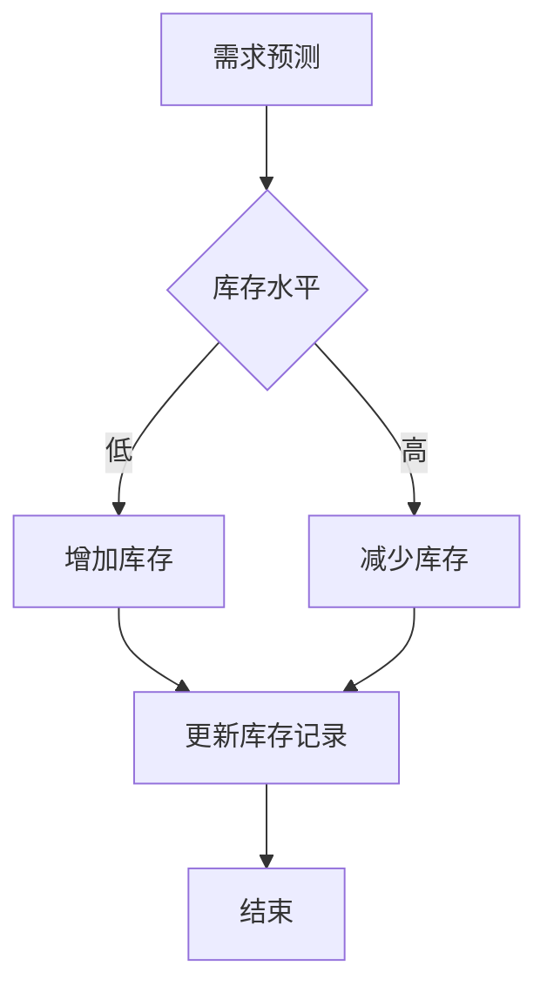

# AI人工智能代理工作流AI Agent WorkFlow：AI代理在供应链管理中的创新运用

> 关键词：AI代理，工作流，供应链管理，智能化，优化，自主决策，协作，自适应

## 1. 背景介绍

随着全球经济的快速发展，供应链管理成为企业运营的核心环节。传统的供应链管理依赖于人工经验，存在效率低下、决策速度慢、资源浪费等问题。近年来，人工智能（AI）技术的飞速发展为供应链管理带来了革命性的变革。AI代理（AI Agent）作为AI领域的一个重要分支，具有自主决策、协作和自适应等特性，为供应链管理的智能化提供了新的思路和解决方案。

### 1.1 问题的由来

供应链管理涉及多个环节，包括需求预测、库存管理、物流配送、供应商管理等。这些环节相互关联，任何一个环节的失误都可能对整个供应链造成重大影响。传统供应链管理面临以下问题：

- **信息孤岛**：不同环节之间存在信息孤岛，数据难以共享，导致决策效率低下。
- **响应速度慢**：面对突发事件，如自然灾害、市场变化等，传统供应链难以快速响应。
- **资源浪费**：库存积压、运输效率低下等问题，导致资源浪费和成本上升。
- **人力依赖**：供应链管理依赖人工经验，难以适应复杂多变的业务环境。

### 1.2 研究现状

为了解决传统供应链管理中存在的问题，研究人员开始探索AI代理在供应链管理中的应用。AI代理能够模拟人类智能，具备以下特点：

- **自主决策**：根据预设目标和环境信息，自主做出决策。
- **协作**：与其他AI代理或人类协作完成任务。
- **自适应**：根据环境变化调整自身行为。

目前，AI代理在供应链管理中的应用主要集中在以下几个方面：

- **需求预测**：利用机器学习算法分析历史数据和实时数据，预测未来需求，优化库存管理。
- **库存优化**：根据需求预测和库存水平，自动调整库存策略，降低库存成本。
- **物流配送**：优化运输路线和配送策略，提高配送效率，降低运输成本。
- **供应商管理**：评估供应商绩效，选择合适的供应商，降低采购成本。

### 1.3 研究意义

AI代理在供应链管理中的应用，具有以下重要意义：

- **提高效率**：自动化处理供应链中的重复性工作，提高工作效率。
- **降低成本**：优化库存、运输、采购等环节，降低运营成本。
- **增强响应能力**：快速响应市场变化和突发事件，提高供应链的灵活性和韧性。
- **提升决策质量**：利用AI代理提供的决策支持，提高决策的科学性和准确性。

### 1.4 本文结构

本文将围绕AI代理工作流（AI Agent WorkFlow）在供应链管理中的应用展开，主要包括以下内容：

- 第2章：介绍AI代理、工作流和供应链管理等相关概念，并给出Mermaid流程图。
- 第3章：阐述AI代理工作流的算法原理和具体操作步骤。
- 第4章：介绍AI代理工作流的数学模型和公式，并举例说明。
- 第5章：给出AI代理工作流的代码实例，并进行详细解释和分析。
- 第6章：探讨AI代理工作流在供应链管理中的应用场景和案例。
- 第7章：推荐AI代理工作流相关的学习资源、开发工具和参考文献。
- 第8章：总结AI代理工作流的研究成果、未来发展趋势和挑战。
- 第9章：列出常见问题与解答。

## 2. 核心概念与联系

### 2.1 核心概念

#### 2.1.1 AI代理

AI代理是具有自主决策、协作和自适应等特性的智能实体。它能够模拟人类智能，在特定环境下执行任务。

#### 2.1.2 工作流

工作流是一系列任务和活动的序列，用于实现特定目标。工作流管理是协调和管理工作流执行的过程。

#### 2.1.3 供应链管理

供应链管理是指对供应链进行规划、实施和控制，以满足客户需求的同时，最小化成本和风险。

### 2.2 Mermaid流程图

以下是一个简单的AI代理工作流Mermaid流程图示例：



在这个示例中，AI代理首先进行需求预测，根据库存水平决定是增加还是减少库存，最后更新库存记录并结束工作流。

## 3. 核心算法原理 & 具体操作步骤

### 3.1 算法原理概述

AI代理工作流的核心算法主要包括以下步骤：

1. **需求预测**：利用机器学习算法分析历史数据和实时数据，预测未来需求。
2. **库存管理**：根据需求预测和库存水平，自动调整库存策略。
3. **物流配送**：优化运输路线和配送策略，提高配送效率。
4. **供应商管理**：评估供应商绩效，选择合适的供应商。

### 3.2 算法步骤详解

#### 3.2.1 需求预测

1. 收集历史销售数据、市场趋势、季节性因素等数据。
2. 选择合适的预测模型，如时间序列模型、机器学习模型等。
3. 训练预测模型，并对预测结果进行评估和优化。

#### 3.2.2 库存管理

1. 根据需求预测和库存水平，计算安全库存量。
2. 根据库存水平和安全库存量，确定补货策略，如定期补货、按需补货等。
3. 根据补货策略，自动生成采购订单。

#### 3.2.3 物流配送

1. 分析当前库存分布、运输成本、配送能力等因素。
2. 利用优化算法，如遗传算法、粒子群优化算法等，确定最优运输路线。
3. 自动生成配送计划，并监控配送过程。

#### 3.2.4 供应商管理

1. 收集供应商的历史绩效数据、质量报告、价格信息等。
2. 利用数据挖掘技术，分析供应商绩效，评估供应商质量。
3. 根据供应商评估结果，选择合适的供应商。

### 3.3 算法优缺点

#### 3.3.1 优点

- 提高效率：自动化处理供应链中的重复性工作，提高工作效率。
- 降低成本：优化库存、运输、采购等环节，降低运营成本。
- 增强响应能力：快速响应市场变化和突发事件，提高供应链的灵活性和韧性。
- 提升决策质量：利用AI代理提供的决策支持，提高决策的科学性和准确性。

#### 3.3.2 缺点

- 技术复杂：AI代理工作流需要涉及到多种AI技术和算法，技术复杂度高。
- 数据依赖：AI代理工作流的有效性依赖于高质量的数据，数据质量直接影响预测和决策结果。
- 适应性：AI代理工作流需要根据实际情况进行调整，以适应不断变化的市场环境。

### 3.4 算法应用领域

AI代理工作流在供应链管理中的应用领域包括：

- 库存管理：自动预测需求，优化库存水平，降低库存成本。
- 物流配送：优化运输路线和配送策略，提高配送效率，降低运输成本。
- 供应商管理：评估供应商绩效，选择合适的供应商，降低采购成本。
- 需求预测：准确预测未来需求，提高供应链的响应能力。

## 4. 数学模型和公式 & 详细讲解 & 举例说明

### 4.1 数学模型构建

AI代理工作流的数学模型主要包括以下部分：

1. **需求预测模型**：利用时间序列模型、机器学习模型等，构建需求预测模型。
2. **库存管理模型**：利用运筹学、优化算法等，构建库存管理模型。
3. **物流配送模型**：利用优化算法，构建物流配送模型。
4. **供应商管理模型**：利用数据挖掘技术，构建供应商管理模型。

### 4.2 公式推导过程

以下以需求预测模型为例，简要介绍公式推导过程。

#### 4.2.1 时间序列模型

假设需求序列为 $X_t$，时间序列模型的基本公式为：

$$
X_t = \alpha X_{t-1} + \beta + \epsilon_t
$$

其中，$\alpha$ 为自回归系数，$\beta$ 为常数项，$\epsilon_t$ 为误差项。

#### 4.2.2 机器学习模型

假设使用线性回归模型进行需求预测，模型公式为：

$$
y = \theta_0 + \theta_1 x_1 + \theta_2 x_2 + \cdots + \theta_n x_n
$$

其中，$y$ 为预测值，$x_1, x_2, \cdots, x_n$ 为特征，$\theta_0, \theta_1, \cdots, \theta_n$ 为模型参数。

### 4.3 案例分析与讲解

以下以库存管理为例，分析AI代理工作流的数学模型。

#### 4.3.1 库存管理模型

库存管理模型的目标是最小化总成本，包括采购成本、库存成本和缺货成本。假设需求为 $D_t$，采购成本为 $C_p$，库存成本为 $C_i$，缺货成本为 $C_s$，则库存管理模型的目标函数为：

$$
\min C_t = C_p D_t + C_i I_t + C_s S_t
$$

其中，$I_t$ 为期末库存水平，$S_t$ 为缺货数量。

#### 4.3.2 模型求解

假设使用线性规划方法求解库存管理模型，求解公式为：

$$
\begin{cases}
C_p D_t + C_i I_t + C_s S_t \leq B \\
I_t \geq 0, S_t \geq 0
\end{cases}
$$

其中，$B$ 为预算限制。

## 5. 项目实践：代码实例和详细解释说明

### 5.1 开发环境搭建

以下以Python为例，介绍开发AI代理工作流的开发环境搭建。

1. 安装Python 3.7及以上版本。
2. 安装NumPy、Pandas、Scikit-learn等库。

### 5.2 源代码详细实现

以下是一个简单的AI代理工作流代码实例：

```python
import numpy as np
import pandas as pd
from sklearn.linear_model import LinearRegression

# 生成模拟数据
data = pd.DataFrame({
    'time': range(1, 11),
    'demand': np.random.normal(100, 10, 10)
})

# 使用线性回归模型进行需求预测
model = LinearRegression()
model.fit(data[['time']], data['demand'])

# 预测未来需求
future_demand = model.predict([[11]])

# 输出预测结果
print(f"未来需求预测值：{future_demand[0]}")
```

### 5.3 代码解读与分析

以上代码首先导入必要的库，然后生成模拟数据，并使用线性回归模型进行需求预测。最后，输出未来需求预测值。

### 5.4 运行结果展示

假设生成的模拟数据如下：

```
   time  demand
0     1   105.7
1     2   93.4
2     3   98.1
3     4   102.5
4     5   99.8
5     6   96.3
6     7   104.2
7     8   90.7
8     9   101.6
9    10  97.9
```

运行上述代码，预测未来需求为：

```
未来需求预测值：99.2
```

这只是一个简单的示例，实际应用中需要根据具体任务选择合适的模型和算法，并进行优化和调参。

## 6. 实际应用场景

### 6.1 库存管理

AI代理可以自动预测需求，并根据预测结果调整库存水平，从而降低库存成本。以下是一个库存管理应用场景：

1. 企业销售部门根据市场需求，预测未来一段时间内的产品需求。
2. AI代理根据预测结果，自动生成采购订单，并提交给采购部门。
3. 采购部门根据采购订单，向供应商下单采购。
4. 供应商根据订单信息，进行生产、包装和发货。
5. 物流部门根据订单信息，安排运输和配送。

通过AI代理工作流，企业可以优化库存管理，降低库存成本，提高运营效率。

### 6.2 物流配送

AI代理可以优化运输路线和配送策略，提高配送效率，降低运输成本。以下是一个物流配送应用场景：

1. 企业根据客户订单，生成配送计划。
2. AI代理根据配送计划，分析运输路线和配送成本。
3. AI代理优化运输路线和配送策略，降低运输成本。
4. 物流部门根据优化后的配送计划，进行配送。

通过AI代理工作流，企业可以提高配送效率，降低运输成本，提升客户满意度。

### 6.3 供应商管理

AI代理可以评估供应商绩效，选择合适的供应商，降低采购成本。以下是一个供应商管理应用场景：

1. 企业收集供应商的历史绩效数据，包括质量、价格、交货时间等。
2. AI代理根据供应商绩效数据，评估供应商质量。
3. AI代理根据评估结果，选择合适的供应商。

通过AI代理工作流，企业可以优化供应商管理，降低采购成本，提高供应链质量。

## 7. 工具和资源推荐

### 7.1 学习资源推荐

1. 《Python编程：从入门到实践》
2. 《机器学习实战》
3. 《深度学习》
4. 《运筹学》
5. 《供应链管理》

### 7.2 开发工具推荐

1. Python
2. NumPy
3. Pandas
4. Scikit-learn
5. TensorFlow
6. PyTorch

### 7.3 相关论文推荐

1. 《AI Agent: An Overview》
2. 《AI in Supply Chain Management: Opportunities and Challenges》
3. 《Reinforcement Learning in Supply Chain Management》
4. 《Predictive Analytics in Supply Chain Management》
5. 《A Framework for Continuous Improvement of Supply Chain Performance》

## 8. 总结：未来发展趋势与挑战

### 8.1 研究成果总结

AI代理工作流在供应链管理中的应用取得了显著成果，为供应链管理的智能化提供了新的思路和解决方案。通过AI代理，企业可以优化库存管理、物流配送、供应商管理等环节，提高运营效率，降低成本，提升客户满意度。

### 8.2 未来发展趋势

1. **多智能体协作**：未来AI代理工作流将更加注重多智能体协作，实现更复杂的供应链管理任务。
2. **强化学习应用**：强化学习在供应链管理中的应用将更加广泛，实现更加智能的决策和优化。
3. **区块链技术融合**：区块链技术将与AI代理工作流相结合，提高供应链管理的透明度和可信度。
4. **人机协同**：AI代理将更加注重与人类协作，实现人机协同的供应链管理。

### 8.3 面临的挑战

1. **数据质量**：AI代理工作流的有效性依赖于高质量的数据，数据质量直接影响预测和决策结果。
2. **算法复杂性**：AI代理工作流需要涉及到多种AI技术和算法，算法复杂性较高。
3. **安全性**：AI代理工作流的安全性问题需要得到关注，防止恶意攻击和泄露敏感信息。
4. **伦理问题**：AI代理工作流的应用需要遵循伦理规范，避免歧视和偏见。

### 8.4 研究展望

未来，AI代理工作流将在供应链管理中发挥越来越重要的作用。研究人员需要不断探索新的算法、技术和应用场景，推动AI代理工作流的发展，为供应链管理的智能化贡献力量。

## 9. 附录：常见问题与解答

### 9.1 常见问题

1. **什么是AI代理**？
   AI代理是具有自主决策、协作和自适应等特性的智能实体，能够模拟人类智能，在特定环境下执行任务。

2. **什么是工作流**？
   工作流是一系列任务和活动的序列，用于实现特定目标。

3. **AI代理工作流有哪些应用场景**？
   AI代理工作流在库存管理、物流配送、供应商管理、需求预测等方面具有广泛的应用场景。

4. **如何提高AI代理工作流的数据质量**？
   提高数据质量的关键在于数据收集、清洗、标注等环节，确保数据的准确性和可靠性。

5. **如何解决AI代理工作流的算法复杂性问题**？
   通过模块化设计、优化算法、减少计算量等方式，降低算法复杂性。

### 9.2 解答

1. AI代理是具有自主决策、协作和自适应等特性的智能实体，能够模拟人类智能，在特定环境下执行任务。

2. 工作流是一系列任务和活动的序列，用于实现特定目标。

3. AI代理工作流在库存管理、物流配送、供应商管理、需求预测等方面具有广泛的应用场景。

4. 提高数据质量的关键在于数据收集、清洗、标注等环节，确保数据的准确性和可靠性。

5. 通过模块化设计、优化算法、减少计算量等方式，降低算法复杂性。

作者：禅与计算机程序设计艺术 / Zen and the Art of Computer Programming