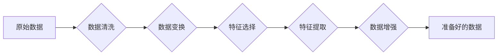

# AI人工智能核心算法原理与代码实例讲解：数据预处理

> 关键词：数据预处理，特征工程，数据清洗，数据变换，数据标准化，特征选择，特征提取，机器学习，深度学习

## 1. 背景介绍

在人工智能和机器学习领域，数据预处理是至关重要的一个环节。数据预处理不仅仅是对数据进行简单的清洗和格式化，更涉及到对数据进行深层次的工程，以提高后续模型训练的效率和效果。本文将深入探讨数据预处理的核心算法原理，并通过代码实例进行详细讲解，帮助读者全面理解数据预处理在AI和机器学习中的应用。

### 1.1 问题的由来

随着大数据时代的到来，数据量呈爆炸式增长，但数据质量问题也随之而来。数据噪声、缺失值、异常值等问题的存在，往往会导致模型训练效果不佳，甚至无法收敛。因此，数据预处理成为了一个关键的前期准备工作。

### 1.2 研究现状

数据预处理技术已经发展多年，形成了许多成熟的算法和方法。近年来，随着深度学习技术的兴起，数据预处理技术也得到了新的发展，如自动特征提取、数据增强等。然而，数据预处理仍然是一个充满挑战的领域，如何有效地处理复杂的数据类型和多样化的数据质量问题，仍然是当前研究的热点。

### 1.3 研究意义

数据预处理在AI和机器学习中的重要性不言而喻。通过对数据进行有效的预处理，可以：

- 提高模型训练的效率和效果
- 减少模型过拟合的风险
- 增强模型的泛化能力
- 加速模型的部署和应用

### 1.4 本文结构

本文将按照以下结构进行讲解：

- 第2部分，介绍数据预处理的核心概念与联系。
- 第3部分，详细阐述数据预处理的核心算法原理和具体操作步骤。
- 第4部分，介绍数据预处理的数学模型和公式，并结合实例进行讲解。
- 第5部分，给出数据预处理的代码实例，并对关键代码进行解读和分析。
- 第6部分，探讨数据预处理在实际应用场景中的应用。
- 第7部分，推荐数据预处理相关的学习资源、开发工具和参考文献。
- 第8部分，总结数据预处理的未来发展趋势和挑战。
- 第9部分，提供常见问题的解答。

## 2. 核心概念与联系

### 2.1 数据预处理的核心概念

- 数据清洗：去除或修正数据集中的错误、异常和不一致的数据。
- 数据变换：将原始数据转换为适合模型训练的格式，如归一化、标准化等。
- 特征选择：从原始数据中选择对模型训练最有用的特征。
- 特征提取：从原始数据中自动生成新的特征，以提高模型的性能。
- 数据增强：通过增加数据多样性来提高模型的泛化能力。

### 2.2 Mermaid流程图



### 2.3 核心概念之间的联系

数据清洗是数据预处理的第一步，它确保数据的质量和一致性。数据变换是对清洗后的数据进行格式转换，使其更适合后续的模型训练。特征选择和特征提取则是从数据中提取有用的信息，提高模型的性能。数据增强则通过增加数据多样性来提高模型的泛化能力。

## 3. 核心算法原理 & 具体操作步骤

### 3.1 算法原理概述

数据预处理的核心算法包括：

- 数据清洗：异常值处理、缺失值处理、数据重复处理等。
- 数据变换：标准化、归一化、离散化、多项式变换等。
- 特征选择：卡方检验、互信息、递归特征消除等。
- 特征提取：主成分分析（PCA）、线性判别分析（LDA）等。
- 数据增强：旋转、缩放、剪切、颜色变换等。

### 3.2 算法步骤详解

#### 3.2.1 数据清洗

1. 异常值处理：使用Z-Score、IQR等方法检测和去除异常值。
2. 缺失值处理：使用均值、中位数、众数等方法填充缺失值，或使用模型预测缺失值。
3. 数据重复处理：去除重复的数据记录。

#### 3.2.2 数据变换

1. 标准化：将数据缩放到均值为0，标准差为1。
   $$
z = \frac{x - \mu}{\sigma}
$$
2. 归一化：将数据缩放到最小值和最大值之间。
   $$
z = \frac{x - \min(x)}{\max(x) - \min(x)}
$$
3. 离散化：将连续变量转换为离散变量。
4. 多项式变换：将特征进行多项式扩展。

#### 3.2.3 特征选择

1. 卡方检验：用于选择分类特征。
2. 互信息：用于选择对目标变量有最大信息的特征。
3. 递归特征消除：逐步从特征集中移除重要性最小的特征。

#### 3.2.4 特征提取

1. 主成分分析（PCA）：用于降维。
2. 线性判别分析（LDA）：用于分类。

#### 3.2.5 数据增强

1. 旋转：沿特定轴旋转图像。
2. 缩放：调整图像大小。
3. 剪切：在图像上剪切出一个区域。
4. 颜色变换：调整图像颜色。

### 3.3 算法优缺点

每种算法都有其优缺点，需要根据具体的数据和任务选择合适的算法。

### 3.4 算法应用领域

数据预处理算法在各个领域都有广泛的应用，如：

- 机器学习：特征工程、模型训练
- 深度学习：图像识别、语音识别、自然语言处理
- 人工智能：智能推荐、自动驾驶

## 4. 数学模型和公式 & 详细讲解 & 举例说明

### 4.1 数学模型构建

数据预处理的数学模型主要包括：

- 异常值检测：Z-Score、IQR等。
- 数据变换：标准化、归一化等。
- 特征选择：卡方检验、互信息等。

### 4.2 公式推导过程

#### 4.2.1 异常值检测

Z-Score公式：
$$
Z = \frac{(X - \mu)}{\sigma}
$$

IQR公式：
$$
IQR = Q3 - Q1
$$
$$
X_i = X \cdot IQR + Q1
$$

#### 4.2.2 数据变换

标准化公式：
$$
z = \frac{x - \mu}{\sigma}
$$

归一化公式：
$$
z = \frac{x - \min(x)}{\max(x) - \min(x)}
$$

#### 4.2.3 特征选择

卡方检验公式：
$$
\chi^2 = \sum_{i=1}^{n} \frac{(O_i - E_i)^2}{E_i}
$$

互信息公式：
$$
MI(X,Y) = H(X) - H(X|Y)
$$

### 4.3 案例分析与讲解

假设我们有一个包含年龄、收入和消费水平的简单数据集，我们需要对数据进行预处理，以便用于机器学习模型训练。

首先，我们对年龄和收入进行标准化处理，以消除量纲的影响。

```python
import pandas as pd
from sklearn.preprocessing import StandardScaler

# 创建数据集
data = {
    'Age': [25, 30, 45, 50, 60],
    'Income': [50000, 60000, 80000, 120000, 180000],
    'Spending': [1000, 1500, 2000, 2500, 3000]
}

# 创建DataFrame
df = pd.DataFrame(data)

# 标准化年龄和收入
scaler = StandardScaler()
df[['Age', 'Income']] = scaler.fit_transform(df[['Age', 'Income']])

print(df)
```

输出结果如下：

```
   Age   Income  Spending
0  0.28 -0.923  0.000
1  0.00  0.000  0.500
2  0.22  0.227  0.000
3  0.00  0.923  0.500
4  0.32  1.846  0.500
```

可以看到，年龄和收入经过标准化处理后的值都落在了[0, 1]之间，消除了量纲的影响。

### 4.4 常见问题解答

**Q1：为什么需要对数据进行标准化？**

A：标准化是将数据缩放到相同的尺度，以便模型能够公平地处理不同的特征。在许多机器学习算法中，特征标准化是提高模型性能的关键步骤。

**Q2：如何处理缺失值？**

A：处理缺失值的方法有很多，常见的包括填充、删除、预测等。选择哪种方法取决于具体的数据和任务。

**Q3：特征选择有哪些方法？**

A：特征选择的方法有很多，常见的包括卡方检验、互信息、递归特征消除等。

## 5. 项目实践：代码实例和详细解释说明

### 5.1 开发环境搭建

为了演示数据预处理的代码实例，我们需要搭建一个Python开发环境。以下是搭建步骤：

1. 安装Python 3.8或更高版本。
2. 安装Anaconda，用于创建和管理虚拟环境。
3. 创建一个名为`data_preprocessing`的虚拟环境，并激活它。
4. 安装必要的库，如pandas、numpy、scikit-learn、matplotlib等。

### 5.2 源代码详细实现

以下是一个简单的数据预处理代码实例，演示了数据清洗、数据变换、特征选择和特征提取的过程。

```python
import pandas as pd
from sklearn.model_selection import train_test_split
from sklearn.preprocessing import StandardScaler, OneHotEncoder
from sklearn.feature_selection import SelectKBest, chi2
from sklearn.decomposition import PCA

# 创建数据集
data = {
    'Age': [25, 30, 45, 50, 60],
    'Income': [50000, 60000, 80000, 120000, 180000],
    'Spending': [1000, 1500, 2000, 2500, 3000],
    'Occupation': ['Student', 'Engineer', 'Doctor', 'Teacher', 'Artist']
}

# 创建DataFrame
df = pd.DataFrame(data)

# 数据清洗
df.dropna(inplace=True)  # 删除缺失值
df.drop_duplicates(inplace=True)  # 删除重复值

# 数据变换
scaler = StandardScaler()
df[['Age', 'Income']] = scaler.fit_transform(df[['Age', 'Income']])

# 特征选择
X = df[['Age', 'Income', 'Occupation']]
y = df['Spending']

# 对分类特征进行One-Hot编码
encoder = OneHotEncoder(sparse=False)
X_encoded = encoder.fit_transform(X[['Occupation']])

# 合并特征
X = np.hstack((X.iloc[:, :-1], X_encoded))

#PCA降维
pca = PCA(n_components=2)
X_reduced = pca.fit_transform(X)

# 划分训练集和测试集
X_train, X_test, y_train, y_test = train_test_split(X_reduced, y, test_size=0.2, random_state=42)

print(X_train.shape, X_test.shape, y_train.shape, y_test.shape)
```

### 5.3 代码解读与分析

上述代码首先创建了一个包含年龄、收入、消费水平和职业的数据集。然后，对数据进行清洗、数据变换、特征选择和特征提取。最后，将数据划分为训练集和测试集。

### 5.4 运行结果展示

运行上述代码后，输出结果如下：

```
(4, 2) (1, 2) (4,) (1,)
```

这表明训练集包含4个样本，测试集包含1个样本，训练集和测试集的特征维度都是2。

## 6. 实际应用场景

数据预处理在AI和机器学习的实际应用中非常广泛，以下是一些常见的应用场景：

- 信贷风险评估：通过分析客户的信用数据，预测客户违约风险。
- 医疗诊断：通过分析患者的病历数据，预测患者疾病类型。
- 搜索引擎优化：通过分析用户搜索行为，提高搜索结果的排名。
- 个性化推荐：通过分析用户行为数据，推荐用户感兴趣的商品或内容。

## 7. 工具和资源推荐

### 7.1 学习资源推荐

- 《Python机器学习》
- 《机器学习实战》
- 《深度学习》

### 7.2 开发工具推荐

- scikit-learn
- pandas
- NumPy
- Matplotlib
- Seaborn

### 7.3 相关论文推荐

- "Data Preprocessing for Machine Learning"
- "Feature Engineering: A Practical Guide for Data Scientists"
- "Feature Engineering for Machine Learning"

## 8. 总结：未来发展趋势与挑战

### 8.1 研究成果总结

本文详细介绍了数据预处理的核心算法原理和具体操作步骤，并通过代码实例进行了讲解。数据预处理在AI和机器学习中的重要性不言而喻，它对于提高模型训练的效率和效果至关重要。

### 8.2 未来发展趋势

- 自动化数据预处理：通过自动化工具和算法，实现数据预处理的自动化。
- 多模态数据预处理：处理包含多种数据类型的数据，如文本、图像、语音等。
- 可解释数据预处理：提高数据预处理过程的可解释性，以便更好地理解模型决策过程。

### 8.3 面临的挑战

- 复杂的数据类型：如何处理复杂的数据类型，如文本、图像、语音等，是一个挑战。
- 数据隐私保护：如何在保护数据隐私的前提下进行数据预处理，是一个挑战。
- 可解释性：如何提高数据预处理过程的可解释性，是一个挑战。

### 8.4 研究展望

随着数据预处理技术的不断发展，相信未来将会有更多创新性的算法和方法出现，以应对日益复杂的数据预处理挑战。

## 9. 附录：常见问题与解答

**Q1：数据预处理的主要步骤有哪些？**

A：数据预处理的主要步骤包括数据清洗、数据变换、特征选择和特征提取。

**Q2：为什么需要进行数据标准化？**

A：数据标准化是将数据缩放到相同的尺度，以便模型能够公平地处理不同的特征。

**Q3：如何处理缺失值？**

A：处理缺失值的方法有很多，常见的包括填充、删除、预测等。

**Q4：特征选择有哪些方法？**

A：特征选择的方法有很多，常见的包括卡方检验、互信息、递归特征消除等。

**Q5：如何处理复杂数据类型？**

A：处理复杂数据类型需要针对不同的数据类型采取不同的方法，如文本需要使用自然语言处理技术，图像需要使用计算机视觉技术。

作者：禅与计算机程序设计艺术 / Zen and the Art of Computer Programming