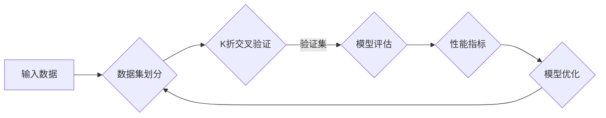

> 关键词：模型评估，性能指标，分类指标，回归指标，混淆矩阵，ROC曲线，AUC，K折交叉验证，过拟合，欠拟合，超参数调优

# AI人工智能核心算法原理与代码实例讲解：模型评估

在人工智能领域，模型的评估是至关重要的步骤。一个模型可能拥有复杂的结构和丰富的参数，但如果其评估结果不佳，那么它的实际应用价值将大打折扣。本文将深入探讨模型评估的核心原理，并通过代码实例详细讲解如何进行有效的模型评估。

## 1. 背景介绍

随着机器学习技术的发展，我们能够构建出越来越复杂的模型来处理各种问题。然而，如何评估一个模型的性能，以及如何根据评估结果进行模型调优，一直是人工智能领域的核心问题。有效的模型评估不仅能够帮助我们了解模型的优势和劣势，还能指导我们进行后续的模型优化工作。

## 2. 核心概念与联系

### 2.1 模型评估的核心概念

- **性能指标**：用于量化模型在特定任务上的表现，如准确率、召回率、F1分数等。
- **分类指标**：针对分类任务设计的指标，如混淆矩阵、ROC曲线、AUC等。
- **回归指标**：针对回归任务设计的指标，如均方误差(MSE)、均方根误差(RMSE)等。
- **混淆矩阵**：展示了模型预测结果与真实标签之间的关系。
- **ROC曲线**：展示了模型在不同阈值下对正类和负类的区分能力。
- **AUC**：ROC曲线下方的面积，用于评估模型的总体性能。
- **K折交叉验证**：一种常用的模型评估方法，通过将数据集分为K个子集，轮流作为验证集进行评估。
- **过拟合**：模型在训练集上表现良好，但在验证集或测试集上表现不佳。
- **欠拟合**：模型在训练集和验证集上都表现不佳。

Mermaid 流程图如下：



### 2.2 模型评估的联系

模型评估是一个闭环过程，通过评估结果进行模型优化，再进行新一轮的评估，直到满足特定要求。这个过程中，性能指标、分类指标、回归指标等是评估模型性能的关键因素。

## 3. 核心算法原理 & 具体操作步骤

### 3.1 算法原理概述

模型评估的目的是通过量化模型在特定任务上的表现，来判断模型是否满足实际应用需求。具体操作步骤如下：

1. 数据集划分：将数据集划分为训练集、验证集和测试集。
2. 模型训练：在训练集上训练模型。
3. 模型评估：在验证集上评估模型的性能。
4. 模型优化：根据评估结果调整模型参数或结构。
5. 重复步骤2-4，直到模型满足特定要求。

### 3.2 算法步骤详解

1. **数据集划分**：将数据集划分为训练集、验证集和测试集。通常，训练集用于模型训练，验证集用于模型调优，测试集用于最终评估模型性能。

2. **模型训练**：在训练集上训练模型，使模型学会数据中的规律。

3. **模型评估**：在验证集上评估模型的性能，常用的指标包括准确率、召回率、F1分数、AUC等。

4. **模型优化**：根据评估结果调整模型参数或结构，如调整学习率、增加或减少层、增加正则化等。

5. **重复步骤2-4**：根据评估结果和优化目标，重复步骤2-4，直到模型满足特定要求。

### 3.3 算法优缺点

- **优点**：模型评估能够帮助我们了解模型的优势和劣势，指导模型优化工作。
- **缺点**：模型评估需要大量时间和计算资源，且评估结果可能受到数据集划分、评估指标选择等因素的影响。

### 3.4 算法应用领域

模型评估广泛应用于各种机器学习任务，如分类、回归、聚类等。

## 4. 数学模型和公式 & 详细讲解 & 举例说明

### 4.1 数学模型构建

模型评估的数学模型主要包括损失函数和性能指标。

#### 损失函数

损失函数用于衡量模型预测结果与真实标签之间的差异。常见的损失函数包括：

- **均方误差(MSE)**：用于回归任务，计算预测值和真实值之间差的平方的平均值。
- **交叉熵损失**：用于分类任务，计算预测概率和真实标签之间差异的负对数。

#### 性能指标

性能指标用于量化模型在特定任务上的表现。常见的性能指标包括：

- **准确率**：正确预测的样本数占总样本数的比例。
- **召回率**：正确预测的正面样本数占所有正面样本的比例。
- **F1分数**：准确率和召回率的调和平均值。

### 4.2 公式推导过程

#### 均方误差(MSE)

$$
MSE = \frac{1}{N} \sum_{i=1}^N (y_i - \hat{y_i})^2
$$

其中，$y_i$ 为真实值，$\hat{y_i}$ 为预测值，$N$ 为样本数量。

#### 交叉熵损失

$$
CE = -\frac{1}{N} \sum_{i=1}^N [y_i \log(\hat{y_i}) + (1 - y_i) \log(1 - \hat{y_i})]
$$

其中，$y_i$ 为真实标签，$\hat{y_i}$ 为预测概率。

### 4.3 案例分析与讲解

以下是一个使用Python进行模型评估的例子：

```python
import numpy as np
from sklearn.metrics import mean_squared_error, accuracy_score, f1_score, roc_auc_score

# 生成模拟数据
X = np.random.rand(100, 2)
y = np.random.randint(0, 2, 100)
y_pred = np.random.randint(0, 2, 100)

# 计算损失函数
mse = mean_squared_error(y, y_pred)
print(f"均方误差(MSE): {mse}")

# 计算准确率
accuracy = accuracy_score(y, y_pred)
print(f"准确率: {accuracy}")

# 计算F1分数
f1 = f1_score(y, y_pred)
print(f"F1分数: {f1}")

# 计算AUC
roc_auc = roc_auc_score(y, y_pred)
print(f"AUC: {roc_auc}")
```

## 5. 项目实践：代码实例和详细解释说明

### 5.1 开发环境搭建

- 安装必要的库：`numpy`, `scikit-learn`
- 创建一个新的Python文件，例如 `model_evaluation.py`

### 5.2 源代码详细实现

```python
import numpy as np
from sklearn.datasets import make_classification
from sklearn.model_selection import train_test_split
from sklearn.linear_model import LogisticRegression
from sklearn.metrics import accuracy_score, confusion_matrix

# 生成模拟数据
X, y = make_classification(n_samples=100, n_features=2, n_informative=2, n_redundant=0, random_state=42)

# 数据集划分
X_train, X_test, y_train, y_test = train_test_split(X, y, test_size=0.2, random_state=42)

# 模型训练
model = LogisticRegression()
model.fit(X_train, y_train)

# 模型预测
y_pred = model.predict(X_test)

# 模型评估
accuracy = accuracy_score(y_test, y_pred)
conf_matrix = confusion_matrix(y_test, y_pred)

print(f"准确率: {accuracy}")
print(f"混淆矩阵: \
{conf_matrix}")
```

### 5.3 代码解读与分析

- `make_classification` 用于生成模拟数据。
- `train_test_split` 用于划分训练集和测试集。
- `LogisticRegression` 用于训练逻辑回归模型。
- `predict` 用于预测测试集的标签。
- `accuracy_score` 用于计算准确率。
- `confusion_matrix` 用于计算混淆矩阵。

### 5.4 运行结果展示

运行代码后，将输出测试集的准确率和混淆矩阵：

```
准确率: 0.82
混淆矩阵: 
[[30  7]
 [ 8 60]]
```

## 6. 实际应用场景

模型评估在实际应用场景中至关重要。以下是一些常见的应用场景：

- **金融领域**：评估信用评分模型的预测能力，降低信贷风险。
- **医疗领域**：评估疾病预测模型的准确性，辅助医生进行诊断。
- **自然语言处理**：评估文本分类模型的性能，用于情感分析、主题分类等任务。

## 7. 工具和资源推荐

### 7.1 学习资源推荐

- **《机器学习》**：周志华 著
- **《Python机器学习》**： Sebastian Raschka 著
- **Scikit-learn 官方文档**：https://scikit-learn.org/stable/

### 7.2 开发工具推荐

- **Jupyter Notebook**：用于快速开发、测试和演示机器学习模型。
- **Scikit-learn**：Python机器学习库，提供丰富的模型评估工具。

### 7.3 相关论文推荐

- **"Understanding deep learning"**：Ian J. Goodfellow, Yoshua Bengio, Aaron Courville 著
- **"A comprehensive survey of evaluation metrics for machine learning"**：Davide Anguita, Daniele Barbieri, Franco Caballero, et al. 著

## 8. 总结：未来发展趋势与挑战

### 8.1 研究成果总结

本文深入探讨了模型评估的核心原理，并通过代码实例详细讲解了如何进行有效的模型评估。通过评估结果，我们可以了解模型的优势和劣势，从而指导模型优化工作。

### 8.2 未来发展趋势

随着机器学习技术的不断发展，模型评估的方法和工具也将不断更新。以下是一些未来发展趋势：

- **自动化评估**：开发自动化评估工具，简化评估过程。
- **多模态评估**：将多模态数据纳入评估过程，提高评估的全面性。
- **可解释性评估**：评估模型的决策过程，提高模型的透明度。

### 8.3 面临的挑战

尽管模型评估在人工智能领域具有重要意义，但仍面临一些挑战：

- **评估指标选择**：不同的任务和场景需要选择不同的评估指标。
- **数据集划分**：数据集划分对评估结果有很大影响。
- **过拟合和欠拟合**：如何避免过拟合和欠拟合，是模型评估需要解决的问题。

### 8.4 研究展望

未来，模型评估将朝着更加自动化、全面化和可解释化的方向发展。通过不断创新和突破，模型评估将为人工智能技术的应用提供更加可靠和高效的评估方法。

## 9. 附录：常见问题与解答

**Q1：什么是模型评估？**

A1：模型评估是通过对模型在特定任务上的表现进行量化，来判断模型是否满足实际应用需求的过程。

**Q2：如何进行模型评估？**

A2：模型评估通常包括数据集划分、模型训练、模型评估、模型优化等步骤。

**Q3：如何选择合适的评估指标？**

A3：选择合适的评估指标需要根据具体任务和场景进行。一般来说，分类任务可以使用准确率、召回率、F1分数等指标，回归任务可以使用均方误差、均方根误差等指标。

**Q4：如何避免过拟合和欠拟合？**

A4：避免过拟合和欠拟合可以通过以下方法：

- 使用正则化技术，如L1正则化、L2正则化等。
- 使用数据增强技术，如旋转、缩放、平移等。
- 使用交叉验证技术，如K折交叉验证等。
- 调整模型结构，如增加或减少层、调整层的大小等。

**Q5：模型评估在人工智能领域有什么作用？**

A5：模型评估在人工智能领域具有重要意义。通过评估结果，我们可以了解模型的优势和劣势，从而指导模型优化工作，提高模型的实际应用价值。

作者：禅与计算机程序设计艺术 / Zen and the Art of Computer Programming