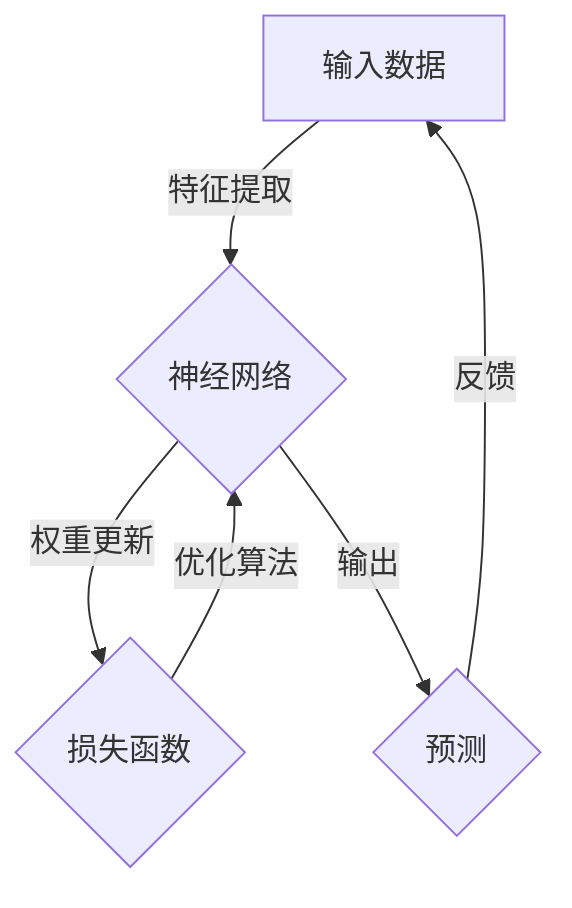

# Andrej Karpathy：人工智能的未来影响

> 关键词：Andrej Karpathy，人工智能，深度学习，自然语言处理，自动驾驶，神经网络，计算机视觉，未来影响

## 1. 背景介绍

在人工智能领域，Andrej Karpathy 是一位杰出的科学家和工程师，以其在深度学习和自然语言处理（NLP）方面的开创性工作而闻名。他的博客和公开演讲为公众提供了对人工智能技术的深入洞察，同时也激发了许多对这一领域的兴趣。本文将探讨 Andrej Karpathy 的工作如何影响了人工智能的未来，并展望这一领域的未来发展趋势。

## 2. 核心概念与联系

### 2.1 核心概念

- **深度学习**：一种机器学习技术，通过多层神经网络模拟人脑处理信息的方式，用于识别模式、图像和声音等。
- **自然语言处理（NLP）**：计算机科学的一个分支，旨在使计算机能够理解、解释和生成人类语言。
- **神经网络**：由相互连接的简单单元组成的计算系统，可以学习复杂的数据模式。
- **计算机视觉**：使计算机能够从图像或视频中提取信息的技术。
- **自动驾驶**：使汽车能够在没有人类司机的情况下行驶的技术。

### 2.2 核心概念原理和架构的 Mermaid 流程图



在这个流程图中，输入数据经过神经网络的特征提取层，然后通过权重更新和损失函数优化算法，最终输出预测结果，并通过反馈进一步优化模型。

## 3. 核心算法原理 & 具体操作步骤

### 3.1 算法原理概述

Andrej Karpathy 的工作主要集中在深度学习和自然语言处理领域。他的核心贡献包括：

- 使用深度神经网络对文本进行建模，使计算机能够理解和生成人类语言。
- 开发用于图像识别的神经网络架构，如 Inception 和 VGG。
- 探索深度学习在自动驾驶和计算机视觉中的应用。

### 3.2 算法步骤详解

- **数据预处理**：清洗和转换数据，使其适合神经网络训练。
- **模型设计**：选择合适的神经网络架构，如卷积神经网络（CNN）或循环神经网络（RNN）。
- **训练**：使用标注数据进行模型训练，调整网络权重以最小化损失函数。
- **评估**：使用测试数据评估模型性能，调整模型参数以优化性能。
- **部署**：将训练好的模型部署到实际应用中。

### 3.3 算法优缺点

- **优点**：深度学习模型在图像识别、语言理解等领域取得了显著的进展，能够处理复杂的模式识别任务。
- **缺点**：深度学习模型需要大量的数据和高性能计算资源，且模型的可解释性较差。

### 3.4 算法应用领域

- **自然语言处理**：文本分类、机器翻译、情感分析等。
- **计算机视觉**：图像识别、目标检测、图像分割等。
- **自动驾驶**：驾驶决策、车辆定位、障碍物检测等。

## 4. 数学模型和公式 & 详细讲解 & 举例说明

### 4.1 数学模型构建

深度学习中的数学模型通常涉及以下概念：

- **神经网络**：由多个层组成，包括输入层、隐藏层和输出层。
- **激活函数**：用于引入非线性因素，如Sigmoid、ReLU和Tanh。
- **损失函数**：用于衡量预测值与真实值之间的差异，如交叉熵和均方误差。

### 4.2 公式推导过程

以下是一个简单的神经网络模型示例，使用交叉熵损失函数：

$$
L(\theta) = -\frac{1}{m} \sum_{i=1}^{m} [y^{(i)} \log(\hat{y}^{(i)}) + (1 - y^{(i)}) \log(1 - \hat{y}^{(i)})]
$$

其中，$y^{(i)}$ 是真实标签，$\hat{y}^{(i)}$ 是预测概率。

### 4.3 案例分析与讲解

以下是一个使用神经网络进行图像识别的案例：

1. 数据预处理：将图像转换为灰度或RGB格式，并将其缩放到固定大小。
2. 模型设计：使用卷积神经网络（CNN）架构。
3. 训练：使用标注图像数据训练模型，调整权重以最小化损失函数。
4. 评估：使用测试图像数据评估模型性能。
5. 部署：将训练好的模型部署到实际应用中，如图像识别或对象检测。

## 5. 项目实践：代码实例和详细解释说明

### 5.1 开发环境搭建

为了实现上述案例，你需要以下开发环境：

- Python 3.x
- TensorFlow或PyTorch库
- 硬件要求：至少4GB RAM，推荐使用GPU加速

### 5.2 源代码详细实现

以下是一个简单的TensorFlow代码示例，用于训练一个简单的CNN模型：

```python
import tensorflow as tf
from tensorflow.keras import datasets, layers, models

# 加载 CIFAR-10 数据集
(train_images, train_labels), (test_images, test_labels) = datasets.cifar10.load_data()

# 数据预处理
train_images = train_images / 255.0
test_images = test_images / 255.0

# 构建模型
model = models.Sequential()
model.add(layers.Conv2D(32, (3, 3), activation='relu', input_shape=(32, 32, 3)))
model.add(layers.MaxPooling2D((2, 2)))
model.add(layers.Conv2D(64, (3, 3), activation='relu'))
model.add(layers.MaxPooling2D((2, 2)))
model.add(layers.Conv2D(64, (3, 3), activation='relu'))

# 添加全连接层
model.add(layers.Flatten())
model.add(layers.Dense(64, activation='relu'))
model.add(layers.Dense(10))

# 编译模型
model.compile(optimizer='adam',
              loss=tf.keras.losses.SparseCategoricalCrossentropy(from_logits=True),
              metrics=['accuracy'])

# 训练模型
model.fit(train_images, train_labels, epochs=10, validation_data=(test_images, test_labels))
```

### 5.3 代码解读与分析

这段代码首先加载了CIFAR-10数据集，然后创建了一个简单的CNN模型，包括多个卷积层和全连接层。接着，使用Adam优化器和交叉熵损失函数编译模型，并在训练集和验证集上训练模型。

### 5.4 运行结果展示

运行上述代码后，模型将在训练集上训练10个epoch，并在验证集上评估模型性能。训练完成后，模型将能够识别CIFAR-10数据集中的图像类别。

## 6. 实际应用场景

Andrej Karpathy 的工作在多个实际应用场景中发挥了重要作用：

- **自动驾驶**：通过深度学习技术，自动驾驶汽车能够更好地识别道路上的物体和交通标志。
- **医疗诊断**：深度学习模型可以帮助医生识别疾病和异常情况，提高诊断的准确性。
- **语音识别**：深度学习技术使得语音识别更加准确，为语音助手和智能客服等领域提供了技术支持。

## 7. 工具和资源推荐

### 7.1 学习资源推荐

- 《深度学习》 - Ian Goodfellow、Yoshua Bengio和Aaron Courville
- 《Python深度学习》 - François Chollet
- Coursera上的TensorFlow和深度学习课程

### 7.2 开发工具推荐

- TensorFlow
- PyTorch
- Keras

### 7.3 相关论文推荐

- "ImageNet Classification with Deep Convolutional Neural Networks" - Krizhevsky, Sutskever, Hinton
- "A Neural Algorithm of Artistic Style" - Gatys, Ecker, Bethge
- "Generative Adversarial Nets" - Goodfellow, Pouget-Abadie, Mirza, Xu, Warde-Farley, Ozair, Bengio, Courville

## 8. 总结：未来发展趋势与挑战

### 8.1 研究成果总结

Andrej Karpathy 的工作在深度学习和自然语言处理领域取得了显著的进展，为人工智能技术的发展做出了重要贡献。他的研究成果推动了图像识别、语音识别和自然语言处理等领域的进步。

### 8.2 未来发展趋势

- **更强大的模型**：随着计算能力的提升，我们可以开发更强大的神经网络模型，以处理更复杂的任务。
- **更有效的算法**：开发更高效的训练算法，以减少训练时间和计算资源。
- **更广泛的应用**：将人工智能技术应用于更多领域，如医疗、教育、法律等。

### 8.3 面临的挑战

- **数据隐私**：如何保护用户数据隐私是一个重要挑战。
- **算法偏见**：如何减少算法偏见，确保公平性是一个重要挑战。
- **可解释性**：如何提高算法的可解释性，使人们能够理解算法的决策过程是一个重要挑战。

### 8.4 研究展望

未来，人工智能技术将面临许多挑战，但同时也拥有巨大的潜力。通过持续的研究和创新，我们可以开发出更加智能、安全、可解释的人工智能系统，为人类社会带来更多福祉。

## 9. 附录：常见问题与解答

**Q1：人工智能是否会取代人类工作？**

A：人工智能可以自动化许多重复性工作，但它无法完全取代人类工作。人类在创造力、情感和道德判断等方面具有独特的优势。

**Q2：人工智能的安全性如何保障？**

A：人工智能的安全性是一个复杂的问题，需要从算法设计、数据安全、系统架构等多个方面进行保障。

**Q3：人工智能是否会引发军备竞赛？**

A：人工智能技术的发展需要国际合作和伦理约束，以防止其被用于军事目的。

**Q4：人工智能是否会加剧社会不平等？**

A：人工智能技术有可能加剧社会不平等，需要通过政策和社会干预来缓解这一问题。

**Q5：人工智能的长期目标是什么？**

A：人工智能的长期目标是实现通用人工智能（AGI），即使计算机具备与人类相似的智能水平。

作者：禅与计算机程序设计艺术 / Zen and the Art of Computer Programming