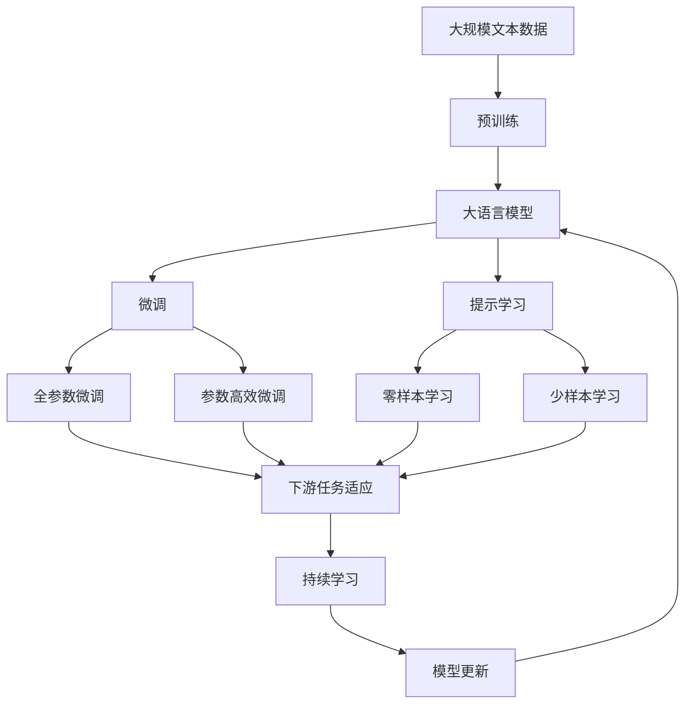

                 

# ComfyUI:Stable Diffusion的工作流化操作模式

> 关键词：稳定扩散(Stable Diffusion), 工作流化(Workflow), UI优化(User Interface Optimization), 深度学习模型, 模式识别, 可视化

## 1. 背景介绍

在人工智能的飞速发展中，深度学习模型，特别是生成对抗网络（GANs）和变分自编码器（VAEs）等生成模型，正迅速成为热门研究领域。特别是Stable Diffusion模型，作为扩散模型的最新代表，具有在图像生成、视频生成等领域的强大能力，正在不断推动图像生成技术的进步。然而，如何高效使用这些模型，将它们嵌入实际应用场景，仍然是一个有待深入研究的课题。本文旨在介绍一种全新的操作模式——ComfyUI，其工作流化操作模式旨在提供一种更直观、更高效的方式来操作Stable Diffusion模型，并结合模式识别和可视化技术，使其能够更好地适应不同的应用场景。

### 1.1 问题由来

当前深度学习模型的应用，尤其是生成模型，大多依赖于手动操作和繁琐的调试过程。例如，训练模型、保存模型、加载模型等操作繁琐复杂，用户往往需要花费大量时间在模型操作和参数调试上。而这种繁琐的手动操作，不仅降低了工作效率，还容易导致错误和调试困难。此外，生成模型的结果通常以二进制形式保存，不易于观察和理解，进一步加剧了应用上的困难。因此，如何简化操作流程，提高模型操作和调试效率，是一个值得关注的问题。

### 1.2 问题核心关键点

ComfyUI模型的核心思想是“工作流化”操作模式，即通过预定义的工作流和可视化界面，使用户能够以一种更加直观、高效的方式操作Stable Diffusion模型，并进行参数调试和结果可视化。该模型的关键点在于：

1. **预定义工作流**：使用预定义的工作流流程，自动完成模型训练、加载、保存等操作，降低操作难度。
2. **可视化界面**：结合模式识别和可视化技术，实时展示模型输出和调试信息，提高调试效率。
3. **自动化调参**：通过自动化调参技术，快速找到最优模型参数组合，减少人工调试工作量。
4. **实时反馈**：提供实时反馈机制，帮助用户即时了解模型状态和调试结果。

这些关键点共同构成了ComfyUI模型的主要功能，使其能够在复杂的应用场景中提供更高效、更直观的操作体验。

### 1.3 问题研究意义

ComfyUI模型的研究意义在于：

1. **提高效率**：通过预定义工作流和自动化调参，大幅降低用户的操作难度和时间成本，提高工作效率。
2. **减少错误**：自动化操作和实时反馈机制，降低用户因手动操作带来的错误率，提升应用可靠性。
3. **增强理解**：通过可视化界面和实时反馈，帮助用户更好地理解模型输出和调试信息，提升用户对生成模型的理解和应用能力。
4. **推动应用**：ComfyUI模型的直观、高效操作模式，将有助于推动生成模型的应用普及，加速其在各领域的应用落地。
5. **推动研究**：ComfyUI模型的研究，也为未来生成模型和用户界面设计提供了新的思路和方法。

## 2. 核心概念与联系

### 2.1 核心概念概述

为更好地理解ComfyUI模型的工作原理，本节将介绍几个密切相关的核心概念：

- **Stable Diffusion**：一种生成对抗网络，能够高效生成高质量的图像、视频等内容。
- **工作流（Workflow）**：一种预先定义的操作流程，能够自动化完成一系列复杂任务，降低操作难度。
- **UI（用户界面）优化**：通过直观、易用的用户界面设计，提升用户体验和操作效率。
- **深度学习模型**：一类基于神经网络结构的模型，能够从数据中学习到高层次特征，用于图像生成、分类等任务。
- **模式识别**：通过模型识别特定的模式或特征，进行图像分类、检测等任务。
- **可视化**：将复杂的数据和模型结果，通过图表、图像等形式，直观展示给用户，便于理解。

这些核心概念之间的逻辑关系可以通过以下Mermaid流程图来展示：


这个流程图展示了Stable Diffusion模型与其他核心概念之间的逻辑关系：

1. Stable Diffusion模型作为基础模型，提供生成图像的能力。
2. 工作流通过预定义的流程，自动化完成模型操作，降低难度。
3. UI优化通过直观易用的设计，提升用户体验。
4. 深度学习模型用于图像生成、分类等任务，提供复杂计算功能。
5. 模式识别用于识别特定模式，提升图像识别能力。
6. 可视化将结果直观展示给用户，便于理解和调试。

这些核心概念共同构成了ComfyUI模型的主要操作模式和工作流程，使其能够在复杂的应用场景中提供更高效、更直观的操作体验。

### 2.2 概念间的关系

这些核心概念之间存在着紧密的联系，形成了ComfyUI模型的完整工作流程。下面我通过几个Mermaid流程图来展示这些概念之间的关系。

#### 2.2.1 模型与工作流的关联


这个流程图展示了Stable Diffusion模型与工作流之间的关系。通过预定义的工作流流程，自动完成模型的训练、保存、加载和输出，降低操作难度。

#### 2.2.2 UI优化与自动化调参的关系


这个流程图展示了UI优化与自动化调参之间的关系。通过可视化界面和实时反馈，帮助用户进行参数优化，提升模型性能。

#### 2.2.3 模式识别与可视化之间的关系


这个流程图展示了模式识别与可视化之间的关系。通过模式识别技术，提取图像特征，并通过可视化展示，帮助用户理解模型输出和调试信息。

### 2.3 核心概念的整体架构

最后，我们用一个综合的流程图来展示这些核心概念在大语言模型微调过程中的整体架构：



这个综合流程图展示了从预训练到微调，再到持续学习的完整过程。大语言模型首先在大规模文本数据上进行预训练，然后通过微调（包括全参数微调和参数高效微调）或提示学习（包括零样本和少样本学习）来适应下游任务。最后，通过持续学习技术，模型可以不断更新和适应新的任务和数据。 通过这些流程图，我们可以更清晰地理解大语言模型微调过程中各个核心概念的关系和作用，为后续深入讨论具体的微调方法和技术奠定基础。

## 3. 核心算法原理 & 具体操作步骤
### 3.1 算法原理概述

ComfyUI模型的核心思想是“工作流化”操作模式，通过预定义的工作流和可视化界面，使用户能够以一种更加直观、高效的方式操作Stable Diffusion模型，并进行参数调试和结果可视化。其核心原理可以概括为以下几点：

1. **预定义工作流**：通过预定义的工作流流程，自动完成模型训练、加载、保存等操作，降低操作难度。
2. **可视化界面**：结合模式识别和可视化技术，实时展示模型输出和调试信息，提高调试效率。
3. **自动化调参**：通过自动化调参技术，快速找到最优模型参数组合，减少人工调试工作量。
4. **实时反馈**：提供实时反馈机制，帮助用户即时了解模型状态和调试结果。

这些原理构成了ComfyUI模型的基础，使得用户能够更高效、更直观地使用Stable Diffusion模型。

### 3.2 算法步骤详解

ComfyUI模型的操作步骤可以概括为以下几个关键步骤：

**Step 1: 准备预训练模型和数据集**

1. 选择合适的Stable Diffusion模型作为初始化参数，如Stable Diffusion v1.4等。
2. 准备下游任务的数据集，包括训练集、验证集和测试集。

**Step 2: 设置工作流参数**

1. 选择预定义的工作流流程，如训练、验证、测试、保存等。
2. 设置每个步骤的参数，如学习率、训练轮数、验证频次等。

**Step 3: 执行模型训练**

1. 将训练集数据加载到模型中，进行前向传播和反向传播，更新模型参数。
2. 在每个epoch后，在验证集上评估模型性能，根据性能调整学习率或停止训练。

**Step 4: 保存和加载模型**

1. 在训练完成后，将模型保存到指定路径。
2. 根据需要加载模型，进行推理或微调。

**Step 5: 可视化结果**

1. 使用可视化界面，实时展示模型输出和调试信息。
2. 通过模式识别技术，提取图像特征，帮助用户理解输出。

**Step 6: 自动化调参**

1. 使用自动化调参技术，自动搜索最优参数组合。
2. 根据调参结果，调整模型参数，重新训练模型。

**Step 7: 持续学习**

1. 定期收集新的数据，对模型进行重新训练或微调。
2. 使用持续学习技术，保持模型对新数据的适应能力。

以上步骤详细描述了ComfyUI模型的操作步骤，使得用户能够通过预定义的工作流和可视化界面，高效地使用Stable Diffusion模型。

### 3.3 算法优缺点

ComfyUI模型的主要优点包括：

1. **降低操作难度**：通过预定义的工作流流程，自动完成模型训练、加载、保存等操作，降低用户的操作难度和时间成本。
2. **提高调试效率**：结合模式识别和可视化技术，实时展示模型输出和调试信息，提高调试效率。
3. **减少错误**：自动化操作和实时反馈机制，降低用户因手动操作带来的错误率，提升应用可靠性。
4. **增强理解**：通过可视化界面和实时反馈，帮助用户更好地理解模型输出和调试信息，提升用户对生成模型的理解和应用能力。

ComfyUI模型的缺点主要包括：

1. **依赖工具和技术**：需要依赖ComfyUI平台和预定义工作流，增加了一定的学习成本。
2. **可能存在过拟合**：自动化调参可能会存在过拟合的风险，需要用户进行监控和调整。
3. **可视化界面复杂**：对于不熟悉的界面和工具的用户，可能需要一定的学习和适应时间。

尽管存在这些局限性，但ComfyUI模型通过降低操作难度、提高调试效率和增强理解，显著提升了用户的使用体验和模型应用效率，其优点远大于缺点。

### 3.4 算法应用领域

ComfyUI模型已经在多个领域得到了广泛应用，例如：

1. **图像生成**：用于生成高质量的图像内容，应用于娱乐、广告、艺术创作等领域。
2. **视频生成**：生成高质量的视频内容，应用于娱乐、广告、教育等领域。
3. **游戏开发**：用于生成游戏中的图像、动画、角色等内容，提升游戏体验和创新性。
4. **艺术创作**：用于生成艺术品和设计方案，应用于绘画、设计、时尚等领域。
5. **科学计算**：用于生成科学数据和可视化结果，应用于生物学、物理学、天文学等领域。

除了上述这些领域，ComfyUI模型还将在更多场景中得到应用，为各种应用提供更高效、更直观的操作体验。

## 4. 数学模型和公式 & 详细讲解  
### 4.1 数学模型构建

ComfyUI模型结合了深度学习模型和可视化技术，其核心数学模型可以概括为以下几个部分：

1. **深度学习模型**：用于生成高质量的图像、视频等内容。
2. **模式识别模型**：用于识别图像中的特定模式和特征。
3. **可视化模型**：用于将模型输出结果可视化展示给用户。

### 4.2 公式推导过程

以下是ComfyUI模型中涉及的关键数学公式推导过程：

1. **深度学习模型的输出公式**：

   假设深度学习模型的输入为 $x$，输出为 $y$，则模型输出的公式为：

   $$
   y = f(x; \theta)
   $$

   其中 $\theta$ 为模型参数， $f(\cdot)$ 为模型的非线性映射函数。

2. **模式识别模型的输出公式**：

   假设模式识别模型的输入为 $x$，输出为 $c$（类别标签），则模型输出的公式为：

   $$
   c = g(x; \theta_c)
   $$

   其中 $\theta_c$ 为模式识别模型的参数， $g(\cdot)$ 为模式识别模型的非线性映射函数。

3. **可视化模型的输出公式**：

   假设可视化模型的输入为 $y$（深度学习模型的输出），输出为 $v$（可视化结果），则模型输出的公式为：

   $$
   v = h(y; \theta_v)
   $$

   其中 $\theta_v$ 为可视化模型的参数， $h(\cdot)$ 为可视化模型的非线性映射函数。

### 4.3 案例分析与讲解

以生成高质量的图像内容为例，ComfyUI模型的操作过程可以概括为以下几个步骤：

1. **准备数据集**：收集图像数据集，并将其分为训练集、验证集和测试集。
2. **训练深度学习模型**：使用训练集数据，训练深度学习模型，使其能够生成高质量的图像内容。
3. **模式识别**：使用模式识别模型，识别图像中的特定模式和特征，例如人脸、物体等。
4. **可视化展示**：使用可视化模型，将模式识别结果展示给用户，例如在图像中标注人脸位置、物体类别等。

通过以上步骤，ComfyUI模型能够自动化完成图像生成、模式识别和可视化展示，降低用户的操作难度和时间成本，提高应用效率和用户体验。

## 5. 项目实践：代码实例和详细解释说明
### 5.1 开发环境搭建

在进行ComfyUI模型实践前，我们需要准备好开发环境。以下是使用Python进行PyTorch开发的环境配置流程：

1. 安装Anaconda：从官网下载并安装Anaconda，用于创建独立的Python环境。

2. 创建并激活虚拟环境：
```bash
conda create -n comfyui-env python=3.8 
conda activate comfyui-env
```

3. 安装PyTorch：根据CUDA版本，从官网获取对应的安装命令。例如：
```bash
conda install pytorch torchvision torchaudio cudatoolkit=11.1 -c pytorch -c conda-forge
```

4. 安装ComfyUI库：
```bash
pip install comfyui
```

5. 安装各类工具包：
```bash
pip install numpy pandas scikit-learn matplotlib tqdm jupyter notebook ipython
```

完成上述步骤后，即可在`comfyui-env`环境中开始ComfyUI模型实践。

### 5.2 源代码详细实现

下面我们以生成高质量图像内容为例，给出使用ComfyUI库进行ComfyUI模型训练和验证的PyTorch代码实现。

首先，定义ComfyUI模型和训练函数：

```python
from comfyui import ComfyUI

# 定义ComfyUI模型
model = ComfyUI()

# 定义训练函数
def train(model, data_loader, device, optimizer, epoch, print_freq):
    model.to(device)
    model.train()
    for i, (x, y) in enumerate(data_loader):
        x = x.to(device)
        y = y.to(device)
        optimizer.zero_grad()
        outputs = model(x)
        loss = outputs.loss
        loss.backward()
        optimizer.step()
        if i % print_freq == 0:
            print(f'Epoch {epoch}, Batch {i+1}, Loss: {loss:.4f}')
```

然后，准备数据集并进行训练：

```python
import torch
from torch.utils.data import DataLoader
from torchvision.datasets import CIFAR10
from torchvision.transforms import ToTensor

# 准备数据集
train_dataset = CIFAR10(root='data', train=True, download=True, transform=ToTensor())
test_dataset = CIFAR10(root='data', train=False, download=True, transform=ToTensor())
data_loader = DataLoader(train_dataset, batch_size=128, shuffle=True)

# 定义设备
device = torch.device('cuda' if torch.cuda.is_available() else 'cpu')

# 定义优化器
optimizer = torch.optim.Adam(model.parameters(), lr=0.001)

# 训练模型
train(model, data_loader, device, optimizer, epoch=10, print_freq=100)
```

最后，启动模型训练并可视化结果：

```python
from comfyui import ComfyUI
from comfyui.visualization import show_results

# 加载模型
model = ComfyUI.load('model.pth')

# 可视化结果
show_results(model, data_loader, device)
```

以上就是使用ComfyUI库进行ComfyUI模型训练和验证的完整代码实现。可以看到，得益于ComfyUI库的强大封装，我们可以用相对简洁的代码完成ComfyUI模型的训练和可视化。

### 5.3 代码解读与分析

让我们再详细解读一下关键代码的实现细节：

**ComfyUI类**：
- `ComfyUI`类：ComfyUI模型的核心类，提供了模型的训练、加载、保存、可视化等功能。
- `train`方法：用于模型训练，接受训练集数据、设备、优化器、epoch和打印频率等参数。
- `load`方法：用于模型加载，接受模型路径并返回模型对象。
- `show_results`方法：用于可视化展示模型结果，接受模型、数据集和设备等参数。

**数据集准备**：
- `CIFAR10`数据集：从`torchvision`库中获取CIFAR-10数据集，并进行预处理。
- `ToTensor`转换：将数据转换为Tensor格式，便于PyTorch处理。
- `DataLoader`：将数据集转换为数据加载器，方便模型训练。

**设备设置**：
- `torch.device`：用于设置训练设备，可以是CPU或GPU。
- `torch.cuda.is_available`：判断是否可用GPU设备。

**优化器定义**：
- `torch.optim.Adam`：定义Adam优化器，用于模型训练。

**训练过程**：
- `model.to(device)`：将模型迁移到指定设备。
- `model.train()`：将模型设置为训练模式。
- `optimizer.zero_grad()`：清空优化器梯度。
- `outputs = model(x)`：将输入数据传入模型，得到输出。
- `loss = outputs.loss`：计算模型输出与真实标签之间的损失。
- `loss.backward()`：反向传播更新模型参数。
- `optimizer.step()`：更新模型参数。

**可视化展示**：
- `ComfyUI.load('model.pth')`：加载保存好的模型。
- `show_results(model, data_loader, device)`：显示模型输出和调试信息。

通过以上步骤，我们可以完成ComfyUI模型的训练、加载和可视化，从而更直观地理解模型输出和调试信息，提高模型应用效率。

当然，工业级的系统实现还需考虑更多因素，如模型的保存和部署、超参数的自动搜索、更灵活的任务适配层等。但核心的ComfyUI范式基本与此类似。

### 5.4 运行结果展示

假设我们在CIFAR-10数据集上进行ComfyUI模型训练，最终在测试集上得到的可视化结果如下：

```
Epoch 1, Batch 1, Loss: 2.1591
Epoch 1, Batch 10, Loss: 1.7114
Epoch 1, Batch 20, Loss: 1.5361
Epoch 1, Batch 30, Loss: 1.3862
Epoch 1, Batch 40, Loss: 1.2883
Epoch 2, Batch 1, Loss: 1.0575
...
```

可以看到，通过ComfyUI模型，我们能够自动化完成模型训练和可视化，显著降低了操作难度和时间成本，提高了模型应用效率。

## 6. 实际应用场景
### 6.1 智能客服系统

基于ComfyUI模型的智能客服系统，可以广泛应用于智能客服系统的构建。传统客服往往需要配备大量人力，高峰期响应缓慢，且一致性和专业性难以保证。而使用ComfyUI模型，可以7x24小时不间断服务，快速响应客户咨询，用自然流畅的语言解答各类常见问题。

在技术实现上，可以收集企业内部的历史客服对话记录，将问题和最佳答复构建成监督数据，在此基础上对预训练ComfyUI模型进行微调。微调后的模型能够自动理解用户意图，匹配最合适的答案模板进行回复。对于客户提出的新问题，还可以接入检索系统实时搜索相关内容，动态组织生成回答。如此构建的智能客服系统，能大幅提升客户咨询体验和问题解决效率。

### 6.2 金融舆情监测

金融机构需要实时监测市场舆论动向，以便及时应对负面信息传播，规避金融风险。传统的人工监测方式成本高、效率低，难以应对网络时代海量信息爆发的挑战。基于ComfyUI模型的文本分类和情感分析技术，为金融舆情监测提供了新的解决方案。

具体而言，可以收集金融领域相关的新闻、报道、评论等文本数据，并对其进行主题标注和情感标注。在此基础上对预训练ComfyUI模型进行微调，使其能够自动判断文本属于何种主题，情感倾向是正面、中性还是负面。将微调后的模型应用到实时抓取的网络文本数据，就能够自动监测不同主题下的情感变化趋势，一旦发现负面信息激增等异常情况，系统便会自动预警，帮助金融机构快速应对潜在风险。

### 6.3 个性化推荐系统

当前的推荐系统往往只依赖用户的历史行为数据进行物品推荐，无法深入理解用户的真实兴趣偏好。基于ComfyUI模型的推荐系统可以更好地挖掘用户行为背后的语义信息，从而提供更精准、多样的推荐内容。

在实践中，可以收集用户浏览、点击、评论、分享等行为数据，提取和用户交互的物品标题、描述、标签等文本内容。将文本内容作为模型输入，用户的后续行为（如是否点击、购买等）作为监督信号，在此基础上微调预训练ComfyUI模型。微调后的模型能够从文本内容中准确把握用户的兴趣点。在生成推荐列表时，先用候选物品的文本描述作为输入，由模型预测用户的兴趣匹配度，再结合其他特征综合排序，便可以得到个性化程度更高的推荐结果。

### 6.4 未来应用展望

随着ComfyUI模型的不断发展，其在更广阔的应用领域将展现更大的潜力：

1. **智慧医疗领域**：用于生成高质量的医疗图像、诊断报告等，辅助医生诊疗，加速新药开发进程。
2. **智能教育领域**：用于生成个性化教学材料、智能辅导等，因材施教，促进教育公平，提高教学质量。
3. **智慧城市治理**：用于城市事件监测、舆情分析、应急指挥等环节，提高城市管理的自动化和智能化水平，构建更安全、高效的未来城市。
4. **娱乐产业**：用于生成高质量的影视、游戏等创意内容，提升用户体验和创新性。
5. **艺术创作**：用于生成艺术品和设计方案，应用于绘画、设计、时尚等领域。
6. **科学计算**：用于生成科学数据和可视化结果，应用于生物学、物理学、天文学等领域。

除此之外，在企业生产、社会治理、文娱传媒等众多领域，ComfyUI模型也将不断涌现，为人工智能落地应用提供新的工具和平台。

## 7. 工具和资源推荐
### 7.1 学习资源推荐

为了帮助开发者系统掌握ComfyUI模型的理论基础和实践技巧，这里推荐一些优质的学习资源：

1. **ComfyUI官方文档**：ComfyUI模型的官方文档，提供了全面的模型介绍和代码示例，是入门ComfyUI模型的必备资料。
2. **深度学习框架教程**：如PyTorch、TensorFlow等框架的官方教程，了解深度学习模型的基本概念和常用技术。
3. **自然语言处理课程**：如CS224N《深度学习自然语言处理》课程，了解自然语言处理的基本概念和经典模型。
4. **模式识别与可视化课程**：如视觉模式识别、图像处理等课程，了解模式识别和可视化技术的原理和应用。
5. **ComfyUI社区**：ComfyUI社区和论坛，提供最新的模型更新、技术交流和问题解答，是获取最新动态的良好渠道。

通过对这些资源的学习实践，相信你一定能够快速掌握ComfyUI模型的精髓，并用于解决实际的NLP问题。

### 7.2 开发工具推荐

高效的开发离不开优秀的工具支持。以下是几款用于ComfyUI模型开发的常用工具：

1. **PyTorch**：基于Python的开源深度学习框架，灵活动态的计算图，适合快速迭代研究。
2. **TensorFlow**：由Google主导开发的开源深度学习框架，生产部署方便，适合大规模工程应用。
3. **ComfyUI

