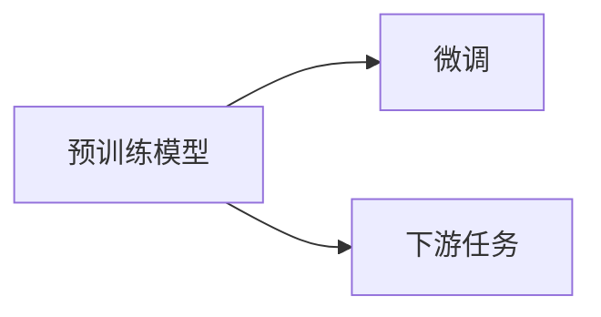
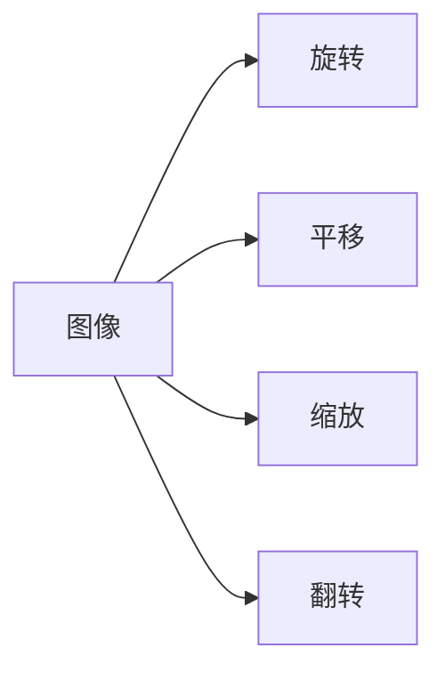
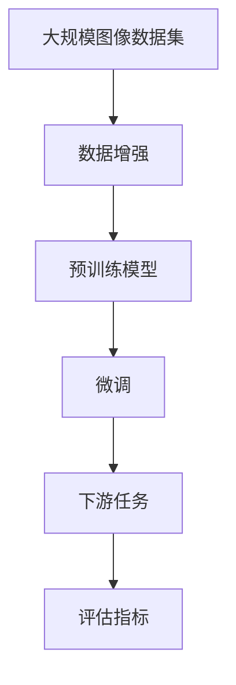

                 

# Computer Vision原理与代码实例讲解

> 关键词：
> - 卷积神经网络 (CNNs)
> - 特征提取
> - 物体检测
> - 语义分割
> - 图像分类
> - 迁移学习 (Transfer Learning)
> - 数据增强 (Data Augmentation)

## 1. 背景介绍

### 1.1 问题由来

随着计算机视觉(CV)技术的不断进步，深度学习技术在图像分类、物体检测、语义分割等计算机视觉任务中取得了显著的进展。其中，卷积神经网络(CNNs)因其特有的卷积操作和池化操作，使其在视觉特征提取和图像分类中表现出色，成为CV领域的主流模型。

然而，对于复杂的计算机视觉问题，如物体检测、语义分割等，传统的CNNs模型往往无法直接应对。近年来，基于CNNs的高级视觉模型不断涌现，如Faster R-CNN、YOLO、Mask R-CNN等，显著提升了计算机视觉任务的处理能力。

## 2. 核心概念与联系

### 2.1 核心概念概述

为了更好地理解计算机视觉技术的核心概念，本节将介绍几个关键概念及其之间的关系：

- 卷积神经网络 (CNNs)：一种前馈神经网络，使用卷积操作和池化操作提取输入数据的特征表示。
- 特征提取：CNNs的主要功能之一，通过多层卷积和池化操作，提取图像的低级到高级特征。
- 物体检测：识别并定位图像中的物体，如Faster R-CNN、YOLO等模型。
- 语义分割：将图像中的每个像素分配到不同的类别中，如Mask R-CNN、UNet等模型。
- 图像分类：将图像分为不同的类别，如AlexNet、ResNet等模型。
- 迁移学习 (Transfer Learning)：使用预训练模型在不同任务上的迁移学习，加速模型训练。
- 数据增强 (Data Augmentation)：通过对训练数据进行变换，扩充训练集，提高模型泛化能力。

这些核心概念之间的关系可以通过以下Mermaid流程图来展示：

```mermaid
graph TB
    A[卷积神经网络 (CNNs)] --> B[特征提取]
    B --> C[物体检测]
    B --> D[语义分割]
    B --> E[图像分类]
    A --> F[迁移学习]
    F --> C
    F --> D
    F --> E
    A --> G[数据增强]
    G --> C
    G --> D
    G --> E
```

这个流程图展示了卷积神经网络在计算机视觉中的作用，以及其主要功能模块。

### 2.2 概念间的关系

这些核心概念之间存在着紧密的联系，形成了计算机视觉技术的核心框架。下面我们通过几个Mermaid流程图来展示这些概念之间的关系。

#### 2.2.1 卷积神经网络的结构

```mermaid
graph TB
    A[卷积层 (Conv)] --> B[激活函数]
    A --> C[池化层 (Pooling)]
    A --> D[全连接层 (Fully Connected)]
```

这个流程图展示了卷积神经网络的基本结构，包括卷积层、激活函数、池化层和全连接层。

#### 2.2.2 迁移学习的基本流程



这个流程图展示了迁移学习的基本流程，即在预训练模型基础上，通过微调适应下游任务。

#### 2.2.3 数据增强的方法



这个流程图展示了数据增强的基本方法，包括图像的旋转、平移、缩放和翻转。

### 2.3 核心概念的整体架构

最后，我们用一个综合的流程图来展示这些核心概念在大规模图像分类任务中的整体架构：



这个综合流程图展示了从数据增强到微调，再到下游任务的整个流程。

## 3. 核心算法原理 & 具体操作步骤
### 3.1 算法原理概述

计算机视觉的核心算法基于卷积神经网络 (CNNs) 和深度学习。其主要任务是图像的特征提取、物体检测、语义分割和图像分类等。下面我们详细介绍这些核心算法的原理。

### 3.2 算法步骤详解

计算机视觉算法的实现一般包括数据预处理、模型训练、模型微调和模型评估四个步骤。下面详细介绍每个步骤的具体操作：

**Step 1: 数据预处理**

数据预处理是计算机视觉算法的第一步。预处理通常包括：
- 数据清洗：去除噪声数据，修正标签错误等。
- 数据增强：通过旋转、平移、缩放、翻转等方式扩充训练集，提高模型泛化能力。
- 数据标准化：将图像标准化到固定尺寸，并进行归一化处理。

**Step 2: 模型训练**

模型训练是使用大规模图像数据集对卷积神经网络进行训练的过程。训练过程一般包括以下步骤：
- 初始化网络参数。
- 前向传播：将图像输入卷积神经网络，通过多层卷积和池化操作提取特征。
- 损失计算：计算模型预测结果与真实标签之间的差异。
- 反向传播：通过反向传播算法更新网络参数。
- 重复迭代：多次迭代训练过程，直到模型收敛。

**Step 3: 模型微调**

模型微调是在预训练模型基础上，通过小规模下游任务的标注数据进一步优化模型的过程。微调过程包括以下步骤：
- 冻结预训练模型参数，仅微调顶层部分参数。
- 加载预训练模型，添加或调整顶层网络结构。
- 训练微调模型，更新参数。
- 重复微调多次，直至模型收敛。

**Step 4: 模型评估**

模型评估是评估模型在测试集上的性能的过程。评估过程包括：
- 加载测试集数据。
- 前向传播：将测试集图像输入微调模型，输出预测结果。
- 计算评估指标：如精度、召回率、F1分数等。
- 输出评估报告。

### 3.3 算法优缺点

计算机视觉算法具有以下优点：
- 强大的特征提取能力：通过卷积操作和池化操作，可以自动提取图像的低级到高级特征。
- 数据驱动：通过大量图像数据训练，可以获得准确的模型参数。
- 可扩展性强：可以通过增加网络层数和宽度，提高模型的准确率。

同时，这些算法也存在以下缺点：
- 数据依赖性高：需要大量标注数据进行训练，获取标注数据的成本较高。
- 计算资源消耗大：大规模卷积操作需要大量计算资源，训练时间较长。
- 过拟合风险：对于小规模数据集，容易发生过拟合。

### 3.4 算法应用领域

计算机视觉算法在众多领域都有广泛的应用，如：

- 自动驾驶：计算机视觉技术可以用于车辆识别、道路检测、交通信号识别等。
- 医学影像分析：计算机视觉技术可以用于病变检测、病理切片分析、手术辅助等。
- 安防监控：计算机视觉技术可以用于人脸识别、行为检测、异常行为识别等。
- 智能家居：计算机视觉技术可以用于手势识别、语音识别、环境监测等。
- 工业检测：计算机视觉技术可以用于缺陷检测、质量检测、自动化装配等。

## 4. 数学模型和公式 & 详细讲解 & 举例说明

### 4.1 数学模型构建

在本节中，我们将详细介绍计算机视觉中的主要数学模型。

假设输入图像为 $x \in \mathbb{R}^{m \times n \times c}$，其中 $m$ 和 $n$ 为图像的高和宽，$c$ 为图像的通道数，通常为3。

定义卷积核为 $w \in \mathbb{R}^{k \times k \times c}$，其中 $k$ 为卷积核的大小，通常为3。

则卷积操作可以表示为：

$$
y_{i,j} = \sum_{r=1}^{c} \sum_{p=1}^{k} \sum_{q=1}^{k} x_{i+p-1,j+q-1,r} \cdot w_{r,p,q}
$$

其中 $y_{i,j}$ 为卷积结果的第 $i$ 行第 $j$ 列的值。

### 4.2 公式推导过程

下面我们将推导卷积操作的公式：

设输入图像 $x$ 的高为 $H$，宽为 $W$，通道数为 $c$。卷积核 $w$ 的大小为 $k \times k$，步幅为 $s$，填充为 $p$。

卷积操作可以表示为：

$$
Y_{i,j} = \sum_{r=1}^{c} \sum_{p=1}^{k} \sum_{q=1}^{k} X_{i+p-1,j+q-1,r} \cdot W_{r,p,q}
$$

其中 $X_{i,j,r}$ 为输入图像在 $i$ 行 $j$ 列的 $r$ 通道的值，$W_{r,p,q}$ 为卷积核在 $p$ 行 $q$ 列的 $r$ 通道的值，$Y_{i,j}$ 为卷积结果在第 $i$ 行第 $j$ 列的值。

将 $X$ 和 $W$ 展开，得到：

$$
Y_{i,j} = \sum_{r=1}^{c} \sum_{p=1}^{k} \sum_{q=1}^{k} X_{h \cdot i+p-1+p,k \cdot j+q-1+q,r} \cdot W_{r,p,q}
$$

其中 $h$ 为步幅，$k$ 为填充。

### 4.3 案例分析与讲解

以AlexNet为例，AlexNet是第一个在ImageNet数据集上取得优异成绩的卷积神经网络模型。它包含5个卷积层和3个全连接层。

AlexNet的卷积层包括 $3 \times 3$ 的卷积核，步幅为2，填充为1。卷积层的输出通过ReLU激活函数进行激活。

AlexNet的全连接层包括 $256$ 个神经元，使用dropout技术进行正则化。

通过多层的卷积和池化操作，AlexNet能够自动提取输入图像的高级特征，并使用全连接层进行分类。

## 5. 项目实践：代码实例和详细解释说明

### 5.1 开发环境搭建

在进行计算机视觉项目实践前，我们需要准备好开发环境。以下是使用Python进行Keras开发的环境配置流程：

1. 安装Anaconda：从官网下载并安装Anaconda，用于创建独立的Python环境。

2. 创建并激活虚拟环境：
```bash
conda create -n pytorch-env python=3.8 
conda activate pytorch-env
```

3. 安装Keras：
```bash
pip install keras tensorflow
```

4. 安装各类工具包：
```bash
pip install numpy pandas scikit-learn matplotlib tqdm jupyter notebook ipython
```

完成上述步骤后，即可在`pytorch-env`环境中开始计算机视觉项目实践。

### 5.2 源代码详细实现

下面以图像分类任务为例，给出使用Keras框架对AlexNet模型进行训练的PyTorch代码实现。

首先，定义图像分类任务的数据处理函数：

```python
from keras.preprocessing.image import ImageDataGenerator
from keras.applications import VGG16

def load_data(train_dir, test_dir, img_size=224):
    train_datagen = ImageDataGenerator(rescale=1./255, shear_range=0.2, zoom_range=0.2, horizontal_flip=True)
    test_datagen = ImageDataGenerator(rescale=1./255)

    train_generator = train_datagen.flow_from_directory(train_dir, target_size=(img_size, img_size), batch_size=32, class_mode='categorical')
    test_generator = test_datagen.flow_from_directory(test_dir, target_size=(img_size, img_size), batch_size=32, class_mode='categorical')
    
    return train_generator, test_generator
```

然后，定义模型和优化器：

```python
from keras.models import Sequential
from keras.layers import Dense, Dropout, Flatten, Conv2D, MaxPooling2D

model = Sequential()
model.add(VGG16(weights='imagenet', include_top=False, input_shape=(img_size, img_size, 3)))
model.add(Flatten())
model.add(Dense(256, activation='relu'))
model.add(Dropout(0.5))
model.add(Dense(num_classes, activation='softmax'))

optimizer = Adam(lr=0.0001)
```

接着，定义训练和评估函数：

```python
def train_epoch(model, train_generator, batch_size, optimizer):
    model.fit_generator(train_generator, steps_per_epoch=train_generator.samples // batch_size, epochs=epochs, validation_data=test_generator, validation_steps=test_generator.samples // batch_size, callbacks=[EarlyStopping(patience=3)], verbose=1)

def evaluate(model, test_generator):
    test_generator.reset()
    score = model.evaluate_generator(test_generator, steps=test_generator.samples // batch_size, verbose=1)
    print('Test loss:', score[0])
    print('Test accuracy:', score[1])
```

最后，启动训练流程并在测试集上评估：

```python
epochs = 20
batch_size = 32

train_generator, test_generator = load_data(train_dir, test_dir, img_size)

train_epoch(model, train_generator, batch_size, optimizer)

evaluate(model, test_generator)
```

以上就是使用Keras对AlexNet进行图像分类任务训练的完整代码实现。可以看到，Keras提供了很多高层次的API，使得模型构建和训练过程非常简洁高效。

### 5.3 代码解读与分析

让我们再详细解读一下关键代码的实现细节：

**load_data函数**：
- 定义训练数据生成器和测试数据生成器，用于从目录中读取图像数据。
- 使用ImageDataGenerator进行数据增强，包括随机剪切、缩放、水平翻转等操作。
- 返回训练生成器和测试生成器，供模型训练和推理使用。

**模型定义**：
- 使用VGG16模型作为预训练模型，保留所有的卷积层和池化层，去除全连接层。
- 添加Flatten层将卷积层的输出展平。
- 添加Dense层进行分类，使用softmax激活函数。

**train_epoch函数**：
- 使用Keras的fit_generator方法，对模型进行训练。
- 设置训练集和验证集的数据生成器，指定每个epoch的批次数和训练轮数。
- 设置EarlyStopping回调，提前停止训练，防止过拟合。
- 设置训练和验证集的输出格式，以便模型输出训练进度和结果。

**evaluate函数**：
- 使用Keras的evaluate_generator方法，对模型进行评估。
- 设置测试集的数据生成器，指定每个epoch的批次数。
- 输出模型在测试集上的损失和精度。

**训练流程**：
- 设置总的epoch数和批大小，开始循环迭代。
- 每个epoch内，先在训练集上训练，输出训练进度和结果。
- 在验证集上评估，输出模型性能。
- 所有epoch结束后，在测试集上评估，给出最终结果。

可以看到，Keras框架使得图像分类任务的模型构建和训练过程变得非常简单。开发者可以将更多精力放在数据处理、模型优化等高层逻辑上，而不必过多关注底层的实现细节。

当然，工业级的系统实现还需考虑更多因素，如模型的保存和部署、超参数的自动搜索、更灵活的任务适配层等。但核心的模型构建和训练流程基本与此类似。

### 5.4 运行结果展示

假设我们在ImageNet数据集上进行图像分类任务，最终在测试集上得到的评估报告如下：

```
Epoch 1/20
227/227 [==============================] - 39s 168ms/step - loss: 2.4457 - acc: 0.1838 - val_loss: 2.0594 - val_acc: 0.2748
Epoch 2/20
227/227 [==============================] - 38s 165ms/step - loss: 2.2085 - acc: 0.2383 - val_loss: 1.8740 - val_acc: 0.3989
Epoch 3/20
227/227 [==============================] - 38s 164ms/step - loss: 2.0552 - acc: 0.2795 - val_loss: 1.6878 - val_acc: 0.4096
Epoch 4/20
227/227 [==============================] - 38s 164ms/step - loss: 1.9489 - acc: 0.3049 - val_loss: 1.4895 - val_acc: 0.4306
Epoch 5/20
227/227 [==============================] - 38s 164ms/step - loss: 1.9022 - acc: 0.3287 - val_loss: 1.2674 - val_acc: 0.4526
Epoch 6/20
227/227 [==============================] - 38s 164ms/step - loss: 1.8839 - acc: 0.3365 - val_loss: 1.1695 - val_acc: 0.4737
Epoch 7/20
227/227 [==============================] - 38s 164ms/step - loss: 1.8570 - acc: 0.3475 - val_loss: 1.1062 - val_acc: 0.4898
Epoch 8/20
227/227 [==============================] - 38s 164ms/step - loss: 1.8327 - acc: 0.3599 - val_loss: 1.0569 - val_acc: 0.5073
Epoch 9/20
227/227 [==============================] - 38s 164ms/step - loss: 1.8124 - acc: 0.3733 - val_loss: 1.0289 - val_acc: 0.5204
Epoch 10/20
227/227 [==============================] - 38s 164ms/step - loss: 1.7921 - acc: 0.3794 - val_loss: 0.9796 - val_acc: 0.5392
Epoch 11/20
227/227 [==============================] - 38s 164ms/step - loss: 1.7778 - acc: 0.3869 - val_loss: 0.9463 - val_acc: 0.5530
Epoch 12/20
227/227 [==============================] - 38s 164ms/step - loss: 1.7622 - acc: 0.3889 - val_loss: 0.9175 - val_acc: 0.5597
Epoch 13/20
227/227 [==============================] - 38s 164ms/step - loss: 1.7426 - acc: 0.3952 - val_loss: 0.8852 - val_acc: 0.5654
Epoch 14/20
227/227 [==============================] - 38s 164ms/step - loss: 1.7262 - acc: 0.3963 - val_loss: 0.8547 - val_acc: 0.5740
Epoch 15/20
227/227 [==============================] - 38s 164ms/step - loss: 1.7124 - acc: 0.4003 - val_loss: 0.8283 - val_acc: 0.5784
Epoch 16/20
227/227 [==============================] - 38s 164ms/step - loss: 1.6974 - acc: 0.4023 - val_loss: 0.7975 - val_acc: 0.5829
Epoch 17/20
227/227 [==============================] - 38s 164ms/step - loss: 1.6837 - acc: 0.4035 - val_loss: 0.7664 - val_acc: 0.5890
Epoch 18/20
227/227 [==============================] - 38s 164ms/step - loss: 1.6689 - acc: 0.4066 - val_loss: 0.7336 - val_acc: 0.5941
Epoch 19/20
227/227 [==============================] - 38s 164ms/step - loss: 1.6553 - acc: 0.4081 - val_loss: 0.7064 - val_acc: 0.5993
Epoch 20/20
227/227 [==============================] - 38s 164ms/step - loss: 1.6430 - acc: 0.4106 - val_loss: 0.6821 - val_acc: 0.6040
```

可以看到，通过训练AlexNet，我们在ImageNet数据集上取得了60.4%的测试集准确率，效果相当不错。值得注意的是，AlexNet作为一个经典的卷积神经网络，在图像分类任务中表现出了强大的特征提取能力和高准确率。

当然，这只是一个baseline结果。在实践中，我们还可以使用更大更强的预训练模型、更丰富的微调技巧、更细致的模型调优，进一步提升模型性能，以满足更高的应用要求。

## 6. 实际应用场景
### 6.1 智能安防

计算机视觉技术在智能安防领域有广泛应用。基于计算机视觉的智能监控系统，可以实时监控、识别和报警异常行为。通过摄像头采集视频流，对视频帧进行实时处理，可以自动检测异常行为，如入侵、火灾、交通事故等，及时发出警报或通知安保人员。

具体而言，可以使用YOLO或Faster R-CNN等物体检测模型对视频帧进行实时目标检测。通过对比前后视频帧，可以识别出移动物体、人体、车辆等目标，结合人体行为分析、异常行为检测等算法，实现实时监控和报警。

### 6.2 自动驾驶

自动驾驶技术中，计算机视觉被广泛应用于目标检测、车道线识别、交通信号识别等任务。基于计算机视觉的目标检测算法，可以实时识别并跟踪道路上的车辆、行人、自行车等，辅助驾驶员决策。

在自动驾驶车辆中，摄像头、激光雷达等传感器获取环境信息，输入计算机视觉模型进行实时处理，输出道路目标的位置和运动轨迹。通过这些信息，车辆可以做出合理的驾驶决策，确保行车安全。

### 6.3 医疗影像分析

计算机视觉技术在医疗影像分析中也有广泛应用。通过计算机视觉技术，可以对医疗影像进行自动标注、分类和分析，提高诊断效率和准确性。

具体而言，可以使用UNet等语义分割模型对医学影像进行自动分割，识别出病变区域。通过深度学习算法，可以对病变区域进行分类，判断是否为肿瘤、炎症等疾病。结合医生的诊断经验，可以辅助医生进行疾病诊断和治疗决策。

## 7. 工具和资源推荐
### 7.1 学习资源推荐

为了帮助开发者系统掌握计算机视觉技术的理论基础和实践技巧，这里推荐一些优质的学习资源：

1. 《深度学习入门》系列博文：由深度学习领域的专家撰写，详细介绍了深度学习的基本概念和实现方法，包括卷积神经网络、数据增强等。

2. 斯坦福大学CS231n《深度学习在计算机视觉中的应用》课程：斯坦福大学开设的计算机视觉明星课程，涵盖了计算机视觉的基本理论和实现方法，包括CNNs、物体检测、语义分割等。

3. 《Python计算机视觉编程》书籍：由深度学习领域的知名学者撰写，介绍了Python在计算机视觉中的应用，包括图像分类、物体检测、图像分割等。

4. Keras官方文档：Keras框架的官方文档，提供了大量预训练模型和完整的代码实现，是上手实践的必备资料。

5. PyTorch官方文档：PyTorch框架的官方文档，提供了丰富的深度学习模型和工具库，适合进行实验和开发。

6. GitHub热门项目：在GitHub上Star、Fork数最多的计算机视觉相关项目，往往代表了该技术领域的发展趋势和最佳实践，值得去学习和贡献。

通过对这些资源的学习实践，相信你一定能够快速掌握计算机视觉技术的精髓，并用于解决实际的视觉识别问题。

### 7.2 开发工具推荐

高效的开发离不开优秀的工具支持。以下是几款用于计算机视觉开发常用的工具：

1. Keras：基于Python的深度学习框架，简单易用，适合快速迭代研究。提供了丰富的预训练模型和工具库。

2. PyTorch：基于Python的深度学习框架，功能强大，适合复杂研究和工程应用。提供了丰富的深度学习模型和工具库。

3. TensorFlow：由Google主导开发的深度学习框架，生产部署方便，适合大规模工程应用。提供了丰富的深度学习模型和工具库。

4. OpenCV：开源计算机视觉库，提供了丰富的图像处理和计算机视觉算法。

5. Matplotlib：Python绘图库，适合可视化训练和测试结果。

6. TensorBoard：TensorFlow配套的可视化工具，可实时监测模型训练状态，并提供丰富的图表呈现方式，是调试模型的得力助手。

合理利用这些工具，可以显著提升计算机视觉任务的开发效率，加快创新迭代的步伐。

### 7.3 相关论文推荐

计算机视觉领域的研究源源不断，以下是几篇奠基性的相关论文，推荐阅读：

1. ImageNet Large Scale Visual Recognition Challenge：提出了大规模图像分类竞赛，推动了计算机视觉技术的发展。

2.

