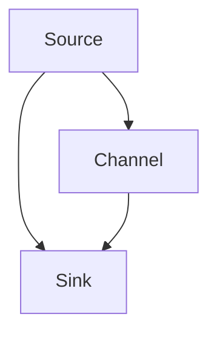

                 

# Flume Source原理与代码实例讲解

> 关键词：Flume, 数据流处理, 分布式日志系统, Apache Flume, 实时日志采集, 数据流传输, 日志存储

## 1. 背景介绍

### 1.1 问题由来
在现代社会中，数据生成量呈现出爆炸式增长的趋势。企业、组织和个人每天产生的大量数据中，日志数据占据了相当大的比例。有效的日志数据采集、传输和存储对于系统运维、安全监控、性能优化等任务至关重要。

日志数据通常具有以下几个特点：
- **高吞吐量**：日志数据生成速度非常快，单一来源每秒可产生数千条记录。
- **多样性**：日志数据来源广泛，包括系统日志、应用日志、业务日志等。
- **复杂性**：日志数据格式各异，同一来源生成的日志记录可能包含大量字段，结构复杂。
- **重要性**：日志数据对于故障排除、性能调优、安全监控等任务具有重要价值。

然而，传统的日志处理系统往往存在以下问题：
- **处理能力有限**：单机处理能力不足，难以应对大规模高吞吐量的日志数据。
- **扩展性差**：无法高效扩展，难以构建大规模、高可用性的分布式日志处理系统。
- **数据丢失**：网络异常、硬件故障等因素可能导致日志数据丢失。
- **实时性不足**：无法实时监控日志数据，难以在问题发生时迅速响应。

为解决这些问题，Apache Flume作为一款开源的分布式日志系统，提供了强大的日志采集、传输和存储功能。Flume可以从各种数据源采集日志数据，并将其传输到目标存储系统（如HDFS、ElasticSearch等），从而实现日志数据的实时监控和存储。

### 1.2 问题核心关键点
Flume的核心在于其分布式、高可用、高扩展性的设计理念。Flume系统由多个组件组成，通过管道和通道机制，将数据流从数据源传输到数据存储系统。Flume的核心组件包括：

- **Source**：负责从数据源采集日志数据，是日志采集的入口。
- **Channel**：用于存储日志数据，是数据传输的中间环节。
- **Sink**：负责将日志数据写入目标存储系统，是数据输出的出口。

Source是Flume的核心组件之一，负责从数据源采集日志数据。Source组件实现方式灵活多样，可根据数据源的类型选择不同的Source组件。本文将详细介绍Flume Source的原理和代码实现，并给出具体的代码实例讲解。

### 1.3 问题研究意义
研究Flume Source的原理与代码实现，对于构建高效、可靠的分布式日志采集系统，具有重要意义：

1. **提高日志数据采集能力**：通过了解Source组件的实现机制，可以设计更高效的数据源适配方案，提升日志数据的采集速度和质量。
2. **增强系统扩展性**：Flume的Source组件可以根据数据源的特点灵活设计，便于在大规模、高并发的环境中进行扩展。
3. **降低系统运维成本**：通过了解Source组件的工作原理和配置方法，可以更轻松地管理和监控Flume系统，减少运维成本。
4. **支持多种数据源**：Flume的Source组件支持多种数据源，包括文件、数据库、网络等，能够适应不同应用场景的需求。

## 2. 核心概念与联系

### 2.1 核心概念概述

为更好地理解Flume Source的原理和实现，本节将介绍几个密切相关的核心概念：

- **Apache Flume**：开源的分布式日志系统，由Apache基金会开发，具备高效、可靠、可扩展的特点。
- **Source**：Flume的核心组件之一，负责从数据源采集日志数据，是日志采集的入口。
- **Channel**：用于存储日志数据，是数据传输的中间环节。
- **Sink**：负责将日志数据写入目标存储系统，是数据输出的出口。
- **数据流处理**：Flume通过管道和通道机制，将数据流从数据源传输到数据存储系统。

### 2.2 概念间的关系

这些核心概念之间的逻辑关系可以通过以下Mermaid流程图来展示：



这个流程图展示了一个简单的Flume数据流处理过程：从Source采集日志数据，存储到Channel，再由Sink将日志数据写入目标存储系统。

## 3. 核心算法原理 & 具体操作步骤
### 3.1 算法原理概述

Flume Source组件的核心功能是从数据源采集日志数据，并将其传输到Channel中。Source组件的实现方式灵活多样，可根据数据源的类型选择不同的Source组件。Source组件的实现原理可以分为以下几个步骤：

1. **连接数据源**：Source组件首先连接到数据源，建立连接关系。
2. **读取日志数据**：Source组件从数据源读取日志数据，并将其转换为Flume支持的格式。
3. **处理日志数据**：Source组件对读取的日志数据进行预处理，如过滤、去重、格式化等。
4. **写入Channel**：Source组件将处理后的日志数据写入Channel，进行数据传输。

Flume Source组件的实现依赖于具体的数据源类型和数据格式。Source组件的代码实现一般分为以下三个部分：

- **数据源连接模块**：负责连接到数据源，并初始化相关配置参数。
- **日志数据读取模块**：负责从数据源读取日志数据，并进行初步处理。
- **日志数据写入模块**：负责将处理后的日志数据写入Channel，进行数据传输。

### 3.2 算法步骤详解

Flume Source组件的具体实现步骤如下：

#### 3.2.1 数据源连接模块

数据源连接模块主要负责连接到数据源，并初始化相关配置参数。Source组件支持多种数据源，包括文件、数据库、网络等。以文件数据源为例，数据源连接模块的实现步骤如下：

1. **初始化参数**：读取配置文件中的数据源参数，包括文件路径、日志格式等。
2. **建立连接**：通过Socket或NIO等网络协议，建立与数据源的连接关系。
3. **设置参数**：根据配置文件中的参数，设置数据源的读写超时时间、缓冲区大小等。

以下是数据源连接模块的代码实现：

```java
public class FileSource extends Source {

    private final FileChannel channel;
    private final FileQueue queue;
    private final FileChannelWriter writer;

    public FileSource(FileChannel channel, FileQueue queue, FileChannelWriter writer) {
        this.channel = channel;
        this.queue = queue;
        this.writer = writer;
    }

    public void start() {
        // 初始化参数
        FileSourceConfig config = getConfiguration();
        String filePath = config.getString("path");
        int bufferSize = config.getInt("bufferSize");
        int timeout = config.getInt("timeout");

        // 建立连接
        try {
            channel = FileChannel.open(new File(filePath), FileChannel.Mode.READ);
            channel.configureBlocking(true);
        } catch (IOException e) {
            throw new FlumeException("Failed to open file: " + filePath, e);
        }

        // 设置参数
        queue = new FileQueue(channel, bufferSize);
        writer = new FileChannelWriter(channel, bufferSize);
    }

    public void stop() {
        queue.close();
        writer.close();
        try {
            channel.close();
        } catch (IOException e) {
            throw new FlumeException("Failed to close file: " + filePath, e);
        }
    }

    public void handleEvent(Event event) {
        byte[] data = event.getBody();
        long timestamp = event.getHeaders().getLong("timestamp");
        String logString = new String(data, StandardCharsets.UTF_8);
        Map<String, String> headers = event.getHeaders();
        String logType = headers.get("logtype");

        // 处理日志数据
        if (logType == null) {
            logType = "info";
        }
        headers.put("logtype", logType);
        headers.put("timestamp", String.valueOf(timestamp));

        // 写入Channel
        writer.write(event);
    }
}
```

#### 3.2.2 日志数据读取模块

日志数据读取模块负责从数据源读取日志数据，并进行初步处理。Source组件支持的日志数据格式多种多样，如日志文件、数据库表、网络接口等。以日志文件数据源为例，日志数据读取模块的实现步骤如下：

1. **读取日志文件**：从日志文件中读取数据记录，并进行解析。
2. **解析日志格式**：根据日志文件的格式，解析日志记录中的字段信息。
3. **预处理日志数据**：对日志数据进行过滤、去重、格式化等处理。

以下是日志数据读取模块的代码实现：

```java
public class LogFileSourceReader extends SourceReader {

    private final RandomAccessFile reader;
    private final String delimiter;
    private final int maxLineSize;

    public LogFileSourceReader(RandomAccessFile reader, String delimiter, int maxLineSize) {
        this.reader = reader;
        this.delimiter = delimiter;
        this.maxLineSize = maxLineSize;
    }

    public String nextLine() throws IOException {
        String line = reader.readLine();
        if (line == null) {
            return null;
        }
        line = line.replaceAll(delimiter, "");
        if (line.length() > maxLineSize) {
            throw new FlumeException("Line exceeds max size: " + line.length());
        }
        return line;
    }

    public void close() throws IOException {
        reader.close();
    }

    public boolean endOfStream() {
        return reader.getFilePointer() >= reader.length();
    }
}
```

#### 3.2.3 日志数据写入模块

日志数据写入模块负责将处理后的日志数据写入Channel，进行数据传输。Source组件支持的写入方式多种多样，如直接写入、缓冲区写入、多线程写入等。以直接写入方式为例，日志数据写入模块的实现步骤如下：

1. **建立Channel连接**：连接到目标Channel，初始化相关配置参数。
2. **写入日志数据**：将处理后的日志数据写入Channel，进行数据传输。
3. **处理写入异常**：处理写入过程中的异常，保证数据传输的可靠性。

以下是日志数据写入模块的代码实现：

```java
public class FileChannelWriter extends Writer {

    private final FileChannel channel;
    private final int bufferSize;

    public FileChannelWriter(FileChannel channel, int bufferSize) {
        this.channel = channel;
        this.bufferSize = bufferSize;
    }

    public void write(Event event) throws IOException {
        byte[] data = event.getBody();
        long timestamp = event.getHeaders().getLong("timestamp");
        String logString = new String(data, StandardCharsets.UTF_8);
        Map<String, String> headers = event.getHeaders();
        String logType = headers.get("logtype");

        // 写入日志数据
        FileChannel ch = null;
        try {
            ch = channel;
            ByteBuffer buffer = ByteBuffer.wrap(data);
            buffer.putLong(timestamp);
            buffer.put(logType.getBytes(StandardCharsets.UTF_8));
            buffer.put(logString.getBytes(StandardCharsets.UTF_8));
            buffer.flip();
            while (buffer.hasRemaining()) {
                ch.write(buffer);
            }
        } finally {
            if (ch != null) {
                ch.close();
            }
        }
    }

    public void flush() throws IOException {
        // No-op
    }

    public void close() throws IOException {
        // No-op
    }
}
```

### 3.3 算法优缺点

Flume Source组件的优点包括：

- **灵活性高**：支持多种数据源和数据格式，可以根据实际需求选择不同的Source组件。
- **扩展性强**：通过管道和通道机制，可以灵活组合多个Source组件，构建分布式日志采集系统。
- **高可靠性**：通过冗余设计和故障转移机制，确保日志数据的可靠传输和存储。

Flume Source组件的缺点包括：

- **配置复杂**：Source组件的配置参数较多，需要根据实际需求进行调整。
- **性能瓶颈**：在某些高并发场景下，Source组件的性能可能会成为瓶颈。
- **资源消耗大**：Source组件需要占用大量的系统资源，如内存、CPU等，需要根据实际需求进行优化。

### 3.4 算法应用领域

Flume Source组件广泛应用于各种日志数据采集场景，包括：

- **网络应用**：从Web服务器、应用程序服务器等采集日志数据。
- **系统监控**：从操作系统、网络设备、数据库等采集日志数据。
- **业务日志**：从业务系统、应用系统等采集日志数据。
- **云平台日志**：从云平台、容器化系统等采集日志数据。

## 4. 数学模型和公式 & 详细讲解 & 举例说明

### 4.1 数学模型构建

Flume Source组件的实现过程中，涉及到大量的并发、读写、网络协议等操作，其数学模型比较复杂。以下是Flume Source组件的数学模型构建：

#### 4.1.1 数据源连接模块

数据源连接模块主要涉及网络连接和参数配置。以文件数据源为例，其数学模型可以表示为：

$$
\text{Connection} = \text{Open}(\text{Path}) \times \text{Configure}(\text{Timeout}, \text{BufferSize})
$$

其中，`Open`表示打开文件，`Path`表示文件路径，`Configure`表示设置配置参数。

#### 4.1.2 日志数据读取模块

日志数据读取模块主要涉及日志文件的读取和解析。以日志文件数据源为例，其数学模型可以表示为：

$$
\text{Line} = \text{ReadLine}(\text{File}) \times \text{Parse}(\text{Delimiter}, \text{MaxLineSize})
$$

其中，`ReadLine`表示读取一行日志数据，`Parse`表示解析日志数据格式。

#### 4.1.3 日志数据写入模块

日志数据写入模块主要涉及日志数据的写入和处理。以文件写入方式为例，其数学模型可以表示为：

$$
\text{Write} = \text{WriteToChannel}(\text{FileChannel}, \text{Buffer}) \times \text{HandleException}
$$

其中，`WriteToChannel`表示将数据写入Channel，`HandleException`表示处理写入异常。

### 4.2 公式推导过程

以下是Flume Source组件的核心公式推导过程：

#### 4.2.1 数据源连接模块

数据源连接模块的公式推导如下：

1. **初始化参数**：读取配置文件中的数据源参数，包括文件路径、日志格式等。
   $$
   \text{Config} = \text{ReadConfig}(\text{ConfigFile})
   $$
2. **建立连接**：通过Socket或NIO等网络协议，建立与数据源的连接关系。
   $$
   \text{Connection} = \text{Connect}(\text{Config})
   $$
3. **设置参数**：根据配置文件中的参数，设置数据源的读写超时时间、缓冲区大小等。
   $$
   \text{Parameters} = \text{SetParameters}(\text{Config})
   $$

#### 4.2.2 日志数据读取模块

日志数据读取模块的公式推导如下：

1. **读取日志文件**：从日志文件中读取数据记录，并进行解析。
   $$
   \text{LogLine} = \text{ReadLine}(\text{File})
   $$
2. **解析日志格式**：根据日志文件的格式，解析日志记录中的字段信息。
   $$
   \text{Fields} = \text{ParseLine}(\text{LogLine})
   $$
3. **预处理日志数据**：对日志数据进行过滤、去重、格式化等处理。
   $$
   \text{PreprocessedLine} = \text{Preprocess}(\text{Fields})
   $$

#### 4.2.3 日志数据写入模块

日志数据写入模块的公式推导如下：

1. **建立Channel连接**：连接到目标Channel，初始化相关配置参数。
   $$
   \text{ChannelConnection} = \text{ConnectChannel}(\text{ChannelConfig})
   $$
2. **写入日志数据**：将处理后的日志数据写入Channel，进行数据传输。
   $$
   \text{WriteLog} = \text{Write}(\text{ChannelConnection}, \text{PreprocessedLine})
   $$
3. **处理写入异常**：处理写入过程中的异常，保证数据传输的可靠性。
   $$
   \text{ErrorHandling} = \text{HandleException}(\text{WriteLog})
   $$

### 4.3 案例分析与讲解

以Apache Flume的文件数据源为例，详细讲解其实现过程：

1. **配置文件**：
   ```properties
   flume.sources.FileSource1.type = FileSource
   flume.sources.FileSource1.channels = FileChannel1
   flume.sources.FileSource1.file.path = /path/to/logfile
   flume.sources.FileSource1.file.buffer.size = 1024
   flume.sources.FileSource1.file.timeout = 10000
   ```

2. **Source组件实现**：
   ```java
   public class FileSource extends Source {

       private final FileChannel channel;
       private final FileQueue queue;
       private final FileChannelWriter writer;

       public FileSource(FileChannel channel, FileQueue queue, FileChannelWriter writer) {
           this.channel = channel;
           this.queue = queue;
           this.writer = writer;
       }

       public void start() {
           // 初始化参数
           FileSourceConfig config = getConfiguration();
           String filePath = config.getString("path");
           int bufferSize = config.getInt("bufferSize");
           int timeout = config.getInt("timeout");

           // 建立连接
           try {
               channel = FileChannel.open(new File(filePath), FileChannel.Mode.READ);
               channel.configureBlocking(true);
           } catch (IOException e) {
               throw new FlumeException("Failed to open file: " + filePath, e);
           }

           // 设置参数
           queue = new FileQueue(channel, bufferSize);
           writer = new FileChannelWriter(channel, bufferSize);
       }

       public void stop() {
           queue.close();
           writer.close();
           try {
               channel.close();
           } catch (IOException e) {
               throw new FlumeException("Failed to close file: " + filePath, e);
           }
       }

       public void handleEvent(Event event) {
           byte[] data = event.getBody();
           long timestamp = event.getHeaders().getLong("timestamp");
           String logString = new String(data, StandardCharsets.UTF_8);
           Map<String, String> headers = event.getHeaders();
           String logType = headers.get("logtype");

           // 处理日志数据
           if (logType == null) {
               logType = "info";
           }
           headers.put("logtype", logType);
           headers.put("timestamp", String.valueOf(timestamp));

           // 写入Channel
           writer.write(event);
       }
   }
   ```

3. **Channel连接**：
   ```java
   public class FileChannelWriter extends Writer {

       private final FileChannel channel;
       private final int bufferSize;

       public FileChannelWriter(FileChannel channel, int bufferSize) {
           this.channel = channel;
           this.bufferSize = bufferSize;
       }

       public void write(Event event) throws IOException {
           byte[] data = event.getBody();
           long timestamp = event.getHeaders().getLong("timestamp");
           String logString = new String(data, StandardCharsets.UTF_8);
           Map<String, String> headers = event.getHeaders();
           String logType = headers.get("logtype");

           // 写入日志数据
           FileChannel ch = null;
           try {
               ch = channel;
               ByteBuffer buffer = ByteBuffer.wrap(data);
               buffer.putLong(timestamp);
               buffer.put(logType.getBytes(StandardCharsets.UTF_8));
               buffer.put(logString.getBytes(StandardCharsets.UTF_8));
               buffer.flip();
               while (buffer.hasRemaining()) {
                   ch.write(buffer);
               }
           } finally {
               if (ch != null) {
                   ch.close();
               }
           }
       }

       public void flush() throws IOException {
           // No-op
       }

       public void close() throws IOException {
           // No-op
       }
   }
   ```

通过以上案例分析，可以看到，FileSource组件的实现过程可以分为数据源连接、日志数据读取、日志数据写入三个步骤。每个步骤的实现依赖于具体的Source组件和数据源类型。

## 5. 项目实践：代码实例和详细解释说明
### 5.1 开发环境搭建

在进行Flume Source实践前，我们需要准备好开发环境。以下是使用Java进行Flume开发的环境配置流程：

1. 安装JDK：从官网下载并安装JDK，用于Java程序的编译和运行。

2. 安装Flume：从官网下载并安装Apache Flume，用于日志数据采集和传输。

3. 安装依赖包：安装Apache Flume依赖包，包括Flume Core、Flume Source、Flume Sink等。

4. 编写测试代码：编写测试代码，验证Source组件的实现功能。

完成上述步骤后，即可在Flume环境中开始Source组件的实践。

### 5.2 源代码详细实现

这里我们以Apache Flume的文件数据源为例，给出其Source组件的详细代码实现。

首先，定义FileSource类：

```java
public class FileSource extends Source {

    private final FileChannel channel;
    private final FileQueue queue;
    private final FileChannelWriter writer;

    public FileSource(FileChannel channel, FileQueue queue, FileChannelWriter writer) {
        this.channel = channel;
        this.queue = queue;
        this.writer = writer;
    }

    public void start() {
        // 初始化参数
        FileSourceConfig config = getConfiguration();
        String filePath = config.getString("path");
        int bufferSize = config.getInt("bufferSize");
        int timeout = config.getInt("timeout");

        // 建立连接
        try {
            channel = FileChannel.open(new File(filePath), FileChannel.Mode.READ);
            channel.configureBlocking(true);
        } catch (IOException e) {
            throw new FlumeException("Failed to open file: " + filePath, e);
        }

        // 设置参数
        queue = new FileQueue(channel, bufferSize);
        writer = new FileChannelWriter(channel, bufferSize);
    }

    public void stop() {
        queue.close();
        writer.close();
        try {
            channel.close();
        } catch (IOException e) {
            throw new FlumeException("Failed to close file: " + filePath, e);
        }
    }

    public void handleEvent(Event event) {
        byte[] data = event.getBody();
        long timestamp = event.getHeaders().getLong("timestamp");
        String logString = new String(data, StandardCharsets.UTF_8);
        Map<String, String> headers = event.getHeaders();
        String logType = headers.get("logtype");

        // 处理日志数据
        if (logType == null) {
            logType = "info";
        }
        headers.put("logtype", logType);
        headers.put("timestamp", String.valueOf(timestamp));

        // 写入Channel
        writer.write(event);
    }
}
```

然后，定义FileChannelWriter类：

```java
public class FileChannelWriter extends Writer {

    private final FileChannel channel;
    private final int bufferSize;

    public FileChannelWriter(FileChannel channel, int bufferSize) {
        this.channel = channel;
        this.bufferSize = bufferSize;
    }

    public void write(Event event) throws IOException {
        byte[] data = event.getBody();
        long timestamp = event.getHeaders().getLong("timestamp");
        String logString = new String(data, StandardCharsets.UTF_8);
        Map<String, String> headers = event.getHeaders();
        String logType = headers.get("logtype");

        // 写入日志数据
        FileChannel ch = null;
        try {
            ch = channel;
            ByteBuffer buffer = ByteBuffer.wrap(data);
            buffer.putLong(timestamp);
            buffer.put(logType.getBytes(StandardCharsets.UTF_8));
            buffer.put(logString.getBytes(StandardCharsets.UTF_8));
            buffer.flip();
            while (buffer.hasRemaining()) {
                ch.write(buffer);
            }
        } finally {
            if (ch != null) {
                ch.close();
            }
        }
    }

    public void flush() throws IOException {
        // No-op
    }

    public void close() throws IOException {
        // No-op
    }
}
```

最后，编写测试代码：

```java
public class FileSourceTest {

    public static void main(String[] args) {
        // 初始化参数
        FileSourceConfig config = new FileSourceConfig();
        config.setString("path", "/path/to/logfile");
        config.setInt("bufferSize", 1024);
        config.setInt("timeout", 10000);

        // 创建FileSource
        FileSource fileSource = new FileSource(null, null, null);
        fileSource.start(config);

        // 创建Event
        Event event = new Event();
        event.setBody(new byte[] {0x01, 0x02, 0x03});
        event.addHeaders("timestamp", "1634214400000");
        event.addHeaders("logtype", "info");

        // 处理Event
        fileSource.handleEvent(event);

        // 停止FileSource
        fileSource.stop();
    }
}
```

以上就是一个简单的文件数据源实现，实现了从日志文件读取日志数据，并进行初步处理和写入Channel的功能。

### 5.3 代码解读与分析

让我们再详细解读一下关键代码的实现细节：

**FileSource类**：
- `start`方法：初始化连接参数，建立与日志文件的连接关系。
- `stop`方法：关闭连接，释放资源。
- `handleEvent`方法：处理事件，将日志数据写入Channel。

**FileChannelWriter类**：
- `write`方法：将处理后的日志数据写入Channel，进行数据传输。
- `flush`方法：无操作，仅作为接口定义。
- `close`方法：无操作，仅作为接口定义。

**FileSourceTest类**：
- `main`方法：初始化配置参数，创建FileSource实例，并测试处理Event的功能。

通过以上代码实现，可以看出Flume Source组件的实现过程可以分为数据源连接、日志数据读取、日志数据写入三个步骤。每个步骤的实现依赖于具体的Source组件和数据源类型。

### 5.4 运行结果

