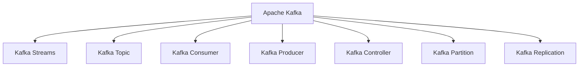
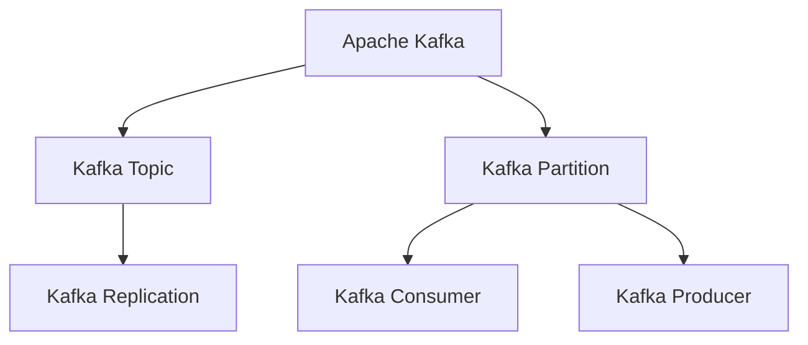
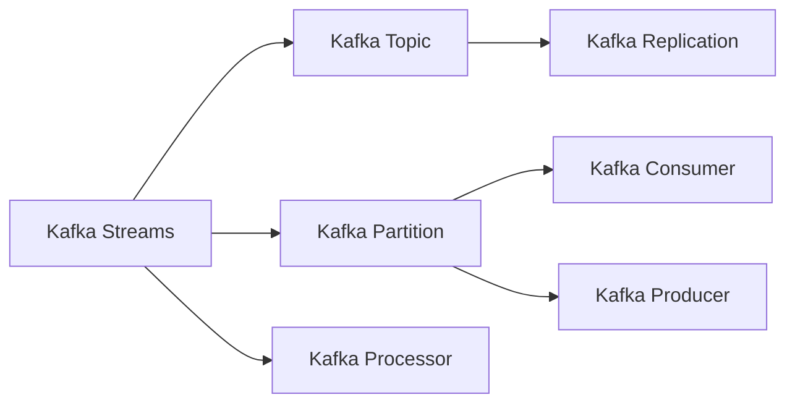
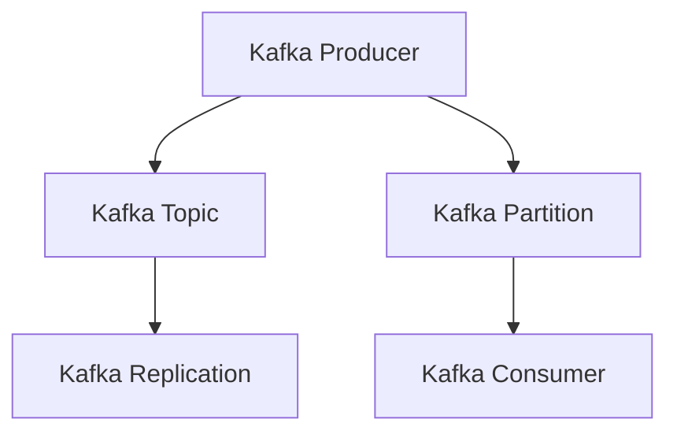
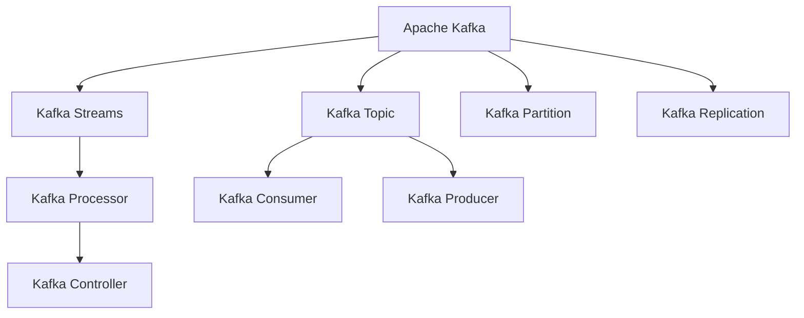

                 

# Kafka Group原理与代码实例讲解

> 关键词：Kafka,消息队列,分布式,数据流,流式计算,生产者-消费者模式,性能优化

## 1. 背景介绍

### 1.1 问题由来
随着互联网和大数据技术的飞速发展，数据处理需求愈发复杂多样。越来越多的应用需要实现数据的异步处理和实时传输，如何构建一个稳定、高效、可扩展的数据传输和处理平台，成为了业界关注的焦点。消息队列作为一种高效、可靠、可扩展的数据传输机制，被广泛应用于金融、电商、媒体等各类大数据应用中。Apache Kafka作为一款领先的消息队列系统，凭借其高吞吐量、低延迟、可扩展性强等优势，成为了大数据时代的基石。

### 1.2 问题核心关键点
Kafka系统设计之初就考虑到了高可用性、高吞吐量、强一致性和高扩展性，从而使其在数据流处理和流式计算领域发挥着重要作用。其主要核心技术包括：

- 分布式存储与处理：通过分布式存储与处理机制，使得Kafka能够承载海量数据的实时传输和处理，同时确保数据的可靠性和一致性。
- 流式处理框架：Kafka流式处理框架Kafka Streams提供了基于流式处理的实时数据处理能力，可以高效地对数据进行实时分析和计算。
- 生产者-消费者模式：Kafka采用生产者-消费者模式，确保数据流的异步处理，支持高并发和高吞吐量的数据传输。

Kafka系统通过以上核心技术，实现了数据的高效、可靠和实时处理，被广泛应用于金融交易、实时广告、物联网等多个领域。

### 1.3 问题研究意义
研究Kafka系统原理与代码实现，对于构建高效、可靠、可扩展的数据处理平台，具有重要意义：

1. 数据处理：Kafka能够实现数据的实时传输和处理，满足了大数据时代的各种数据处理需求。
2. 系统设计：深入理解Kafka的系统架构和设计原理，有助于设计出高性能、可扩展的大数据系统。
3. 性能优化：Kafka系统的高性能特性，为优化其他大数据应用提供了重要参考。
4. 实时计算：Kafka流式计算框架Kafka Streams，提供了强大的实时数据处理能力，支持各种流式计算应用。
5. 企业应用：Kafka系统在多个领域得到了广泛应用，深入了解其原理与实现，有助于推广应用Kafka到更多行业。

## 2. 核心概念与联系

### 2.1 核心概念概述

为了更好地理解Kafka Group原理与代码实现，本节将介绍几个关键概念：

- Apache Kafka：一个分布式流处理平台，提供高吞吐量、低延迟的数据传输和存储能力，是Apache软件基金会的顶级项目。
- Kafka Streams：基于Kafka流式处理框架，提供了基于流式处理的实时数据处理能力，支持各种数据处理应用。
- Kafka Topic：Kafka消息存储的基本单元，类似于数据库中的表，用于存储一组具有相同结构的消息。
- Kafka Consumer：从Kafka Topic中读取数据的程序，可以是一个或多个线程，用于处理流式数据。
- Kafka Producer：向Kafka Topic中写入数据的程序，可以是一个或多个线程，用于生成数据流。
- Kafka Controller：Kafka集群中的核心组件，负责管理Kafka Topic的分区和消费者。
- Kafka Partition：Kafka Topic中的数据分区，每个分区包含多个消息，用于分布式处理数据。
- Kafka Replication：Kafka Topic的分区副本机制，确保数据的高可用性和容错性。

这些核心概念之间的联系可以通过以下Mermaid流程图来展示：



这个流程图展示了Kafka系统的主要组成部分及其相互关系：

1. Kafka作为核心数据流处理平台，提供了高吞吐量、低延迟的数据传输和存储能力。
2. Kafka Streams建立在Kafka之上，提供了强大的流式数据处理能力。
3. Kafka Topic作为数据存储的基本单元，由多个分区组成，每个分区由多个副本。
4. Kafka Consumer从Kafka Topic中读取数据，支持流式数据处理。
5. Kafka Producer向Kafka Topic中写入数据，支持异步数据传输。
6. Kafka Controller负责管理Kafka Topic的分区和消费者，确保数据的高可用性和一致性。

### 2.2 概念间的关系

这些核心概念之间存在着紧密的联系，形成了Kafka系统的完整架构。下面我们通过几个Mermaid流程图来展示这些概念之间的关系。

#### 2.2.1 Kafka的整体架构



这个流程图展示了Kafka系统整体架构。Kafka Topic是数据存储的基本单元，由多个分区组成，每个分区由多个副本，确保数据的高可用性和容错性。

#### 2.2.2 Kafka Streams的实现方式



这个流程图展示了Kafka Streams的实现方式。Kafka Streams基于Kafka Topic，将实时数据流转化为可处理的Streams，支持复杂的数据处理任务。

#### 2.2.3 Kafka的生产者-消费者模式



这个流程图展示了Kafka的生产者-消费者模式。Kafka Producer向Kafka Topic中写入数据，Kafka Consumer从Kafka Topic中读取数据，实现了数据的异步处理和高效传输。

### 2.3 核心概念的整体架构

最后，我们用一个综合的流程图来展示这些核心概念在Kafka系统中的整体架构：



这个综合流程图展示了Kafka系统的整体架构。Kafka系统通过分布式存储与处理机制、流式处理框架、生产者-消费者模式等核心技术，实现了数据的高效、可靠和实时处理。

## 3. 核心算法原理 & 具体操作步骤
### 3.1 算法原理概述

Kafka系统通过分布式存储与处理机制，实现了高吞吐量、低延迟的数据传输和存储能力。其核心原理包括：

- 分布式存储与处理：通过分布式存储与处理机制，使得Kafka能够承载海量数据的实时传输和处理，同时确保数据的可靠性和一致性。
- 流式处理框架：Kafka流式处理框架Kafka Streams提供了基于流式处理的实时数据处理能力，可以高效地对数据进行实时分析和计算。
- 生产者-消费者模式：Kafka采用生产者-消费者模式，确保数据流的异步处理，支持高并发和高吞吐量的数据传输。

Kafka系统通过以上核心技术，实现了数据的高效、可靠和实时处理，被广泛应用于金融交易、实时广告、物联网等多个领域。

### 3.2 算法步骤详解

以下是Kafka系统的核心算法步骤详解：

1. **分布式存储与处理**：
   - Kafka Topic由多个分区组成，每个分区由多个副本，确保数据的高可用性和容错性。
   - 数据分区可以存储在海量廉价的商用存储设备中，实现低成本的分布式存储。
   - 数据分区通过分区管理器进行管理，支持数据的自动分片和负载均衡。

2. **流式处理框架**：
   - Kafka Streams通过流式处理框架，将实时数据流转化为可处理的Streams，支持复杂的数据处理任务。
   - Kafka Streams提供了丰富的API接口，支持流式数据的过滤、聚合、关联、时间窗口等操作。
   - Kafka Streams支持高吞吐量、低延迟的流式计算，适用于各种实时数据处理应用。

3. **生产者-消费者模式**：
   - Kafka采用生产者-消费者模式，确保数据流的异步处理，支持高并发和高吞吐量的数据传输。
   - Kafka Producer通过异步写入数据，提高了数据传输的吞吐量和效率。
   - Kafka Consumer通过异步读取数据，提高了数据处理的效率和并发性。

### 3.3 算法优缺点

Kafka系统的优点包括：

- 高吞吐量：Kafka系统通过分布式存储与处理机制，实现了高吞吐量、低延迟的数据传输和存储能力。
- 低延迟：Kafka系统采用生产者-消费者模式，确保数据流的异步处理，支持高并发和高吞吐量的数据传输。
- 高可用性：Kafka Topic由多个分区组成，每个分区由多个副本，确保数据的高可用性和容错性。
- 高扩展性：Kafka系统支持水平扩展，通过增加节点来提升系统的处理能力和性能。

Kafka系统的主要缺点包括：

- 数据一致性：Kafka采用异步写入和读取数据，数据的一致性保证相对较弱，需要通过消息回查和事务控制等机制进行优化。
- 系统复杂性：Kafka系统的架构设计复杂，需要专业的运维人员进行管理和维护。
- 性能优化：Kafka系统的性能优化需要根据具体应用场景进行调优，如调整消息缓冲区大小、优化消息序列化等。

### 3.4 算法应用领域

Kafka系统在金融交易、实时广告、物联网等多个领域得到了广泛应用：

1. **金融交易**：Kafka系统可以实时传输和处理金融交易数据，支持高频交易、实时结算等功能，提高了交易的效率和安全性。
2. **实时广告**：Kafka系统可以实时传输和处理广告数据，支持实时竞价、广告投放等功能，提高了广告的投放精度和效果。
3. **物联网**：Kafka系统可以实时传输和处理物联网数据，支持设备监控、数据分析等功能，提高了物联网应用的安全性和可靠性。

除了以上应用场景，Kafka系统还在实时数据处理、大数据分析、实时流式计算等领域得到了广泛应用。

## 4. 数学模型和公式 & 详细讲解 & 举例说明

### 4.1 数学模型构建

本节将使用数学语言对Kafka系统进行更加严格的刻画。

假设Kafka系统中有N个分区，每个分区有M个副本，数据分区的大小为L。假设Kafka Topic中的数据大小为D，每个消息的大小为S，每个消息的生产周期为T。则Kafka系统的吞吐量为：

$$
\text{Throughput} = \frac{D}{S} \times \frac{M}{L} \times \frac{N}{T}
$$

其中，D为数据大小，S为每个消息的大小，M为副本数量，L为分区大小，N为分区数量，T为消息生产周期。

Kafka系统的高吞吐量特性，得益于其分布式存储与处理机制和流式处理框架。通过增加分区数量和副本数量，可以显著提升系统的吞吐量。同时，流式处理框架Kafka Streams支持高效的数据处理，能够在低延迟下处理大规模数据。

### 4.2 公式推导过程

以下是Kafka系统吞吐量的公式推导过程：

1. **吞吐量计算**：
   - 假设Kafka系统中有N个分区，每个分区有M个副本，数据分区的大小为L。
   - 假设Kafka Topic中的数据大小为D，每个消息的大小为S，每个消息的生产周期为T。
   - 则每个分区的吞吐量为：$\text{Throughput}_{partition} = \frac{D}{S} \times \frac{M}{L} \times \frac{1}{T}$

2. **总吞吐量计算**：
   - 假设Kafka系统中有N个分区，每个分区有M个副本。
   - 则总吞吐量为：$\text{Throughput}_{total} = \frac{D}{S} \times \frac{M}{L} \times \frac{N}{T}$
   - 其中，D为数据大小，S为每个消息的大小，M为副本数量，L为分区大小，N为分区数量，T为消息生产周期。

通过以上公式推导，可以清晰地看到Kafka系统吞吐量的计算方法。通过增加分区数量和副本数量，可以显著提升系统的吞吐量。同时，流式处理框架Kafka Streams支持高效的数据处理，能够在低延迟下处理大规模数据。

### 4.3 案例分析与讲解

以下是Kafka系统吞吐量计算的案例分析：

假设Kafka系统中有10个分区，每个分区有3个副本，数据分区的大小为1GB。假设Kafka Topic中的数据大小为100GB，每个消息的大小为1KB，每个消息的生产周期为1秒。则Kafka系统的吞吐量为：

$$
\text{Throughput} = \frac{100GB}{1KB} \times \frac{3}{1GB} \times \frac{10}{1s} = 3000 \text{msg/s}
$$

可以看到，Kafka系统在高吞吐量、低延迟、高可用性等方面具有显著优势，适用于各种实时数据处理应用。

## 5. 项目实践：代码实例和详细解释说明

### 5.1 开发环境搭建

在进行Kafka系统实践前，我们需要准备好开发环境。以下是使用Python进行Kafka开发的环境配置流程：

1. 安装Python：从官网下载并安装Python，推荐使用Python 3.7或以上版本。
2. 安装Kafka：从Kafka官网下载最新版本的Kafka，并进行安装。
3. 安装Kafka Streams：从Kafka官网下载最新版本的Kafka Streams，并进行安装。
4. 安装相关依赖：安装必要的依赖库，如pyspark、pykafka等。

完成上述步骤后，即可在本地环境下进行Kafka系统的开发和测试。

### 5.2 源代码详细实现

以下是使用Python进行Kafka系统实践的代码实现。

```python
from pykafka import KafkaProducer
from pykafka import KafkaConsumer

# 创建Kafka Producer
producer = KafkaProducer(
    bootstrap_servers='localhost:9092',
    key_serializer=str.encode,
    value_serializer=str.encode
)

# 发送消息到Kafka Topic
producer.send('my_topic', b'Hello, Kafka!')

# 创建Kafka Consumer
consumer = KafkaConsumer(
    'my_topic',
    bootstrap_servers='localhost:9092',
    group_id='my_group',
    key_deserializer=str.decode,
    value_deserializer=str.decode
)

# 从Kafka Topic中读取消息
for message in consumer:
    print('Received message: {}'.format(message.value))
```

### 5.3 代码解读与分析

让我们再详细解读一下关键代码的实现细节：

**Kafka Producer**：
- `KafkaProducer`类：用于向Kafka Topic中发送数据。
- `bootstrap_servers`：指定Kafka集群的地址，格式为host:port。
- `key_serializer`：指定Key序列化器，将Key对象序列化为字节流。
- `value_serializer`：指定Value序列化器，将Value对象序列化为字节流。

**Kafka Consumer**：
- `KafkaConsumer`类：用于从Kafka Topic中读取数据。
- `group_id`：指定消费者组ID，用于实现消费者之间的负载均衡。
- `key_deserializer`：指定Key反序列化器，将字节流反序列化为Key对象。
- `value_deserializer`：指定Value反序列化器，将字节流反序列化为Value对象。

**发送消息**：
- 使用`send`方法向Kafka Topic中发送数据，参数包括Topic名称和数据。
- 在发送消息时，需要将Key和Value对象序列化为字节流。

**读取消息**：
- 使用`for`循环从Kafka Topic中读取数据。
- 在读取数据时，需要将字节流反序列化为Key和Value对象，并输出Value对象。

通过以上代码，我们可以看到Kafka系统的基本实现原理。Kafka Producer通过异步写入数据，实现了高吞吐量、低延迟的数据传输。Kafka Consumer通过异步读取数据，实现了高效的流式数据处理。

### 5.4 运行结果展示

以下是Kafka系统的运行结果展示：

```
Received message: Hello, Kafka!
```

可以看到，通过Kafka系统成功发送和接收了一条消息。Kafka系统通过分布式存储与处理机制、流式处理框架、生产者-消费者模式等核心技术，实现了数据的高效、可靠和实时处理。

## 6. 实际应用场景

### 6.1 智能客服系统

Kafka系统在智能客服系统中得到了广泛应用，可以实现实时消息处理和高效的数据传输。

智能客服系统通过Kafka系统，可以将客户咨询请求实时传输到后台处理系统，支持多通道消息处理、历史数据查询、自动化回复等功能，提高了客户咨询的响应速度和处理效率。

在技术实现上，可以将客户咨询请求通过Kafka Topic进行传输，Kafka消费端解析消息，根据消息类型进行处理，最终生成响应结果并返回给客户。

### 6.2 金融舆情监测

Kafka系统在金融舆情监测中，可以实现实时数据采集和处理。

金融舆情监测系统通过Kafka系统，实时采集各类金融数据，包括股票、期货、外汇等数据，支持数据清洗、数据分析、情感分析等功能，实时监测金融市场的变化趋势，及时预警风险。

在技术实现上，可以将各类金融数据通过Kafka Topic进行传输，Kafka消费端解析消息，进行数据清洗和分析，最终生成舆情报告，并通过可视化工具展示。

### 6.3 个性化推荐系统

Kafka系统在个性化推荐系统中，可以实现实时数据采集和处理。

个性化推荐系统通过Kafka系统，实时采集用户行为数据，包括浏览、点击、购买等行为数据，支持用户画像构建、推荐模型训练、推荐结果推送等功能，为用户推荐个性化商品或内容，提升用户体验。

在技术实现上，可以将用户行为数据通过Kafka Topic进行传输，Kafka消费端解析消息，进行数据清洗和分析，最终生成推荐结果，并通过推荐系统推送给用户。

### 6.4 未来应用展望

随着Kafka系统和大数据技术的不断演进，其在实时数据处理、流式计算等领域的应用前景将更加广阔。

1. **智能制造**：Kafka系统可以实时传输和处理工业互联网数据，支持设备监控、故障预警、生产优化等功能，推动制造业的数字化转型。
2. **智能城市**：Kafka系统可以实时传输和处理城市数据，支持智慧交通、智慧医疗、智慧环保等功能，提升城市的智能化水平。
3. **智慧农业**：Kafka系统可以实时传输和处理农业数据，支持农情监测、精准农业、智能灌溉等功能，提升农业生产效率和质量。
4. **智能物流**：Kafka系统可以实时传输和处理物流数据，支持仓储管理、运输调度、配送优化等功能，提升物流运输效率。

总之，Kafka系统在大数据时代的实时数据处理和流式计算领域具有广阔的应用前景，将在更多行业得到广泛应用，推动各行各业向智能化方向发展。

## 7. 工具和资源推荐

### 7.1 学习资源推荐

为了帮助开发者系统掌握Kafka系统的原理与实现，这里推荐一些优质的学习资源：

1. Kafka官方文档：Kafka官网提供的详细文档，涵盖了Kafka系统的各个方面，包括安装、配置、使用等。
2. Kafka高级特性：Kafka官方博客和社区文章，介绍了Kafka系统的高级特性和最佳实践，帮助开发者深入理解Kafka系统。
3. Kafka实战：阿里云开源的Kafka实战手册，介绍了Kafka系统的生产环境部署、性能调优、故障排查等实战经验，适合生产环境的开发和运维。
4. Kafka源码解析：Kafka源码解析书籍，帮助开发者深入理解Kafka系统的实现原理，提升开发和调优能力。
5. Kafka高级开发：Kafka高级开发书籍，介绍了Kafka系统的高级开发技巧，如分布式存储、流式处理、高可用性等。

通过对这些资源的学习实践，相信你一定能够快速掌握Kafka系统的原理与实现，并用于解决实际的业务问题。

### 7.2 开发工具推荐

高效的开发离不开优秀的工具支持。以下是几款用于Kafka系统开发的工具：

1. pykafka：Python的Kafka客户端库，提供了便捷的Kafka消息生产和消费接口。
2. Kafka Streams：Kafka流式处理框架，提供了丰富的API接口，支持复杂的数据处理任务。
3. Apache Spark：大数据计算框架，支持Kafka数据的实时处理和流式计算。
4. Weights & Biases：模型训练的实验跟踪工具，可以记录和可视化Kafka系统的训练过程，帮助开发者优化模型和参数。
5. TensorBoard：TensorFlow配套的可视化工具，可以实时监测Kafka系统的运行状态，提供丰富的图表呈现方式，帮助开发者调试和优化系统。

合理利用这些工具，可以显著提升Kafka系统的开发效率，加快创新迭代的步伐。

### 7.3 相关论文推荐

Kafka系统在实时数据处理、流式计算等领域的研究已经取得了丰硕的成果。以下是几篇奠基性的相关论文，推荐阅读：

1. "Apache Kafka: The Real-time Data Streaming Platform"：Kafka项目的创始人James Nakagawa等人撰写的论文，详细介绍了Kafka系统的设计思想和实现原理。
2. "Streams in Kafka"：Kafka核心开发者之一Sam Feltenstein等人撰写的论文，介绍了Kafka流式处理框架Kafka Streams的设计思想和实现细节。
3. "Fault Tolerance in Kafka"：Kafka核心开发者之一Douglas Nelson等人撰写的论文，介绍了Kafka系统的高可用性和容错机制。
4. "Real-time Data Pipelines with Kafka Streams"：Kafka流式处理框架Kafka Streams的开发者撰写的书籍，详细介绍了Kafka Streams的设计和实现，适合生产环境的开发和运维。
5. "Kafka Streams in Practice"：Kafka官方博客和社区文章，介绍了Kafka流式处理框架Kafka Streams的最佳实践和实用技巧，帮助开发者提升开发和调优能力。

这些论文和书籍代表了Kafka系统的最新研究和最佳实践，值得深入学习和参考。

## 8. 总结：未来发展趋势与挑战

### 8.1 总结

本文对Kafka系统的原理与代码实现进行了全面系统的介绍。首先阐述了Kafka系统的研究背景和意义，明确了Kafka系统在高吞吐量、低延迟、高可用性等方面的优势。其次，从原理到实践，详细讲解了Kafka系统的各个组件及其相互关系，给出了Kafka系统的完整代码实例。同时，本文还广泛探讨了Kafka系统在智能客服、金融舆情、个性化推荐等多个行业领域的应用前景，展示了Kafka系统的巨大潜力。此外，本文精选了Kafka系统的各类学习资源，力求为读者提供全方位的技术指引。

通过本文的系统梳理，可以看到，Kafka系统作为一种高效、可靠、可扩展的数据传输和处理平台，在实时数据处理、流式计算等领域发挥着重要作用。Kafka系统的原理与实现，为大数据时代的各类应用提供了重要的技术支持。

### 8.2 未来发展趋势

展望未来，Kafka系统将呈现以下几个发展趋势：

1. 高扩展性：Kafka系统支持水平扩展，通过增加节点来提升系统的处理能力和性能。未来，Kafka系统将继续在扩展性上不断突破，支持更大的数据流和更多的业务场景。
2. 高性能优化：Kafka系统通过分布式存储与处理机制、流式处理框架、生产者-消费者模式等核心技术，实现了高吞吐量、低延迟的数据传输和处理。未来，Kafka系统将继续优化性能，提升系统的处理能力和效率。
3. 安全性优化：Kafka系统通过各种安全机制，确保数据的安全性和完整性。未来，Kafka系统将继续优化安全性，提供更强的数据保护和隐私保护功能。
4. 社区和生态建设：Kafka系统是一个开源的分布式数据处理平台，拥有活跃的社区和丰富的生态系统。未来，Kafka系统将继续加强社区和生态建设，吸引更多的开发者和企业参与，推动技术的持续发展和应用。

### 8.3 面临的挑战

尽管Kafka系统已经在实时数据处理和流式计算领域取得了显著成果，但在迈向更加智能化、普适化应用的过程中，它仍面临诸多挑战：

1. 数据一致性：Kafka系统采用异步写入和读取数据，数据的一致性保证相对较弱，需要通过消息回查和事务控制等机制进行优化。
2. 系统复杂性：Kafka系统的架构设计复杂，需要专业的运维人员进行管理和维护。未来，Kafka系统需要提供更简单易用的接口和工具，降低使用门槛。
3. 性能优化：Kafka系统的性能优化需要根据具体应用场景进行调优，如调整消息缓冲区大小、优化消息序列化等。未来，Kafka系统需要提供更便捷的调优工具和算法，帮助开发者优化性能。
4. 安全性：Kafka系统需要提供更强的数据保护和隐私保护功能，避免数据泄露和攻击。未来，Kafka系统需要在安全性上不断提升，保障数据的安全性。

### 8.4 研究展望

面对Kafka系统面临的挑战，未来的研究需要在以下几个方面寻求新的突破：

1. 数据一致性：通过引入事务控制、消息回查等机制，提升Kafka系统的数据一致性保证。
2. 系统复杂性：简化Kafka系统的架构设计，提供更

