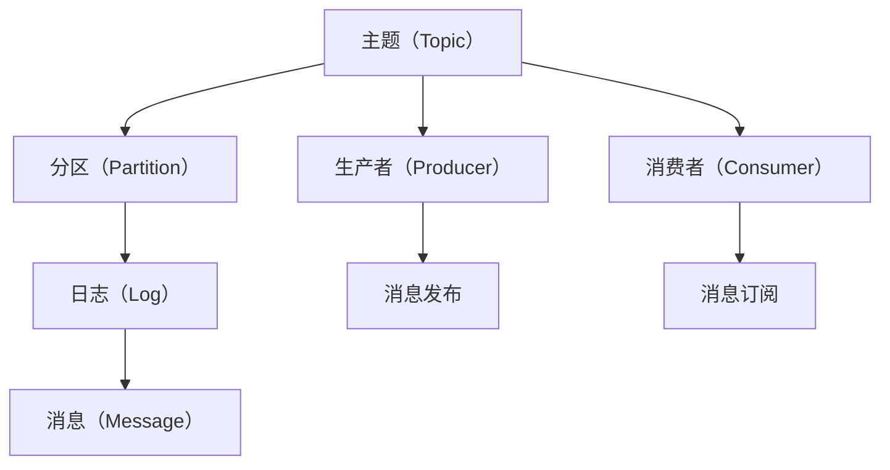

                 

# Kafka生产者消费者API原理与代码实例讲解

> 关键词：Kafka, 生产者, 消费者, API, 原理, 代码实例

## 1. 背景介绍

在现代互联网和微服务架构中，数据流处理变得越来越重要。Kafka作为一个高性能的分布式流处理平台，已经成为大数据生态系统中不可或缺的一部分。它的高吞吐量、低延迟和可扩展性特点，使其成为企业级应用中数据采集、存储、传输和分析的理想解决方案。本文将全面解析Kafka的生产者和消费者API，深入探讨其实现原理和应用场景，并通过代码实例，让您轻松理解如何构建和使用Kafka的流处理系统。

## 2. 核心概念与联系

### 2.1 核心概念概述

- **Kafka**：Apache Kafka是一个分布式流处理平台，支持高吞吐量的实时数据传输，被广泛应用于日志收集、事件驱动架构、数据管道等场景。
- **Kafka生产者**：负责将数据发布到Kafka主题中的消费者。
- **Kafka消费者**：从Kafka主题中订阅数据并处理。
- **Kafka API**：Kafka提供的编程接口，包括生产者API和消费者API，用于实现数据的发布和订阅。
- **分区（Partition）**：Kafka主题被分割为多个分区，每个分区是一个有序的数据流，便于并行处理和扩展。
- **消息（Message）**：Kafka中传输的基本单位，包含了键值对数据。
- **日志（Log）**：每个分区维护一个有序的日志，包含了所有已发布的消息。

### 2.2 核心概念间的关系

Kafka的流处理体系由以下几个核心组件构成：



- **主题（Topic）**：Kafka数据流的基本单位，每个主题可以包含多个分区。
- **分区（Partition）**：每个分区是主题的一部分，包含了有序的消息序列。
- **日志（Log）**：每个分区维护一个日志，包含了所有已发布的消息。
- **消息（Message）**：消息是Kafka中传输的基本单位，包含了键值对数据。
- **生产者（Producer）**：负责将数据发布到Kafka主题中。
- **消费者（Consumer）**：从Kafka主题中订阅数据并处理。

通过这些核心组件的相互配合，Kafka构建了一个高效可靠的数据流处理系统，支持高吞吐量的数据传输和处理。

## 3. 核心算法原理 & 具体操作步骤
### 3.1 算法原理概述

Kafka的生产者和消费者API基于发布/订阅（Publish/Subscribe）模型。生产者负责将数据发布到Kafka主题中，而消费者则从指定主题中订阅数据并进行处理。

Kafka的消息模型采用Pull模式，即消费者主动从Kafka服务器中拉取数据。消费者从指定分区中获取数据时，Kafka服务器返回该分区中尚未被处理的消息。当分区的所有消息都被处理完毕时，Kafka服务器返回空数据。

Kafka的消息分区策略使得每个主题可以拥有多个分区，从而支持高吞吐量和水平扩展。同时，通过分区，Kafka实现了数据的可靠性和容错性，即使部分分区出现故障，整个系统仍然可以正常运行。

### 3.2 算法步骤详解

#### 3.2.1 生产者API步骤详解

1. **创建生产者实例**：首先，需要创建一个Kafka生产者实例，指定Kafka服务器地址、主题名称以及是否需要自动创建主题。
2. **发送消息**：将消息序列化为二进制格式，并通过send方法发送到指定主题的分区。
3. **关闭生产者**：完成数据发送后，需要关闭生产者实例，以释放资源。

#### 3.2.2 消费者API步骤详解

1. **创建消费者实例**：创建一个Kafka消费者实例，指定Kafka服务器地址、主题名称、分区列表、消费偏移量等参数。
2. **拉取数据**：通过subscribe方法订阅主题，并使用poll方法拉取数据。pull方法会阻塞，直到有新的消息到来或者定时器超时。
3. **处理消息**：对拉取到的消息进行处理，包括键值对的解析、数据处理等。
4. **提交消费偏移量**：使用commit方法提交消费偏移量，以便下一次从正确的位置继续消费。
5. **关闭消费者**：完成数据处理后，需要关闭消费者实例，以释放资源。

### 3.3 算法优缺点

#### 3.3.1 优点

- **高吞吐量**：Kafka采用Pull模式，消费者主动拉取数据，可以支持高吞吐量的数据传输。
- **可扩展性**：Kafka的主题可以划分为多个分区，支持水平扩展。
- **可靠性**：Kafka通过副本机制和分区日志，确保数据的可靠性和容错性。
- **异步处理**：Kafka的生产者和消费者API采用异步处理模式，提高了系统的性能。

#### 3.3.2 缺点

- **复杂性**：Kafka的配置和部署相对复杂，需要一定的学习成本。
- **数据一致性**：Kafka的分散式架构可能导致数据一致性问题，需要开发者注意处理。
- **资源消耗**：Kafka的生产者和消费者API需要占用一定的计算资源，包括内存、CPU等。

### 3.4 算法应用领域

Kafka的生产者和消费者API在实际应用中，广泛应用于以下领域：

- **日志收集**：Kafka常用于收集和聚合日志数据，支持高吞吐量的日志采集和存储。
- **事件驱动架构**：Kafka可以构建事件驱动架构，支持异步事件处理和微服务间的通信。
- **数据管道**：Kafka支持高效的数据传输和处理，可以作为数据管道连接不同的系统和组件。
- **实时数据处理**：Kafka可以与Spark、Flink等流处理框架结合，支持实时数据处理和分析。

## 4. 数学模型和公式 & 详细讲解 & 举例说明

### 4.1 数学模型构建

Kafka的流处理系统可以通过以下数学模型来描述：

- **生产者模型**：生产者将数据以消息的形式发布到Kafka主题中。每个消息包含一个键值对数据，由生产者实例序列化。
- **消费者模型**：消费者从Kafka主题中拉取数据，并对消息进行处理。消费者实例维护一个消费偏移量，用于记录已经处理的消息。

### 4.2 公式推导过程

#### 4.2.1 生产者模型

假设生产者实例的总数为$N$，每个实例每秒生产$x_i$条消息，那么每秒生产的消息总数为$N\sum_{i=1}^Nx_i$。

#### 4.2.2 消费者模型

假设消费者实例的总数为$M$，每个实例每秒处理$y_i$条消息，那么每秒处理的消息总数为$M\sum_{i=1}^My_i$。

### 4.3 案例分析与讲解

假设某个主题包含10个分区，每个分区包含10000条消息。如果生产者每秒生产100条消息，消费者每秒处理100条消息，则每秒生产和处理的总消息数为：

$$N\sum_{i=1}^Nx_i=M\sum_{i=1}^My_i=10 \times 10000 \times 100 = 10^7$$

这意味着，Kafka的流处理系统每秒可以处理100万条消息，具有极高的吞吐量。

## 5. 项目实践：代码实例和详细解释说明

### 5.1 开发环境搭建

Kafka的开发环境搭建需要安装JDK、Kafka、Zookeeper等软件，并配置环境变量。具体步骤如下：

1. **安装JDK**：从Oracle或OpenJDK官网下载JDK，并设置JAVA_HOME环境变量。
2. **安装Kafka**：从Kafka官网下载最新版本的Kafka，并解压到指定目录。
3. **启动Zookeeper**：Zookeeper是Kafka的分布式协调服务，需要启动Zookeeper服务。
4. **启动Kafka**：启动Kafka服务器和Broker，指定主题和分区等配置参数。
5. **编写测试代码**：编写Java代码，使用Kafka的生产者和消费者API进行数据传输和处理。

### 5.2 源代码详细实现

#### 5.2.1 生产者代码

```java
import org.apache.kafka.clients.producer.KafkaProducer;
import org.apache.kafka.clients.producer.ProducerRecord;
import org.apache.kafka.common.serialization.StringSerializer;

public class KafkaProducerExample {
    public static void main(String[] args) {
        String brokers = "localhost:9092";
        String topic = "test-topic";
        String key = "key";
        String value = "value";
        
        KafkaProducer<String, String> producer = new KafkaProducer<String, String>(new Properties().put("bootstrap.servers", brokers).put("key.serializer", StringSerializer.class).put("value.serializer", StringSerializer.class));
        
        producer.send(new ProducerRecord<String, String>(topic, key, value));
        
        producer.close();
    }
}
```

#### 5.2.2 消费者代码

```java
import org.apache.kafka.clients.consumer.ConsumerRecord;
import org.apache.kafka.clients.consumer.ConsumerRecords;
import org.apache.kafka.clients.consumer.KafkaConsumer;
import org.apache.kafka.clients.consumer.OffsetResetStrategy;
import org.apache.kafka.common.serialization.StringDeserializer;

public class KafkaConsumerExample {
    public static void main(String[] args) {
        String brokers = "localhost:9092";
        String topic = "test-topic";
        String key = "key";
        String value = "value";
        
        KafkaConsumer<String, String> consumer = new KafkaConsumer<String, String>(new Properties().put("bootstrap.servers", brokers).put("group.id", "test-group").put("key.deserializer", StringDeserializer.class).put("value.deserializer", StringDeserializer.class).put("auto.offset.reset", OffsetResetStrategy.EARLIEST.name()));
        
        while (true) {
            ConsumerRecords<String, String> records = consumer.poll(1000);
            for (ConsumerRecord<String, String> record : records) {
                System.out.println("Key: " + record.key() + ", Value: " + record.value());
                // 处理消息逻辑
            }
        }
        
        consumer.close();
    }
}
```

### 5.3 代码解读与分析

#### 5.3.1 生产者代码解释

1. **创建生产者实例**：通过KafkaProducer类创建一个生产者实例，指定Kafka服务器地址和主题名称。
2. **发送消息**：使用send方法将消息序列化为字符串，发送到指定主题的分区。
3. **关闭生产者**：使用close方法关闭生产者实例，以释放资源。

#### 5.3.2 消费者代码解释

1. **创建消费者实例**：通过KafkaConsumer类创建一个消费者实例，指定Kafka服务器地址、消费者组ID和主题名称。
2. **拉取数据**：使用poll方法从指定主题中拉取数据，拉取时间间隔为1000毫秒。
3. **处理消息**：对拉取到的消息进行处理，包括键值对的解析、数据处理等。
4. **提交消费偏移量**：使用commit方法提交消费偏移量，以便下一次从正确的位置继续消费。
5. **关闭消费者**：使用close方法关闭消费者实例，以释放资源。

### 5.4 运行结果展示

运行上述代码后，可以通过日志查看生产者和消费者之间的数据交互。生产者发送的消息将被消费者拉取并进行处理，实现了数据的发布和订阅。

## 6. 实际应用场景

Kafka的生产者和消费者API在实际应用中，广泛应用于以下领域：

- **日志收集**：Kafka常用于收集和聚合日志数据，支持高吞吐量的日志采集和存储。
- **事件驱动架构**：Kafka可以构建事件驱动架构，支持异步事件处理和微服务间的通信。
- **数据管道**：Kafka支持高效的数据传输和处理，可以作为数据管道连接不同的系统和组件。
- **实时数据处理**：Kafka可以与Spark、Flink等流处理框架结合，支持实时数据处理和分析。

## 7. 工具和资源推荐

### 7.1 学习资源推荐

- **Kafka官方文档**：Kafka官方文档提供了详细的API文档和使用指南，是学习Kafka的重要资源。
- **Kafka权威指南**：《Kafka权威指南》一书是学习Kafka的经典参考书，内容全面且深入。
- **Kafka高级编程**：《Kafka高级编程》一书深入解析了Kafka的内部机制和实现原理，适合进阶学习。

### 7.2 开发工具推荐

- **Kafka客户端工具**：Kafka客户端工具是连接Kafka集群的重要工具，包括Kafka命令行工具、KafkaREST、KafkaTool等。
- **Kafka管理工具**：Kafka管理工具可以用于监控和管理Kafka集群，包括Kafka Manager、Confluent Control Center等。
- **Kafka图形界面**：Kafka图形界面提供了可视化操作界面，方便对Kafka集群进行管理。

### 7.3 相关论文推荐

- **Kafka: A Real-Time Distributed Streaming Platform**：Kafka的原始论文，介绍了Kafka的设计思想和实现原理。
- **Kafka: High-Performance Data Pipelines**：Kafka的高级编程书籍，详细解析了Kafka的内部机制和实现原理。
- **Real-Time Data Processing with Apache Kafka**：Apache Kafka的官方文档，提供了详细的API文档和使用指南。

## 8. 总结：未来发展趋势与挑战

### 8.1 研究成果总结

Kafka的生产者和消费者API作为Apache Kafka的核心组件，在流处理领域具有重要地位。经过多年的发展，Kafka已经成为大数据生态系统中不可或缺的一部分，广泛应用于日志收集、事件驱动架构、数据管道等领域。

### 8.2 未来发展趋势

Kafka的未来发展趋势主要集中在以下几个方面：

- **增强的可扩展性**：Kafka将继续优化其可扩展性，支持更大规模的集群和更高的吞吐量。
- **提升的可靠性**：Kafka将进一步提升其可靠性，支持更多的容错机制和数据一致性协议。
- **完善的安全性**：Kafka将加强其安全性，支持更强的数据加密和访问控制。
- **支持更多数据源**：Kafka将支持更多数据源和格式，扩展其应用场景。

### 8.3 面临的挑战

Kafka的生产者和消费者API在实际应用中，仍然面临以下挑战：

- **复杂性**：Kafka的配置和部署相对复杂，需要一定的学习成本。
- **数据一致性**：Kafka的分散式架构可能导致数据一致性问题，需要开发者注意处理。
- **资源消耗**：Kafka的生产者和消费者API需要占用一定的计算资源，包括内存、CPU等。

### 8.4 研究展望

未来，Kafka的生产者和消费者API需要在以下几个方面进行研究和改进：

- **简化配置和部署**：优化Kafka的配置和部署流程，降低学习成本和部署难度。
- **提升性能和效率**：优化Kafka的性能和效率，支持更高的吞吐量和更低的延迟。
- **增强可扩展性**：支持更多的数据源和格式，扩展其应用场景。

总之，Kafka的生产者和消费者API将在未来继续发展和完善，为数据流处理和微服务架构提供更高效、更可靠、更安全的解决方案。

## 9. 附录：常见问题与解答

**Q1：Kafka生产者API和消费者API有什么区别？**

A: Kafka生产者API用于将数据发布到Kafka主题中，消费者API用于从指定主题中拉取数据并处理。生产者负责数据的产生和发布，而消费者负责数据的消费和处理。

**Q2：Kafka的生产者和消费者如何保证数据一致性？**

A: Kafka通过分区和副本机制来保证数据一致性。每个主题被划分为多个分区，每个分区包含一个有序的日志。同时，每个分区可以配置多个副本，保证数据的可靠性和容错性。

**Q3：Kafka的生产者和消费者API如何使用？**

A: 使用Kafka的生产者和消费者API，需要首先创建一个实例，指定Kafka服务器地址和主题名称。然后，使用send方法将数据发布到主题中，或使用poll方法拉取数据进行处理。最后，使用close方法关闭实例，以释放资源。

通过本文的系统讲解，相信您对Kafka的生产者和消费者API有了全面深入的了解。在实际应用中，通过合理使用Kafka的流处理系统，可以轻松构建高效可靠的数据流处理架构，实现数据的实时采集、传输和分析，为您的业务带来更高的价值。

