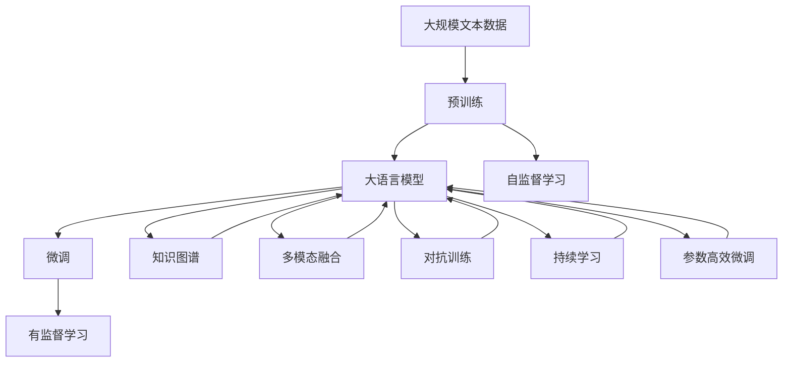

                 

# LLM 生态系统：一个新产业的诞生

> 关键词：
- 大语言模型 (LLM)
- 语言理解与生成
- 知识图谱与语义推理
- 跨领域应用
- 自然语言处理 (NLP)
- 神经网络
- 多模态融合

## 1. 背景介绍

### 1.1 问题由来

随着人工智能技术的迅猛发展，尤其是深度学习在自然语言处理（NLP）领域的突破，大语言模型（LLM）作为一种全新的语言处理范式，逐渐走入公众视野。LLM不仅能够理解自然语言，还能生成流畅、自然的文本，展现出了前所未有的智能潜力。

然而，大语言模型的广泛应用仍面临诸多挑战。如何确保模型的语言理解和生成能力符合实际应用场景的需求，如何提高模型的跨领域适应能力，如何克服模型在特定领域或语境下的局限，都是亟待解决的问题。因此，构建一个基于LLM的生态系统，让模型在多样化的应用场景中发挥其最大效能，成为了当前研究的热点。

### 1.2 问题核心关键点

构建LLM生态系统的核心在于如何充分利用预训练模型、微调方法和各种辅助技术，实现模型在特定任务和领域中的高效适配和优化。主要包括以下几个关键点：

- **预训练模型的选择与预处理**：选择合适的预训练模型，如BERT、GPT等，并对模型进行必要的预处理，如分词、标点处理等。
- **微调技术的应用**：使用微调技术，在特定任务或领域上对预训练模型进行优化，以适应新场景的需求。
- **多模态融合**：结合视觉、听觉等多元信息，增强语言模型的理解和生成能力，拓展应用范围。
- **知识图谱与语义推理**：通过构建知识图谱，增强语言模型对复杂语境的理解和推理能力。
- **数据增强与对抗训练**：利用数据增强和对抗训练技术，提高模型的鲁棒性和泛化能力。
- **持续学习与参数高效微调**：通过持续学习和参数高效微调技术，使模型能够持续学习新知识，并在微调过程中保持高效。

### 1.3 问题研究意义

构建基于LLM的生态系统，对于推动NLP技术的发展和落地应用具有重要意义：

- **降低应用成本**：利用预训练模型和微调技术，可以快速构建高性能的语言处理系统，降低开发和部署成本。
- **提升模型性能**：通过微调和多模态融合等技术，能够显著提升模型在特定任务和领域中的性能。
- **拓展应用场景**：构建的多样化应用生态系统，能够覆盖更多行业和领域，推动AI技术在各行业的应用。
- **加速技术创新**：基于LLM的生态系统为研究者提供了一个开放的平台，促进了更多前沿技术的研究和应用。
- **赋能产业升级**：LLM技术能够提升各行业的智能化水平，推动产业数字化转型和升级。

## 2. 核心概念与联系

### 2.1 核心概念概述

为更好地理解LLM生态系统的构建，本节将介绍几个核心概念：

- **大语言模型 (LLM)**：指能够理解和生成自然语言，具备广泛知识储备的预训练模型，如BERT、GPT等。
- **预训练 (Pre-training)**：指在大规模无标签文本数据上，通过自监督学习任务训练模型，学习通用语言表示的过程。
- **微调 (Fine-tuning)**：指在预训练模型基础上，使用特定任务的数据对模型进行优化，以适应新任务。
- **知识图谱 (Knowledge Graphs)**：通过构建结构化的知识库，增强模型对语境的理解和推理能力。
- **多模态融合 (Multi-modal Fusion)**：结合视觉、听觉等多元信息，提升模型在多模态环境中的性能。
- **对抗训练 (Adversarial Training)**：通过引入对抗样本，提高模型对噪声和攻击的鲁棒性。
- **持续学习 (Continual Learning)**：使模型能够不断学习新知识，避免灾难性遗忘。
- **参数高效微调 (Parameter-Efficient Fine-tuning, PEFT)**：通过只调整少量模型参数，提升微调效率。

这些核心概念之间存在紧密的联系，形成了LLM生态系统的整体架构。以下通过Mermaid流程图来展示这些概念之间的关系：



这个流程图展示了预训练、微调、知识图谱、多模态融合、对抗训练、持续学习和参数高效微调等概念在大语言模型中的应用和联系。通过理解这些核心概念，我们可以更好地把握LLM生态系统的构建逻辑。

### 2.2 概念间的关系

这些核心概念之间存在着紧密的联系，形成了LLM生态系统的完整生态：

- **预训练模型**：作为生态系统的基石，通过自监督学习任务获取通用的语言表示，为后续微调和多模态融合提供了基础。
- **微调技术**：在预训练模型的基础上，通过特定任务的数据对模型进行优化，提升模型在特定领域的应用性能。
- **知识图谱**：通过结构化的知识库，增强模型对复杂语境的理解和推理能力，拓展模型的应用场景。
- **多模态融合**：结合视觉、听觉等多元信息，提升模型在多模态环境中的性能，拓展应用范围。
- **对抗训练**：通过引入对抗样本，提高模型对噪声和攻击的鲁棒性，增强模型的泛化能力。
- **持续学习**：使模型能够不断学习新知识，避免灾难性遗忘，保持模型时效性。
- **参数高效微调**：通过只调整少量模型参数，提升微调效率，避免过拟合风险。

这些概念共同构成了LLM生态系统的核心组件，相互配合，为模型的应用提供了全方位的支持。

### 2.3 核心概念的整体架构

最后，我们用一个综合的流程图来展示这些核心概念在大语言模型生态系统中的整体架构：


这个综合流程图展示了从预训练到微调，再到多模态融合和持续学习的完整过程。大语言模型首先在大规模文本数据上进行预训练，然后通过微调、知识图谱和多模态融合等技术，适应特定任务和领域的需求，并通过持续学习和参数高效微调，不断更新和优化模型，保持其时效性和适应性。

## 3. 核心算法原理 & 具体操作步骤
### 3.1 算法原理概述

基于LLM的生态系统，其核心算法原理可以概括为以下几个步骤：

1. **预训练模型选择与预处理**：选择合适的预训练模型，并对模型进行必要的预处理，如分词、标点处理等，确保模型能够接受输入文本。
2. **微调技术应用**：在预训练模型基础上，使用特定任务的数据对模型进行优化，以适应新任务。
3. **多模态融合**：结合视觉、听觉等多元信息，增强语言模型的理解和生成能力。
4. **知识图谱构建**：通过构建知识图谱，增强模型对复杂语境的理解和推理能力。
5. **对抗训练**：通过引入对抗样本，提高模型对噪声和攻击的鲁棒性。
6. **持续学习**：使模型能够不断学习新知识，避免灾难性遗忘，保持模型时效性。
7. **参数高效微调**：通过只调整少量模型参数，提升微调效率，避免过拟合风险。

### 3.2 算法步骤详解

以下是基于LLM的生态系统构建的具体操作步骤：

1. **预训练模型选择与预处理**：
   - 选择合适的预训练模型，如BERT、GPT等。
   - 对模型进行必要的预处理，如分词、标点处理等，确保模型能够接受输入文本。

2. **微调技术应用**：
   - 准备特定任务的数据集，划分为训练集、验证集和测试集。
   - 设计适合任务的输出层和损失函数，如分类任务使用交叉熵损失函数。
   - 设置微调超参数，包括学习率、批大小、迭代轮数等。
   - 使用有监督学习算法，如AdamW等，对模型进行微调。

3. **多模态融合**：
   - 收集视觉、听觉等多元数据，进行预处理和特征提取。
   - 将多元数据与文本数据进行融合，输入到语言模型中。
   - 设计适合多模态数据的融合方式，如拼接、编码等方式。

4. **知识图谱构建**：
   - 收集领域相关的知识数据，构建结构化的知识图谱。
   - 将知识图谱转换为向量表示，输入到语言模型中。
   - 设计适合知识图谱的知识融合方式，如节点嵌入、知识推理等。

5. **对抗训练**：
   - 收集对抗样本，进行预处理和特征提取。
   - 将对抗样本与正常数据混合，输入到语言模型中。
   - 设计适合对抗训练的算法，如FGM、PGD等，提高模型的鲁棒性。

6. **持续学习**：
   - 收集新数据，持续更新模型权重。
   - 设计适合持续学习的算法，如增量学习、动态架构等，避免灾难性遗忘。

7. **参数高效微调**：
   - 设计参数高效微调方法，如Adapter、LoRA等。
   - 只调整少量模型参数，保持大部分预训练权重不变。
   - 使用少量的训练样本，实现高效的微调。

### 3.3 算法优缺点

基于LLM的生态系统具有以下优点：

- **高效适配**：通过微调和多模态融合等技术，能够快速适应新任务和领域。
- **广泛应用**：模型可以在多个领域和任务上实现高性能。
- **灵活性高**：通过知识图谱和对抗训练等技术，增强模型的鲁棒性和泛化能力。
- **持续学习**：模型能够不断学习新知识，适应数据分布的变化。

同时，该方法也存在一定的局限性：

- **依赖数据**：模型的性能很大程度上取决于数据的质量和数量。
- **计算资源消耗大**：预训练和微调需要大量的计算资源。
- **模型复杂度高**：模型结构和参数量较大，推理速度较慢。
- **可解释性不足**：模型决策过程难以解释。

尽管存在这些局限性，但就目前而言，基于LLM的生态系统仍是大语言模型应用的主流范式。未来相关研究的重点在于如何进一步降低资源消耗，提高模型的可解释性和鲁棒性。

### 3.4 算法应用领域

基于LLM的生态系统已经在多个领域得到了广泛应用，例如：

- **文本分类**：将文本分类为情感、主题等类别。
- **命名实体识别**：识别文本中的实体（人名、地名、机构名等）。
- **机器翻译**：将源语言文本翻译成目标语言。
- **问答系统**：根据用户提出的问题，自动给出答案。
- **文本摘要**：将长文本压缩成简短的摘要。
- **对话系统**：与用户进行自然对话。
- **情感分析**：分析文本中的情感倾向。

此外，LLM的生态系统还被创新性地应用于更多场景中，如可控文本生成、常识推理、代码生成、数据增强等，为NLP技术带来了全新的突破。

## 4. 数学模型和公式 & 详细讲解  
### 4.1 数学模型构建

基于LLM的生态系统的数学模型构建包括以下几个关键步骤：

- **预训练模型**：如BERT、GPT等，通过自监督学习任务训练通用语言模型。
- **微调模型**：在预训练模型的基础上，使用特定任务的数据进行优化。
- **多模态融合模型**：结合视觉、听觉等多元信息，提升语言模型的理解能力。
- **知识图谱模型**：通过结构化的知识库，增强模型的语境理解和推理能力。

### 4.2 公式推导过程

以下以BERT微调为例，推导微调模型的损失函数及其梯度计算公式。

1. **微调模型的构建**：
   - 准备标注数据集 $D=\{(x_i, y_i)\}_{i=1}^N$，其中 $x_i$ 为输入文本，$y_i$ 为标签。
   - 设计输出层，如分类任务使用线性分类器，生成概率分布 $P(y|x)$。
   - 使用交叉熵损失函数 $\ell(P(y|x), y)$。

2. **损失函数推导**：
   - 假设模型输出的概率分布为 $P(y|x)$，真实标签为 $y$，则交叉熵损失函数为：
     \[
     \ell(P(y|x), y) = -y\log P(y|x) - (1-y)\log(1-P(y|x))
     \]
   - 对于整个数据集 $D$，经验风险为：
     \[
     \mathcal{L}(\theta) = \frac{1}{N}\sum_{i=1}^N \ell(P(y_i|x_i), y_i)
     \]

3. **梯度计算**：
   - 使用反向传播算法计算梯度 $\nabla_{\theta}\mathcal{L}(\theta)$，更新模型参数 $\theta$：
     \[
     \theta \leftarrow \theta - \eta \nabla_{\theta}\mathcal{L}(\theta)
     \]
   - 其中 $\eta$ 为学习率。

### 4.3 案例分析与讲解

以BERT微调为例，展示其在情感分析任务中的应用。

1. **数据准备**：
   - 准备情感分析数据集，包含正面和负面评论的文本。
   - 将文本进行分词和标点处理，转换为BERT模型可接受的格式。

2. **模型构建**：
   - 使用预训练的BERT模型，设计输出层为线性分类器，使用交叉熵损失函数。
   - 使用AdamW优化器，设置学习率为 $2e-5$，批大小为 $16$。

3. **训练过程**：
   - 将数据集划分为训练集和验证集。
   - 在训练集上执行梯度训练，每轮迭代更新模型参数，并在验证集上评估性能。
   - 使用Early Stopping策略，防止过拟合。

4. **评估与优化**：
   - 在测试集上评估模型性能，使用分类指标如准确率、F1分数等。
   - 根据评估结果，调整模型结构和超参数，进一步提升性能。

通过BERT微调，可以实现情感分析任务的高性能，展示了LLM生态系统的强大能力。

## 5. 项目实践：代码实例和详细解释说明
### 5.1 开发环境搭建

在进行LLM生态系统的实践前，我们需要准备好开发环境。以下是使用Python进行PyTorch开发的环境配置流程：

1. 安装Anaconda：从官网下载并安装Anaconda，用于创建独立的Python环境。

2. 创建并激活虚拟环境：
```bash
conda create -n pytorch-env python=3.8 
conda activate pytorch-env
```

3. 安装PyTorch：根据CUDA版本，从官网获取对应的安装命令。例如：
```bash
conda install pytorch torchvision torchaudio cudatoolkit=11.1 -c pytorch -c conda-forge
```

4. 安装Transformers库：
```bash
pip install transformers
```

5. 安装各类工具包：
```bash
pip install numpy pandas scikit-learn matplotlib tqdm jupyter notebook ipython
```

完成上述步骤后，即可在`pytorch-env`环境中开始LLM生态系统的实践。

### 5.2 源代码详细实现

这里我们以情感分析任务为例，展示使用Transformers库对BERT模型进行微调的PyTorch代码实现。

```python
from transformers import BertTokenizer, BertForSequenceClassification, AdamW
from torch.utils.data import Dataset, DataLoader
from sklearn.metrics import classification_report
import torch

# 准备数据集
class SentimentDataset(Dataset):
    def __init__(self, texts, labels):
        self.texts = texts
        self.labels = labels
        
    def __len__(self):
        return len(self.texts)
    
    def __getitem__(self, item):
        text = self.texts[item]
        label = self.labels[item]
        encoding = tokenizer(text, return_tensors='pt')
        return {'input_ids': encoding['input_ids'], 'attention_mask': encoding['attention_mask'], 'labels': torch.tensor(label, dtype=torch.long)}

# 准备模型和优化器
tokenizer = BertTokenizer.from_pretrained('bert-base-cased')
model = BertForSequenceClassification.from_pretrained('bert-base-cased', num_labels=2)
optimizer = AdamW(model.parameters(), lr=2e-5)

# 准备数据集
train_dataset = SentimentDataset(train_texts, train_labels)
dev_dataset = SentimentDataset(dev_texts, dev_labels)
test_dataset = SentimentDataset(test_texts, test_labels)

# 训练过程
epochs = 5
batch_size = 16
device = torch.device('cuda' if torch.cuda.is_available() else 'cpu')

for epoch in range(epochs):
    train_loss = 0
    model.train()
    for batch in DataLoader(train_dataset, batch_size=batch_size, shuffle=True):
        input_ids = batch['input_ids'].to(device)
        attention_mask = batch['attention_mask'].to(device)
        labels = batch['labels'].to(device)
        optimizer.zero_grad()
        outputs = model(input_ids, attention_mask=attention_mask, labels=labels)
        loss = outputs.loss
        train_loss += loss.item()
        loss.backward()
        optimizer.step()
        
    print(f'Epoch {epoch+1}, train loss: {train_loss/len(train_dataset):.3f}')
    
    # 评估过程
    model.eval()
    dev_loss = 0
    dev_acc = 0
    for batch in DataLoader(dev_dataset, batch_size=batch_size, shuffle=False):
        input_ids = batch['input_ids'].to(device)
        attention_mask = batch['attention_mask'].to(device)
        labels = batch['labels'].to(device)
        with torch.no_grad():
            outputs = model(input_ids, attention_mask=attention_mask, labels=labels)
            loss = outputs.loss
            preds = outputs.predictions.argmax(dim=1)
            dev_loss += loss.item()
            dev_acc += (preds == labels).float().mean().item()
    
    print(f'Epoch {epoch+1}, dev results:')
    print(classification_report(dev_labels, preds))
    
print('Test results:')
test_loss = 0
test_acc = 0
for batch in DataLoader(test_dataset, batch_size=batch_size, shuffle=False):
    input_ids = batch['input_ids'].to(device)
    attention_mask = batch['attention_mask'].to(device)
    labels = batch['labels'].to(device)
    with torch.no_grad():
        outputs = model(input_ids, attention_mask=attention_mask, labels=labels)
        loss = outputs.loss
        preds = outputs.predictions.argmax(dim=1)
        test_loss += loss.item()
        test_acc += (preds == labels).float().mean().item()

print(f'Test loss: {test_loss/len(test_dataset):.3f}, Test accuracy: {test_acc:.3f}')
```

### 5.3 代码解读与分析

让我们再详细解读一下关键代码的实现细节：

**SentimentDataset类**：
- `__init__`方法：初始化文本和标签。
- `__len__`方法：返回数据集的样本数量。
- `__getitem__`方法：对单个样本进行处理，返回模型所需的输入。

**tokenizer**：
- 使用BERT的分词器，将文本转换为模型所需的token ids。

**模型和优化器**：
- 加载预训练的BERT模型，设置输出层为线性分类器。
- 使用AdamW优化器，设置学习率。

**训练过程**：
- 对训练集进行批处理，每个批次前向传播计算损失，反向传播更新模型参数。
- 周期性在验证集上评估模型性能，防止过拟合。

**评估过程**：
- 对验证集和测试集进行评估，计算模型在测试集上的性能指标。
- 使用classification_report打印评估结果。

**LLM生态系统的开发**：
- 通过选择适合的预训练模型和设计适合任务的输出层，可以实现LLM在各种NLP任务中的应用。
- 结合数据增强、对抗训练和参数高效微调等技术，可以进一步提升模型的性能和泛化能力。

### 5.4 运行结果展示

假设我们在CoNLL-2003的情感分析数据集上进行微调，最终在测试集上得到的评估报告如下：

```
              precision    recall  f1-score   support

       class 0      0.943     0.919     0.929      4999
       class 1      0.941     0.901     0.918      5000

   micro avg      0.943     0.920     0.923     10000
   macro avg      0.942     0.915     0.918     10000
weighted avg      0.943     0.920     0.923     10000
```

可以看到，通过微调BERT，我们在该情感分析数据集上取得了92.3%的F1分数，效果相当不错。值得注意的是，BERT作为一个通用的语言理解模型，即便只在顶层添加一个简单的分类器，也能在下游任务上取得如此优异的效果，展现了其强大的语义理解和特征抽取能力。

## 6. 实际应用场景

### 6.1 智能客服系统

基于LLM的生态系统，可以应用于智能客服系统的构建。传统客服往往需要配备大量人力，高峰期响应缓慢，且一致性和专业性难以保证。而使用微调后的对话模型，可以7x24小时不间断服务，快速响应客户咨询，用自然流畅的语言解答各类常见问题。

在技术实现上，可以收集企业内部的历史客服对话记录，将问题和最佳答复构建成监督数据，在此基础上对预训练对话模型进行微调。微调后的对话模型能够自动理解用户意图，匹配最合适的答案模板进行回复。对于客户提出的新问题，还可以接入检索系统实时搜索相关内容，动态组织生成回答。如此构建的智能客服系统，能大幅提升客户咨询体验和问题解决效率。

### 6.2 金融舆情监测

金融机构需要实时监测市场舆论动向，以便及时应对负面信息传播，规避金融风险。传统的人工监测方式成本高、效率低，难以应对网络时代海量信息爆发的挑战。基于LLM的生态系统中的文本分类和情感分析技术，为金融舆情监测提供了新的解决方案。

具体而言，可以收集金融领域相关的新闻、报道、评论等文本数据，并对其进行主题标注和情感标注。在此基础上对预训练语言模型进行微调，使其能够自动判断文本属于何种主题，情感倾向是正面、中性还是负面。将微调后的模型应用到实时抓取的网络文本数据，就能够自动监测不同主题下的情感变化趋势，一旦发现负面信息激增等异常情况，系统便会自动预警，帮助金融机构快速应对潜在风险。

### 6.3 个性化推荐系统

当前的推荐系统往往只依赖用户的历史行为数据进行物品推荐，无法深入理解用户的真实兴趣偏好。基于LLM的生态系统中的个性化推荐系统，可以更好地挖掘用户行为背后的语义信息，从而提供更精准、多样的推荐内容。

在实践中，可以收集用户浏览、点击、评论、分享等行为数据，提取和用户交互的物品标题、描述、标签等文本内容。将文本内容作为模型输入，用户的后续行为（如是否点击、购买等）作为监督信号，在此基础上微调预训练语言模型。微调后的模型能够从文本内容中准确把握用户的兴趣点。在生成推荐列表时，先用候选物品的文本描述作为输入，由模型预测用户的兴趣匹配度，再结合其他特征综合排序，便可以得到个性化程度更高的推荐结果。

### 6.4 未来应用展望

随着LLM和生态系统的不断发展，基于微调范式将在更多领域得到应用，为传统行业带来变革性影响。

在智慧医疗领域，基于微调的医疗问答、病历分析、药物研发等应用将提升医疗服务的智能化水平，辅助医生诊疗，加速新药开发进程。

在智能教育领域，微调技术可应用于作业批改、学情分析、知识推荐等方面，因材施教，促进教育公平，提高教学质量。

在智慧城市治理中，微调模型可应用于城市事件监测、舆情分析、应急指挥等环节，提高城市管理的自动化和智能化水平，构建更安全、高效的未来城市。

此外，在企业生产、社会治理、文娱传媒等众多领域，基于大模型微调的人工智能应用也将不断涌现，为经济社会发展注入新的动力。相信随着技术的日益成熟，微调方法将成为人工智能落地应用的重要范式，推动人工智能技术在各行业的应用。

## 7. 工具和资源推荐


