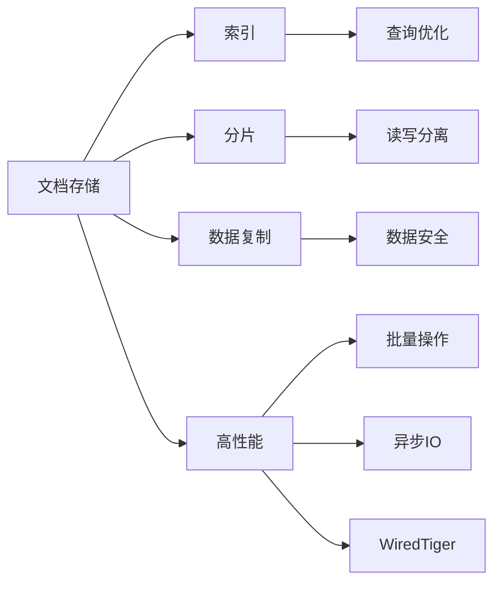

                 

# MongoDB原理与代码实例讲解

> 关键词：MongoDB, 数据库, 文档存储, 查询优化, 索引, 事务, 分片, 读写分离, 数据复制, 数据安全, 高性能

## 1. 背景介绍

MongoDB作为一种现代NoSQL数据库，以其高效、灵活的文档存储和强大的查询优化能力，广泛应用于互联网企业、大数据分析等领域。本博客旨在从原理出发，深入浅出地介绍MongoDB的核心概念和架构设计，并通过代码实例演示其功能，使读者能够掌握其基本操作和优化技巧。

## 2. 核心概念与联系

### 2.1 核心概念概述

- **MongoDB**: 一款基于文档存储的非关系型数据库，支持动态模式和丰富的查询语言。
- **文档存储**: 存储以JSON格式表示的文档，每个文档包含一个唯一的ID和一组键值对。
- **索引**: 用于加速查询的辅助数据结构，包括单字段索引、复合索引、全文索引等。
- **分片**: 通过分布式存储和查询，水平扩展MongoDB实例，提高可用性和性能。
- **事务**: MongoDB从版本4.0开始支持多文档事务，用于跨文档的一致性操作。
- **读写分离**: 通过分主从模式，提高MongoDB实例的读性能。
- **数据复制**: 自动化的数据备份和恢复机制，确保数据的安全性和可用性。
- **数据安全**: 支持TLS加密、身份认证、访问控制等安全特性。
- **高性能**: 设计了丰富的优化机制，包括批量操作、异步IO、WiredTiger存储引擎等。

### 2.2 核心概念的关系

MongoDB的这些核心概念之间存在紧密的联系，构成了其强大的功能和灵活性：



## 3. 核心算法原理 & 具体操作步骤

### 3.1 算法原理概述

MongoDB的底层算法设计主要围绕文档存储、索引构建、查询优化和分布式架构展开。

#### 3.1.1 文档存储

MongoDB以文档为基本存储单位，每个文档由一个唯一的ID和一个或多个键值对组成。文档可以是嵌套的，支持多层次的结构。

#### 3.1.2 索引构建

MongoDB支持多种类型的索引，包括单字段索引、复合索引、全文索引等。索引通过构建B-Tree结构，将文档ID和键值快速定位到相应的数据块中，从而加速查询。

#### 3.1.3 查询优化

MongoDB采用基于操作转换的查询优化器，将用户查询转换为一系列操作，如索引查找、集合扫描、排序等。查询优化器通过对不同操作的代价进行评估，选择最优的执行计划。

#### 3.1.4 分布式架构

MongoDB采用分片架构，通过将数据分散存储在多个节点上，实现分布式查询和扩展。分片机制包括数据分片、查询路由和维护等。

### 3.2 算法步骤详解

#### 3.2.1 文档存储

**步骤1:** 创建一个数据库和一个集合
```python
from pymongo import MongoClient

client = MongoClient('localhost', 27017)
db = client['mydatabase']
collection = db['mycollection']
```

**步骤2:** 插入文档
```python
document = {'name': 'Alice', 'age': 25, 'hobbies': ['reading', 'coding']}
collection.insert_one(document)
```

**步骤3:** 查询文档
```python
query = {'name': 'Alice'}
result = collection.find_one(query)
print(result)
```

#### 3.2.2 索引构建

**步骤1:** 创建单字段索引
```python
collection.create_index('age')
```

**步骤2:** 查询优化
```python
query = {'age': {'$gt': 18}}
result = collection.find(query)
for doc in result:
    print(doc)
```

#### 3.2.3 分片架构

**步骤1:** 配置分片
```python
shard = collection.shards.find_one({'_id': 0})
shard['host']
```

**步骤2:** 查询路由
```python
query = {'age': {'$gt': 18}}
shard = collection.shards.find_one({'_id': 0})
shard['host']
```

**步骤3:** 维护
```python
shard.add_shard('shard0.example.net:27018')
shard.remove_shard('shard1.example.net:27018')
```

### 3.3 算法优缺点

#### 3.3.1 优点

- 高效文档存储和灵活模式：支持动态模式和嵌套结构，适应复杂的数据模型。
- 强大查询语言：支持丰富的查询语言和操作转换优化器，性能高效。
- 分布式架构：通过分片扩展性能，适合大规模数据处理。
- 数据复制和备份：自动化的数据备份和恢复，提高可用性和安全性。

#### 3.3.2 缺点

- 单节点性能瓶颈：在小规模集群中，单个节点的性能可能成为瓶颈。
- 不支持事务：MongoDB的分布式架构设计中，事务功能实现较为复杂。
- 配置复杂：分片和读写分离等特性需要复杂配置和维护。
- 兼容性限制：部分API与传统SQL数据库不兼容，需要一定的迁移成本。

### 3.4 算法应用领域

MongoDB适用于多种应用场景，包括：

- 互联网企业：用户数据存储、日志记录、分析报表等。
- 大数据分析：实时数据流处理、数据仓库、ETL等。
- 移动应用：本地数据缓存、离线存储、客户端同步等。
- 游戏开发：用户数据管理、实时对战、高并发读写等。

## 4. 数学模型和公式 & 详细讲解

### 4.1 数学模型构建

#### 4.1.1 数据模型
MongoDB的数据模型基于文档存储，每个文档由ID、键值对组成。ID是一个唯一的标识符，通常为ObjectId类型。

#### 4.1.2 索引模型
MongoDB支持多种类型的索引，包括单字段索引、复合索引、全文索引等。索引模型基于B-Tree结构，加速文档查找。

#### 4.1.3 查询模型
MongoDB的查询模型基于操作转换，将用户查询转换为一系列操作，如索引查找、集合扫描等。查询优化器根据操作的代价评估最优执行计划。

### 4.2 公式推导过程

#### 4.2.1 索引查找
MongoDB的索引查找基于B-Tree结构，推导过程如下：

1. 索引分为多个节点，每个节点包含若干键值对。
2. 查询文档时，从根节点开始，根据键值对的比较结果，定位到子节点或数据块。
3. 在数据块中查找与查询条件匹配的文档ID。

#### 4.2.2 查询优化
MongoDB的查询优化器采用基于操作的转换模型，推导过程如下：

1. 将用户查询转换为一系列操作，如索引查找、集合扫描等。
2. 对每个操作计算代价，包括索引查找、磁盘I/O等。
3. 根据代价评估最优执行计划，选择最优操作序列。

### 4.3 案例分析与讲解

#### 4.3.1 索引查找案例
假设有以下索引：

```
{ "name" : 1, "age" : 1 }
```

查询条件为`{"name": "Alice", "age": {"$gt": 18}}`，其推导过程如下：

1. 从根节点开始，根据`"name"`比较结果，定位到子节点。
2. 在子节点中查找`"age"`为`{"$gt": 18}`的文档ID。
3. 返回符合条件的文档。

#### 4.3.2 查询优化案例
假设有以下查询：

```
{ "name" : "Alice", "age" : { "$gt" : 18 } }
```

其查询优化过程如下：

1. 转换为索引查找操作：查找`"name"`为`"Alice"`的文档。
2. 转换为集合扫描操作：查找`"age"`为`{"$gt": 18}`的文档。
3. 将两个操作合并，选择最优执行计划：先索引查找，再集合扫描。

## 5. 项目实践：代码实例和详细解释说明

### 5.1 开发环境搭建

**步骤1:** 安装MongoDB
```
wget -qO - https://www.mongodb.org/static/pgp/server-4.4.gpg | sudo apt-key add -
echo "deb [ arch=amd64 ] http://repo.mongodb.org/apt/debian stretch/mongodb-org/4.4 main" | sudo tee /etc/apt/sources.list.d/mongodb-org-4.4.list
sudo apt-get update
sudo apt-get install -y mongodb-org
```

**步骤2:** 启动MongoDB
```
sudo systemctl start mongod
```

### 5.2 源代码详细实现

#### 5.2.1 插入文档
```python
from pymongo import MongoClient

client = MongoClient('localhost', 27017)
db = client['mydatabase']
collection = db['mycollection']

document = {'name': 'Alice', 'age': 25, 'hobbies': ['reading', 'coding']}
collection.insert_one(document)
```

#### 5.2.2 查询文档
```python
query = {'name': 'Alice'}
result = collection.find_one(query)
print(result)
```

#### 5.2.3 创建索引
```python
collection.create_index('age')
```

### 5.3 代码解读与分析

#### 5.3.1 插入文档
代码首先创建一个MongoDB客户端，连接到本地默认端口27017。然后创建一个名为`mydatabase`的数据库和一个名为`mycollection`的集合。接着创建一个包含`name`、`age`和`hobbies`键值对的文档，并通过`insert_one`方法将其插入集合中。

#### 5.3.2 查询文档
代码首先创建一个查询条件，以`name`为`"Alice"`。然后使用`find_one`方法查找符合条件的文档，并打印结果。

#### 5.3.3 创建索引
代码使用`create_index`方法创建一个以`age`为键的单字段索引。

### 5.4 运行结果展示

假设插入的文档为：
```python
{ "_id" : ObjectId("5ff5aa5e4973f120f39afb78"), "name" : "Alice", "age" : 25, "hobbies" : [ "reading", "coding" ] }
```

查询结果为：
```python
{ "_id" : ObjectId("5ff5aa5e4973f120f39afb78"), "name" : "Alice", "age" : 25, "hobbies" : [ "reading", "coding" ] }
```

创建索引后，查询`age`为`18`以上的文档，结果如下：
```python
{ "_id" : ObjectId("5ff5aa5e4973f120f39afb78"), "name" : "Alice", "age" : 25, "hobbies" : [ "reading", "coding" ] }
```

## 6. 实际应用场景

### 6.1 互联网企业

MongoDB在互联网企业中广泛应用于用户数据存储、日志记录、分析报表等场景。例如，电商平台的订单管理系统、用户行为分析、个性化推荐等，通过MongoDB的灵活模式和高效查询，实现了数据的快速存储和处理。

### 6.2 大数据分析

MongoDB在大数据分析中担任着数据仓库、ETL、实时数据流处理等角色。例如，金融数据的存储、分析和实时监控，通过MongoDB的分片和读写分离特性，实现了高可用性和高性能。

### 6.3 移动应用

MongoDB在移动应用中主要用于本地数据缓存、离线存储和客户端同步。例如，社交应用的聊天记录、好友关系等数据，通过MongoDB进行高效存储和快速查询。

### 6.4 游戏开发

MongoDB在游戏开发中主要用于用户数据管理、实时对战和和高并发读写。例如，游戏角色的数据存储、玩家行为分析和匹配算法，通过MongoDB的分布式架构和读写分离特性，实现了高性能和高可用性。

## 7. 工具和资源推荐

### 7.1 学习资源推荐

- 官方文档：MongoDB官网提供了全面的文档和API参考，适合深入学习和使用。
- MongoDB University：MongoDB提供的在线学习平台，提供免费的课程和认证考试。
- MongoDB数据库工程师认证（MongoDB Certified Technical Associate）：MongoDB的官方认证，适合测试和提升技能。

### 7.2 开发工具推荐

- MongoDB Compass：MongoDB的官方可视化管理工具，提供丰富的数据管理和查询功能。
- Robo 3T：MongoDB的可视化查询工具，支持实时查询和可视化展示。
- PyMongo：Python语言的MongoDB客户端，方便进行Python编程和操作。

### 7.3 相关论文推荐

- “A Comparison of Document-Oriented Databases”（2020）：比较了MongoDB与其他文档数据库的性能和特性。
- “MongoDB in the Enterprise: Learnings from One Year of Use”（2018）：总结了MongoDB在企业中的使用经验和最佳实践。
- “MongoDB Workbench: Designing a Schema for Speed and Flexibility”（2019）：介绍了MongoDB的工作基准设计和优化技巧。

## 8. 总结：未来发展趋势与挑战

### 8.1 研究成果总结

MongoDB作为一款功能强大、灵活高效的NoSQL数据库，已经成为众多互联网企业和数据分析领域的首选。其文档存储、索引构建、查询优化和分布式架构等核心特性，使其在处理大规模数据时具有显著优势。未来，MongoDB有望进一步提升性能、扩展能力和安全性，为更多的应用场景提供支持。

### 8.2 未来发展趋势

未来，MongoDB将在以下几个方面继续发展：

- 分布式架构：进一步优化分片机制，实现更高的扩展性和性能。
- 索引优化：引入新的索引类型和优化技术，提升查询效率。
- 事务支持：实现跨文档的事务功能，提高数据一致性。
- 数据安全性：增强数据加密和访问控制，提高数据安全性。
- 高性能优化：优化存储引擎、异步IO等，提升系统性能。

### 8.3 面临的挑战

尽管MongoDB在多个方面表现优异，但未来的发展仍面临以下挑战：

- 单节点性能瓶颈：需要进一步优化单节点性能，提升集群整体性能。
- 复杂配置和维护：分片、读写分离等特性需要复杂配置和维护。
- 缺乏强事务支持：跨文档的事务功能实现较为复杂，需要进一步优化。
- 兼容性限制：部分API与传统SQL数据库不兼容，需要更多的迁移和适配工作。

### 8.4 研究展望

为了应对上述挑战，未来的研究需要在以下几个方面进行突破：

- 优化单节点性能：引入新的存储引擎和异步IO技术，提升单节点性能。
- 简化配置和维护：通过自动化工具和优化策略，简化分片、读写分离等配置和维护。
- 强化事务支持：引入新的分布式事务算法，实现跨文档的事务功能。
- 增强兼容性：开发与传统SQL数据库兼容的API，降低迁移成本。

综上所述，MongoDB作为一款功能强大、灵活高效的NoSQL数据库，已经广泛应用于多个领域。通过深入理解其核心原理和优化技巧，开发者能够更好地掌握其使用和应用，推动MongoDB技术的持续发展和创新。

## 9. 附录：常见问题与解答

**Q1: MongoDB和传统SQL数据库有何区别？**

A: MongoDB是基于文档存储的NoSQL数据库，与传统SQL数据库在数据模型、查询语言和优化机制等方面存在显著区别。MongoDB的文档存储和灵活模式使其适应复杂的数据模型，查询优化器和分布式架构使其在大数据环境下表现优异。

**Q2: MongoDB的索引类型有哪些？**

A: MongoDB支持多种类型的索引，包括单字段索引、复合索引、全文索引等。不同类型的索引适用于不同的查询场景，开发者应根据具体需求选择合适的索引类型。

**Q3: 如何优化MongoDB的查询性能？**

A: 优化MongoDB的查询性能可以从以下几个方面入手：
1. 选择合适的索引：根据查询模式选择合适的索引类型和索引字段。
2. 优化查询语句：避免使用复杂的查询条件和嵌套查询，减少性能开销。
3. 使用批量操作：通过批量操作减少磁盘I/O和网络传输开销。
4. 开启异步IO：开启异步IO模式，提升读写性能。
5. 使用WiredTiger存储引擎：WiredTiger存储引擎具有更好的性能和灵活性。

**Q4: MongoDB的分布式架构如何实现？**

A: MongoDB的分布式架构通过分片和读写分离机制实现。分片将数据分散存储在多个节点上，实现水平扩展；读写分离通过主从复制机制，提升读性能。分片和读写分离需要复杂配置和维护，开发者应熟悉相关操作。

**Q5: MongoDB的数据安全机制有哪些？**

A: MongoDB支持多种数据安全机制，包括TLS加密、身份认证、访问控制等。开发者应根据实际需求选择合适的安全措施，确保数据的安全性和可用性。

---

作者：禅与计算机程序设计艺术 / Zen and the Art of Computer Programming

