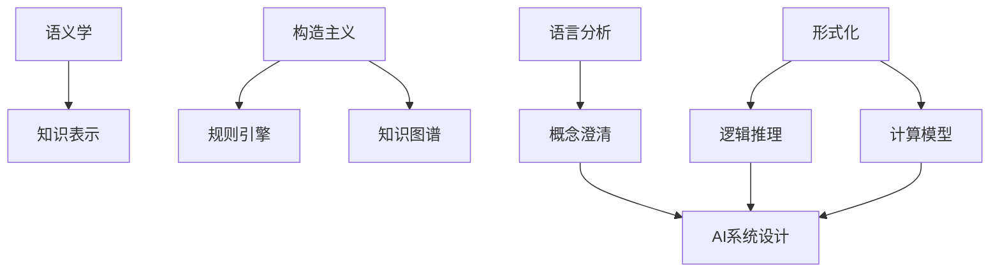
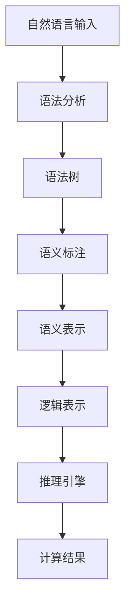

# AI 大模型计算机科学家群英传：哲学家卡尔纳普（Rudolf Carnap，1891年-1970年）

## 1. 背景介绍

### 1.1 问题的由来

人工智能(AI)的发展一直伴随着哲学思考的挑战。在20世纪初期，逻辑实证主义运动的先驱卡尔·拉米·纳普(Rudolf Carnap)提出了一种新的科学哲学观点,这种观点对于现代AI理论的形成产生了深远影响。

纳普认为,传统的形而上学存在着无法解决的悖论和矛盾,应该被一种新的科学哲学所取代。他主张建立一种以经验为基础的语言分析方法,用于澄清和重构科学概念,从而消除语言中的模糊性和矛盾。这种观点被称为"逻辑实证主义"(Logical Positivism)。

### 1.2 研究现状

纳普的逻辑实证主义思想为AI理论奠定了坚实的基础。他提出了"语义学"(Semantics)的概念,旨在通过形式化语言来研究语言与世界之间的关系。这种思路直接影响了后来AI领域中"知识表示"(Knowledge Representation)的发展。

此外,纳普还倡导使用"构造主义"(Constructivism)的方法来定义数学概念,这与当代AI系统中广泛使用的"规则引擎"(Rule Engine)和"知识图谱"(Knowledge Graph)的思想不谋而合。

### 1.3 研究意义

回顾纳普的思想对于理解当代AI理论的发展具有重要意义。他的语义学观点为AI知识表示奠定了基础,而构造主义方法则为AI规则引擎和知识图谱提供了理论支持。

纳普的贡献不仅体现在具体的AI技术层面,更重要的是他为AI的发展提供了一种全新的科学哲学视角。这种视角强调通过语言分析和形式化方法来消除概念上的模糊性和矛盾,为AI的发展指明了方向。

### 1.4 本文结构

本文将从以下几个方面深入探讨纳普的思想对AI理论的影响:

1. 核心概念与联系
2. 核心算法原理与具体操作步骤
3. 数学模型和公式详细讲解与案例分析
4. 项目实践:代码实例和详细解释
5. 实际应用场景
6. 工具和资源推荐
7. 总结:未来发展趋势与挑战
8. 附录:常见问题与解答

## 2. 核心概念与联系

纳普的逻辑实证主义思想主要包括以下几个核心概念:

1. **语义学(Semantics)**: 研究语言与世界之间的关系,为AI知识表示奠定基础。
2. **构造主义(Constructivism)**: 一种定义数学概念的方法,为AI规则引擎和知识图谱提供理论支持。
3. **语言分析(Language Analysis)**: 通过分析语言结构来消除概念上的模糊性和矛盾,为AI发展指明方向。
4. **形式化(Formalization)**: 将自然语言转化为形式语言,以便进行逻辑推理和计算,是AI系统的基础。

这些概念之间存在着紧密的联系,共同构成了纳普的逻辑实证主义哲学体系。语义学和构造主义为AI技术提供了理论基础,而语言分析和形式化则为AI系统的设计和实现提供了方法论指导。

## 3. 核心算法原理与具体操作步骤

### 3.1 算法原理概述

纳普的逻辑实证主义思想虽然主要属于哲学范畴,但其核心思想也可以转化为具体的算法和操作步骤,为AI系统的设计和实现提供指导。

1. **语义分析算法**: 通过分析自然语言的语义结构,将其转化为形式化的逻辑表示,以便进行计算和推理。这是AI知识表示和推理系统的基础。

2. **构造主义算法**: 根据构造主义的思想,通过一系列规则和步骤,从基本的数学概念出发,构建出更加复杂的数学模型和公式。这种方法可以应用于AI规则引擎和知识图谱的构建。

3. **语言澄清算法**: 通过分析语言中的模糊性和矛盾,并进行必要的重构和修正,从而得到一种更加清晰和一致的语言表示。这为AI系统的设计和实现提供了坚实的概念基础。

4. **形式化算法**: 将自然语言或其他非形式化的表示转化为形式语言,以便进行逻辑推理和计算。这是AI系统中各种算法和模型的基础。

### 3.2 算法步骤详解

以语义分析算法为例,其具体操作步骤可以概括为以下几个步骤:

1. **语法分析**: 将自然语言输入进行词法和语法分析,得到语法树结构。
2. **语义标注**: 根据语义规则和知识库,对语法树进行语义标注,识别出实体、关系和概念等语义信息。
3. **逻辑表示**: 将语义标注的结果转化为一种形式化的逻辑表示,如一阶逻辑公式、描述逻辑等。
4. **推理计算**: 基于逻辑表示,利用推理引擎进行逻辑推理和计算,得到最终的结果。

### 3.3 算法优缺点

纳普思想衍生出的这些算法具有以下优点:

1. 理论基础坚实,源于逻辑实证主义的科学哲学思想。
2. 操作步骤清晰,易于转化为具体的计算模型和实现。
3. 能够有效处理自然语言的模糊性和矛盾,提高AI系统的鲁棒性。
4. 为AI系统的设计和实现提供了一种系统的方法论指导。

但同时也存在一些缺点和局限性:

1. 过于强调形式化和逻辑推理,可能忽视了人类认知和推理的其他方面。
2. 对于一些复杂的语义现象,如隐喻、反讽等,可能难以有效处理。
3. 算法的实现可能需要大量的人工知识库和规则,构建成本较高。
4. 在处理非结构化数据时,可能会遇到一定的困难和挑战。

### 3.4 算法应用领域

纳普思想衍生出的这些算法可以应用于AI系统的多个领域,包括但不限于:

1. **自然语言处理(NLP)**: 语义分析算法可用于机器翻译、问答系统、信息抽取等任务。
2. **知识表示和推理**: 构造主义算法和语义分析算法可用于构建规则引擎、知识图谱等知识表示和推理系统。
3. **概念学习和知识发现**: 语言澄清算法可用于从非结构化数据中发现和学习新的概念和知识。
4. **形式化方法**: 形式化算法可应用于各种需要将非形式化表示转化为形式语言的场景,如程序synthesis、规格说明等。

## 4. 数学模型和公式详细讲解与举例说明

### 4.1 数学模型构建

纳普的逻辑实证主义思想强调通过构造主义的方法来定义和构建数学概念和模型。这种方法可以用于AI系统中的各种数学模型的构建,如逻辑推理模型、机器学习模型等。

以一阶逻辑推理模型为例,我们可以通过以下步骤来构建模型:

1. 定义基本术语和概念,如个体(Individual)、谓词(Predicate)、量词(Quantifier)等。
2. 根据一系列形式化的语法和语义规则,从基本术语和概念出发,构建出更加复杂的公式和模型。
3. 引入推理规则,如模型消去(Model Elimination)、基于解释的推理(Model-Based Reasoning)等,用于对构建的模型进行推理和计算。

通过这种构造主义的方法,我们可以得到一个形式化的一阶逻辑推理模型,它具有清晰的语法和语义定义,可用于AI推理系统的实现。

### 4.2 公式推导过程

在构建数学模型的过程中,我们通常需要推导出一些公式和定理。纳普的构造主义思想为这一过程提供了指导。

以一阶逻辑中著名的"归谬证法"(Reductio ad Absurdum)为例,其推导过程如下:

1. 假设命题 $P$ 为真。
2. 从 $P$ 及其他公理和定理出发,通过一系列推理步骤,导出矛盾命题 $\bot$。
3. 根据"矛盾推出任何命题"(Ex Falso Quodlibet)的原理,我们可以推出任何命题 $Q$。
4. 但是,我们知道 $Q$ 并不总是真的,因此最初的假设 $P$ 必须是错误的。
5. 因此,我们可以得出结论 $\neg P$,即命题 $P$ 的否定。

这个推导过程可以用以下公式表示:

$$
\begin{align}
P &\rightarrow \bot \
\bot &\rightarrow Q \
\therefore \neg P
\end{align}
$$

通过这种构造主义的方式,我们不仅得到了"归谬证法"这一重要推理规则,而且也展示了如何从基本的逻辑公理和规则出发,通过一步步的推导,构建出更加复杂的逻辑定理和推理模型。

### 4.3 案例分析与讲解

为了更好地理解纳普思想在AI系统中的应用,我们可以通过一个具体的案例来进行分析和讲解。

假设我们需要构建一个基于规则的专家系统,用于诊断某种疾病。我们可以按照以下步骤进行:

1. **知识表示**:
   - 使用一阶逻辑表示疾病的症状、检查结果、诊断标准等知识。
   - 例如,我们可以定义谓词 `HasSymptom(x, y)` 表示个体 `x` 有症状 `y`。

2. **规则构建**:
   - 根据专家知识和经验,构建一系列诊断规则。
   - 例如,我们可以构建如下规则:
     $$
     \begin{align}
     &\forall x \big( \text{HasSymptom(x, 发烧)} \land \text{HasSymptom(x, 咳嗽)} \
     &\qquad\qquad \rightarrow \text{HasDisease(x, 肺炎)} \big)
     \end{align}
     $$
     表示如果一个个体同时有发烧和咳嗽的症状,那么它患有肺炎的疾病。

3. **推理诊断**:
   - 对于一个新的个体 `patient1`,我们可以根据其症状信息,结合规则进行推理,得出诊断结果。
   - 例如,如果我们知道 `HasSymptom(patient1, 发烧)` 和 `HasSymptom(patient1, 咳嗽)` 为真,那么根据上面的规则,我们可以推导出 `HasDisease(patient1, 肺炎)` 也为真,即 `patient1` 患有肺炎。

通过这个案例,我们可以看到纳普的构造主义思想如何应用于AI规则系统的构建。我们从基本的逻辑概念和规则出发,构建出了表示疾病知识的逻辑公式,并基于这些公式进行推理,得到了最终的诊断结果。

### 4.4 常见问题解答

在构建基于纳普思想的AI系统时,我们可能会遇到一些常见问题,例如:

1. **知识获取问题**:
   - 问题:如何从专家或