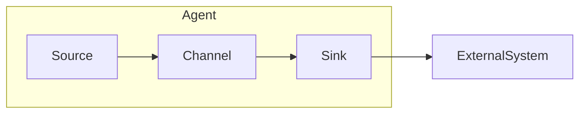

# Flume Sink原理与代码实例讲解

## 1. 背景介绍

### 1.1 问题的由来

在大数据时代，海量数据的实时采集和传输是一个巨大的挑战。Apache Flume作为一种分布式、可靠、高可用的数据采集系统,可以高效地从不同的数据源采集数据,并将其传输到各种数据存储系统中。其中,Sink作为Flume的重要组件,负责将数据从内存通道写入到最终的目的地。

### 1.2 研究现状

目前,Flume提供了多种内置的Sink,如HDFS Sink、Kafka Sink、Avro Sink等。这些Sink可以满足大多数场景的需求,但在某些特殊情况下,可能需要自定义Sink以满足特定的需求。因此,了解Sink的原理和实现方式就显得尤为重要。

### 1.3 研究意义

深入理解Flume Sink的原理和实现,可以帮助我们更好地利用Flume进行数据采集和传输,提高数据处理的效率和可靠性。同时,自定义Sink也为我们提供了更大的灵活性,可以根据具体的业务需求进行定制化开发。

### 1.4 本文结构

本文将从以下几个方面对Flume Sink进行全面的讲解:

1. 核心概念与联系
2. 核心算法原理与具体操作步骤
3. 数学模型和公式详细讲解与举例说明
4. 项目实践:代码实例和详细解释说明
5. 实际应用场景
6. 工具和资源推荐
7. 总结:未来发展趋势与挑战
8. 附录:常见问题与解答

## 2. 核心概念与联系

在讲解Flume Sink之前,我们需要先了解一些核心概念:

1. **Event**: Flume数据传输的基本单元,由Header和Body两部分组成。Header包含元数据,Body包含实际的数据内容。

2. **Source**: 用于从外部系统采集数据,将数据封装成Event,并将Event传输到Channel。

3. **Channel**: 位于Source和Sink之间,用于临时存储Event。

4. **Sink**: 从Channel中获取Event,并将Event写入到外部系统中,如HDFS、Kafka等。

5. **Agent**: Flume数据传输的基本单元,由一个Source、一个Channel和一个或多个Sink组成。

这些概念之间的关系如下所示:



## 3. 核心算法原理与具体操作步骤

### 3.1 算法原理概述

Flume Sink的核心算法原理是从Channel中获取Event,并将Event写入到外部系统中。这个过程可以分为以下几个步骤:

1. 从Channel中获取Event批次(Batch)
2. 对Event进行预处理(可选)
3. 将Event批次写入到外部系统
4. 更新Channel中的事务状态

### 3.2 算法步骤详解

1. **从Channel中获取Event批次**

   Sink会从Channel中获取一个Event批次,批次的大小可以通过配置进行设置。获取Event批次的代码如下:

   ```java
   Transaction transaction = channel.getTransaction();
   tx.begin();
   Event event = null;
   for (int i = 0; i < batchSize; i++) {
       event = channel.get(tx);
       if (event != null) {
           events.add(event);
       } else {
           break;
       }
   }
   ```

2. **对Event进行预处理(可选)**

   在将Event写入到外部系统之前,可以对Event进行预处理,如过滤、转换等操作。预处理的代码如下:

   ```java
   for (Event event : events) {
       event = preprocessor.preprocess(event);
       if (event == null) {
           continue;
       }
       processedEvents.add(event);
   }
   ```

3. **将Event批次写入到外部系统**

   将预处理后的Event批次写入到外部系统,如HDFS、Kafka等。写入操作的代码如下:

   ```java
   for (Event event : processedEvents) {
       sink.put(event);
   }
   ```

4. **更新Channel中的事务状态**

   如果所有Event都成功写入到外部系统,则提交事务;否则,回滚事务。更新事务状态的代码如下:

   ```java
   if (success) {
       tx.commit();
   } else {
       tx.rollback();
   }
   ```

### 3.3 算法优缺点

**优点**:

1. 高效: 批量处理Event,提高了数据写入的效率。
2. 可靠: 通过事务机制,保证了数据写入的一致性和可靠性。
3. 灵活: 可以自定义预处理逻辑,满足不同的业务需求。

**缺点**:

1. 延迟: 批量处理会导致一定的延迟,不适合对实时性要求很高的场景。
2. 内存占用: 批量处理会占用一定的内存空间,需要合理设置批次大小。

### 3.4 算法应用领域

Flume Sink的核心算法适用于各种数据采集和传输场景,如日志收集、网络流量分析、物联网数据采集等。它可以将数据写入到不同的外部系统中,如HDFS、Kafka、HBase等,为后续的数据分析和处理提供支持。

## 4. 数学模型和公式详细讲解与举例说明

### 4.1 数学模型构建

在讨论Flume Sink的数学模型之前,我们先引入一些符号:

- $N$: Channel中的Event数量
- $B$: 批次大小
- $T$: 处理一个Event所需的时间
- $t_p$: 预处理一个Event所需的时间
- $t_w$: 写入一个Event所需的时间
- $t_c$: 提交事务所需的时间

我们将Flume Sink的处理过程建模为一个排队系统,其中Channel相当于队列,Sink相当于服务器。我们的目标是最小化Event的平均等待时间$W$。

根据排队论,在$M/M/1$队列模型下,平均等待时间$W$可以表示为:

$$W = \frac{\rho}{1-\rho}\cdot T$$

其中,$\rho$为系统的利用率,即$\rho = \frac{N}{B}\cdot T$。

将$T$展开,我们得到:

$$T = t_p + t_w + t_c$$

将上述公式代入$W$的表达式,得到:

$$W = \frac{\rho}{1-\rho}\cdot (t_p + t_w + t_c)$$

### 4.2 公式推导过程

为了最小化平均等待时间$W$,我们需要最小化$\rho$和$t_p$、$t_w$、$t_c$。

1. **最小化$\rho$**

   $\rho$表示系统的利用率,当$\rho$接近1时,队列将变得越来越长,导致Event的等待时间增加。因此,我们需要控制$\rho$的值,使其远小于1。

   根据$\rho$的定义,我们可以通过以下两种方式来控制$\rho$的值:

   - 增加批次大小$B$
   - 减少Event的到达率$N$

2. **最小化$t_p$、$t_w$和$t_c$**

   $t_p$、$t_w$和$t_c$分别表示预处理、写入和提交事务所需的时间。我们可以通过以下方式来减小这些时间:

   - 优化预处理逻辑,减小$t_p$
   - 优化写入操作,减小$t_w$
   - 优化事务提交操作,减小$t_c$

### 4.3 案例分析与讲解

假设我们有一个日志采集系统,需要将日志数据实时写入到HDFS中。我们使用Flume作为数据采集工具,并自定义了一个HDFS Sink。

现在,我们需要评估系统的性能,并优化Sink的配置,以减小Event的平均等待时间。

**给定条件**:

- 日志数据的到达率为$N = 10000$ events/s
- 预处理时间$t_p = 1$ ms/event
- 写入时间$t_w = 5$ ms/event
- 提交事务时间$t_c = 2$ ms/event

**计算过程**:

1. 假设批次大小$B = 1000$,计算$\rho$:

   $$\rho = \frac{N}{B}\cdot T = \frac{10000}{1000}\cdot (1 + 5 + 2) = 0.8$$

2. 计算平均等待时间$W$:

   $$W = \frac{\rho}{1-\rho}\cdot (t_p + t_w + t_c) = \frac{0.8}{1-0.8}\cdot (1 + 5 + 2) = 32\text{ ms}$$

3. 优化批次大小$B$:

   我们发现$\rho$的值较高,导致平均等待时间较长。因此,我们可以尝试增加批次大小$B$,以减小$\rho$的值。

   假设$B = 2000$,则:

   $$\rho = \frac{N}{B}\cdot T = \frac{10000}{2000}\cdot (1 + 5 + 2) = 0.4$$
   $$W = \frac{\rho}{1-\rho}\cdot (t_p + t_w + t_c) = \frac{0.4}{1-0.4}\cdot (1 + 5 + 2) = 8\text{ ms}$$

   可以看到,增加批次大小$B$可以显著减小平均等待时间$W$。

4. 优化预处理、写入和提交事务操作:

   除了调整批次大小外,我们还可以优化预处理、写入和提交事务操作,以进一步减小$t_p$、$t_w$和$t_c$的值。

   假设经过优化,$t_p = 0.5$ ms/event、$t_w = 3$ ms/event、$t_c = 1$ ms/event,则:

   $$W = \frac{\rho}{1-\rho}\cdot (t_p + t_w + t_c) = \frac{0.4}{1-0.4}\cdot (0.5 + 3 + 1) = 4.8\text{ ms}$$

   可以看到,优化这些操作也可以进一步减小平均等待时间$W$。

通过上述案例分析,我们可以看到,合理设置批次大小和优化各个操作,可以有效减小Event的平均等待时间,提高Flume Sink的性能。

### 4.4 常见问题解答

1. **为什么需要批量处理Event?**

   批量处理Event可以提高数据写入的效率,减小每个Event的处理开销。同时,它也可以减小事务提交的频率,从而提高系统的吞吐量。

2. **如何选择合适的批次大小?**

   批次大小的选择需要权衡效率和延迟。批次越大,效率越高,但延迟也越大。一般来说,可以根据实际的数据到达率和性能要求,通过测试来选择合适的批次大小。

3. **为什么需要预处理Event?**

   预处理Event可以根据具体的业务需求,对Event进行过滤、转换或enrichment等操作。这样可以减小数据的传输量,提高数据质量,为后续的处理做好准备。

4. **如何优化写入操作?**

   优化写入操作可以从以下几个方面入手:
   - 使用高效的序列化/反序列化方式
   - 批量写入,减小I/O开销
   - 使用异步写入,提高并发度
   - 优化底层存储系统的配置

5. **如何优化事务提交操作?**

   优化事务提交操作可以考虑以下方式:
   - 增加事务批次大小,减小提交频率
   - 使用异步提交,提高并发度
   - 优化底层存储系统的配置

## 5. 项目实践:代码实例和详细解释说明

在本节中,我们将通过一个自定义HDFS Sink的实例,来演示如何实现Flume Sink。

### 5.1 开发环境搭建

1. 安装Apache Flume
2. 配置Flume环境变量
3. 创建Maven项目,引入Flume依赖

   ```xml
   <dependency>
       <groupId>org.apache.flume</groupId>
       <artifactId>flume-ng-core</artifactId>
       <version>1.9.0</version>
   </dependency>
   ```

### 5.2 源代码详细实现

我们将实现一个名为`HDFSSink`的自定义Sink,用于将Event写入到HDFS中。

**HDFSSink.java**

```java
public class HDFSSink extends AbstractSink implements Configurable {
    private static final Logger