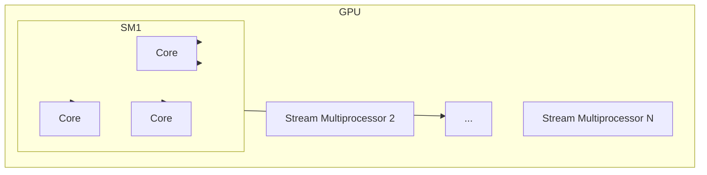
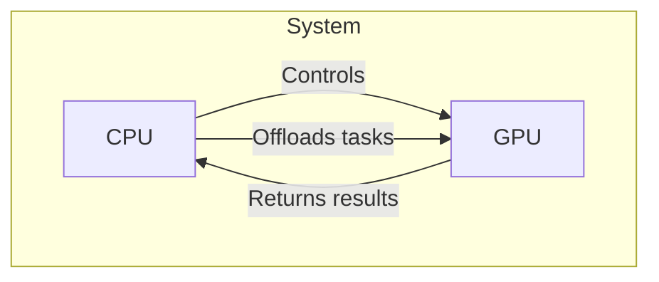
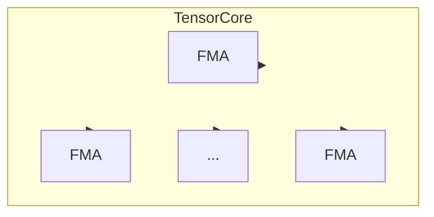
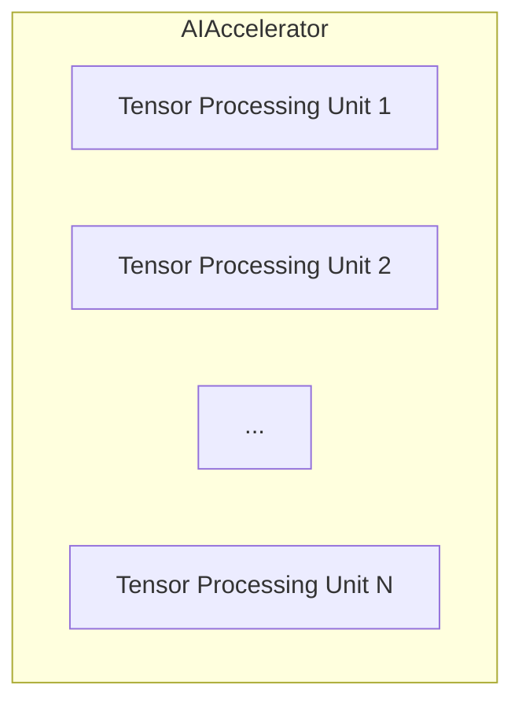
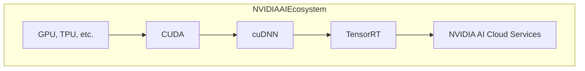

# NVIDIA与AI算力的进化

## 1. 背景介绍

### 1.1 问题的由来

在过去几十年中,人工智能(AI)技术取得了长足的进步,尤其是在深度学习和神经网络方面。这些进步很大程度上归功于计算能力的飞速增长,特别是图形处理单元(GPU)的出现和发展。作为GPU领域的领导者,NVIDIA一直在推动AI算力的发展,为各种AI应用提供强大的计算支持。

### 1.2 研究现状

目前,NVIDIA的GPU已经广泛应用于深度学习、计算机视觉、自然语言处理等AI领域。NVIDIA不断推出新的GPU架构和加速库,提高计算性能和能效比,满足日益增长的AI计算需求。同时,NVIDIA也在探索新的计算架构,如张量核心GPU和AI专用处理器,以进一步提升AI算力。

### 1.3 研究意义

AI技术的快速发展对计算能力提出了更高的要求。研究NVIDIA在AI算力方面的进化,有助于我们深入了解GPU在AI计算中的作用,掌握GPU加速技术的最新发展,并预测未来AI计算的发展趋势。这对于指导AI硬件和软件的设计、优化AI应用的性能,以及培养AI人才都具有重要意义。

### 1.4 本文结构

本文将从以下几个方面深入探讨NVIDIA与AI算力的进化:

1. 核心概念与联系:介绍GPU、CUDA、张量核心等NVIDIA AI计算的核心概念,并阐述它们之间的联系。
2. 核心算法原理与具体操作步骤:解析NVIDIA GPU加速深度学习的核心算法原理,并详细讲解具体的操作步骤。
3. 数学模型和公式详细讲解与举例说明:介绍GPU加速深度学习的数学模型和公式,并通过案例进行详细讲解。
4. 项目实践:代码实例和详细解释说明:提供基于NVIDIA GPU的深度学习项目实践,包括开发环境搭建、源代码实现、代码解读与分析、运行结果展示等内容。
5. 实际应用场景:探讨NVIDIA GPU在计算机视觉、自然语言处理等AI应用领域的实际应用场景。
6. 工具和资源推荐:推荐NVIDIA AI计算相关的学习资源、开发工具、论文等资源。
7. 总结:未来发展趋势与挑战:总结NVIDIA在AI算力方面的研究成果,展望未来发展趋势,并分析面临的挑战。
8. 附录:常见问题与解答:解答NVIDIA AI计算相关的常见问题。

## 2. 核心概念与联系

在探讨NVIDIA与AI算力的进化之前,我们需要先了解一些核心概念及它们之间的联系。

### 2.1 GPU

GPU(Graphics Processing Unit)最初是为了加速图形渲染而设计的,但由于其并行计算能力强,后来被广泛应用于通用计算领域,被称为GPGPU(General-Purpose computing on GPU)。

GPU由数以千计的小型流处理器核心组成,这些核心可以同时执行数千个线程,非常适合需要大量并行计算的任务,如深度学习中的矩阵乘法和卷积运算。

### 2.2 CUDA

CUDA(Compute Unified Device Architecture)是NVIDIA推出的一种并行计算平台和编程模型,允许开发人员使用C/C++等熟悉的语言,在GPU上进行通用计算。

CUDA将GPU视为一个并行计算设备,由主机(CPU)管理和调度,并提供了一系列工具和库,简化了GPU编程的复杂性。

### 2.3 张量核心

张量核心(Tensor Core)是NVIDIA在Volta架构中引入的一种专用的AI加速硬件,旨在加速深度学习中的矩阵乘法和卷积运算。

张量核心可以在一个周期内执行64次浮点乘加运算,大大提高了深度学习训练和推理的性能。

### 2.4 AI专用处理器

除了GPU之外,NVIDIA还在探索专门为AI工作负载设计的专用处理器,如Tensor Processing Unit(TPU)。这些处理器通过定制化的硬件架构和指令集,能够进一步提升AI计算的性能和能效比。

### 2.5 NVIDIA AI生态系统

NVIDIA不仅提供硬件,还构建了一个完整的AI生态系统,包括CUDA、cuDNN、TensorRT等软件工具和库,以及NVIDIA AI云服务等。这些工具和服务可以简化AI应用的开发、部署和管理,提高AI计算的效率和性能。

通过上述核心概念及其联系,我们可以看到NVIDIA在AI算力方面的全面布局。从硬件到软件,从芯片到云服务,NVIDIA都在不断推进AI计算能力的发展,为各种AI应用提供强大的计算支持。

## 3. 核心算法原理与具体操作步骤

### 3.1 算法原理概述

深度学习算法的核心是通过神经网络对输入数据进行特征提取和模式识别。神经网络由多层神经元组成,每层神经元对上一层的输出进行加权求和和非线性激活,最终得到输出结果。

在训练过程中,神经网络需要通过反向传播算法不断调整权重,使得输出结果与期望值之间的误差最小化。这个过程涉及大量的矩阵乘法和卷积运算,计算量非常大。

### 3.2 算法步骤详解

以下是基于NVIDIA GPU加速的深度学习算法的具体步骤:

1. **数据预处理**:将输入数据(如图像、文本等)转换为适合神经网络输入的张量格式。
2. **前向传播**:输入数据通过神经网络的各层进行前向传播计算,每层进行加权求和和非线性激活运算。
3. **损失计算**:计算神经网络输出与期望输出之间的损失函数值。
4. **反向传播**:根据损失函数值,通过反向传播算法计算每层权重的梯度。
5. **权重更新**:使用优化算法(如随机梯度下降)根据梯度值更新每层的权重。
6. **重复步骤2-5**:重复前向传播、损失计算、反向传播和权重更新,直到模型收敛或达到指定的迭代次数。

在上述步骤中,前向传播、反向传播和权重更新都涉及大量的矩阵乘法和卷积运算,这些运算可以通过NVIDIA GPU加速来提高计算性能。

### 3.3 算法优缺点

**优点**:

- 并行化计算:GPU具有大量的核心,可以同时执行数千个线程,非常适合深度学习中的并行计算。
- 硬件加速:NVIDIA GPU提供了张量核心等专用硬件,可以进一步加速矩阵乘法和卷积运算。
- 高性能:相比CPU,GPU可以提供数十甚至数百倍的计算性能,大大加快了深度学习模型的训练速度。

**缺点**:

- 编程复杂度:虽然CUDA等工具简化了GPU编程,但相比CPU编程仍然存在一定的复杂度和学习曲线。
- 内存限制:GPU通常具有较小的内存容量,对于大型深度学习模型可能会受到内存限制。
- 能耗较高:GPU的并行计算能力强,但也伴随着较高的能耗和散热需求。

### 3.4 算法应用领域

基于NVIDIA GPU加速的深度学习算法已经广泛应用于多个领域,包括但不限于:

- **计算机视觉**:图像分类、目标检测、语义分割、实例分割等。
- **自然语言处理**:机器翻译、文本生成、情感分析、问答系统等。
- **语音识别**:自动语音识别、语音合成等。
- **推荐系统**:个性化推荐、内容过滤等。
- **金融**:金融风险管理、交易策略优化等。
- **医疗**:医学图像分析、药物发现等。

随着AI技术的不断发展,NVIDIA GPU加速的深度学习算法也将在更多领域发挥重要作用。

## 4. 数学模型和公式详细讲解与举例说明

### 4.1 数学模型构建

深度学习算法的核心是通过神经网络对输入数据进行特征提取和模式识别。神经网络可以看作是一个由多层神经元组成的函数近似器,其数学模型可以表示为:

$$
y = f(x; \theta)
$$

其中:

- $x$是输入数据,如图像、文本等。
- $y$是神经网络的输出,如分类结果、回归值等。
- $f$是由神经网络定义的函数映射。
- $\theta$是神经网络的可训练参数,即各层的权重和偏置。

神经网络的目标是通过训练过程学习最优参数$\theta^*$,使得对于给定的输入$x$,神经网络输出$f(x; \theta^*)$与期望输出$y^*$之间的误差最小化。

### 4.2 公式推导过程

在训练过程中,我们需要定义一个损失函数$\mathcal{L}$来衡量神经网络输出与期望输出之间的差异。常见的损失函数包括均方误差损失、交叉熵损失等。

对于给定的训练数据集$\mathcal{D} = \{(x_i, y_i^*)\}_{i=1}^N$,我们需要最小化损失函数的期望值:

$$
\min_\theta \mathbb{E}_{(x, y^*) \sim \mathcal{D}} \left[ \mathcal{L}(f(x; \theta), y^*) \right]
$$

通过应用反向传播算法,我们可以计算损失函数相对于每层权重的梯度:

$$
\frac{\partial \mathcal{L}}{\partial \theta} = \frac{\partial \mathcal{L}}{\partial y} \cdot \frac{\partial y}{\partial \theta}
$$

然后,我们可以使用优化算法(如随机梯度下降)根据梯度值更新权重:

$$
\theta \leftarrow \theta - \eta \cdot \frac{\partial \mathcal{L}}{\partial \theta}
$$

其中$\eta$是学习率,控制着每次更新的步长。

通过不断重复前向传播、损失计算、反向传播和权重更新,神经网络的参数将逐渐收敛到最优值,使得输出与期望输出之间的误差最小化。

### 4.3 案例分析与讲解

为了更好地理解深度学习的数学模型和公式,我们以图像分类任务为例进行案例分析。

假设我们有一个包含多个类别的图像数据集,我们希望训练一个神经网络模型对图像进行分类。我们可以将图像表示为一个张量$x \in \mathbb{R}^{H \times W \times C}$,其中$H$、$W$和$C$分别表示图像的高度、宽度和通道数。

神经网络的输出$y$是一个向量,每个元素对应一个类别的概率值。我们可以使用交叉熵损失函数来衡量模型输出与真实标签之间的差异:

$$
\mathcal{L}(y