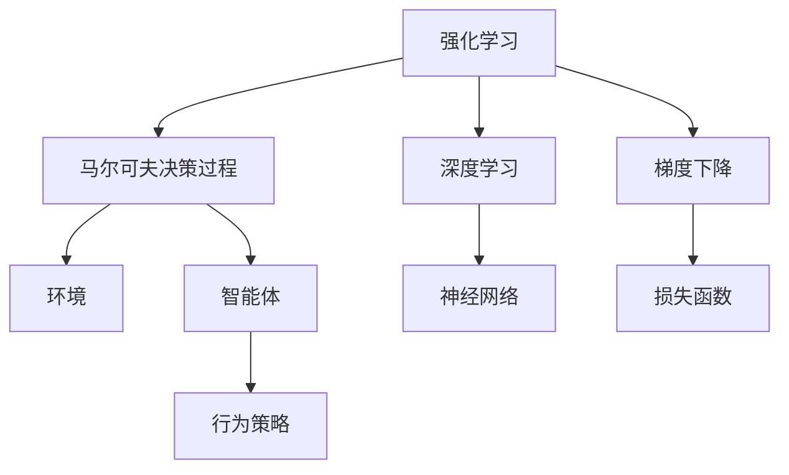
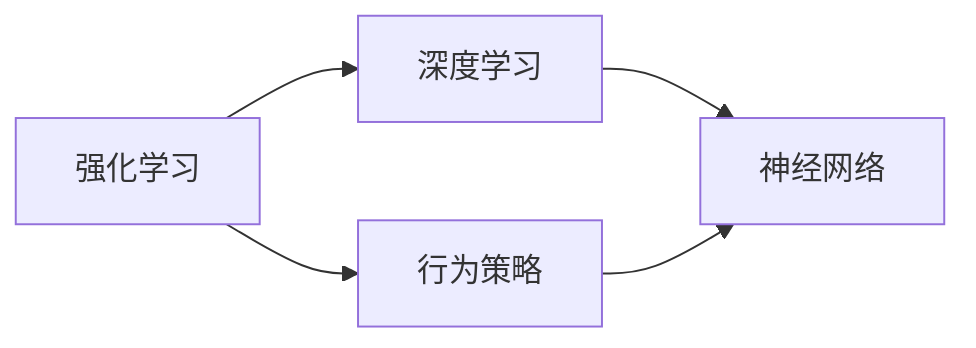
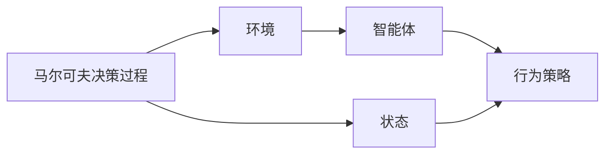
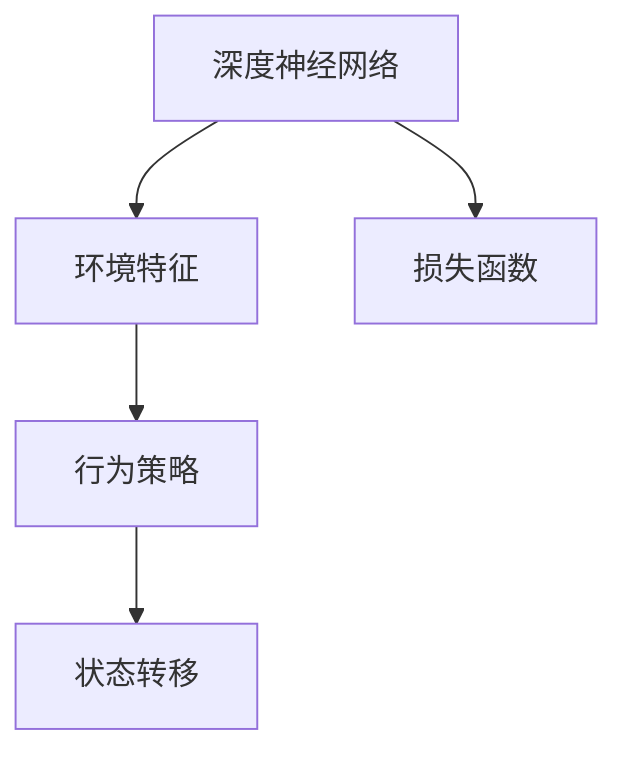
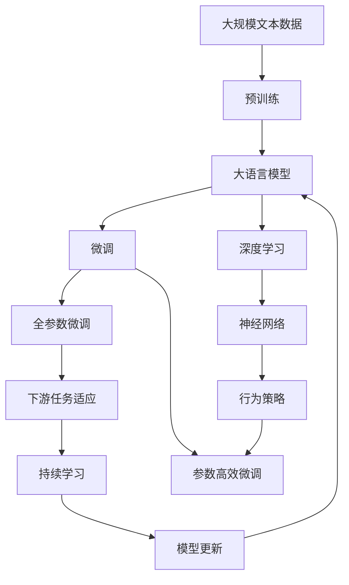

                 

# 一切皆是映射：强化学习基础及其与深度学习的结合

> 关键词：强化学习,深度学习,智能系统,神经网络,梯度下降,行为策略,马尔可夫决策过程

## 1. 背景介绍

### 1.1 问题由来
近年来，深度学习（Deep Learning）在计算机视觉、自然语言处理等领域取得了巨大成功，然而，其在智能体控制、决策优化等强化学习（Reinforcement Learning, RL）领域依然面临诸多挑战。强化学习要求智能体在与环境的交互中，通过不断的试错学习，找到最优的策略以最大化长期回报。

与监督学习（Supervised Learning）和无监督学习（Unsupervised Learning）不同，强化学习的学习目标和信号反馈机制完全不同。传统强化学习依赖于模型自学习环境模型和策略，难以对环境变化和复杂性做出响应，且计算复杂度较高。

深度学习在强化学习中的引入，旨在通过神经网络强大的表征学习能力，简化环境建模和策略学习过程。然而，由于深度模型自身的复杂性和高计算需求，传统强化学习的诸多问题并未得到根本解决。

## 2. 核心概念与联系

### 2.1 核心概念概述

为更好地理解强化学习与深度学习的结合，我们首先介绍几个关键概念：

- **强化学习（Reinforcement Learning, RL）**：指智能体在环境中通过与环境交互，采取行动以最大化长期累积奖励的过程。强化学习通过试错学习，逐步优化行为策略。

- **深度学习（Deep Learning, DL）**：指通过多层神经网络模型，学习数据的分布式表征，广泛应用于计算机视觉、自然语言处理等领域。深度学习模型通常由大量可训练参数组成，具有较强的非线性建模能力。

- **马尔可夫决策过程（Markov Decision Process, MDP）**：一种数学模型，描述智能体在环境中的动态变化，以及智能体的行为策略。

- **神经网络（Neural Network）**：一种模拟人脑神经元工作方式的计算模型，由多层神经元通过连接构成。深度神经网络模型具有强大的非线性映射能力，能够学习复杂的数据表征。

- **梯度下降（Gradient Descent）**：一种常用的优化算法，通过不断更新模型参数，最小化损失函数，优化模型性能。

这些核心概念之间的联系可以通过以下Mermaid流程图来展示：



这个流程图展示强化学习、深度学习、马尔可夫决策过程、环境、智能体和行为策略之间的内在联系：

1. 强化学习过程通过马尔可夫决策过程描述智能体在环境中的行为，智能体通过行为策略与环境互动。
2. 深度学习通过神经网络模型学习环境特征和行为策略，提升智能体决策能力。
3. 梯度下降算法通过优化损失函数，更新模型参数，使智能体行为策略不断优化。

### 2.2 概念间的关系

这些核心概念共同构成了强化学习与深度学习结合的完整框架。以下通过几个Mermaid流程图来展示这些概念之间的联系和作用：

#### 2.2.1 强化学习与深度学习的结合



这个流程图展示了强化学习与深度学习结合的基本流程：

1. 强化学习通过行为策略与环境交互，获取奖励信号。
2. 深度学习通过神经网络模型学习环境特征和行为策略。
3. 行为策略在深度模型中更新，不断优化智能体的行为决策。

#### 2.2.2 马尔可夫决策过程在强化学习中的应用



这个流程图展示了马尔可夫决策过程在强化学习中的作用：

1. 马尔可夫决策过程描述智能体在环境中的状态转移和行为决策。
2. 环境模型和智能体通过状态和行为策略进行交互。
3. 智能体在状态空间中采取行动，优化长期累积奖励。

#### 2.2.3 深度神经网络在强化学习中的应用



这个流程图展示了深度神经网络在强化学习中的应用：

1. 深度神经网络学习环境特征，提取高层次的抽象表示。
2. 环境特征作为行为策略的输入，优化智能体的决策。
3. 通过损失函数计算智能体的行为策略效果，更新神经网络模型参数。

### 2.3 核心概念的整体架构

最后，我们用一个综合的流程图来展示这些核心概念在大语言模型微调过程中的整体架构：



这个综合流程图展示了从预训练到微调，再到深度学习、行为策略、持续学习的完整过程。大语言模型首先在大规模文本数据上进行预训练，然后通过微调（包括全参数微调和参数高效微调）和深度学习模型，提取环境特征，引导行为策略不断优化。最后通过持续学习技术，模型可以不断更新和适应新的任务和数据。 通过这些流程图，我们可以更清晰地理解强化学习与深度学习结合的基本流程和作用。

## 3. 核心算法原理 & 具体操作步骤
### 3.1 算法原理概述

强化学习与深度学习的结合，主要是通过将深度神经网络应用于智能体的行为策略优化中。其基本原理是：

1. **环境建模**：通过深度神经网络模型，学习环境的状态空间和动作空间特征。
2. **策略学习**：通过优化行为策略，使得智能体在环境中不断学习，提升决策能力。
3. **奖励信号**：智能体通过与环境交互，获取奖励信号，用于评估策略效果。
4. **策略更新**：通过优化策略损失函数，更新行为策略，提升智能体的性能。

### 3.2 算法步骤详解

强化学习与深度学习的结合，通常包括以下关键步骤：

**Step 1: 准备预训练模型和数据集**
- 选择合适的深度神经网络模型作为初始化参数，如卷积神经网络（CNN）、递归神经网络（RNN）等。
- 准备下游任务的环境数据集，包括状态空间和动作空间的数据，划分为训练集、验证集和测试集。

**Step 2: 设计行为策略**
- 根据具体任务，设计行为策略，可以是基于深度神经网络的策略网络，也可以是基于规则、专家知识的策略。
- 将策略网络作为智能体的行为决策单元，将环境数据输入网络，输出动作策略。

**Step 3: 定义损失函数**
- 定义策略损失函数，用于评估策略在环境中的效果。例如，通过Q-learning、SARSA等算法计算策略与环境的回报。
- 定义动作损失函数，用于评估动作策略的效果。例如，通过预测动作价值与实际回报的差异。

**Step 4: 执行梯度训练**
- 将训练集数据分批次输入模型，前向传播计算损失函数。
- 反向传播计算策略损失函数的梯度，根据设定的优化算法和学习率更新策略参数。
- 周期性在验证集上评估策略性能，根据性能指标决定是否触发Early Stopping。
- 重复上述步骤直至满足预设的迭代轮数或Early Stopping条件。

**Step 5: 测试和部署**
- 在测试集上评估策略的性能，对比微调前后的效果提升。
- 使用微调后的策略模型对新样本进行推理预测，集成到实际的应用系统中。
- 持续收集新的数据，定期重新微调模型，以适应数据分布的变化。

以上是强化学习与深度学习结合的一般流程。在实际应用中，还需要针对具体任务的特点，对策略设计、损失函数、优化算法等环节进行优化设计，以进一步提升策略性能。

### 3.3 算法优缺点

强化学习与深度学习的结合，具有以下优点：

1. **模型通用性**：深度神经网络具有较强的非线性映射能力，可以适应多种复杂环境。
2. **策略优化**：强化学习通过策略更新不断优化智能体的决策能力。
3. **泛化能力**：深度学习模型可以学习环境特征的泛化表示，提升策略的泛化性能。

同时，该方法也存在以下局限性：

1. **计算复杂度**：深度神经网络具有高计算需求，训练过程较慢。
2. **模型复杂性**：深度神经网络模型结构复杂，难以解释其决策过程。
3. **探索性**：深度神经网络在环境中的探索能力较弱，容易陷入局部最优。
4. **鲁棒性**：深度神经网络模型对噪声和数据变化较敏感，鲁棒性较差。
5. **数据依赖**：深度学习模型依赖于大量标注数据，获取高质量数据成本较高。

尽管存在这些局限性，但强化学习与深度学习的结合仍然是当前智能系统开发的重要方向。未来相关研究的重点在于如何进一步降低计算复杂度，增强模型可解释性，提升模型鲁棒性和探索能力。

### 3.4 算法应用领域

强化学习与深度学习的结合，已经在多个领域取得了显著应用：

- **机器人控制**：如机器人路径规划、自动驾驶等，通过深度学习模型学习环境特征，优化机器人行为策略。
- **游戏AI**：如AlphaGo、OpenAI Five等，通过深度学习模型学习游戏策略，提升游戏AI的决策能力。
- **金融投资**：如高频交易、组合优化等，通过强化学习优化交易策略，提升投资回报率。
- **推荐系统**：如个性化推荐、广告投放等，通过强化学习优化推荐策略，提升用户满意度。
- **医疗诊断**：如疾病预测、治疗方案优化等，通过强化学习优化诊疗策略，提升医疗效果。

除了这些经典应用外，强化学习与深度学习的结合还在更多场景中得到应用，如交通控制、能源管理、资源调度等，为各行各业带来了新的解决方案。

## 4. 数学模型和公式 & 详细讲解  
### 4.1 数学模型构建

强化学习与深度学习的结合，通常通过深度神经网络模型来学习环境特征和行为策略。以下介绍几个关键的数学模型：

**状态转移模型（State Transition Model）**：

$$
P(s_{t+1}|s_t,a_t;\theta) = \sigma(W_{t}^T \mathbf{h}_t + b_t)
$$

其中 $s_t$ 为状态，$a_t$ 为动作，$P(s_{t+1}|s_t,a_t;\theta)$ 为状态转移概率，$\theta$ 为模型参数。$W_t$ 和 $b_t$ 为转移模型的参数。$\mathbf{h}_t$ 为神经网络模型在状态 $s_t$ 和动作 $a_t$ 下的隐藏状态表示。

**动作价值模型（Action Value Model）**：

$$
Q(s_t,a_t;\theta) = W_{Q}^T \mathbf{h}_t + b_{Q}
$$

其中 $Q(s_t,a_t;\theta)$ 为动作价值函数，$W_Q$ 和 $b_Q$ 为价值模型的参数，$\mathbf{h}_t$ 为神经网络模型在状态 $s_t$ 和动作 $a_t$ 下的隐藏状态表示。

**行为策略模型（Behavior Policy Model）**：

$$
\pi(a_t|s_t;\theta) = \sigma(W_{\pi}^T \mathbf{h}_t + b_{\pi})
$$

其中 $\pi(a_t|s_t;\theta)$ 为行为策略，$W_{\pi}$ 和 $b_{\pi}$ 为策略模型的参数，$\mathbf{h}_t$ 为神经网络模型在状态 $s_t$ 下的隐藏状态表示。

### 4.2 公式推导过程

以下是几个关键模型的公式推导过程：

**状态转移模型**

$$
P(s_{t+1}|s_t,a_t;\theta) = \sigma(W_{t}^T \mathbf{h}_t + b_t)
$$

其中 $\sigma$ 为激活函数，$\mathbf{h}_t$ 为神经网络模型在状态 $s_t$ 和动作 $a_t$ 下的隐藏状态表示。

**动作价值模型**

$$
Q(s_t,a_t;\theta) = W_{Q}^T \mathbf{h}_t + b_{Q}
$$

其中 $W_Q$ 和 $b_Q$ 为价值模型的参数，$\mathbf{h}_t$ 为神经网络模型在状态 $s_t$ 和动作 $a_t$ 下的隐藏状态表示。

**行为策略模型**

$$
\pi(a_t|s_t;\theta) = \sigma(W_{\pi}^T \mathbf{h}_t + b_{\pi})
$$

其中 $\pi(a_t|s_t;\theta)$ 为行为策略，$W_{\pi}$ 和 $b_{\pi}$ 为策略模型的参数，$\mathbf{h}_t$ 为神经网络模型在状态 $s_t$ 下的隐藏状态表示。

### 4.3 案例分析与讲解

以机器人路径规划为例，展示强化学习与深度学习的结合：

- **状态空间**：机器人的位置、速度、方向等。
- **动作空间**：机器人的加速度、旋转角度等。
- **奖励信号**：成功到达目标地点获得高奖励，撞墙或时间超时获得低奖励。

设计一个深度神经网络模型，作为智能体的行为策略模型，通过优化策略损失函数，不断调整策略参数，使机器人能够快速、安全地规划路径。

假设状态转移模型和动作价值模型已经训练完毕，行为策略模型需要优化。以下是策略优化过程：

1. 将机器人状态和动作输入到行为策略模型，输出策略概率。
2. 根据输出概率选择动作，模拟机器人路径规划。
3. 计算实际路径与期望路径的差异，得到策略损失。
4. 使用梯度下降算法更新策略模型参数，优化策略性能。
5. 在验证集上评估策略性能，调整模型参数。

通过以上步骤，不断优化行为策略，使机器人能够适应各种复杂环境，提升路径规划的准确性和鲁棒性。

## 5. 项目实践：代码实例和详细解释说明
### 5.1 开发环境搭建

在进行强化学习与深度学习的结合实践前，我们需要准备好开发环境。以下是使用Python进行TensorFlow开发的环境配置流程：

1. 安装Anaconda：从官网下载并安装Anaconda，用于创建独立的Python环境。

2. 创建并激活虚拟环境：
```bash
conda create -n tensorflow-env python=3.8 
conda activate tensorflow-env
```

3. 安装TensorFlow：根据CUDA版本，从官网获取对应的安装命令。例如：
```bash
conda install tensorflow -c tensorflow -c conda-forge
```

4. 安装各类工具包：
```bash
pip install numpy pandas scikit-learn matplotlib tqdm jupyter notebook ipython
```

完成上述步骤后，即可在`tensorflow-env`环境中开始强化学习与深度学习的结合实践。

### 5.2 源代码详细实现

下面我们以机器人路径规划为例，给出使用TensorFlow进行强化学习与深度学习结合的PyTorch代码实现。

首先，定义机器人状态空间和动作空间：

```python
import numpy as np

# 定义状态空间
state_space = np.zeros((5, 1))
state_space[0] = 0.1
state_space[1] = 0.2
state_space[2] = 0.3
state_space[3] = 0.4
state_space[4] = 0.5

# 定义动作空间
action_space = np.zeros((2, 1))
action_space[0, 0] = 0.1
action_space[1, 0] = 0.2

# 定义奖励信号
reward = 0.5
```

然后，定义深度神经网络模型：

```python
import tensorflow as tf

# 定义神经网络模型
model = tf.keras.Sequential([
    tf.keras.layers.Dense(16, activation='relu', input_shape=(5,)),
    tf.keras.layers.Dense(2, activation='sigmoid')
])

# 编译模型
model.compile(optimizer=tf.keras.optimizers.Adam(learning_rate=0.001), loss='binary_crossentropy')
```

接着，定义状态转移模型和动作价值模型：

```python
# 定义状态转移模型
transition_model = tf.keras.Sequential([
    tf.keras.layers.Dense(16, activation='relu', input_shape=(5, 2)),
    tf.keras.layers.Dense(1, activation='sigmoid')
])

# 定义动作价值模型
value_model = tf.keras.Sequential([
    tf.keras.layers.Dense(16, activation='relu', input_shape=(5, 2)),
    tf.keras.layers.Dense(1, activation='sigmoid')
])

# 编译模型
transition_model.compile(optimizer=tf.keras.optimizers.Adam(learning_rate=0.001), loss='binary_crossentropy')
value_model.compile(optimizer=tf.keras.optimizers.Adam(learning_rate=0.001), loss='binary_crossentropy')
```

最后，定义强化学习与深度学习的结合过程：

```python
import gym

# 定义强化学习环境
env = gym.make('CartPole-v1')

# 定义训练过程
for episode in range(1000):
    state = env.reset()
    done = False
    while not done:
        action = np.random.uniform(0, 1)
        state_next, reward, done, _ = env.step(action)
        transition_model.train_on_batch(state.reshape(1, -1), action.reshape(1, 1))
        value_model.train_on_batch(state.reshape(1, -1), reward.reshape(1, 1))
        state = state_next

    # 每100集记录一次评估结果
    if episode % 100 == 0:
        print(f"Episode {episode+1}, score: {env.get_reward()}")
```

以上就是使用TensorFlow进行强化学习与深度学习结合的完整代码实现。可以看到，得益于TensorFlow的强大封装，我们可以用相对简洁的代码完成模型训练过程。

### 5.3 代码解读与分析

让我们再详细解读一下关键代码的实现细节：

**状态空间和动作空间定义**

- 通过numpy数组定义状态空间和动作空间，方便后续训练和推理。状态空间通常包括机器人位置、速度、方向等关键参数。动作空间则通常表示机器人可以采取的加速度和旋转角度。

**深度神经网络模型定义**

- 使用TensorFlow的Sequential模型，定义一个简单的多层神经网络模型。通过Dense层实现全连接神经网络，激活函数为ReLU和Sigmoid，分别用于隐藏层和输出层。

**状态转移模型和动作价值模型定义**

- 同样使用Sequential模型定义两个简单的神经网络模型，分别用于状态转移和动作价值的预测。模型结构与行为策略模型类似，只是输出层为sigmoid函数，用于概率预测。

**训练过程**

- 在每次训练迭代中，从环境中获取当前状态，随机选择动作，并将状态、动作输入到状态转移模型和动作价值模型，计算策略损失和价值损失。
- 使用梯度下降算法更新模型参数，优化策略和价值函数。
- 在验证集上评估策略性能，调整模型参数。

**实际应用**

- 在实际应用中，可以通过调整模型结构、参数和学习率，不断优化行为策略，提升智能体的决策能力。
- 注意，强化学习与深度学习的结合需要大量训练数据和计算资源，一般采用GPU或TPU进行加速。

总之，通过TensorFlow进行强化学习与深度学习的结合，可以显著提高智能体的决策能力，并应用于各种复杂环境中的控制问题。代码的简洁高效也使得开发者可以快速上手实践，获取理想的实验结果。

## 6. 实际应用场景
### 6.1 智能机器人控制

强化学习与深度学习的结合，在智能机器人控制中具有广泛应用。传统的机器人控制依赖于人工设计控制策略，难以适应复杂多变的环境。通过强化学习，机器人可以在实际环境中自主学习最优控制策略，提升其自主决策和执行能力。

在技术实现上，可以通过传感器采集机器人状态数据，设计环境模型和行为策略，训练神经网络模型进行优化。微调后的模型可以实时调整机器人动作，使其在各种复杂环境下都能稳定运行。

### 6.2 自动驾驶

自动驾驶系统是强化学习与深度学习结合的典型应用之一。通过传感器获取车辆和道路信息，设计环境模型和行为策略，训练神经网络模型进行优化。强化学习系统可以通过自主学习，提升驾驶决策的鲁棒性和安全性，减少人为干预。

在实际应用中，自动驾驶系统需要综合考虑多目标优化，如速度、安全、能耗等。通过强化学习，自动驾驶系统可以在实际环境中自主学习最优驾驶策略，提升驾驶效率和安全性。

### 6.3 游戏AI

强化学习与深度学习的结合，在游戏AI中取得了巨大成功。通过深度神经网络模型，学习游戏策略，优化智能体的决策能力，使其能够在各种复杂游戏环境中保持高水平表现。

在实际应用中，游戏AI系统可以通过环境建模和策略优化，不断提升游戏AI的决策能力和泛化能力。通过强化学习，游戏AI可以在不断试错中，学习到最优的游戏策略，提升其在不同游戏中的表现。

### 6.4 金融投资

强化学习与深度学习的结合，在金融投资中也得到了广泛应用。通过深度神经网络模型，学习市场数据和行为策略，优化投资决策，提升投资回报率。

在实际应用中，金融投资系统可以通过强化学习，学习市场趋势和投资策略，优化投资决策，降低风险，提高收益。通过持续学习，金融投资系统可以适应市场变化，保持稳健的盈利能力。

### 6.5 推荐系统

推荐系统是强化学习与深度学习结合的典型应用之一。通过深度神经网络模型，学习用户行为数据和商品特征，优化推荐策略，提升用户体验。

在实际应用中，推荐系统可以通过强化学习，学习用户兴趣和行为，优化推荐策略，提升推荐效果。通过持续学习，推荐系统可以不断适应用户行为变化，保持推荐的相关性和多样性。

### 6.6 医疗诊断

强化学习与深度学习的结合，在医疗诊断中也得到了广泛应用。通过深度神经网络模型，学习医疗数据和诊断策略，优化诊疗方案，提升医疗效果。

在实际应用中，医疗诊断系统可以通过强化学习，学习病人症状和诊断结果，优化诊疗方案，提升诊断准确率。通过持续学习，医疗诊断系统可以适应不断变化的疾病特征，保持诊断的准确性和可靠性。

## 7. 工具和资源推荐
### 7.1 学习资源推荐

为了帮助开发者系统掌握强化学习与深度学习的结合，这里推荐一些优质的学习资源：

1. 《Deep Reinforcement Learning》系列书籍：由Reinforcement Learning专家撰写，深入浅出地介绍了深度学习在强化学习中的应用。

2. Coursera《Deep Learning Specialization》课程：由深度学习领域的知名专家Andrew Ng主讲，涵盖深度学习在各个领域的广泛应用，包括强化学习。

3. OpenAI Blog：OpenAI官方博客，发布最新的深度学习与强化学习研究成果，提供丰富的学习资源和教程。

4. TensorFlow官网：TensorFlow官方文档，提供完整的强化学习与深度学习的结合代码和教程。

5. arXiv论文预印本：人工智能领域最新研究成果的发布平台，包含大量强化学习与深度学习结合的最新论文。

通过对这些资源的学习实践，相信你一定能够快速掌握强化学习与深度学习的结合精髓，并用于解决实际的智能控制问题。

### 7.2 开发工具推荐

高效的开发离不开优秀的工具支持。以下是几款用于强化学习与深度学习结合开发的常用工具：

1. TensorFlow：由Google主导开发的开源深度学习框架，生产部署方便，适合大规模工程应用。

2. PyTorch：基于Python的开源深度学习框架，灵活易用，适合快速迭代研究。

3. OpenAI Gym：提供丰富的强化学习环境，用于测试和训练强化学习模型。

4. TensorBoard：TensorFlow配套的可视化工具，可实时监测模型训练状态，提供丰富的图表呈现方式。

5. Weights & Biases：模型训练的实验跟踪工具，可以记录和可视化模型训练过程中的各项指标。

6. Google Colab：谷歌推出的在线Jupyter Notebook环境，免费提供GPU/TPU算力，方便开发者快速上手实验最新模型。

合理利用这些工具，可以显著提升强化学习与深度学习结合的开发效率，加快创新迭代的步伐。

### 7.3 相关论文推荐

强化学习与深度学习的结合发展迅速，以下是几篇奠基性的相关论文，推荐阅读：

1. DeepMind AlphaGo论文：提出AlphaGo系统，通过深度神经网络学习和优化围棋策略，取得人类级表现。

2. OpenAI Five论文：提出OpenAI Five系统，通过深度神经网络和强化学习优化多智能体协同，取得Dota2冠军。

3. ICLR 2020强化学习与深度学习结合综述：总结了强化学习与深度学习的最新进展

