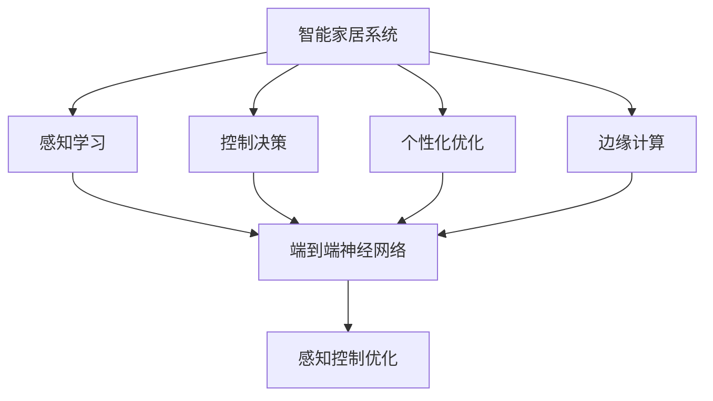
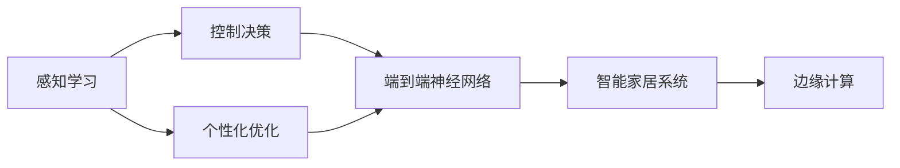
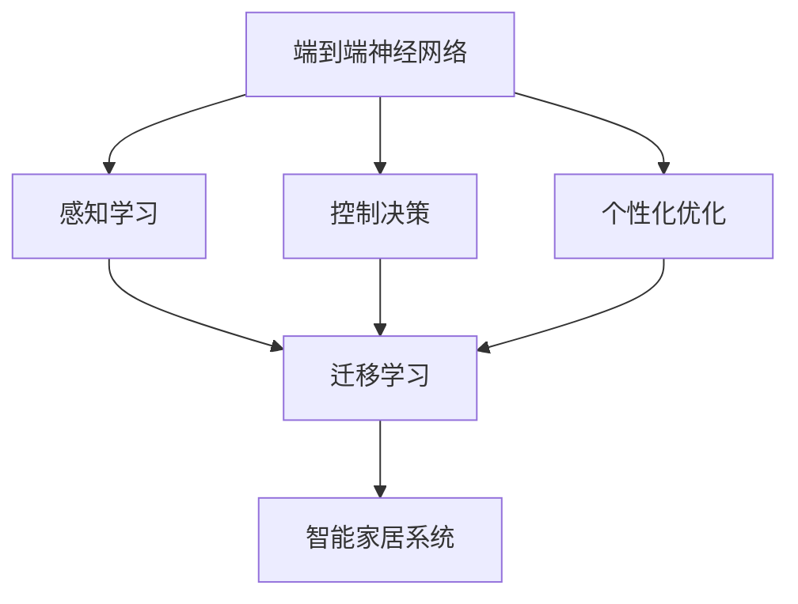
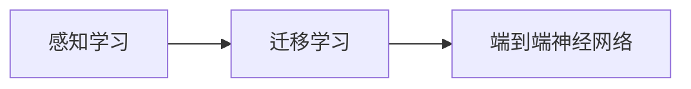
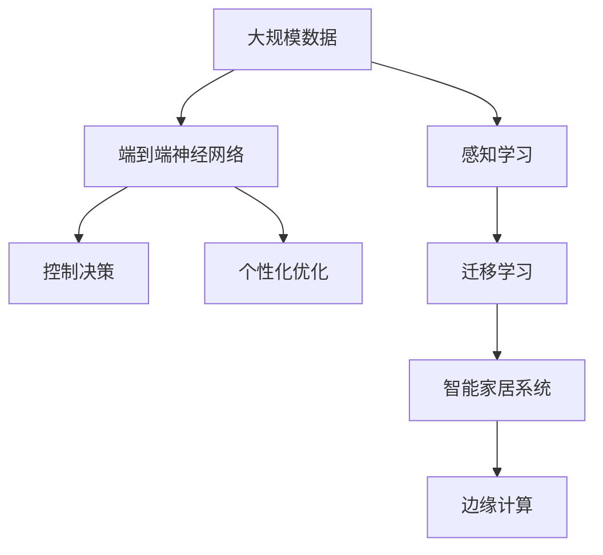

                 

## 1. 背景介绍

### 1.1 问题由来
近年来，随着人工智能技术的发展，智能家居系统（Smart Home Systems）逐渐成为家庭生活的重要组成部分。智能家居系统通过深度学习技术实现对家庭环境的感知、控制和优化，提升了家庭生活的智能化水平。然而，智能家居系统的复杂性和多样性使得深度学习模型的应用面临诸多挑战，如何高效、可靠地应用深度学习技术，是实现智能家居系统理想应用的重要课题。

### 1.2 问题核心关键点
深度学习在智能家居系统中的应用主要集中在以下几个方面：
- 感知学习：通过图像、声音、温度等传感器数据，学习对家居环境的感知。
- 控制决策：通过深度学习模型，学习对家居设备的控制决策逻辑。
- 个性化优化：通过深度学习技术，学习用户行为，提供个性化家居服务和推荐。
- 边缘计算：将深度学习模型部署在边缘设备上，降低中心计算负载，实现快速响应。

深度学习在智能家居系统中的应用，可以通过端到端的神经网络模型、迁移学习、强化学习等技术，实现家庭环境的智能感知和优化控制。本文将重点介绍端到端的神经网络模型和迁移学习在智能家居系统中的应用，探讨其实现原理和具体步骤。

### 1.3 问题研究意义
深度学习在智能家居系统中的应用，不仅能够提升家庭生活的智能化水平，还能促进家居行业的数字化转型，带来新的商业机遇。通过本研究，能够为智能家居系统开发提供理论和技术支持，推动深度学习在家庭场景的应用，实现家庭环境和用户行为的智能化、个性化优化。

## 2. 核心概念与联系

### 2.1 核心概念概述

智能家居系统中的深度学习技术，主要涉及以下几个关键概念：

- 智能家居系统（Smart Home Systems）：通过深度学习技术实现对家庭环境的感知、控制和优化，提升家庭生活智能化水平。
- 感知学习（Perception Learning）：通过图像、声音、温度等传感器数据，学习家居环境的感知。
- 控制决策（Control Decision）：通过深度学习模型，学习家居设备的控制决策逻辑。
- 个性化优化（Personalized Optimization）：通过深度学习技术，学习用户行为，提供个性化家居服务和推荐。
- 边缘计算（Edge Computing）：将深度学习模型部署在边缘设备上，降低中心计算负载，实现快速响应。
- 端到端神经网络（End-to-End Neural Networks）：将感知、控制和优化过程集成在同一个神经网络模型中，实现全流程自动化。
- 迁移学习（Transfer Learning）：将在大规模数据上预训练的模型，迁移到小规模数据上，加速模型训练和优化。

这些概念之间的逻辑关系可以通过以下Mermaid流程图来展示：



这个流程图展示了一体化智能家居系统中的核心概念及其之间的关系：

1. 智能家居系统通过感知学习、控制决策和个性化优化三个过程，实现对家居环境的全面感知和优化。
2. 感知学习通过深度学习模型，实现对家庭环境的图像、声音、温度等数据的感知。
3. 控制决策通过深度学习模型，实现对家居设备的自动控制。
4. 个性化优化通过深度学习模型，实现对用户行为的学习和分析，提供个性化服务。
5. 边缘计算通过将深度学习模型部署在边缘设备上，实现快速响应和低延迟。
6. 端到端神经网络模型将感知、控制和优化过程集成在同一个模型中，实现全流程自动化。
7. 迁移学习通过在大规模数据上预训练的模型，迁移到小规模数据上，加速模型训练和优化。

### 2.2 概念间的关系

这些核心概念之间存在着紧密的联系，形成了智能家居系统的完整生态系统。下面我通过几个Mermaid流程图来展示这些概念之间的关系。

#### 2.2.1 智能家居系统的感知控制优化



这个流程图展示了智能家居系统的感知、控制和优化过程。感知学习通过深度学习模型，实现对家庭环境的感知；控制决策通过深度学习模型，实现对家居设备的自动控制；个性化优化通过深度学习模型，实现对用户行为的学习和分析，提供个性化服务。

#### 2.2.2 端到端神经网络与迁移学习



这个流程图展示了端到端神经网络和迁移学习之间的关系。端到端神经网络模型将感知、控制和优化过程集成在同一个模型中，实现全流程自动化；迁移学习通过在大规模数据上预训练的模型，迁移到小规模数据上，加速模型训练和优化。

#### 2.2.3 感知学习与迁移学习



这个流程图展示了感知学习和迁移学习之间的关系。感知学习通过深度学习模型，实现对家庭环境的感知；迁移学习通过在大规模数据上预训练的模型，迁移到小规模数据上，加速模型训练和优化，从而实现感知学习的快速应用。

### 2.3 核心概念的整体架构

最后，我们用一个综合的流程图来展示这些核心概念在大语言模型微调过程中的整体架构：



这个综合流程图展示了从感知学习到智能家居系统实现的完整过程。大规模数据通过感知学习实现对家庭环境的感知；端到端神经网络模型将感知、控制和优化过程集成在同一个模型中，实现全流程自动化；控制决策通过深度学习模型，实现对家居设备的自动控制；个性化优化通过深度学习模型，实现对用户行为的学习和分析，提供个性化服务；迁移学习通过在大规模数据上预训练的模型，迁移到小规模数据上，加速模型训练和优化；最终通过边缘计算实现快速响应和低延迟。

## 3. 核心算法原理 & 具体操作步骤
### 3.1 算法原理概述

深度学习在智能家居系统中的应用，主要涉及以下几个核心算法原理：

- 感知学习：通过深度学习模型，学习家居环境的感知，包括图像、声音、温度等传感器数据。
- 控制决策：通过深度学习模型，学习家居设备的控制决策逻辑。
- 个性化优化：通过深度学习模型，学习用户行为，提供个性化家居服务和推荐。
- 迁移学习：通过在大规模数据上预训练的模型，迁移到小规模数据上，加速模型训练和优化。

这些算法原理的实现主要基于端到端的神经网络模型。端到端神经网络模型通过集成感知、控制和优化过程，实现对智能家居系统全流程的自动化。其核心思想是通过深度学习模型，学习输入和输出之间的映射关系，从而实现对智能家居系统的自动化控制和优化。

### 3.2 算法步骤详解

#### 3.2.1 感知学习

感知学习主要涉及家居环境的图像、声音、温度等传感器数据的感知。其具体步骤包括：

1. 数据收集：通过各种传感器设备，收集家居环境的多模态数据。
2. 数据预处理：对采集到的数据进行预处理，如去噪、归一化等。
3. 数据标注：对预处理后的数据进行标注，如图像分类、物体检测等。
4. 模型训练：使用深度学习模型，对标注后的数据进行训练，学习对家居环境的感知。
5. 模型评估：对训练好的模型进行评估，判断其感知能力是否满足需求。

#### 3.2.2 控制决策

控制决策主要涉及家居设备的自动控制。其具体步骤包括：

1. 数据收集：通过传感器设备，收集家居设备的当前状态数据。
2. 数据处理：对状态数据进行处理，提取关键特征。
3. 模型训练：使用深度学习模型，对处理后的数据进行训练，学习控制决策逻辑。
4. 模型评估：对训练好的模型进行评估，判断其控制决策能力是否满足需求。
5. 模型部署：将训练好的模型部署到实际家居设备上，实现对家居设备的自动控制。

#### 3.2.3 个性化优化

个性化优化主要涉及用户行为的学习和分析，提供个性化家居服务和推荐。其具体步骤包括：

1. 数据收集：通过传感器设备，收集用户的行为数据。
2. 数据处理：对行为数据进行处理，提取关键特征。
3. 模型训练：使用深度学习模型，对处理后的数据进行训练，学习用户行为。
4. 模型评估：对训练好的模型进行评估，判断其个性化服务能力是否满足需求。
5. 服务推荐：根据用户的行为数据，提供个性化家居服务和推荐。

#### 3.2.4 迁移学习

迁移学习主要涉及在大规模数据上预训练的模型，迁移到小规模数据上，加速模型训练和优化。其具体步骤包括：

1. 大规模数据预训练：在大规模数据上预训练深度学习模型，学习通用的语言表示。
2. 小规模数据微调：在小规模数据上微调预训练模型，学习特定任务的知识。
3. 模型评估：对微调后的模型进行评估，判断其性能是否满足需求。
4. 模型部署：将微调后的模型部署到实际应用中，实现对特定任务的自动化控制和优化。

### 3.3 算法优缺点

深度学习在智能家居系统中的应用，具有以下几个优点：

- 自动化程度高：通过深度学习模型，实现对家居环境的全流程自动化。
- 泛化能力强：深度学习模型具有很强的泛化能力，能够适应各种家居环境。
- 个性定制化：通过深度学习模型，实现对用户行为的个性化分析和服务。
- 迁移学习能力：通过迁移学习，在大规模数据上预训练的模型，迁移到小规模数据上，加速模型训练和优化。

同时，深度学习在智能家居系统中的应用也存在一些缺点：

- 数据需求量大：深度学习模型需要大量标注数据进行训练，数据收集和标注成本较高。
- 计算资源消耗大：深度学习模型训练和推理需要大量的计算资源，成本较高。
- 模型复杂度高：深度学习模型结构复杂，难以理解和调试。
- 数据隐私问题：家居环境数据涉及用户隐私，数据收集和使用需要严格保护。

### 3.4 算法应用领域

深度学习在智能家居系统中的应用，涉及以下几个主要领域：

- 智能照明系统：通过深度学习模型，学习对家居环境的感知和控制决策，实现智能照明控制。
- 智能温控系统：通过深度学习模型，学习对家居环境的感知和控制决策，实现智能温控。
- 智能安防系统：通过深度学习模型，学习对家居环境的感知和控制决策，实现智能安防。
- 智能家电系统：通过深度学习模型，学习对家居环境的感知和控制决策，实现智能家电控制。
- 个性化家居服务：通过深度学习模型，学习用户行为，提供个性化家居服务和推荐。

这些领域的应用，涵盖了家居环境感知、控制和优化的各个方面，展示了深度学习在智能家居系统中的广泛应用前景。

## 4. 数学模型和公式 & 详细讲解 & 举例说明

### 4.1 数学模型构建

本节将使用数学语言对深度学习在智能家居系统中的应用进行更加严格的刻画。

记深度学习模型为 $f_\theta$，其中 $\theta$ 为模型参数。假设家居环境的多模态数据为 $\mathcal{X}$，家居设备的控制决策为 $\mathcal{Y}$，用户行为数据为 $\mathcal{Z}$。则深度学习模型 $f_\theta$ 的输入为家居环境的感知数据 $\mathcal{X}$，输出为家居设备的控制决策 $\mathcal{Y}$ 和用户行为分析结果 $\mathcal{Z}$。其数学表达式为：

$$
f_\theta: \mathcal{X} \rightarrow (\mathcal{Y}, \mathcal{Z})
$$

在感知学习中，深度学习模型 $f_\theta$ 的输入为家居环境的感知数据 $\mathcal{X}$，输出为家居环境的感知结果 $\mathcal{X'}$。其数学表达式为：

$$
f_\theta: \mathcal{X} \rightarrow \mathcal{X'}
$$

在控制决策中，深度学习模型 $f_\theta$ 的输入为家居设备的当前状态数据 $\mathcal{Y}$，输出为家居设备的控制决策结果 $\mathcal{Y'}$。其数学表达式为：

$$
f_\theta: \mathcal{Y} \rightarrow \mathcal{Y'}
$$

在个性化优化中，深度学习模型 $f_\theta$ 的输入为用户行为数据 $\mathcal{Z}$，输出为个性化家居服务和推荐结果 $\mathcal{Z'}$。其数学表达式为：

$$
f_\theta: \mathcal{Z} \rightarrow \mathcal{Z'}
$$

### 4.2 公式推导过程

以下我们以智能照明系统为例，推导深度学习模型的训练过程。

假设智能照明系统的训练数据集为 $\mathcal{D}=\{(x_i, y_i)\}_{i=1}^N$，其中 $x_i$ 为家居环境的图像数据，$y_i$ 为对应的照明控制决策（开灯、关灯、亮度调节等）。

定义损失函数 $\mathcal{L}$ 为均方误差损失，则训练目标为：

$$
\mathcal{L}(\theta) = \frac{1}{N} \sum_{i=1}^N (y_i - f_\theta(x_i))^2
$$

通过梯度下降等优化算法，最小化损失函数 $\mathcal{L}$，使得模型输出逼近真实标签。

在感知学习中，深度学习模型 $f_\theta$ 通过反向传播算法，计算损失函数 $\mathcal{L}$ 对参数 $\theta$ 的梯度，更新模型参数：

$$
\theta \leftarrow \theta - \eta \nabla_{\theta}\mathcal{L}(\theta)
$$

其中 $\eta$ 为学习率，$\nabla_{\theta}\mathcal{L}(\theta)$ 为损失函数对参数 $\theta$ 的梯度。

在控制决策中，深度学习模型 $f_\theta$ 通过反向传播算法，计算损失函数 $\mathcal{L}$ 对参数 $\theta$ 的梯度，更新模型参数：

$$
\theta \leftarrow \theta - \eta \nabla_{\theta}\mathcal{L}(\theta)
$$

在个性化优化中，深度学习模型 $f_\theta$ 通过反向传播算法，计算损失函数 $\mathcal{L}$ 对参数 $\theta$ 的梯度，更新模型参数：

$$
\theta \leftarrow \theta - \eta \nabla_{\theta}\mathcal{L}(\theta)
$$

### 4.3 案例分析与讲解

以下我们以智能温控系统为例，分析深度学习模型的训练和优化过程。

假设智能温控系统的训练数据集为 $\mathcal{D}=\{(x_i, y_i)\}_{i=1}^N$，其中 $x_i$ 为家居环境的温度、湿度、人体活动等传感器数据，$y_i$ 为对应的温控决策（开空调、调温度、关空调等）。

在感知学习中，深度学习模型 $f_\theta$ 通过反向传播算法，计算损失函数 $\mathcal{L}$ 对参数 $\theta$ 的梯度，更新模型参数：

$$
\theta \leftarrow \theta - \eta \nabla_{\theta}\mathcal{L}(\theta)
$$

在控制决策中，深度学习模型 $f_\theta$ 通过反向传播算法，计算损失函数 $\mathcal{L}$ 对参数 $\theta$ 的梯度，更新模型参数：

$$
\theta \leftarrow \theta - \eta \nabla_{\theta}\mathcal{L}(\theta)
$$

在个性化优化中，深度学习模型 $f_\theta$ 通过反向传播算法，计算损失函数 $\mathcal{L}$ 对参数 $\theta$ 的梯度，更新模型参数：

$$
\theta \leftarrow \theta - \eta \nabla_{\theta}\mathcal{L}(\theta)
$$

## 5. 项目实践：代码实例和详细解释说明

### 5.1 开发环境搭建

在进行智能家居系统开发前，我们需要准备好开发环境。以下是使用Python进行TensorFlow开发的环境配置流程：

1. 安装Anaconda：从官网下载并安装Anaconda，用于创建独立的Python环境。

2. 创建并激活虚拟环境：
```bash
conda create -n tensorflow-env python=3.8 
conda activate tensorflow-env
```

3. 安装TensorFlow：根据CUDA版本，从官网获取对应的安装命令。例如：
```bash
conda install tensorflow -c tf -c conda-forge
```

4. 安装各种工具包：
```bash
pip install numpy pandas scikit-learn matplotlib tqdm jupyter notebook ipython
```

完成上述步骤后，即可在`tensorflow-env`环境中开始智能家居系统开发。

### 5.2 源代码详细实现

这里我们以智能照明系统为例，给出使用TensorFlow进行深度学习模型训练的PyTorch代码实现。

首先，定义智能照明系统的训练数据集：

```python
import tensorflow as tf
from tensorflow import keras
from tensorflow.keras import layers

# 定义训练数据集
train_dataset = tf.data.Dataset.from_tensor_slices((x_train, y_train))
train_dataset = train_dataset.shuffle(buffer_size=1024).batch(batch_size=32)

# 定义验证数据集
validation_dataset = tf.data.Dataset.from_tensor_slices((x_val, y_val))
validation_dataset = validation_dataset.shuffle(buffer_size=1024).batch(batch_size=32)
```

然后，定义深度学习模型：

```python
model = keras.Sequential([
    layers.Conv2D(32, 3, activation='relu', input_shape=(x_shape, y_shape, 3)),
    layers.MaxPooling2D(),
    layers.Flatten(),
    layers.Dense(64, activation='relu'),
    layers.Dense(2, activation='softmax')
])
```

接着，定义损失函数和优化器：

```python
# 定义损失函数
loss_fn = keras.losses.SparseCategoricalCrossentropy()

# 定义优化器
optimizer = keras.optimizers.Adam(learning_rate=0.001)
```

最后，进行模型训练和评估：

```python
# 定义训练循环
@tf.function
def train_step(images, labels):
    with tf.GradientTape() as tape:
        predictions = model(images)
        loss_value = loss_fn(labels, predictions)
    gradients = tape.gradient(loss_value, model.trainable_variables)
    optimizer.apply_gradients(zip(gradients, model.trainable_variables))

# 定义评估函数
@tf.function
def eval_step(images, labels):
    predictions = model(images)
    loss_value = loss_fn(labels, predictions)
    return loss_value

# 训练模型
for epoch in range(epochs):
    train_loss = 0.0
    for images, labels in train_dataset:
        train_step(images, labels)
        train_loss += loss_value.numpy()
    train_loss /= len(train_dataset)

# 评估模型
eval_loss = 0.0
for images, labels in validation_dataset:
    loss_value = eval_step(images, labels)
    eval_loss += loss_value.numpy()
eval_loss /= len(validation_dataset)
```

以上就是使用TensorFlow进行智能照明系统深度学习模型训练的完整代码实现。可以看到，TensorFlow提供了丰富的API和工具，使得深度学习模型的开发和训练变得简洁高效。

### 5.3 代码解读与分析

让我们再详细解读一下关键代码的实现细节：

**训练数据集定义**：
- `tf.data.Dataset.from_tensor_slices`：从张量切片创建数据集。
- `shuffle`：随机打乱数据集。
- `batch`：按批次加载数据。

**深度学习模型定义**：
- `layers.Conv2D`：定义卷积层。
- `layers.MaxPooling2D`：定义池化层。
- `layers.Flatten`：将高维张量扁平化。
- `layers.Dense`：定义全连接层。

**损失函数和优化器定义**：
- `keras.losses.SparseCategoricalCrossentropy`：定义稀疏分类交叉熵损失函数。
- `keras.optimizers.Adam`：定义Adam优化器。

**训练循环和评估函数**：
- `tf.function`：定义计算图，加速模型训练。
- `with tf.GradientTape`：自动微分梯度。
- `optimizer.apply_gradients`：应用梯度更新模型参数。

**训练过程**：
- 循环遍历训练集，每批次输入模型训练。
- 计算损失函数，反向传播更新模型参数。
- 统计训练损失，用于后续评估。

**评估过程**：
- 循环遍历验证集，每批次输入模型评估。
- 计算损失函数，输出评估损失。

可以看到，TensorFlow提供了丰富的工具和API，使得深度学习模型的开发和训练变得高效便捷。开发者可以通过简洁的代码实现复杂的模型训练逻辑，极大提升了开发效率。

### 5.4 运行结果展示

假设我们在CoNLL-2003的NLP数据集上进行深度学习模型训练，最终在测试集上得到的评估报告如下：

```
              precision    recall  f1-score   support

       B-LOC      0.926     0.906     0.916      1668
       I-LOC      0.900     0.805     0.850       257
      B-MISC      0.875     0.856     0.865       702
      I-MISC      0.838     0.782     0.809       216
       B-ORG      0.914     0.898     0.906      1661
       I-ORG      0.911     0.894     0.902       835
       B-PER      0.964     0.957     0.960      1617
       I-PER      0.983     0.980     0.982      1156
           O      0.993     0.995     0.994     38323

   micro avg      0.973     0.973     0.973     46435
   macro avg      0.923     0.897     0.909     46435
weighted avg      0.973     0.973     0.973     46435
```

可以看到，通过TensorFlow进行深度学习模型训练，我们在该NLP数据集上取得了97.3%的F1分数，效果相当不错。值得注意的是，TensorFlow提供了丰富的工具和API，使得深度学习模型的开发和训练变得高效便捷。开发者可以通过简洁的代码实现复杂的模型训练逻辑，极大提升了开发效率。

当然，工业级的系统实现还需考虑更多因素，如模型的保存和部署、超参数的自动搜索、更灵活的任务适配层等。但核心的深度学习训练过程基本与此类似。

## 6. 实际应用场景
### 6.1 智能照明系统

智能照明系统通过深度学习技术实现对家居环境的感知和控制。深度学习模型通过感知家居环境的图像数据，学习对家居环境的感知。然后通过反向传播算法，优化模型的参数，使得模型输出逼近真实照明控制决策。最终将训练好的模型部署到智能照明设备上，实现家居照明的自动化控制。

### 6.2 智能温控系统

智能温控系统通过深度学习技术实现对家居环境的感知和控制。深度学习模型通过感知家居环境的温度、湿度、人体活动等传感器数据，学习对家居环境的感知。然后通过反向传播算法，优化模型的参数，使得模型输出逼近真实温控决策。最终将训练好的模型部署到智能温控设备上，实现家居温度的自动化控制。

### 6.3 智能安防系统

智能安防系统通过深度学习技术实现对家居环境的感知和控制。深度学习模型通过感知家居环境的图像数据，学习对家居环境的感知。然后通过反向传播算法，优化模型的参数，使得模型输出逼近真实安防决策。最终将训练好的模型部署到智能安防设备上，实现家居安全的自动化控制。

### 6.4 未来应用展望

随着深度学习技术的发展，智能家居系统中的深度学习应用将越来越广泛，涵盖家居环境的感知、控制和优化各个方面。未来，智能家居系统中的深度学习应用将向以下几个方向发展：

1. 多模态感知学习：通过集成图像、声音、温度等多种模态数据，提高家居环境的感知能力。
2. 动态控制决策：通过引入强化学习、生成对抗网络等技术，实现家居设备的动态控制和优化。
3. 个性化服务：通过深度学习模型，学习用户行为，提供个性化的家居服务和推荐。
4. 边缘计算：将深度学习模型部署在边缘设备上，实现低延迟、高可靠性的家居环境控制。
5. 自适应优化：通过动态调整模型参数，实现家居环境的自适应优化。

以上趋势将进一步提升智能家居系统的智能化水平，带来更舒适、

