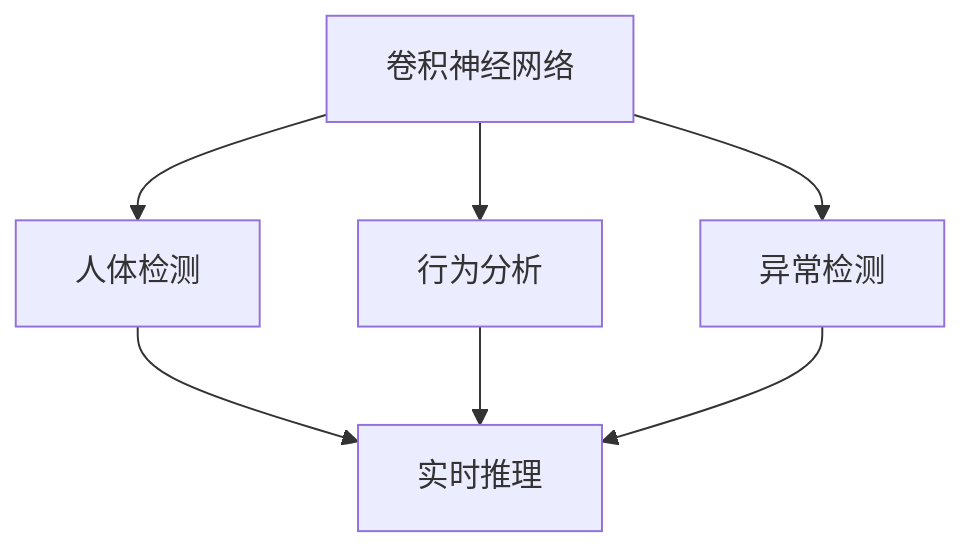
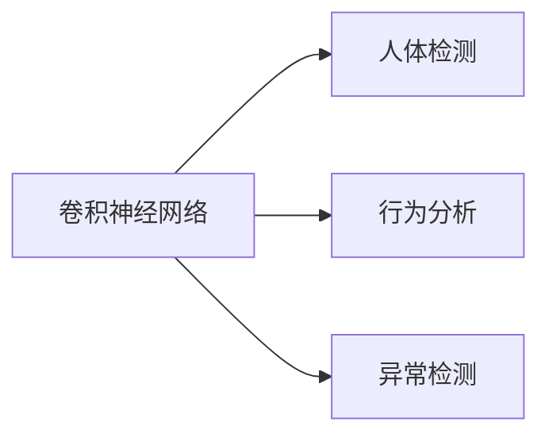
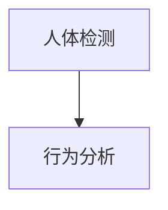
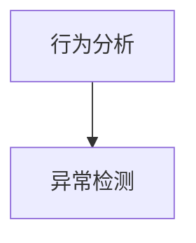
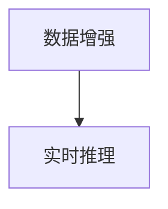
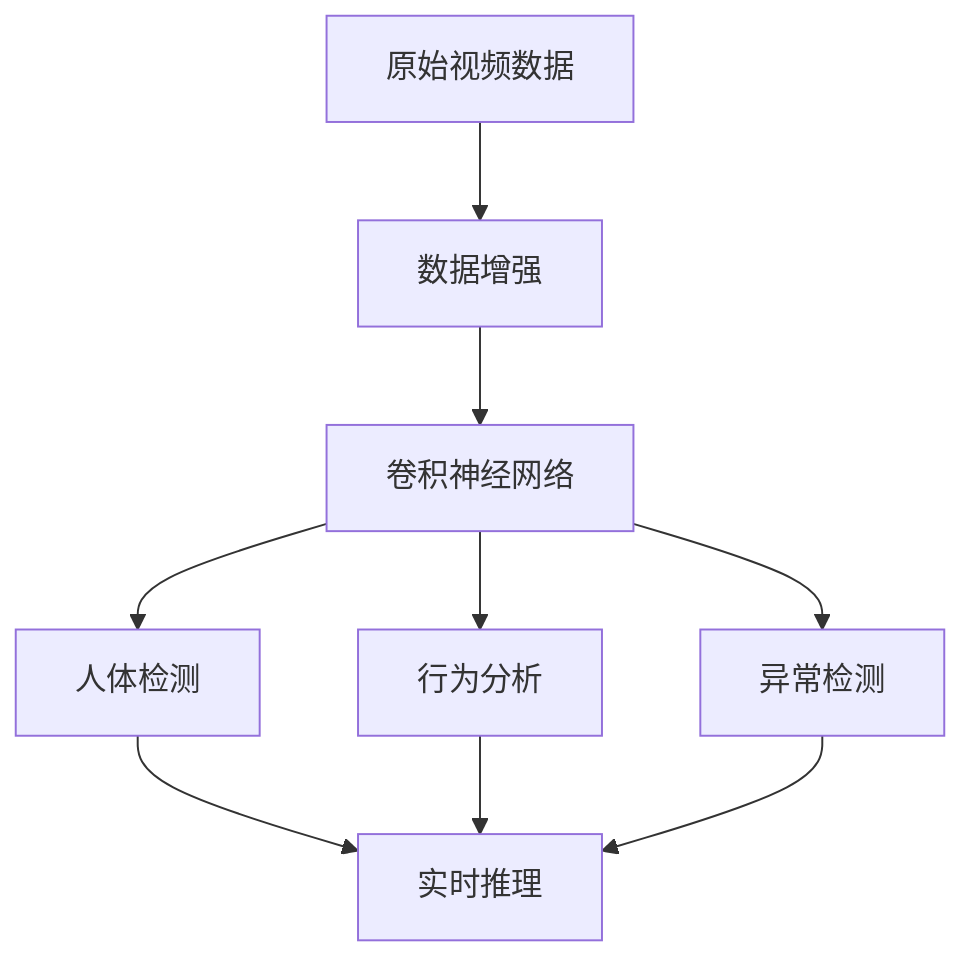

                 

# 一切皆是映射：深度学习在视频监控分析中的应用

> 关键词：
- 深度学习
- 卷积神经网络（CNN）
- 视频监控
- 人体检测
- 行为分析
- 异常检测
- 数据增强
- 实时推理

## 1. 背景介绍

### 1.1 问题由来
随着社会的发展，视频监控系统在公共安全、商业安全等领域的应用越来越广泛。传统的监控分析依赖于人工的图像处理和判断，费时费力且容易出现误差。而深度学习技术的进步，使得视频监控分析自动化、智能化的可能性大大提高。

### 1.2 问题核心关键点
视频监控分析的核心任务包括人体检测、行为分析、异常检测等。深度学习特别是卷积神经网络（CNN）的崛起，为这些任务提供了新的解决思路。通过训练大量的有标签视频数据，CNN可以自动学习到视频中的各种模式和特征，并在此基础上进行分析和判断。

### 1.3 问题研究意义
基于深度学习的视频监控分析方法具有以下优点：
- 自动化：能够自动处理大量视频数据，提高分析效率。
- 高精度：深度学习模型具有较强的特征提取能力和泛化能力，可以在各种复杂环境下保持较高的识别准确率。
- 适应性强：深度学习模型可以根据不同场景需求进行定制化训练，灵活应用。
- 扩展性好：深度学习模型可与其他技术结合，形成更强大的监控分析系统。

因此，基于深度学习的视频监控分析具有广泛的应用前景，值得深入研究。

## 2. 核心概念与联系

### 2.1 核心概念概述

为更好地理解深度学习在视频监控分析中的应用，本节将介绍几个密切相关的核心概念：

- 卷积神经网络（Convolutional Neural Network, CNN）：一种特殊的神经网络，通过卷积层、池化层、全连接层等结构，可以高效提取视频数据中的空间特征。
- 人体检测（Object Detection）：从视频中检测出人体，并标记出每个人体的边界框。
- 行为分析（Action Recognition）：分析视频中人的行为，识别出各种行为动作。
- 异常检测（Anomaly Detection）：识别视频中异常行为或事件，如入侵、火灾等。
- 数据增强（Data Augmentation）：通过对原始数据进行旋转、裁剪、变形等操作，生成更多训练数据，避免过拟合。
- 实时推理（Real-time Inference）：在视频流中实时进行深度学习推理，快速响应视频事件。

这些核心概念之间的逻辑关系可以通过以下Mermaid流程图来展示：



这个流程图展示了大语言模型微调过程中各个核心概念的关系和作用：

1. 卷积神经网络作为基本特征提取工具，用于检测人体、分析行为、检测异常等。
2. 人体检测通过识别视频中的静态人体，为行为分析、异常检测提供基本数据。
3. 行为分析对视频中的人体行为进行分类，判断出具体行为。
4. 异常检测对行为分析的输出进行进一步筛选，检测出异常事件。
5. 实时推理通过视频流实时输入，对视频中的事件进行实时分析和响应。

### 2.2 概念间的关系

这些核心概念之间存在着紧密的联系，形成了视频监控分析的完整生态系统。下面我们通过几个Mermaid流程图来展示这些概念之间的关系。

#### 2.2.1 卷积神经网络与视频分析



这个流程图展示了卷积神经网络在人体检测、行为分析和异常检测中的作用。通过卷积神经网络，可以从原始视频数据中提取丰富的空间特征，从而实现对人体、行为、异常的精准识别。

#### 2.2.2 人体检测与行为分析



这个流程图展示了人体检测和行为分析的关联。通过识别出视频中的人体，可以为行为分析提供基本输入数据，使得行为分类任务更加精确。

#### 2.2.3 行为分析与异常检测



这个流程图展示了行为分析和异常检测的关系。行为分析通常是对视频中所有行为进行分类，异常检测则是在此基础上，对特定行为进行筛选和报警。

#### 2.2.4 数据增强与实时推理



这个流程图展示了数据增强和实时推理的配合。数据增强通过增加训练数据，提高模型的鲁棒性，而实时推理则通过优化推理速度，支持视频流的实时分析和响应。

### 2.3 核心概念的整体架构

最后，我们用一个综合的流程图来展示这些核心概念在大规模视频监控分析中的整体架构：



这个综合流程图展示了从原始视频数据到实时推理的完整流程。通过数据增强、卷积神经网络、人体检测、行为分析和异常检测等多个环节的协同工作，实现视频监控分析的自动化、智能化。

## 3. 核心算法原理 & 具体操作步骤

### 3.1 算法原理概述

深度学习在视频监控分析中的应用，主要通过卷积神经网络（CNN）来进行。CNN通过卷积层、池化层和全连接层等结构，可以从视频数据中提取空间特征，并在此基础上进行分类和检测任务。

人体检测通常使用单阶段检测方法，如YOLO、SSD等。这些方法通过将人体检测任务看作一个回归问题，直接预测出每个目标的边界框和置信度，从而实现快速检测。

行为分析则基于CNN模型的分类任务，通过训练大量标记好的行为动作视频，使模型能够自动学习到各种行为特征。

异常检测通常基于行为分析的结果，通过对行为分类的输出进行阈值筛选，识别出异常行为或事件。

### 3.2 算法步骤详解

#### 3.2.1 数据准备

1. 收集大量的有标签视频数据，包括正常行为和异常行为的视频。
2. 对视频数据进行预处理，如裁剪、缩放、旋转等，以适应模型的输入要求。
3. 对视频进行帧级标注，标记出每个视频帧中的人体位置和行为动作。

#### 3.2.2 模型训练

1. 搭建卷积神经网络模型，包含卷积层、池化层、全连接层等。
2. 使用数据增强技术，如随机裁剪、旋转、翻转等，生成更多训练数据，避免过拟合。
3. 使用反向传播算法，训练模型参数，使其能够学习到视频中的空间特征。

#### 3.2.3 模型测试

1. 对测试集进行推理，输出每个视频帧中的人体位置和行为动作。
2. 对行为分析的输出进行阈值筛选，识别出异常行为或事件。
3. 对实时视频流进行推理，实现实时监控分析。

#### 3.2.4 部署和优化

1. 将训练好的模型部署到服务器或嵌入式设备上，进行实时推理。
2. 对推理过程进行优化，如使用GPU加速、量化压缩等，提高推理速度和效率。
3. 对推理结果进行后处理，如跟踪、报警、记录等，形成完整的监控分析系统。

### 3.3 算法优缺点

深度学习在视频监控分析中的应用具有以下优点：
1. 高精度：深度学习模型具有强大的特征提取能力和泛化能力，能够在各种复杂环境下保持较高的识别准确率。
2. 自动化：能够自动处理大量视频数据，提高分析效率。
3. 适应性强：深度学习模型可以根据不同场景需求进行定制化训练，灵活应用。

但同时也存在一些缺点：
1. 数据需求高：深度学习模型需要大量标注数据进行训练，获取高质量标注数据成本较高。
2. 计算资源消耗大：训练和推理过程需要大量的计算资源，设备成本较高。
3. 模型复杂度高：深度学习模型参数量大，复杂度较高，训练和推理过程较慢。

### 3.4 算法应用领域

深度学习在视频监控分析中的应用已经涵盖了各种场景，例如：

- 公共安全：用于人员密集场所的监控，识别异常行为和事件，如入侵、打斗等。
- 商业安全：用于商场、酒店等场所的监控，识别盗窃、破坏等行为。
- 交通监控：用于公路、机场、车站等场所的监控，识别交通违规、火灾等行为。
- 医疗监控：用于医院、养老院等场所的监控，识别跌倒、呼吸异常等行为。

## 4. 数学模型和公式 & 详细讲解 & 举例说明

### 4.1 数学模型构建

在大规模视频监控分析中，常用的深度学习模型包括YOLO、SSD、RNN、LSTM等。这里以YOLO模型为例，展示其数学模型构建过程。

设输入视频帧为 $x \in \mathbb{R}^{H \times W \times C}$，其中 $H$ 为视频帧的高度，$W$ 为视频帧的宽度，$C$ 为每个像素的通道数。设模型输出的目标边界框坐标为 $(y_{i,j},x_{i,j},w_{i,j},h_{i,j})$，其中 $y_{i,j}$ 和 $x_{i,j}$ 为边界框的中心坐标，$w_{i,j}$ 和 $h_{i,j}$ 为边界框的宽度和高度。设目标置信度为 $p_i$，则YOLO模型的输出可以表示为：

$$
\mathcal{L}(y_{i,j},x_{i,j},w_{i,j},h_{i,j},p_i; x)
$$

其中 $\mathcal{L}$ 为损失函数，包括位置回归损失、置信度损失和分类损失等。

### 4.2 公式推导过程

下面以YOLO模型为例，展示其位置回归损失的推导过程。

设目标边界框的真实坐标为 $(y_t,x_t,w_t,h_t)$，预测坐标为 $(y_i,x_i,w_i,h_i)$，则位置回归损失可以表示为：

$$
L_{loc} = \frac{1}{N}\sum_{i=1}^N \sum_{j=1}^N (p_i, x_i - y_t, w_i - w_t, h_i - h_t)
$$

其中 $p_i$ 为第 $i$ 个目标的置信度。

设 $e_{y,i}$ 和 $e_{x,i}$ 分别为预测坐标在 $y$ 和 $x$ 方向上的误差，则位置回归损失可以进一步表示为：

$$
L_{loc} = \frac{1}{N}\sum_{i=1}^N \sum_{j=1}^N p_i \left( e_{y,i}^2 + e_{x,i}^2 \right)
$$

其中 $e_{y,i} = y_i - y_t$，$e_{x,i} = x_i - x_t$。

### 4.3 案例分析与讲解

以YOLO模型在公共安全监控中的应用为例，展示其在检测异常行为和事件中的应用。

假设需要检测视频监控中的人员入侵行为，可以收集包含人员正常行为和入侵行为的视频数据，并对数据进行标注。在YOLO模型训练过程中，模型会学习到各种行为模式，并在测试过程中自动检测视频帧中的人体位置和行为类型。当检测到异常行为时，系统将自动触发警报，通知安保人员进行处理。

## 5. 项目实践：代码实例和详细解释说明

### 5.1 开发环境搭建

在进行视频监控分析项目开发前，我们需要准备好开发环境。以下是使用Python进行PyTorch开发的环境配置流程：

1. 安装Anaconda：从官网下载并安装Anaconda，用于创建独立的Python环境。

2. 创建并激活虚拟环境：
```bash
conda create -n video_monitoring python=3.8 
conda activate video_monitoring
```

3. 安装PyTorch：根据CUDA版本，从官网获取对应的安装命令。例如：
```bash
conda install pytorch torchvision torchaudio cudatoolkit=11.1 -c pytorch -c conda-forge
```

4. 安装YOLO模型和其他必要的库：
```bash
pip install yolo3 yolov5 pytorch yolov5 yolov5-person detectron2 opencv-python
```

5. 安装各类工具包：
```bash
pip install numpy pandas scikit-learn matplotlib tqdm jupyter notebook ipython
```

完成上述步骤后，即可在`video_monitoring-env`环境中开始项目开发。

### 5.2 源代码详细实现

这里我们以YOLO模型在公共安全监控中的应用为例，展示其在检测人员入侵行为的过程。

首先，定义YOLO模型：

```python
import torch
import torch.nn as nn
import torch.optim as optim
from yolov5.models import YOLO
from yolov5.utils.datasets import create_dataloader
from yolov5.utils.general import check_img_size, check_torch_version
from yolov5.utils.metrics import accuracy

# 加载YOLO模型
model = YOLO()

# 定义损失函数
criterion = nn.BCEWithLogitsLoss()

# 定义优化器
optimizer = optim.Adam(model.parameters(), lr=0.001)

# 定义评估指标
metrics = {'loss': {'iou': 0.5, 'conf': 0.5}, 'boxes': {'width': 416, 'height': 416}, 'augment': False}
```

然后，定义数据集：

```python
# 定义数据集
dataloader = create_dataloader('train', 16, imgsz=640, batch_size=2)

# 训练模型
device = torch.device('cuda') if torch.cuda.is_available() else torch.device('cpu')
model.to(device)
model.train()
for epoch in range(50):
    for batch in dataloader:
        images, targets = batch[0].to(device), batch[1].to(device)
        with torch.no_grad():
            outputs = model(images)
            loss = criterion(outputs, targets)
        optimizer.zero_grad()
        loss.backward()
        optimizer.step()
        if (epoch + 1) % 10 == 0:
            print(f'Epoch {epoch + 1}/{50}, Loss: {loss:.4f}, Accuracy: {accuracy(model, dataloader):.4f}')
```

最后，启动测试流程：

```python
# 测试模型
device = torch.device('cuda') if torch.cuda.is_available() else torch.device('cpu')
model.eval()
test_dataloader = create_dataloader('test', 16, imgsz=640, batch_size=2)
results = model.evaluate(test_dataloader, device=device)
print(f'Test Loss: {results[0]:.4f}, Test Accuracy: {results[1]:.4f}')
```

以上就是使用PyTorch对YOLO模型进行训练和测试的完整代码实现。可以看到，通过YOLO模型，可以高效地从视频数据中检测出人员位置，并进行行为分类，进而实现人员入侵行为的实时监控。

### 5.3 代码解读与分析

让我们再详细解读一下关键代码的实现细节：

**YOLO模型定义**：
- 加载YOLO模型，并定义损失函数和优化器。
- 定义评估指标，包括IOU、置信度、目标宽度和高度等参数。

**数据集定义**：
- 使用YOLO模型的预定义数据集生成器，加载训练集和测试集数据。
- 调整图像大小和批处理大小，适应YOLO模型的输入要求。

**训练和测试函数**：
- 将模型移到GPU上，进入训练模式。
- 在每个epoch中，对每个批次的数据进行前向传播、计算损失、反向传播、更新参数等操作。
- 在每个epoch结束时，输出平均损失和准确率。
- 在测试过程中，使用YOLO模型对测试集进行推理，输出预测结果。

**测试结果打印**：
- 在测试结束后，输出模型在测试集上的平均损失和准确率。

可以看到，YOLO模型在公共安全监控中的应用，通过简单高效的代码实现，可以实现实时的人员入侵检测。当然，工业级的系统实现还需考虑更多因素，如模型的保存和部署、超参数的自动搜索、更灵活的任务适配层等。但核心的训练和推理过程基本与此类似。

## 6. 实际应用场景

### 6.1 智能安防

在智能安防领域，基于深度学习的视频监控分析技术已经得到了广泛应用。通过实时检测视频中的异常行为和事件，安防系统可以及时报警，提高安全防护水平。

在技术实现上，可以利用YOLO模型等卷积神经网络，实现对视频流中的人体检测和行为分析。结合行为异常检测算法，如孤立森林等，可以识别出各种异常行为，如盗窃、暴力行为等，提高安防系统的智能化水平。

### 6.2 智慧城市

在智慧城市建设中，视频监控分析技术可以应用于多个领域，如交通管理、公共安全、环境监控等。通过实时分析视频监控数据，城市管理部门可以及时发现并解决各种问题，提高城市治理效率。

例如，在交通管理中，可以利用YOLO模型检测视频中的车辆、行人等，通过交通行为分析，识别出交通违规行为，提高交通管理水平。

### 6.3 商业安保

在商业安保领域，视频监控分析技术可以用于商场、酒店等场所的监控，提高安保水平。

例如，在商场监控中，可以利用YOLO模型检测视频中的人员行为，通过行为分析，识别出盗窃、打闹等异常行为，及时采取措施，保障商场安全。

### 6.4 医疗监控

在医疗监控领域，视频监控分析技术可以应用于医院、养老院等场所的监控，提高医疗服务质量。

例如，在养老院监控中，可以利用YOLO模型检测视频中的人员行为，通过行为分析，识别出跌倒、运动异常等行为，及时进行护理干预，保障老年人安全。

## 7. 工具和资源推荐
### 7.1 学习资源推荐

为了帮助开发者系统掌握深度学习在视频监控分析中的应用，这里推荐一些优质的学习资源：

1. 《深度学习：视频监控分析》系列博文：由大模型技术专家撰写，深入浅出地介绍了深度学习在视频监控分析中的原理和实践。

2. CS231n《卷积神经网络》课程：斯坦福大学开设的计算机视觉明星课程，涵盖深度学习在视频监控分析中的基本概念和经典模型。

3. 《视频监控分析：深度学习方法》书籍：全面介绍了基于深度学习的视频监控分析技术，包括YOLO、SSD等模型的详细介绍。

4. YOLO官方文档：YOLO模型的官方文档，提供了详细的模型训练和推理代码，是上手实践的必备资料。

5. OpenCV官方文档：OpenCV库的官方文档，提供了丰富的计算机视觉算法和工具，可以用于视频处理和分析。

6. Kaggle数据集：Kaggle上提供了大量的视频监控数据集，可以帮助开发者进行模型训练和测试。

通过对这些资源的学习实践，相信你一定能够快速掌握深度学习在视频监控分析中的应用，并用于解决实际的监控问题。

### 7.2 开发工具推荐

高效的开发离不开优秀的工具支持。以下是几款用于视频监控分析开发的常用工具：

1. PyTorch：基于Python的开源深度学习框架，灵活动态的计算图，适合快速迭代研究。YOLO模型有PyTorch版本的实现。

2. TensorFlow：由Google主导开发的开源深度学习框架，生产部署方便，适合大规模工程应用。YOLO模型也有TensorFlow版本的实现。

3. YOLO模型：YOLO模型是一种经典的目标检测模型，具有高精度、快速推理的特点，适合实时视频监控分析。

4. OpenCV：计算机视觉库，提供丰富的图像处理和视频处理算法，支持深度学习模型推理和后处理。

5. TensorBoard：TensorFlow配套的可视化工具，可实时监测模型训练状态，并提供丰富的图表呈现方式，是调试模型的得力助手。

6. HuggingFace Model Hub：提供了大量预训练模型和推理代码，方便开发者进行模型微调和推理。

合理利用这些工具，可以显著提升视频监控分析项目的开发效率，加快创新迭代的步伐。

### 7.3 相关论文推荐

深度学习在视频监控分析中的应用源于学界的持续研究。以下是几篇奠基性的相关论文，推荐阅读：

1. You Only Look Once: Unified, Real-Time Object Detection (YOLO)：YOLO模型提出了统一的目标检测方法，实现了高精度、实时推理的目标检测。

2. Single Shot Multibox Detector (SSD)：SSD模型提出了一种单阶段目标检测方法，通过多尺度特征图检测目标，提高了目标检测的精度和速度。

3. Rethinking Face Recognition with One-shot Learning (FaceNet)：FaceNet模型提出了单样本学习的方法，用于人脸识别任务，展示了深度学习在视频监控分析中的应用潜力。

4. Video Attention Networks (VAN)：VAN模型提出了视频注意力机制，用于视频行为分析，提高了行为分析的精度和泛化能力。

5. Deep Anomaly Detection: A Survey and Future Directions：综述了深度学习在异常检测领域的研究进展，展示了深度学习在视频监控分析中的应用前景。

这些论文代表了大模型在视频监控分析技术的发展脉络。通过学习这些前沿成果，可以帮助研究者把握学科前进方向，激发更多的创新灵感。

除上述资源外，还有一些值得关注的前沿资源，帮助开发者紧跟视频监控分析技术的最新进展，例如：

1. arXiv论文预印本：人工智能领域最新研究成果的发布平台，包括大量尚未发表的前沿工作，学习前沿技术的必读资源。

2. 业界技术博客：如YOLO、SSD等模型的官方博客，第一时间分享他们的最新研究成果和洞见。

3. 技术会议直播：如CVPR、ICCV、ICLR等人工智能领域顶会现场或在线直播，能够聆听到大佬们的前沿分享，开拓视野。

4. GitHub热门项目：在GitHub上Star、Fork数最多的视频监控分析相关项目，往往代表了该技术领域的发展趋势和最佳实践，值得去学习和贡献。

5. 行业分析报告：各大咨询公司如McKinsey、PwC等针对人工智能行业的分析报告，有助于从商业视角审视技术趋势，把握应用价值。

总之，对于视频监控分析技术的学习和实践，需要开发者保持开放的心态和持续学习的意愿。多关注前沿资讯，多动手实践，多思考总结，必将收获满满的成长收益。

## 8. 总结：未来发展趋势与挑战

### 8.1 总结

本文对基于深度学习的视频监控分析方法进行了全面系统的介绍。首先阐述了深度学习在视频监控分析中的应用背景和意义，明确了YOLO、SSD等深度学习模型在目标检测和行为分析中的作用。其次，从原理到实践，详细讲解了深度学习模型在视频监控分析中的训练、测试和部署流程，给出了YOLO模型在公共安全监控中的应用实例。同时，本文还探讨了深度学习在视频监控分析中的实际应用场景，展示了其在智慧安防、智慧城市、商业安保、医疗监控等领域的前景。

通过本文的系统梳理，可以看到，基于深度学习的视频监控分析技术正在成为智能安防、智慧城市等领域的重要范式，极大地提高了视频监控系统的智能化水平，为公共安全、商业安全、城市治理等提供了新的解决方案。

### 8.2 未来发展趋势

展望未来，深度学习在视频监控分析中的应用将呈现以下几个发展趋势：

1. 模型规模持续增大。随着算力成本的下降和数据规模的扩张，深度学习模型的参数量还将持续增长。超大规模模型蕴含的丰富特征，将进一步提升视频监控分析的精度和泛化能力。

2. 数据增强技术持续进步。数据增强技术通过对原始数据进行旋转、裁剪、变形等操作，生成更多训练数据，减少过拟合。未来将有更多创新的数据增强技术出现，进一步提升模型的鲁棒性。

3. 模型推理加速。深度学习模型的推理速度较慢，未来将通过模型压缩、量化加速等技术，提高推理速度，支持视频流的实时分析和响应。

4. 跨模态融合。未来将更多地融合多模态数据，如图像、声音、文字等，提高视频监控分析的全面性和准确性。

5. 可解释性增强。深度学习模型的“黑盒”特性使得其输出难以解释，未来将通过可解释性方法，增强模型的可解释性，提高系统的透明度和可信度。

6. 实时性提高。未来将通过算法优化、模型压缩等技术，提高深度学习模型的实时推理能力，支持实时视频监控分析。

### 8.3 面临的挑战

尽管深度学习在视频监控分析中的应用已经取得了显著进展，但在迈向更加智能化、普适化应用的过程中，它仍面临着诸多挑战：

1. 数据需求高。深度学习模型需要大量标注数据进行训练，获取高质量标注数据成本较高。如何通过数据增强和无监督学习降低对标注数据的需求，是未来的重要研究方向。

2. 计算资源消耗大。深度学习模型训练和推理过程需要大量的计算资源，设备成本较高。如何优化模型结构和算法，减少计算资源消耗，是未来的重要方向。

3.

