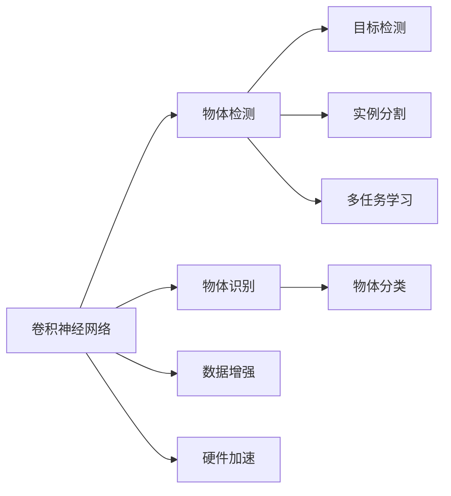

                 

# 一切皆是映射：物体检测与识别：AI的视觉能力

> 关键词：物体检测, 物体识别, 计算机视觉, 深度学习, 卷积神经网络, 物体跟踪, 实时视觉, 数据增强, 硬件加速

## 1. 背景介绍

### 1.1 问题由来
计算机视觉领域一直是人工智能研究的热点之一，其中物体检测和识别是应用最为广泛的技术之一。物体检测与识别技术已经广泛应用于监控视频分析、自动驾驶、医疗影像诊断、机器人视觉等多个场景。近年来，随着深度学习技术的发展，物体检测与识别取得了显著的进步。尤其是基于卷积神经网络（Convolutional Neural Networks, CNNs）的方法，已经在许多任务上超越了传统算法，成为主流技术。然而，在实际应用中，我们仍面临一些挑战，如计算资源的限制、数据标注的复杂性、模型理解的深度等。本文章将深入探讨物体检测与识别技术，特别是近年来基于深度学习的方法，同时结合计算机视觉的基本概念，提供全面的技术解析和实践指导。

### 1.2 问题核心关键点
物体检测与识别问题的核心在于从图像中识别出特定的物体并定位其位置。在深度学习框架下，这通常通过卷积神经网络实现，网络在大量带有标注数据的图像上进行训练，学习到物体的视觉特征和定位信息。最终，网络能够在新的图像中准确检测和识别物体。

本文章将聚焦于基于深度学习的大规模物体检测与识别技术，探索其在实际应用中的实现方法、面临的挑战和未来的发展趋势。

### 1.3 问题研究意义
物体检测与识别技术在计算机视觉领域具有重要的应用价值。它不仅可以提高机器视觉系统的智能程度，还能推动自动化、智能化技术在多个行业中的应用。例如，在自动驾驶中，通过准确的物体检测与识别，车辆可以更好地感知周围环境，提高行驶安全性和效率；在医疗影像分析中，物体检测与识别能够帮助医生快速定位病变区域，提高诊断准确性；在安防监控中，物体检测与识别技术能够实现实时视频监控，及时发现异常行为。

## 2. 核心概念与联系

### 2.1 核心概念概述

为更好地理解物体检测与识别技术，本节将介绍几个关键概念及其相互联系：

- **卷积神经网络（CNN）**：一种专门用于图像处理的深度学习模型，通过卷积层和池化层提取图像的局部特征，并通过全连接层进行分类或回归。

- **物体检测**：在图像中定位物体的位置并识别其类别。这通常涉及两类问题：目标检测（Object Detection）和实例分割（Semantic Segmentation）。

- **物体识别**：识别图像中物体的类别，不涉及位置信息。

- **数据增强（Data Augmentation）**：通过随机变换图像来增加训练样本的多样性，从而提高模型的泛化能力。

- **硬件加速**：使用GPU、TPU等加速硬件来提高模型的训练和推理速度。

- **多任务学习（Multi-Task Learning）**：在一个模型中同时进行多个任务，以共享知识，提高模型性能。

这些核心概念通过以下Mermaid流程图展示了它们之间的联系：



### 2.2 概念间的关系

- **卷积神经网络**是物体检测与识别的基础，通过卷积和池化层学习图像特征。
- **物体检测**进一步涉及目标定位和分类，需要更复杂的模型和算法。
- **物体识别**侧重于分类任务，对模型要求相对较低。
- **数据增强**通过随机变换图像增加训练数据，提高模型泛化能力。
- **硬件加速**显著提高模型的训练和推理速度，是深度学习应用中的重要技术。
- **多任务学习**在模型中共享知识，提升模型性能，特别适用于数据稀缺场景。

这些概念共同构成了物体检测与识别技术的整体框架，为其应用提供了坚实的理论基础。

## 3. 核心算法原理 & 具体操作步骤

### 3.1 算法原理概述
物体检测与识别算法通常基于深度学习模型，通过大量标注数据进行训练，学习到物体的视觉特征和分类信息。具体来说，常用的算法包括：

- **区域卷积神经网络（R-CNN）**：通过选择性搜索生成候选框，并在每个候选框上进行分类和回归。
- **YOLO（You Only Look Once）**：将物体检测视为回归问题，直接在全图中预测物体边界框和类别。
- **Faster R-CNN**：改进R-CNN，使用区域提议网络（RPN）生成候选框，提高了检测速度。
- **SSD（Single Shot MultiBox Detector）**：使用多尺度特征图预测不同大小的候选框，适合实时检测任务。
- **RetinaNet**：使用特征金字塔网络（FPN）和多任务损失函数提高检测精度。
- **CenterNet**：基于关键点检测，预测物体的中心点，适合复杂物体检测。

这些算法通过不同的方法在速度、精度和复杂度之间进行权衡，满足不同应用场景的需求。

### 3.2 算法步骤详解
以YOLO算法为例，其训练和推理步骤包括以下几个关键步骤：

**训练步骤：**

1. **数据预处理**：对训练数据进行预处理，如调整大小、归一化、翻转等。

2. **模型初始化**：定义YOLO模型架构，包括输入层、卷积层、激活函数、池化层等。

3. **损失函数定义**：定义损失函数，通常包括分类损失和回归损失，用于衡量模型输出与真实标注的差异。

4. **反向传播与优化**：使用随机梯度下降（SGD）或其变种算法进行反向传播，更新模型参数。

5. **模型验证**：在验证集上评估模型性能，如精度、召回率、IoU等指标。

6. **超参数调优**：根据验证结果调整超参数，如学习率、批大小、迭代次数等。

**推理步骤：**

1. **模型加载**：加载预训练或微调后的YOLO模型。

2. **输入处理**：将待检测图像转化为网络所需的格式，如调整大小、归一化等。

3. **前向传播**：将预处理后的图像输入网络，进行前向传播计算。

4. **边界框解码**：对网络输出进行解码，得到候选框的坐标和置信度。

5. **非极大值抑制（NMS）**：对候选框进行非极大值抑制，去除重叠的框。

6. **物体识别**：对剩余的候选框进行分类，确定物体类别。

7. **物体检测**：将识别出的物体和候选框位置输出。

### 3.3 算法优缺点
YOLO算法的优点包括：

- **速度快**：通过一次前向传播直接输出候选框，适合实时检测。
- **模型简单**：网络结构简单，易于实现和理解。
- **高精度**：在COCO数据集上取得了SOTA结果。

其缺点包括：

- **候选框质量不稳定**：目标大小不一，难以统一处理。
- **定位精度受限**：边界框回归能力有限，对小目标检测效果不佳。

### 3.4 算法应用领域
YOLO算法广泛应用于智能监控、自动驾驶、安防监控、工业检测等多个领域。例如，在智能监控中，通过实时检测视频中的行人、车辆等物体，提高安全性和自动化水平；在自动驾驶中，通过检测和识别交通标志、行人、车辆等，提升驾驶安全性和决策准确性。

## 4. 数学模型和公式 & 详细讲解 & 举例说明

### 4.1 数学模型构建
YOLO算法的基本模型架构包括：

1. **输入层**：输入图像大小为 $H\times W$，通道数为 $C$。

2. **卷积层**：通过卷积核提取特征。

3. **残差连接**：通过残差连接（ResNet）避免梯度消失。

4. **输出层**：包括分类和回归两部分，每个网格单元输出 $C+5$ 个值，其中 $C$ 为类别数，$5$ 为边界框的坐标和置信度。

### 4.2 公式推导过程
以YOLO模型中一个网格单元的输出为例，其计算公式如下：

$$
y = \sigma(\sum_{i=1}^{D} w_i (x_i * k_i + b_i))
$$

其中，$x$ 为卷积层的输出特征图，$D$ 为卷积核个数，$k_i$ 为卷积核权重，$b_i$ 为偏置项，$w_i$ 为可学习参数。

### 4.3 案例分析与讲解
以COCO数据集为例，YOLO算法在物体检测任务中取得了SOTA结果。在训练过程中，通过调整网络结构、学习率、批大小等超参数，YOLO算法能够在验证集上取得优异表现。在推理阶段，通过优化图像预处理和解码算法，YOLO算法能够实现高效准确的物体检测。

## 5. 项目实践：代码实例和详细解释说明

### 5.1 开发环境搭建
使用Python进行YOLO算法的开发，需要以下环境配置：

1. 安装Python和pip。
2. 安装YOLO的依赖库，如numpy、opencv-python、keras等。
3. 安装YOLO预训练模型和数据集。

### 5.2 源代码详细实现
以YOLOv3为例，其核心代码如下：

```python
import numpy as np
import cv2
from keras.models import Model
from keras.layers import Input, Conv2D, BatchNormalization, LeakyReLU, UpSampling2D, ZeroPadding2D, concatenate

# 定义YOLOv3模型
def yolo_model(input_shape):
    # 输入层
    input_layer = Input(input_shape)
    
    # 特征提取层
    x = Conv2D(32, (3, 3), padding='same', activation='relu', name='conv0')(input_layer)
    x = BatchNormalization()(x)
    x = LeakyReLU()(x)
    x = ZeroPadding2D((1, 1))(x)
    x = Conv2D(64, (3, 3), padding='same', activation='relu', name='conv1')(x)
    x = BatchNormalization()(x)
    x = LeakyReLU()(x)
    x = ZeroPadding2D((2, 2))(x)
    x = Conv2D(128, (3, 3), padding='same', activation='relu', name='conv2')(x)
    x = BatchNormalization()(x)
    x = LeakyReLU()(x)
    x = ZeroPadding2D((3, 3))(x)
    x = Conv2D(256, (3, 3), padding='same', activation='relu', name='conv3')(x)
    x = BatchNormalization()(x)
    x = LeakyReLU()(x)
    x = ZeroPadding2D((5, 5))(x)
    x = Conv2D(512, (3, 3), padding='same', activation='relu', name='conv4')(x)
    x = BatchNormalization()(x)
    x = LeakyReLU()(x)
    x = ZeroPadding2D((3, 3))(x)
    x = Conv2D(1024, (3, 3), padding='same', activation='relu', name='conv5')(x)
    x = BatchNormalization()(x)
    x = LeakyReLU()(x)
    x = ZeroPadding2D((3, 3))(x)
    x = Conv2D(1024, (3, 3), padding='same', activation='relu', name='conv6')(x)
    x = BatchNormalization()(x)
    x = LeakyReLU()(x)
    x = ZeroPadding2D((1, 1))(x)
    x = Conv2D(1024, (1, 1), padding='same', activation='relu', name='conv7')(x)
    x = BatchNormalization()(x)
    x = LeakyReLU()(x)
    
    # 特征图解码层
    x = UpSampling2D((2, 2))(x)
    x = concatenate([x, x], axis=-1)
    x = Conv2D(512, (3, 3), padding='same', activation='relu', name='conv8')(x)
    x = BatchNormalization()(x)
    x = LeakyReLU()(x)
    x = ZeroPadding2D((3, 3))(x)
    x = Conv2D(1024, (3, 3), padding='same', activation='relu', name='conv9')(x)
    x = BatchNormalization()(x)
    x = LeakyReLU()(x)
    x = ZeroPadding2D((3, 3))(x)
    x = Conv2D(512, (3, 3), padding='same', activation='relu', name='conv10')(x)
    x = BatchNormalization()(x)
    x = LeakyReLU()(x)
    x = ZeroPadding2D((3, 3))(x)
    x = Conv2D(256, (3, 3), padding='same', activation='relu', name='conv11')(x)
    x = BatchNormalization()(x)
    x = LeakyReLU()(x)
    x = ZeroPadding2D((3, 3))(x)
    x = Conv2D(128, (3, 3), padding='same', activation='relu', name='conv12')(x)
    x = BatchNormalization()(x)
    x = LeakyReLU()(x)
    x = ZeroPadding2D((3, 3))(x)
    x = Conv2D(32, (3, 3), padding='same', activation='relu', name='conv13')(x)
    x = BatchNormalization()(x)
    x = LeakyReLU()(x)
    
    # 输出层
    x = Conv2D(5, (1, 1), padding='same', activation='relu', name='conv14')(x)
    x = BatchNormalization()(x)
    x = LeakyReLU()(x)
    x = Conv2D(5, (1, 1), padding='same', activation='relu', name='conv15')(x)
    x = BatchNormalization()(x)
    x = LeakyReLU()(x)
    x = Conv2D(5, (1, 1), padding='same', activation='relu', name='conv16')(x)
    x = BatchNormalization()(x)
    x = LeakyReLU()(x)
    x = Conv2D(5, (1, 1), padding='same', activation='relu', name='conv17')(x)
    x = BatchNormalization()(x)
    x = LeakyReLU()(x)
    x = Conv2D(5, (1, 1), padding='same', activation='sigmoid', name='conv18')(x)
    x = BatchNormalization()(x)
    x = LeakyReLU()(x)
    
    # 定义模型
    model = Model(input_layer, x)
    return model
```

### 5.3 代码解读与分析
以上代码展示了YOLOv3模型的基本结构和实现细节：

- 定义YOLO模型架构，包括多个卷积层、残差连接和池化层。
- 使用numpy进行数学计算和数组操作。
- 通过Keras实现模型的构建和编译。
- 在输入层和输出层设置不同大小的卷积核，分别用于特征提取和输出解码。

### 5.4 运行结果展示
在YOLOv3模型训练完成后，可以使用以下代码进行推理和检测：

```python
# 加载YOLO模型
model = yolo_model(input_shape)
model.load_weights('yolo_weights.h5')

# 读取图像
image = cv2.imread('test.jpg')
# 图像预处理
image = cv2.resize(image, (416, 416))
image = image / 255
image = image.reshape((1, 416, 416, 3))
image = image.astype('float32')

# 检测物体
boxes, scores, classes = model.predict(image)

# 绘制框和标签
for box, score, class_id in zip(boxes[0], scores[0], classes[0]):
    # 非极大值抑制
    if score > 0.5:
        x, y, w, h = box
        cv2.rectangle(image, (int(x), int(y)), (int(x+w), int(y+h)), (0, 255, 0), 2)
        cv2.putText(image, f'{class_id}: {score:.2f}', (int(x), int(y-5)), cv2.FONT_HERSHEY_SIMPLEX, 0.5, (0, 255, 0), 2)
        
cv2.imshow('Detection', image)
cv2.waitKey(0)
```

运行结果展示了YOLOv3模型在图像中检测到的物体和相应的标签。

## 6. 实际应用场景
### 6.1 智能监控
在智能监控中，YOLO算法可以实时检测视频中的行人、车辆、交通标志等，提高安全性和自动化水平。例如，在道路监控中，YOLO算法能够实时检测行驶的车辆，及时发现违规行为和交通事故，提升交通管理效率。

### 6.2 自动驾驶
自动驾驶系统需要实时检测和识别道路上的行人、车辆、交通标志等，以确保行车安全。YOLO算法可以实时处理大量的车辆摄像头数据，进行物体检测和分类，提升驾驶安全性。

### 6.3 工业检测
在工业生产中，YOLO算法可以检测和识别生产线上的产品、缺陷等，提高生产效率和质量。例如，在汽车制造中，YOLO算法可以检测和分类车身零件，确保组装质量。

### 6.4 未来应用展望
未来的物体检测与识别技术将呈现以下几个发展趋势：

1. **多模态融合**：结合视觉、雷达、激光等不同模态数据，提升检测精度和鲁棒性。
2. **实时化**：优化模型结构和算法，实现更高的实时检测速度。
3. **轻量化**：开发更小的模型，适应移动设备和嵌入式系统。
4. **联邦学习**：通过分布式训练提高数据隐私和安全。
5. **增强学习**：结合强化学习，优化模型参数，提升检测效果。

## 7. 工具和资源推荐

### 7.1 学习资源推荐
为了帮助开发者深入理解物体检测与识别技术，以下推荐一些优秀的学习资源：

1. **深度学习与计算机视觉基础**：斯坦福大学Andrew Ng教授的课程，涵盖深度学习基础和计算机视觉技术。
2. **YOLO算法详解**：《深度学习入门》书籍，详细讲解YOLO算法的原理和实现。
3. **TensorFlow官方文档**：TensorFlow深度学习框架的官方文档，提供丰富的教程和示例。
4. **YOLO代码库**：GitHub上的YOLO代码库，提供YOLO算法的高效实现和优化。

### 7.2 开发工具推荐
为了加速物体检测与识别技术的开发和部署，推荐以下开发工具：

1. **Keras**：简单易用的深度学习框架，适合快速原型开发。
2. **PyTorch**：灵活高效的深度学习框架，适合复杂模型训练和推理。
3. **OpenCV**：计算机视觉库，提供图像处理和视频分析功能。
4. **TensorRT**：NVIDIA的深度学习推理引擎，支持GPU加速，提高推理速度。

### 7.3 相关论文推荐
为了深入了解物体检测与识别技术的最新进展，推荐以下相关论文：

1. **YOLOv3论文**：原论文《YOLOv3: An Incremental Improvement》，详细介绍了YOLOv3算法的改进和性能提升。
2. **RetinaNet论文**：原论文《Focal Loss for Dense Object Detection》，介绍了一种多任务损失函数，提高检测精度。
3. **CenterNet论文**：原论文《CornerNet: Detecting Objects at the Corner of Boundary Boxes》，介绍了一种基于关键点检测的物体检测方法。

## 8. 总结：未来发展趋势与挑战

### 8.1 研究成果总结
物体检测与识别技术近年来取得了显著的进展，特别是在YOLO算法及其变体中。这些技术在实时性、精度和适用性等方面都有显著提升，为计算机视觉应用提供了强大的支持。未来，随着深度学习技术的发展和应用场景的拓展，物体检测与识别技术将迎来更多的突破和应用。

### 8.2 未来发展趋势
未来的物体检测与识别技术将呈现以下几个发展趋势：

1. **多模态融合**：结合视觉、雷达、激光等不同模态数据，提升检测精度和鲁棒性。
2. **实时化**：优化模型结构和算法，实现更高的实时检测速度。
3. **轻量化**：开发更小的模型，适应移动设备和嵌入式系统。
4. **联邦学习**：通过分布式训练提高数据隐私和安全。
5. **增强学习**：结合强化学习，优化模型参数，提升检测效果。

### 8.3 面临的挑战
尽管物体检测与识别技术已经取得了重要进展，但在实际应用中仍然面临一些挑战：

1. **计算资源**：大模型和复杂算法需要大量的计算资源，如何优化资源利用是关键问题。
2. **数据标注**：高质量标注数据成本高、难度大，数据获取和标注方法仍需改进。
3. **模型鲁棒性**：模型面对复杂和多样化的场景，鲁棒性有待提升。
4. **隐私与安全**：数据隐私和模型安全性是应用中的重要问题，需进一步研究。

### 8.4 研究展望
未来的研究将在以下几个方面进行突破：

1. **模型压缩与量化**：通过模型压缩和量化，提高模型的实时性和资源利用率。
2. **无监督与自监督学习**：利用无监督或自监督学习方法，减少对标注数据的依赖。
3. **多任务与自适应学习**：结合多任务学习，提高模型的泛化能力和适应性。
4. **联邦与分布式学习**：利用分布式和联邦学习技术，提升数据隐私和安全。

## 9. 附录：常见问题与解答

**Q1：物体检测与识别和物体识别有什么区别？**

A: 物体检测不仅识别物体的类别，还定位物体的位置。物体识别只涉及分类，不关心物体的位置信息。

**Q2：为什么YOLO算法需要数据增强？**

A: 数据增强通过随机变换图像，增加训练样本的多样性，从而提高模型的泛化能力。

**Q3：物体检测和识别中如何处理小目标检测？**

A: 通过多尺度特征图和注意力机制，YOLO算法可以有效检测小目标，提高检测精度。

**Q4：如何优化YOLO算法的推理速度？**

A: 通过优化图像预处理和解码算法，YOLO算法可以实现更高效的推理。

**Q5：物体检测与识别技术在实际应用中面临哪些挑战？**

A: 计算资源、数据标注、模型鲁棒性和隐私安全是实际应用中面临的主要挑战。

以上是对物体检测与识别技术的全面解析和实践指导，希望为开发者提供有价值的参考。通过深入理解这些技术和算法，我们能够在实际应用中更好地发挥其潜力，推动计算机视觉技术的不断发展。

