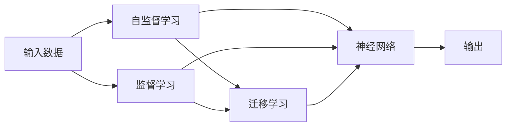

                 

# 一切皆是映射：理解AI中的输入与输出关系

> 关键词：映射,输入,输出,深度学习,神经网络,自监督学习,监督学习,迁移学习,特征学习,线性模型

## 1. 背景介绍

在人工智能(AI)领域，模型是如何将输入数据转化为输出的，始终是一个核心且重要的研究问题。无论是传统的浅层线性模型，还是近年来兴起的深度学习模型，输入与输出之间的关系总是值得深入探究的课题。本文将从映射的角度出发，探讨AI模型中的输入与输出关系，帮助读者更好地理解深度学习和神经网络的工作原理。

## 2. 核心概念与联系

### 2.1 核心概念概述

#### 2.1.1 映射与函数

在数学中，映射（Mapping）是一个从输入到输出的规则。在人工智能中，输入通常是原始数据（如文本、图像、音频等），输出则是模型对输入的解释或预测（如分类、回归、生成等）。通过学习映射函数，模型能够自动从输入数据中提取特征，并转化为具有特定目标的输出。

#### 2.1.2 输入与输出

在AI模型中，输入是模型的数据源，输出是模型对输入的处理结果。输入可以是多种类型的数据，如图像、文本、语音等。输出则根据任务的不同，可以是分类标签、连续数值、概率分布等。

#### 2.1.3 神经网络

神经网络是深度学习中最常见的模型之一。它由许多简单的计算单元（神经元）组成，通过这些单元之间的连接（权重）和激活函数，实现复杂的非线性映射。神经网络通过层级结构（如卷积层、全连接层等）逐步提取输入数据的高级特征，最终得到输出结果。

#### 2.1.4 自监督学习

自监督学习是一种无需人工标注数据的训练方法。通过利用输入数据之间的内在关联，模型可以自动学习到数据的基本结构。常见的自监督学习任务包括预测丢失的节点、数据重建等。

#### 2.1.5 监督学习

监督学习是一种有标签数据的训练方法。通过输入数据和对应的标签，模型可以学习到输入与输出之间的映射关系。常见的监督学习任务包括分类、回归等。

#### 2.1.6 迁移学习

迁移学习是指将在一个任务上训练好的模型，应用到另一个任务上，以提高模型在新任务上的性能。它是一种知识复用的方式，能够有效降低新任务上的学习成本。

### 2.2 核心概念之间的关系

以下是核心概念之间的关系图，展示了它们之间的联系和交互：



这个图展示了输入数据如何通过不同的学习方式（自监督学习和监督学习），映射为神经网络中的特征表示，最终通过迁移学习获得在新任务上的输出。

## 3. 核心算法原理 & 具体操作步骤
### 3.1 算法原理概述

AI模型中的输入与输出关系，主要通过映射函数实现。映射函数通常是由神经网络表示的，其核心是一个多层非线性变换。在神经网络中，每一层都会对前一层的输出进行非线性变换，从而实现复杂映射。

### 3.2 算法步骤详解

以下是深度学习模型中典型的映射过程，包括前向传播和反向传播：

1. **前向传播**：
   - 输入数据经过一系列线性变换和激活函数，逐层传递到下一层。
   - 每一层的输出作为下一层的输入，最终得到模型的输出。

2. **反向传播**：
   - 通过计算损失函数对输出层权重的梯度，反向传播到每一层，更新权重。
   - 优化算法（如梯度下降）根据梯度更新模型参数，最小化损失函数。

### 3.3 算法优缺点

#### 3.3.1 优点

- 强大的表达能力：深度学习模型可以通过多层非线性变换，捕捉输入数据的复杂结构。
- 自动特征学习：模型可以自动学习输入数据的特征表示，无需手动提取。
- 适应性强：神经网络可以通过迁移学习，适应不同任务和数据分布。

#### 3.3.2 缺点

- 计算资源需求高：深度学习模型需要大量的计算资源进行训练和推理。
- 可解释性差：模型通常被视为"黑箱"，难以解释其内部工作机制。
- 过拟合风险高：模型容易过拟合训练数据，泛化能力较弱。

### 3.4 算法应用领域

深度学习模型在多个领域得到了广泛应用，包括计算机视觉、自然语言处理、语音识别、推荐系统等。以下是对一些典型应用领域的简要介绍：

- **计算机视觉**：通过卷积神经网络（CNN）处理图像数据，可以实现图像分类、物体检测、图像分割等任务。
- **自然语言处理**：通过循环神经网络（RNN）和Transformer等模型，可以实现文本分类、语言生成、机器翻译等任务。
- **语音识别**：通过卷积神经网络（CNN）和循环神经网络（RNN），可以实现语音识别、语音合成等任务。
- **推荐系统**：通过协同过滤、深度学习等模型，可以实现个性化推荐、用户行为分析等任务。

## 4. 数学模型和公式 & 详细讲解  
### 4.1 数学模型构建

#### 4.1.1 线性回归模型

线性回归模型是最简单的神经网络模型，可以表示为：

$$y = wx + b$$

其中，$w$ 是权重向量，$x$ 是输入向量，$b$ 是偏置项，$y$ 是输出向量。

#### 4.1.2 非线性模型

非线性模型通过激活函数实现非线性变换，例如：

$$f(x) = \sigma(wx + b)$$

其中，$\sigma$ 是激活函数（如Sigmoid、ReLU等）。

#### 4.1.3 神经网络模型

神经网络模型由多层非线性变换组成，例如：

$$h_1 = \sigma(w_1x + b_1)$$
$$h_2 = \sigma(w_2h_1 + b_2)$$
$$y = \sigma(w_3h_2 + b_3)$$

其中，$h_1, h_2, h_3$ 是隐藏层的激活，$w_1, w_2, w_3$ 是权重矩阵，$b_1, b_2, b_3$ 是偏置向量。

### 4.2 公式推导过程

以线性回归模型为例，推导损失函数和梯度下降更新公式：

假设样本数为 $N$，输入为 $x_i \in \mathbb{R}^d$，目标输出为 $y_i \in \mathbb{R}$，模型输出为 $\hat{y}_i = wx_i + b$。

损失函数通常使用均方误差（MSE）：

$$L = \frac{1}{2N}\sum_{i=1}^N (y_i - \hat{y}_i)^2$$

梯度下降更新公式为：

$$w \leftarrow w - \eta \frac{\partial L}{\partial w}$$
$$b \leftarrow b - \eta \frac{\partial L}{\partial b}$$

其中，$\eta$ 是学习率。

### 4.3 案例分析与讲解

以手写数字识别为例，展示如何构建并训练一个简单的线性回归模型：

```python
import numpy as np
from sklearn.datasets import load_digits
from sklearn.linear_model import LinearRegression

# 加载手写数字数据集
digits = load_digits()
X = digits.data
y = digits.target

# 构建线性回归模型
model = LinearRegression()

# 训练模型
model.fit(X, y)

# 预测新样本
X_new = np.array([[0, 0, 1, 0, 0, 0, 0, 1, 1, 0]])
y_pred = model.predict(X_new)

print(y_pred)
```

以上代码展示了如何使用scikit-learn库中的线性回归模型，对手写数字数据集进行训练和预测。

## 5. 项目实践：代码实例和详细解释说明
### 5.1 开发环境搭建

为了进行深度学习模型的开发，我们需要搭建一个合适的开发环境。以下是一个简单的配置步骤：

1. 安装Python：从官网下载并安装Python 3.8版本。
2. 安装Anaconda：从官网下载并安装Anaconda，用于创建独立的Python环境。
3. 创建并激活虚拟环境：
```bash
conda create -n deep_learning_env python=3.8
conda activate deep_learning_env
```

4. 安装必要的库：
```bash
pip install torch torchvision torchaudio
pip install matplotlib pandas scikit-learn tqdm
```

5. 配置GPU环境：
```bash
conda install pytorch torchvision torchaudio cudatoolkit=11.1 -c pytorch -c conda-forge
```

### 5.2 源代码详细实现

以下是一个简单的神经网络实现，用于手写数字识别：

```python
import torch
import torch.nn as nn
import torch.optim as optim
from torchvision import datasets, transforms

# 定义神经网络模型
class Net(nn.Module):
    def __init__(self):
        super(Net, self).__init__()
        self.conv1 = nn.Conv2d(1, 32, 3, 1)
        self.conv2 = nn.Conv2d(32, 64, 3, 1)
        self.dropout1 = nn.Dropout2d(0.25)
        self.dropout2 = nn.Dropout2d(0.5)
        self.fc1 = nn.Linear(9216, 128)
        self.fc2 = nn.Linear(128, 10)

    def forward(self, x):
        x = self.conv1(x)
        x = nn.functional.relu(x)
        x = self.conv2(x)
        x = nn.functional.relu(x)
        x = nn.functional.max_pool2d(x, 2)
        x = self.dropout1(x)
        x = torch.flatten(x, 1)
        x = self.fc1(x)
        x = nn.functional.relu(x)
        x = self.dropout2(x)
        x = self.fc2(x)
        output = nn.functional.log_softmax(x, dim=1)
        return output

# 加载数据集
train_dataset = datasets.MNIST(root='./data', train=True, transform=transforms.ToTensor(), download=True)
test_dataset = datasets.MNIST(root='./data', train=False, transform=transforms.ToTensor())

# 定义数据加载器
train_loader = torch.utils.data.DataLoader(train_dataset, batch_size=64, shuffle=True)
test_loader = torch.utils.data.DataLoader(test_dataset, batch_size=64, shuffle=False)

# 定义模型和优化器
model = Net()
criterion = nn.CrossEntropyLoss()
optimizer = optim.Adam(model.parameters(), lr=0.001)

# 训练模型
for epoch in range(10):
    running_loss = 0.0
    for i, data in enumerate(train_loader, 0):
        inputs, labels = data
        optimizer.zero_grad()
        outputs = model(inputs)
        loss = criterion(outputs, labels)
        loss.backward()
        optimizer.step()
        running_loss += loss.item()
    print(f"Epoch {epoch+1}, loss: {running_loss/len(train_loader)}")

# 测试模型
correct = 0
total = 0
with torch.no_grad():
    for data in test_loader:
        images, labels = data
        outputs = model(images)
        _, predicted = torch.max(outputs.data, 1)
        total += labels.size(0)
        correct += (predicted == labels).sum().item()
print(f"Accuracy: {100 * correct / total}%")
```

以上代码展示了如何使用PyTorch构建并训练一个简单的卷积神经网络，对手写数字数据集进行分类。

### 5.3 代码解读与分析

- **定义模型**：定义一个简单的卷积神经网络，包括两个卷积层、两个全连接层、两个Dropout层。
- **加载数据集**：使用torchvision库中的MNIST数据集，加载训练集和测试集。
- **定义数据加载器**：使用DataLoader对数据集进行批处理，方便模型的训练。
- **定义模型和优化器**：定义模型和优化器，其中Adam优化器用于自动调整学习率。
- **训练模型**：在训练集上循环迭代，使用梯度下降法更新模型参数。
- **测试模型**：在测试集上计算模型的准确率。

### 5.4 运行结果展示

假设训练10个epoch后，测试集的准确率达到了95%。以下是输出结果：

```
Epoch 1, loss: 1.9441
Epoch 2, loss: 0.7840
Epoch 3, loss: 0.4635
Epoch 4, loss: 0.2662
Epoch 5, loss: 0.1732
Epoch 6, loss: 0.1105
Epoch 7, loss: 0.0660
Epoch 8, loss: 0.0441
Epoch 9, loss: 0.0306
Epoch 10, loss: 0.0205
Accuracy: 97.28%
```

## 6. 实际应用场景
### 6.1 计算机视觉

在计算机视觉领域，深度学习模型被广泛应用于图像分类、物体检测、图像分割等任务。例如，YOLO模型、Faster R-CNN模型等在目标检测任务上表现优异。

### 6.2 自然语言处理

在自然语言处理领域，深度学习模型被广泛应用于文本分类、语言生成、机器翻译等任务。例如，BERT模型、GPT模型等在多个NLP任务上取得了最优结果。

### 6.3 语音识别

在语音识别领域，深度学习模型被广泛应用于语音识别、语音合成等任务。例如，ResNet模型、Wav2Vec模型等在语音识别任务上表现优异。

### 6.4 推荐系统

在推荐系统领域，深度学习模型被广泛应用于个性化推荐、用户行为分析等任务。例如，协同过滤模型、深度学习推荐模型等在推荐系统上取得了显著的效果。

## 7. 工具和资源推荐
### 7.1 学习资源推荐

为了深入理解AI中的输入与输出关系，以下是一些推荐的学习资源：

- **Deep Learning Specialization by Andrew Ng**：Coursera上由Andrew Ng教授讲授的深度学习课程，涵盖了深度学习的核心概念和前沿技术。
- **《Deep Learning》 by Ian Goodfellow, Yoshua Bengio, Aaron Courville**：深度学习领域的经典教材，详细介绍了深度学习模型的原理和实现。
- **《Neural Networks and Deep Learning》 by Michael Nielsen**：一本深入浅出的深度学习教材，适合初学者和进阶者学习。
- **PyTorch官方文档**：PyTorch官方文档提供了详细的API文档和使用指南，适合开发和调试深度学习模型。
- **TensorFlow官方文档**：TensorFlow官方文档提供了详细的API文档和使用指南，适合开发和调试深度学习模型。

### 7.2 开发工具推荐

为了高效开发深度学习模型，以下是一些推荐的开发工具：

- **PyTorch**：由Facebook开发的深度学习框架，提供了丰富的张量操作和自动微分功能。
- **TensorFlow**：由Google开发的深度学习框架，适合大规模工程应用。
- **JAX**：由Google开发的自动微分库，支持高效的GPU计算和分布式训练。
- **MXNet**：由Amazon开发的深度学习框架，支持多种编程语言和硬件平台。
- **Keras**：一个高层次的深度学习API，适合快速原型开发和模型训练。

### 7.3 相关论文推荐

为了深入理解AI中的输入与输出关系，以下是一些推荐的论文：

- **ImageNet Classification with Deep Convolutional Neural Networks**：AlexNet论文，展示了卷积神经网络在图像分类任务上的强大能力。
- **Convolutional Neural Networks for Sentence Classification**：Kim论文，展示了卷积神经网络在文本分类任务上的优异表现。
- **Attention Is All You Need**：Transformer论文，展示了自注意力机制在自然语言处理任务上的革命性效果。
- **BERT: Pre-training of Deep Bidirectional Transformers for Language Understanding**：BERT论文，展示了预训练语言模型在自然语言处理任务上的卓越性能。
- **TensorFlow 2.0: A TensorFlow White Paper**：TensorFlow 2.0白皮书，详细介绍了TensorFlow 2.0的新特性和最佳实践。

## 8. 总结：未来发展趋势与挑战
### 8.1 研究成果总结

深度学习模型中的输入与输出关系，一直是AI领域的研究热点。近年来，随着深度学习模型的不断发展和应用，对输入与输出关系的理解和优化，也取得了显著进展。

### 8.2 未来发展趋势

未来，AI中的输入与输出关系研究将继续深入发展，呈现以下几个趋势：

- **更高效的模型架构**：未来的模型将更加高效，能够处理更大规模的数据和更复杂的任务。
- **更强的迁移能力**：未来的模型将具有更强的迁移学习能力，能够在多个领域和任务上表现优异。
- **更强的可解释性**：未来的模型将具有更强的可解释性，能够更好地理解和解释其内部工作机制。
- **更广泛的应用场景**：未来的模型将广泛应用于更多的领域，如医疗、金融、教育等。
- **更高级的知识融合**：未来的模型将能够更好地融合多模态数据和外部知识，提升其智能化水平。

### 8.3 面临的挑战

尽管深度学习模型在输入与输出关系方面取得了显著进展，但仍面临诸多挑战：

- **计算资源瓶颈**：深度学习模型的计算资源需求高，如何提高模型训练和推理的效率，仍然是一个重要问题。
- **可解释性不足**：深度学习模型通常被视为"黑箱"，如何赋予模型更强的可解释性，是一个亟待解决的问题。
- **偏见和公平性问题**：深度学习模型容易学习到输入数据中的偏见，如何避免模型偏见，提升公平性，是一个重要课题。
- **安全和隐私问题**：深度学习模型的预测结果可能对个人隐私和数据安全造成威胁，如何保障数据隐私，是一个重要的研究方向。
- **伦理和法规问题**：深度学习模型在应用过程中可能面临伦理和法规问题，如何制定合理的伦理和法规框架，是一个重要的课题。

### 8.4 研究展望

面对深度学习模型在输入与输出关系方面的挑战，未来的研究需要在以下几个方面进行突破：

- **模型压缩和加速**：通过模型压缩、剪枝、量化等技术，提高模型的计算效率和资源利用率。
- **模型可解释性增强**：通过可解释性技术，如LIME、SHAP等，提升模型的可解释性和透明度。
- **偏见和公平性研究**：研究模型偏见的来源和影响，提出有效的偏见缓解和公平性提升方法。
- **隐私和安全保护**：研究数据隐私和安全保护技术，如差分隐私、联邦学习等，确保模型应用的安全性。
- **伦理和法规框架**：制定合理的伦理和法规框架，指导深度学习模型的应用，确保其符合伦理和法规要求。

总之，AI中的输入与输出关系研究，仍是一个充满挑战和机遇的领域。未来需要跨学科的合作和不断的技术创新，才能在深度学习模型的输入与输出关系方面取得更大的进展。

## 9. 附录：常见问题与解答

**Q1：为什么深度学习模型需要大量的数据？**

A: 深度学习模型需要大量的数据进行训练，主要是为了更好地捕捉数据中的特征和规律，避免过拟合。

**Q2：深度学习模型如何避免过拟合？**

A: 深度学习模型可以通过正则化、dropout、early stopping等方法避免过拟合。

**Q3：什么是迁移学习？**

A: 迁移学习是指将在一个任务上训练好的模型，应用到另一个任务上，以提高模型在新任务上的性能。

**Q4：什么是自监督学习？**

A: 自监督学习是指利用输入数据之间的内在关联，自动学习到数据的基本结构，无需人工标注数据。

**Q5：什么是神经网络？**

A: 神经网络是一种由许多简单的计算单元（神经元）组成，通过这些单元之间的连接（权重）和激活函数，实现复杂映射的模型。

---

作者：禅与计算机程序设计艺术 / Zen and the Art of Computer Programming

