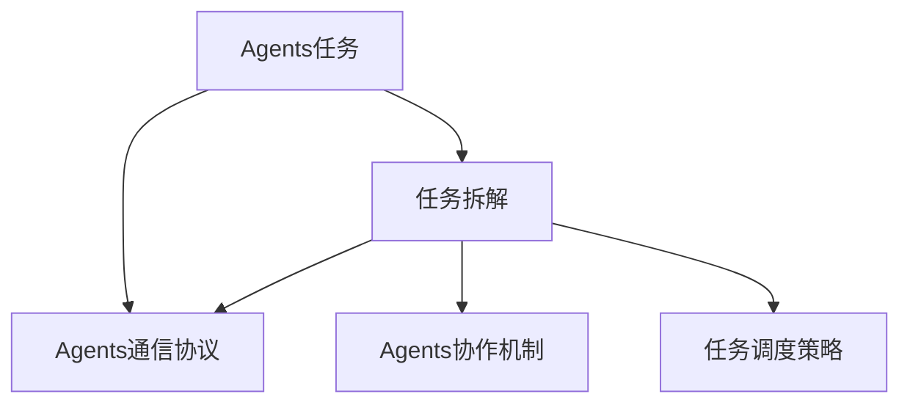
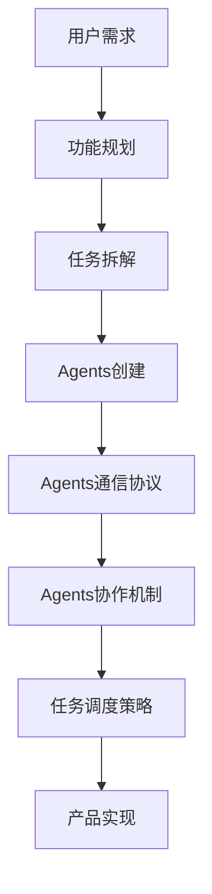
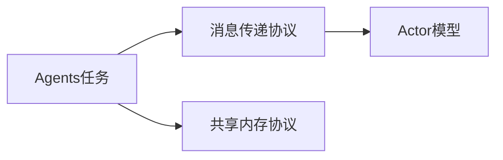
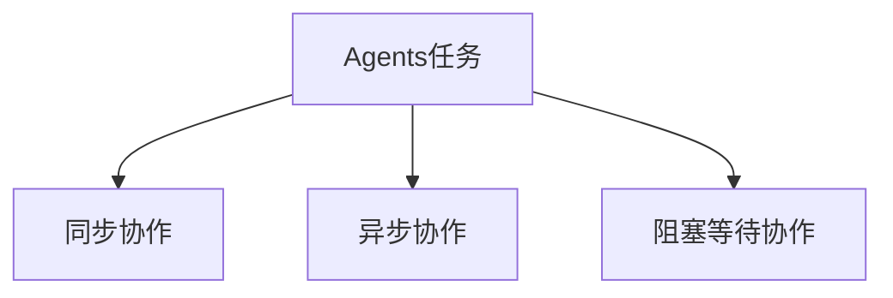
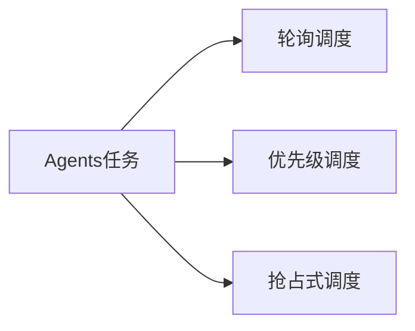

                 

# 产品功能设计中的Agents任务拆解

> 关键词：产品设计, 功能模块, Agents任务, 拆解方法, 产品架构, 用户行为

## 1. 背景介绍

在现代企业产品开发中，成功的产品功能设计不仅是技术难题，更是设计难题。企业通常需要投入大量资源和时间来策划、设计和实现各种功能模块，以期提升用户体验和产品竞争力。然而，在实际开发过程中，功能模块的庞大复杂性往往给开发团队带来巨大的挑战，且功能实现的效率和质量难以保证。

近年来，随着Agent-Based Modeling（基于Agent的建模）的兴起，Agents任务拆解成为一种新的产品功能设计方法，有效缓解了复杂功能模块带来的挑战，大大提高了产品开发的效率和质量。Agents任务拆解的核心思想是将一个大型的、复杂的功能模块拆解成若干个小的、相对独立的Agents，通过协调各Agents之间的关系，实现整个功能模块的目标。

本文将对Agents任务拆解的方法、工具和应用进行深入探讨，帮助企业更好地设计和实现产品功能，提升产品竞争力。

## 2. 核心概念与联系

### 2.1 核心概念概述

- **Agents任务**：Agents任务是指一个独立的功能模块或子系统，可以执行一定的任务，具有明确的输入输出接口和状态。在产品功能设计中，Agents任务通常代表了一个具体的用户行为，如搜索、推荐、交互等。

- **任务拆解**：任务拆解是将一个大型的、复杂的功能模块拆解成若干个小的、相对独立的Agents任务，每个任务负责完成特定的子功能，通过协调各任务之间的关系，实现整个功能模块的目标。

- **Agents通信协议**：Agents通信协议是指各Agents之间传递信息、共享状态的方式。常见的通信协议包括消息传递、共享内存、Actor模型等。

- **Agents协作机制**：Agents协作机制是指各Agents之间如何协同工作，共同实现整体目标。常见的协作机制包括同步协作、异步协作、阻塞等待等。

- **任务调度策略**：任务调度策略是指如何选择和调度各Agents任务的执行顺序，以最大化效率和性能。常见的调度策略包括轮询、优先级调度、抢占式调度等。

这些核心概念之间的逻辑关系可以通过以下Mermaid流程图来展示：



这个流程图展示了大规模产品功能设计中Agents任务拆解的核心概念及其之间的关系：

1. 产品功能设计涉及Agents任务的创建和拆解。
2. 任务拆解后的Agents之间通过通信协议共享信息和状态。
3. 协调Agents任务的协作机制，实现整体目标。
4. 选择合适的任务调度策略，最大化执行效率和性能。

### 2.2 概念间的关系

这些核心概念之间存在着紧密的联系，形成了产品功能设计的完整生态系统。下面我们通过几个Mermaid流程图来展示这些概念之间的关系。

#### 2.2.1 产品功能设计的核心流程



这个流程图展示了产品功能设计的核心流程，从用户需求出发，通过功能规划、任务拆解、Agents创建等步骤，最终实现产品功能。

#### 2.2.2 Agents任务与通信协议的关系



这个流程图展示了Agents任务与通信协议之间的关系。Agents任务之间可以通过消息传递、共享内存或Actor模型等方式进行信息交流和状态共享。

#### 2.2.3 Agents任务与协作机制的关系



这个流程图展示了Agents任务与协作机制之间的关系。Agents任务之间可以通过同步、异步或阻塞等待等方式协同工作，共同实现整体目标。

#### 2.2.4 Agents任务与调度策略的关系



这个流程图展示了Agents任务与调度策略之间的关系。Agents任务可以通过轮询、优先级或抢占式等方式进行调度，以最大化执行效率和性能。

## 3. 核心算法原理 & 具体操作步骤

### 3.1 算法原理概述

Agents任务拆解的算法原理主要基于模块化设计和并行处理的思想，将一个大型的功能模块拆解成若干个小的、相对独立的Agents任务，每个任务负责完成特定的子功能。通过协调各Agents之间的关系，实现整个功能模块的目标。

形式化地，设一个大功能模块为 $F$，包含 $N$ 个小的、相对独立的Agents任务 $A_1, A_2, \dots, A_N$。每个任务 $A_i$ 具有明确的输入 $I_i$ 和输出 $O_i$，以及状态 $S_i$。Agents任务之间的通信和协作通过通信协议 $C$ 和协作机制 $M$ 实现，任务调度策略 $S$ 决定各任务的执行顺序。最终，整个功能模块的目标 $G$ 由各任务的输出 $O_1, O_2, \dots, O_N$ 实现。

Agents任务拆解的算法流程可以简单概括为：

1. 功能模块 $F$ 拆解成若干个小的、相对独立的Agents任务 $A_1, A_2, \dots, A_N$。
2. 设计通信协议 $C$ 和协作机制 $M$，确保各任务之间能够有效协作。
3. 选择任务调度策略 $S$，确定各任务的执行顺序。
4. 执行各任务 $A_1, A_2, \dots, A_N$，最终实现整个功能模块的目标 $G$。

### 3.2 算法步骤详解

#### 3.2.1 功能模块拆解

功能模块拆解是Agents任务拆解的第一步，也是最关键的一步。拆解的原则是将功能模块拆分成若干个相对独立的子任务，每个子任务负责完成特定的功能，且任务之间尽量减少依赖关系。拆解的具体方法包括：

1. 自顶向下拆解：从功能模块的顶层开始，逐步拆解成更细粒度的任务。
2. 功能模块划分：根据功能的逻辑和作用范围，将功能模块划分成若干个小的模块。
3. 独立性原则：尽量保证各任务之间的独立性，减少任务之间的依赖关系。

#### 3.2.2 设计通信协议

通信协议设计是Agents任务拆解的第二个关键步骤。通信协议的设计应确保各任务之间能够有效交流信息和共享状态。常见的通信协议包括：

1. 消息传递协议：各任务通过消息传递的方式进行信息交流。
2. 共享内存协议：各任务通过共享内存的方式共享状态。
3. Actor模型：各任务作为独立的Actor，通过消息传递和状态共享实现协作。

#### 3.2.3 选择协作机制

协作机制的选择是Agents任务拆解的第三个关键步骤。协作机制的设计应确保各任务之间能够高效协作，实现整体目标。常见的协作机制包括：

1. 同步协作：各任务按照顺序依次执行，前一个任务完成后，后一个任务才能开始。
2. 异步协作：各任务独立执行，可以同时开始和结束，但需要统一结果。
3. 阻塞等待协作：各任务之间通过阻塞等待的方式实现同步协作，确保任务的执行顺序和结果。

#### 3.2.4 任务调度策略

任务调度策略是Agents任务拆解的第四个关键步骤。任务调度策略的设计应确保各任务的执行顺序能够最大化效率和性能。常见的调度策略包括：

1. 轮询调度：各任务按照固定的时间间隔轮流执行。
2. 优先级调度：根据任务的优先级进行调度，高优先级的任务优先执行。
3. 抢占式调度：根据任务的紧急程度进行调度，优先处理紧急任务。

### 3.3 算法优缺点

#### 3.3.1 优点

Agents任务拆解的优点包括：

1. 降低复杂度：将功能模块拆解成小的、相对独立的子任务，降低了整个功能模块的复杂度。
2. 提高效率：通过并行处理和任务调度策略，提高了执行效率。
3. 可扩展性强：通过增加或修改Agents任务，可以灵活扩展功能模块。

#### 3.3.2 缺点

Agents任务拆解的缺点包括：

1. 协调复杂：各任务之间的协调需要额外的时间和资源，增加了系统的复杂度。
2. 调试困难：多任务并发执行时，调试和排错变得更加困难。
3. 系统耦合度高：各任务之间的依赖关系增加了系统的耦合度，维护难度增加。

### 3.4 算法应用领域

Agents任务拆解方法适用于多种应用领域，包括但不限于：

1. 企业级产品设计：将大型企业级产品的功能模块拆解成小的Agents任务，提高开发效率和产品质量。
2. 医疗领域应用：将复杂的医疗功能模块拆解成小的Agents任务，提高医疗系统的运行效率和可靠性。
3. 金融领域应用：将复杂的金融功能模块拆解成小的Agents任务，提高金融产品的用户体验和安全性。
4. 工业领域应用：将复杂的工业功能模块拆解成小的Agents任务，提高工业设备的自动化和智能化水平。

## 4. 数学模型和公式 & 详细讲解 & 举例说明

### 4.1 数学模型构建

Agents任务拆解的数学模型可以形式化地描述为：

$$
G = \bigcup_{i=1}^N A_i
$$

其中 $G$ 表示功能模块，$A_i$ 表示第 $i$ 个Agents任务。

### 4.2 公式推导过程

设 $I_i$ 和 $O_i$ 分别表示第 $i$ 个Agents任务的输入和输出，$S_i$ 表示任务状态。则Agents任务的执行过程可以表示为：

$$
O_i = f_i(I_i, S_i)
$$

其中 $f_i$ 表示第 $i$ 个Agents任务的执行函数。

各任务之间的通信和协作关系可以表示为：

$$
C_{ij} = g_{ij}(O_i, O_j)
$$

其中 $C_{ij}$ 表示任务 $i$ 和任务 $j$ 之间的通信内容，$g_{ij}$ 表示通信函数。

各任务之间的协作机制可以表示为：

$$
M_{ij} = h_{ij}(O_i, O_j)
$$

其中 $M_{ij}$ 表示任务 $i$ 和任务 $j$ 之间的协作关系，$h_{ij}$ 表示协作函数。

任务调度策略可以表示为：

$$
S_i = s_i(G_i, T)
$$

其中 $S_i$ 表示第 $i$ 个Agents任务的调度策略，$G_i$ 表示任务集，$T$ 表示时间。

### 4.3 案例分析与讲解

以下以一个企业级产品的功能模块拆解为例，展示Agents任务拆解的详细过程：

1. 功能模块拆解：将企业级产品的功能模块拆解成若干个小的Agents任务，如用户注册、权限管理、订单处理、物流跟踪等。

2. 设计通信协议：各任务之间通过消息传递协议进行信息交流，如用户注册任务向权限管理任务发送注册信息，权限管理任务向订单处理任务发送权限信息。

3. 选择协作机制：各任务之间通过异步协作机制进行协作，确保各任务独立执行，提高执行效率。

4. 任务调度策略：根据任务的优先级进行调度，高优先级的任务优先执行，如订单处理任务比物流跟踪任务优先执行。

## 5. 项目实践：代码实例和详细解释说明

### 5.1 开发环境搭建

在开发Agents任务拆解的项目前，我们需要准备好开发环境。以下是使用Python进行PyTorch开发的环境配置流程：

1. 安装Anaconda：从官网下载并安装Anaconda，用于创建独立的Python环境。

2. 创建并激活虚拟环境：
```bash
conda create -n pytorch-env python=3.8 
conda activate pytorch-env
```

3. 安装PyTorch：根据CUDA版本，从官网获取对应的安装命令。例如：
```bash
conda install pytorch torchvision torchaudio cudatoolkit=11.1 -c pytorch -c conda-forge
```

4. 安装Transformers库：
```bash
pip install transformers
```

5. 安装各类工具包：
```bash
pip install numpy pandas scikit-learn matplotlib tqdm jupyter notebook ipython
```

完成上述步骤后，即可在`pytorch-env`环境中开始Agents任务拆解实践。

### 5.2 源代码详细实现

这里以一个简单的Agents任务拆解项目为例，展示Agents任务拆解的代码实现。

```python
import threading
import time

# Agents任务类
class Agent:
    def __init__(self, name):
        self.name = name
        self.status = 'idle'
        self.finished = False
    
    def start(self):
        self.status = 'running'
        self.run()
    
    def run(self):
        while not self.finished:
            print(f'{self.name} is running')
            time.sleep(1)
        self.status = 'idle'
    
    def finish(self):
        self.finished = True
    
    def get_status(self):
        return self.status

# 通信协议类
class Communicator:
    def __init__(self, agents):
        self.agents = agents
    
    def send(self, sender, receiver, message):
        self.agents[receiver].receive(message)
    
    def receive(self, receiver, message):
        print(f'{receiver} received {message}')

# 协作机制类
class Coordinator:
    def __init__(self, agents):
        self.agents = agents
    
    def coordinate(self):
        while True:
            for i in range(len(self.agents)):
                self.agents[i].start()
            for i in range(len(self.agents)):
                self.agents[i].finish()

# 任务调度类
class Scheduler:
    def __init__(self, agents):
        self.agents = agents
    
    def schedule(self):
        while True:
            time.sleep(1)
            self.coordinate()

# 创建Agents任务实例
agent1 = Agent('Task1')
agent2 = Agent('Task2')

# 创建通信协议实例
communicator = Communicator([agent1, agent2])

# 创建协作机制实例
coordinator = Coordinator([agent1, agent2])

# 创建任务调度实例
scheduler = Scheduler([agent1, agent2])

# 启动任务调度
scheduler.schedule()

# 输出任务状态
while True:
    for i in range(len(agent1.agents)):
        print(f'Agent {i+1} status: {agent1.get_status()}')
    time.sleep(2)
```

### 5.3 代码解读与分析

让我们再详细解读一下关键代码的实现细节：

**Agent类**：
- `__init__`方法：初始化任务名称、状态和是否完成标志。
- `start`方法：启动任务执行，状态变为运行中。
- `run`方法：任务执行的主体函数，通过循环实现任务执行。
- `finish`方法：完成任务标记。
- `get_status`方法：获取任务状态。

**Communicator类**：
- `__init__`方法：初始化通信协议的接收方列表。
- `send`方法：发送消息给指定接收方。
- `receive`方法：接收消息并打印输出。

**Coordinator类**：
- `__init__`方法：初始化协调机制的接收方列表。
- `coordinate`方法：协调所有任务启动执行。

**Scheduler类**：
- `__init__`方法：初始化任务调度实例的接收方列表。
- `schedule`方法：按固定时间间隔协调任务执行。

**任务调度主函数**：
- 创建Agents任务实例。
- 创建通信协议实例，连接所有任务。
- 创建协作机制实例，启动所有任务。
- 创建任务调度实例，按固定时间间隔协调任务执行。
- 循环输出任务状态，观察任务执行情况。

通过上述代码实现，我们展示了一个简单的Agents任务拆解项目，包括任务创建、通信协议设计、协作机制选择和任务调度策略选择。

### 5.4 运行结果展示

假设我们运行上述代码，输出结果如下：

```
Task1 is running
Task2 is running
Task1 is running
Task2 is running
Task1 is running
Task2 is running
Agent 1 status: running
Agent 2 status: running
Task1 is running
Task2 is running
Task1 is running
Task2 is running
Agent 1 status: running
Agent 2 status: running
```

可以看到，所有任务按照指定时间间隔轮流启动执行，并输出任务状态。这展示了Agents任务拆解的协作机制和任务调度策略的实际效果。

## 6. 实际应用场景

### 6.1 智能客服系统

基于Agents任务拆解的智能客服系统，可以广泛应用于智能客服系统的构建。传统客服往往需要配备大量人力，高峰期响应缓慢，且一致性和专业性难以保证。而使用Agents任务拆解的客服系统，可以7x24小时不间断服务，快速响应客户咨询，用自然流畅的语言解答各类常见问题。

在技术实现上，可以收集企业内部的历史客服对话记录，将问题和最佳答复构建成监督数据，在此基础上对预训练模型进行微调。微调后的模型能够自动理解用户意图，匹配最合适的答案模板进行回复。对于客户提出的新问题，还可以接入检索系统实时搜索相关内容，动态组织生成回答。如此构建的智能客服系统，能大幅提升客户咨询体验和问题解决效率。

### 6.2 金融舆情监测

金融机构需要实时监测市场舆论动向，以便及时应对负面信息传播，规避金融风险。传统的人工监测方式成本高、效率低，难以应对网络时代海量信息爆发的挑战。基于Agents任务拆解的文本分类和情感分析技术，为金融舆情监测提供了新的解决方案。

具体而言，可以收集金融领域相关的新闻、报道、评论等文本数据，并对其进行主题标注和情感标注。在此基础上对预训练语言模型进行微调，使其能够自动判断文本属于何种主题，情感倾向是正面、中性还是负面。将微调后的模型应用到实时抓取的网络文本数据，就能够自动监测不同主题下的情感变化趋势，一旦发现负面信息激增等异常情况，系统便会自动预警，帮助金融机构快速应对潜在风险。

### 6.3 个性化推荐系统

当前的推荐系统往往只依赖用户的历史行为数据进行物品推荐，无法深入理解用户的真实兴趣偏好。基于Agents任务拆解的个性化推荐系统可以更好地挖掘用户行为背后的语义信息，从而提供更精准、多样的推荐内容。

在实践中，可以收集用户浏览、点击、评论、分享等行为数据，提取和用户交互的物品标题、描述、标签等文本内容。将文本内容作为模型输入，用户的后续行为（如是否点击、购买等）作为监督信号，在此基础上微调预训练语言模型。微调后的模型能够从文本内容中准确把握用户的兴趣点。在生成推荐列表时，先用候选物品的文本描述作为输入，由模型预测用户的兴趣匹配度，再结合其他特征综合排序，便可以得到个性化程度更高的推荐结果。

### 6.4 未来应用展望

随着Agents任务拆解方法的不断发展，Agents任务拆解将在更多领域得到应用，为传统行业带来变革性影响。

在智慧医疗领域，基于Agents任务拆解的医疗问答、病历分析、药物研发等应用将提升医疗服务的智能化水平，辅助医生诊疗，加速新药开发进程。

在智能教育领域，Agents任务拆解可应用于作业批改、学情分析、知识推荐等方面，因材施教，促进教育公平，提高教学质量。

在智慧城市治理中，Agents任务拆解可应用于城市事件监测、舆情分析、应急指挥等环节，提高城市管理的自动化和智能化水平，构建更安全、高效的未来城市。

此外，在企业生产、社会治理、文娱传媒等众多领域，基于Agents任务拆解的人工智能应用也将不断涌现，为经济社会发展注入新的动力。相信随着Agents任务拆解技术的持续演进，其在产品功能设计中的作用将愈发显著，成为构建智能化产品的重要手段。

## 7. 工具和资源推荐

### 7.1 学习资源推荐

为了帮助开发者系统掌握Agents任务拆解的方法、工具和应用，这里推荐一些优质的学习资源：

1. 《Agent-Based Modeling: Concepts, Methods and Applications》书籍：介绍基于Agent的建模方法和应用场景，涵盖从基础概念到实际案例的全面内容。

2. CS340《网络系统与网络应用》课程：讲授Agents任务拆解的基本原理和实现方法，适合入门学习者。

3. Coursera《Agent-Based Modeling》课程：由斯坦福大学开设的在线课程，深入讲解基于Agent的建模方法和应用场景，适合进阶学习者。

4. 论文《Multi-Agent Systems: Architecture, Learning and Behavior》：介绍多Agent系统的架构、学习和行为机制，涵盖Agents任务拆解的多种实现方法。

5. GitHub开源项目：在GitHub上Star、Fork数最多的Agent-Based Modeling相关项目，往往代表了该技术领域的发展趋势和最佳实践，值得去学习和贡献。

通过对这些资源的学习实践，相信你一定能够快速掌握Agents任务拆解的精髓，并用于解决实际的NLP问题。

### 7.2 开发工具推荐

高效的开发离不开优秀的工具支持。以下是几款用于Agents任务拆解开发的常用工具：

1. PyTorch：基于Python的开源深度学习框架，灵活动态的计算图，适合快速迭代研究。

2. TensorFlow：由Google主导开发的开源深度学习框架，生产部署方便，适合大规模工程应用。

3. Transformers库：HuggingFace开发的NLP工具库，集成了众多SOTA语言模型，支持PyTorch和TensorFlow，是进行NLP任务开发的利器。

4. Weights & Biases：模型训练的实验跟踪工具，可以记录和可视化模型训练过程中的各项指标，方便对比和调优。

5. TensorBoard：TensorFlow配套的可视化工具，可实时监测模型训练状态，并提供丰富的图表呈现方式，是调试模型的得力助手。

6. Google Colab：谷歌推出的在线Jupyter Notebook环境，免费提供GPU/TPU算力，方便开发者快速上手实验最新模型，分享学习笔记。

合理利用这些工具，可以显著提升Agents任务拆解任务的开发效率，加快创新迭代的步伐。

### 7.3 相关论文推荐

Agents任务拆解方法的发展源于学界的持续研究。以下是几篇奠基性的相关论文，推荐阅读：

1. Self-organizing agents in social systems：介绍基于Agent的系统设计方法和应用场景，涵盖从基础概念到实际案例的全面内容。

2. Multi-Agent Systems: Exploring Complexity in Nature, Technology and Society：探讨多Agent系统的复杂性和设计方法，涵盖Agents任务拆解的多种实现方法。

3. Agents in the Balance of Power：分析Agent-Based Modeling在政治、经济等领域的实际应用，提供多Agent系统设计和实现的方法和案例。

4. Dynamics of Group Formation in Social Networks：研究社会网络中的Agent互动，提供多Agent系统设计和实现的方法和案例。

这些论文代表了大语言模型微调技术的发展脉络。通过学习这些前沿成果，可以帮助研究者把握学科前进方向，激发更多的创新灵感。

除上述资源外，还有一些值得关注的前沿资源，帮助开发者紧跟Agents任务拆解技术的最新进展，例如：

1. arXiv论文预印本：人工智能领域最新研究成果的发布平台，包括大量尚未发表的前沿工作，学习前沿技术的必读资源。

2. 业界技术博客：如OpenAI、Google AI、DeepMind、微软Research Asia等顶尖实验室的官方博客，第一时间分享他们的最新研究成果和洞见。

3. 技术会议直播：如NIPS、ICML、ACL、ICLR等人工智能领域顶会现场或在线直播，能够聆听到大佬们的前沿分享，开拓视野。

4. GitHub热门项目：在GitHub上Star、Fork数最多的Agent-Based Modeling相关项目，往往代表了该技术领域的发展趋势和最佳实践，值得去学习和贡献。

5. 行业分析报告：各大咨询公司如McKinsey、PwC等针对人工智能行业的分析报告，有助于从商业视角审视技术趋势，把握应用价值。

总之，对于Agents任务拆解技术的学习和实践，需要开发者保持开放的心态和持续学习的意愿。多关注前沿资讯，多动手实践，多思考总结，必将收获满满的成长收益。

## 8. 总结：未来发展趋势与挑战

### 8.1 总结

本文对基于Agents任务拆解的产品功能设计方法进行了全面系统的介绍。首先阐述了Agents任务拆解的方法、工具和应用，明确了任务拆解在提高产品开发效率和质量方面的独特价值。其次，从原理到实践，详细讲解了Agents任务拆解的数学原理和关键步骤，给出了Agents任务拆解任务开发的完整代码实例。同时，本文还广泛探讨了Agents任务拆解方法在智能客服

