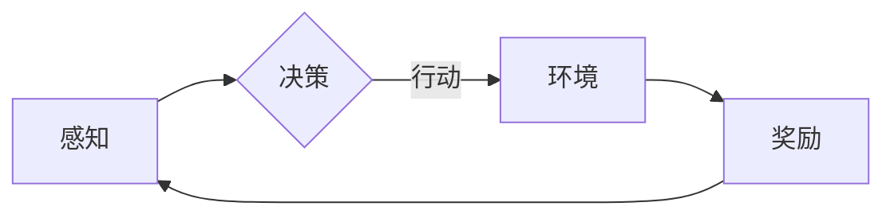

# AI Agent在多领域的拓展

> 关键词：AI Agent, 机器学习, 强化学习, 自然语言处理, 计算机视觉, 知识图谱, 无人驾驶, 机器人

## 1. 背景介绍

随着人工智能技术的飞速发展，AI Agent作为智能体的一种，已经逐渐成为研究的热点。AI Agent是一种能够感知环境、做出决策并采取行动的实体，它能够在各种复杂环境中独立完成任务。本文将探讨AI Agent在多领域的拓展，分析其核心概念、算法原理、实践案例以及未来发展趋势。

## 2. 核心概念与联系

### 2.1 核心概念

AI Agent的核心概念包括：

- **环境**：AI Agent所处的环境，包括物理环境和社会环境。
- **感知**：AI Agent通过传感器获取环境信息。
- **决策**：AI Agent根据感知到的环境信息，选择合适的行动。
- **行动**：AI Agent根据决策执行相应的行动。
- **奖励**：环境对AI Agent行动的反馈。

### 2.2 核心概念原理和架构的 Mermaid 流程图



### 2.3 核心概念的联系

AI Agent的核心概念相互关联，形成一个闭环系统。AI Agent通过感知环境信息，做出决策，并执行行动，进而影响环境，获得奖励，再次进行感知，形成一个持续迭代的循环。

## 3. 核心算法原理 & 具体操作步骤

### 3.1 算法原理概述

AI Agent的算法原理主要包括：

- **监督学习**：通过已知的输入输出数据，训练模型预测未来输出。
- **强化学习**：通过与环境交互，不断学习最优策略。
- **迁移学习**：将已知任务的知识迁移到新任务。

### 3.2 算法步骤详解

AI Agent的算法步骤如下：

1. **定义环境**：明确AI Agent所处的环境，包括物理环境和社交环境。
2. **设计感知器**：选择合适的传感器，获取环境信息。
3. **设计决策器**：设计决策算法，如Q-learning、Sarsa等。
4. **设计行动器**：根据决策结果，执行相应的行动。
5. **评估反馈**：根据环境反馈，评估AI Agent的行动效果。
6. **迭代优化**：根据评估结果，调整模型参数，优化决策策略。

### 3.3 算法优缺点

**监督学习**：

- 优点：模型训练简单，预测准确率高。
- 缺点：需要大量标注数据，泛化能力有限。

**强化学习**：

- 优点：能够适应复杂环境，泛化能力强。
- 缺点：训练时间较长，需要大量样本。

**迁移学习**：

- 优点：快速适应新任务，降低训练成本。
- 缺点：迁移效果依赖于源任务和目标任务的相似度。

### 3.4 算法应用领域

AI Agent的算法在多个领域得到广泛应用：

- **无人驾驶**：通过感知车辆周围环境，做出决策，控制车辆行驶。
- **机器人**：通过感知工作环境，做出决策，执行任务。
- **游戏**：通过感知游戏环境，做出决策，赢得游戏。
- **智能客服**：通过感知用户提问，做出决策，给出答复。

## 4. 数学模型和公式 & 详细讲解 & 举例说明

### 4.1 数学模型构建

AI Agent的数学模型主要包括：

- **马尔可夫决策过程（MDP）**：描述AI Agent与环境交互的过程。
- **Q学习**：通过Q值函数，学习最优策略。
- **Sarsa**：通过状态-动作值函数，学习最优策略。

### 4.2 公式推导过程

以下为Q学习的公式推导过程：

**Q值函数**：$Q(s,a) = \sum_{s'} P(s'|s,a) \cdot [R(s',a) + \gamma \max_{a'} Q(s',a')]$

**策略**：$ \pi(a|s) = \frac{1}{\sum_{a'} Q(s,a')} Q(s,a') $

### 4.3 案例分析与讲解

以下以无人驾驶为例，讲解AI Agent在现实中的应用。

**环境**：无人驾驶车辆所处的道路环境。

**感知器**：摄像头、雷达、激光雷达等传感器。

**决策器**：根据感知到的环境信息，决定车辆的行驶方向、速度等。

**行动器**：控制车辆的转向、加速、刹车等。

**奖励函数**：奖励与行驶安全、效率等因素相关。

## 5. 项目实践：代码实例和详细解释说明

### 5.1 开发环境搭建

1. 安装Python环境。
2. 安装TensorFlow或PyTorch等深度学习框架。
3. 安装OpenAI的Gym环境。

### 5.2 源代码详细实现

以下为使用TensorFlow实现Q学习的代码示例：

```python
import tensorflow as tf
import gym
import numpy as np

env = gym.make('CartPole-v1')
state_size = env.observation_space.shape[0]
action_size = env.action_space.n

Q = tf.keras.Sequential([
    tf.keras.layers.Dense(24, input_dim=state_size, activation='relu'),
    tf.keras.layers.Dense(24, activation='relu'),
    tf.keras.layers.Dense(action_size, activation='linear')
])

optimizer = tf.keras.optimizers.Adam(learning_rate=0.001)

def train(env, Q, optimizer):
    for episode in range(500):
        state = env.reset()
        done = False
        while not done:
            action = np.argmax(Q.predict(state))
            next_state, reward, done, _ = env.step(action)
            target = reward + 0.95 * np.max(Q.predict(next_state))
            Q.fit(state, target, epochs=1, verbose=0)
            state = next_state

train(env, Q, optimizer)
```

### 5.3 代码解读与分析

以上代码实现了基于Q学习的无人驾驶训练过程。

- `gym.make('CartPole-v1')` 创建一个CartPole环境。
- `Q` 创建一个Q值函数网络，用于预测每个状态下的最优动作。
- `optimizer` 创建一个优化器，用于训练Q值函数网络。
- `train` 函数用于训练Q值函数网络。
- `state` 表示当前状态。
- `action` 表示根据Q值函数网络生成的动作。
- `next_state` 表示执行动作后的下一个状态。
- `target` 表示根据Q值函数网络计算的目标值。

通过以上步骤，我们可以训练出一个能够在CartPole环境中稳定行驶的AI Agent。

### 5.4 运行结果展示

运行代码后，可以看到AI Agent在CartPole环境中的表现。

## 6. 实际应用场景

### 6.1 无人驾驶

AI Agent在无人驾驶领域应用广泛，包括：

- **感知环境**：通过摄像头、雷达、激光雷达等传感器获取道路信息。
- **决策规划**：根据感知到的环境信息，规划行驶路径、速度等。
- **控制执行**：控制车辆的转向、加速、刹车等。

### 6.2 机器人

AI Agent在机器人领域应用广泛，包括：

- **自主导航**：机器人通过感知环境，规划路径，实现自主移动。
- **抓取操作**：机器人通过感知物体信息，控制机械臂完成抓取操作。
- **人机交互**：机器人通过理解人类语言，实现人机交互。

### 6.3 游戏

AI Agent在游戏领域应用广泛，包括：

- **棋类游戏**：AI Agent可以学习并战胜人类棋手。
- **角色扮演游戏**：AI Agent可以与玩家进行互动，丰富游戏体验。
- **模拟游戏**：AI Agent可以模拟真实场景，为玩家提供沉浸式体验。

## 7. 工具和资源推荐

### 7.1 学习资源推荐

1. 《深度学习》
2. 《强化学习：原理与数学》
3. 《机器学习》

### 7.2 开发工具推荐

1. TensorFlow
2. PyTorch
3. OpenAI Gym

### 7.3 相关论文推荐

1. "Playing Atari with Deep Reinforcement Learning" (Silver et al., 2016)
2. "Human-level control through deep reinforcement learning" (Silver et al., 2017)
3. "Mastering Chess and Shogi by Self-Play with a General Reinforcement Learning Algorithm" (Silver et al., 2018)

## 8. 总结：未来发展趋势与挑战

### 8.1 研究成果总结

AI Agent作为一种重要的智能体，在多个领域得到广泛应用。通过不断研究和实践，AI Agent的性能和应用范围将不断拓展。

### 8.2 未来发展趋势

1. **多智能体协同**：AI Agent之间进行协同，共同完成任务。
2. **跨领域迁移**：AI Agent能够在不同领域之间迁移知识。
3. **人机协同**：AI Agent与人类协同工作，提高工作效率。

### 8.3 面临的挑战

1. **数据获取**：获取高质量的数据对于AI Agent的训练至关重要。
2. **算法优化**：需要不断优化AI Agent的算法，提高其性能。
3. **伦理道德**：需要关注AI Agent的伦理道德问题。

### 8.4 研究展望

未来，AI Agent将在更多领域得到应用，成为推动社会发展的重要力量。同时，我们也需要关注AI Agent的伦理道德问题，确保其安全、可靠地服务于人类社会。

## 9. 附录：常见问题与解答

### 9.1 常见问题

**Q1：AI Agent在哪些领域应用广泛？**

A1：AI Agent在无人驾驶、机器人、游戏、智能客服等多个领域得到广泛应用。

**Q2：如何训练AI Agent？**

A2：AI Agent的训练方法主要包括监督学习、强化学习、迁移学习等。

**Q3：AI Agent的挑战有哪些？**

A3：AI Agent的挑战包括数据获取、算法优化、伦理道德等。

### 9.2 解答

**A1**：AI Agent在无人驾驶、机器人、游戏、智能客服等多个领域得到广泛应用。例如，在无人驾驶领域，AI Agent通过感知环境、决策规划、控制执行，实现自动驾驶。

**A2**：AI Agent的训练方法主要包括监督学习、强化学习、迁移学习等。其中，强化学习是最常用的方法，通过与环境交互，不断学习最优策略。

**A3**：AI Agent的挑战包括数据获取、算法优化、伦理道德等。数据获取需要获取高质量的数据，算法优化需要不断优化算法，伦理道德需要关注AI Agent的潜在风险。

作者：禅与计算机程序设计艺术 / Zen and the Art of Computer Programming