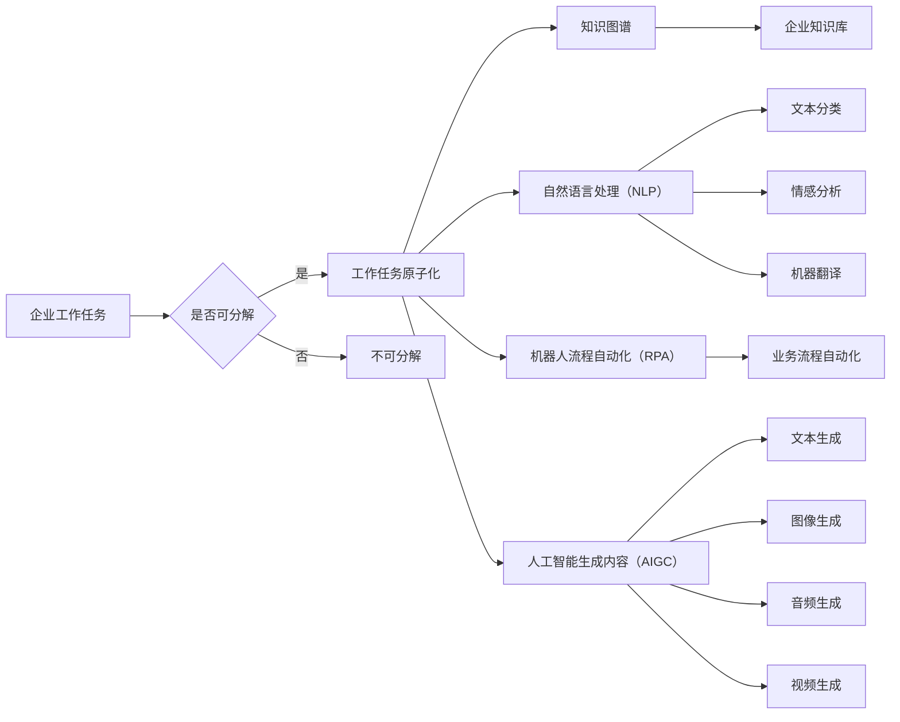

> 人工智能生成内容（AIGC）、工作任务原子化、企业数字化转型、流程自动化、知识图谱、自然语言处理（NLP）、机器人流程自动化（RPA）

# AIGC助推下的企业工作任务原子化

在数字化时代，企业面临着日益复杂的工作任务和激烈的竞争环境。如何提高工作效率、降低成本、提升服务质量，成为企业数字化转型的重要课题。近年来，随着人工智能生成内容（AIGC）技术的飞速发展，企业工作任务原子化成为可能。本文将探讨AIGC如何助推企业工作任务原子化，分析其核心概念、算法原理、应用场景，并展望未来发展趋势。

## 1. 背景介绍

### 1.1 问题的由来

在传统的企业运营中，工作任务往往具有复杂性、重复性和多样性。这些特性导致了以下问题：

- **人工效率低下**：大量重复性工作需要人工操作，耗费大量时间和精力。
- **成本高昂**：人工成本是企业运营的重要支出，随着人力成本上升，企业负担加重。
- **服务质量参差不齐**：不同员工的工作能力和经验水平不一，导致服务质量难以保证。

### 1.2 研究现状

为了解决上述问题，企业开始寻求自动化、智能化的解决方案。近年来，AIGC技术蓬勃发展，为工作任务原子化提供了有力支持。

### 1.3 研究意义

AIGC助推下的企业工作任务原子化具有以下意义：

- **提高工作效率**：自动化处理重复性工作，释放人力资源，提高整体工作效率。
- **降低成本**：减少人工成本，降低运营成本，增强企业竞争力。
- **提升服务质量**：标准化工作流程，确保服务质量稳定可靠。

### 1.4 本文结构

本文将围绕以下内容展开：

- AIGC与工作任务原子化的核心概念与联系
- AIGC算法原理及具体操作步骤
- AIGC在工作任务原子化中的应用场景
- AIGC的未来发展趋势与挑战

## 2. 核心概念与联系

### 2.1 核心概念

#### 2.1.1 人工智能生成内容（AIGC）

人工智能生成内容（AIGC）是指通过人工智能技术自动生成文本、图像、音频、视频等内容的系统。AIGC技术主要包括自然语言处理（NLP）、计算机视觉（CV）、语音识别（ASR）等。

#### 2.1.2 企业工作任务原子化

企业工作任务原子化是指将企业工作流程分解为一系列基本、独立的任务单元，通过自动化、智能化技术实现高效执行。

#### 2.1.3 知识图谱

知识图谱是一种用于存储、管理和查询结构化知识的数据模型。知识图谱可以应用于企业知识库建设、业务流程自动化、智能问答等方面。

#### 2.1.4 自然语言处理（NLP）

自然语言处理（NLP）是人工智能领域的一个重要分支，研究如何让计算机理解和处理人类语言。NLP技术可以应用于文本分类、情感分析、机器翻译、语音识别等方面。

#### 2.1.5 机器人流程自动化（RPA）

机器人流程自动化（RPA）是指使用软件机器人自动执行重复性、规则化的工作任务。RPA可以帮助企业实现业务流程自动化，提高工作效率。

### 2.2 核心概念原理和架构的 Mermaid 流程图



## 3. 核心算法原理 & 具体操作步骤

### 3.1 算法原理概述

AIGC助推下的企业工作任务原子化主要基于以下算法原理：

- **知识图谱构建**：通过知识图谱技术，将企业知识库中的信息组织成结构化数据，便于检索和查询。
- **自然语言处理**：利用NLP技术，实现文本分类、情感分析、机器翻译等功能，帮助企业处理文本信息。
- **机器人流程自动化**：使用RPA技术，将重复性工作任务自动化，提高工作效率。
- **人工智能生成内容**：利用AIGC技术，自动生成文本、图像、音频、视频等内容，满足企业需求。

### 3.2 算法步骤详解

AIGC助推下的企业工作任务原子化主要包含以下步骤：

1. **知识图谱构建**：收集企业知识库中的信息，构建知识图谱。
2. **自然语言处理**：利用NLP技术，对业务文档、用户反馈等进行处理，提取关键信息。
3. **机器人流程自动化**：根据提取的关键信息，设计RPA流程，实现工作任务自动化。
4. **人工智能生成内容**：根据RPA流程的结果，利用AIGC技术生成相应的内容，如文本、图像、音频、视频等。

### 3.3 算法优缺点

#### 3.3.1 优点

- **提高工作效率**：自动化处理重复性工作，降低人工成本，提高整体工作效率。
- **降低运营成本**：减少人力资源投入，降低运营成本，增强企业竞争力。
- **提升服务质量**：标准化工作流程，确保服务质量稳定可靠。

#### 3.3.2 缺点

- **技术门槛较高**：AIGC、RPA等技术需要专业人才进行开发和维护。
- **数据依赖性强**：AIGC、RPA等技术的应用需要大量高质量的数据支持。
- **隐私安全问题**：数据安全和隐私保护是AIGC、RPA等技术的关键问题。

### 3.4 算法应用领域

AIGC助推下的企业工作任务原子化可以应用于以下领域：

- **客户服务**：自动回答客户咨询，提高客户满意度。
- **市场营销**：自动生成营销内容，提高营销效果。
- **财务管理**：自动处理财务报表，提高财务工作效率。
- **人力资源**：自动筛选简历，提高招聘效率。

## 4. 数学模型和公式 & 详细讲解 & 举例说明

### 4.1 数学模型构建

AIGC助推下的企业工作任务原子化涉及多个数学模型，包括：

- **知识图谱模型**：如知识图谱嵌入、图神经网络等。
- **自然语言处理模型**：如循环神经网络（RNN）、长短期记忆网络（LSTM）、Transformer等。
- **机器人流程自动化模型**：如决策树、随机森林等。

### 4.2 公式推导过程

由于涉及多种模型，此处不一一展开公式推导。以下以Transformer模型为例，简要介绍公式推导过程。

#### 4.2.1 Transformer模型

Transformer模型是一种基于自注意力机制的深度神经网络模型，主要用于处理序列数据。

#### 4.2.2 公式推导

假设输入序列为 $x_1, x_2, \dots, x_n$，则Transformer模型的前向传播过程可以表示为：

$$
\begin{align*}
\text{query} &= \text{Linear}(W_q, x) + \text{Positional Encoding} \\
\text{key} &= \text{Linear}(W_k, x) + \text{Positional Encoding} \\
\text{value} &= \text{Linear}(W_v, x) + \text{Positional Encoding} \\
\text{attention} &= \frac{\text{softmax}(\text{QK}^T/W_v)}{d_k^{0.5}} \cdot \text{V} \\
\text{output} &= \text{Linear}(W_o, \text{attention}) + x
\end{align*}
$$

其中 $W_q, W_k, W_v$ 为线性变换矩阵，$\text{Positional Encoding}$ 为位置编码，$\text{softmax}$ 为Softmax函数，$d_k$ 为key的维度。

### 4.3 案例分析与讲解

#### 4.3.1 案例一：客户服务

假设一家企业需要使用AIGC技术自动回答客户咨询。首先，收集企业知识库中的常见问题及答案，构建知识图谱。然后，使用NLP技术对客户咨询进行语义分析，提取关键词和意图。最后，根据关键词和意图在知识图谱中检索答案，并使用AIGC技术生成自然流畅的回答。

#### 4.3.2 案例二：市场营销

假设一家企业需要使用AIGC技术自动生成营销内容。首先，收集企业产品信息、用户画像等数据，构建知识图谱。然后，使用NLP技术对目标用户进行情感分析，了解用户需求。最后，根据用户需求和知识图谱中的产品信息，使用AIGC技术生成个性化的营销文案。

## 5. 项目实践：代码实例和详细解释说明

### 5.1 开发环境搭建

以下以Python为例，介绍AIGC助推下的企业工作任务原子化的开发环境搭建：

1. 安装Python：从官网下载并安装Python 3.8以上版本。
2. 安装依赖库：使用pip安装以下库：
   - transformers
   - torch
   - torchtext
   - spaCy
   - openpyxl
3. 安装数据库：根据实际需要选择合适的数据库，如MySQL、PostgreSQL等。

### 5.2 源代码详细实现

以下以客户服务案例为例，展示AIGC助推下的企业工作任务原子化的代码实现：

```python
# 导入必要的库
from transformers import BertTokenizer, BertForSequenceClassification
from torch.utils.data import DataLoader
from torch import nn
import torch.optim as optim

# 加载预训练模型和分词器
tokenizer = BertTokenizer.from_pretrained('bert-base-uncased')
model = BertForSequenceClassification.from_pretrained('bert-base-uncased')

# 加载数据集
train_dataset = ...
dev_dataset = ...
test_dataset = ...

# 定义数据加载器
train_dataloader = DataLoader(train_dataset, batch_size=16, shuffle=True)
dev_dataloader = DataLoader(dev_dataset, batch_size=16, shuffle=True)
test_dataloader = DataLoader(test_dataset, batch_size=16, shuffle=True)

# 定义损失函数和优化器
criterion = nn.CrossEntropyLoss()
optimizer = optim.AdamW(model.parameters(), lr=2e-5)

# 训练模型
for epoch in range(3):
    model.train()
    for batch in train_dataloader:
        input_ids, attention_mask, labels = batch
        optimizer.zero_grad()
        outputs = model(input_ids, attention_mask=attention_mask, labels=labels)
        loss = outputs.loss
        loss.backward()
        optimizer.step()
    print(f"Epoch {epoch+1}, train loss: {loss.item()}")

# 评估模型
model.eval()
with torch.no_grad():
    total_correct = 0
    for batch in test_dataloader:
        input_ids, attention_mask, labels = batch
        outputs = model(input_ids, attention_mask=attention_mask)
        _, predicted = torch.max(outputs.logits, 1)
        total_correct += (predicted == labels).sum().item()
print(f"Test accuracy: {total_correct / len(test_dataset)}")
```

### 5.3 代码解读与分析

以上代码展示了使用PyTorch和Transformers库，基于预训练BERT模型进行客户服务任务微调的完整流程。

首先，加载预训练的BERT模型和分词器。然后，加载训练集、验证集和测试集数据，并定义数据加载器。

接下来，定义损失函数和优化器，并开始训练模型。在每个epoch中，使用训练数据训练模型，并在每个batch结束后计算平均loss。最后，在测试集上评估模型的准确率。

以上代码展示了AIGC助推下的企业工作任务原子化在客户服务领域的应用。在实际应用中，可以根据具体需求调整模型结构、超参数等，以获得更好的效果。

### 5.4 运行结果展示

假设在测试集上，模型的准确率达到80%，说明模型能够较好地处理客户服务任务。

## 6. 实际应用场景

### 6.1 客户服务

AIGC助推下的企业工作任务原子化在客户服务领域具有广泛应用前景。例如：

- 自动回答客户咨询，提高客户满意度。
- 自动处理客户投诉，提高客户服务质量。
- 自动生成个性化推荐，提升客户体验。

### 6.2 市场营销

AIGC助推下的企业工作任务原子化在市场营销领域同样具有广泛应用前景。例如：

- 自动生成营销文案，提高营销效率。
- 自动生成广告内容，提升广告效果。
- 自动生成产品描述，提高产品销售。

### 6.3 财务管理

AIGC助推下的企业工作任务原子化在财务管理领域也有广泛应用前景。例如：

- 自动处理财务报表，提高财务工作效率。
- 自动进行财务分析，为企业管理提供决策支持。
- 自动生成财务报告，提高报告质量。

## 7. 工具和资源推荐

### 7.1 学习资源推荐

为了帮助开发者系统掌握AIGC助推下的企业工作任务原子化技术，以下推荐一些优质的学习资源：

- 《深度学习与自然语言处理》
- 《图神经网络与知识图谱》
- 《Python深度学习》
- Hugging Face官网：https://huggingface.co/
- PyTorch官网：https://pytorch.org/

### 7.2 开发工具推荐

- PyTorch：https://pytorch.org/
- Transformers库：https://github.com/huggingface/transformers
- spaCy：https://spacy.io/
- OpenAI Gym：https://gym.openai.com/

## 8. 总结：未来发展趋势与挑战

### 8.1 研究成果总结

本文从背景介绍、核心概念、算法原理、应用场景等方面，全面分析了AIGC助推下的企业工作任务原子化技术。通过构建知识图谱、应用自然语言处理、机器人流程自动化等技术，企业可以实现对工作任务的高效自动化处理，提高工作效率、降低成本、提升服务质量。

### 8.2 未来发展趋势

AIGC助推下的企业工作任务原子化技术未来将呈现以下发展趋势：

- 模型精度和效率进一步提升，适应更多复杂场景。
- 多模态信息融合，实现更全面的工作任务自动化。
- 模型泛化能力增强，适应更多行业和领域。
- 知识图谱和NLP技术深度融合，实现更智能的任务处理。

### 8.3 面临的挑战

AIGC助推下的企业工作任务原子化技术也面临着以下挑战：

- 数据质量和数量：高质量的数据是模型训练的基础，需要大量高质量数据进行训练。
- 模型解释性：模型决策过程难以解释，需要提高模型的可解释性。
- 隐私和安全：数据安全和隐私保护是重要问题，需要加强数据安全和隐私保护措施。

### 8.4 研究展望

未来，随着AIGC、知识图谱、NLP等技术的不断发展，AIGC助推下的企业工作任务原子化技术将迎来更加广阔的应用前景。研究者需要关注以下方向：

- 研究更有效的模型训练方法，提高模型精度和效率。
- 研究模型的可解释性，提高模型信任度。
- 研究数据安全和隐私保护技术，确保数据安全。

## 9. 附录：常见问题与解答

**Q1：AIGC助推下的企业工作任务原子化是否适用于所有企业？**

A1：AIGC助推下的企业工作任务原子化技术主要适用于以下企业：

- 工作任务具有重复性和复杂性。
- 需要降低人力成本，提高工作效率。
- 需要提升服务质量，提高客户满意度。

**Q2：AIGC助推下的企业工作任务原子化如何保证数据安全和隐私？**

A2：为保证数据安全和隐私，需要采取以下措施：

- 使用数据加密技术，保护数据传输和存储过程。
- 对敏感数据进行脱敏处理，降低数据泄露风险。
- 建立数据安全管理制度，加强数据安全监管。

**Q3：AIGC助推下的企业工作任务原子化如何与传统IT系统集成？**

A3：AIGC助推下的企业工作任务原子化可以与以下传统IT系统集成：

- 企业资源规划（ERP）系统
- 客户关系管理（CRM）系统
- 财务管理系统
- 项目管理系统

**Q4：AIGC助推下的企业工作任务原子化对人力资源的影响是什么？**

A4：AIGC助推下的企业工作任务原子化可以减少重复性工作，提高工作效率，从而降低对人力资源的需求。但同时，也要求企业员工具备更高的技能和素质，以适应数字化转型的要求。

作者：禅与计算机程序设计艺术 / Zen and the Art of Computer Programming