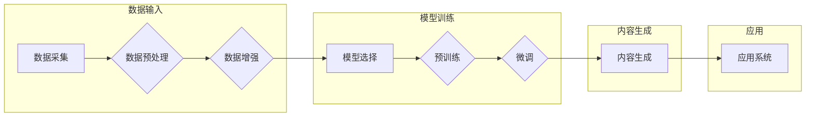

> AIGC, 视觉内容生成，文本生成，数据幻觉，数据质量，深度学习，监督学习，无监督学习

# AIGC的幻觉问题与数据质量

随着人工智能（AI）技术的飞速发展，人工智能生成内容（AI Generated Content，简称AIGC）已经成为一个备受关注的研究方向。AIGC技术能够自动生成图片、文本、音乐等多种形式的内容，具有巨大的应用潜力。然而，AIGC技术在实际应用中也面临着一些挑战，其中数据质量问题和生成的幻觉问题尤为突出。本文将深入探讨AIGC的幻觉问题与数据质量之间的关系，并分析解决这些问题的方法。

## 1. 背景介绍

### 1.1 AIGC的兴起

近年来，深度学习技术的发展使得AIGC成为可能。通过在大量的数据上进行训练，AIGC模型能够学习到丰富的知识，并生成高质量的内容。AIGC的应用场景广泛，包括但不限于：

- **图像生成**：生成逼真的图像、视频、动画等视觉内容。
- **文本生成**：生成新闻报道、广告文案、小说等文本内容。
- **音乐生成**：生成旋律、和弦、节奏等音乐内容。

### 1.2 数据幻觉问题

尽管AIGC技术在生成内容方面取得了显著进展，但数据幻觉问题仍然是一个重要的挑战。数据幻觉指的是AIGC模型在生成内容时，可能会产生与真实世界不符或存在偏差的内容。这可能是由于以下原因：

- **数据偏差**：训练数据中可能存在偏见，导致模型在生成内容时也表现出偏见。
- **模式识别**：模型可能只识别了数据中的表面模式，而忽略了更深层次的结构和逻辑。
- **过拟合**：模型过度拟合训练数据，导致在生成新内容时缺乏泛化能力。

### 1.3 数据质量问题

数据质量是AIGC技术能否成功的关键因素之一。以下是数据质量对AIGC的影响：

- **数据集规模**：数据集规模越大，模型的泛化能力越强，生成的内容越接近真实世界。
- **数据多样性**：数据多样性越高，模型能够学习到的知识越丰富，生成的内容也越具有创意。
- **数据准确性**：数据准确性越高，模型生成的内容也越可靠。

## 2. 核心概念与联系

### 2.1 AIGC技术架构

以下是一个简化的AIGC技术架构Mermaid流程图：



### 2.2 数据质量与AIGC的关系

数据质量对AIGC的影响主要体现在以下几个方面：

- **训练效果**：高质量的数据能够提升模型的训练效果，使模型生成更准确、更具有创造性的内容。
- **泛化能力**：数据多样性越高，模型的泛化能力越强，能够更好地适应不同的应用场景。
- **模型偏见**：数据中存在的偏见可能会在模型中固化，导致生成的内容存在偏见。

## 3. 核心算法原理 & 具体操作步骤

### 3.1 算法原理概述

AIGC的核心算法包括：

- **生成模型**：如生成对抗网络（GANs）、变分自编码器（VAEs）等，用于生成新的数据。
- **文本生成模型**：如序列到序列模型、Transformer等，用于生成文本内容。
- **图像生成模型**：如条件生成对抗网络（cGANs）、风格迁移等，用于生成图像内容。

### 3.2 算法步骤详解

AIGC的算法步骤通常包括：

1. **数据采集**：从各种来源收集数据，如网络、数据库、传感器等。
2. **数据预处理**：对采集到的数据进行清洗、去噪、格式化等操作。
3. **数据增强**：通过对数据进行旋转、缩放、裁剪等操作，扩充数据集。
4. **模型选择**：选择合适的生成模型或文本生成模型。
5. **预训练**：在大量无标签数据上进行预训练，使模型学习到丰富的知识。
6. **微调**：在少量有标签数据上进行微调，使模型适应特定任务。
7. **内容生成**：使用训练好的模型生成新的内容。
8. **应用**：将生成的内容应用于实际场景。

### 3.3 算法优缺点

**优点**：

- **高效**：AIGC技术能够自动生成内容，节省人力成本。
- **多样**：AIGC技术能够生成各种形式的内容，满足不同的需求。
- **创新**：AIGC技术能够激发创意，生成新的内容。

**缺点**：

- **数据质量依赖**：AIGC技术的效果很大程度上依赖于数据质量。
- **生成内容质量不稳定**：生成的内容质量可能存在波动。
- **模型偏见**：模型可能存在偏见，导致生成的内容存在偏见。

### 3.4 算法应用领域

AIGC技术可以应用于以下领域：

- **娱乐**：生成电影、音乐、游戏等娱乐内容。
- **教育**：生成教材、习题、教程等教育内容。
- **医疗**：生成医学影像、诊断报告等医疗内容。
- **商业**：生成广告、营销文案、产品描述等商业内容。

## 4. 数学模型和公式 & 详细讲解 & 举例说明

### 4.1 数学模型构建

以下是一些常见的AIGC数学模型：

- **生成对抗网络（GANs）**：

  $$ D(x) : \mathbb{R}^n \rightarrow [0,1] $$
  $$ G(z) : \mathbb{R}^n \rightarrow \mathbb{R}^n $$

  其中，$D$ 是判别器，$G$ 是生成器，$x$ 是真实数据，$z$ 是噪声向量。

- **变分自编码器（VAEs）**：

  $$ q(\theta) : \mathbb{R}^n \rightarrow \mathbb{R}^n $$
  $$ p(x) : \mathbb{R}^n \rightarrow \mathbb{R}^n $$

  其中，$q(\theta)$ 是编码器，$p(x)$ 是解码器。

### 4.2 公式推导过程

以下以GANs为例，简要介绍公式推导过程：

- **损失函数**：

  $$ L(D) = \mathbb{E}_{x \sim p_{data}(x)}[D(x)] - \mathbb{E}_{z \sim p_{z}(z)}[D(G(z))] $$

  $$ L(G) = -\mathbb{E}_{z \sim p_{z}(z)}[D(G(z))] $$

- **梯度下降**：

  通过梯度下降算法对判别器 $D$ 和生成器 $G$ 的参数进行优化。

### 4.3 案例分析与讲解

以下以文本生成模型GPT-3为例，分析其数学模型和生成过程：

- **数学模型**：

  GPT-3是一个基于Transformer的序列到序列模型，其数学模型可以表示为：

  $$ p(w_t | w_{t-1}, ..., w_1) = \frac{p(w_t | w_{t-1}, ..., w_1, h)}{Z(h)} $$

  其中，$w_t$ 是当前生成的词，$h$ 是Transformer模型的状态。

- **生成过程**：

  GPT-3通过以下步骤生成文本：

  1. 输入初始文本。
  2. 根据初始文本计算概率分布。
  3. 选择概率最高的词作为下一个词。
  4. 重复步骤2和3，直到生成完整的文本。

## 5. 项目实践：代码实例和详细解释说明

### 5.1 开发环境搭建

为了进行AIGC项目实践，你需要以下开发环境：

- **Python**：用于编写代码。
- **深度学习框架**：如TensorFlow或PyTorch，用于构建和训练模型。
- **文本处理库**：如NLTK或spaCy，用于文本处理。

### 5.2 源代码详细实现

以下是一个简单的文本生成模型代码示例：

```python
import torch
import torch.nn as nn
import torch.optim as optim
from torch.utils.data import DataLoader

# 构建模型
class TextGenerator(nn.Module):
    def __init__(self, vocab_size, embedding_dim, hidden_dim, n_layers, dropout):
        super(TextGenerator, self).__init__()
        self.embedding = nn.Embedding(vocab_size, embedding_dim)
        self.rnn = nn.LSTM(embedding_dim, hidden_dim, n_layers, dropout=dropout)
        self.fc = nn.Linear(hidden_dim, vocab_size)

    def forward(self, inputs, hidden):
        embedded = self.embedding(inputs)
        outputs, hidden = self.rnn(embedded, hidden)
        outputs = self.fc(outputs)
        return outputs, hidden

# 训练模型
def train(model, criterion, optimizer, train_loader, num_epochs):
    model.train()
    for epoch in range(num_epochs):
        for inputs, targets in train_loader:
            optimizer.zero_grad()
            outputs, hidden = model(inputs, hidden)
            loss = criterion(outputs.view(-1, vocab_size), targets.view(-1))
            loss.backward()
            optimizer.step()
        print(f'Epoch {epoch+1}/{num_epochs}, Loss: {loss.item()}')
```

### 5.3 代码解读与分析

上述代码定义了一个基于LSTM的文本生成模型，并提供了训练函数。模型由以下部分组成：

- **嵌入层**：将单词转换为向量。
- **LSTM层**：处理序列数据。
- **全连接层**：将LSTM的输出转换为单词概率分布。

训练函数中，模型通过反向传播算法进行训练，并在每个epoch结束时打印损失值。

### 5.4 运行结果展示

运行上述代码后，模型将在训练集上进行训练，并在每个epoch结束时打印损失值。训练完成后，你可以使用模型生成文本。

## 6. 实际应用场景

AIGC技术可以应用于以下实际场景：

- **新闻报道生成**：自动生成新闻报道，提高新闻媒体的生产效率。
- **广告文案生成**：自动生成广告文案，帮助企业提高广告效果。
- **教育内容生成**：自动生成教材、习题等教育内容，辅助教师教学。
- **医疗诊断生成**：自动生成医疗诊断报告，辅助医生诊断疾病。

## 7. 工具和资源推荐

### 7.1 学习资源推荐

- **书籍**：
  - 《深度学习》（Goodfellow、Bengio和Courville著）
  - 《自然语言处理综论》（Jurafsky和Martin著）
- **在线课程**：
  - Coursera上的《深度学习》课程
  - fast.ai的《深度学习实践》课程
- **网站**：
  - TensorFlow官网
  - PyTorch官网

### 7.2 开发工具推荐

- **深度学习框架**：
  - TensorFlow
  - PyTorch
- **文本处理库**：
  - NLTK
  - spaCy
- **数据集**：
  - Common Crawl
  - GLUE数据集

### 7.3 相关论文推荐

- **图像生成**：
  - Generative Adversarial Nets（GANs）
  - Unsupervised Representation Learning with Deep Convolutional Generative Adversarial Networks（DCGANs）
- **文本生成**：
  - Sequence to Sequence Learning with Neural Networks（seq2seq模型）
  - Attention is All You Need（Transformer模型）

## 8. 总结：未来发展趋势与挑战

### 8.1 研究成果总结

本文对AIGC的幻觉问题与数据质量进行了深入探讨，分析了数据质量对AIGC的影响，并介绍了AIGC的核心算法原理、具体操作步骤和实际应用场景。通过本文的学习，读者可以全面了解AIGC技术，并为实际应用提供参考。

### 8.2 未来发展趋势

未来AIGC技术的发展趋势包括：

- **更高质量的生成内容**：通过改进模型结构和算法，提高AIGC生成内容的准确性、多样性和创新性。
- **更广泛的应用场景**：AIGC技术将应用于更多领域，如游戏、艺术、娱乐等。
- **更高效的数据处理**：通过优化数据预处理和增强技术，提高AIGC的训练效率和生成速度。

### 8.3 面临的挑战

AIGC技术面临的挑战包括：

- **数据质量问题**：如何获取高质量、多样化的数据，是AIGC技术发展的关键。
- **模型偏见**：如何消除模型中的偏见，是AIGC技术应用的伦理问题。
- **计算资源消耗**：AIGC模型的训练和推理需要大量的计算资源，如何降低资源消耗是重要的研究方向。

### 8.4 研究展望

未来AIGC技术的研究方向包括：

- **可解释性研究**：提高模型的可解释性，使模型决策过程更加透明。
- **模型压缩和加速**：降低模型的计算资源消耗，提高模型的实时性。
- **跨模态生成**：将AIGC技术扩展到多模态数据，如图像、视频、音频等。

通过不断攻克这些挑战，AIGC技术将更好地服务于人类社会，推动人工智能技术的发展。

## 9. 附录：常见问题与解答

**Q1：AIGC技术有哪些应用场景？**

A：AIGC技术可以应用于图像生成、文本生成、音乐生成等多种场景，如新闻报道、广告文案、教育内容、医疗诊断等。

**Q2：如何解决AIGC的数据质量问题？**

A：解决AIGC的数据质量问题需要从数据采集、预处理、增强等方面入手，提高数据质量和多样性。

**Q3：AIGC技术存在哪些挑战？**

A：AIGC技术面临的挑战包括数据质量、模型偏见、计算资源消耗等。

**Q4：如何选择合适的AIGC模型？**

A：选择合适的AIGC模型需要根据具体任务和数据特点进行选择，如文本生成可以使用seq2seq模型或Transformer模型，图像生成可以使用GANs或VAEs。

**Q5：AIGC技术的未来发展趋势是什么？**

A：AIGC技术的未来发展趋势包括更高质量的生成内容、更广泛的应用场景、更高效的数据处理等。