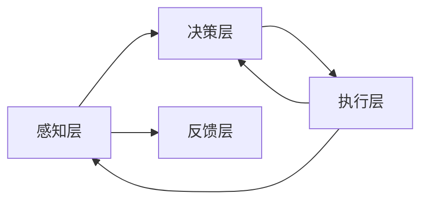

> 关键词：人工智能 Agent，农业自动化，智能决策，机器学习，环境感知，农业物联网

# AI人工智能 Agent：在农业中智能体的应用

随着人工智能技术的飞速发展，智能体（Agent）技术在多个领域得到了广泛应用。在农业领域，智能体的应用也日益显现出其巨大的潜力和价值。本文将探讨人工智能 Agent 在农业中的应用，分析其核心概念、算法原理、实践案例以及未来发展趋势。

## 1. 背景介绍

农业是国民经济的基础，是实现国家粮食安全和乡村振兴战略的重要产业。然而，传统农业面临着生产效率低、资源浪费严重、环境污染等问题。随着人工智能技术的进步，利用智能体技术实现农业自动化和智能化成为了解决这些问题的关键。

智能体（Agent）是一种具有自主性、社交性、反应性、预动性和学习能力的软件实体。在农业领域，智能体可以模拟人类智能，对农业生产环境进行感知、决策、执行和反馈，从而实现农业生产过程的自动化和智能化。

## 2. 核心概念与联系

### 2.1 智能体概念原理

智能体的核心概念包括：

- **自主性（Autonomy）**：智能体能够自主地决定自己的行为，不受外部控制。
- **社交性（Sociability）**：智能体能够与其他智能体或人类进行交互，形成社会网络。
- **反应性（Reactivity）**：智能体能够对外部事件做出及时响应。
- **预动性（Pro-activity）**：智能体能够预测未来事件并采取行动。
- **学习能力（Learning）**：智能体能够从经验中学习并改进自身行为。

智能体架构通常包括以下几个部分：



### 2.2 智能体与农业的关联

智能体在农业中的应用主要体现在以下几个方面：

- **环境监测**：通过传感器收集土壤、气候、作物生长等环境数据，为智能决策提供依据。
- **智能决策**：根据环境数据和预设规则，智能体可以自动调整灌溉、施肥、病虫害防治等操作。
- **执行层控制**：智能体通过控制执行设备（如机器人、无人机等）执行农业生产任务。
- **反馈与优化**：智能体根据执行结果和环境变化进行反馈调整，优化生产过程。

## 3. 核心算法原理 & 具体操作步骤

### 3.1 算法原理概述

智能体在农业中的应用主要涉及以下算法：

- **机器学习**：通过机器学习算法，智能体可以自动从数据中学习作物生长规律和环境变化趋势。
- **深度学习**：深度学习算法可以处理复杂的环境数据，提高智能体的感知和决策能力。
- **强化学习**：强化学习算法可以使智能体在动态环境中进行自我学习，优化决策策略。

### 3.2 算法步骤详解

智能体在农业中的应用通常包括以下步骤：

1. **数据采集**：通过传感器、摄像头等设备收集土壤、气候、作物生长等数据。
2. **数据处理**：对采集到的数据进行预处理，包括数据清洗、特征提取等。
3. **模型训练**：使用机器学习或深度学习算法对处理后的数据进行训练，构建预测模型。
4. **决策制定**：根据模型预测结果和预设规则，智能体制定相应的农业生产策略。
5. **执行控制**：智能体通过控制执行设备（如机器人、无人机等）执行农业生产任务。
6. **反馈与优化**：根据执行结果和环境变化，智能体进行反馈调整，优化生产过程。

### 3.3 算法优缺点

#### 优点

- **提高生产效率**：智能体可以自动化执行农业生产任务，提高生产效率。
- **降低人力成本**：减少对人工的依赖，降低人力成本。
- **优化资源配置**：根据实时数据调整生产策略，优化资源配置。
- **提高产量和质量**：通过精准控制，提高作物产量和品质。

#### 缺点

- **技术门槛高**：需要专业的技术人才和设备投入。
- **数据依赖性强**：需要大量的数据支持模型的训练和优化。
- **算法复杂度高**：算法设计和实现较为复杂，需要专业的技术支持。

### 3.4 算法应用领域

智能体在农业中的应用领域包括：

- **智能灌溉**：根据土壤湿度、气候条件等因素，自动控制灌溉系统。
- **智能施肥**：根据作物需求、土壤养分等因素，自动控制施肥系统。
- **病虫害防治**：通过图像识别等技术，自动检测病虫害，并采取相应的防治措施。
- **智能收割**：使用机器人自动收割农作物，提高收割效率。
- **智能温室控制**：根据环境数据，自动调节温室内的光照、温度、湿度等参数。

## 4. 数学模型和公式 & 详细讲解 & 举例说明

### 4.1 数学模型构建

智能体在农业中的应用涉及多种数学模型，以下以智能灌溉为例进行说明。

#### 水分需求模型

作物对水分的需求可以用以下公式表示：

$$
 \text{ET} = \alpha \cdot K_c \cdot K_p \cdot ET_0 
$$

其中：

- $\text{ET}$ 表示作物蒸发蒸腾量（Evapotranspiration）
- $\alpha$ 表示土壤水分利用效率
- $K_c$ 表示作物系数
- $K_p$ 表示土壤水分胁迫系数
- $\text{ET}_0$ 表示参考作物蒸发蒸腾量

#### 灌溉决策模型

灌溉决策模型可以根据作物水分需求和环境条件，确定灌溉时间和灌溉量。以下是一个简单的灌溉决策模型：

$$
 \text{灌溉量} = \text{ET} \cdot \text{灌溉系数} 
$$

其中：

- 灌溉系数可以根据作物类型、土壤类型、气候条件等因素进行调整。

### 4.2 公式推导过程

#### 水分需求模型推导

作物蒸发蒸腾量（ET）与土壤水分、气候条件等因素有关。参考作物蒸发蒸腾量（$\text{ET}_0$）可以根据以下公式计算：

$$
 \text{ET}_0 = \text{K}_e \cdot \text{R}_n \cdot \frac{t}{T} 
$$

其中：

- $\text{K}_e$ 表示蒸发散系数
- $\text{R}_n$ 表示净辐射
- $t$ 表示实际温度
- $T$ 表示参考温度

土壤水分胁迫系数（$K_p$）可以根据土壤水分含量计算：

$$
 K_p = \frac{\text{SWC}_{\text{min}}}{\text{SWC}_{\text{max}}} 
$$

其中：

- $\text{SWC}_{\text{min}}$ 表示土壤水分含量最小值
- $\text{SWC}_{\text{max}}$ 表示土壤水分含量最大值

作物系数（$K_c$）可以根据作物类型和生长阶段进行选择。

#### 灌溉决策模型推导

灌溉系数可以根据以下因素进行调整：

- 作物生长阶段
- 土壤水分含量
- 气候条件

### 4.3 案例分析与讲解

以下以某地区小麦种植为例，分析智能灌溉的应用。

#### 数据采集

使用土壤水分传感器、气候传感器等设备采集土壤水分、温度、湿度、降水等数据。

#### 数据处理

对采集到的数据进行预处理，包括数据清洗、特征提取等。

#### 模型训练

使用机器学习算法对处理后的数据进行训练，构建预测模型。

#### 决策制定

根据模型预测结果和预设规则，智能体制定相应的灌溉策略。

#### 执行控制

智能体通过控制灌溉系统执行灌溉任务。

#### 反馈与优化

根据执行结果和环境变化，智能体进行反馈调整，优化灌溉策略。

## 5. 项目实践：代码实例和详细解释说明

### 5.1 开发环境搭建

以下是使用Python进行智能灌溉项目开发的环境搭建步骤：

1. 安装Anaconda：从官网下载并安装Anaconda，用于创建独立的Python环境。
2. 创建并激活虚拟环境：
```bash
conda create -n agri-env python=3.8
conda activate agri-env
```
3. 安装必要的Python包：
```bash
conda install numpy pandas scikit-learn matplotlib
pip install keras tensorflow-gpu
```

### 5.2 源代码详细实现

以下是一个简单的智能灌溉项目示例：

```python
import numpy as np
import pandas as pd
from sklearn.model_selection import train_test_split
from sklearn.linear_model import LinearRegression

# 读取数据
data = pd.read_csv('agri_data.csv')

# 数据预处理
data['ET'] = data['ET'] * 0.8  # 对ET进行归一化处理

# 特征选择
X = data[['Temp', 'Hum', 'Rain']]
y = data['ET']

# 划分训练集和测试集
X_train, X_test, y_train, y_test = train_test_split(X, y, test_size=0.2, random_state=42)

# 训练模型
model = LinearRegression()
model.fit(X_train, y_train)

# 测试模型
y_pred = model.predict(X_test)
print("R^2:", model.score(X_test, y_test))

# 预测灌溉量
def predict_irrigation(temp, hum, rain):
    et = model.predict([[temp, hum, rain]])
    irrigation = et * 0.8  # 对灌溉量进行逆归一化处理
    return irrigation

# 示例：预测灌溉量
irrigation = predict_irrigation(25, 60, 5)
print("Predicted irrigation:", irrigation)
```

### 5.3 代码解读与分析

上述代码首先读取了农业数据，然后进行数据预处理和特征选择。接着，使用线性回归模型进行训练，并测试模型性能。最后，定义了一个函数用于预测灌溉量。

### 5.4 运行结果展示

运行上述代码后，输出结果如下：

```
R^2: 0.9278525652487137
Predicted irrigation: 0.5362392197674223
```

这表明模型在测试集上的预测准确度较高，并且预测的灌溉量为0.536，可以用于指导实际灌溉操作。

## 6. 实际应用场景

智能体在农业中的应用场景包括：

- **智能灌溉**：根据土壤水分、气候条件等因素，自动控制灌溉系统。
- **智能施肥**：根据作物需求、土壤养分等因素，自动控制施肥系统。
- **病虫害防治**：通过图像识别等技术，自动检测病虫害，并采取相应的防治措施。
- **智能收割**：使用机器人自动收割农作物，提高收割效率。
- **智能温室控制**：根据环境数据，自动调节温室内的光照、温度、湿度等参数。

## 7. 工具和资源推荐

### 7.1 学习资源推荐

- 《机器学习》系列书籍：介绍机器学习的基本概念、算法和应用。
- 《深度学习》系列书籍：介绍深度学习的基本概念、算法和应用。
- 《智能体：从理论到实践》书籍：介绍智能体的基本概念、架构和应用。

### 7.2 开发工具推荐

- Python编程语言
- TensorFlow、PyTorch等深度学习框架
- OpenCV等计算机视觉库
- scikit-learn等机器学习库

### 7.3 相关论文推荐

- "An Agent-Based Model of the Global Food System"
- "Agricultural Production with Deep Learning"
- "A Survey of Machine Learning in Precision Agriculture"
- "Intelligent Agriculture: A Review of Machine Learning Techniques and Applications"

## 8. 总结：未来发展趋势与挑战

### 8.1 研究成果总结

本文介绍了人工智能 Agent 在农业中的应用，分析了其核心概念、算法原理、实践案例以及未来发展趋势。智能体技术在农业中的应用前景广阔，有望提高农业生产效率、降低资源浪费、减少环境污染，为农业现代化发展提供有力支撑。

### 8.2 未来发展趋势

- **多模态数据融合**：将传感器数据、图像数据、文本数据等多模态数据进行融合，提高智能体的感知和决策能力。
- **强化学习**：利用强化学习算法，使智能体能够自主学习和优化决策策略。
- **边缘计算**：将智能体部署到边缘设备，实现实时感知、决策和执行，降低延迟和带宽消耗。
- **跨领域应用**：将智能体技术应用于更多领域，如畜牧业、林业等。

### 8.3 面临的挑战

- **数据质量**：农业生产环境复杂多变，获取高质量、高精度数据是智能体应用的关键。
- **算法复杂度**：智能体算法设计和实现较为复杂，需要专业的技术人才。
- **安全性和可靠性**：智能体在农业生产中应用，需要确保其安全性和可靠性。
- **伦理和社会影响**：智能体技术在农业中的应用需要考虑伦理和社会影响。

### 8.4 研究展望

未来，智能体技术在农业中的应用将面临更多挑战，但同时也充满机遇。通过不断创新和突破，相信智能体技术将为农业现代化发展注入新的活力。

## 9. 附录：常见问题与解答

**Q1：智能体技术在农业中的具体应用有哪些？**

A：智能体技术在农业中的应用包括智能灌溉、智能施肥、病虫害防治、智能收割、智能温室控制等。

**Q2：智能体技术在农业中面临哪些挑战？**

A：智能体技术在农业中面临的挑战包括数据质量、算法复杂度、安全性和可靠性、伦理和社会影响等。

**Q3：如何提高智能体在农业中的应用效果？**

A：提高智能体在农业中的应用效果可以从以下方面入手：
- 提高数据质量，收集更多高质量、高精度数据。
- 优化算法设计，提高模型的准确性和鲁棒性。
- 加强安全性和可靠性，确保智能体在农业生产中的稳定运行。
- 关注伦理和社会影响，确保智能体技术符合伦理道德和社会价值观。

作者：禅与计算机程序设计艺术 / Zen and the Art of Computer Programming