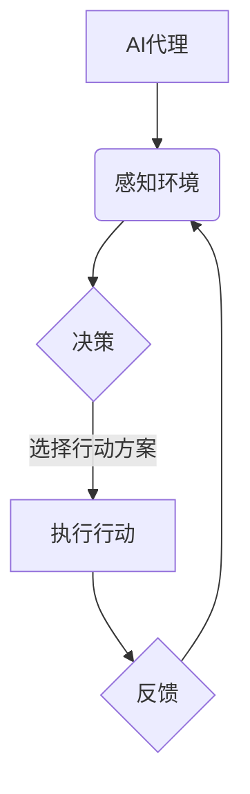

# AI人工智能代理工作流AI Agent WorkFlow：自主行为与规划策略在AI中的运用

> 关键词：人工智能代理，工作流，自主行为，规划策略，强化学习，决策树，遗传算法，多智能体系统，应用场景

## 1. 背景介绍

随着人工智能技术的飞速发展，AI代理（AI Agent）已经成为了智能化系统设计中的关键组件。AI代理是一种能够感知环境、做出决策并采取行动的实体，它们在智能机器人、自动化系统、网络服务等领域扮演着重要角色。AI Agent WorkFlow则是指通过规划策略和自主行为，使AI代理能够高效、智能地完成复杂任务的过程。本文将深入探讨AI Agent WorkFlow的核心概念、算法原理、应用场景以及未来发展趋势。

### 1.1 问题的由来

在现实世界中，许多任务都需要处理大量的信息和复杂的环境变化。传统的人工处理方式效率低下，且难以扩展到大规模复杂场景。AI代理的出现，旨在通过机器学习和人工智能技术，使系统能够自动感知环境、规划行动并优化决策过程。

### 1.2 研究现状

AI Agent WorkFlow的研究涉及多个学科领域，包括人工智能、机器人学、计算机科学等。目前，研究人员已经提出了多种AI代理的规划策略和自主行为方法，如强化学习、决策树、遗传算法等。这些方法在不同程度上解决了AI代理在工作流中的问题，但仍然存在一些挑战和局限性。

### 1.3 研究意义

研究AI Agent WorkFlow对于推动人工智能技术的发展和应用具有重要意义：

1. 提高任务执行效率：通过AI代理的自主行为和规划策略，可以自动完成复杂任务，提高系统运行效率。
2. 增强系统智能性：AI代理能够根据环境变化自主调整行为，使系统更加智能和灵活。
3. 促进跨领域应用：AI Agent WorkFlow的研究成果可以应用于各个领域，推动人工智能技术的产业化进程。

### 1.4 本文结构

本文将围绕以下结构展开：

- 介绍AI Agent WorkFlow的核心概念和联系。
- 阐述AI代理工作流的算法原理和具体操作步骤。
- 分析数学模型和公式，并通过案例进行说明。
- 展示AI Agent WorkFlow的实际应用场景和未来应用展望。
- 推荐相关学习资源、开发工具和参考文献。
- 总结研究成果，展望未来发展趋势和挑战。

## 2. 核心概念与联系

### 2.1 核心概念

**AI代理（AI Agent）**：一种能够感知环境、做出决策并采取行动的实体。AI代理可以是软件程序、机器人或任何能够执行自主行为的实体。

**工作流（WorkFlow）**：一组有序的任务和活动，用于完成特定的业务流程。

**规划策略（Planning Strategy）**：AI代理在执行任务时，根据环境信息和目标，选择最佳行动方案的策略。

**自主行为（Autonomous Behavior）**：AI代理无需外部指令，自主感知环境并做出决策的行为。

### 2.2 联系

AI代理是工作流中的执行者，通过规划策略和自主行为，完成工作流中的任务。以下是一个Mermaid流程图，展示了AI代理工作流的核心概念和联系：



在这个流程中，AI代理首先感知环境，然后根据感知到的信息进行决策，选择最佳行动方案，并执行行动。执行行动后，AI代理会根据反馈信息调整策略，继续循环这个过程。

## 3. 核心算法原理 & 具体操作步骤

### 3.1 算法原理概述

AI Agent WorkFlow的核心算法包括规划策略和自主行为方法。以下是一些常用的算法：

**强化学习（Reinforcement Learning）**：通过奖励-惩罚机制，使AI代理在学习过程中不断调整行为，以最大化长期累积奖励。

**决策树（Decision Tree）**：根据规则和条件，将决策过程分解为多个步骤，每个步骤对应一个决策节点。

**遗传算法（Genetic Algorithm）**：模拟生物进化过程，通过选择、交叉和变异等操作，优化AI代理的行为策略。

### 3.2 算法步骤详解

以下是一个基于强化学习的AI代理工作流算法步骤详解：

1. **环境初始化**：创建模拟环境，定义状态空间、动作空间、奖励函数等。
2. **代理初始化**：初始化AI代理的状态、动作和奖励函数。
3. **环境观测**：AI代理观测环境状态。
4. **决策生成**：AI代理根据当前状态选择最佳行动方案。
5. **行动执行**：AI代理执行选择的行动。
6. **状态更新**：根据行动结果更新环境状态。
7. **奖励计算**：计算AI代理的奖励。
8. **策略更新**：根据奖励信息更新AI代理的策略。
9. **重复步骤3-8，直到达到终止条件**。

### 3.3 算法优缺点

**强化学习**：

- 优点：能够学习复杂决策过程，适应动态环境。
- 缺点：需要大量数据进行训练，收敛速度慢。

**决策树**：

- 优点：易于理解和实现，可解释性强。
- 缺点：难以处理高维数据，容易出现过拟合。

**遗传算法**：

- 优点：适用于优化复杂目标函数，适用于离散和连续空间。
- 缺点：收敛速度慢，需要精心设计参数。

### 3.4 算法应用领域

强化学习、决策树和遗传算法等算法在以下领域有广泛应用：

- 智能机器人
- 自动驾驶
- 游戏AI
- 网络服务
- 金融风控

## 4. 数学模型和公式 & 详细讲解 & 举例说明

### 4.1 数学模型构建

以下是一个基于强化学习的AI代理工作流数学模型：

$$
Q(s,a) = \sum_{s'} \pi(s'|s,a) \times [R(s,a,s') + \gamma \max_{a'} Q(s',a')
$$

其中，$Q(s,a)$ 表示在状态 $s$ 下采取动作 $a$ 的期望回报；$R(s,a,s')$ 表示在状态 $s$ 下采取动作 $a$ 后到达状态 $s'$ 的即时回报；$\gamma$ 为折扣因子；$\pi(s'|s,a)$ 为在状态 $s$ 下采取动作 $a$ 后到达状态 $s'$ 的概率。

### 4.2 公式推导过程

强化学习中的Q-learning算法是一种基于值函数的方法，其核心思想是学习状态-动作值函数 $Q(s,a)$。通过迭代更新 $Q(s,a)$，最终使 $Q(s,a)$ 收敛到最优值函数。

以下是Q-learning算法的更新公式：

$$
Q(s,a) \leftarrow Q(s,a) + \alpha [R(s,a,s') + \gamma \max_{a'} Q(s',a') - Q(s,a)]
$$

其中，$\alpha$ 为学习率。

### 4.3 案例分析与讲解

以下是一个简单的基于Q-learning的AI代理工作流案例：

假设一个AI代理需要在一个迷宫中找到出口。迷宫中有多个房间，每个房间都有一个门，门后可能通向出口或陷阱。AI代理需要根据当前房间和门的位置，选择最佳行动方案，以最大化到达出口的概率。

在这个案例中，状态空间可以表示为当前房间的编号，动作空间可以表示为打开左门或右门。奖励函数可以根据AI代理是否到达出口进行设计。

通过Q-learning算法，AI代理可以学习到在每个房间打开左门或右门的最佳策略，从而最大化到达出口的概率。

## 5. 项目实践：代码实例和详细解释说明

### 5.1 开发环境搭建

为了演示AI Agent WorkFlow的代码实现，我们将使用Python语言和TensorFlow库。以下是搭建开发环境的基本步骤：

1. 安装Anaconda：从官网下载并安装Anaconda，用于创建独立的Python环境。
2. 创建并激活虚拟环境：
```bash
conda create -n ai-agent-env python=3.8
conda activate ai-agent-env
```
3. 安装TensorFlow库：
```bash
conda install tensorflow
```
4. 安装其他依赖库：
```bash
pip install gym matplotlib
```

### 5.2 源代码详细实现

以下是一个基于Q-learning的AI代理工作流代码实例：

```python
import gym
import numpy as np
import matplotlib.pyplot as plt

# 创建迷宫环境
env = gym.make("GridWorld-v0")

# 初始化Q-table
Q = np.zeros((env.observation_space.n, env.action_space.n))

# 学习率、折扣因子和迭代次数
alpha = 0.1
gamma = 0.95
episodes = 1000

# 记录每轮的平均奖励
rewards = []

# 训练过程
for episode in range(episodes):
    state = env.reset()
    done = False
    total_reward = 0
    
    while not done:
        action = np.argmax(Q[state, :])
        next_state, reward, done, _ = env.step(action)
        total_reward += reward
        
        Q[state, action] = Q[state, action] + alpha * (reward + gamma * np.max(Q[next_state, :]) - Q[state, action])
        state = next_state
    
    rewards.append(total_reward)
    
# 绘制奖励曲线
plt.plot(rewards)
plt.xlabel("Episode")
plt.ylabel("Reward")
plt.show()
```

### 5.3 代码解读与分析

上述代码首先创建了一个迷宫环境（GridWorld-v0），并初始化了一个Q-table用于存储状态-动作值。然后，通过迭代更新Q-table，使AI代理学习到在每个状态下采取最佳动作的策略。

在训练过程中，每轮迭代中AI代理从初始状态开始，根据Q-table选择最佳动作，然后执行动作并获取奖励。根据奖励信息，Q-table会更新对应的状态-动作值。

最后，绘制奖励曲线，观察AI代理的学习过程。

### 5.4 运行结果展示

运行上述代码，可以看到奖励曲线逐渐上升，表明AI代理通过学习，能够更好地适应迷宫环境，找到到达出口的策略。

## 6. 实际应用场景

AI Agent WorkFlow在实际应用场景中具有广泛的应用价值，以下是一些典型的应用场景：

### 6.1 自动驾驶

在自动驾驶领域，AI代理可以负责感知环境、规划行驶路径和做出决策。通过AI Agent WorkFlow，自动驾驶汽车可以更好地适应复杂交通环境，提高行驶安全性和效率。

### 6.2 智能机器人

在智能机器人领域，AI Agent WorkFlow可以用于机器人路径规划、任务分配、人机交互等方面。通过AI代理的自主行为和规划策略，机器人可以更好地适应环境变化，完成复杂任务。

### 6.3 金融风控

在金融风控领域，AI Agent WorkFlow可以用于风险评估、欺诈检测、信用评分等方面。通过AI代理的自主行为和规划策略，金融机构可以更好地识别潜在风险，提高风险管理能力。

### 6.4 网络服务

在网络服务领域，AI Agent WorkFlow可以用于流量分配、负载均衡、故障排除等方面。通过AI代理的自主行为和规划策略，网络服务可以更好地适应用户需求，提高服务质量。

## 7. 工具和资源推荐

### 7.1 学习资源推荐

- 《深度强化学习》（Deep Reinforcement Learning）: 该书详细介绍了强化学习的理论基础和实际应用，适合初学者和进阶者。
- 《决策树与随机森林》：该书全面讲解了决策树和随机森林算法，适合对机器学习算法感兴趣的读者。
- 《遗传算法实战》：该书介绍了遗传算法的理论和应用，适合对优化算法感兴趣的读者。

### 7.2 开发工具推荐

- TensorFlow：一个开源的深度学习框架，提供丰富的工具和库，适合进行AI代理工作流开发。
- OpenAI Gym：一个开源的强化学习环境库，包含多种模拟环境和工具，适合进行AI代理研究。
- ROS（Robot Operating System）：一个开源的机器人操作系统，提供丰富的机器人仿真工具，适合进行机器人AI代理开发。

### 7.3 相关论文推荐

- Q-learning：This paper introduces the Q-learning algorithm, a popular algorithm in reinforcement learning.
- Deep Q-Networks（DQN）：This paper introduces DQN, a deep learning-based method for reinforcement learning.
- AlphaGo：This paper describes the AlphaGo algorithm, which defeated the world champion in Go.
- Deep Reinforcement Learning for Navigation：This paper explores the application of deep reinforcement learning in navigation tasks.

## 8. 总结：未来发展趋势与挑战

### 8.1 研究成果总结

本文介绍了AI Agent WorkFlow的核心概念、算法原理、应用场景和未来发展趋势。通过分析强化学习、决策树和遗传算法等算法，我们了解到AI代理工作流在各个领域的应用前景。

### 8.2 未来发展趋势

未来，AI Agent WorkFlow将朝着以下几个方向发展：

1. 多智能体系统：AI代理将协同工作，完成更复杂的任务。
2. 交叉融合：将AI代理与知识图谱、专家系统等技术相结合，提高智能化水平。
3. 跨领域应用：AI代理工作流将应用于更多领域，推动人工智能技术的产业化进程。

### 8.3 面临的挑战

尽管AI Agent WorkFlow具有广泛的应用前景，但仍然面临以下挑战：

1. 模型可解释性：如何提高AI代理工作流的可解释性，使其决策过程更加透明。
2. 模型鲁棒性：如何提高AI代理工作流在面对复杂环境变化时的鲁棒性。
3. 模型安全性：如何确保AI代理工作流的输出符合伦理道德，避免恶意攻击。

### 8.4 研究展望

为了应对上述挑战，未来的研究需要关注以下几个方面：

1. 发展更加可解释的AI代理工作流方法。
2. 提高AI代理工作流的鲁棒性和安全性。
3. 探索AI代理工作流在更多领域的应用。

相信随着人工智能技术的不断发展，AI Agent WorkFlow将发挥越来越重要的作用，为构建更加智能化的未来世界贡献力量。

## 9. 附录：常见问题与解答

**Q1：什么是AI代理？**

A：AI代理是一种能够感知环境、做出决策并采取行动的实体。它可以是一个软件程序、机器人或任何能够执行自主行为的实体。

**Q2：AI Agent WorkFlow在哪些领域有应用？**

A：AI Agent WorkFlow在自动驾驶、智能机器人、金融风控、网络服务等多个领域有广泛应用。

**Q3：如何提高AI代理工作流的鲁棒性？**

A：可以通过以下方法提高AI代理工作流的鲁棒性：
1. 使用更加鲁棒的算法和模型。
2. 优化训练过程，提高模型泛化能力。
3. 在多种环境中进行训练和测试，提高模型适应性。

**Q4：如何确保AI代理工作流的安全性？**

A：可以通过以下方法确保AI代理工作流的安全性：
1. 限制AI代理的权限和资源。
2. 对AI代理的输出进行审查和过滤。
3. 采用加密和身份验证等技术保障数据安全。

**Q5：未来AI Agent WorkFlow的发展趋势是什么？**

A：未来AI Agent WorkFlow将朝着多智能体系统、交叉融合、跨领域应用等方向发展，并面临模型可解释性、鲁棒性和安全性等挑战。