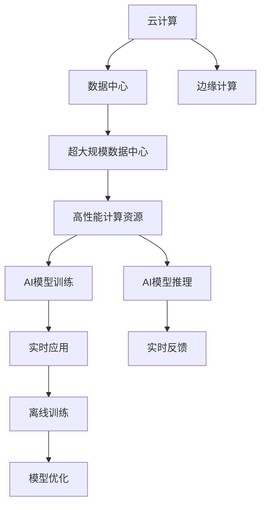

                 

# 算力平台在AI创新中的作用

## 1. 背景介绍

随着人工智能(AI)技术的迅猛发展，算力平台成为了推动AI创新不可或缺的重要基础设施。算力平台不仅为AI研究人员提供了高效、灵活、可扩展的计算资源，还促进了AI技术与各行各业的深度融合。本文将深入探讨算力平台在AI创新中的核心作用，从原理、应用、挑战和未来趋势等多个维度进行分析。

## 2. 核心概念与联系

### 2.1 核心概念概述

- **算力平台(Computational Platform)**：提供高性能计算资源、工具和环境，支持AI模型训练和推理的平台。
- **AI模型训练(Training)**：使用大量数据和计算资源训练出精确的AI模型，用于后续推理和应用。
- **AI推理(Inference)**：使用训练好的模型对新数据进行预测或决策。
- **边缘计算(Edge Computing)**：将计算资源部署在数据源附近，减少数据传输延迟，提升推理速度。
- **云计算(Cloud Computing)**：提供按需、弹性、可扩展的计算资源，支持大规模AI模型训练。
- **混合计算(Hybrid Computing)**：结合边缘计算和云计算的优势，提供灵活的计算资源配置。
- **超大规模数据中心(High-Performance Data Center, HPDC)**：构建海量数据存储和处理的中心，支持大规模AI训练和推理。

### 2.2 核心概念的关系

算力平台通过集成多种计算资源和工具，支持AI模型的高效训练和推理，是推动AI创新发展的关键基础设施。其中，云计算和超大规模数据中心提供了强大的计算能力和数据存储能力，边缘计算则解决了数据传输和实时推理的问题。混合计算则灵活地结合了边缘计算和云计算的优势，满足不同场景下的计算需求。

以下是一个合成的Mermaid流程图，展示了算力平台中各类计算资源的整合和应用：



## 3. 核心算法原理 & 具体操作步骤

### 3.1 算法原理概述

算力平台的核心功能在于提供高效的计算资源和环境，支持AI模型的训练和推理。其算法原理主要包括以下几个方面：

- **分布式计算(Distributed Computing)**：将大规模计算任务拆分成多个小任务，并行运行在多台计算设备上，提高计算效率。
- **模型并行(Model Parallelism)**：将大型神经网络模型拆分成多个子模型，并行计算不同部分，加速模型训练。
- **数据并行(Data Parallelism)**：使用多台计算设备同时处理不同批次的训练数据，提高模型训练速度。
- **模型压缩(Model Compression)**：通过剪枝、量化等技术减小模型规模，降低计算资源需求。

### 3.2 算法步骤详解

算力平台中AI模型的训练和推理通常涉及以下步骤：

1. **数据准备**：收集、清洗、标注大量数据，构建数据集。
2. **模型选择**：选择合适的AI模型结构，如卷积神经网络(CNN)、循环神经网络(RNN)、变换器(Transformer)等。
3. **模型训练**：将数据集输入模型，使用分布式计算和模型并行技术进行高效训练。
4. **模型优化**：通过超参数调优和模型压缩等技术，优化模型性能。
5. **模型推理**：使用训练好的模型对新数据进行推理，生成预测结果或决策。

### 3.3 算法优缺点

算力平台在支持AI创新方面具有以下优点：

- **高效性**：分布式计算和模型并行技术能够显著提高计算效率，加速模型训练。
- **可扩展性**：云计算和边缘计算提供了按需、弹性、可扩展的计算资源，支持大规模AI模型训练和推理。
- **灵活性**：混合计算结合了边缘计算和云计算的优势，能够灵活满足不同场景下的计算需求。

然而，算力平台也存在一些缺点：

- **成本高**：大规模的计算资源和数据存储成本较高，对资金投入要求较高。
- **资源管理复杂**：算力平台的资源调度和管理需要专业知识，对平台操作人员的要求较高。
- **数据隐私和安全问题**：大规模数据处理涉及数据隐私和安全问题，需要严格的保护措施。

### 3.4 算法应用领域

算力平台在AI创新中具有广泛的应用领域，涵盖以下方面：

- **图像识别**：用于图像分类、目标检测、人脸识别等任务，支持大规模图像数据的训练和推理。
- **自然语言处理(NLP)**：支持文本分类、情感分析、机器翻译、对话系统等NLP任务，提供高效的数据处理和模型训练能力。
- **语音识别**：用于语音合成、语音识别、语音情感分析等任务，提供强大的语音数据处理和模型训练支持。
- **推荐系统**：用于个性化推荐、广告推荐等任务，支持大规模用户行为数据的训练和推理。
- **智能制造**：支持智能机器人、智能监控等任务，提供实时数据处理和模型推理能力。

## 4. 数学模型和公式 & 详细讲解

### 4.1 数学模型构建

为了更好地理解算力平台在AI创新中的作用，我们通过数学模型对算力平台的运行机制进行详细分析。

假设一个分布式计算集群包含 $m$ 台计算设备，每台设备计算能力为 $p$，训练任务分为 $k$ 个子任务，每个子任务需要计算时间为 $t$。

定义算力平台的总计算能力为 $C = m \times p$，则单个子任务的计算时间为 $t$，训练任务的总计算时间为 $T = k \times t$。

定义算力平台的训练效率为 $\eta$，则单个子任务的训练时间为 $T_s = \eta \times t$。因此，整个训练任务的总训练时间为 $T_{total} = k \times T_s = k \times \eta \times t$。

### 4.2 公式推导过程

根据以上定义，算力平台的训练效率 $\eta$ 可以表示为：

$$
\eta = \frac{C}{T}
$$

将训练任务总计算时间 $T_{total}$ 代入上式，得：

$$
T_{total} = k \times \eta \times t = k \times \frac{C}{T} \times t
$$

进一步化简得：

$$
T_{total} = \frac{k \times C \times t}{T}
$$

这个公式表明，算力平台的训练效率与训练任务的总计算时间成反比，与集群计算能力和子任务个数成正比。

### 4.3 案例分析与讲解

假设一个集群包含100台计算设备，每台设备计算能力为1 TFLOPS，训练任务分为1000个子任务，每个子任务计算时间为1秒。

代入公式得：

$$
T_{total} = \frac{1000 \times 100 \times 1}{1} = 100000 \text{ 秒} = 2.78 \text{ 小时}
$$

这意味着，在给定计算设备和子任务个数的情况下，算力平台的训练效率决定了训练任务的总时间。

## 5. 项目实践：代码实例和详细解释说明

### 5.1 开发环境搭建

为了进行算力平台的项目实践，我们需要搭建一个支持高性能计算的环境。以下是Python环境下算力平台搭建的详细步骤：

1. **安装依赖**：
```bash
pip install tensorflow dask scikit-learn
```

2. **配置Dask集群**：
```bash
dask-cluster start --config-file config.json
```

3. **启动任务**：
```bash
dask-cluster submit sponge tasks.py
```

4. **运行任务**：
```bash
dask-cluster submit sponge tasks.py
```

### 5.2 源代码详细实现

下面是一个简单的Python代码示例，用于在Dask集群上并行计算子任务：

```python
import dask.distributed as dd
import dask.bag as db

# 定义子任务函数
def task_func(x):
    return x * 2

# 创建Dask集群
client = dd.Client()

# 创建Dask数据集
data = db.from_sequence(range(1000), npartitions=10)

# 并行计算
result = data.map(task_func, cores=10)

# 输出结果
print(result.compute())
```

### 5.3 代码解读与分析

在这个示例中，我们使用了Dask分布式计算框架，将一个大规模计算任务分成多个子任务，并行运行在Dask集群上。

- **Dask集群**：通过配置文件指定集群的节点数和计算能力，启动Dask集群。
- **任务函数**：定义用于计算的函数，每个子任务都会独立运行该函数。
- **数据集**：使用Dask数据集，将数据划分为多个分区，方便并行处理。
- **并行计算**：使用`map`方法将数据集分成多个子任务，并行计算。
- **结果输出**：使用`compute`方法将并行计算结果汇总，并输出。

## 6. 实际应用场景

### 6.1 智慧医疗

在智慧医疗领域，算力平台提供了强大的计算能力，支持大规模医疗数据的分析和处理。算力平台能够高效地处理医学影像、基因数据等大数据，支持智能诊断和个性化治疗方案的生成。例如，在CT影像分析中，算力平台能够快速处理大量影像数据，生成高质量的诊断结果，帮助医生提高诊断效率和准确性。

### 6.2 智能制造

智能制造领域需要实时处理大量传感器数据，进行故障预测、生产优化等任务。算力平台提供了强大的计算能力和实时数据处理能力，支持智能制造系统的运行和优化。例如，在工业机器人控制系统中，算力平台能够实时处理传感器数据，进行轨迹规划和动作优化，提高生产效率和设备利用率。

### 6.3 智慧城市

智慧城市需要处理大量的城市数据，进行交通管理、环境监测等任务。算力平台提供了强大的计算能力和数据存储能力，支持智慧城市的运行和管理。例如，在城市交通管理中，算力平台能够实时处理交通数据，进行流量分析和拥堵预测，优化交通流量，提升交通管理效率。

### 6.4 未来应用展望

未来，随着算力平台技术的不断进步，其在AI创新中的应用前景将更加广阔：

- **边缘计算**：边缘计算将进一步提升实时性和推理速度，支持更复杂的AI应用场景。
- **量子计算**：量子计算将为AI提供更加高效的计算能力，加速模型训练和推理。
- **联邦学习**：联邦学习将支持分布式数据处理和模型训练，保护数据隐私。
- **混合计算**：混合计算将结合边缘计算和云计算的优势，提供更加灵活的计算资源配置。

## 7. 工具和资源推荐

### 7.1 学习资源推荐

为了帮助开发者掌握算力平台在AI创新中的作用，这里推荐一些优质的学习资源：

1. **《深度学习入门》书籍**：该书系统介绍了深度学习的基础知识和常用模型，适合初学者入门。
2. **《TensorFlow官方文档》**：TensorFlow是当前最流行的深度学习框架之一，其官方文档提供了丰富的API和示例，适合进阶学习。
3. **《Dask分布式计算》教程**：Dask是用于分布式计算的Python库，其官方文档和教程提供了详细的学习指南，适合实际应用。
4. **《云计算技术基础》课程**：该课程介绍了云计算的基本概念和应用场景，适合了解云计算技术的基础知识。
5. **《AI创新之路》系列文章**：该系列文章介绍了AI技术的最新进展和应用案例，适合了解AI技术的最新动态。

### 7.2 开发工具推荐

以下是几款用于算力平台开发的常用工具：

1. **TensorFlow**：谷歌开源的深度学习框架，提供强大的计算能力和丰富的模型库，适合大规模模型训练。
2. **PyTorch**：Facebook开源的深度学习框架，灵活易用，适合研究和原型开发。
3. **Dask**：Python库，支持大规模数据处理和分布式计算，适合高效的数据处理和并行计算。
4. **Hadoop**：Apache开源的大数据处理框架，支持大规模数据存储和处理，适合大数据应用场景。
5. **Spark**：Apache开源的分布式计算框架，支持大规模数据处理和机器学习算法，适合大规模数据应用。

### 7.3 相关论文推荐

以下是几篇奠基性的相关论文，推荐阅读：

1. **《分布式深度学习综述》论文**：该论文综述了分布式深度学习的研究进展和最新技术，适合了解分布式计算和模型并行技术。
2. **《边缘计算：趋势和挑战》论文**：该论文分析了边缘计算的现状和未来发展趋势，适合了解边缘计算的应用场景和挑战。
3. **《混合计算：技术与应用》论文**：该论文介绍了混合计算的概念和技术实现，适合了解混合计算的计算模型和应用场景。
4. **《超大规模数据中心设计与实践》论文**：该论文介绍了超大规模数据中心的架构和设计思路，适合了解大规模数据中心的构建和管理。

## 8. 总结：未来发展趋势与挑战

### 8.1 总结

本文对算力平台在AI创新中的核心作用进行了系统介绍。算力平台通过提供强大的计算资源和工具，支持AI模型的高效训练和推理，是推动AI创新发展的关键基础设施。通过理解算力平台的算法原理和操作步骤，我们可以更好地设计和实现AI应用，解决实际问题。

### 8.2 未来发展趋势

展望未来，算力平台将呈现以下几个发展趋势：

1. **分布式计算的普及**：随着云计算和边缘计算技术的成熟，分布式计算将在更多场景中得到应用，支持更复杂、更大规模的AI模型训练和推理。
2. **边缘计算的深入**：边缘计算将进一步提升实时性和推理速度，支持更复杂的AI应用场景。
3. **量子计算的融合**：量子计算将为AI提供更加高效的计算能力，加速模型训练和推理。
4. **联邦学习的广泛应用**：联邦学习将支持分布式数据处理和模型训练，保护数据隐私。
5. **混合计算的优化**：混合计算将结合边缘计算和云计算的优势，提供更加灵活的计算资源配置。

### 8.3 面临的挑战

尽管算力平台在AI创新中发挥了重要作用，但也面临着一些挑战：

1. **成本问题**：大规模的计算资源和数据存储成本较高，对资金投入要求较高。
2. **资源管理**：算力平台的资源调度和管理需要专业知识，对平台操作人员的要求较高。
3. **数据隐私和安全问题**：大规模数据处理涉及数据隐私和安全问题，需要严格的保护措施。
4. **计算效率**：算力平台需要不断优化计算效率，提高模型训练和推理速度。
5. **算法优化**：需要不断优化算法和模型，提高计算效率和模型精度。

### 8.4 研究展望

面对算力平台面临的挑战，未来的研究需要在以下几个方面寻求新的突破：

1. **成本控制**：通过资源共享、云计算资源池等技术，降低算力平台的运行成本。
2. **资源调度优化**：优化算力平台的资源调度算法，提高资源利用率和系统稳定性。
3. **数据隐私保护**：通过数据加密、差分隐私等技术，保护数据隐私和安全。
4. **计算效率提升**：开发高效的算法和模型，提高算力平台的计算效率。
5. **算法优化**：不断优化算法和模型，提高计算效率和模型精度。

## 9. 附录：常见问题与解答

**Q1：算力平台如何支持大规模AI模型的训练和推理？**

A: 算力平台通过分布式计算和模型并行技术，支持大规模AI模型的训练和推理。具体来说，分布式计算将大规模计算任务拆分成多个子任务，并行运行在多台计算设备上，提高计算效率。模型并行技术将大型神经网络模型拆分成多个子模型，并行计算不同部分，加速模型训练。

**Q2：算力平台在智慧医疗中的应用有哪些？**

A: 算力平台在智慧医疗领域提供了强大的计算能力，支持大规模医疗数据的分析和处理。具体应用包括医学影像分析、基因数据处理、智能诊断、个性化治疗方案生成等。例如，在CT影像分析中，算力平台能够快速处理大量影像数据，生成高质量的诊断结果，帮助医生提高诊断效率和准确性。

**Q3：算力平台在智能制造中的应用有哪些？**

A: 算力平台在智能制造领域提供了强大的计算能力和实时数据处理能力，支持智能制造系统的运行和优化。具体应用包括工业机器人控制、故障预测、生产优化等。例如，在工业机器人控制系统中，算力平台能够实时处理传感器数据，进行轨迹规划和动作优化，提高生产效率和设备利用率。

**Q4：算力平台在智慧城市中的应用有哪些？**

A: 算力平台在智慧城市领域提供了强大的计算能力和数据存储能力，支持智慧城市的运行和管理。具体应用包括交通管理、环境监测、智能监控等。例如，在城市交通管理中，算力平台能够实时处理交通数据，进行流量分析和拥堵预测，优化交通流量，提升交通管理效率。

**Q5：算力平台的未来发展趋势有哪些？**

A: 算力平台的未来发展趋势包括分布式计算的普及、边缘计算的深入、量子计算的融合、联邦学习的广泛应用和混合计算的优化。具体来说，分布式计算和边缘计算将进一步提升实时性和推理速度，支持更复杂的AI应用场景。量子计算将为AI提供更加高效的计算能力，加速模型训练和推理。联邦学习将支持分布式数据处理和模型训练，保护数据隐私。混合计算将结合边缘计算和云计算的优势，提供更加灵活的计算资源配置。

---

作者：禅与计算机程序设计艺术 / Zen and the Art of Computer Programming

