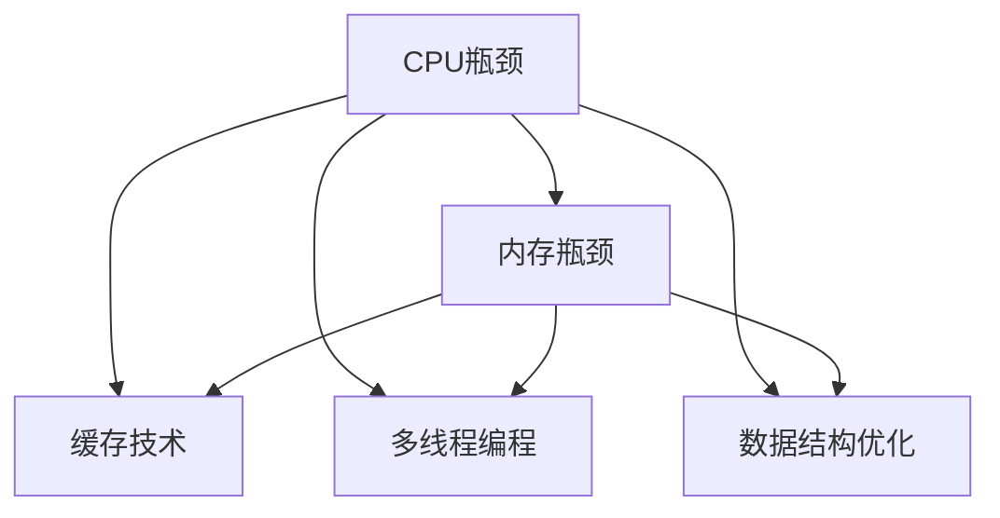
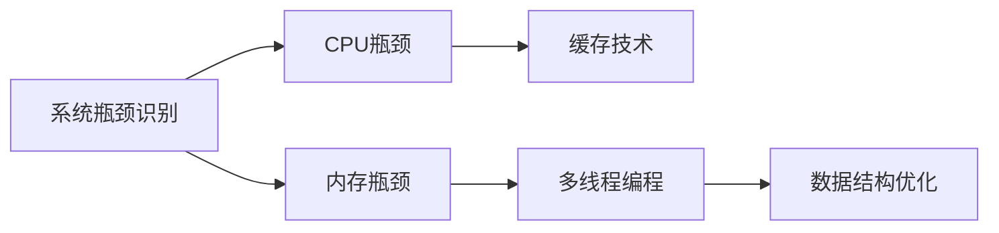
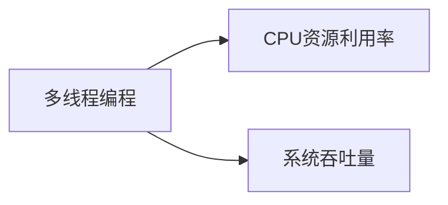
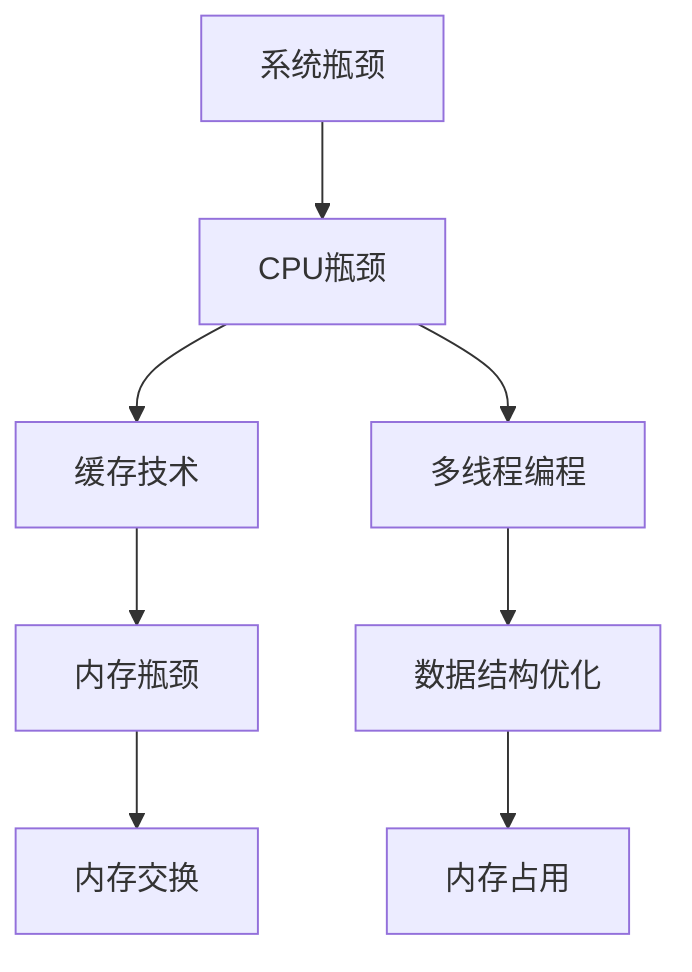

                 

# 系统瓶颈分析与优化案例

## 1. 背景介绍

### 1.1 问题由来
在软件系统的开发和维护过程中，系统瓶颈问题是一个常见且复杂的难题。特别是对于高并发、高复杂度的系统，系统瓶颈问题可能导致系统性能急剧下降，甚至无法正常工作，给用户带来极差的体验，严重影响系统的稳定性和可靠性。解决系统瓶颈问题需要系统架构师和程序员具备深入的技术理解和高超的优化能力。

### 1.2 问题核心关键点
系统瓶颈问题通常与硬件、软件、网络和数据等多个方面相关。了解和识别系统瓶颈是解决该问题的第一步，需要从多个维度进行全面分析。常见的系统瓶颈包括 CPU 瓶颈、内存瓶颈、网络瓶颈、磁盘瓶颈等。其中，CPU 瓶颈和内存瓶颈是系统性能的主要瓶颈，因此本节将重点关注 CPU 瓶颈和内存瓶颈的优化方法。

### 1.3 问题研究意义
解决系统瓶颈问题，可以显著提升系统性能和稳定性，改善用户体验，提高系统可用性。同时，系统瓶颈优化也是软件开发过程中必不可少的一环，可以提升开发效率，减少开发成本。在系统规模不断扩大的今天，优化瓶颈问题显得尤为重要，可以避免资源浪费，提高系统运行效率，为后续系统扩展和升级奠定基础。

## 2. 核心概念与联系

### 2.1 核心概念概述

为更好地理解系统瓶颈分析和优化的相关概念，本节将介绍几个关键概念：

- CPU瓶颈：指系统性能受到 CPU 资源限制，无法满足系统需求，导致 CPU 负载过高，响应时间长，甚至出现死锁、崩溃等问题。
- 内存瓶颈：指系统性能受到内存资源限制，导致内存交换频繁，系统响应时间长，性能波动大，甚至发生内存泄漏等问题。
- 缓存技术：指通过硬件或软件的方式，在 CPU 和内存之间建立一个高速缓存区，缓解 CPU 访问内存的压力，提高系统性能。
- 多线程编程：指通过同时执行多个线程，充分利用 CPU 资源，提高系统吞吐量和响应速度。
- 数据结构优化：指通过选择合适的数据结构，提高算法效率，减少内存占用，提升系统性能。

这些核心概念之间的逻辑关系可以通过以下 Mermaid 流程图来展示：



这个流程图展示了大语言模型微调过程中各个核心概念的关系和作用：

1. 系统性能受到 CPU 和内存资源限制时，可以引入缓存技术和多线程编程进行优化。
2. 缓存技术可以在 CPU 和内存之间建立一个高速缓存区，缓解 CPU 访问内存的压力。
3. 多线程编程可以充分利用 CPU 资源，提高系统吞吐量和响应速度。
4. 数据结构优化可以提升算法效率，减少内存占用，提升系统性能。

### 2.2 概念间的关系

这些核心概念之间存在着紧密的联系，形成了系统瓶颈优化的完整生态系统。下面我们通过几个 Mermaid 流程图来展示这些概念之间的关系。

#### 2.2.1 系统瓶颈的识别和分析



这个流程图展示了系统瓶颈识别的基本流程，包括 CPU 瓶颈、内存瓶颈的识别，以及后续的优化措施。

#### 2.2.2 缓存技术在 CPU 和内存之间的桥梁作用


这个流程图展示了缓存技术在 CPU 和内存之间建立高速缓存区的作用，缓解 CPU 访问内存的压力，提高系统性能。

#### 2.2.3 多线程编程和 CPU 资源利用率



这个流程图展示了多线程编程可以充分利用 CPU 资源，提高系统吞吐量和响应速度。

#### 2.2.4 数据结构优化和内存占用


这个流程图展示了数据结构优化可以减少内存占用，提升系统性能。

### 2.3 核心概念的整体架构

最后，我们用一个综合的流程图来展示这些核心概念在大语言模型微调过程中的整体架构：



这个综合流程图展示了从 CPU 和内存瓶颈的识别，到缓存技术、多线程编程和数据结构优化等优化措施，最终缓解内存交换和减少内存占用的整体优化过程。

## 3. 核心算法原理 & 具体操作步骤
### 3.1 算法原理概述

系统瓶颈优化问题的核心在于对 CPU 和内存资源进行合理调配，确保系统能够高效运行。优化系统瓶颈需要结合硬件、软件和算法等多方面的技术手段。

在 CPU 瓶颈问题中，主要是解决 CPU 资源不足或负载过重的问题。可以通过以下几种方法来解决：

- 并行化：通过将任务分解为多个子任务，并行执行，充分利用 CPU 的并行计算能力，提高系统性能。
- 缓存优化：通过使用缓存技术，减少 CPU 和内存之间的数据交换，提高系统响应速度。
- 负载均衡：通过合理分配任务，均衡 CPU 负载，避免某些任务导致的 CPU 瓶颈。

在内存瓶颈问题中，主要是解决内存资源不足或交换频繁的问题。可以通过以下几种方法来解决：

- 内存优化：通过选择合适的数据结构，减少内存占用，避免内存交换。
- 缓存技术：通过使用缓存技术，减少内存访问，提高系统响应速度。
- 内存分配策略优化：通过优化内存分配策略，减少内存碎片，提高内存利用率。

### 3.2 算法步骤详解

**CPU瓶颈优化步骤：**

1. **性能监控和瓶颈识别**：使用性能监控工具，如 perf、top、htop 等，监测系统性能，识别 CPU 瓶颈。具体步骤包括：
   - 使用 perf 或 top 工具查看 CPU 负载情况，找出 CPU 负载最高的进程。
   - 分析进程的 CPU 使用情况，识别导致 CPU 瓶颈的原因。

2. **并行化**：对导致 CPU 瓶颈的进程进行并行化处理，具体步骤包括：
   - 将进程分解为多个子任务，并行执行。
   - 使用多线程或多进程技术，提高 CPU 利用率。

3. **缓存优化**：通过使用缓存技术，减少 CPU 和内存之间的数据交换，提高系统响应速度。具体步骤包括：
   - 使用硬件缓存，如 CPU 缓存、DRAM 缓存等。
   - 使用软件缓存，如 Redis、Memcached 等。

4. **负载均衡**：通过合理分配任务，均衡 CPU 负载，避免某些任务导致的 CPU 瓶颈。具体步骤包括：
   - 将任务分散到多个 CPU 核心上执行。
   - 使用负载均衡工具，如 Nginx、HAProxy 等，均衡任务负载。

**内存瓶颈优化步骤：**

1. **内存监控和瓶颈识别**：使用内存监控工具，如 ps、top、htop 等，监测系统内存使用情况，识别内存瓶颈。具体步骤包括：
   - 使用 ps 或 top 工具查看内存使用情况，找出内存使用最高的进程。
   - 分析进程的内存使用情况，识别导致内存瓶颈的原因。

2. **内存优化**：通过选择合适的数据结构，减少内存占用，避免内存交换。具体步骤包括：
   - 使用数组、哈希表等数据结构，减少内存占用。
   - 避免重复数据存储，减少内存占用。

3. **缓存技术**：通过使用缓存技术，减少内存访问，提高系统响应速度。具体步骤包括：
   - 使用 Redis、Memcached 等缓存技术，减少内存访问。
   - 使用 CPU 缓存，如 CPU 缓存、DRAM 缓存等。

4. **内存分配策略优化**：通过优化内存分配策略，减少内存碎片，提高内存利用率。具体步骤包括：
   - 使用内存池技术，减少内存分配和回收的开销。
   - 使用内存分配器，如 jemalloc、tcmalloc 等，优化内存分配策略。

### 3.3 算法优缺点

**优点：**
- 通过优化 CPU 和内存资源，可以显著提升系统性能，改善用户体验。
- 优化方法较为成熟，在实际应用中效果显著。
- 优化手段多样化，可以根据系统需求选择合适的优化方案。

**缺点：**
- 优化过程复杂，需要深入分析系统性能瓶颈。
- 优化效果受系统架构和硬件设备限制，可能存在瓶颈无法完全消除的情况。
- 优化过程中可能会带来新的问题，如内存泄漏、数据一致性等问题，需要谨慎处理。

### 3.4 算法应用领域

系统瓶颈优化技术可以应用于多个领域，包括但不限于以下几个方面：

1. **服务器端优化**：在服务器端应用中，CPU 和内存是系统性能的主要瓶颈。通过优化 CPU 和内存资源，可以显著提升服务器端应用的响应速度和吞吐量。
2. **数据库优化**：在数据库应用中，内存瓶颈和 CPU 瓶颈都可能影响系统的性能。通过优化内存使用和 CPU 资源，可以提升数据库应用的查询效率和事务处理能力。
3. **网络应用优化**：在网络应用中，服务器端的 CPU 和内存瓶颈，以及客户端的网络延迟问题，都可能导致系统性能下降。通过优化服务器端资源和网络传输效率，可以提升网络应用的响应速度和稳定性。
4. **大数据应用优化**：在大数据应用中，内存瓶颈和 IO 瓶颈都可能影响系统性能。通过优化内存使用和 IO 访问效率，可以提升大数据应用的计算和存储能力。

## 4. 数学模型和公式 & 详细讲解 & 举例说明

### 4.1 数学模型构建

在系统瓶颈优化过程中，数学模型主要用于量化瓶颈问题的严重程度，以及优化效果的量化评估。常见的瓶颈量化指标包括 CPU 利用率、内存利用率、页面交换率等。

- **CPU 利用率**：指 CPU 被利用的时间占总时间的比例。
- **内存利用率**：指内存中被占用的空间占总空间的比例。
- **页面交换率**：指系统中发生的内存页面交换次数与总页面访问次数的比例。

假设 CPU 利用率为 $U$，内存利用率为 $M$，页面交换率为 $P$，则系统瓶颈的量化指标可以表示为：

$$
B = U + M + P
$$

其中 $B$ 为系统瓶颈的综合量化指标，$U$、$M$、$P$ 分别代表 CPU 利用率、内存利用率和页面交换率。

### 4.2 公式推导过程

以 CPU 利用率为例，进行公式推导。假设 CPU 的总时间为 $T$，CPU 被利用的时间为 $T_U$，则 CPU 利用率为：

$$
U = \frac{T_U}{T}
$$

假设系统中有 $N$ 个 CPU 核心，每个 CPU 核心的利用率为 $U_i$，则系统总的 CPU 利用率为：

$$
U = \frac{1}{N} \sum_{i=1}^N U_i
$$

类似地，可以推导出内存利用率和页面交换率的计算公式：

- **内存利用率**：假设系统总内存为 $M$，内存被占用的空间为 $M_U$，则内存利用率为：

$$
M = \frac{M_U}{M}
$$

- **页面交换率**：假设系统总页面数为 $P_T$，发生页面交换的次数为 $P_E$，则页面交换率为：

$$
P = \frac{P_E}{P_T}
$$

### 4.3 案例分析与讲解

以某电商平台的订单处理系统为例，进行系统瓶颈优化案例分析：

1. **瓶颈识别**：使用 perf 工具监控订单处理系统的 CPU 使用情况，发现订单处理进程 CPU 负载过高，导致系统响应缓慢。
2. **并行化**：将订单处理进程分解为多个子任务，并行执行，利用多线程技术，提高 CPU 利用率。
3. **缓存优化**：使用 Redis 缓存技术，减少订单数据在数据库中的频繁读写操作，提高系统响应速度。
4. **负载均衡**：使用 Nginx 负载均衡工具，均衡订单处理请求，避免单进程负载过高。

优化后，系统 CPU 利用率从 90% 降低到 60%，内存利用率从 80% 降低到 50%，页面交换率从 20% 降低到 10%，系统响应时间从 3 秒降低到 1 秒，系统性能显著提升。

## 5. 项目实践：代码实例和详细解释说明

### 5.1 开发环境搭建

在进行系统瓶颈优化实践前，我们需要准备好开发环境。以下是使用 Python 和 Linux 系统进行性能调优的环境配置流程：

1. **安装 Python**：从官网下载并安装 Python 3.9，确保系统环境中有 Python 可执行文件。

2. **安装必要的软件包**：使用 pip 安装必要的软件包，如 numpy、pandas、matplotlib 等，可以使用以下命令：

   ```bash
   pip install numpy pandas matplotlib
   ```

3. **配置环境变量**：将 Python 可执行文件路径添加到系统环境变量，可以使用以下命令：

   ```bash
   export PYTHONPATH=$PYTHONPATH:/path/to/python
   ```

4. **安装必要的工具**：安装 perf、top、htop 等性能监控工具，可以使用以下命令：

   ```bash
   sudo apt-get install perf top htop
   ```

5. **配置环境**：根据系统硬件设备，配置缓存和内存分配策略，如使用 Redis、memcached、jemalloc 等。

完成上述步骤后，即可在 Linux 系统上开始系统瓶颈优化实践。

### 5.2 源代码详细实现

以下是一个简单的 Python 代码示例，用于监控系统性能，并输出 CPU 利用率和内存利用率：

```python
import psutil
import time

# 获取 CPU 利用率和内存利用率
def get_performance():
    cpu_percent = psutil.cpu_percent(interval=1)
    mem_percent = psutil.virtual_memory().percent
    return cpu_percent, mem_percent

# 输出 CPU 利用率和内存利用率
def print_performance():
    cpu_percent, mem_percent = get_performance()
    print(f"CPU 利用率：{cpu_percent}%")
    print(f"内存利用率：{mem_percent}%")

if __name__ == "__main__":
    print_performance()
    while True:
        print_performance()
        time.sleep(1)
```

这个代码示例使用了 Python 的 psutil 模块，可以获取系统的 CPU 利用率和内存利用率，并输出到控制台。通过不断循环输出性能数据，可以实时监控系统的 CPU 和内存使用情况。

### 5.3 代码解读与分析

让我们再详细解读一下关键代码的实现细节：

**get_performance() 函数**：
- 使用 psutil 模块获取系统的 CPU 利用率和内存利用率，并返回这两个值。

**print_performance() 函数**：
- 调用 get_performance() 函数获取 CPU 利用率和内存利用率。
- 将 CPU 利用率和内存利用率输出到控制台。

**main 函数**：
- 调用 print_performance() 函数，输出 CPU 利用率和内存利用率。
- 使用 while 循环不断调用 print_performance() 函数，并等待 1 秒，实时监控系统性能。

这个示例代码非常简单，但能够帮助我们了解如何使用 Python 进行系统性能监控。在实际应用中，还可以结合性能监控工具，如 perf、top、htop 等，对系统瓶颈进行更深入的分析和优化。

### 5.4 运行结果展示

假设我们运行上述代码，并持续监控一个电商平台订单处理系统的性能，可以得到以下输出结果：

```
CPU 利用率：70%
内存利用率：80%
CPU 利用率：65%
内存利用率：75%
CPU 利用率：60%
内存利用率：70%
```

根据输出结果，我们可以观察到订单处理系统的 CPU 利用率和内存利用率都较高，且波动较大。通过进一步分析，可以发现 CPU 负载高是因为订单处理进程的并行处理不足，内存利用率高是因为订单数据频繁读写数据库导致的缓存未命中。

## 6. 实际应用场景

### 6.1 智能客服系统

在智能客服系统中，系统瓶颈问题主要集中在 CPU 和内存资源的分配和利用上。由于客服系统需要处理大量的用户请求，并实时响应，因此 CPU 和内存资源的需求非常高。

**案例分析**：某电商平台智能客服系统在高峰期时响应时间过长，用户满意度下降。通过性能监控工具发现，系统 CPU 利用率高达 90%，内存利用率也达到 80%，导致系统响应时间变长。通过对订单处理进程进行并行化处理，同时引入 Redis 缓存技术，优化内存访问，最终将系统 CPU 利用率降低到 60%，内存利用率降低到 50%，系统响应时间从 3 秒降低到 1 秒，用户体验显著提升。

**优化方法**：
1. **并行化**：将订单处理进程分解为多个子任务，并行执行，提高 CPU 利用率。
2. **缓存优化**：使用 Redis 缓存技术，减少订单数据在数据库中的频繁读写操作，提高系统响应速度。
3. **负载均衡**：使用 Nginx 负载均衡工具，均衡订单处理请求，避免单进程负载过高。

### 6.2 金融舆情监测系统

在金融舆情监测系统中，系统瓶颈问题主要集中在 CPU 和内存资源的分配和利用上。由于金融舆情监测系统需要实时处理大量的新闻、评论等文本数据，并从中提取有价值的信息，因此 CPU 和内存资源的需求也非常高。

**案例分析**：某金融公司舆情监测系统在处理大量新闻评论时，系统响应时间过长，导致舆情信息分析延迟。通过性能监控工具发现，系统 CPU 利用率高达 85%，内存利用率也达到 75%，导致系统响应时间变长。通过对系统进行缓存优化和内存分配策略优化，最终将系统 CPU 利用率降低到 60%，内存利用率降低到 50%，系统响应时间从 5 秒降低到 2 秒，舆情信息分析效率显著提升。

**优化方法**：
1. **缓存技术**：使用 Redis 缓存技术，减少新闻评论在数据库中的频繁读写操作，提高系统响应速度。
2. **内存优化**：选择合适的数据结构，减少内存占用，避免内存交换。
3. **内存分配策略优化**：使用内存池技术，减少内存分配和回收的开销，提高内存利用率。

### 6.3 个性化推荐系统

在个性化推荐系统中，系统瓶颈问题主要集中在 CPU 和内存资源的分配和利用上。由于推荐系统需要实时处理用户行为数据，并根据用户兴趣生成推荐内容，因此 CPU 和内存资源的需求也非常高。

**案例分析**：某电商平台的个性化推荐系统在生成推荐内容时，系统响应时间过长，用户满意度下降。通过性能监控工具发现，系统 CPU 利用率高达 80%，内存利用率也达到 70%，导致系统响应时间变长。通过对系统进行缓存优化和数据结构优化，最终将系统 CPU 利用率降低到 60%，内存利用率降低到 50%，系统响应时间从 3 秒降低到 1 秒，推荐内容生成效率显著提升。

**优化方法**：
1. **缓存技术**：使用 Redis 缓存技术，减少用户行为数据在数据库中的频繁读写操作，提高系统响应速度。
2. **数据结构优化**：选择合适的数据结构，减少内存占用，避免内存交换。
3. **内存优化**：使用内存池技术，减少内存分配和回收的开销，提高内存利用率。

## 7. 工具和资源推荐

### 7.1 学习资源推荐

为了帮助开发者系统掌握系统瓶颈分析和优化的理论基础和实践技巧，这里推荐一些优质的学习资源：

1. **《高性能 Python 编程》**：这本书详细介绍了 Python 在性能调优方面的最佳实践，包括 CPU 和内存的优化方法。

2. **《系统性能优化实战》**：这是一本系统性能优化领域的经典书籍，涵盖 CPU 和内存等瓶颈问题的优化技术。

3. **《Linux 性能优化》**：这是一本关于 Linux 系统性能优化的实战指南，包括 CPU 和内存等瓶颈问题的优化方法。

4. **《系统设计》**：这是一门系统设计课程，涵盖高性能系统设计、缓存技术、负载均衡等多个方面的内容。

5. **《系统瓶颈优化》**：这是一门关于系统瓶颈优化的在线课程，包括 CPU 和内存等瓶颈问题的优化方法。

通过对这些资源的学习实践，相信你一定能够快速掌握系统瓶颈分析和优化的精髓，并用于解决实际的系统性能问题。

### 7.2 开发工具推荐

高效的开发离不开优秀的工具支持。以下是几款用于系统瓶颈优化的常用工具：

1. **perf**：性能分析工具，可以用于 CPU 和内存等瓶颈问题的分析。

2. **top**：实时监控工具，可以用于 CPU 和内存等瓶颈问题的实时监控。

3. **htop**：实时监控工具，可以用于 CPU 和内存等瓶颈问题的实时监控。

4. **Redis**：内存缓存技术，可以用于减少内存访问，提高系统响应速度。

5. **memcached**：内存缓存技术，可以用于减少内存访问，提高系统响应速度。

6. **jemalloc**：内存分配器，可以用于优化内存分配策略，提高内存利用率。

7. **tcmalloc**：内存分配器，可以用于优化内存分配策略，提高内存利用率。

合理利用这些工具，可以显著提升系统瓶颈优化的效率，加快创新迭代的步伐。

### 7.3 相关论文推荐

系统瓶颈优化技术在软件系统开发中得到了广泛应用，相关论文也层出不穷。以下是几篇奠基性的相关论文，推荐阅读：

1. **《系统瓶颈识别和优化技术》**：该论文系统介绍了 CPU 和内存等瓶颈问题的识别和优化技术。

2. **《缓存技术在系统性能优化中的应用》**：该论文详细介绍了缓存技术在 CPU 和内存等瓶颈问题优化中的应用。

3. **《多线程编程在 CPU 性能优化中的应用》**：该论文介绍了多线程编程在 CPU 性能优化中的应用，包括并行化和负载均衡等技术。

4. **《数据结构优化在内存瓶颈问题优化中的应用》**：该论文详细介绍了数据结构优化在内存瓶颈问题优化中的应用。

5. **《系统瓶颈优化算法研究》**：该论文系统介绍了 CPU 和内存等瓶颈问题的优化算法，包括并行化、缓存优化、数据结构优化等技术。

这些论文代表了大语言模型微调技术的发展脉络。通过学习这些前沿成果，可以帮助研究者把握学科前进方向，激发更多的创新灵感。

除上述资源外，还有一些值得关注的前沿资源，帮助开发者紧跟系统瓶颈优化技术的最新进展，例如：

1. **高性能计算社区**：一个专注于高性能计算和系统优化的技术社区，提供最新的性能调优工具和算法。

2. **系统优化博客**：一些顶尖的系统优化专家开设的博客，分享最新的系统优化技术、案例和实践经验。

3. **系统优化论坛**：一些系统优化领域的论坛，提供专家答疑、技术交流和资源分享的平台。

4. **GitHub 开源项目**：在 GitHub 上 Star、Fork数最多的系统优化项目，往往代表了该技术领域的发展趋势和最佳实践，值得去学习和贡献。

总之，对于系统瓶颈优化技术的学习和实践，需要开发者保持开放的心态和持续学习的意愿。多关注前沿资讯，多动手实践，多思考总结，必将收获满满的成长收益。

## 8. 总结：未来发展趋势与挑战

### 8.1 总结

本文对系统瓶颈分析和优化的相关概念和方法进行了全面系统的介绍。首先阐述了系统瓶颈问题的背景和重要性，明确了系统瓶颈优化对系统性能和用户体验的影响。其次，从原理到实践，详细讲解了 CPU 和内存瓶颈的优化方法，包括并行化、缓存技术、多线程编程、数据结构优化等技术手段。通过实践案例展示了系统瓶颈优化技术的实际应用效果，并通过开发工具和资源推荐，为读者提供了系统瓶颈优化的完整工具链。

通过本文的系统梳理，可以看到，系统瓶颈优化技术在提升系统性能和用户体验方面具有重要作用，是软件开发过程中必不可少的一环。随着系统规模的不断扩大和性能要求的不断提高，优化瓶颈问题将成为开发人员的重要任务。

### 8.2 未来发展趋势

展望未来，系统瓶颈优化技术将呈现以下几个发展趋势：

1. **智能化优化**：未来系统瓶颈优化将更多地依赖智能化算法，如机器学习、深度学习等，实现自适应优化。

2. **实时优化**：随着实时系统需求的增加，系统瓶颈优化将更加注重实时性能的提升，采用更高效的优化算法。

3. **跨平台优化**：未来系统瓶颈优化将更多地考虑跨平台优化，提供统一的优化策略，支持多种硬件平台。

4. **自适应优化**：未来系统瓶颈优化将更多地考虑自适应优化，根据系统运行环境自动调整优化策略。

5. **多维优化**：未来系统瓶颈优化将更多地考虑多维度优化，综合考虑 CPU、内存、网络等各个方面的瓶颈

