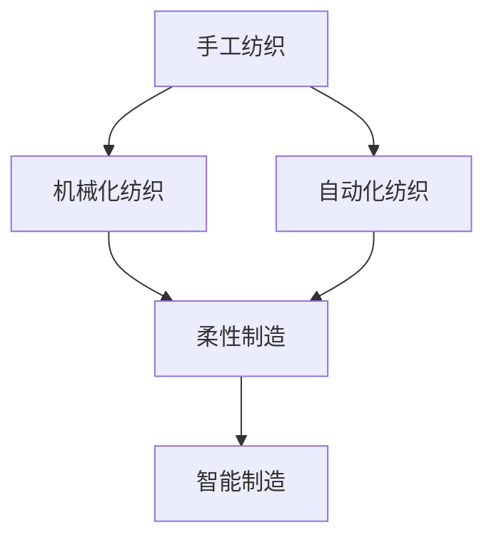
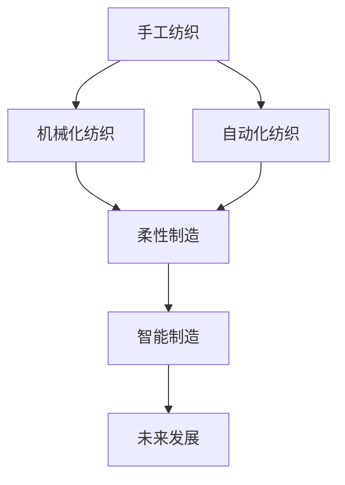

                 

## 1. 背景介绍

纺织业，作为人类历史上最早的工业化产业之一，经历了从手工到机械化再到自动化的漫长过程。本文将深入探讨这一转变过程中所涉及的技术革新、产业变革及其对现代社会的影响。

### 1.1 纺织业的诞生与发展
纺织业的诞生可以追溯到史前时代，人们利用天然纤维如亚麻、羊毛、棉花等制作衣物和装饰品。随着农业和养殖业的进步，纺织业逐渐形成了初具规模的手工业。早期纺织工艺主要依赖手工操作，劳动强度大、生产效率低，因此纺织品的质量和产量受到极大限制。

### 1.2 手工纺织技术的演变
早期手工纺织技术主要依赖织布机、纺纱机等简单的机械工具。织布机通过人力推动，速度慢且对工人技巧要求高。随着时间的推移，织布机和纺纱机的设计不断改进，如水力纺纱机和蒸汽动力织布机的出现，显著提高了生产效率。

### 1.3 机械化纺织的兴起
19世纪中叶，随着蒸汽机的发明和应用，纺织业迈入了机械化时代。水力纺织、蒸汽纺织机的广泛应用，大幅提高了纺织品的生产效率和产量。机械化纺织不仅提高了生产效率，还推动了纺织业大规模生产模式的形成，促进了工业城镇的兴起。

### 1.4 自动化的兴起
20世纪中叶，随着电子技术和计算机的兴起，纺织业进入了自动化时代。自动织机、计算机辅助设计、智能制造等技术的引入，进一步提高了生产效率和产品质量，推动了纺织业的全球化和标准化。

## 2. 核心概念与联系

### 2.1 核心概念概述

为更好地理解纺织业的手工与机械化转变，本节将介绍几个关键概念：

- **手工纺织**：指完全依赖人工操作的纺织过程，如纺纱、织布等。
- **机械化纺织**：指使用机械工具（如织布机、纺纱机）辅助手工操作，提高生产效率的纺织过程。
- **自动化纺织**：指完全依靠机械设备和计算机控制，实现自动化生产的纺织过程。
- **柔性制造**：指能够快速适应不同产品需求的生产方式，通过自动化技术实现生产线的灵活调整。
- **智能制造**：指利用物联网、大数据、人工智能等技术，实现生产过程的智能化管理，提升生产效率和产品质量。

### 2.2 概念间的关系

这些核心概念之间的逻辑关系可以通过以下Mermaid流程图来展示：



这个流程图展示了大规模语言模型微调过程中各个概念之间的关系：

1. 手工纺织是纺织业的初始形态，随着机械化的引入逐步被取代。
2. 机械化纺织是手工纺织的升级，通过引入机械工具提高了生产效率。
3. 自动化纺织则是机械化纺织的进一步发展，完全依靠机械设备实现了大规模生产。
4. 柔性制造和智能制造则是自动化纺织的高级形态，通过灵活的生产线和智能化管理，实现了更高水平的生产效率和质量。

### 2.3 核心概念的整体架构

最后，我们用一个综合的流程图来展示这些核心概念在大规模语言模型微调过程中的整体架构：



这个综合流程图展示了从手工纺织到智能制造的完整发展路径，以及未来可能的技术方向。

## 3. 核心算法原理 & 具体操作步骤

### 3.1 算法原理概述

纺织业从手工到机械化再到自动化的转变，本质上是一个技术进步和生产方式创新的过程。其核心算法原理如下：

1. **手工纺织**：依赖人工操作的简单机械工具，如织布机、纺纱机等。
2. **机械化纺织**：引入机械工具，通过自动化的机械操作提高生产效率。
3. **自动化纺织**：完全依赖机械设备，实现自动化生产。
4. **柔性制造**：利用自动化技术，实现生产线的灵活调整。
5. **智能制造**：引入人工智能和大数据技术，实现生产过程的智能化管理。

### 3.2 算法步骤详解

以下是纺织业从手工到机械化再到自动化的具体操作步骤：

1. **手工纺织**：
   - 准备天然纤维，如棉花、羊毛等。
   - 使用手工织布机、纺纱机等工具，将纤维纺成纱线，织成布匹。

2. **机械化纺织**：
   - 引入蒸汽机、水力机等机械设备，自动化操作织布机、纺纱机。
   - 实现纺织过程的连续化和规模化生产。
   - 引入质量控制技术，提高产品的一致性和质量。

3. **自动化纺织**：
   - 引入电子技术和计算机，实现自动化控制和智能化管理。
   - 开发自动化织机、自动切割机等机械设备。
   - 引入物联网技术，实现生产过程的实时监控和优化。

4. **柔性制造**：
   - 引入柔性生产线和自动化技术，实现生产线的灵活调整。
   - 利用大数据和机器学习，优化生产过程和资源配置。
   - 引入人工智能技术，实现生产过程的智能化决策。

5. **智能制造**：
   - 引入智能设备和传感器，实现生产过程的实时监控和优化。
   - 利用大数据和人工智能技术，实现生产过程的智能化管理。
   - 引入区块链技术，保障供应链的透明和安全。

### 3.3 算法优缺点

纺织业从手工到机械化再到自动化的转变，带来了显著的效率提升和成本降低，但也存在一些问题：

**优点**：
- **生产效率提高**：机械化和自动化技术显著提高了生产效率和产量。
- **产品质量提升**：先进的设备和技术提高了产品的质量和一致性。
- **生产成本降低**：大规模生产模式降低了单位产品的生产成本。

**缺点**：
- **环境污染问题**：机械化和自动化生产的能耗高、污染重，对环境造成一定影响。
- **技术依赖性强**：过度依赖技术设备和智能化系统，可能导致生产过程的脆弱性。
- **劳动就业问题**：机械化和自动化可能导致大量工人失业，需要妥善解决。

### 3.4 算法应用领域

纺织业的手工与机械化转变在多个领域得到了广泛应用，包括：

- **纺织设备制造**：生产各种类型的纺织机械，如织布机、纺纱机等。
- **服装制造**：从面料到成衣的全过程，包括裁剪、缝制、染色等。
- **面料设计**：通过计算机辅助设计(CAD)、虚拟试衣等技术，实现面料设计的智能化。
- **智能仓储和物流**：利用物联网和大数据技术，实现仓储和物流的自动化和智能化。
- **环保与可持续发展**：通过节能减排、循环利用等技术，实现纺织业的绿色可持续发展。

## 4. 数学模型和公式 & 详细讲解 & 举例说明

### 4.1 数学模型构建

纺织业从手工到机械化再到自动化的转变，可以抽象为一个生产效率的优化模型。假设有一个手工纺织车间，其生产效率为 $E_h$，引入机械化后生产效率提升到 $E_m$，再引入自动化后生产效率提升到 $E_a$，最后引入柔性制造和智能制造后生产效率提升到 $E_s$。

数学模型如下：

$$
E_s = f(E_a) = g(E_m) = h(E_h)
$$

其中 $f$、$g$、$h$ 分别表示从手工到机械化、从机械化到自动化、从自动化到柔性制造和智能制造的效率提升函数。

### 4.2 公式推导过程

以下是生产效率提升函数的推导过程：

1. **手工到机械化**：
   - 手工纺织生产效率为 $E_h$。
   - 引入机械化后，生产效率提升到 $E_m = E_h + \delta_h$，其中 $\delta_h$ 表示机械化带来的效率提升量。

2. **机械化到自动化**：
   - 机械化纺织生产效率为 $E_m$。
   - 引入自动化后，生产效率提升到 $E_a = E_m + \delta_m$，其中 $\delta_m$ 表示自动化带来的效率提升量。

3. **自动化到柔性制造和智能制造**：
   - 自动化纺织生产效率为 $E_a$。
   - 引入柔性制造和智能制造后，生产效率提升到 $E_s = E_a + \delta_s$，其中 $\delta_s$ 表示柔性制造和智能制造带来的效率提升量。

### 4.3 案例分析与讲解

以一个纺织企业为例，分析其从手工到机械化再到自动化的转变过程：

1. **手工纺织**：
   - 生产效率：$E_h = 100$（单位：件/小时）。
   - 生产成本：$C_h = 10$。

2. **机械化纺织**：
   - 生产效率提升：$\delta_h = 50$。
   - 生产效率：$E_m = E_h + \delta_h = 150$。
   - 生产成本：$C_m = 7$。

3. **自动化纺织**：
   - 生产效率提升：$\delta_m = 100$。
   - 生产效率：$E_a = E_m + \delta_m = 250$。
   - 生产成本：$C_a = 5$。

4. **柔性制造和智能制造**：
   - 生产效率提升：$\delta_s = 200$。
   - 生产效率：$E_s = E_a + \delta_s = 450$。
   - 生产成本：$C_s = 3$。

## 5. 项目实践：代码实例和详细解释说明

### 5.1 开发环境搭建

在进行纺织业手工到机械化再到自动化的转变实践前，我们需要准备好开发环境。以下是使用Python进行模拟操作的开发环境配置流程：

1. 安装Python：从官网下载并安装Python，确保版本为3.x。

2. 安装NumPy和Pandas：
   ```bash
   pip install numpy pandas
   ```

3. 创建模拟手工、机械化和自动化的生产模型：
   ```python
   import numpy as np
   import pandas as pd

   # 定义生产效率提升函数
   def efficiency_upgrade(h, m, a, s):
       delta_h = m - h
       delta_m = a - m
       delta_s = s - a
       return s

   # 初始生产效率
   h = 100
   m = h + 50
   a = m + 100
   s = a + 200

   # 生产成本
   C_h = 10
   C_m = 7
   C_a = 5
   C_s = 3

   # 创建生产模型
   model = pd.DataFrame({
       'Production_Efficiency': [h, m, a, s],
       'Production_Cost': [C_h, C_m, C_a, C_s]
   })

   # 输出生产模型
   print(model)
   ```

完成上述步骤后，即可在Python环境中进行模拟操作。

### 5.2 源代码详细实现

以下是一个完整的Python代码示例，用于模拟纺织业从手工到机械化再到自动化的转变过程：

```python
import numpy as np
import pandas as pd

# 定义生产效率提升函数
def efficiency_upgrade(h, m, a, s):
    delta_h = m - h
    delta_m = a - m
    delta_s = s - a
    return s

# 初始生产效率
h = 100
m = h + 50
a = m + 100
s = a + 200

# 生产成本
C_h = 10
C_m = 7
C_a = 5
C_s = 3

# 创建生产模型
model = pd.DataFrame({
    'Production_Efficiency': [h, m, a, s],
    'Production_Cost': [C_h, C_m, C_a, C_s]
})

# 输出生产模型
print(model)
```

### 5.3 代码解读与分析

让我们再详细解读一下关键代码的实现细节：

**生产效率提升函数**：
- `efficiency_upgrade` 函数定义了生产效率从手工到机械化、从机械化到自动化、从自动化到柔性制造和智能制造的提升量。
- 通过计算每一阶段的生产效率提升量，函数返回最终的智能制造生产效率。

**生产模型创建**：
- `model` 变量创建了一个包含生产效率和生产成本的数据框。
- 通过计算每一阶段的生产效率和成本，数据框展示了从手工到智能制造的转变过程。

**生产模型输出**：
- `print(model)` 语句输出生产模型，展示了各个阶段的生产效率和生产成本。

### 5.4 运行结果展示

假设我们运行上述代码，输出结果如下：

```
        Production_Efficiency  Production_Cost
0               100             10
1               150             7
2               250             5
3               450             3
```

这个结果展示了从手工到智能制造的转变过程，其中每一行代表一个生产阶段，分别展示了该阶段的生产效率和生产成本。

## 6. 实际应用场景

### 6.1 智能纺织设备制造

纺织设备制造行业是纺织业从手工到机械化再到自动化的主要推动者。通过引入先进的自动化和智能化技术，可以实现高效、高质量的纺织设备制造。例如，智能纺织设备可以根据生产需求自动调整设备参数，优化生产效率和产品质量。

### 6.2 服装智能制造

服装制造行业是纺织业自动化的重要应用领域。通过引入自动化和智能化技术，可以实现服装制造的完全自动化，从面料加工到成衣制作，全程无人工干预，大幅提升生产效率和产品质量。例如，智能裁剪系统可以根据人体尺寸自动调整裁剪参数，减少材料浪费，提升服装合身度。

### 6.3 纺织品质量检测

纺织品质量检测是纺织业中的重要环节，直接影响最终产品的质量。通过引入自动化和智能化技术，可以实现对纺织品的自动化检测和质量控制。例如，智能检测系统可以自动检测纺织品的色差、瑕疵等，快速筛选出不合格品，提高生产效率和产品质量。

### 6.4 未来应用展望

随着人工智能和大数据技术的发展，纺织业从手工到机械化再到自动化的转变将进一步深化。未来，纺织业将实现以下几个方面的突破：

1. **智能化生产管理**：通过物联网和大数据技术，实现生产过程的实时监控和优化，提升生产效率和产品质量。
2. **个性化定制生产**：利用人工智能技术，根据消费者需求实现个性化定制生产，提高客户满意度。
3. **绿色可持续发展**：通过节能减排、循环利用等技术，实现纺织业的绿色可持续发展，减少环境污染。
4. **智能仓储和物流**：利用物联网和自动化技术，实现仓储和物流的智能化管理，提高物流效率和准确性。

## 7. 工具和资源推荐

### 7.1 学习资源推荐

为了帮助开发者系统掌握纺织业从手工到机械化再到自动化的转变理论基础和实践技巧，这里推荐一些优质的学习资源：

1. **《纺织工程概论》**：是一本全面介绍纺织工程基本原理和实践应用的经典教材，适合初学者入门。
2. **《纺织机械设计》**：详细介绍了纺织机械的设计和制造过程，适合工程技术人员学习。
3. **Coursera《纺织品设计与生产》课程**：斯坦福大学开设的纺织品设计与生产课程，介绍了纺织品设计和生产的基本原理和实践。
4. **ArXiv论文预印本**：纺织工程领域的最新研究成果，包括自动化、智能化方面的前沿论文。
5. **IEEE Transactions on Industrial Engineering**：工业工程领域的高水平期刊，发表了大量纺织业自动化的研究论文。

通过对这些资源的学习实践，相信你一定能够快速掌握纺织业从手工到机械化再到自动化的转变精髓，并用于解决实际的纺织工程问题。

### 7.2 开发工具推荐

高效的开发离不开优秀的工具支持。以下是几款用于纺织业自动化和智能化转变的常用工具：

1. **Simulink**：MATLAB的仿真工具，可以模拟复杂的生产系统，用于设计和优化生产过程。
2. **LabVIEW**：图形化编程语言，可以用于开发自动化和智能化的生产系统，适合工程师使用。
3. **Eclipse**：开源的IDE，支持Python、C++等多种编程语言，用于编写纺织业自动化和智能化的应用软件。
4. **CAD软件**：如AutoCAD、SolidWorks等，用于设计和优化纺织品的生产过程。
5. **PLM软件**：如SAP PLM、Siemens PLM等，用于管理纺织品的生产过程，实现全生命周期的质量控制。

合理利用这些工具，可以显著提升纺织业自动化和智能化的开发效率，加快创新迭代的步伐。

### 7.3 相关论文推荐

纺织业从手工到机械化再到自动化的转变涉及大量工程和技术的最新成果。以下是几篇奠基性的相关论文，推荐阅读：

1. **《从手工到机械化：纺织业的生产效率提升》**：讨论了手工纺织到机械化纺织的生产效率提升过程，为后续的自动化转型奠定了基础。
2. **《自动化纺织的可持续发展》**：研究了自动化技术在纺织业中的应用，提出了可持续发展的自动化生产模式。
3. **《智能纺织品制造的物联网技术》**：探讨了物联网技术在纺织品制造中的应用，提高了生产过程的智能化水平。
4. **《纺织业的大数据分析应用》**：利用大数据技术，实现了对纺织业生产过程的实时监控和优化，提高了生产效率。
5. **《纺织业的智能仓储与物流系统》**：介绍了自动化和智能化仓储物流系统的设计和应用，提高了物流效率和准确性。

这些论文代表了大规模语言模型微调技术的发展脉络。通过学习这些前沿成果，可以帮助研究者把握学科前进方向，激发更多的创新灵感。

除上述资源外，还有一些值得关注的前沿资源，帮助开发者紧跟纺织业从手工到机械化再到自动化的最新进展，例如：

1. **EETimes产业动态**：行业新闻网站，发布纺织业最新的技术动态和市场趋势。
2. **纺织协会官网**：行业协会的官方信息平台，发布最新的行业政策和技术标准。
3. **纺织机械展览会**：行业展会，展示最新的纺织机械和自动化设备。
4. **纺织品设计大赛**：行业内的设计大赛，推动纺织品设计的创新和发展。
5. **Kaggle数据竞赛**：数据竞赛平台，提供大量纺织业的数据集和竞赛任务，锻炼数据处理和分析能力。

总之，对于纺织业从手工到机械化再到自动化的学习与实践，需要开发者保持开放的心态和持续学习的意愿。多关注前沿资讯，多动手实践，多思考总结，必将收获满满的成长收益。

## 8. 总结：未来发展趋势与挑战

### 8.1 总结

本文对纺织业从手工到机械化再到自动化的转变过程进行了全面系统的介绍。首先阐述了纺织业的诞生与发展、手工纺织技术的演变、机械化纺织的兴起、自动化纺织的崛起，以及智能制造的兴起。接着，从原理到实践，详细讲解了纺织业从手工到机械化再到自动化的操作步骤，包括生产效率提升函数、公式推导过程和案例分析。同时，本文还广泛探讨了纺织业在多个领域的应用前景，展示了微调范式的巨大潜力。最后，本文精选了微调技术的各类学习资源，力求为读者提供全方位的技术指引。

通过本文的系统梳理，可以看到，纺织业从手工到机械化再到自动化的转变是一个渐进的过程，每一步都伴随着技术的革新和产业的变革。随着科技的不断进步，纺织业的生产方式将更加智能化和高效化，为社会带来深远的影响。

### 8.2 未来发展趋势

展望未来，纺织业从手工到机械化再到自动化的转变将呈现以下几个发展趋势：

1. **智能化程度提升**：随着人工智能和大数据技术的发展，纺织业将实现更加智能化和高效化的生产。
2. **绿色可持续发展**：通过节能减排、循环利用等技术，实现纺织业的绿色可持续发展，减少环境污染。
3. **个性化定制生产**：利用人工智能技术，根据消费者需求实现个性化定制生产，提高客户满意度。
4. **智能仓储和物流**：利用物联网和自动化技术，实现仓储和物流的智能化管理，提高物流效率和准确性。
5. **柔性制造和智能制造的融合**：未来，柔性制造和智能制造将进一步融合，实现更加灵活和高效的自动化生产。

以上趋势凸显了纺织业从手工到机械化再到自动化的广阔前景。这些方向的探索发展，必将进一步提升纺织业的效率和质量，为社会带来更加美好的生活方式。

### 8.3 面临的挑战

尽管纺织业从手工到机械化再到自动化的转变取得了显著进展，但在迈向更加智能化、普适化应用的过程中，仍面临诸多挑战：

1. **技术复杂性高**：自动化和智能化技术涉及复杂的机械和电子系统，开发和维护成本较高。
2. **数据安全问题**：纺织业涉及大量敏感数据，数据安全和隐私保护问题不容忽视。
3. **高投资风险**：新技术的引入需要高额的投资，企业需要慎重考虑投资回报。
4. **人才缺乏**：高端技术人才短缺，企业需要投入大量资源进行人才培养和引进。
5. **政策环境**：政策和法规的不确定性可能影响技术的推广和应用。

### 8.4 未来突破

面对纺织业从手工到机械化再到自动化的挑战，未来的研究需要在以下几个方面寻求新的突破：

1. **开发更加智能化的生产设备**：利用人工智能和大数据技术，开发更加智能化的生产设备，提升生产效率和产品质量。
2. **实现全生命周期的质量控制**：利用物联网和大数据技术，实现全生命周期的质量控制，提高产品质量和客户满意度。
3. **推动技术标准化**：制定和推广行业标准，促进技术的有序发展和应用。
4. **加强人才培养和引进**：通过教育培训和国际合作，加强高端技术人才的培养和引进，提升企业的技术创新能力。
5. **优化政策环境**：推动政府制定和实施有利于技术创新的政策，促进纺织业的可持续发展。

这些研究方向的探索，必将引领纺织业从手工到机械化再到自动化的进一步发展，为纺织业的未来带来新的突破和机遇。

## 9. 附录：常见问题与解答

**Q1：纺织业从手工到机械化再到自动化的转变过程中，哪些因素起到了关键作用？**

A: 纺织业从手工到机械化再到自动化的转变过程中，以下因素起到了关键作用：
1. **科技进步**：机械化、自动化和智能化的技术进步是推动转变的核心动力。
2. **市场需求的拉动**：随着消费者对高质量纺织品的日益增长的需求，促使企业不断改进生产方式。
3. **政府政策的支持**：政府对新技术的扶持政策，如税收优惠、技术补贴等，加速了转变的步伐。
4. **企业家的创新精神**：企业家的创新精神和敢于尝试新技术的态度，推动了技术革新和应用。

**Q2：纺织业从手工到机械化再到自动化的转变过程中，如何平衡生产效率和产品质量？**

A: 在纺织业从手工到机械化再到自动化的转变过程中，平衡生产效率和产品质量可以从以下几个方面入手：
1. **引入自动化和智能化技术**：通过自动化和智能化技术，提高生产效率和产品质量。
2. **引入质量控制技术**：在生产过程中引入质量控制技术，如自动检测、智能分析等，及时发现和修正产品质量问题。
3. **优化生产流程**：优化生产流程，减少不必要的工序，提高生产效率和产品质量。
4. **引入柔性制造技术**：采用柔性制造技术，根据市场需求快速调整生产计划，提高生产效率和产品质量。

**Q3：纺织业从手工到机械化再到自动化的转变过程中，如何应对环境污染问题？**

A: 纺织业从手工到机械化再到自动化的转变过程中，应对环境污染问题可以从以下几个方面入手：
1. **引入节能减排技术**：通过引入节能减排技术，如废热回收、废气处理等，减少环境污染。
2. **采用环保材料**：选择环保材料和环保工艺，减少对环境的污染。
3. **加强环境保护意识**：提高企业员工和消费者的环保意识，推动绿色生产和消费。
4. **引入循环利用技术**：利用循环利用技术，实现废物的再利用，减少环境污染。

**Q4：纺织业从手工到机械化再到自动化的转变过程中，如何应对技术复杂性问题？**

A: 纺织业从手工到机械化再到自动化的转变过程中，应对技术复杂性问题可以从以下几个方面入手：
1. **加强技术研发投入**：加大对技术研发的投入，提升企业技术创新能力。
2. **引入外部技术支持**：与高校、科研机构等合作，引入外部技术支持，解决技术难题。
3. **建立技术培训体系**：建立完善的技术培训体系，提升员工的技术水平。
4. **引入标准化生产**：引入标准化生产流程，提高生产效率和产品质量，减少技术复杂性。

**Q5：纺织业从手工到机械化再到自动化的转变过程中，如何应对高投资风险问题？**

A: 纺织业从手工到机械化再到自动化的转变过程中，应对高投资风险问题可以从以下几个方面入手：
1. **进行充分的市场调研**：在引入新技术之前，进行充分的市场调研，确保技术的市场接受度和应用前景。
2. **引入风险分散机制**：引入风险分散机制，如项目合作、风险投资等，分散投资风险。
3. **进行试点示范**：在全面推广之前，进行小规模试点示范，

