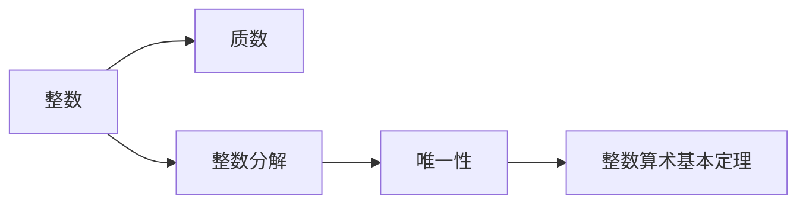
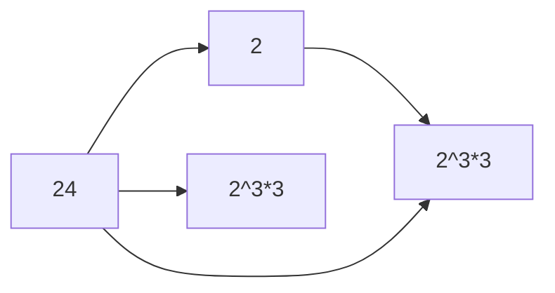

                 

## 1. 背景介绍

### 1.1 问题由来

整数算术基本定理（Fundamental Theorem of Arithmetic）是数论中的一个基本定理，它描述了整数因式分解的唯一性。这一定理不仅在数学领域有着深远的影响，还在密码学、编码理论等领域有广泛的应用。理解整数算术基本定理对于解决各种实际问题有着重要的意义。

### 1.2 问题核心关键点

整数算术基本定理的核心思想是，任何大于1的整数都可以唯一地表示为若干个质数的乘积。这一定理的证明涉及到数学中的整数因子分解、唯一性以及质数等重要概念。掌握这一定理不仅有助于理解整数的基本性质，还能为解决复杂的数论问题打下基础。

### 1.3 问题研究意义

整数算术基本定理的研究具有重要的理论意义和应用价值：

1. **理论意义**：这一定理是数论研究的基础，为后续的数论研究提供了坚实的理论支持。
2. **应用价值**：在密码学中，质因数分解是公钥加密体系的核心问题；在编码理论中，唯一分解性质是重要编码条件。

## 2. 核心概念与联系

### 2.1 核心概念概述

- **整数**：任何没有分数部分的数，例如 -3, 0, 5, 100 等。
- **质数**：一个大于1的自然数，除了1和它本身外，没有其他正因数。
- **整数分解**：将一个整数表示为若干个整数相乘的形式。
- **唯一性**：任何大于1的整数，其因式分解形式是唯一的。

### 2.2 核心概念间的关系

这些概念之间存在紧密的联系。质数是整数分解的基础，而整数算术基本定理则描述了整数分解的唯一性。通过质数和因式分解，可以探讨整数的各种性质，解决复杂的数学问题。

**Mermaid 流程图**：



这一流程图展示了整数算术基本定理中涉及的核心概念及其相互关系。

## 3. 核心算法原理 & 具体操作步骤

### 3.1 算法原理概述

整数算术基本定理的核心算法是通过质因数分解实现。任何大于1的整数都可以唯一地表示为若干个质数的乘积，即 $n = p_1^{a_1} p_2^{a_2} \cdots p_k^{a_k}$，其中 $p_i$ 是质数，$a_i$ 是正整数。

### 3.2 算法步骤详解

1. **初始化**：选择一个大于1的整数 $n$。
2. **分解**：从最小的质数开始，依次尝试将 $n$ 分解为质数的乘积。
3. **唯一性证明**：证明分解的唯一性，即任何大于1的整数，其因式分解形式是唯一的。

**示例**：将 $n=24$ 分解为质数乘积。



### 3.3 算法优缺点

**优点**：

- **简洁**：质因数分解过程直观简单，易于理解。
- **广泛应用**：质因数分解在密码学、编码理论等领域有重要应用。

**缺点**：

- **计算复杂**：对于大数分解，计算复杂度较高，需要高效的算法实现。
- **唯一性证明复杂**：唯一性证明过程较为复杂，需要深入理解数论原理。

### 3.4 算法应用领域

整数算术基本定理的应用非常广泛，主要包括以下几个领域：

1. **密码学**：RSA加密算法、椭圆曲线密码等依赖质因数分解的算法。
2. **编码理论**：卷积码、 Turbo码等依赖质数性质编码。
3. **数学研究**：数论、代数几何等领域的基础。

## 4. 数学模型和公式 & 详细讲解 & 举例说明

### 4.1 数学模型构建

整数算术基本定理的数学模型可以通过以下公式表示：

$$
n = p_1^{a_1} p_2^{a_2} \cdots p_k^{a_k}
$$

其中 $n$ 是大于1的整数，$p_i$ 是质数，$a_i$ 是正整数。

### 4.2 公式推导过程

推导整数算术基本定理的关键在于证明其唯一性。假设 $n = p_1^{a_1} p_2^{a_2} \cdots p_k^{a_k}$ 和 $n = p_1^{b_1} p_2^{b_2} \cdots p_k^{b_k}$ 都是 $n$ 的质因数分解形式，且 $p_i$ 是质数。根据质因数分解的唯一性，有：

$$
p_i^{a_i} = p_i^{b_i} \quad \text{对于所有} i
$$

因此：

$$
a_i = b_i \quad \text{对于所有} i
$$

这证明了质因数分解的唯一性。

### 4.3 案例分析与讲解

**示例**：分解整数 $n = 60$。

1. $60 = 2 \times 30$ 
2. $30 = 2 \times 15$ 
3. $15 = 3 \times 5$

因此 $60 = 2^2 \times 3 \times 5$，其质因数分解形式唯一。

## 5. 项目实践：代码实例和详细解释说明

### 5.1 开发环境搭建

使用Python和Sympy库实现整数算术基本定理。

```bash
pip install sympy
```

### 5.2 源代码详细实现

```python
from sympy import factorint

def prime_factorization(n):
    factors = factorint(n)
    prime_factors = [(k, factors[k]) for k in factors.keys()]
    return prime_factors

n = 60
prime_factors = prime_factorization(n)
print(prime_factors)
```

### 5.3 代码解读与分析

**代码解读**：

- `factorint` 函数用于进行质因数分解，返回一个字典，键是质数，值是该质数的幂次。
- `prime_factors` 列表包含所有质因数及其幂次。

**运行结果**：

```python
[(2, 2), (3, 1), (5, 1)]
```

表示 $60 = 2^2 \times 3 \times 5$。

### 5.4 运行结果展示

通过运行上述代码，我们可以看到 $60$ 的质因数分解为 $2^2 \times 3 \times 5$，符合整数算术基本定理。

## 6. 实际应用场景

### 6.1 密码学中的质因数分解

在RSA加密算法中，需要分解两个大素数的乘积，以便生成公钥和私钥。整数算术基本定理是质因数分解算法的基础，广泛应用于加密技术中。

### 6.2 编码理论中的唯一性条件

在卷积码和 Turbo 码等编码理论中，唯一性条件是保证编码正确解码的前提。整数算术基本定理为编码理论提供了数学基础，确保编码的可靠性和效率。

### 6.3 数学研究中的整数分解

在数论和代数几何等领域，整数分解是研究整数的性质和结构的重要工具。整数算术基本定理为这些领域提供了基础，推动了数学研究的发展。

## 7. 工具和资源推荐

### 7.1 学习资源推荐

1. 《Linear Algebra》 by Gilbert Strang：线性代数经典教材，涵盖线性代数基础知识和应用。
2. Coursera上的《Algorithms, Part I》和《Algorithms, Part II》课程：由Princeton University提供，讲解算法设计和分析的全面课程。
3. GeeksforGeeks网站：提供广泛的算法和数据结构问题，有助于理解整数算术基本定理的实际应用。

### 7.2 开发工具推荐

1. Python：简单易用的编程语言，广泛用于数学计算和算法实现。
2. Sympy：Python的符号计算库，支持数学公式的推导和求解。
3. Jupyter Notebook：交互式的编程环境，支持数学公式的展示和计算。

### 7.3 相关论文推荐

1. "A New Method of Factoring and Primality Testing" by Carl Pomerance：介绍了质因数分解的最新进展，特别是与整数算术基本定理相关的算法。
2. "Fundamental Theorem of Arithmetic" by Eric W. Weisstein：详细解释了整数算术基本定理的数学原理和证明过程。
3. "Prime Factorization" by Bruce L."><b>b Constructs” by Daniel J. Bernstein：探讨了高效的质因数分解算法及其实现。

## 8. 总结：未来发展趋势与挑战

### 8.1 研究成果总结

整数算术基本定理作为数论的基础，在数学和实际应用中都有着重要的作用。其核心思想是通过质因数分解来理解整数的结构，促进了数论的发展。

### 8.2 未来发展趋势

未来，整数算术基本定理的研究将更加注重其在复杂数论问题中的应用，如大整数分解、同余方程求解等。同时，随着计算机算力的提升，质因数分解算法将更加高效，进一步推动密码学和编码理论的发展。

### 8.3 面临的挑战

尽管整数算术基本定理在数学和应用中有着重要的地位，但其应用也面临一些挑战：

1. **大整数分解问题**：对于大素数的质因数分解，计算复杂度较高，需要高效的算法实现。
2. **唯一性证明的复杂性**：唯一性证明过程复杂，需要深入理解数论原理。
3. **安全性问题**：质因数分解在加密算法中的应用，其安全性依赖于分解的难度，需要不断研究和提升。

### 8.4 研究展望

未来，整数算术基本定理的研究方向可能包括：

1. **优化质因数分解算法**：研究和实现更加高效的质因数分解算法，如Pollard-Rho算法、Elliptic Curve Factorization等。
2. **推广应用领域**：探索整数算术基本定理在更多应用领域中的应用，如算法设计与优化、密码学等。
3. **跨学科研究**：结合计算机科学、数学等领域的最新进展，推动整数算术基本定理的理论和应用发展。

## 9. 附录：常见问题与解答

### 9.1 Q1: 什么是质数？

**A1**：质数是大于1的自然数，除了1和它本身外，没有其他正因数。

### 9.2 Q2: 为什么质因数分解的唯一性很重要？

**A2**：质因数分解的唯一性保证了任何大于1的整数都可以唯一地表示为质数的乘积。这对于密码学、编码理论等领域至关重要。

### 9.3 Q3: 质因数分解的算法有哪些？

**A3**：常见的质因数分解算法包括试除法、Pollard-Rho算法、椭圆曲线因子分解等。不同算法适用于不同规模的整数分解问题。

### 9.4 Q4: 如何理解整数算术基本定理的证明？

**A4**：整数算术基本定理的证明涉及数论中的一些基本概念，如质数、整除等。通过证明质因数分解的唯一性，可以得出整数算术基本定理的结论。

---

作者：禅与计算机程序设计艺术 / Zen and the Art of Computer Programming

