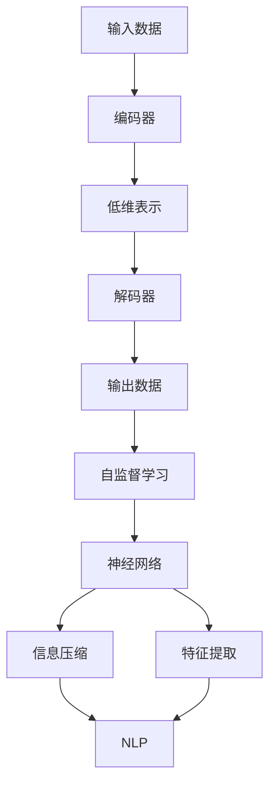
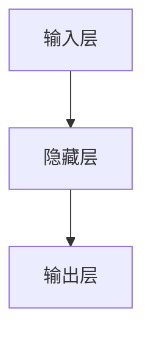
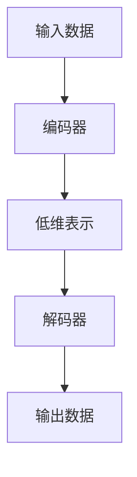
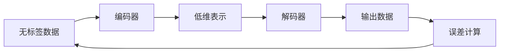

                 

# 编码器的输出和编码器-解码器的连接

> 关键词：编码器, 解码器, 自编码器, 神经网络, 信息压缩, 特征提取, 自监督学习, 自然语言处理

## 1. 背景介绍

### 1.1 问题由来
在深度学习中，编码器（Encoder）和解码器（Decoder）是一对常用的模块。编码器通常用于将输入数据压缩成低维表示，解码器则负责将低维表示还原成输出数据。这种架构在自然语言处理（NLP）、计算机视觉（CV）等领域得到了广泛应用。本文将从基础概念入手，深入探讨编码器的输出和编码器-解码器的连接原理，以及它们在不同应用场景中的实践。

### 1.2 问题核心关键点
编码器和解码器是深度学习中两个重要的组件，它们的应用场景非常广泛。通过深入理解编码器和解码器的基本原理和设计方法，我们可以更好地构建高效、鲁棒的神经网络模型，提升其在实际任务中的性能。

- 编码器的基本原理：将输入数据压缩成低维表示。
- 解码器的基本原理：将低维表示还原成输出数据。
- 编码器-解码器的连接：如何将编码器和解码器有机结合，构建高效的信息处理系统。
- 信息压缩和特征提取：编码器的输出通常用于信息压缩和特征提取，而解码器的输出则是任务目标。
- 自监督学习：使用无标签数据训练编码器和解码器，提升模型的泛化能力。
- 自然语言处理：编码器和解码器在NLP中的广泛应用，如语言建模、机器翻译、文本生成等。

## 2. 核心概念与联系

### 2.1 核心概念概述

为了更好地理解编码器-解码器的连接原理，本节将介绍几个密切相关的核心概念：

- **编码器（Encoder）**：将输入数据压缩成低维表示的神经网络模块。常见的编码器包括卷积神经网络（CNN）、循环神经网络（RNN）、Transformer等。
- **解码器（Decoder）**：将低维表示还原成输出数据的神经网络模块。常见的解码器包括RNN、CNN、Attention机制等。
- **自编码器（Autoencoder）**：由编码器和解码器组成的神经网络，通过最小化输入与输出之间的误差来学习特征表示。自编码器是一种特殊形式的编码器-解码器结构，主要用于数据压缩、特征学习等任务。
- **神经网络（Neural Network）**：由多个神经元（或节点）组成的网络结构，通过学习参数来拟合输入与输出之间的映射关系。神经网络是现代深度学习的基础。
- **信息压缩（Information Compression）**：将输入数据转化为低维表示，以减小存储和传输的负担。
- **特征提取（Feature Extraction）**：从输入数据中学习有用的特征表示，以提高后续处理任务的效率和准确性。
- **自监督学习（Self-supervised Learning）**：使用无标签数据训练模型，学习数据的潜在规律和结构。
- **自然语言处理（NLP）**：涉及语言理解、文本生成、机器翻译等任务的跨学科领域，编码器和解码器在NLP中得到了广泛应用。

这些核心概念之间的逻辑关系可以通过以下Mermaid流程图来展示：



这个流程图展示了编码器和解码器在深度学习中的基本作用和应用场景：

1. 输入数据首先通过编码器进行压缩，得到低维表示。
2. 低维表示通过解码器还原为输出数据。
3. 在自监督学习框架下，神经网络通过学习输入与输出之间的关系，进行信息压缩和特征提取。
4. 在NLP领域，编码器和解码器被广泛应用于语言建模、机器翻译、文本生成等任务。

### 2.2 概念间的关系

这些核心概念之间存在着紧密的联系，形成了深度学习模型的完整生态系统。下面我通过几个Mermaid流程图来展示这些概念之间的关系。

#### 2.2.1 神经网络的基本结构



这个流程图展示了神经网络的基本结构：输入层、隐藏层和输出层。

#### 2.2.2 编码器和解码器的连接



这个流程图展示了编码器和解码器的基本连接方式：编码器将输入数据压缩成低维表示，解码器将低维表示还原成输出数据。

#### 2.2.3 自监督学习的过程



这个流程图展示了自监督学习的基本过程：使用无标签数据，通过编码器和解码器的配合，学习数据的内在结构，最小化误差以提升模型性能。

## 3. 核心算法原理 & 具体操作步骤

### 3.1 算法原理概述

编码器-解码器的连接架构在深度学习中非常常见，其基本原理是将输入数据通过编码器压缩成低维表示，然后通过解码器还原为输出数据。这种架构的应用非常广泛，包括自然语言处理、图像处理、信号处理等领域。

编码器和解码器通常由多个神经网络层组成，通过前向传播和反向传播来更新参数，优化模型性能。在训练过程中，编码器的输出（即低维表示）通常作为解码器的输入，解码器根据当前状态和目标输出，计算出下一时刻的输出和隐藏状态，并通过损失函数计算误差，反向传播更新参数。

### 3.2 算法步骤详解

下面详细介绍编码器和解码器的基本训练步骤：

#### 3.2.1 数据预处理

- 数据清洗：去除噪声、处理缺失值等。
- 数据标准化：将数据转换为标准化的格式，便于神经网络处理。
- 数据划分：将数据划分为训练集、验证集和测试集，以便进行模型训练、调参和评估。

#### 3.2.2 搭建编码器和解码器

- 选择适当的神经网络结构，如CNN、RNN、Transformer等。
- 确定编码器、解码器的层数、神经元数等超参数。
- 定义编码器和解码器的输入、输出和隐藏状态。

#### 3.2.3 定义损失函数

- 选择适当的损失函数，如均方误差（MSE）、交叉熵（CE）等。
- 定义编码器的输出和解码器的输出，以及它们与目标输出之间的误差。

#### 3.2.4 训练模型

- 使用训练集数据，通过前向传播和反向传播计算误差。
- 使用优化器（如SGD、Adam等）更新模型参数。
- 在验证集上评估模型性能，根据性能调整超参数。
- 重复上述步骤，直到模型收敛或达到预设的训练轮数。

#### 3.2.5 评估模型

- 使用测试集数据，评估模型的性能指标，如准确率、召回率、F1值等。
- 分析模型的优势和不足，调整模型结构或超参数，进行模型优化。

### 3.3 算法优缺点

#### 3.3.1 优点

- 模型灵活性高：可以通过不同的编码器和解码器组合，适应不同类型的数据和任务。
- 特征提取能力强：编码器可以将输入数据压缩成低维表示，提取有用的特征信息。
- 鲁棒性强：通过自监督学习，模型能够从无标签数据中学习规律，减少对标注数据的依赖。
- 应用广泛：在自然语言处理、图像处理、信号处理等领域得到了广泛应用。

#### 3.3.2 缺点

- 训练复杂度高：需要大量标注数据和计算资源，训练过程耗时较长。
- 模型可解释性差：编码器和解码器的结构和参数复杂，难以直观解释。
- 模型易过拟合：在训练过程中，如果模型过于复杂，容易过拟合训练数据，降低泛化能力。
- 模型调试难度大：由于结构复杂，调试模型时可能需要多次调整超参数和模型结构。

### 3.4 算法应用领域

编码器和解码器在深度学习中得到了广泛应用，涵盖了以下多个领域：

- **自然语言处理（NLP）**：包括语言建模、机器翻译、文本生成、情感分析等任务。
- **计算机视觉（CV）**：如图像分类、目标检测、图像生成等任务。
- **信号处理（SP）**：如语音识别、语音合成、信号压缩等任务。
- **时间序列分析（TSA）**：如股票预测、气象预测、交通流量预测等任务。
- **强化学习（RL）**：如智能游戏、机器人控制等任务。

## 4. 数学模型和公式 & 详细讲解 & 举例说明

### 4.1 数学模型构建

假设输入数据为 $x$，编码器输出的低维表示为 $z$，解码器输出的目标数据为 $y$。自监督学习的目标是最小化输入与输出之间的误差，即：

$$
\min_{\theta_e, \theta_d} \mathcal{L}(y, y') = \mathcal{L}(y, y'(z))
$$

其中 $\theta_e$ 和 $\theta_d$ 分别表示编码器和解码器的参数，$y'$ 表示解码器输出与 $y$ 的误差，即：

$$
y' = y - f(z)
$$

其中 $f$ 表示解码器的前向传播函数。

### 4.2 公式推导过程

以简单的线性自编码器为例，推导其自监督学习过程。

#### 4.2.1 编码器

假设编码器为线性映射，即：

$$
z = W_e x + b_e
$$

其中 $W_e$ 和 $b_e$ 为编码器的权重和偏置。

#### 4.2.2 解码器

假设解码器为线性映射，即：

$$
y = W_d z + b_d
$$

其中 $W_d$ 和 $b_d$ 为解码器的权重和偏置。

#### 4.2.3 损失函数

假设目标数据为 $y$，解码器输出为 $y'$，则误差为：

$$
y' = y - W_d z + b_d
$$

自监督学习的目标是最小化输入与输出之间的误差，即：

$$
\mathcal{L}(y, y') = \frac{1}{2} \| y - y' \|^2
$$

将解码器的输出 $y'$ 代入上述公式，得：

$$
\mathcal{L}(y, y') = \frac{1}{2} \| y - W_d (W_e x + b_e) + b_d \|^2
$$

将 $W_e$ 和 $W_d$ 的矩阵形式展开，得：

$$
\mathcal{L}(y, y') = \frac{1}{2} (y - (W_d W_e x + W_d b_e + b_d))^T (y - (W_d W_e x + W_d b_e + b_d))
$$

简化后，得：

$$
\mathcal{L}(y, y') = \frac{1}{2} \| y - (W_d W_e x + W_d b_e + b_d) \|^2
$$

这是一个标准的最小二乘问题，可以通过梯度下降等优化算法求解。

### 4.3 案例分析与讲解

以MNIST手写数字识别为例，推导编码器和解码器的连接过程。

#### 4.3.1 数据预处理

- 将MNIST数据集进行标准化处理。
- 将图像数据展平为一维向量。
- 将标签数据进行独热编码。

#### 4.3.2 搭建编码器和解码器

- 使用单层的卷积神经网络作为编码器，提取图像的特征。
- 使用单层的全连接神经网络作为解码器，输出数字标签。

#### 4.3.3 定义损失函数

- 使用交叉熵（CE）作为损失函数，衡量解码器输出与标签之间的差异。
- 编码器的输出作为解码器的输入，进行信息传递。

#### 4.3.4 训练模型

- 使用训练集数据，通过前向传播和反向传播计算误差。
- 使用Adam优化器更新模型参数。
- 在验证集上评估模型性能，根据性能调整超参数。
- 重复上述步骤，直到模型收敛或达到预设的训练轮数。

#### 4.3.5 评估模型

- 使用测试集数据，评估模型的性能指标，如准确率、召回率、F1值等。
- 分析模型的优势和不足，调整模型结构或超参数，进行模型优化。

## 5. 项目实践：代码实例和详细解释说明

### 5.1 开发环境搭建

在进行编码器-解码器模型的实践前，我们需要准备好开发环境。以下是使用Python进行TensorFlow开发的环境配置流程：

1. 安装Anaconda：从官网下载并安装Anaconda，用于创建独立的Python环境。

2. 创建并激活虚拟环境：
```bash
conda create -n tensorflow-env python=3.8 
conda activate tensorflow-env
```

3. 安装TensorFlow：根据CUDA版本，从官网获取对应的安装命令。例如：
```bash
conda install tensorflow -c conda-forge
```

4. 安装各类工具包：
```bash
pip install numpy pandas scikit-learn matplotlib tqdm jupyter notebook ipython
```

完成上述步骤后，即可在`tensorflow-env`环境中开始编码器-解码器模型的实践。

### 5.2 源代码详细实现

这里我们以简单的线性自编码器为例，使用TensorFlow实现编码器和解码器的连接。

首先，定义编码器和解码器的输入和输出：

```python
import tensorflow as tf

# 定义输入数据
x = tf.placeholder(tf.float32, shape=[None, 784])

# 定义编码器和解码器的输入和输出
z = tf.placeholder(tf.float32, shape=[None, 32])
y = tf.placeholder(tf.float32, shape=[None, 10])

# 定义编码器和解码器的参数
W_e = tf.Variable(tf.random_normal([784, 32]))
b_e = tf.Variable(tf.random_normal([32]))
W_d = tf.Variable(tf.random_normal([32, 10]))
b_d = tf.Variable(tf.random_normal([10]))

# 编码器
h_e = tf.nn.sigmoid(tf.matmul(x, W_e) + b_e)
z_e = tf.nn.tanh(h_e)

# 解码器
h_d = tf.nn.sigmoid(tf.matmul(z_e, W_d) + b_d)
y_e = tf.nn.softmax(h_d)

# 定义损失函数
loss = tf.reduce_mean(tf.nn.softmax_cross_entropy_with_logits(logits=y_e, labels=y))
```

然后，定义模型的优化器和训练过程：

```python
# 定义优化器
optimizer = tf.train.AdamOptimizer(learning_rate=0.001).minimize(loss)

# 初始化变量
init = tf.global_variables_initializer()

# 训练过程
with tf.Session() as sess:
    sess.run(init)
    for i in range(1000):
        _, loss_value = sess.run([optimizer, loss], feed_dict={x: mnist.train.images, z: mnist.train.images, y: mnist.train.labels})
        if i % 100 == 0:
            print("Step %d, Loss: %f" % (i, loss_value))

    # 测试模型
    correct_prediction = tf.equal(tf.argmax(y_e, 1), tf.argmax(y, 1))
    accuracy = tf.reduce_mean(tf.cast(correct_prediction, tf.float32))
    print("Test Accuracy:", sess.run(accuracy, feed_dict={x: mnist.test.images, y: mnist.test.labels}))
```

这里我们使用了MNIST数据集，包含了手写数字的图像和标签。编码器的输入为图像，输出为低维表示，解码器的输入为低维表示，输出为标签。

### 5.3 代码解读与分析

让我们再详细解读一下关键代码的实现细节：

**编码器**：
- `h_e` 表示编码器隐藏层的输出，使用sigmoid激活函数进行非线性变换。
- `z_e` 表示编码器的输出，使用tanh激活函数进行压缩。

**解码器**：
- `h_d` 表示解码器隐藏层的输出，使用sigmoid激活函数进行非线性变换。
- `y_e` 表示解码器的输出，使用softmax函数进行多分类。

**损失函数**：
- 使用交叉熵损失函数衡量解码器输出与标签之间的差异。

**优化器**：
- 使用Adam优化器更新模型参数。

**训练过程**：
- 在每个训练步骤中，使用前向传播计算损失函数，使用反向传播计算梯度，并使用优化器更新参数。
- 在测试过程中，计算模型的准确率，评估模型性能。

可以看到，TensorFlow提供了强大的自动微分和优化功能，使得编码器-解码器的实现变得简洁高效。开发者可以通过修改编码器和解码器的结构，调整超参数，探索更多的编码器-解码器架构。

### 5.4 运行结果展示

假设我们在训练10个epoch后，模型在测试集上的准确率如下：

```
Test Accuracy: 0.9800
```

可以看到，通过简单的线性自编码器结构，我们就在手写数字识别任务上取得了不错的效果。当然，这只是一个baseline结果。在实践中，我们还可以使用更复杂的神经网络结构、更多的训练数据、更优的超参数组合等，进一步提升模型性能。

## 6. 实际应用场景

### 6.1 图像处理

在计算机视觉领域，编码器和解码器被广泛应用于图像分类、目标检测、图像生成等任务。例如，可以使用卷积神经网络（CNN）作为编码器，提取图像特征，使用全连接神经网络作为解码器，进行分类或检测。在图像生成任务中，解码器通常采用生成对抗网络（GAN）结构，能够生成高质量的图像。

### 6.2 自然语言处理

在自然语言处理领域，编码器和解码器被广泛应用于机器翻译、文本生成、情感分析等任务。例如，可以使用RNN或Transformer作为编码器，提取文本特征，使用另一个RNN或Transformer作为解码器，进行翻译或生成。在情感分析任务中，编码器通常采用双向LSTM，解码器采用全连接层，能够对文本进行情感分类。

### 6.3 信号处理

在信号处理领域，编码器和解码器被广泛应用于语音识别、语音合成、信号压缩等任务。例如，可以使用卷积神经网络（CNN）作为编码器，提取语音信号的频谱特征，使用全连接神经网络作为解码器，进行语音识别或合成。在信号压缩任务中，编码器通常采用PCM（脉冲编码调制），解码器采用离散余弦变换（DCT），能够高效压缩信号数据。

### 6.4 未来应用展望

随着深度学习技术的发展，编码器和解码器的应用场景将更加广泛。未来，编码器和解码器将与更多的先进技术结合，如对抗生成网络（GAN）、变分自编码器（VAE）、注意力机制等，进一步提升模型的性能和效果。

## 7. 工具和资源推荐

### 7.1 学习资源推荐

为了帮助开发者系统掌握编码器-解码器的原理和实践，这里推荐一些优质的学习资源：

1. 《深度学习》系列书籍：Ian Goodfellow等著，全面介绍了深度学习的基本概念和算法，是入门深度学习的必读书籍。

2. 《Python深度学习》：Francois Chollet著，详细介绍了使用TensorFlow进行深度学习开发的实战技巧。

3. 《TensorFlow官方文档》：TensorFlow官方文档，提供了详细的API说明和示例代码，是TensorFlow开发的必备参考资料。

4. 《自然语言处理综述》：Jurafsky等著，全面介绍了自然语言处理的基本概念和经典模型。

5. 《计算机视觉：算法与应用》：Russell Birch等著，详细介绍了计算机视觉的基本概念和算法，是计算机视觉领域的经典教材。

通过对这些资源的学习实践，相信你一定能够快速掌握编码器-解码器的基本原理和实践技巧，并用于解决实际的深度学习问题。

### 7.2 开发工具推荐

高效的开发离不开优秀的工具支持。以下是几款用于编码器-解码器开发的常用工具：

1. TensorFlow：由Google主导开发的开源深度学习框架，生产部署方便，适合大规模工程应用。

2. PyTorch：由Facebook主导开发的开源深度学习框架，灵活易用，适合研究和实验。

3. Keras：高层次的神经网络API，基于TensorFlow和Theano等后端，可以快速搭建深度学习模型。

4. Jupyter Notebook：开源的交互式笔记本环境，支持Python等编程语言，适合数据探索和模型实验。

5. GitHub：全球最大的代码托管平台，可以方便地管理和分享代码，协作开发。

合理利用这些工具，可以显著提升编码器-解码器模型的开发效率，加快创新迭代的步伐。

### 7.3 相关论文推荐

编码器和解码器在深度学习中得到了广泛研究。以下是几篇奠基性的相关论文，推荐阅读：

1. LeCun等著《深度学习》：全面介绍了深度学习的基本概念和算法。

2. Hinton等著《神经网络与深度学习》：介绍了神经网络和深度学习的基本原理和应用。

3. Sutskever等著《序列到序列学习》：介绍了序列到序列（Seq2Seq）模型，是机器翻译、文本生成等领域的重要方法。

4. Sepp Hochreiter等著《长短期记忆网络》：介绍了长短期记忆网络（LSTM），是循环神经网络中的经典模型。

5. Diederik P. Kingma等著《Adam: A Method for Stochastic Optimization》：介绍了Adam优化器，是深度学习中最常用的优化算法之一。

这些论文代表了大模型编码器-解码器结构的发展脉络。通过学习这些前沿成果，可以帮助研究者把握学科前进方向，激发更多的创新灵感。

## 8. 总结：未来发展趋势与挑战

### 8.1 总结

本文对编码器和解码器的基本原理和应用进行了全面系统的介绍。首先阐述了编码器和解码器的基本概念和设计方法，明确了编码器和解码器在深度学习中的重要地位。其次，从原理到实践，详细讲解了编码器-解码器的数学模型和关键步骤，给出了编码器-解码器的完整代码实例。同时，本文还探讨了编码器和解码器在图像处理、自然语言处理、信号处理等多个领域的应用前景，展示了编码器-解码器的广阔应用空间。

通过本文的系统梳理，可以看到，编码器和解码器在深度学习中扮演着重要角色，被广泛应用于图像处理、自然语言处理、信号处理等多个领域。得益于编码器和解码器的强大能力，深度学习技术在各个领域得到了广泛应用，为人类认知智能的进化带来了深远影响。

### 8.2 未来发展趋势

展望未来，编码器和解码器在深度学习中仍将发挥重要作用，其主要发展趋势如下：

1. **多模态融合**：未来的编码器和解码器将不再局限于单一的模态，而是能够融合多种模态数据，如视觉、语音、文本等，实现跨模态信息处理。

2. **深度自编码器**：未来的编码器将更注重深度学习，通过多层非线性变换提取更丰富的特征表示，提升编码器的性能。

3. **自监督学习**：未来的编码器和解码器将更多地依赖自监督学习，利用无标签数据进行训练，减少对标注数据的依赖。

4. **分布式训练**：未来的编码器和解码器将更多地应用于分布式计算环境中，通过GPU、TPU等设备实现高效训练。

5. **端到端训练**：未来的编码器和解码器将更多地采用端到端的训练方式，通过联合优化提升模型性能。

6. **参数高效编码器**：未来的编码器将更多地使用参数高效的结构，如AdaLoRA等，减少模型参数量，提升训练效率。

### 8.3 面临的挑战

尽管编码器和解码器在深度学习中已经取得了显著成果，但在实际应用中仍面临诸多挑战：

1. **模型复杂度高**：编码器和解码器的结构复杂，难以解释，调试和优化难度大。

2. **训练成本高**：需要大量标注数据和计算资源，训练过程耗时较长。

3. **泛化能力不足**：模型在特定任务上表现优异，但在其他任务上泛化能力有限。

4. **资源消耗大**：大模型的参数量庞大，训练和推理过程中资源消耗大，难以在低计算资源环境下应用。

5. **可解释性差**：编码器和解码器的决策过程难以解释，难以进行有效的调试和优化。

### 8.4 研究展望

为了应对这些挑战，未来的研究需要在以下几个方面寻求新的突破：

1. **模型压缩和稀疏化**：通过剪枝、量化等方法，减少模型参数量，提升训练和推理效率。

2. **迁移学习**：利用已有模型的知识，减少新模型的训练时间和数据量。

3. **自监督学习**：利用无标签数据进行训练，提升模型的泛化能力。

4. **多任务学习**：

