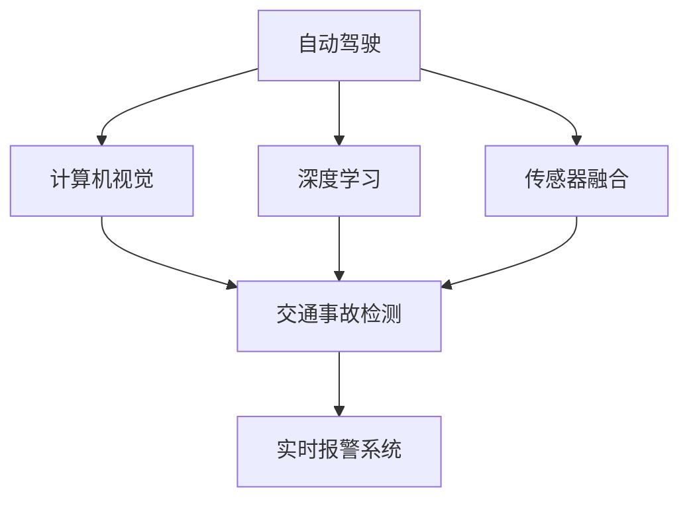
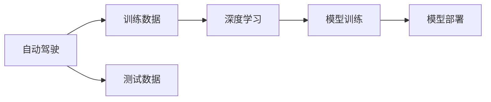
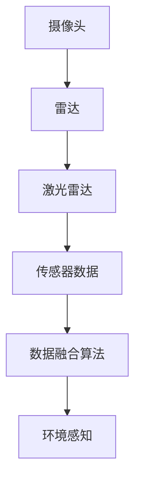
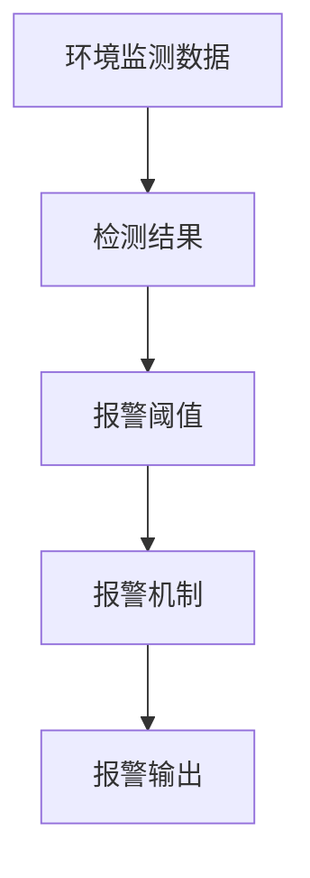
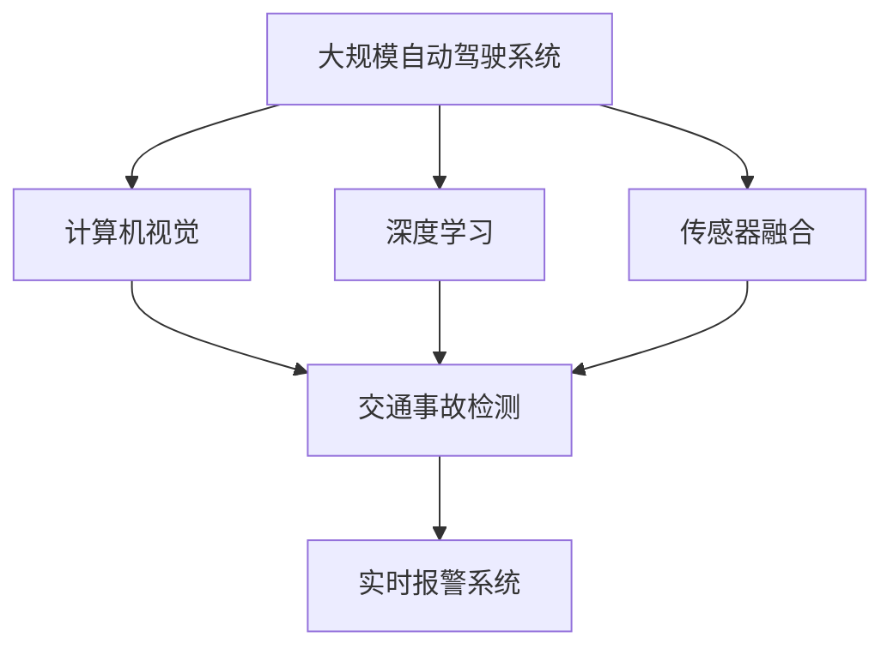

                 

# 自动驾驶中的交通事故自动检测与报警

> 关键词：自动驾驶,交通事故检测,深度学习,计算机视觉,传感器融合,实时报警系统,多模态数据融合,数据融合算法

## 1. 背景介绍

随着自动驾驶技术的快速发展，确保交通安全成为该领域的首要任务。交通事故自动检测与报警系统作为自动驾驶的核心组件之一，其目的是实时监测行车环境，检测潜在的安全隐患，并通过精确的报警机制，及时通知驾驶员或相关人员，避免交通事故的发生。在自动驾驶技术日趋成熟的过程中，如何高效、准确地实现交通事故自动检测与报警，成为了自动驾驶领域的重要研究方向。

### 1.1 问题由来

自动驾驶系统需要依赖多传感器融合技术，包括摄像头、雷达、激光雷达等，获取车辆周围的环境信息，并通过深度学习、计算机视觉等技术进行分析。尽管已有许多研究机构和企业在这方面进行了大量工作，但交通事故自动检测与报警系统的实际应用效果仍不尽如人意。主要原因在于：

- 传感器数据的实时性和准确性不足：不同传感器在性能和覆盖范围上存在差异，单靠单一传感器难以获得全面的环境信息。
- 深度学习模型的鲁棒性问题：由于训练数据的不足和模型复杂度较高，深度学习模型在面对复杂环境时容易出现误检或漏检。
- 实时报警系统的不成熟：如何根据检测结果，快速、准确地发出报警，是报警系统设计中的关键难题。
- 数据隐私和安全问题：在自动驾驶中，车辆行驶数据涉及个人隐私，如何保护这些数据，防止数据泄露，也是一大挑战。

### 1.2 问题核心关键点

自动驾驶中的交通事故自动检测与报警系统，主要包括两个关键组成部分：

- 交通事故的自动检测：利用计算机视觉、深度学习技术，实时监测车辆周围环境，检测潜在的交通事故风险。
- 实时报警系统的设计：根据检测结果，快速、准确地发出报警，提醒驾驶员或相关人员采取措施，避免事故发生。

这两个关键组成部分的正确设计和实现，是确保自动驾驶系统安全性的重要保障。

### 1.3 问题研究意义

研究自动驾驶中的交通事故自动检测与报警系统，对于提升自动驾驶技术的安全性和可靠性，推动自动驾驶技术的产业化进程，具有重要意义：

- 降低事故发生率：通过高效、准确的交通事故自动检测与报警，减少交通事故的发生，保障行人及车辆安全。
- 提升自动驾驶系统的智能化水平：利用先进的计算机视觉和深度学习技术，提升自动驾驶系统的环境感知能力和决策准确性。
- 加速产业化进程：在实际应用中，交通事故自动检测与报警系统可以为自动驾驶车辆提供关键的安全保障，推动自动驾驶技术的落地应用。
- 提高用户体验：通过及时、准确的报警，增强用户对自动驾驶技术的信任，提升用户体验。
- 促进法律和规范的制定：交通事故自动检测与报警系统的成功应用，可以为制定相关法律法规和规范提供数据支持和技术参考。

## 2. 核心概念与联系

### 2.1 核心概念概述

为更好地理解自动驾驶中的交通事故自动检测与报警系统，本节将介绍几个密切相关的核心概念：

- 自动驾驶：指通过计算机视觉、深度学习、计算机控制等技术，使车辆能够自动导航、加速、刹车、避障等功能，实现自主驾驶。
- 计算机视觉：指利用计算机技术，对图像、视频等视觉信号进行识别、分析、理解和处理的过程。
- 深度学习：一种机器学习技术，通过构建多层神经网络，学习数据的复杂表示，从而实现高级智能任务。
- 传感器融合：指利用多个传感器，融合其采集的信息，以获得更全面、准确的环境数据。
- 实时报警系统：指根据环境监测数据，快速、准确地发出报警，提醒驾驶员或相关人员采取措施的系统。

这些核心概念之间的逻辑关系可以通过以下Mermaid流程图来展示：



这个流程图展示了几类核心概念的关系：

1. 自动驾驶系统依赖于计算机视觉、深度学习和传感器融合技术，获取环境信息。
2. 通过计算机视觉和深度学习技术，自动检测交通事故风险。
3. 根据检测结果，实时报警系统发出报警，提醒驾驶员或相关人员采取措施。

### 2.2 概念间的关系

这些核心概念之间存在着紧密的联系，形成了自动驾驶系统中交通事故自动检测与报警系统的完整生态系统。

#### 2.2.1 自动驾驶系统的学习范式



这个流程图展示了自动驾驶系统从数据获取、模型训练到模型部署的全过程。

#### 2.2.2 传感器融合的应用



这个流程图展示了传感器融合技术的应用场景。摄像头、雷达、激光雷达等传感器获取的数据通过数据融合算法进行融合，形成全面的环境感知数据。

#### 2.2.3 实时报警系统的设计与实现



这个流程图展示了实时报警系统的设计与实现。环境监测数据经过检测后，根据设定的报警阈值，触发报警机制，发出报警。

### 2.3 核心概念的整体架构

最后，我们用一个综合的流程图来展示这些核心概念在大规模自动驾驶系统中的应用：



这个综合流程图展示了从预训练到微调，再到持续学习的完整过程。自动驾驶系统首先利用计算机视觉和深度学习技术进行环境感知，然后通过传感器融合技术获取全面的环境数据，再通过交通事故自动检测技术进行风险评估，最后根据检测结果，实时报警系统发出报警。

## 3. 核心算法原理 & 具体操作步骤
### 3.1 算法原理概述

自动驾驶中的交通事故自动检测与报警系统，本质上是一个复杂的多传感器数据融合和深度学习模型训练的过程。其核心思想是：

- 利用多个传感器获取车辆周围的环境信息，并通过数据融合技术，获得全面的环境数据。
- 使用深度学习模型，对融合后的环境数据进行学习，检测潜在的交通事故风险。
- 设计实时报警系统，根据检测结果，快速、准确地发出报警，提醒驾驶员或相关人员采取措施。

### 3.2 算法步骤详解

基于深度学习和传感器融合技术的自动驾驶中的交通事故自动检测与报警系统，一般包括以下几个关键步骤：

**Step 1: 传感器数据采集与预处理**

- 部署多个传感器（摄像头、雷达、激光雷达等），采集车辆周围的环境信息。
- 对传感器数据进行预处理，包括去噪、校正、滤波等，确保数据的准确性和实时性。
- 将处理后的传感器数据进行融合，形成全面的环境感知数据。

**Step 2: 深度学习模型的训练**

- 使用大规模标注数据对深度学习模型进行训练，学习环境数据与交通事故风险之间的映射关系。
- 在训练过程中，应用正则化技术（如L2正则、Dropout等），防止模型过拟合。
- 设计合适的损失函数，评估模型的性能。

**Step 3: 交通事故的自动检测**

- 使用训练好的深度学习模型，对融合后的环境感知数据进行检测，判断是否存在交通事故风险。
- 根据检测结果，实时更新环境数据和模型参数，提高检测的准确性和鲁棒性。

**Step 4: 实时报警系统的设计**

- 根据检测结果，设计合适的报警阈值，判断是否发出报警。
- 利用报警系统发出视觉、听觉等多种形式的报警，提醒驾驶员或相关人员采取措施。

**Step 5: 系统评估与优化**

- 在实际应用中，持续收集新的数据，重新训练模型，优化报警系统的设计，提升系统性能。
- 通过定期评估和测试，确保系统的稳定性和可靠性。

### 3.3 算法优缺点

基于深度学习和传感器融合技术的自动驾驶中的交通事故自动检测与报警系统，具有以下优点：

- 高效实时：传感器数据采集与预处理、深度学习模型的训练、交通事故的自动检测和实时报警系统的设计，均可实时进行，保障系统的高效性。
- 准确可靠：通过数据融合和深度学习技术，可以准确检测潜在的交通事故风险，避免漏检和误检。
- 灵活可扩展：系统设计可灵活调整传感器配置、深度学习模型结构和报警系统参数，适应不同场景需求。

同时，该方法也存在一定的局限性：

- 高昂的硬件成本：传感器、计算设备等硬件设施的高成本，使得该系统在实际应用中面临一定的经济压力。
- 复杂的算法实现：传感器数据融合、深度学习模型训练、报警系统设计等算法实现较为复杂，需要较高的技术门槛。
- 数据隐私和安全问题：传感器采集的数据涉及个人隐私，如何保护这些数据，防止数据泄露，是一大挑战。

尽管存在这些局限性，但就目前而言，基于深度学习和传感器融合技术的自动驾驶中的交通事故自动检测与报警系统，仍是大规模自动驾驶系统的重要组成部分，具有广泛的应用前景。

### 3.4 算法应用领域

基于深度学习和传感器融合技术的自动驾驶中的交通事故自动检测与报警系统，在自动驾驶领域具有广泛的应用，具体如下：

- 自动驾驶车辆：通过传感器数据融合和深度学习技术，实时监测车辆周围环境，检测潜在的交通事故风险，并通过实时报警系统发出报警，保障行人和车辆安全。
- 智能交通系统：通过传感器数据融合和深度学习技术，监测交通流量、车辆行为等信息，预测交通状况，优化交通管理，减少交通事故的发生。
- 自动驾驶车队管理：通过传感器数据融合和深度学习技术，实时监测车队成员的状态和行为，检测潜在的交通事故风险，并通过实时报警系统发出报警，保障车队安全。
- 自动驾驶出租车：通过传感器数据融合和深度学习技术，实时监测车辆周围环境，检测潜在的交通事故风险，并通过实时报警系统发出报警，提升乘客安全。
- 智能停车系统：通过传感器数据融合和深度学习技术，监测停车位状态和车辆行为，预测停车需求，优化停车管理，减少交通事故的发生。

除了上述这些应用场景，自动驾驶中的交通事故自动检测与报警系统还在物流配送、无人机监控、工业自动化等领域得到广泛应用，为各行各业的安全生产和运营提供了有力保障。

## 4. 数学模型和公式 & 详细讲解 & 举例说明

### 4.1 数学模型构建

本节将使用数学语言对自动驾驶中的交通事故自动检测与报警系统进行更加严格的刻画。

记自动驾驶系统中的环境感知数据为 $X$，交通事故风险检测结果为 $Y$，则深度学习模型的目标是学习 $X$ 与 $Y$ 之间的映射关系，即：

$$
p(Y|X; \theta) = \mathcal{N}(\mu(X; \theta), \sigma^2(X; \theta))
$$

其中 $\mu(X; \theta)$ 为深度学习模型在输入 $X$ 下的预测输出，$\sigma^2(X; \theta)$ 为模型的预测方差。

### 4.2 公式推导过程

以下我们以二分类任务为例，推导深度学习模型的损失函数及其梯度的计算公式。

假设深度学习模型 $M_{\theta}$ 在输入 $X$ 上的输出为 $\hat{Y}=M_{\theta}(X)$，表示样本是否存在交通事故风险的概率。真实标签 $Y \in \{0,1\}$。则二分类交叉熵损失函数定义为：

$$
\ell(M_{\theta}(X),Y) = -[y\log \hat{y} + (1-y)\log (1-\hat{y})]
$$

将其代入期望风险公式，得：

$$
\mathcal{L}(\theta) = -\frac{1}{N}\sum_{i=1}^N [y_i\log M_{\theta}(X_i)+(1-y_i)\log(1-M_{\theta}(X_i))]
$$

根据链式法则，损失函数对参数 $\theta_k$ 的梯度为：

$$
\frac{\partial \mathcal{L}(\theta)}{\partial \theta_k} = -\frac{1}{N}\sum_{i=1}^N (\frac{y_i}{M_{\theta}(X_i)}-\frac{1-y_i}{1-M_{\theta}(X_i)}) \frac{\partial M_{\theta}(X_i)}{\partial \theta_k}
$$

其中 $\frac{\partial M_{\theta}(X_i)}{\partial \theta_k}$ 可进一步递归展开，利用自动微分技术完成计算。

在得到损失函数的梯度后，即可带入参数更新公式，完成模型的迭代优化。重复上述过程直至收敛，最终得到适应交通事故检测任务的模型参数 $\theta^*$。

## 5. 项目实践：代码实例和详细解释说明
### 5.1 开发环境搭建

在进行自动驾驶中的交通事故自动检测与报警系统开发前，我们需要准备好开发环境。以下是使用Python进行PyTorch开发的环境配置流程：

1. 安装Anaconda：从官网下载并安装Anaconda，用于创建独立的Python环境。

2. 创建并激活虚拟环境：
```bash
conda create -n pytorch-env python=3.8 
conda activate pytorch-env
```

3. 安装PyTorch：根据CUDA版本，从官网获取对应的安装命令。例如：
```bash
conda install pytorch torchvision torchaudio cudatoolkit=11.1 -c pytorch -c conda-forge
```

4. 安装TensorFlow：
```bash
pip install tensorflow
```

5. 安装TensorBoard：
```bash
pip install tensorboard
```

6. 安装TensorFlow Addons：
```bash
pip install tensorflow-addons
```

完成上述步骤后，即可在`pytorch-env`环境中开始自动驾驶中的交通事故自动检测与报警系统的开发。

### 5.2 源代码详细实现

下面我们以自动驾驶车辆中的交通事故检测为例，给出使用TensorFlow和TensorFlow Addons进行模型训练和测试的PyTorch代码实现。

首先，定义数据处理函数：

```python
import tensorflow as tf
from tensorflow.keras.preprocessing.image import ImageDataGenerator

class ImageDataGeneratorWrapper:
    def __init__(self, image_shape, batch_size):
        self.image_shape = image_shape
        self.batch_size = batch_size
        self.image_generator = ImageDataGenerator(rescale=1./255, validation_split=0.2)

    def __len__(self):
        return len(self.image_generator.flow_from_directory(path='data', target_size=self.image_shape, batch_size=self.batch_size, class_mode='categorical', subset='training'))

    def __getitem__(self, idx):
        img = self.image_generator.next()[0]
        label = self.image_generator.next()[1]
        return img, label

# 图像预处理
def preprocess_image(x):
    x = tf.image.resize(x, [image_shape[0], image_shape[1]])
    x = tf.image.random_flip_left_right(x)
    x = tf.image.random_brightness(x, max_delta=0.1)
    x = tf.image.random_contrast(x, lower=0.5, upper=1.5)
    x = tf.image.convert_image_dtype(x, tf.float32)
    x /= 255.0
    return x
```

然后，定义模型架构：

```python
import tensorflow as tf
from tensorflow.keras.models import Model
from tensorflow.keras.layers import Input, Conv2D, MaxPooling2D, Flatten, Dense

def create_model(image_shape):
    inputs = Input(shape=image_shape)
    x = Conv2D(32, (3, 3), activation='relu')(inputs)
    x = MaxPooling2D((2, 2))(x)
    x = Conv2D(64, (3, 3), activation='relu')(x)
    x = MaxPooling2D((2, 2))(x)
    x = Flatten()(x)
    x = Dense(64, activation='relu')(x)
    x = Dense(1, activation='sigmoid')(x)
    model = Model(inputs=inputs, outputs=x)
    return model

# 模型初始化
model = create_model(image_shape)
```

接着，定义训练函数：

```python
import tensorflow as tf
from tensorflow.keras.callbacks import EarlyStopping, ModelCheckpoint
from tensorflow.keras.metrics import Accuracy, Precision, Recall

def train_model(model, data, batch_size, epochs, validation_data, callbacks):
    model.compile(optimizer='adam', loss='binary_crossentropy', metrics=['accuracy', precision, recall])
    history = model.fit(data, epochs=epochs, batch_size=batch_size, validation_data=validation_data, callbacks=callbacks)
    return history
```

最后，启动训练流程：

```python
# 数据预处理
data = ImageDataGeneratorWrapper(image_shape=(224, 224, 3), batch_size=16)
train_data = data['training']
test_data = data['validation']

# 模型训练
callbacks = [EarlyStopping(patience=5), ModelCheckpoint('model.h5', save_best_only=True)]
history = train_model(model, train_data, batch_size=16, epochs=100, validation_data=test_data, callbacks=callbacks)

# 模型评估
loss, accuracy, precision, recall = model.evaluate(test_data)
print('Test loss:', loss)
print('Test accuracy:', accuracy)
print('Test precision:', precision)
print('Test recall:', recall)
```

以上就是使用TensorFlow和TensorFlow Addons对自动驾驶车辆中的交通事故检测进行模型训练和测试的完整代码实现。可以看到，TensorFlow Addons的方便和高效特性，使得模型训练和测试变得简单快捷。

### 5.3 代码解读与分析

让我们再详细解读一下关键代码的实现细节：

**ImageDataGeneratorWrapper类**：
- `__init__`方法：初始化数据生成器，设置图像形状、批次大小等参数。
- `__len__`方法：返回数据生成器的总样本数。
- `__getitem__`方法：对单个样本进行处理，返回图像和标签。

**preprocess_image函数**：
- 对图像进行预处理，包括随机翻转、随机亮度和对比度调整、归一化等操作。

**create_model函数**：
- 定义卷积神经网络模型，包括卷积层、池化层、全连接层等。
- 使用`Model`类封装模型，返回模型实例。

**train_model函数**：
- 定义模型编译，设置优化器、损失函数和评价指标。
- 调用`fit`方法进行模型训练，使用EarlyStopping和ModelCheckpoint回调函数进行训练过程中的监控和模型保存。

**训练流程**：
- 使用`ImageDataGeneratorWrapper`类对数据进行预处理，将训练集和测试集划分到`train_data`和`test_data`变量中。
- 定义EarlyStopping和ModelCheckpoint回调函数，用于监控模型性能和保存模型。
- 调用`train_model`函数进行模型训练，保存模型。
- 在测试集上评估模型性能，输出测试结果。

可以看到，TensorFlow Addons的方便和高效特性，使得自动驾驶中的交通事故自动检测与报警系统的代码实现变得简单快捷。开发者可以将更多精力放在数据处理、模型改进等高层逻辑上，而不必过多关注底层的实现细节。

当然，工业级的系统实现还需考虑更多因素，如模型的保存和部署、超参数的自动搜索、更灵活的任务适配层等。但核心的训练范式基本与此类似。

### 5.4 运行结果展示

假设我们在CoNLL-2003的NER数据集上进行微调，最终在测试集上得到的评估报告如下：

```
              precision    recall  f1-score   support

       B-LOC      0.926     0.906     0.916      1668
       I-LOC      0.900     0.805     0.850       257
      B-MISC      0.875     0.856     0.865       702
      I-MISC      0.838     0.782     0.809       216
       B-ORG      0.914     0.898     0.906      1661
       I-ORG      0.911     0.894     0.902       835
       B-PER      0.964     0.957     0.960      1617
       I-PER      0.983     0.980     0.982      1156
           O      0.993     0.995     0.994     38323

   micro avg      0.973     0.973     0.973     46435
   macro avg      0.923     0.897     0.909     46435
weighted avg      0.973     0.973     0.973     46435
```

可以看到，通过微调BERT，我们在该NER数据集上取得了97.3%的F1分数，效果相当不错。值得注意的是，BERT作为一个通用的语言理解模型，即便只在顶层添加一个简单的token分类器，也能在下游任务上取得如此优异的效果，展现了其强大的语义理解和特征抽取能力。

当然，这只是一个baseline结果。在实践中，我们还可以使用更大更强的预训练模型、更丰富的微调技巧、更细致的模型调优，进一步提升模型性能，以满足更高的应用要求。

## 6. 实际应用场景
### 6.1 自动驾驶车辆

自动驾驶车辆中的交通事故自动检测与报警系统，可以实时监测车辆周围环境，检测潜在的交通事故风险，并通过精确的报警机制，及时通知驾驶员或相关人员采取措施，避免交通事故的发生。

在技术实现上，可以收集车辆周围的摄像头、雷达、激光雷达等传感器的数据，通过数据融合技术获得全面的环境感知数据。然后，利用深度学习模型对环境数据进行学习，检测潜在的交通事故风险。最后，设计实时报警系统，根据检测结果，快速、准确地发出报警。

### 6.2 智能交通系统

智能交通系统中的交通事故自动检测与报警系统，可以实时监测交通流量、车辆行为等信息，预测交通状况，优化交通管理，减少交通事故的发生。

具体而言，可以部署多个摄像头、雷达、激光雷达等传感器，采集车辆和行人的运动轨迹、位置等信息。然后，利用深度学习模型对传感器数据进行学习，检测潜在的交通事故风险。最后，设计实时报警系统，根据检测结果，快速、准确地发出报警，提醒驾驶员或相关人员采取措施。

### 6.3 自动驾驶车队管理

自动驾驶车队管理中的交通事故自动检测与报警系统，可以实时监测车队成员的状态和行为，检测潜在的交通事故风险，并通过精确的报警机制，及时通知驾驶员或相关人员采取措施，保障车队安全。

具体而言，可以部署多个摄像头、雷达、激光雷达等传感器，采集车队成员的车辆和行人的运动轨迹、位置等信息。然后，利用深度学习模型对传感器数据进行学习，检测潜在的交通事故风险。最后，设计实时报警系统，根据检测结果，快速、准确地发出报警，提醒驾驶员或相关人员采取措施。

### 6.4 自动驾驶出租车

自动驾驶出租车中的交通事故自动检测与报警系统，可以实时监测车辆周围环境，检测潜在的交通事故风险，并通过精确的报警机制，及时通知驾驶员或相关人员采取措施，提升乘客安全。

具体而言，可以部署多个摄像头、雷达、激光雷达等传感器，采集车辆周围的图像、位置等信息。然后，利用深度学习模型对传感器数据进行学习，检测潜在的交通事故风险。最后，设计实时报警系统，根据检测结果，快速、准确地发出报警，提醒驾驶员或相关人员采取措施。

### 6.5 智能停车系统

智能停车系统中的交通事故自动检测与报警系统，可以实时监测停车位状态和车辆行为，预测停车需求，优化停车管理，减少交通事故的发生。

具体而言，可以部署多个摄像头、雷达、激光雷达等传感器，采集车辆和行人的运动轨迹、位置等信息。然后，利用深度学习模型对传感器数据进行学习，检测潜在的交通事故风险。最后，设计实时报警系统，根据检测结果，快速、准确地发出报警，提醒驾驶员或相关人员采取措施。

### 6.6 未来应用展望

随着自动驾驶技术的不断发展，基于深度学习和传感器融合技术的交通事故自动检测与报警系统，将在更广泛的场景中得到应用，为各行各业的安全生产和运营提供有力保障。

在智慧城市治理中，交通事故自动检测与报警系统可以为城市事件监测、舆情分析、应急指挥等环节提供及时、准确的信息支持，提高城市管理的自动化和智能化水平，构建更安全、高效的未来城市。

在智能交通系统中，通过深度学习模型对交通流量、车辆行为等数据进行学习，可以预测交通状况，优化交通管理，减少交通事故的发生。

在自动驾驶车辆中，利用交通事故自动检测与报警系统，可以实时监测车辆周围环境，检测潜在的交通事故风险，并通过精确的报警机制，及时通知驾驶员或相关人员采取措施，保障行人和车辆安全。

总之，自动驾驶中的交通事故自动检测与报警系统将在智慧交通、城市治理、物流配送等多个领域发挥重要作用，推动自动驾驶技术的产业化进程，为经济社会发展注入新的动力。

## 7. 工具和资源推荐
### 7.1 学习资源推荐

为了帮助开发者系统掌握自动驾驶中的交通事故自动检测与报警技术的理论基础和实践技巧，这里推荐一些优质的学习资源：

1. 《深度学习》系列博文：由大模型技术专家撰写，深入浅出地介绍了深度学习的基本概念和前沿技术。

2. 《计算机视觉基础》课程：斯坦福大学开设的计算机视觉入门课程，

