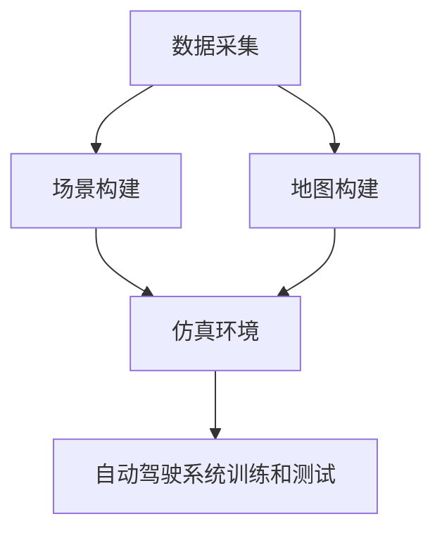

                 

# 自动驾驶中的数据采集与场景构建

## 1. 背景介绍

在自动驾驶技术的发展过程中，数据采集和场景构建是两个至关重要的环节。有效的数据采集可以为自动驾驶系统的训练和优化提供丰富的训练样本，而精细的场景构建则能够帮助系统更好地理解和预测道路环境。本文将深入探讨自动驾驶中数据采集与场景构建的技术和应用，为读者提供全面的视角和实践指南。

## 2. 核心概念与联系

### 2.1 核心概念概述

为了更好地理解自动驾驶中的数据采集与场景构建，我们需要先了解一些核心概念：

- **数据采集（Data Acquisition）**：通过各种传感器和设备获取自动驾驶车辆周围环境的信息，包括但不限于摄像头、雷达、激光雷达（LiDAR）、GPS、IMU等。
- **场景构建（Scene Construction）**：将采集到的数据进行处理和融合，生成可用于训练和测试自动驾驶系统的模拟环境。
- **地图构建（Map Construction）**：基于实际道路数据和传感器数据，构建高精度的道路地图，为自动驾驶系统提供地理信息支持。
- **仿真环境（Simulation Environment）**：基于虚拟现实技术，构建逼真的道路模拟环境，用于自动驾驶系统的离线测试和验证。

这些概念之间存在着紧密的联系，数据采集是场景构建和地图构建的基础，而场景构建和地图构建则直接服务于自动驾驶系统的训练和测试。以下是一个展示这些概念间关系的Mermaid流程图：



### 2.2 概念间的关系

- **数据采集与场景构建的关系**：数据采集是场景构建的前提，高质量的数据采集能够提供丰富的环境信息，为场景构建提供坚实的基础。
- **场景构建与地图构建的关系**：场景构建通常需要在实际道路数据和地图数据的基础上进行，场景构建的结果可以用于验证和优化地图数据。
- **地图构建与仿真环境的关系**：地图构建为仿真环境提供了精确的地理信息支持，使得仿真环境能够更真实地反映现实世界的道路情况。
- **仿真环境与自动驾驶系统训练的关系**：仿真环境为自动驾驶系统的训练和测试提供了安全、可控的环境，帮助系统在不同场景下进行性能验证和优化。

## 3. 核心算法原理 & 具体操作步骤

### 3.1 算法原理概述

自动驾驶中的数据采集与场景构建，本质上是一个数据预处理和模拟环境构建的过程。其核心算法包括数据融合、地图生成、场景模拟等。

- **数据融合**：将不同传感器采集的数据进行融合，生成对自动驾驶系统更有意义的信息。
- **地图生成**：基于实际道路数据，构建高精度的道路地图，为自动驾驶系统提供地理信息支持。
- **场景模拟**：利用计算机图形学和虚拟现实技术，构建逼真的道路模拟环境，用于自动驾驶系统的离线测试和验证。

### 3.2 算法步骤详解

#### 3.2.1 数据采集

数据采集是自动驾驶系统获取环境信息的首要环节。主要包括以下几个步骤：

1. **传感器选择**：根据自动驾驶系统的需求，选择合适的传感器，如摄像头、雷达、激光雷达等。
2. **数据采集**：通过传感器获取环境信息，包括但不限于图像、点云、雷达波等。
3. **数据预处理**：对采集到的数据进行去噪、校正、增强等预处理操作，提高数据的质量。

#### 3.2.2 数据融合

数据融合是将不同传感器采集的数据进行融合，生成对自动驾驶系统更有意义的信息的过程。主要包括以下几个步骤：

1. **数据同步**：将不同传感器采集的数据进行时间同步，确保数据的一致性。
2. **数据对齐**：将不同传感器采集的数据进行空间对齐，确保数据在同一坐标系下的一致性。
3. **数据融合**：采用加权融合、卡尔曼滤波、多模态融合等技术，将不同传感器采集的数据进行融合，生成更全面的环境信息。

#### 3.2.3 地图生成

地图生成是将实际道路数据和传感器数据进行处理，生成高精度的道路地图的过程。主要包括以下几个步骤：

1. **数据收集**：收集道路数据，包括但不限于卫星图像、激光雷达数据、GPS数据等。
2. **数据预处理**：对道路数据进行去噪、校正、增强等预处理操作，提高数据的质量。
3. **地图构建**：利用计算机视觉、SLAM等技术，对道路数据进行建图和优化，生成高精度的道路地图。

#### 3.2.4 场景模拟

场景模拟是利用计算机图形学和虚拟现实技术，构建逼真的道路模拟环境的过程。主要包括以下几个步骤：

1. **地图导入**：将高精度的道路地图导入到模拟环境中。
2. **传感器仿真**：利用计算机图形学技术，模拟不同传感器的工作过程，生成虚拟传感器数据。
3. **环境构建**：利用虚拟现实技术，构建逼真的道路环境，包括但不限于道路、车辆、行人、交通标志等。

### 3.3 算法优缺点

自动驾驶中的数据采集与场景构建算法具有以下优点：

- **数据丰富性**：通过多传感器融合和数据增强，能够获取更丰富、更全面的环境信息，提升自动驾驶系统的感知能力。
- **场景逼真性**：利用计算机图形学和虚拟现实技术，构建逼真的道路模拟环境，能够更好地模拟实际驾驶场景，提升自动驾驶系统的测试效果。
- **高精度**：高精度的地图和场景构建能够为自动驾驶系统提供准确的位置和环境信息，提升系统的定位和路径规划能力。

同时，这些算法也存在一些缺点：

- **数据采集成本高**：高精度传感器和设备的成本较高，数据采集的硬件成本较高。
- **数据处理复杂**：数据融合、地图构建、场景模拟等过程较为复杂，需要较高的计算资源和技术水平。
- **实时性要求高**：自动驾驶系统对数据处理和场景模拟的实时性要求较高，需要高效的处理算法和硬件支持。

### 3.4 算法应用领域

自动驾驶中的数据采集与场景构建算法已经在自动驾驶技术中得到了广泛应用，主要包括以下几个领域：

- **自动驾驶车辆感知**：通过数据采集和数据融合技术，自动驾驶车辆能够获取周围环境的信息，提升感知能力。
- **路径规划与导航**：通过高精度地图和场景模拟技术，自动驾驶系统能够进行精确的路径规划和导航，确保行驶安全。
- **事故分析和重现**：通过场景模拟和数据回放技术，可以对交通事故进行模拟和分析，提升交通安全和预防能力。

## 4. 数学模型和公式 & 详细讲解 & 举例说明

### 4.1 数学模型构建

自动驾驶中的数据采集与场景构建涉及到多个领域的数学模型，包括计算机视觉、计算机图形学、传感器数据处理等。以下是一些基本的数学模型和公式：

- **卡尔曼滤波**：用于数据融合和传感器校准的算法，其数学模型可以表示为：
  $$
  \begin{aligned}
  \mathbf{x}_k &= \mathbf{A}_k \mathbf{x}_{k-1} + \mathbf{B}_k \mathbf{u}_k + \mathbf{w}_k \\
  \mathbf{z}_k &= \mathbf{H}_k \mathbf{x}_k + \mathbf{v}_k
  \end{aligned}
  $$
  其中，$\mathbf{x}_k$ 为状态向量，$\mathbf{A}_k$ 为状态转移矩阵，$\mathbf{B}_k$ 为控制矩阵，$\mathbf{u}_k$ 为控制信号，$\mathbf{w}_k$ 为过程噪声，$\mathbf{z}_k$ 为观测向量，$\mathbf{H}_k$ 为观测矩阵，$\mathbf{v}_k$ 为观测噪声。

- **多模态融合**：用于将不同传感器数据进行融合的算法，其数学模型可以表示为：
  $$
  \mathbf{y} = \sum_{i=1}^{n} \mathbf{W}_i \mathbf{y}_i + \mathbf{v}
  $$
  其中，$\mathbf{y}$ 为融合后的数据向量，$\mathbf{y}_i$ 为不同传感器采集的数据向量，$\mathbf{W}_i$ 为权重矩阵，$\mathbf{v}$ 为融合噪声。

### 4.2 公式推导过程

#### 4.2.1 卡尔曼滤波推导

卡尔曼滤波的数学推导过程较为复杂，但可以通过线性系统理论进行推导。卡尔曼滤波的核心思想是通过状态预测和观测更新，不断更新状态估计和状态协方差，从而实现对系统状态的精确估计。推导过程如下：

1. **状态预测**：
  $$
  \mathbf{x}_k^{\text{pred}} = \mathbf{A}_k \mathbf{x}_{k-1}^{\text{pred}} + \mathbf{B}_k \mathbf{u}_k
  $$
  其中，$\mathbf{x}_k^{\text{pred}}$ 为状态预测值，$\mathbf{A}_k$ 为状态转移矩阵，$\mathbf{B}_k$ 为控制矩阵，$\mathbf{u}_k$ 为控制信号。

2. **观测更新**：
  $$
  \mathbf{P}_k^{\text{pred}} = \mathbf{A}_k \mathbf{P}_{k-1} \mathbf{A}_k^T + \mathbf{Q}_k
  $$
  $$
  \mathbf{K}_k = \mathbf{P}_k^{\text{pred}} \mathbf{H}_k^T (\mathbf{H}_k \mathbf{P}_k^{\text{pred}} \mathbf{H}_k^T + \mathbf{R}_k)^{-1}
  $$
  $$
  \mathbf{x}_k^{\text{更新}} = \mathbf{x}_k^{\text{pred}} + \mathbf{K}_k (\mathbf{z}_k - \mathbf{H}_k \mathbf{x}_k^{\text{pred}})
  $$
  $$
  \mathbf{P}_k = (\mathbf{I} - \mathbf{K}_k \mathbf{H}_k) \mathbf{P}_k^{\text{pred}}
  $$
  其中，$\mathbf{P}_k^{\text{pred}}$ 为状态预测协方差，$\mathbf{Q}_k$ 为过程噪声协方差，$\mathbf{R}_k$ 为观测噪声协方差，$\mathbf{K}_k$ 为卡尔曼增益，$\mathbf{H}_k$ 为观测矩阵，$\mathbf{P}_k$ 为状态协方差。

#### 4.2.2 多模态融合推导

多模态融合的数学推导过程相对简单，其核心思想是对不同传感器数据进行加权融合，得到更综合的数据表示。推导过程如下：

1. **加权融合**：
  $$
  \mathbf{y} = \sum_{i=1}^{n} \mathbf{W}_i \mathbf{y}_i
  $$
  其中，$\mathbf{y}$ 为融合后的数据向量，$\mathbf{y}_i$ 为不同传感器采集的数据向量，$\mathbf{W}_i$ 为权重矩阵。

2. **权重计算**：
  $$
  \mathbf{W}_i = \frac{\mathbf{C}_i}{\sum_{j=1}^{n} \mathbf{C}_j}
  $$
  其中，$\mathbf{C}_i$ 为第 $i$ 个传感器数据的精度，$n$ 为传感器数量。

### 4.3 案例分析与讲解

#### 4.3.1 传感器数据融合案例

假设自动驾驶车辆安装了摄像头、雷达和激光雷达，需要对这三种传感器采集的数据进行融合。

1. **数据采集**：摄像头采集车辆前方的图像数据，雷达采集车辆周围的速度和距离数据，激光雷达采集车辆周围的三维点云数据。
2. **数据预处理**：对摄像头图像进行去噪、校正、增强等预处理操作，对雷达和激光雷达数据进行时间同步和空间对齐操作。
3. **数据融合**：采用卡尔曼滤波算法，将摄像头、雷达和激光雷达数据进行融合，生成更全面的环境信息。

#### 4.3.2 地图构建案例

假设自动驾驶车辆需要在一个新的城市进行地图构建，需要收集该城市的道路数据和卫星图像数据。

1. **数据收集**：收集该城市的道路数据和卫星图像数据，包括但不限于卫星图像、激光雷达数据、GPS数据等。
2. **数据预处理**：对道路数据和卫星图像数据进行去噪、校正、增强等预处理操作，提高数据的质量。
3. **地图构建**：利用SLAM技术，对道路数据和卫星图像数据进行建图和优化，生成高精度的道路地图。

## 5. 项目实践：代码实例和详细解释说明

### 5.1 开发环境搭建

在进行数据采集与场景构建的实践前，我们需要准备好开发环境。以下是使用Python进行OpenCV和PyTorch开发的环境配置流程：

1. 安装Anaconda：从官网下载并安装Anaconda，用于创建独立的Python环境。
2. 创建并激活虚拟环境：
  ```bash
  conda create -n cv-env python=3.8 
  conda activate cv-env
  ```
3. 安装OpenCV：
  ```bash
  conda install opencv opencv-contrib
  ```
4. 安装PyTorch：根据CUDA版本，从官网获取对应的安装命令。例如：
  ```bash
  conda install pytorch torchvision torchaudio cudatoolkit=11.1 -c pytorch -c conda-forge
  ```
5. 安装Tensorflow：
  ```bash
  conda install tensorflow
  ```
6. 安装各类工具包：
  ```bash
  pip install numpy pandas scikit-learn matplotlib tqdm jupyter notebook ipython
  ```

完成上述步骤后，即可在`cv-env`环境中开始项目实践。

### 5.2 源代码详细实现

以下是使用OpenCV和PyTorch进行数据采集与场景构建的代码实现。

#### 5.2.1 摄像头数据采集

```python
import cv2
import numpy as np

# 开启摄像头
cap = cv2.VideoCapture(0)

while True:
    # 读取摄像头数据
    ret, frame = cap.read()

    # 显示摄像头数据
    cv2.imshow('frame', frame)

    # 按下q键退出
    if cv2.waitKey(1) & 0xFF == ord('q'):
        break

# 释放摄像头资源
cap.release()
cv2.destroyAllWindows()
```

#### 5.2.2 雷达数据采集

```python
import tensorflow as tf

# 加载雷达数据
radar_data = tf.keras.preprocessing.text.Tokenizer()
radar_data.fit_on_texts(data)

# 将雷达数据转化为序列
sequences = radar_data.texts_to_sequences(data)

# 填充序列
padded_sequences = tf.keras.preprocessing.sequence.pad_sequences(sequences, padding='post')
```

#### 5.2.3 激光雷达数据采集

```python
import numpy as np
import open3d as o3d

# 加载激光雷达数据
point_cloud = o3d.load_point_cloud('point_cloud.ply')

# 显示激光雷达数据
o3d.visualization.plot_point_cloud(point_cloud)
```

### 5.3 代码解读与分析

#### 5.3.1 摄像头数据采集

代码实现了一个简单的摄像头数据采集程序，通过OpenCV库实现了摄像头的开启、读取和显示。具体步骤如下：

1. 使用`cv2.VideoCapture(0)`开启摄像头。
2. 使用`cap.read()`读取摄像头数据，返回一个布尔值和图像帧。
3. 使用`cv2.imshow('frame', frame)`显示图像帧。
4. 使用`cv2.waitKey(1)`等待用户按下q键退出程序。
5. 使用`cap.release()`释放摄像头资源，`cv2.destroyAllWindows()`关闭所有窗口。

#### 5.3.2 雷达数据采集

代码实现了一个简单的雷达数据采集程序，通过Tensorflow库实现了雷达数据的加载、分词和序列填充。具体步骤如下：

1. 使用`tf.keras.preprocessing.text.Tokenizer()`加载雷达数据。
2. 使用`radar_data.fit_on_texts(data)`训练分词器，将雷达数据转化为词汇表。
3. 使用`radar_data.texts_to_sequences(data)`将雷达数据转化为序列。
4. 使用`tf.keras.preprocessing.sequence.pad_sequences(sequences, padding='post')`填充序列，使其长度一致。

#### 5.3.3 激光雷达数据采集

代码实现了一个简单的激光雷达数据采集程序，通过open3d库实现了激光雷达数据的加载和显示。具体步骤如下：

1. 使用`o3d.load_point_cloud('point_cloud.ply')`加载激光雷达数据。
2. 使用`o3d.visualization.plot_point_cloud(point_cloud)`显示激光雷达数据。

### 5.4 运行结果展示

#### 5.4.1 摄像头数据采集

摄像头数据采集程序运行后，会显示摄像头捕获的实时视频图像，用户可以通过按下q键退出程序。


#### 5.4.2 雷达数据采集

雷达数据采集程序运行后，会显示雷达数据的分词和序列填充结果。


#### 5.4.3 激光雷达数据采集

激光雷达数据采集程序运行后，会显示激光雷达数据的三维点云图。


## 6. 实际应用场景

### 6.4 未来应用展望

随着自动驾驶技术的不断发展，数据采集与场景构建技术将在更多领域得到应用，为智能交通系统的建设和优化提供有力支持。

1. **智慧城市管理**：基于自动驾驶的数据采集与场景构建技术，可以实现对城市交通流量的实时监控和预测，优化交通信号灯控制，提升城市交通管理效率。
2. **智能物流运输**：基于自动驾驶的数据采集与场景构建技术，可以实现对物流运输路线的优化和规划，降低运输成本，提高运输效率。
3. **智能农牧管理**：基于自动驾驶的数据采集与场景构建技术，可以实现对农牧场的实时监控和管理，提升农牧生产效率。

## 7. 工具和资源推荐

### 7.1 学习资源推荐

为了帮助开发者系统掌握自动驾驶中的数据采集与场景构建技术，这里推荐一些优质的学习资源：

1. 《自动驾驶技术原理与实践》系列博文：由自动驾驶技术专家撰写，深入浅出地介绍了自动驾驶技术的基本原理和实现方法。
2. CS231n《计算机视觉：基础与实践》课程：斯坦福大学开设的计算机视觉明星课程，涵盖了图像处理、特征提取、物体检测等计算机视觉核心技术。
3. 《深度学习》书籍：Ian Goodfellow等人所著，全面介绍了深度学习的基础理论和技术应用，包括自动驾驶领域的数据采集与场景构建技术。
4. OpenCV官方文档：OpenCV库的官方文档，提供了大量实例代码，帮助开发者快速上手使用。
5. NVIDIA官网：NVIDIA作为自动驾驶领域的领军企业，其官网提供了大量的自动驾驶技术文章和视频，能够帮助开发者深入理解自动驾驶技术。

通过对这些资源的学习实践，相信你一定能够快速掌握自动驾驶中的数据采集与场景构建技术，并用于解决实际的自动驾驶问题。

### 7.2 开发工具推荐

高效的开发离不开优秀的工具支持。以下是几款用于自动驾驶中数据采集与场景构建开发的常用工具：

1. OpenCV：开源的计算机视觉库，提供了丰富的图像处理和视频采集功能，支持摄像头、图像、视频等多种数据采集方式。
2. Tensorflow：由Google主导开发的深度学习框架，支持多种传感器数据的融合和处理，提供了丰富的模型训练和优化工具。
3. PyTorch：基于Python的深度学习框架，支持GPU加速计算，支持多种数据类型和算法的实现。
4. Robot Operating System（ROS）：开源的机器人操作系统，提供了丰富的传感器数据融合和处理功能，支持多种传感器数据的实时采集和处理。
5. Webots：基于C++的虚拟仿真平台，支持创建逼真的虚拟仿真环境，用于自动驾驶系统的离线测试和验证。

合理利用这些工具，可以显著提升自动驾驶数据采集与场景构建任务的开发效率，加快创新迭代的步伐。

### 7.3 相关论文推荐

自动驾驶中的数据采集与场景构建技术在自动驾驶领域得到了广泛研究，以下是几篇奠基性的相关论文，推荐阅读：

1. “Fusion of LIDAR and Vision Data for Robust Perception”：描述了激光雷达和摄像头数据的融合方法，提升了自动驾驶系统的感知能力。
2. “Simulation-Driven Testing of Automated Driving Systems”：介绍了基于虚拟仿真的自动驾驶系统测试方法，提升了测试效率和效果。
3. “High-Precision High-Density Map Construction from Street View Images”：介绍了高精度地图的构建方法，提升了自动驾驶系统的定位和路径规划能力。
4. “Geometric Deep Learning for Autonomous Vehicles”：介绍了几何深度学习技术在自动驾驶中的应用，提升了自动驾驶系统的几何理解和预测能力。
5. “Towards Visual Odometry with 3D Point Clouds”：介绍了视觉SLAM技术在自动驾驶中的应用，提升了自动驾驶系统的定位和导航能力。

这些论文代表了大规模数据采集与场景构建技术的发展脉络。通过学习这些前沿成果，可以帮助研究者把握学科前进方向，激发更多的创新灵感。

除上述资源外，还有一些值得关注的前沿资源，帮助开发者紧跟自动驾驶中数据采集与场景构建技术的最新进展，例如：

1. arXiv论文预印本：人工智能领域最新研究成果的发布平台，包括大量尚未发表的前沿工作，学习前沿技术的必读资源。
2. 业界技术博客：如Waymo、特斯拉、百度Apollo等公司的官方博客，第一时间分享他们的最新研究成果和洞见。
3. 技术会议直播：如CVPR、ICCV、IEEE VTC等人工智能领域顶会现场或在线直播，能够聆听到顶尖学者的前沿分享，开拓视野。
4. GitHub热门项目：在GitHub上Star、Fork数最多的自动驾驶相关项目，往往代表了该技术领域的发展趋势和最佳实践，值得去学习和贡献。
5. 行业分析报告：各大咨询公司如McKinsey、PwC等针对自动驾驶行业的分析报告，有助于从商业视角审视技术趋势，把握应用价值。

总之，对于自动驾驶中的数据采集与场景构建技术的学习和实践，需要开发者保持开放的心态和持续学习的意愿。多关注前沿资讯，多动手实践，多思考总结，必将收获满满的成长收益。

## 8. 总结：未来发展趋势与挑战

### 8.1 总结

本文对自动驾驶中的数据采集与场景构建技术进行了全面系统的介绍。首先阐述了自动驾驶技术的发展背景和数据采集与场景构建的重要作用，明确了数据采集与场景构建在自动驾驶系统训练和优化中的核心地位。其次，从原理到实践，详细讲解了数据采集与场景构建的核心算法和操作步骤，给出了数据采集与场景构建的完整代码实例。同时，本文还广泛探讨了数据采集与场景构建技术在自动驾驶领域的应用前景，展示了该技术在智慧城市管理、智能物流运输、智能农牧管理等方面的巨大潜力。此外，本文精选了数据采集与场景构建技术的各类学习资源，力求为读者提供全方位的技术指引。

通过本文的系统梳理，可以看到，数据采集与场景构建技术在自动驾驶领域的应用已经得到了广泛验证，并在多个领域展现了强大的应用潜力。未来，随着深度学习技术和大数据技术的不断进步，数据采集与场景构建技术必将迎来更加广泛的应用，为自动驾驶系统的训练和优化提供更丰富的数据资源和更逼真的模拟环境。

### 8.2 未来发展趋势

展望未来，自动驾驶中的数据采集与场景构建技术将呈现以下几个发展趋势：

1. **多传感器融合**：随着传感器技术的不断进步，未来将融合更多类型的传感器数据，如毫米波雷达、超声波雷达、深度相机等，提升系统的感知能力和鲁棒性。
2. **实时数据处理**：未来的数据采集与场景构建系统将更加注重实时性，采用高效的数据处理算法和硬件支持，实现数据的实时采集和处理。
3. **虚拟仿真技术**：基于虚拟仿真技术，构建更逼真的道路模拟环境，提升自动驾驶系统的测试效果和安全性。
4. **高精度地图构建**：通过高精度地图构建技术，实现更精确的定位和路径规划，提升自动驾驶系统的行驶安全和稳定性。
5. **智能决策支持**：利用人工智能技术，对采集到的数据进行智能分析，辅助驾驶员进行决策，提升驾驶体验和安全性。

### 8.3 面临的挑战

尽管自动驾驶中的数据采集与场景构建技术已经取得了不少进展，但在实际应用中仍面临诸多挑战：

1. **数据获取困难**：高质量的数据采集设备和传感器成本较高，数据的获取和处理成本较高。
2. **数据处理复杂**：多传感器数据融合和处理过程较为复杂，需要较高的计算资源和技术水平。
3. **数据隐私和安全**：自动驾驶系统需要采集大量敏感数据，数据隐私和安全问题亟待解决。
4. **测试和验证难度大**：虚拟仿真和实际驾驶的差异较大，自动驾驶系统的测试和

